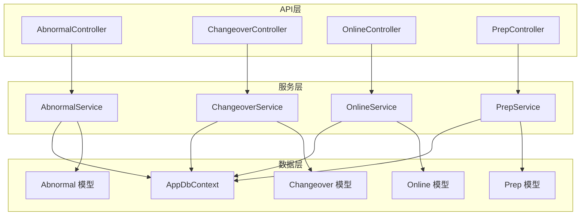
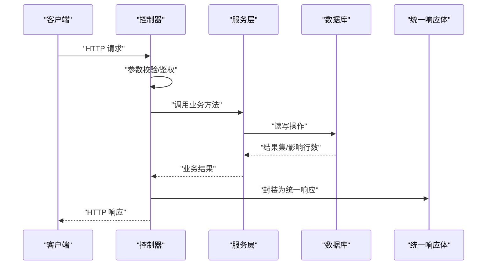
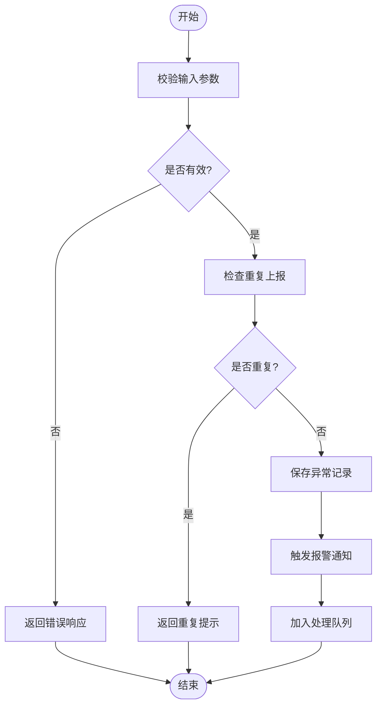
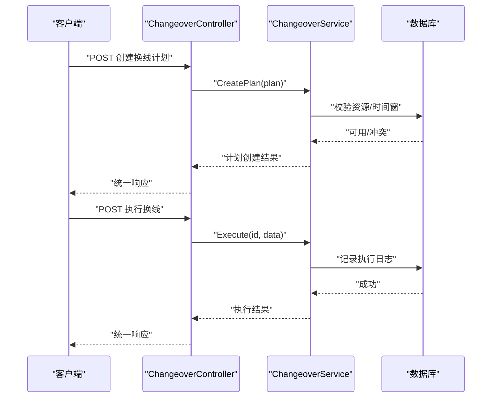
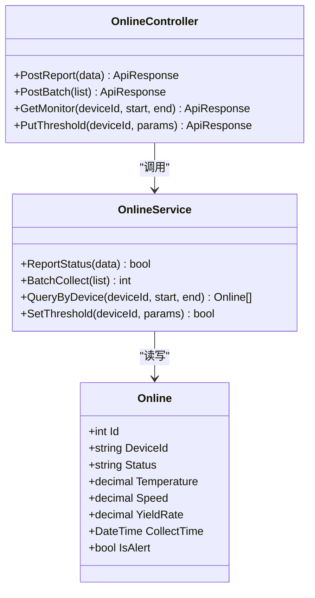
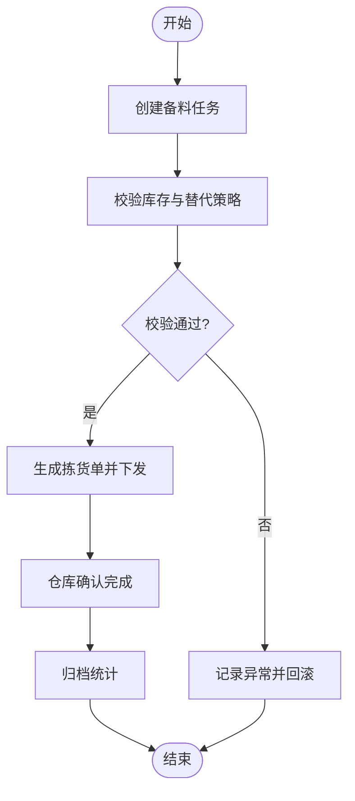
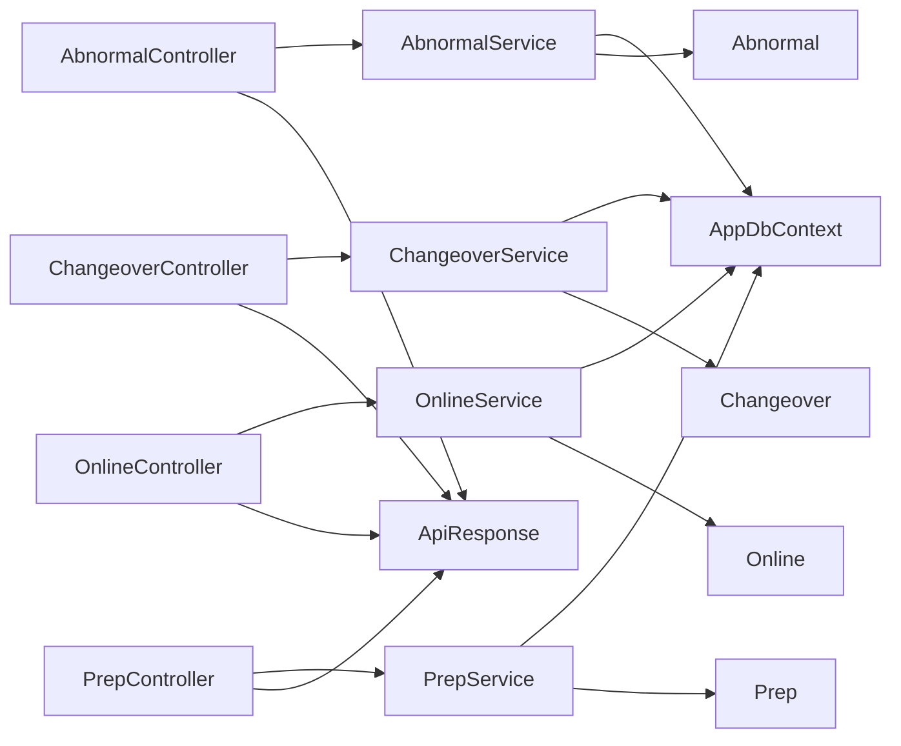

# 生产支持控制器

<cite>
**本文引用的文件**   
- [AbnormalController.cs](file://dip-system/api/Controllers/AbnormalController.cs)
- [ChangeoverController.cs](file://dip-system/api/Controllers/ChangeoverController.cs)
- [OnlineController.cs](file://dip-system/api/Controllers/OnlineController.cs)
- [PrepController.cs](file://dip-system/api/Controllers/PrepController.cs)
- [AbnormalService.cs](file://dip-system/api/Services/AbnormalService.cs)
- [ChangeoverService.cs](file://dip-system/api/Services/ChangeoverService.cs)
- [OnlineService.cs](file://dip-system/api/Services/OnlineService.cs)
- [PrepService.cs](file://dip-system/api/Services/PrepService.cs)
- [Abnormal.cs](file://dip-system/api/Models/Abnormal.cs)
- [Changeover.cs](file://dip-system/api/Models/Changeover.cs)
- [Online.cs](file://dip-system/api/Models/Online.cs)
- [Prep.cs](file://dip-system/api/Models/Prep.cs)
- [AppDbContext.cs](file://dip-system/api/Data/AppDbContext.cs)
- [ApiResponse.cs](file://dip-system/api/Models/ApiResponse.cs)
- [Program.cs](file://dip-system/api/Program.cs)
</cite>

## 目录
1. [简介](#简介)
2. [项目结构](#项目结构)
3. [核心组件](#核心组件)
4. [架构总览](#架构总览)
5. [详细组件分析](#详细组件分析)
6. [依赖关系分析](#依赖关系分析)
7. [性能考虑](#性能考虑)
8. [故障排查指南](#故障排查指南)
9. [结论](#结论)
10. [附录](#附录)

## 简介
本文件面向DIP系统“生产支持”相关控制器的使用与实现说明，覆盖以下四个关键控制器及其服务层：
- AbnormalController（异常管理）
- ChangeoverController（换线管理）
- OnlineController（在线监控）
- PrepController（备料准备）

文档将阐述各控制器的API接口、业务处理流程（异常上报与闭环、换线计划编排、设备状态实时监控、生产准备检查），并补充实时数据采集、报警通知、生产调度等高级能力。同时给出数据同步、状态管理与性能优化建议，帮助开发者快速定位问题与扩展功能。

## 项目结构
生产支持相关代码位于后端API项目中，采用典型的分层架构：
- Controllers：对外暴露REST API
- Services：封装业务逻辑
- Models：实体模型与统一响应体
- Data：数据库上下文与持久化配置
- Program：应用启动与中间件注册

图表来源
- [AbnormalController.cs](file://dip-system/api/Controllers/AbnormalController.cs)
- [ChangeoverController.cs](file://dip-system/api/Controllers/ChangeoverController.cs)
- [OnlineController.cs](file://dip-system/api/Controllers/OnlineController.cs)
- [PrepController.cs](file://dip-system/api/Controllers/PrepController.cs)
- [AbnormalService.cs](file://dip-system/api/Services/AbnormalService.cs)
- [ChangeoverService.cs](file://dip-system/api/Services/ChangeoverService.cs)
- [OnlineService.cs](file://dip-system/api/Services/OnlineService.cs)
- [PrepService.cs](file://dip-system/api/Services/PrepService.cs)
- [AppDbContext.cs](file://dip-system/api/Data/AppDbContext.cs)
- [Abnormal.cs](file://dip-system/api/Models/Abnormal.cs)
- [Changeover.cs](file://dip-system/api/Models/Changeover.cs)
- [Online.cs](file://dip-system/api/Models/Online.cs)
- [Prep.cs](file://dip-system/api/Models/Prep.cs)

章节来源
- [Program.cs](file://dip-system/api/Program.cs)
- [AppDbContext.cs](file://dip-system/api/Data/AppDbContext.cs)

## 核心组件
- 控制器职责
  - AbnormalController：提供异常记录、查询、升级、关闭等接口
  - ChangeoverController：提供换线计划创建、排程、执行、完成等接口
  - OnlineController：提供设备状态上报、查询、批量采集、告警阈值配置等接口
  - PrepController：提供备料任务创建、校验、下发、完成确认等接口
- 服务层职责
  - 对应Service负责业务规则校验、事务处理、与仓储/数据库交互、事件触发（如报警、调度）
- 模型与数据
  - 各实体模型定义字段、约束与关联
  - AppDbContext统一管理实体映射与连接

章节来源
- [AbnormalController.cs](file://dip-system/api/Controllers/AbnormalController.cs)
- [ChangeoverController.cs](file://dip-system/api/Controllers/ChangeoverController.cs)
- [OnlineController.cs](file://dip-system/api/Controllers/OnlineController.cs)
- [PrepController.cs](file://dip-system/api/Controllers/PrepController.cs)
- [AbnormalService.cs](file://dip-system/api/Services/AbnormalService.cs)
- [ChangeoverService.cs](file://dip-system/api/Services/ChangeoverService.cs)
- [OnlineService.cs](file://dip-system/api/Services/OnlineService.cs)
- [PrepService.cs](file://dip-system/api/Services/PrepService.cs)
- [Abnormal.cs](file://dip-system/api/Models/Abnormal.cs)
- [Changeover.cs](file://dip-system/api/Models/Changeover.cs)
- [Online.cs](file://dip-system/api/Models/Online.cs)
- [Prep.cs](file://dip-system/api/Models/Prep.cs)

## 架构总览
整体采用“控制器-服务-数据”三层架构，控制器仅做请求解析与参数校验，服务层承载业务逻辑，数据层通过EF Core进行持久化。统一响应体ApiResponse用于标准化返回结构。

图表来源
- [AbnormalController.cs](file://dip-system/api/Controllers/AbnormalController.cs)
- [AbnormalService.cs](file://dip-system/api/Services/AbnormalService.cs)
- [AppDbContext.cs](file://dip-system/api/Data/AppDbContext.cs)
- [ApiResponse.cs](file://dip-system/api/Models/ApiResponse.cs)

## 详细组件分析

### AbnormalController（异常管理）
- 目标
  - 提供异常上报、分级、跟踪、升级、关闭的完整生命周期管理
- 典型接口
  - 新增异常：接收设备、产线、异常类型、描述、严重等级、时间戳等
  - 查询异常：按条件分页、筛选、排序
  - 升级异常：根据SLA自动或手动升级
  - 关闭异常：记录处理人、处理措施、耗时
- 业务流程
  - 异常上报 -> 校验与去重 -> 落库 -> 触发报警通知 -> 进入待处理队列
  - 处理中 -> 更新进度 -> 必要时升级
  - 已关闭 -> 归档统计
- 数据模型要点
  - 异常ID、设备/产线标识、类型、严重等级、状态机（待处理/处理中/已升级/已关闭）、处理人、时间戳、备注
- 错误处理
  - 参数缺失、重复上报、权限不足、超时重试策略

图表来源
- [AbnormalController.cs](file://dip-system/api/Controllers/AbnormalController.cs)
- [AbnormalService.cs](file://dip-system/api/Services/AbnormalService.cs)
- [Abnormal.cs](file://dip-system/api/Models/Abnormal.cs)

章节来源
- [AbnormalController.cs](file://dip-system/api/Controllers/AbnormalController.cs)
- [AbnormalService.cs](file://dip-system/api/Services/AbnormalService.cs)
- [Abnormal.cs](file://dip-system/api/Models/Abnormal.cs)

### ChangeoverController（换线管理）
- 目标
  - 管理产品换线计划，包括计划创建、排程、执行、完成与复盘
- 典型接口
  - 创建换线计划：目标产品、旧产品、切换时间窗、所需资源、注意事项
  - 排程与下发：选择执行时段、分配人员与设备
  - 执行与完成：记录实际开始/结束时间、偏差、原因
  - 查询与报表：按产线/时间段统计换线效率
- 业务流程
  - 计划创建 -> 资源校验 -> 排程 -> 下发执行 -> 过程记录 -> 完成确认 -> 复盘归档
- 数据模型要点
  - 换线ID、新旧产品、计划时间、实际时间、状态、责任人、资源占用、偏差原因
- 错误处理
  - 资源冲突、时间窗不可用、权限不足、执行超时

图表来源
- [ChangeoverController.cs](file://dip-system/api/Controllers/ChangeoverController.cs)
- [ChangeoverService.cs](file://dip-system/api/Services/ChangeoverService.cs)
- [Changeover.cs](file://dip-system/api/Models/Changeover.cs)

章节来源
- [ChangeoverController.cs](file://dip-system/api/Controllers/ChangeoverController.cs)
- [ChangeoverService.cs](file://dip-system/api/Services/ChangeoverService.cs)
- [Changeover.cs](file://dip-system/api/Models/Changeover.cs)

### OnlineController（在线监控）
- 目标
  - 实时采集设备状态、运行参数与告警信息，提供查询与阈值配置
- 典型接口
  - 上报状态：设备ID、状态码、温度/速度/良率等指标、时间戳
  - 批量采集：批量上报以提高吞吐
  - 查询监控：按设备/时间范围聚合展示
  - 阈值配置：设置告警阈值与通知策略
- 业务流程
  - 数据上报 -> 校验与清洗 -> 写入时序/快照表 -> 阈值判断 -> 触发告警 -> 推送通知
- 数据模型要点
  - 设备ID、状态枚举、指标集合、采集时间、告警标志、批次号
- 错误处理
  - 非法状态码、数据越界、重复上报、限流保护

图表来源
- [OnlineController.cs](file://dip-system/api/Controllers/OnlineController.cs)
- [OnlineService.cs](file://dip-system/api/Services/OnlineService.cs)
- [Online.cs](file://dip-system/api/Models/Online.cs)

章节来源
- [OnlineController.cs](file://dip-system/api/Controllers/OnlineController.cs)
- [OnlineService.cs](file://dip-system/api/Services/OnlineService.cs)
- [Online.cs](file://dip-system/api/Models/Online.cs)

### PrepController（备料准备）
- 目标
  - 管理生产前的物料准备任务，确保物料齐套与可用性
- 典型接口
  - 创建备料任务：订单/工单、物料清单、数量、截止时间
  - 备料校验：库存核对、替代料策略、批次追溯
  - 任务下发与完成：仓库拣货、确认、异常反馈
  - 查询与统计：按工单/产线/时间维度统计备料完成率
- 业务流程
  - 任务创建 -> 物料校验 -> 生成拣货单 -> 仓库作业 -> 完成确认 -> 异常回滚
- 数据模型要点
  - 任务ID、工单/订单号、物料明细、数量、状态、责任人、时间戳、异常原因
- 错误处理
  - 库存不足、批次不匹配、权限不足、超时未处理

图表来源
- [PrepController.cs](file://dip-system/api/Controllers/PrepController.cs)
- [PrepService.cs](file://dip-system/api/Services/PrepService.cs)
- [Prep.cs](file://dip-system/api/Models/Prep.cs)

章节来源
- [PrepController.cs](file://dip-system/api/Controllers/PrepController.cs)
- [PrepService.cs](file://dip-system/api/Services/PrepService.cs)
- [Prep.cs](file://dip-system/api/Models/Prep.cs)

## 依赖关系分析
- 控制器与服务层解耦：控制器仅负责入参校验与响应封装，服务层承载业务规则与事务边界
- 数据访问：通过AppDbContext统一访问数据库，实体模型与数据库表映射清晰
- 统一响应：ApiResponse作为标准返回结构，便于前端一致化处理
- 外部集成点：报警通知、调度任务、消息推送等可通过服务层扩展

图表来源
- [AbnormalController.cs](file://dip-system/api/Controllers/AbnormalController.cs)
- [ChangeoverController.cs](file://dip-system/api/Controllers/ChangeoverController.cs)
- [OnlineController.cs](file://dip-system/api/Controllers/OnlineController.cs)
- [PrepController.cs](file://dip-system/api/Controllers/PrepController.cs)
- [AbnormalService.cs](file://dip-system/api/Services/AbnormalService.cs)
- [ChangeoverService.cs](file://dip-system/api/Services/ChangeoverService.cs)
- [OnlineService.cs](file://dip-system/api/Services/OnlineService.cs)
- [PrepService.cs](file://dip-system/api/Services/PrepService.cs)
- [AppDbContext.cs](file://dip-system/api/Data/AppDbContext.cs)
- [Abnormal.cs](file://dip-system/api/Models/Abnormal.cs)
- [Changeover.cs](file://dip-system/api/Models/Changeover.cs)
- [Online.cs](file://dip-system/api/Models/Online.cs)
- [Prep.cs](file://dip-system/api/Models/Prep.cs)
- [ApiResponse.cs](file://dip-system/api/Models/ApiResponse.cs)

章节来源
- [AppDbContext.cs](file://dip-system/api/Data/AppDbContext.cs)
- [ApiResponse.cs](file://dip-system/api/Models/ApiResponse.cs)

## 性能考虑
- 实时数据采集
  - 使用批量上报接口减少网络往返
  - 对高频指标采用异步写入与批处理提交
- 查询优化
  - 对常用查询字段建立索引（设备ID、时间戳、状态码）
  - 分页与过滤结合，避免全表扫描
- 缓存策略
  - 对热点配置（如阈值、字典）使用内存缓存
  - 合理设置过期时间与失效策略
- 并发与限流
  - 对上报接口实施令牌桶或滑动窗口限流
  - 使用分布式锁防止重复上报与资源冲突
- 事务与一致性
  - 在关键业务（换线执行、备料完成）中使用短事务保证一致性
  - 失败重试与补偿机制

[本节为通用指导，无需特定文件引用]

## 故障排查指南
- 常见问题
  - 参数校验失败：检查必填字段、数据类型、取值范围
  - 重复上报：检查唯一键与幂等设计
  - 权限不足：检查用户角色与接口授权
  - 超时与重试：检查数据库连接池、外部服务可用性
- 诊断步骤
  - 查看控制器日志与异常堆栈
  - 检查服务层事务与数据库影响行数
  - 验证模型映射与字段约束
  - 使用统一响应体中的错误码与消息定位问题
- 恢复策略
  - 重试与退避策略
  - 降级与熔断
  - 人工干预与数据修复

章节来源
- [AbnormalController.cs](file://dip-system/api/Controllers/AbnormalController.cs)
- [ChangeoverController.cs](file://dip-system/api/Controllers/ChangeoverController.cs)
- [OnlineController.cs](file://dip-system/api/Controllers/OnlineController.cs)
- [PrepController.cs](file://dip-system/api/Controllers/PrepController.cs)

## 结论
通过对AbnormalController、ChangeoverController、OnlineController、PrepController的系统化梳理，明确了各自API职责、业务流程与技术实现要点。结合统一响应体、分层架构与数据模型，可高效扩展报警通知、生产调度与实时采集等高级功能。建议在后续迭代中持续优化查询性能、完善限流与容错机制，提升系统稳定性与可维护性。

[本节为总结性内容，无需特定文件引用]

## 附录
- 术语解释
  - 异常：生产过程中的设备或工艺异常事件
  - 换线：从一种产品切换到另一种产品的生产准备与执行
  - 在线监控：设备运行状态的实时采集与展示
  - 备料准备：生产前物料齐套与可用性保障
- 参考文件
  - 控制器与服务层文件路径见“本文引用的文件”列表
  - 模型与数据上下文见对应文件

[本节为补充信息，无需特定文件引用]