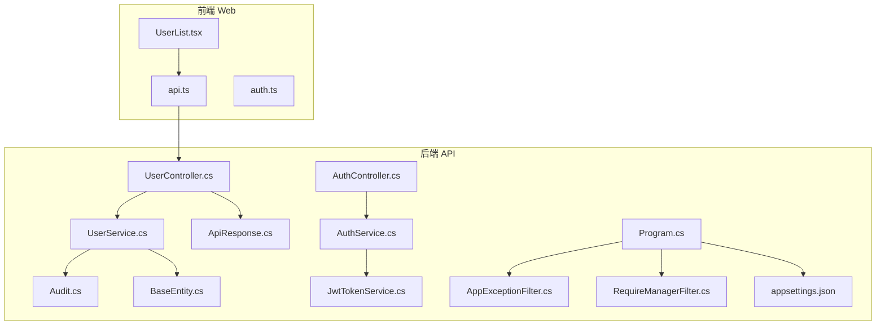
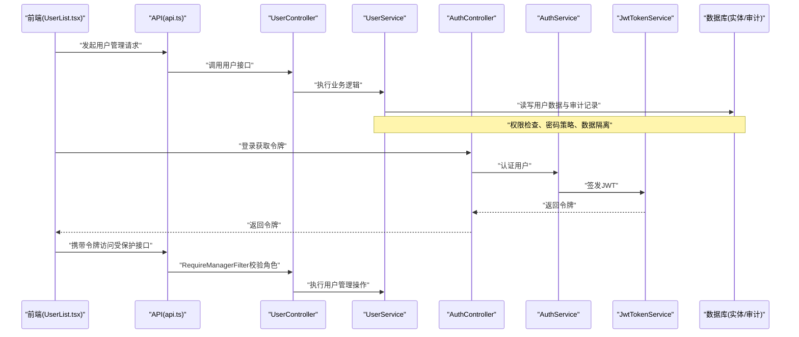
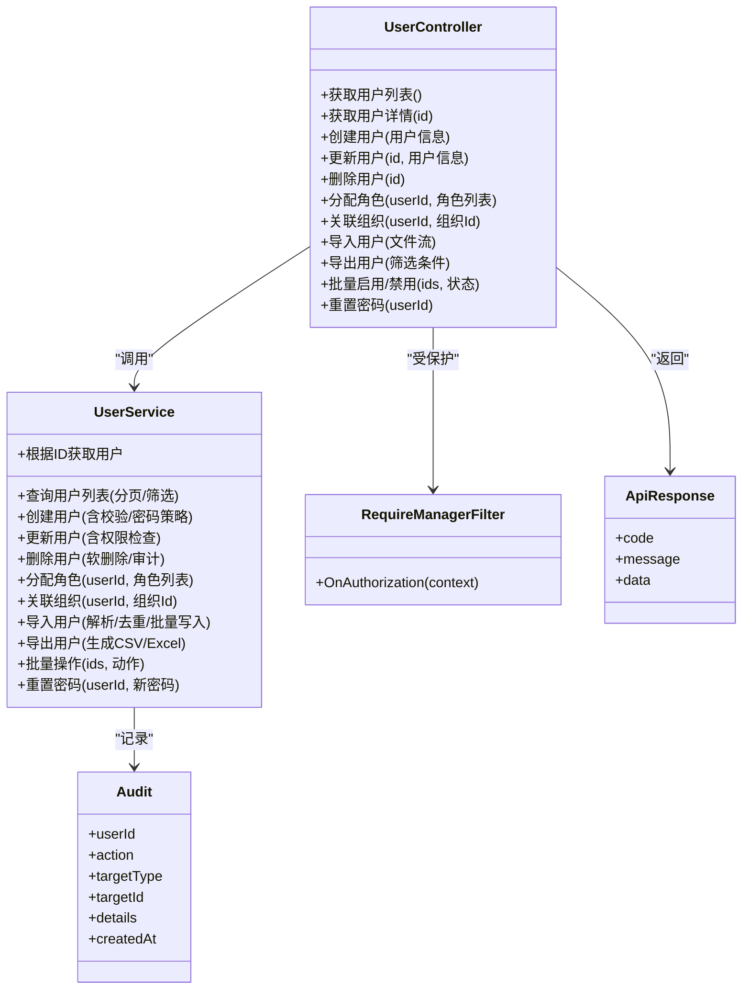
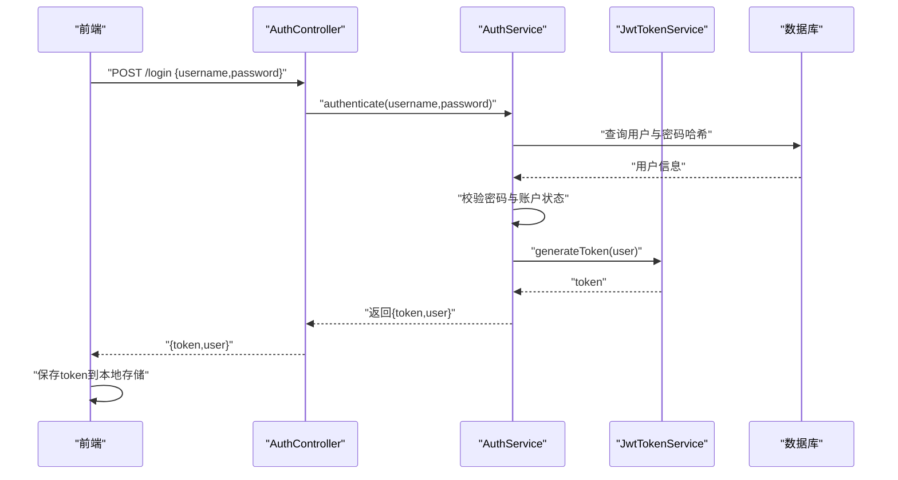
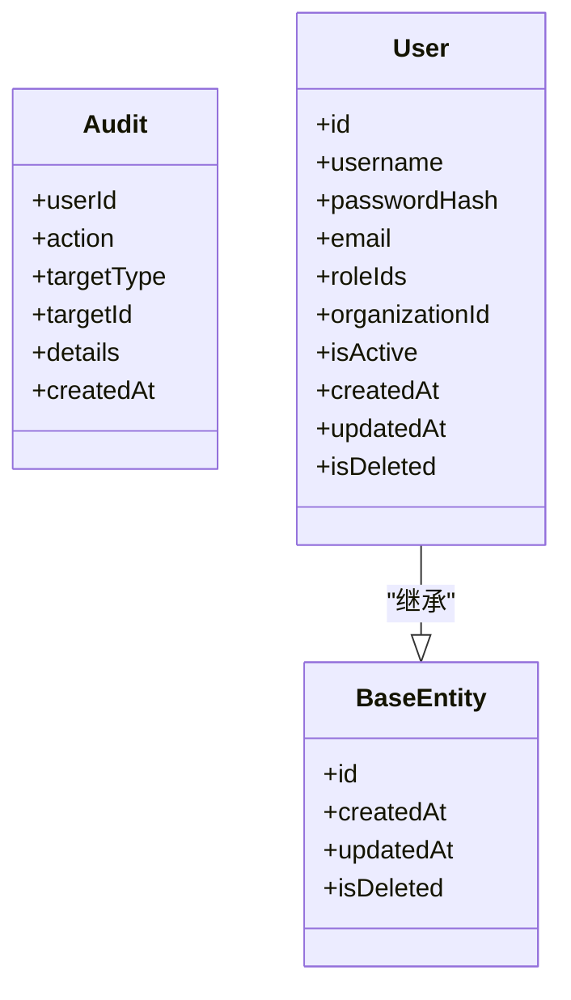
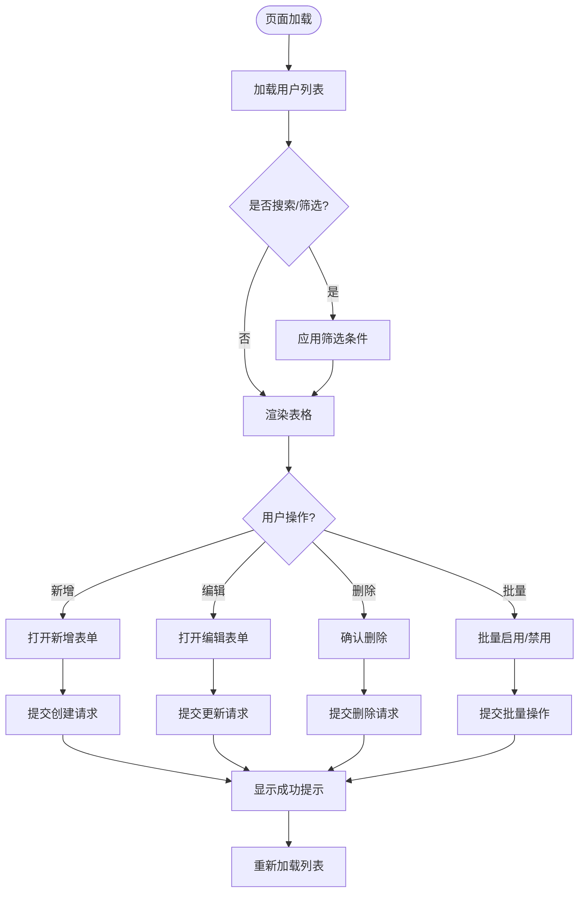
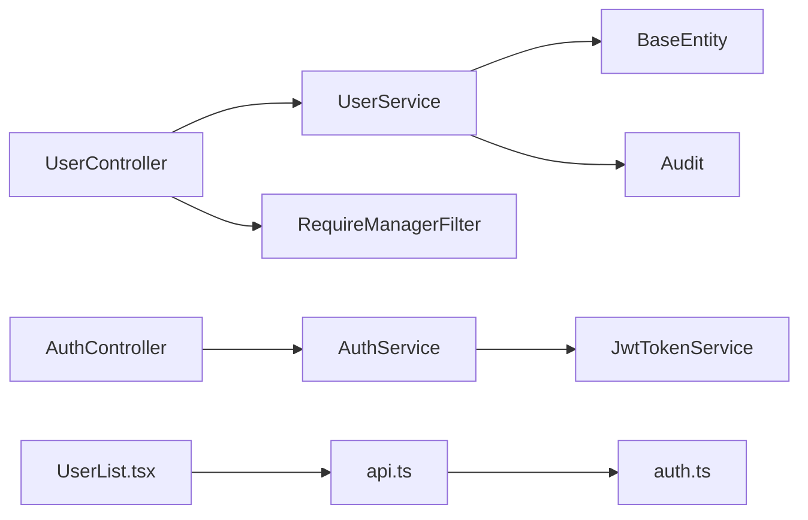

# 用户管理控制器

<cite>
**本文引用的文件**   
- [UserController.cs](file://dip-system/api/Controllers/UserController.cs)
- [UserService.cs](file://dip-system/api/Services/UserService.cs)
- [AuthController.cs](file://dip-system/api/Controllers/AuthController.cs)
- [AuthService.cs](file://dip-system/api/Services/AuthService.cs)
- [JwtTokenService.cs](file://dip-system/api/Services/JwtTokenService.cs)
- [AppExceptionFilter.cs](file://dip-system/api/Controllers/AppExceptionFilter.cs)
- [RequireManagerFilter.cs](file://dip-system/api/Controllers/RequireManagerFilter.cs)
- [ApiResponse.cs](file://dip-system/api/Models/ApiResponse.cs)
- [Audit.cs](file://dip-system/api/Models/Audit.cs)
- [BaseEntity.cs](file://dip-system/api/Models/BaseEntity.cs)
- [Program.cs](file://dip-system/api/Program.cs)
- [appsettings.json](file://dip-system/api/appsettings.json)
- [UserList.tsx](file://dip-system/frontend-web/src/pages/UserList.tsx)
- [api.ts](file://dip-system/frontend-web/src/lib/api.ts)
- [auth.ts](file://dip-system/frontend-web/src/lib/auth.ts)
</cite>

## 目录
1. [简介](#简介)
2. [项目结构](#项目结构)
3. [核心组件](#核心组件)
4. [架构总览](#架构总览)
5. [详细组件分析](#详细组件分析)
6. [依赖关系分析](#依赖关系分析)
7. [性能考虑](#性能考虑)
8. [故障排查指南](#故障排查指南)
9. [结论](#结论)
10. [附录：API与使用示例](#附录api与使用示例)

## 简介
本文件面向DIP系统的“用户管理控制器”模块，聚焦于UserController及其相关服务、模型与安全机制。文档覆盖以下主题：
- 用户CRUD操作（创建、查询、更新、删除）
- 角色与权限管理、组织架构维护
- 认证授权流程、权限继承与数据隔离
- 用户导入导出、批量操作、审计跟踪
- 密码策略、账户锁定、安全审计
- 完整的用户管理API定义与前端使用示例

本说明旨在帮助开发者与运维人员快速理解并正确使用用户管理功能，同时为后续扩展与维护提供清晰的技术参考。

## 项目结构
用户管理相关的后端代码主要位于dip-system/api目录下，包含控制器、服务、模型与中间件；前端代码位于dip-system/frontend-web/src，包含用户列表页面与通用API封装。

图表来源
- [UserController.cs](file://dip-system/api/Controllers/UserController.cs)
- [UserService.cs](file://dip-system/api/Services/UserService.cs)
- [AuthController.cs](file://dip-system/api/Controllers/AuthController.cs)
- [AuthService.cs](file://dip-system/api/Services/AuthService.cs)
- [JwtTokenService.cs](file://dip-system/api/Services/JwtTokenService.cs)
- [AppExceptionFilter.cs](file://dip-system/api/Controllers/AppExceptionFilter.cs)
- [RequireManagerFilter.cs](file://dip-system/api/Controllers/RequireManagerFilter.cs)
- [ApiResponse.cs](file://dip-system/api/Models/ApiResponse.cs)
- [Audit.cs](file://dip-system/api/Models/Audit.cs)
- [BaseEntity.cs](file://dip-system/api/Models/BaseEntity.cs)
- [Program.cs](file://dip-system/api/Program.cs)
- [appsettings.json](file://dip-system/api/appsettings.json)
- [UserList.tsx](file://dip-system/frontend-web/src/pages/UserList.tsx)
- [api.ts](file://dip-system/frontend-web/src/lib/api.ts)
- [auth.ts](file://dip-system/frontend-web/src/lib/auth.ts)

章节来源
- [Program.cs](file://dip-system/api/Program.cs)
- [appsettings.json](file://dip-system/api/appsettings.json)

## 核心组件
- UserController：暴露用户管理的HTTP接口，包括用户CRUD、角色分配、组织关联、导入导出、批量操作等。
- UserService：实现用户业务逻辑，负责数据访问、校验、权限检查、审计记录、密码策略执行等。
- AuthController/AuthService/JwtTokenService：处理登录认证、令牌签发与验证、会话状态管理。
- RequireManagerFilter：基于角色的访问控制（RBAC）过滤器，用于限制管理员或特定角色对敏感接口的访问。
- AppExceptionFilter：全局异常处理，统一错误响应格式。
- ApiResponse：统一的API响应结构。
- Audit/BaseEntity：审计日志与实体基类，支持创建时间、更新时间、软删除等通用字段。

章节来源
- [UserController.cs](file://dip-system/api/Controllers/UserController.cs)
- [UserService.cs](file://dip-system/api/Services/UserService.cs)
- [AuthController.cs](file://dip-system/api/Controllers/AuthController.cs)
- [AuthService.cs](file://dip-system/api/Services/AuthService.cs)
- [JwtTokenService.cs](file://dip-system/api/Services/JwtTokenService.cs)
- [RequireManagerFilter.cs](file://dip-system/api/Controllers/RequireManagerFilter.cs)
- [AppExceptionFilter.cs](file://dip-system/api/Controllers/AppExceptionFilter.cs)
- [ApiResponse.cs](file://dip-system/api/Models/ApiResponse.cs)
- [Audit.cs](file://dip-system/api/Models/Audit.cs)
- [BaseEntity.cs](file://dip-system/api/Models/BaseEntity.cs)

## 架构总览
用户管理模块采用典型的分层架构：控制器层接收请求并做参数校验，服务层执行业务逻辑与权限检查，数据层通过实体与审计模型持久化。认证授权由JWT与服务端过滤器共同完成，确保只有具备相应角色的用户才能访问敏感接口。

图表来源
- [UserList.tsx](file://dip-system/frontend-web/src/pages/UserList.tsx)
- [api.ts](file://dip-system/frontend-web/src/lib/api.ts)
- [UserController.cs](file://dip-system/api/Controllers/UserController.cs)
- [UserService.cs](file://dip-system/api/Services/UserService.cs)
- [AuthController.cs](file://dip-system/api/Controllers/AuthController.cs)
- [AuthService.cs](file://dip-system/api/Services/AuthService.cs)
- [JwtTokenService.cs](file://dip-system/api/Services/JwtTokenService.cs)

## 详细组件分析

### 用户控制器（UserController）
- 职责：提供用户管理的HTTP接口，包括用户增删改查、角色分配、组织关联、导入导出、批量操作、状态切换（启用/禁用）、密码重置等。
- 安全：通过RequireManagerFilter进行角色校验，仅允许管理员或指定角色访问。
- 输入输出：统一使用ApiResponse封装成功与失败响应，包含消息、数据与状态码。
- 审计：所有写操作均记录审计日志，便于追踪与合规审查。

图表来源
- [UserController.cs](file://dip-system/api/Controllers/UserController.cs)
- [UserService.cs](file://dip-system/api/Services/UserService.cs)
- [RequireManagerFilter.cs](file://dip-system/api/Controllers/RequireManagerFilter.cs)
- [ApiResponse.cs](file://dip-system/api/Models/ApiResponse.cs)
- [Audit.cs](file://dip-system/api/Models/Audit.cs)

章节来源
- [UserController.cs](file://dip-system/api/Controllers/UserController.cs)
- [UserService.cs](file://dip-system/api/Services/UserService.cs)
- [RequireManagerFilter.cs](file://dip-system/api/Controllers/RequireManagerFilter.cs)
- [ApiResponse.cs](file://dip-system/api/Models/ApiResponse.cs)
- [Audit.cs](file://dip-system/api/Models/Audit.cs)

### 认证与授权（AuthController/AuthService/JwtTokenService）
- 认证流程：前端调用登录接口，服务端验证用户名与密码，成功后签发JWT令牌，客户端在后续请求中携带令牌。
- 授权机制：RequireManagerFilter在控制器方法前校验用户角色，未通过则拒绝访问。
- 令牌管理：JwtTokenService负责令牌生成、验证与过期处理。

图表来源
- [AuthController.cs](file://dip-system/api/Controllers/AuthController.cs)
- [AuthService.cs](file://dip-system/api/Services/AuthService.cs)
- [JwtTokenService.cs](file://dip-system/api/Services/JwtTokenService.cs)

章节来源
- [AuthController.cs](file://dip-system/api/Controllers/AuthController.cs)
- [AuthService.cs](file://dip-system/api/Services/AuthService.cs)
- [JwtTokenService.cs](file://dip-system/api/Services/JwtTokenService.cs)

### 数据模型与审计（BaseEntity/Audit）
- BaseEntity：提供通用字段如创建时间、更新时间、软删除标记等，所有实体继承该基类以保持一致性。
- Audit：记录关键操作的审计信息，包括操作人、操作类型、目标对象、详情与时间戳。

图表来源
- [BaseEntity.cs](file://dip-system/api/Models/BaseEntity.cs)
- [Audit.cs](file://dip-system/api/Models/Audit.cs)

章节来源
- [BaseEntity.cs](file://dip-system/api/Models/BaseEntity.cs)
- [Audit.cs](file://dip-system/api/Models/Audit.cs)

### 前端集成（UserList.tsx/api.ts/auth.ts）
- UserList.tsx：用户管理界面，提供用户列表展示、搜索、分页、新增、编辑、删除、批量操作等功能。
- api.ts：封装HTTP请求，统一处理鉴权头、错误响应与重试逻辑。
- auth.ts：管理登录状态、令牌存储与刷新。

图表来源
- [UserList.tsx](file://dip-system/frontend-web/src/pages/UserList.tsx)
- [api.ts](file://dip-system/frontend-web/src/lib/api.ts)
- [auth.ts](file://dip-system/frontend-web/src/lib/auth.ts)

章节来源
- [UserList.tsx](file://dip-system/frontend-web/src/pages/UserList.tsx)
- [api.ts](file://dip-system/frontend-web/src/lib/api.ts)
- [auth.ts](file://dip-system/frontend-web/src/lib/auth.ts)

## 依赖关系分析
- 控制器依赖服务：UserController依赖UserService执行具体业务逻辑。
- 服务依赖模型：UserService依赖BaseEntity与Audit进行数据持久化与审计记录。
- 认证依赖JWT：AuthService依赖JwtTokenService签发与验证令牌。
- 过滤器依赖配置：RequireManagerFilter依赖系统配置的角色白名单。
- 前端依赖API封装：UserList.tsx通过api.ts发起请求，auth.ts管理令牌。

图表来源
- [UserController.cs](file://dip-system/api/Controllers/UserController.cs)
- [UserService.cs](file://dip-system/api/Services/UserService.cs)
- [BaseEntity.cs](file://dip-system/api/Models/BaseEntity.cs)
- [Audit.cs](file://dip-system/api/Models/Audit.cs)
- [AuthController.cs](file://dip-system/api/Controllers/AuthController.cs)
- [AuthService.cs](file://dip-system/api/Services/AuthService.cs)
- [JwtTokenService.cs](file://dip-system/api/Services/JwtTokenService.cs)
- [RequireManagerFilter.cs](file://dip-system/api/Controllers/RequireManagerFilter.cs)
- [UserList.tsx](file://dip-system/frontend-web/src/pages/UserList.tsx)
- [api.ts](file://dip-system/frontend-web/src/lib/api.ts)
- [auth.ts](file://dip-system/frontend-web/src/lib/auth.ts)

章节来源
- [UserController.cs](file://dip-system/api/Controllers/UserController.cs)
- [UserService.cs](file://dip-system/api/Services/UserService.cs)
- [BaseEntity.cs](file://dip-system/api/Models/BaseEntity.cs)
- [Audit.cs](file://dip-system/api/Models/Audit.cs)
- [AuthController.cs](file://dip-system/api/Controllers/AuthController.cs)
- [AuthService.cs](file://dip-system/api/Services/AuthService.cs)
- [JwtTokenService.cs](file://dip-system/api/Services/JwtTokenService.cs)
- [RequireManagerFilter.cs](file://dip-system/api/Controllers/RequireManagerFilter.cs)
- [UserList.tsx](file://dip-system/frontend-web/src/pages/UserList.tsx)
- [api.ts](file://dip-system/frontend-web/src/lib/api.ts)
- [auth.ts](file://dip-system/frontend-web/src/lib/auth.ts)

## 性能考虑
- 分页与筛选：用户列表接口应支持分页与高效筛选，避免全量加载。
- 批量操作：导入导出与批量操作建议使用异步任务与事务，减少锁竞争。
- 缓存策略：对频繁读取的静态数据（如角色列表）可引入内存缓存。
- 索引优化：对用户表的关键字段（用户名、邮箱、组织ID）建立索引以提升查询性能。
- 审计记录：审计写入可采用异步队列，避免阻塞主业务流程。

[本节为通用指导，不直接分析具体文件]

## 故障排查指南
- 全局异常处理：AppExceptionFilter统一捕获异常并返回标准错误响应，便于前端展示与日志分析。
- 常见错误：
  - 认证失败：检查用户名、密码与账户状态，确认JWT配置正确。
  - 权限不足：确认用户角色是否符合RequireManagerFilter要求。
  - 数据冲突：导入时注意唯一性约束（如用户名、邮箱），避免重复插入。
  - 审计缺失：检查审计写入是否成功，确认数据库连接与权限。
- 调试建议：开启详细日志，查看请求链路与服务端异常堆栈。

章节来源
- [AppExceptionFilter.cs](file://dip-system/api/Controllers/AppExceptionFilter.cs)

## 结论
用户管理控制器模块提供了完整的用户CRUD、角色权限、组织架构、导入导出、批量操作与审计能力，结合JWT认证与RBAC过滤器，实现了安全可控的用户管理体系。通过合理的数据模型设计、性能优化与故障排查策略，系统具备良好的可扩展性与可维护性。

[本节为总结，不直接分析具体文件]

## 附录：API与使用示例

### 用户管理API定义
- 获取用户列表：GET /api/users?pageSize=...&page=...&keyword=...
- 获取用户详情：GET /api/users/{id}
- 创建用户：POST /api/users
- 更新用户：PUT /api/users/{id}
- 删除用户：DELETE /api/users/{id}
- 分配角色：POST /api/users/{id}/roles
- 关联组织：PUT /api/users/{id}/organization
- 导入用户：POST /api/users/import (multipart/form-data)
- 导出用户：GET /api/users/export?filters=...
- 批量操作：POST /api/users/batch (启用/禁用)
- 重置密码：POST /api/users/{id}/reset-password

### 认证API定义
- 登录：POST /api/auth/login
- 刷新令牌：POST /api/auth/refresh-token
- 登出：POST /api/auth/logout

### 使用示例（前端）
- 登录流程：调用登录接口获取令牌，保存到本地存储，后续请求自动携带。
- 用户列表：分页加载，支持关键词搜索与状态筛选。
- 新增用户：填写必填字段，提交后刷新列表。
- 编辑用户：预填充数据，修改后保存。
- 删除用户：确认后执行软删除。
- 批量操作：勾选多个用户，执行批量启用/禁用。
- 导入导出：上传CSV/Excel文件导入，导出当前筛选结果。

章节来源
- [UserController.cs](file://dip-system/api/Controllers/UserController.cs)
- [AuthController.cs](file://dip-system/api/Controllers/AuthController.cs)
- [UserList.tsx](file://dip-system/frontend-web/src/pages/UserList.tsx)
- [api.ts](file://dip-system/frontend-web/src/lib/api.ts)
- [auth.ts](file://dip-system/frontend-web/src/lib/auth.ts)