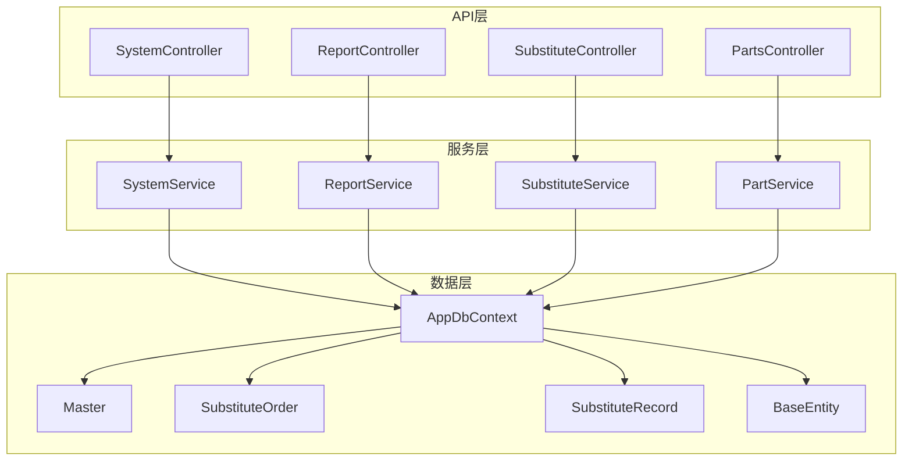
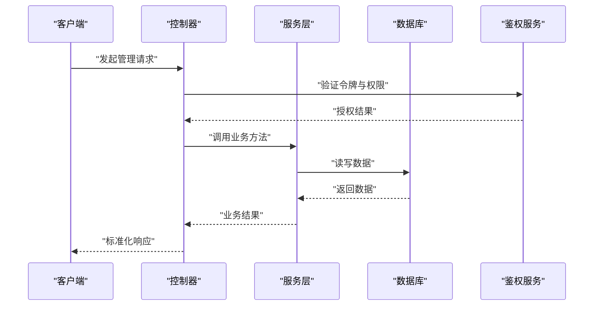
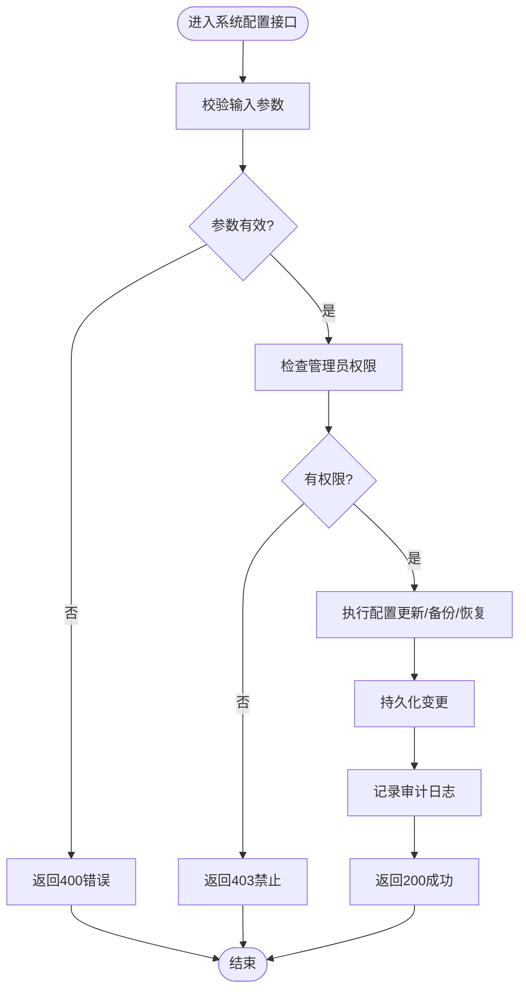
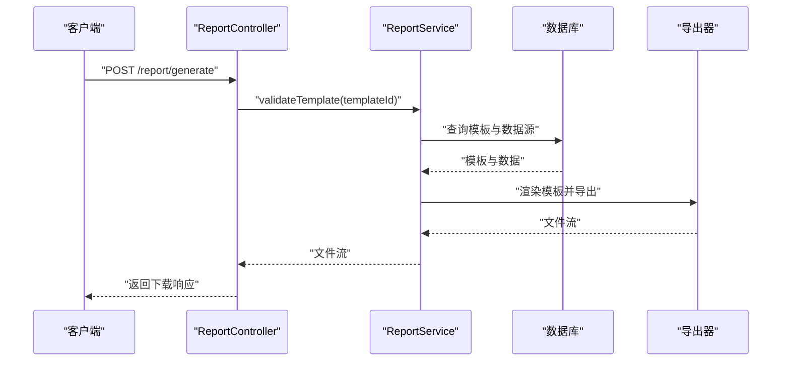
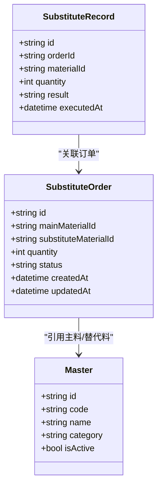
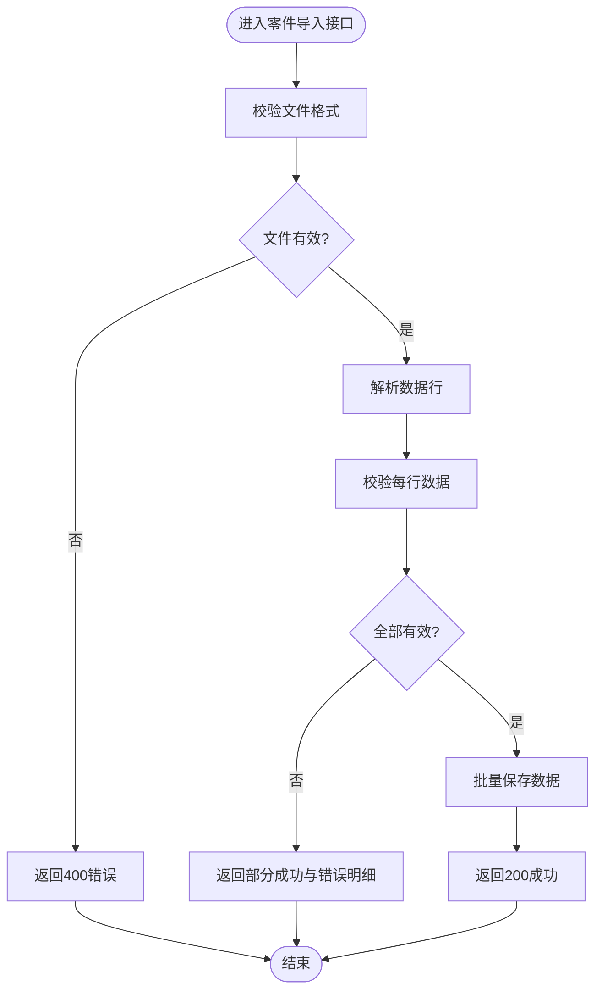
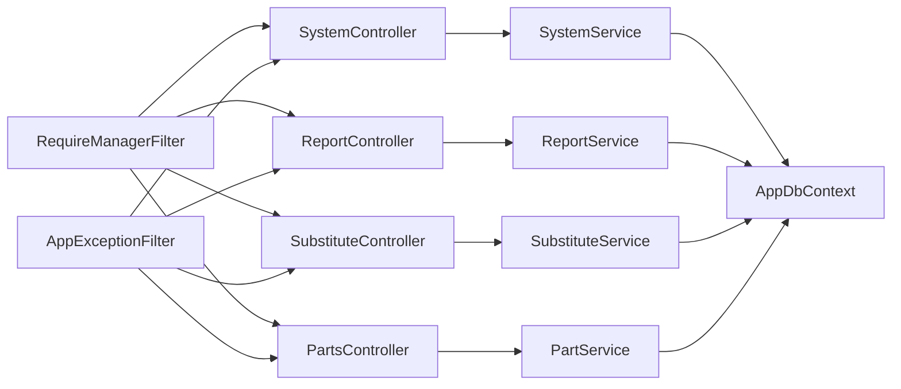

# 系统管理控制器

<cite>
**本文引用的文件**   
- [SystemController.cs](file://dip-system/api/Controllers/SystemController.cs)
- [ReportController.cs](file://dip-system/api/Controllers/ReportController.cs)
- [SubstituteController.cs](file://dip-system/api/Controllers/SubstituteController.cs)
- [PartsController.cs](file://dip-system/api/Controllers/PartsController.cs)
- [SystemService.cs](file://dip-system/api/Services/SystemService.cs)
- [ReportService.cs](file://dip-system/api/Services/ReportService.cs)
- [SubstituteService.cs](file://dip-system/api/Services/SubstituteService.cs)
- [PartService.cs](file://dip-system/api/Services/PartService.cs)
- [AppDbContext.cs](file://dip-system/api/Data/AppDbContext.cs)
- [ApiResponse.cs](file://dip-system/api/Models/ApiResponse.cs)
- [Master.cs](file://dip-system/api/Models/Master.cs)
- [SubstituteOrder.cs](file://dip-system/api/Models/SubstituteOrder.cs)
- [SubstituteRecord.cs](file://dip-system/api/Models/SubstituteRecord.cs)
- [BaseEntity.cs](file://dip-system/api/Models/BaseEntity.cs)
- [AuthController.cs](file://dip-system/api/Controllers/AuthController.cs)
- [JwtTokenService.cs](file://dip-system/api/Services/JwtTokenService.cs)
- [RequireManagerFilter.cs](file://dip-system/api/Controllers/RequireManagerFilter.cs)
- [AppExceptionFilter.cs](file://dip-system/api/Controllers/AppExceptionFilter.cs)
- [Program.cs](file://dip-system/api/Program.cs)
- [appsettings.json](file://dip-system/api/appsettings.json)
</cite>

## 目录
1. [简介](#简介)
2. [项目结构](#项目结构)
3. [核心组件](#核心组件)
4. [架构总览](#架构总览)
5. [详细组件分析](#详细组件分析)
6. [依赖关系分析](#依赖关系分析)
7. [性能考虑](#性能考虑)
8. [故障排查指南](#故障排查指南)
9. [结论](#结论)
10. [附录](#附录)

## 简介
本文件面向DIP系统的“系统管理”相关控制器，聚焦以下四个控制器的API与业务逻辑：
- SystemController：系统配置、参数管理、监控与运维（日志、备份恢复等）
- ReportController：报表生成、模板管理与数据导出
- SubstituteController：替代料规则引擎、替代订单与记录管理
- PartsController：零件主数据维护（增删改查、导入导出）

文档涵盖接口定义、数据模型、权限控制、错误处理、性能优化建议以及常见问题排查。

## 项目结构
DIP系统采用前后端分离架构，后端为ASP.NET Core Web API，前端为React/Vite应用；移动端为Android Kotlin应用。系统管理相关代码位于dip-system/api目录下，控制器与服务分层清晰，数据访问通过EF Core DbContext完成。

图表来源
- [SystemController.cs](file://dip-system/api/Controllers/SystemController.cs)
- [ReportController.cs](file://dip-system/api/Controllers/ReportController.cs)
- [SubstituteController.cs](file://dip-system/api/Controllers/SubstituteController.cs)
- [PartsController.cs](file://dip-system/api/Controllers/PartsController.cs)
- [SystemService.cs](file://dip-system/api/Services/SystemService.cs)
- [ReportService.cs](file://dip-system/api/Services/ReportService.cs)
- [SubstituteService.cs](file://dip-system/api/Services/SubstituteService.cs)
- [PartService.cs](file://dip-system/api/Services/PartService.cs)
- [AppDbContext.cs](file://dip-system/api/Data/AppDbContext.cs)
- [Master.cs](file://dip-system/api/Models/Master.cs)
- [SubstituteOrder.cs](file://dip-system/api/Models/SubstituteOrder.cs)
- [SubstituteRecord.cs](file://dip-system/api/Models/SubstituteRecord.cs)
- [BaseEntity.cs](file://dip-system/api/Models/BaseEntity.cs)

章节来源
- [Program.cs](file://dip-system/api/Program.cs)
- [appsettings.json](file://dip-system/api/appsettings.json)

## 核心组件
- SystemController：提供系统参数配置、运行状态查询、日志查看、备份与恢复等管理接口。
- ReportController：提供报表模板管理、报表生成、数据导出（Excel/PDF）等接口。
- SubstituteController：提供替代料规则维护、替代订单创建与执行、替代记录查询等接口。
- PartsController：提供零件主数据的CRUD、批量导入导出、分类与属性管理等接口。

章节来源
- [SystemController.cs](file://dip-system/api/Controllers/SystemController.cs)
- [ReportController.cs](file://dip-system/api/Controllers/ReportController.cs)
- [SubstituteController.cs](file://dip-system/api/Controllers/SubstituteController.cs)
- [PartsController.cs](file://dip-system/api/Controllers/PartsController.cs)

## 架构总览
系统采用典型的三层架构：控制器负责HTTP请求处理与参数校验，服务层封装业务逻辑，数据访问层通过EF Core与数据库交互。鉴权由JWT中间件与过滤器统一处理，异常由全局异常过滤器捕获并返回标准响应格式。

图表来源
- [AuthController.cs](file://dip-system/api/Controllers/AuthController.cs)
- [JwtTokenService.cs](file://dip-system/api/Services/JwtTokenService.cs)
- [RequireManagerFilter.cs](file://dip-system/api/Controllers/RequireManagerFilter.cs)
- [AppExceptionFilter.cs](file://dip-system/api/Controllers/AppExceptionFilter.cs)

## 详细组件分析

### SystemController 系统配置与管理
- 职责
  - 系统参数配置：读取/更新键值对形式的系统设置
  - 运行状态监控：CPU、内存、磁盘、连接池等指标
  - 日志管理：按级别、时间范围检索日志条目
  - 备份与恢复：触发数据库备份、列出备份文件、执行恢复
- 关键流程
  - 参数更新：校验参数键值合法性 -> 持久化到配置存储 -> 返回成功或错误
  - 备份恢复：校验操作权限 -> 执行备份/恢复任务 -> 记录审计日志 -> 返回任务状态
- 权限控制
  - 需要管理员角色或特定权限标识
  - 使用RequireManagerFilter进行路由级权限拦截
- 错误处理
  - 非法参数返回400
  - 权限不足返回403
  - 系统异常返回500，并由AppExceptionFilter统一包装为标准响应

图表来源
- [SystemController.cs](file://dip-system/api/Controllers/SystemController.cs)
- [SystemService.cs](file://dip-system/api/Services/SystemService.cs)
- [RequireManagerFilter.cs](file://dip-system/api/Controllers/RequireManagerFilter.cs)
- [AppExceptionFilter.cs](file://dip-system/api/Controllers/AppExceptionFilter.cs)

章节来源
- [SystemController.cs](file://dip-system/api/Controllers/SystemController.cs)
- [SystemService.cs](file://dip-system/api/Services/SystemService.cs)
- [ApiResponse.cs](file://dip-system/api/Models/ApiResponse.cs)

### ReportController 报表生成与模板管理
- 职责
  - 报表模板管理：新增、编辑、删除、启用/停用模板
  - 报表生成：根据模板与查询条件生成报表数据
  - 数据导出：支持Excel、PDF等格式导出
- 关键流程
  - 模板管理：校验模板字段 -> 保存模板元数据 -> 返回模板ID
  - 报表生成：解析查询条件 -> 构建SQL/查询 -> 聚合数据 -> 渲染模板 -> 输出文件流
  - 导出：选择格式 -> 生成文件 -> 返回下载链接或流
- 权限控制
  - 模板编辑需“报表管理员”权限
  - 导出操作需“报表导出”权限
- 错误处理
  - 模板不存在返回404
  - 查询条件无效返回400
  - 导出失败返回500并附带错误信息

图表来源
- [ReportController.cs](file://dip-system/api/Controllers/ReportController.cs)
- [ReportService.cs](file://dip-system/api/Services/ReportService.cs)

章节来源
- [ReportController.cs](file://dip-system/api/Controllers/ReportController.cs)
- [ReportService.cs](file://dip-system/api/Services/ReportService.cs)
- [ApiResponse.cs](file://dip-system/api/Models/ApiResponse.cs)

### SubstituteController 替代料管理
- 职责
  - 替代规则维护：定义主料与替代料的匹配规则、优先级、有效期
  - 替代订单：创建替代订单、审批、执行与回滚
  - 替代记录：记录每次替代操作的明细与结果
- 关键流程
  - 规则维护：校验物料编码与替代关系 -> 保存规则 -> 生效控制
  - 订单创建：基于BOM与库存计算替代需求 -> 生成订单 -> 通知审批
  - 执行与记录：执行替代 -> 扣减/增加库存 -> 写入替代记录
- 权限控制
  - 规则编辑需“物料管理员”权限
  - 订单执行需“生产执行”权限
- 错误处理
  - 规则冲突返回400
  - 库存不足返回400
  - 执行失败回滚事务并返回500

图表来源
- [SubstituteOrder.cs](file://dip-system/api/Models/SubstituteOrder.cs)
- [SubstituteRecord.cs](file://dip-system/api/Models/SubstituteRecord.cs)
- [Master.cs](file://dip-system/api/Models/Master.cs)

章节来源
- [SubstituteController.cs](file://dip-system/api/Controllers/SubstituteController.cs)
- [SubstituteService.cs](file://dip-system/api/Services/SubstituteService.cs)
- [SubstituteOrder.cs](file://dip-system/api/Models/SubstituteOrder.cs)
- [SubstituteRecord.cs](file://dip-system/api/Models/SubstituteRecord.cs)
- [Master.cs](file://dip-system/api/Models/Master.cs)

### PartsController 零件主数据维护
- 职责
  - 零件CRUD：新增、修改、删除、查询零件主数据
  - 批量导入导出：支持CSV/Excel导入导出
  - 分类与属性：维护零件分类、规格、单位、供应商等属性
- 关键流程
  - 导入：校验文件格式与数据完整性 -> 批量插入/更新 -> 返回导入结果
  - 导出：根据查询条件筛选 -> 生成文件流 -> 返回下载
- 权限控制
  - 编辑与导入需“物料管理员”权限
  - 导出需“数据导出”权限
- 错误处理
  - 数据重复返回400
  - 导入失败返回部分成功与错误明细
  - 导出失败返回500

图表来源
- [PartsController.cs](file://dip-system/api/Controllers/PartsController.cs)
- [PartService.cs](file://dip-system/api/Services/PartService.cs)

章节来源
- [PartsController.cs](file://dip-system/api/Controllers/PartsController.cs)
- [PartService.cs](file://dip-system/api/Services/PartService.cs)
- [ApiResponse.cs](file://dip-system/api/Models/ApiResponse.cs)

## 依赖关系分析
- 控制器依赖服务层，服务层依赖数据访问层（EF Core DbContext）
- 鉴权与异常处理通过中间件与过滤器全局生效
- 配置与连接字符串通过appsettings.json注入

图表来源
- [SystemController.cs](file://dip-system/api/Controllers/SystemController.cs)
- [ReportController.cs](file://dip-system/api/Controllers/ReportController.cs)
- [SubstituteController.cs](file://dip-system/api/Controllers/SubstituteController.cs)
- [PartsController.cs](file://dip-system/api/Controllers/PartsController.cs)
- [SystemService.cs](file://dip-system/api/Services/SystemService.cs)
- [ReportService.cs](file://dip-system/api/Services/ReportService.cs)
- [SubstituteService.cs](file://dip-system/api/Services/SubstituteService.cs)
- [PartService.cs](file://dip-system/api/Services/PartService.cs)
- [AppDbContext.cs](file://dip-system/api/Data/AppDbContext.cs)
- [RequireManagerFilter.cs](file://dip-system/api/Controllers/RequireManagerFilter.cs)
- [AppExceptionFilter.cs](file://dip-system/api/Controllers/AppExceptionFilter.cs)

章节来源
- [Program.cs](file://dip-system/api/Program.cs)
- [appsettings.json](file://dip-system/api/appsettings.json)

## 性能考虑
- 数据库查询优化
  - 合理使用索引，避免全表扫描
  - 分页查询限制返回行数
  - 复杂报表查询使用物化视图或预聚合表
- 导出性能
  - 大文件导出采用流式写入，避免内存溢出
  - 异步生成报表，返回任务ID供前端轮询
- 缓存策略
  - 系统参数与字典数据可缓存，减少频繁读取
  - 热点报表结果短期缓存
- 并发控制
  - 备份恢复操作加锁，避免并发执行
  - 替代订单执行使用分布式锁保证一致性

[本节为通用指导，不直接分析具体文件]

## 故障排查指南
- 常见错误码
  - 400：参数校验失败、数据重复、库存不足
  - 403：权限不足、令牌过期
  - 404：资源不存在
  - 500：系统异常、导出失败、备份恢复失败
- 排查步骤
  - 查看AppExceptionFilter记录的异常堆栈
  - 检查RequireManagerFilter的权限配置
  - 核对appsettings.json中的连接字符串与路径配置
  - 查看系统日志与备份恢复日志
- 日志定位
  - 系统日志：按级别与时间范围检索
  - 审计日志：关注管理员操作与敏感数据变更
  - 导出日志：记录生成耗时与失败原因

章节来源
- [AppExceptionFilter.cs](file://dip-system/api/Controllers/AppExceptionFilter.cs)
- [RequireManagerFilter.cs](file://dip-system/api/Controllers/RequireManagerFilter.cs)
- [SystemService.cs](file://dip-system/api/Services/SystemService.cs)

## 结论
本文档对DIP系统的系统管理相关控制器进行了全面梳理，涵盖系统配置、报表生成、替代料管理与零件主数据维护的核心功能。通过分层架构、权限控制、异常处理与性能优化建议，确保系统在工业场景下的稳定性与可维护性。建议在后续迭代中持续完善监控告警、审计追踪与自动化测试，以提升整体质量与交付效率。

[本节为总结性内容，不直接分析具体文件]

## 附录
- 接口清单
  - 系统配置：GET/PUT /api/system/config
  - 报表模板：GET/POST/PUT/DELETE /api/report/templates
  - 报表生成：POST /api/report/generate
  - 替代规则：GET/POST/PUT/DELETE /api/substitute/rules
  - 替代订单：GET/POST/PUT /api/substitute/orders
  - 替代记录：GET /api/substitute/records
  - 零件主数据：GET/POST/PUT/DELETE /api/parts
  - 导入导出：POST /api/parts/import, GET /api/parts/export
- 数据模型
  - BaseEntity：基础实体（ID、创建时间、更新时间）
  - Master：主数据基类（编码、名称、分类、状态）
  - SubstituteOrder：替代订单（主料、替代料、数量、状态）
  - SubstituteRecord：替代记录（订单ID、物料、数量、结果）
- 权限模型
  - 管理员：系统配置、备份恢复、用户管理
  - 物料管理员：零件主数据、替代规则编辑
  - 报表管理员：报表模板编辑
  - 生产执行：替代订单执行
  - 数据导出：报表与主数据导出

[本节为补充信息，不直接分析具体文件]