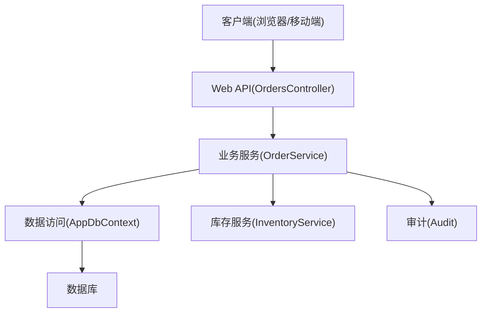
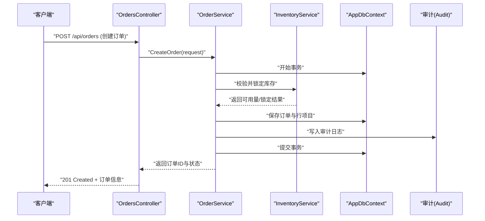
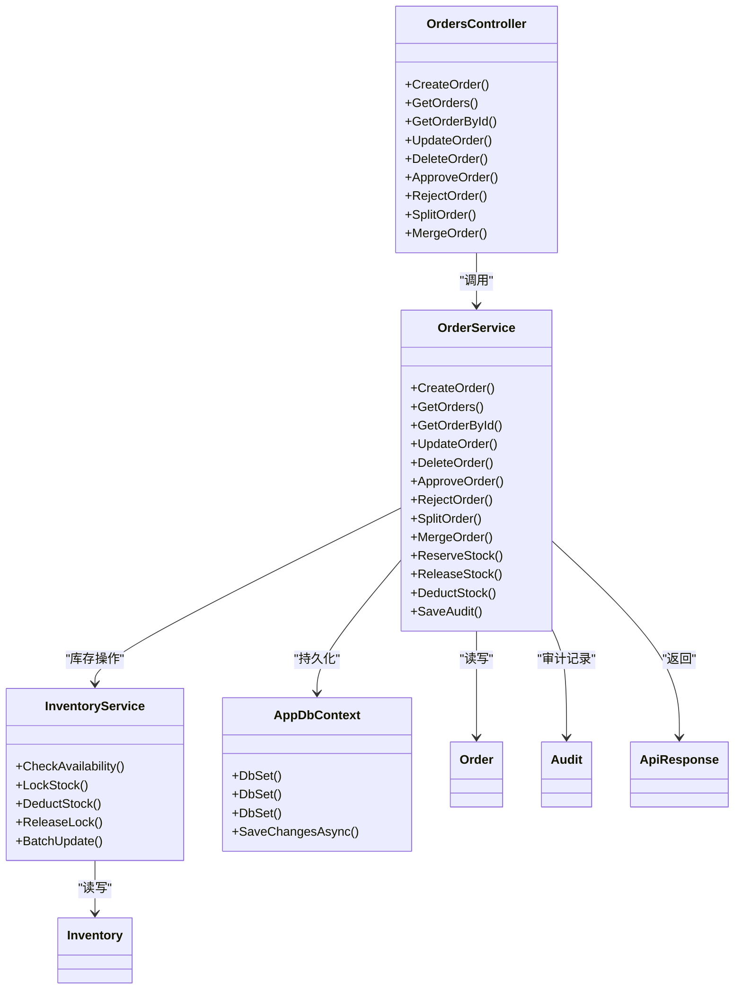

# 订单控制器

<cite>
**本文引用的文件**   
- [OrdersController.cs](file://dip-system/api/Controllers/OrdersController.cs)
- [OrderService.cs](file://dip-system/api/Services/OrderService.cs)
- [Order.cs](file://dip-system/api/Models/Order.cs)
- [Inventory.cs](file://dip-system/api/Models/Inventory.cs)
- [InventoryService.cs](file://dip-system/api/Services/InventoryService.cs)
- [AppDbContext.cs](file://dip-system/api/Data/AppDbContext.cs)
- [Audit.cs](file://dip-system/api/Models/Audit.cs)
- [ApiResponse.cs](file://dip-system/api/Models/ApiResponse.cs)
- [Program.cs](file://dip-system/api/Program.cs)
- [appsettings.json](file://dip-system/api/appsettings.json)
</cite>

## 目录
1. [简介](#简介)
2. [项目结构](#项目结构)
3. [核心组件](#核心组件)
4. [架构总览](#架构总览)
5. [详细组件分析](#详细组件分析)
6. [依赖关系分析](#依赖关系分析)
7. [性能考虑](#性能考虑)
8. [故障排查指南](#故障排查指南)
9. [结论](#结论)
10. [附录：API使用示例](#附录api使用示例)

## 简介
本文件为DIP系统订单控制器的权威技术文档，聚焦于OrdersController及其相关服务与数据模型。内容覆盖订单的创建、查询、修改、删除等CRUD操作；订单状态流转与审批流程；订单拆分与合并的业务规则；订单与库存联动更新、并发控制与事务管理；订单历史追踪与审计日志；以及异常处理机制与完整生命周期管理。同时提供面向前端与移动端调用的API使用示例，帮助读者快速集成与排障。

## 项目结构
DIP系统的后端采用ASP.NET Core Web API分层架构：
- Controllers层：对外暴露HTTP接口，如OrdersController负责订单相关的请求路由与参数校验。
- Services层：封装业务逻辑，如OrderService实现订单的CRUD、状态流转、拆分合并、库存联动等。
- Models层：定义领域实体与DTO，如Order、Inventory、Audit、ApiResponse等。
- Data层：通过EF Core上下文AppDbContext进行数据库访问。
- Program与配置：应用启动、中间件注册、依赖注入与配置加载。

图表来源
- [OrdersController.cs](file://dip-system/api/Controllers/OrdersController.cs)
- [OrderService.cs](file://dip-system/api/Services/OrderService.cs)
- [AppDbContext.cs](file://dip-system/api/Data/AppDbContext.cs)
- [InventoryService.cs](file://dip-system/api/Services/InventoryService.cs)
- [Audit.cs](file://dip-system/api/Models/Audit.cs)

章节来源
- [Program.cs](file://dip-system/api/Program.cs)
- [appsettings.json](file://dip-system/api/appsettings.json)

## 核心组件
- OrdersController：定义订单相关REST端点，接收请求、校验输入、调用OrderService并返回统一响应。
- OrderService：实现订单全生命周期逻辑，包括创建、查询、修改、删除、状态机推进、审批流、拆分合并、库存扣减/回滚、审计记录。
- Order模型：订单主数据，包含单号、状态、客户信息、行项目集合、时间戳、审计字段等。
- Inventory与InventoryService：库存实体与服务，负责可用量检查、锁定、扣减与释放，确保与订单变更一致。
- AppDbContext：EF Core上下文，管理订单、库存、审计等实体的持久化与事务边界。
- Audit模型：审计日志实体，记录关键操作的主体、动作、前后值、时间戳与原因。
- ApiResponse：统一响应包装，便于前端解析成功/失败信息与错误详情。

章节来源
- [OrdersController.cs](file://dip-system/api/Controllers/OrdersController.cs)
- [OrderService.cs](file://dip-system/api/Services/OrderService.cs)
- [Order.cs](file://dip-system/api/Models/Order.cs)
- [Inventory.cs](file://dip-system/api/Models/Inventory.cs)
- [InventoryService.cs](file://dip-system/api/Services/InventoryService.cs)
- [AppDbContext.cs](file://dip-system/api/Data/AppDbContext.cs)
- [Audit.cs](file://dip-system/api/Models/Audit.cs)
- [ApiResponse.cs](file://dip-system/api/Models/ApiResponse.cs)

## 架构总览
订单控制器的整体交互遵循“控制器→服务→仓储/上下文”的分层模式，结合事务与并发控制保证数据一致性。

图表来源
- [OrdersController.cs](file://dip-system/api/Controllers/OrdersController.cs)
- [OrderService.cs](file://dip-system/api/Services/OrderService.cs)
- [InventoryService.cs](file://dip-system/api/Services/InventoryService.cs)
- [AppDbContext.cs](file://dip-system/api/Data/AppDbContext.cs)
- [Audit.cs](file://dip-system/api/Models/Audit.cs)

## 详细组件分析

### OrdersController（订单控制器）
职责与行为
- 定义订单CRUD端点：创建、获取列表/详情、更新、删除。
- 参数校验与权限控制（由过滤器或中间件保障）。
- 调用OrderService执行具体业务，并将结果封装为ApiResponse。
- 捕获异常并转换为标准错误响应。

典型端点
- POST /api/orders：创建订单
- GET /api/orders：分页查询订单列表
- GET /api/orders/{id}：获取订单详情
- PUT /api/orders/{id}：更新订单
- DELETE /api/orders/{id}：删除订单
- POST /api/orders/{id}/approve：审批通过
- POST /api/orders/{id}/reject：审批拒绝
- POST /api/orders/{id}/split：订单拆分
- POST /api/orders/{id}/merge：订单合并

章节来源
- [OrdersController.cs](file://dip-system/api/Controllers/OrdersController.cs)

### OrderService（订单服务）
职责与行为
- 订单生命周期管理：新建、草稿、待审批、已批准、生产中、已完成、已取消、已作废。
- 审批流程：支持多级审批与驳回重提，记录审批意见与操作人。
- 订单拆分与合并：按行项目或批次维度拆分；将多个订单合并为单一订单，保持行项目完整性。
- 库存联动：在订单批准时预占库存，发货时扣减库存，取消/作废时释放预占。
- 并发控制：基于版本号或乐观锁避免超卖与重复提交。
- 事务管理：所有写操作在事务中执行，失败回滚。
- 审计日志：记录关键操作的前后值、操作人、时间与原因。

核心方法
- CreateOrder：创建订单并初始化行项目，写入审计。
- GetOrders/GetOrderById：查询订单列表与详情，支持过滤与排序。
- UpdateOrder：更新订单基本信息与行项目，校验状态可编辑性。
- DeleteOrder：删除订单（仅允许草稿或未批准状态）。
- ApproveOrder/RejectOrder：推进审批状态，必要时触发库存预占。
- SplitOrder/MergeOrder：拆分/合并订单，维护行项目映射与库存一致性。
- ReserveStock/ReleaseStock/DeductStock：库存预占、释放与扣减。
- SaveAudit：记录审计日志。

章节来源
- [OrderService.cs](file://dip-system/api/Services/OrderService.cs)

### Order模型（订单实体）
关键字段
- 订单标识、单号、状态、客户信息、备注、时间戳、审计字段（创建人、修改人、创建时间、修改时间）。
- 行项目集合：物料编码、数量、单位、单价、税额、批号、库位等。

状态枚举
- 草稿、待审批、已批准、生产中、已完成、已取消、已作废。

章节来源
- [Order.cs](file://dip-system/api/Models/Order.cs)

### Inventory与InventoryService（库存模型与服务）
库存实体
- 物料编码、仓库/库位、可用量、锁定量、在途量、批次、有效期等。

库存服务
- CheckAvailability：校验可用量是否满足需求。
- LockStock：锁定库存（用于订单批准后的预占）。
- DeductStock：扣减库存（用于发货出库）。
- ReleaseLock：释放锁定（用于取消/作废订单）。
- BatchUpdate：批量更新库存，保证原子性。

章节来源
- [Inventory.cs](file://dip-system/api/Models/Inventory.cs)
- [InventoryService.cs](file://dip-system/api/Services/InventoryService.cs)

### AppDbContext（数据上下文）
职责
- 配置实体映射、索引与约束。
- 提供DbSet<T>访问订单、库存、审计等表。
- 管理事务边界与变更跟踪。

章节来源
- [AppDbContext.cs](file://dip-system/api/Data/AppDbContext.cs)

### Audit（审计日志）
字段
- 操作类型、实体类型、实体ID、操作人、操作时间、前后值快照、原因。

用途
- 记录订单关键操作（创建、审批、拆分、合并、库存变动）的可追溯信息。

章节来源
- [Audit.cs](file://dip-system/api/Models/Audit.cs)

### ApiResponse（统一响应）
结构
- 成功标志、消息、数据对象、错误详情。

用途
- 标准化API响应格式，便于前端解析与错误提示。

章节来源
- [ApiResponse.cs](file://dip-system/api/Models/ApiResponse.cs)

## 依赖关系分析
组件间依赖清晰，低耦合高内聚：
- OrdersController依赖OrderService。
- OrderService依赖AppDbContext、InventoryService、Audit。
- InventoryService依赖AppDbContext。
- 所有写操作通过AppDbContext的事务管理保证一致性。

图表来源
- [OrdersController.cs](file://dip-system/api/Controllers/OrdersController.cs)
- [OrderService.cs](file://dip-system/api/Services/OrderService.cs)
- [InventoryService.cs](file://dip-system/api/Services/InventoryService.cs)
- [AppDbContext.cs](file://dip-system/api/Data/AppDbContext.cs)
- [Order.cs](file://dip-system/api/Models/Order.cs)
- [Inventory.cs](file://dip-system/api/Models/Inventory.cs)
- [Audit.cs](file://dip-system/api/Models/Audit.cs)
- [ApiResponse.cs](file://dip-system/api/Models/ApiResponse.cs)

章节来源
- [OrdersController.cs](file://dip-system/api/Controllers/OrdersController.cs)
- [OrderService.cs](file://dip-system/api/Services/OrderService.cs)
- [InventoryService.cs](file://dip-system/api/Services/InventoryService.cs)
- [AppDbContext.cs](file://dip-system/api/Data/AppDbContext.cs)

## 性能考虑
- 分页与投影：查询列表时使用分页与只取必要字段，减少数据传输与内存占用。
- 索引优化：对订单单号、状态、客户ID、物料编码等高频查询字段建立索引。
- 并发控制：使用乐观锁（版本号）避免超卖与重复提交；对库存操作加细粒度锁。
- 批量操作：拆分/合并与库存更新尽量批量处理，减少往返次数。
- 异步IO：所有数据库与外部服务调用使用异步方法，提升吞吐。
- 缓存策略：对字典与静态配置使用内存缓存，降低热点查询压力。

[本节为通用性能建议，不直接分析具体文件]

## 故障排查指南
常见问题与定位步骤
- 订单创建失败：检查输入校验、库存可用性、事务是否回滚、审计写入是否成功。
- 审批失败：确认当前状态是否允许推进、审批人权限、是否存在未决任务。
- 库存不足：查看可用量与锁定量，确认是否有其他订单占用或并发冲突。
- 拆分/合并异常：核对行项目映射、批次与库位一致性、库存原子更新。
- 审计缺失：检查审计写入是否被异常中断或事务回滚。

异常处理机制
- 控制器层捕获业务异常并返回统一错误响应。
- 服务层抛出明确异常类型（如库存不足、状态非法），便于上层处理。
- 数据库异常（唯一约束、外键）转换为友好错误信息。

章节来源
- [OrdersController.cs](file://dip-system/api/Controllers/OrdersController.cs)
- [OrderService.cs](file://dip-system/api/Services/OrderService.cs)
- [ApiResponse.cs](file://dip-system/api/Models/ApiResponse.cs)

## 结论
OrdersController与OrderService共同实现了DIP系统的订单全生命周期管理，涵盖CRUD、状态机、审批流、拆分合并、库存联动、并发控制、事务与审计。通过分层架构与统一响应，系统具备良好的可维护性与扩展性。建议在后续迭代中持续优化查询性能、完善错误码体系与增强监控告警。

[本节为总结性内容，不直接分析具体文件]

## 附录：API使用示例
以下示例展示常用订单接口的请求与响应结构（以JSON为例）：

- 创建订单
  - 方法：POST
  - 路径：/api/orders
  - 请求体：包含订单头信息与行项目数组（物料、数量、单位、单价等）
  - 响应：成功返回订单ID与初始状态；失败返回错误详情

- 查询订单列表
  - 方法：GET
  - 路径：/api/orders?status=&customerId=&page=1&pageSize=20
  - 响应：分页数据与总数

- 获取订单详情
  - 方法：GET
  - 路径：/api/orders/{id}
  - 响应：订单头与行项目详情

- 更新订单
  - 方法：PUT
  - 路径：/api/orders/{id}
  - 请求体：需包含版本控制字段以避免并发冲突
  - 响应：更新结果

- 删除订单
  - 方法：DELETE
  - 路径：/api/orders/{id}
  - 限制：仅草稿或未批准状态可删除

- 审批通过/拒绝
  - 方法：POST
  - 路径：/api/orders/{id}/approve 或 /api/orders/{id}/reject
  - 请求体：审批意见与操作人
  - 响应：新状态与审计记录

- 订单拆分
  - 方法：POST
  - 路径：/api/orders/{id}/split
  - 请求体：拆分行项目目标与新订单分配规则
  - 响应：新订单ID与关联关系

- 订单合并
  - 方法：POST
  - 路径：/api/orders/{id}/merge
  - 请求体：待合并订单ID列表与合并规则
  - 响应：合并后订单ID与行项目映射

[本节为概念性示例，不直接分析具体文件]