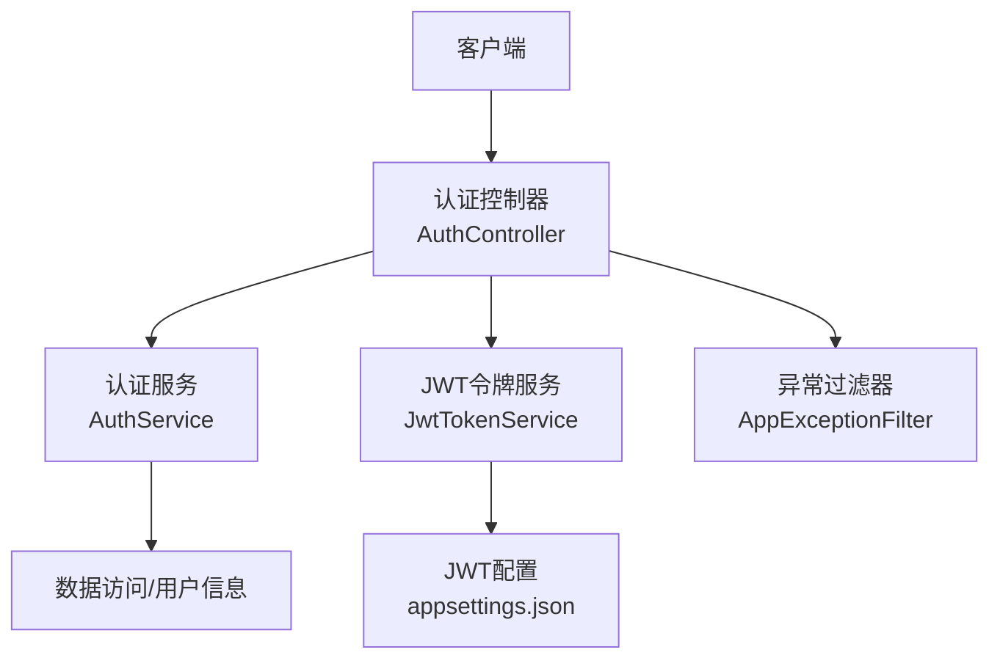
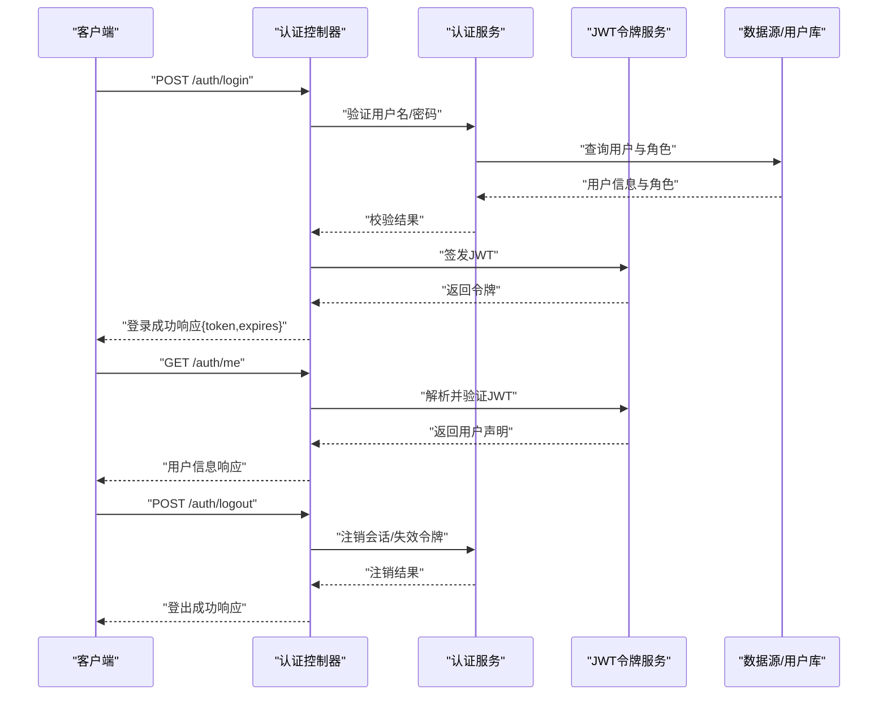
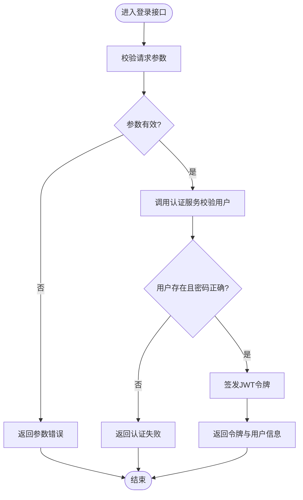
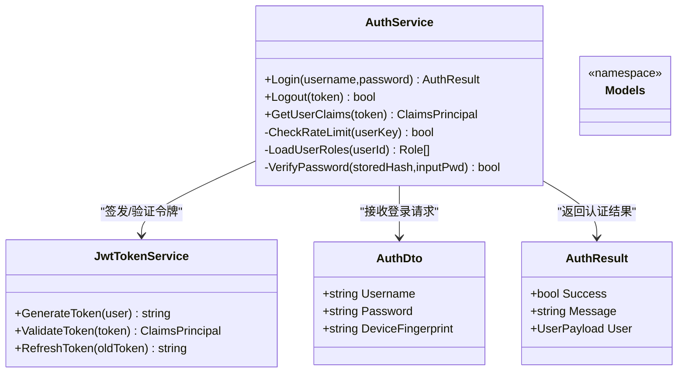
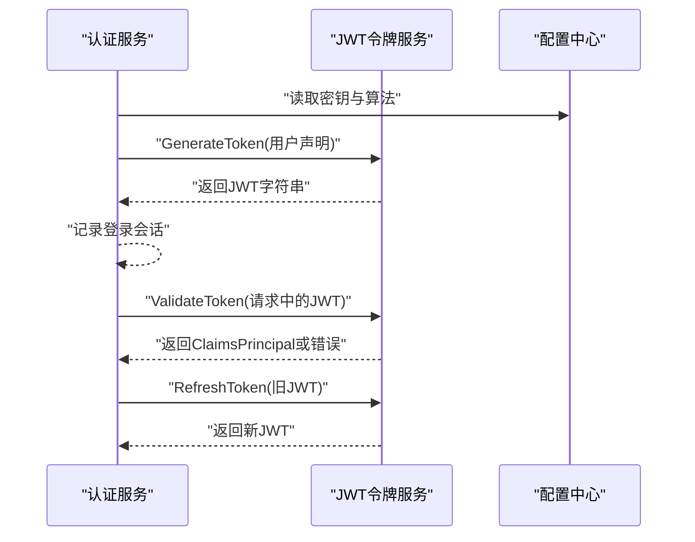
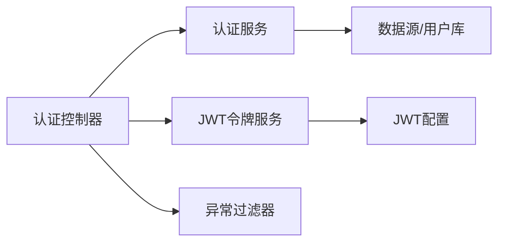

# 认证控制器

<cite>
**本文引用的文件**   
- [AuthController.cs](file://dip-system/api/Controllers/AuthController.cs)
- [AuthService.cs](file://dip-system/api/Services/AuthService.cs)
- [JwtTokenService.cs](file://dip-system/api/Services/JwtTokenService.cs)
- [Auth.cs](file://dip-system/api/Models/Auth.cs)
- [AppExceptionFilter.cs](file://dip-system/api/Controllers/AppExceptionFilter.cs)
- [Program.cs](file://dip-system/api/Program.cs)
- [appsettings.json](file://dip-system/api/appsettings.json)
</cite>

## 目录
1. [简介](#简介)
2. [项目结构](#项目结构)
3. [核心组件](#核心组件)
4. [架构总览](#架构总览)
5. [详细组件分析](#详细组件分析)
6. [依赖关系分析](#依赖关系分析)
7. [性能考量](#性能考量)
8. [故障排查指南](#故障排查指南)
9. [结论](#结论)
10. [附录](#附录)

## 简介
本文件面向DIP系统的认证子系统，聚焦于认证控制器与相关服务、令牌服务的实现与使用。文档涵盖登录、登出、获取用户信息等API接口说明；JWT令牌的生成与验证机制；密码加密存储策略；会话管理策略；权限验证流程与角色控制；错误处理、防暴力破解、令牌刷新机制的实现细节；并提供请求响应示例与安全配置建议，帮助开发者快速理解并安全地集成认证能力。

## 项目结构
认证相关代码位于后端API项目中，主要包含：
- 控制器层：认证控制器对外暴露REST API
- 服务层：认证业务逻辑（校验、权限等）与JWT令牌服务（签发、解析、刷新）
- 模型层：认证相关的DTO与实体定义
- 异常过滤器：统一异常处理与错误响应格式
- 程序入口与配置：中间件注册、JWT配置、应用设置

图表来源
- [AuthController.cs](file://dip-system/api/Controllers/AuthController.cs)
- [AuthService.cs](file://dip-system/api/Services/AuthService.cs)
- [JwtTokenService.cs](file://dip-system/api/Services/JwtTokenService.cs)
- [AppExceptionFilter.cs](file://dip-system/api/Controllers/AppExceptionFilter.cs)
- [appsettings.json](file://dip-system/api/appsettings.json)

章节来源
- [AuthController.cs](file://dip-system/api/Controllers/AuthController.cs)
- [AuthService.cs](file://dip-system/api/Services/AuthService.cs)
- [JwtTokenService.cs](file://dip-system/api/Services/JwtTokenService.cs)
- [Auth.cs](file://dip-system/api/Models/Auth.cs)
- [AppExceptionFilter.cs](file://dip-system/api/Controllers/AppExceptionFilter.cs)
- [Program.cs](file://dip-system/api/Program.cs)
- [appsettings.json](file://dip-system/api/appsettings.json)

## 核心组件
- 认证控制器（AuthController）
  - 职责：接收认证相关HTTP请求，调用服务层完成登录、登出、获取用户信息等操作，返回统一响应。
  - 关键接口：登录、登出、获取当前用户信息、刷新令牌（如启用）。
- 认证服务（AuthService）
  - 职责：实现认证核心逻辑，包括用户名/密码校验、角色权限检查、会话状态管理、登录态维护等。
- JWT令牌服务（JwtTokenService）
  - 职责：负责JWT的签发、解析、验证、续期/刷新；管理密钥、算法、过期时间、受众与签发者等参数。
- 认证模型（Auth.cs）
  - 职责：定义登录请求、响应、用户信息、令牌等相关的数据传输对象（DTO）。
- 异常过滤器（AppExceptionFilter）
  - 职责：捕获未处理异常，转换为统一的错误响应格式，便于前端一致处理。
- 程序入口与配置（Program.cs, appsettings.json）
  - 职责：注册认证中间件、JWT选项、全局异常过滤器、跨域等。

章节来源
- [AuthController.cs](file://dip-system/api/Controllers/AuthController.cs)
- [AuthService.cs](file://dip-system/api/Services/AuthService.cs)
- [JwtTokenService.cs](file://dip-system/api/Services/JwtTokenService.cs)
- [Auth.cs](file://dip-system/api/Models/Auth.cs)
- [AppExceptionFilter.cs](file://dip-system/api/Controllers/AppExceptionFilter.cs)
- [Program.cs](file://dip-system/api/Program.cs)
- [appsettings.json](file://dip-system/api/appsettings.json)

## 架构总览
认证流程采用“控制器-服务-令牌服务”的分层设计，结合统一异常过滤与配置中心化的JWT设置，确保可维护性与安全性。

图表来源
- [AuthController.cs](file://dip-system/api/Controllers/AuthController.cs)
- [AuthService.cs](file://dip-system/api/Services/AuthService.cs)
- [JwtTokenService.cs](file://dip-system/api/Services/JwtTokenService.cs)

## 详细组件分析

### 认证控制器（AuthController）
- 功能要点
  - 登录：接收用户名与密码，调用认证服务进行校验，成功后由JWT服务签发令牌并返回。
  - 登出：根据服务端会话或黑名单策略使令牌失效，清理本地会话状态。
  - 获取用户信息：从请求上下文提取JWT声明，返回当前用户基本信息与角色。
  - 刷新令牌（可选）：基于旧令牌签发新令牌，支持短期有效与长有效期组合。
- 输入输出
  - 登录请求：用户名、密码（必要时附加验证码或设备指纹）
  - 登录响应：访问令牌、令牌类型、过期时间、用户基础信息
  - 登出请求：携带访问令牌（Header或Body）
  - 登出响应：成功标志与消息
  - 用户信息响应：用户ID、姓名、角色列表、权限集合等
- 错误处理
  - 统一通过异常过滤器捕获并返回标准错误结构，包含错误码、消息与时间戳。

图表来源
- [AuthController.cs](file://dip-system/api/Controllers/AuthController.cs)
- [AuthService.cs](file://dip-system/api/Services/AuthService.cs)
- [JwtTokenService.cs](file://dip-system/api/Services/JwtTokenService.cs)

章节来源
- [AuthController.cs](file://dip-system/api/Controllers/AuthController.cs)
- [AppExceptionFilter.cs](file://dip-system/api/Controllers/AppExceptionFilter.cs)

### 认证服务（AuthService）
- 功能要点
  - 密码校验：从数据源读取用户哈希密码，使用安全的哈希算法进行比对。
  - 权限检查：加载用户角色与权限，用于后续资源访问控制。
  - 会话管理：记录登录时间、设备信息、IP地址，支持单点登录或多设备策略。
  - 防暴力破解：对同一用户/IP在限定时间内失败次数进行限制，触发临时锁定或验证码。
- 数据流
  - 输入：用户名、密码、可选设备指纹
  - 处理：用户查找、密码比对、角色权限加载、风控计数
  - 输出：用户主体对象（含角色与权限）、风控状态

图表来源
- [AuthService.cs](file://dip-system/api/Services/AuthService.cs)
- [JwtTokenService.cs](file://dip-system/api/Services/JwtTokenService.cs)
- [Auth.cs](file://dip-system/api/Models/Auth.cs)

章节来源
- [AuthService.cs](file://dip-system/api/Services/AuthService.cs)
- [Auth.cs](file://dip-system/api/Models/Auth.cs)

### JWT令牌服务（JwtTokenService）
- 功能要点
  - 签发：基于用户声明（用户ID、角色、权限、设备指纹等）生成JWT，设置签发者、受众、过期时间。
  - 验证：解析并验证签名、过期时间、受众与签发者，返回声明主体。
  - 刷新：基于旧令牌生成新令牌，支持滑动过期或固定过期策略。
- 安全配置
  - 密钥管理：从配置中读取对称密钥或非对称密钥对，避免硬编码。
  - 算法选择：推荐使用强算法（如RS256），避免弱算法。
  - 过期策略：短时效访问令牌+长时效刷新令牌组合，降低泄露风险。
  - 黑名单/撤销：配合Redis或内存缓存实现令牌黑名单，支持强制下线。

图表来源
- [JwtTokenService.cs](file://dip-system/api/Services/JwtTokenService.cs)
- [appsettings.json](file://dip-system/api/appsettings.json)

章节来源
- [JwtTokenService.cs](file://dip-system/api/Services/JwtTokenService.cs)
- [appsettings.json](file://dip-system/api/appsettings.json)

### 认证模型（Auth.cs）
- 内容要点
  - 登录请求DTO：用户名、密码、设备指纹等字段
  - 登录响应DTO：访问令牌、令牌类型、过期时间、用户信息
  - 用户信息DTO：用户ID、姓名、角色列表、权限集合
  - 错误响应DTO：错误码、消息、时间戳

章节来源
- [Auth.cs](file://dip-system/api/Models/Auth.cs)

### 异常过滤器（AppExceptionFilter）
- 功能要点
  - 捕获未处理异常，转换为统一错误响应格式
  - 区分业务异常与系统异常，提供不同错误码与提示
  - 记录关键错误日志，便于问题定位

章节来源
- [AppExceptionFilter.cs](file://dip-system/api/Controllers/AppExceptionFilter.cs)

### 程序入口与配置（Program.cs, appsettings.json）
- 功能要点
  - 注册JWT认证中间件与授权策略
  - 配置全局异常过滤器
  - 读取JWT密钥、算法、过期时间等配置项
  - 配置跨域、日志、限流等通用中间件

章节来源
- [Program.cs](file://dip-system/api/Program.cs)
- [appsettings.json](file://dip-system/api/appsettings.json)

## 依赖关系分析
- 控制器依赖服务：认证控制器依赖认证服务与JWT令牌服务
- 服务依赖数据源：认证服务依赖用户数据源（数据库或缓存）
- 令牌服务依赖配置：JWT令牌服务依赖应用配置中的密钥与算法
- 异常过滤器全局生效：所有控制器均受统一异常处理影响

图表来源
- [AuthController.cs](file://dip-system/api/Controllers/AuthController.cs)
- [AuthService.cs](file://dip-system/api/Services/AuthService.cs)
- [JwtTokenService.cs](file://dip-system/api/Services/JwtTokenService.cs)
- [AppExceptionFilter.cs](file://dip-system/api/Controllers/AppExceptionFilter.cs)
- [appsettings.json](file://dip-system/api/appsettings.json)

章节来源
- [AuthController.cs](file://dip-system/api/Controllers/AuthController.cs)
- [AuthService.cs](file://dip-system/api/Services/AuthService.cs)
- [JwtTokenService.cs](file://dip-system/api/Services/JwtTokenService.cs)
- [AppExceptionFilter.cs](file://dip-system/api/Controllers/AppExceptionFilter.cs)
- [appsettings.json](file://dip-system/api/appsettings.json)

## 性能考量
- 令牌签发与验证应无状态化，避免频繁I/O；必要时引入缓存减少重复计算
- 密码哈希算法选择合理强度，平衡安全性与性能
- 防暴力破解使用轻量级计数器（内存或Redis），避免阻塞主流程
- 大并发场景下，令牌刷新与黑名单管理需考虑分布式一致性

## 故障排查指南
- 常见问题
  - 登录失败：检查用户名/密码、用户状态、账号是否被锁定
  - 令牌无效：检查签名、过期时间、受众与签发者配置
  - 权限不足：确认用户角色与资源权限映射是否正确
- 诊断步骤
  - 查看异常过滤器输出的错误码与消息
  - 检查JWT配置与密钥是否正确加载
  - 核对认证服务中的风控计数与锁定策略
  - 检查会话管理与黑名单缓存状态

章节来源
- [AppExceptionFilter.cs](file://dip-system/api/Controllers/AppExceptionFilter.cs)
- [AuthService.cs](file://dip-system/api/Services/AuthService.cs)
- [JwtTokenService.cs](file://dip-system/api/Services/JwtTokenService.cs)

## 结论
DIP系统认证控制器通过分层设计与统一异常处理，提供了健壮的登录、登出与用户信息查询能力。JWT令牌服务确保了令牌的签发与验证安全，认证服务实现了密码校验、权限检查与防暴力破解策略。通过合理的配置与最佳实践，系统可在高并发与多设备环境下保持安全与稳定。

## 附录

### API接口定义与示例
- 登录
  - 方法：POST
  - 路径：/auth/login
  - 请求体：用户名、密码、设备指纹（可选）
  - 响应：访问令牌、令牌类型、过期时间、用户基础信息
- 登出
  - 方法：POST
  - 路径：/auth/logout
  - 请求头：Authorization: Bearer <token>
  - 响应：成功标志与消息
- 获取用户信息
  - 方法：GET
  - 路径：/auth/me
  - 请求头：Authorization: Bearer <token>
  - 响应：用户ID、姓名、角色列表、权限集合

### 安全配置建议
- 使用强算法与非对称密钥（如RS256），避免对称密钥泄露风险
- 设置合理的令牌过期时间，短时效访问令牌+长时效刷新令牌
- 启用HTTPS，防止中间人攻击
- 实施速率限制与验证码机制，抵御暴力破解
- 定期轮换密钥，监控异常登录行为

章节来源
- [AuthController.cs](file://dip-system/api/Controllers/AuthController.cs)
- [AuthService.cs](file://dip-system/api/Services/AuthService.cs)
- [JwtTokenService.cs](file://dip-system/api/Services/JwtTokenService.cs)
- [appsettings.json](file://dip-system/api/appsettings.json)