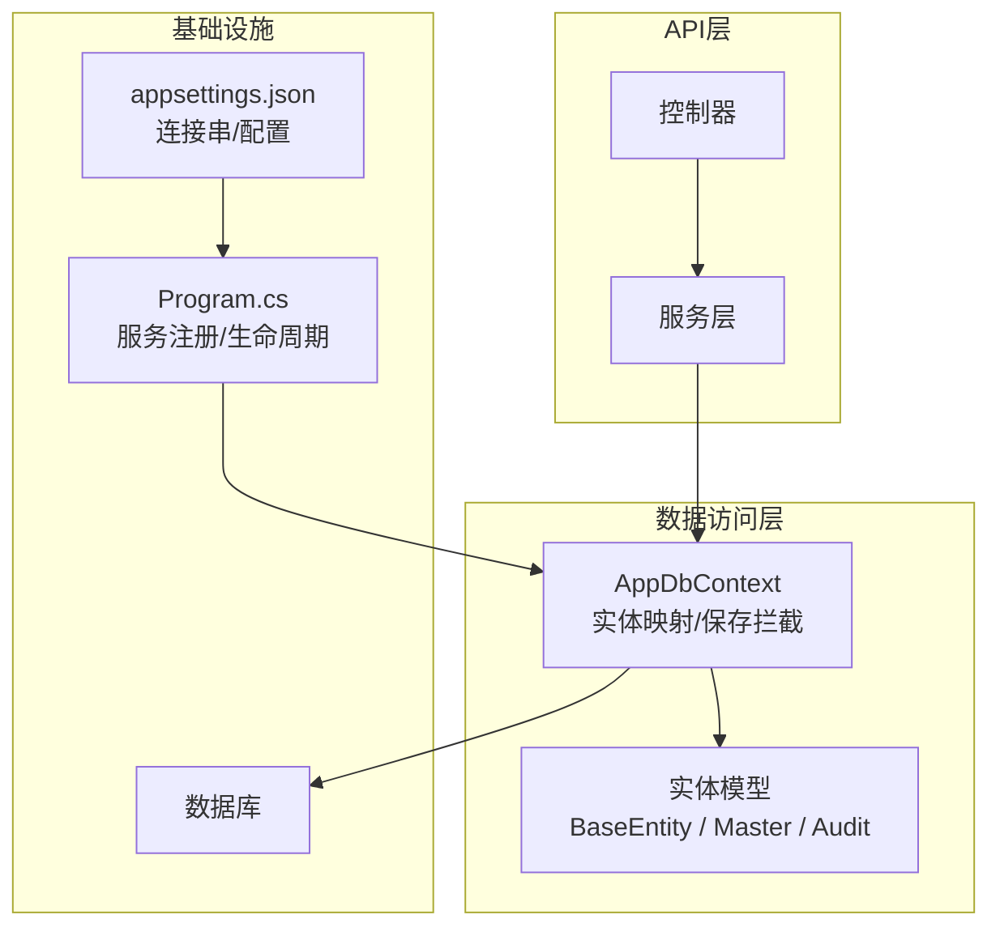
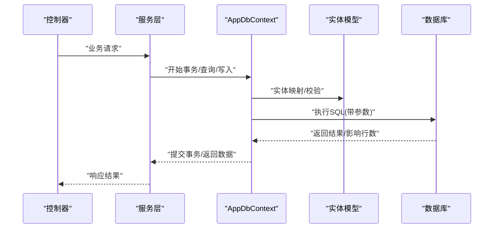
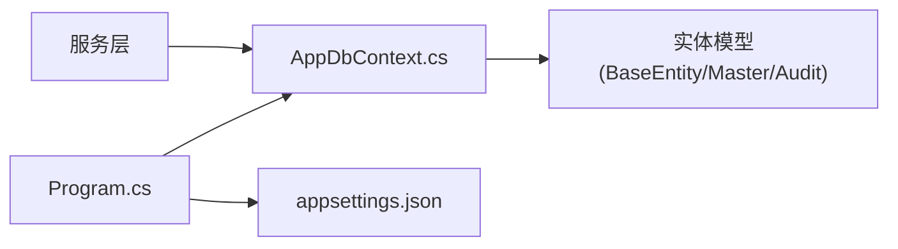

# 数据访问层

<cite>
**本文引用的文件**   
- [AppDbContext.cs](file://dip-system/api/Data/AppDbContext.cs)
- [BaseEntity.cs](file://dip-system/api/Models/BaseEntity.cs)
- [Master.cs](file://dip-system/api/Models/Master.cs)
- [Audit.cs](file://dip-system/api/Models/Audit.cs)
- [Program.cs](file://dip-system/api/Program.cs)
- [appsettings.json](file://dip-system/api/appsettings.json)
- [init-db.sql](file://scripts/init-db.sql)
</cite>

## 目录
1. [简介](#简介)
2. [项目结构](#项目结构)
3. [核心组件](#核心组件)
4. [架构总览](#架构总览)
5. [详细组件分析](#详细组件分析)
6. [依赖关系分析](#依赖关系分析)
7. [性能考虑](#性能考虑)
8. [故障排查指南](#故障排查指南)
9. [结论](#结论)
10. [附录](#附录)

## 简介
本章节面向DIP系统的数据访问层，聚焦EF Core与数据库交互的关键实现与最佳实践。内容涵盖：
- AppDbContext数据库上下文配置、实体关系映射、迁移管理策略
- BaseEntity基类设计、Master主数据模型、审计字段自动填充机制
- EF Core查询优化、延迟加载、批量操作、事务处理
- 仓储模式实现思路、数据验证规则、索引设计原则
- 数据库连接池配置、查询性能监控、数据备份恢复策略
- 数据迁移与版本管理的最佳实践

## 项目结构
数据访问相关代码主要位于api/Data与api/Models目录，以及应用启动与配置文件：
- Data/AppDbContext.cs：EF Core上下文定义、DbSet集合、OnModelCreating映射、SaveChanges拦截
- Models/BaseEntity.cs：通用实体基类（如Id、时间戳等）
- Models/Master.cs：主数据模型（字典/基础数据）
- Models/Audit.cs：审计字段或审计记录模型
- Program.cs：服务注册、中间件、数据库上下文生命周期配置
- appsettings.json：连接字符串、EF Core日志与调试选项
- scripts/init-db.sql：初始化脚本（可选）

图表来源
- [Program.cs](file://dip-system/api/Program.cs)
- [AppDbContext.cs](file://dip-system/api/Data/AppDbContext.cs)
- [appsettings.json](file://dip-system/api/appsettings.json)

章节来源
- [Program.cs](file://dip-system/api/Program.cs)
- [AppDbContext.cs](file://dip-system/api/Data/AppDbContext.cs)
- [appsettings.json](file://dip-system/api/appsettings.json)

## 核心组件
- AppDbContext：集中管理实体集合、关系映射、全局查询过滤、SaveChanges审计注入、事务边界暴露
- BaseEntity：统一标识与时间戳字段，提供统一的创建/更新时间追踪能力
- Master：主数据模型，承载字典/基础数据，通常具备IsEnabled、SortOrder等通用属性
- Audit：审计字段或审计记录，用于记录变更人、时间、原因等

章节来源
- [AppDbContext.cs](file://dip-system/api/Data/AppDbContext.cs)
- [BaseEntity.cs](file://dip-system/api/Models/BaseEntity.cs)
- [Master.cs](file://dip-system/api/Models/Master.cs)
- [Audit.cs](file://dip-system/api/Models/Audit.cs)

## 架构总览
下图展示从控制器到数据库的调用链路与数据流向，强调DbContext在其中的枢纽作用。

图表来源
- [Program.cs](file://dip-system/api/Program.cs)
- [AppDbContext.cs](file://dip-system/api/Data/AppDbContext.cs)

## 详细组件分析

### AppDbContext数据库上下文配置
- 职责
  - 维护DbSet集合，声明实体与表的关系
  - OnModelCreating中完成Fluent API映射、索引、约束、级联策略
  - SaveChanges/SaveChangesAsync中注入审计字段（如创建者、修改者、时间）
  - 提供事务方法BeginTransaction/Commit/Rollback封装
- 关键要点
  - 连接字符串来自配置，支持多环境切换
  - 建议开启命令日志用于开发期诊断
  - 对高频查询启用AsNoTracking提升性能
  - 使用HasIndex/HasDefaultValue等确保一致性

章节来源
- [AppDbContext.cs](file://dip-system/api/Data/AppDbContext.cs)
- [appsettings.json](file://dip-system/api/appsettings.json)

### BaseEntity基类设计
- 常见字段
  - Id：主键（Guid/Int）
  - CreatedBy、CreatedTime：创建信息
  - UpdatedBy、UpdatedTime：更新信息
  - IsDeleted：软删除标记（可选）
- 设计原则
  - 所有实体继承BaseEntity以统一审计与状态
  - 在DbContext.SaveChanges拦截中统一填充，避免业务代码重复
  - 结合事件或拦截器保证跨进程一致性

章节来源
- [BaseEntity.cs](file://dip-system/api/Models/BaseEntity.cs)
- [AppDbContext.cs](file://dip-system/api/Data/AppDbContext.cs)

### Master主数据模型
- 用途
  - 存储字典、枚举值、基础配置等“主数据”
- 典型字段
  - Code、Name、Description、IsEnabled、SortOrder、TenantId（多租户时）
- 映射建议
  - 为Code/Name建立唯一索引，防止重复
  - 为常用筛选条件建立复合索引

章节来源
- [Master.cs](file://dip-system/api/Models/Master.cs)
- [AppDbContext.cs](file://dip-system/api/Data/AppDbContext.cs)

### 审计字段自动填充机制
- 触发点
  - SaveChanges/SaveChangesAsync重写
- 行为
  - 新增：填充CreatedBy/CreatedTime
  - 修改：填充UpdatedBy/UpdatedTime
  - 删除：若软删除，填充DeletedBy/DeletedTime
- 安全
  - 从当前用户上下文获取操作者（如Claims），未登录时回退为系统账号

章节来源
- [AppDbContext.cs](file://dip-system/api/Data/AppDbContext.cs)
- [BaseEntity.cs](file://dip-system/api/Models/BaseEntity.cs)

### EF Core查询优化
- AsNoTracking：只读查询禁用跟踪，减少内存占用
- Select投影：仅选择必要字段，降低网络传输
- 分页：Skip/Take+排序，避免全表扫描
- 预编译查询：对热点查询使用CompiledQuery或Execute
- 避免N+1：Include/ThenInclude按需使用，必要时拆分查询

章节来源
- [AppDbContext.cs](file://dip-system/api/Data/AppDbContext.cs)

### 延迟加载
- 推荐做法
  - 默认关闭延迟加载，显式Include控制加载时机
- 如需延迟加载
  - 启用代理并谨慎使用，注意循环引用与性能风险

章节来源
- [AppDbContext.cs](file://dip-system/api/Data/AppDbContext.cs)

### 批量操作
- 适用场景
  - 大量插入/更新/删除，避免逐条往返
- 实现方式
  - AddRange/BulkInsert第三方库（如Bullseye/Npgsql批量扩展）
  - 分批提交，控制事务大小，避免长事务锁表

章节来源
- [AppDbContext.cs](file://dip-system/api/Data/AppDbContext.cs)

### 事务处理
- 单DbContext内事务
  - 通过Database.BeginTransaction封装
- 跨服务/跨资源事务
  - 采用补偿或Saga模式，避免分布式事务
- 异常回滚
  - 捕获异常后Rollback并抛出领域异常

章节来源
- [AppDbContext.cs](file://dip-system/api/Data/AppDbContext.cs)

### 仓储模式实现
- 目标
  - 抽象数据访问细节，便于测试与替换
- 建议
  - IRepository<T>定义CRUD与常用查询
  - Repository<T>基于DbContext实现
  - UnitOfWork聚合多个仓储，保证一致性

章节来源
- [AppDbContext.cs](file://dip-system/api/Data/AppDbContext.cs)

### 数据验证规则
- 模型级验证
  - Required、StringLength、RegularExpression等
- 业务级验证
  - 在Service层进行跨实体校验
- 入库前校验
  - 在SaveChanges之前做二次校验，失败则抛异常

章节来源
- [AppDbContext.cs](file://dip-system/api/Data/AppDbContext.cs)

### 索引设计原则
- 高选择性列建索引（如Code、UniqueKey）
- 复合索引按查询谓词顺序排列
- 覆盖索引减少回表
- 定期评估慢查询，避免过多索引影响写性能

章节来源
- [AppDbContext.cs](file://dip-system/api/Data/AppDbContext.cs)

## 依赖关系分析
- Program负责注册DbContext、配置日志、读取连接串
- AppDbContext依赖实体模型与数据库驱动
- 服务层依赖DbContext进行数据访问
- 配置来源于appsettings.json与环境变量

图表来源
- [Program.cs](file://dip-system/api/Program.cs)
- [AppDbContext.cs](file://dip-system/api/Data/AppDbContext.cs)
- [appsettings.json](file://dip-system/api/appsettings.json)

章节来源
- [Program.cs](file://dip-system/api/Program.cs)
- [AppDbContext.cs](file://dip-system/api/Data/AppDbContext.cs)
- [appsettings.json](file://dip-system/api/appsettings.json)

## 性能考虑
- 连接池
  - 合理设置Min/Max Pool Size、Connection Timeout、Command Timeout
  - 根据并发与数据库容量调优
- 查询监控
  - 启用EF Core SQL日志（开发环境）
  - 使用Application Insights/Seq等采集慢查询
- 缓存
  - 对主数据（Master）使用内存缓存（IMemoryCache）
- 批处理
  - 大批量写入分批次提交，避免长事务
- 索引
  - 依据实际查询构建覆盖索引，定期清理无用索引

章节来源
- [appsettings.json](file://dip-system/api/appsettings.json)
- [AppDbContext.cs](file://dip-system/api/Data/AppDbContext.cs)

## 故障排查指南
- 连接失败
  - 检查连接字符串、防火墙、端口、用户名密码
- 慢查询
  - 查看SQL日志、执行计划、缺失索引
- 死锁/锁等待
  - 缩短事务、调整隔离级别、避免大事务
- 内存泄漏
  - 检查未释放的DbContext、未关闭的连接
- 审计不一致
  - 确认SaveChanges拦截是否生效、用户上下文是否正确

章节来源
- [AppDbContext.cs](file://dip-system/api/Data/AppDbContext.cs)
- [appsettings.json](file://dip-system/api/appsettings.json)

## 结论
通过统一的DbContext、基类与审计机制，DIP系统在数据访问层实现了可维护、可扩展且高性能的架构。配合合理的索引、事务与批处理策略，可在复杂业务场景下保持稳定与高效。

## 附录

### 数据库连接池配置建议
- 最小/最大连接数：根据CPU核数与数据库容量估算
- 超时：CommandTimeout与ConnectionTimeout按业务SLA设定
- 日志：开发环境开启SQL日志，生产环境采样

章节来源
- [appsettings.json](file://dip-system/api/appsettings.json)

### 查询性能监控
- 启用EF Core日志输出
- 接入APM工具（Application Insights/Seq/Prometheus）
- 定期生成慢查询报告

章节来源
- [AppDbContext.cs](file://dip-system/api/Data/AppDbContext.cs)

### 数据备份与恢复策略
- 全量备份：每日一次
- 增量备份：每小时一次
- 恢复演练：定期演练恢复流程
- 异地容灾：跨区域复制

章节来源
- [init-db.sql](file://scripts/init-db.sql)

### 数据迁移与版本管理最佳实践
- 使用EF Core Migrations管理Schema演进
- 迁移脚本命名规范：描述性命名
- 发布前评审：Review迁移脚本与回滚方案
- 灰度发布：先小流量验证再全量推进

章节来源
- [AppDbContext.cs](file://dip-system/api/Data/AppDbContext.cs)