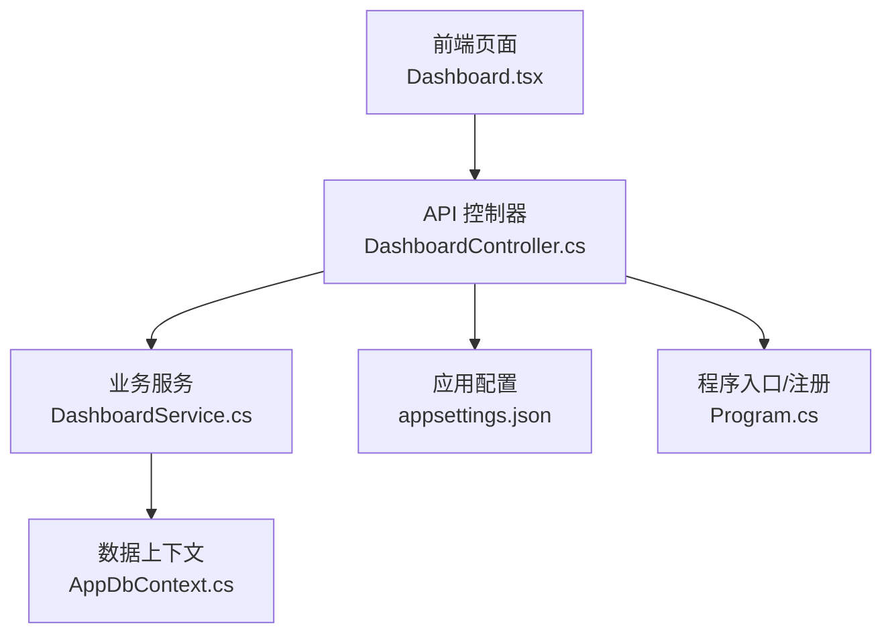
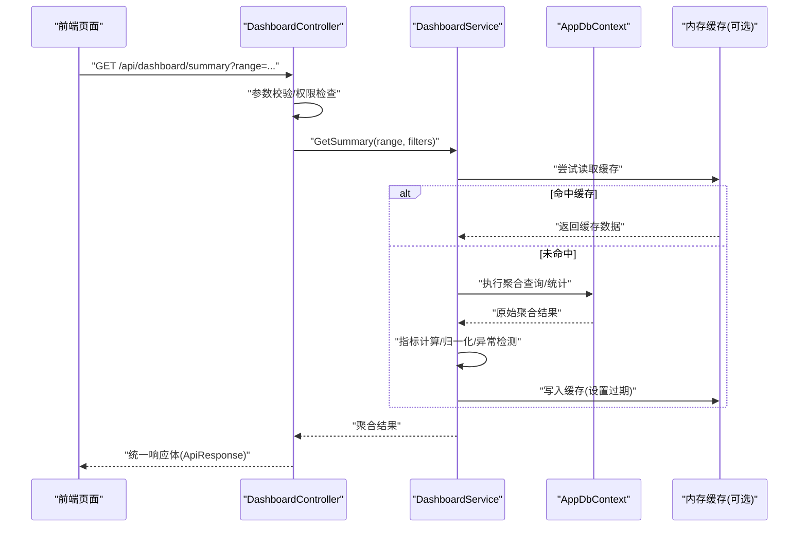
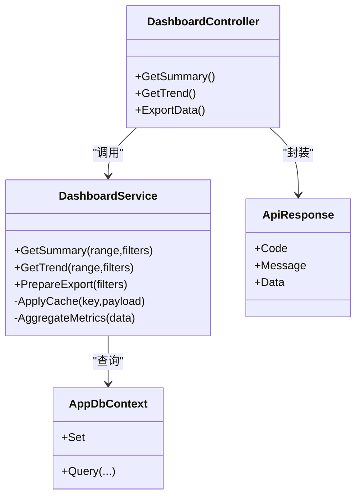

# 仪表板分析服务 (DashboardService)

<cite>
**本文引用的文件**   
- [DashboardController.cs](file://dip-system/api/Controllers/DashboardController.cs)
- [DashboardService.cs](file://dip-system/api/Services/DashboardService.cs)
- [AppDbContext.cs](file://dip-system/api/Data/AppDbContext.cs)
- [ApiResponse.cs](file://dip-system/api/Models/ApiResponse.cs)
- [Program.cs](file://dip-system/api/Program.cs)
- [appsettings.json](file://dip-system/api/appsettings.json)
- [Dashboard.tsx](file://dip-system/frontend-web/src/pages/Dashboard.tsx)
- [api.ts](file://dip-system/frontend-web/src/lib/api.ts)
</cite>

## 目录
1. [简介](#简介)
2. [项目结构](#项目结构)
3. [核心组件](#核心组件)
4. [架构总览](#架构总览)
5. [详细组件分析](#详细组件分析)
6. [依赖关系分析](#依赖关系分析)
7. [性能考虑](#性能考虑)
8. [故障排查指南](#故障排查指南)
9. [结论](#结论)
10. [附录](#附录)

## 简介
本文件面向DIP系统的“仪表板分析服务”，聚焦于DashboardService的数据聚合与可视化支持能力，涵盖关键指标计算、实时数据更新、历史数据分析算法、仪表板配置管理、自定义报表生成与数据导出等。同时提供性能优化策略（缓存机制、大数据量处理）、前端集成示例（动态图表渲染、交互式分析）与最佳实践建议，帮助读者快速理解并高效扩展该服务。

## 项目结构
后端采用ASP.NET Core API，控制器层暴露REST接口，服务层封装业务逻辑与数据聚合，数据访问通过Entity Framework Core的DbContext进行。前端使用React + TypeScript，页面组件负责请求API并渲染图表。

图示来源
- [DashboardController.cs](file://dip-system/api/Controllers/DashboardController.cs)
- [DashboardService.cs](file://dip-system/api/Services/DashboardService.cs)
- [AppDbContext.cs](file://dip-system/api/Data/AppDbContext.cs)
- [appsettings.json](file://dip-system/api/appsettings.json)
- [Program.cs](file://dip-system/api/Program.cs)

章节来源
- [DashboardController.cs](file://dip-system/api/Controllers/DashboardController.cs)
- [DashboardService.cs](file://dip-system/api/Services/DashboardService.cs)
- [AppDbContext.cs](file://dip-system/api/Data/AppDbContext.cs)
- [Program.cs](file://dip-system/api/Program.cs)
- [appsettings.json](file://dip-system/api/appsettings.json)
- [Dashboard.tsx](file://dip-system/frontend-web/src/pages/Dashboard.tsx)
- [api.ts](file://dip-system/frontend-web/src/lib/api.ts)

## 核心组件
- DashboardController：对外暴露仪表板相关REST接口，接收查询参数（时间范围、维度筛选等），调用服务层获取聚合结果，统一返回格式。
- DashboardService：实现数据聚合与指标计算，包括实时指标、趋势分析、同比环比、异常检测、分页与过滤、导出准备等；可结合内存缓存提升性能。
- AppDbContext：EF Core数据上下文，定义实体集合与查询映射，支撑复杂SQL或LINQ聚合。
- ApiResponse：统一响应包装，便于前后端一致交互。
- Program/appsettings：服务注册、中间件、缓存与数据库连接配置。
- 前端Dashboard.tsx与api.ts：发起请求、解析数据、渲染图表与交互。

章节来源
- [DashboardController.cs](file://dip-system/api/Controllers/DashboardController.cs)
- [DashboardService.cs](file://dip-system/api/Services/DashboardService.cs)
- [AppDbContext.cs](file://dip-system/api/Data/AppDbContext.cs)
- [ApiResponse.cs](file://dip-system/api/Models/ApiResponse.cs)
- [Program.cs](file://dip-system/api/Program.cs)
- [appsettings.json](file://dip-system/api/appsettings.json)
- [Dashboard.tsx](file://dip-system/frontend-web/src/pages/Dashboard.tsx)
- [api.ts](file://dip-system/frontend-web/src/lib/api.ts)

## 架构总览
整体为典型的三层架构：前端页面 -> API控制器 -> 服务层 -> 数据访问层。控制器负责参数校验与响应封装，服务层承担核心聚合与算法，数据层提供持久化查询。配置与缓存通过Program和appsettings注入。

图示来源
- [DashboardController.cs](file://dip-system/api/Controllers/DashboardController.cs)
- [DashboardService.cs](file://dip-system/api/Services/DashboardService.cs)
- [AppDbContext.cs](file://dip-system/api/Data/AppDbContext.cs)
- [Program.cs](file://dip-system/api/Program.cs)
- [appsettings.json](file://dip-system/api/appsettings.json)

## 详细组件分析

### DashboardController（接口层）
职责
- 定义仪表板相关REST端点（如汇总、趋势、明细、导出）。
- 解析查询参数（时间范围、工厂/产线/设备维度、状态筛选等）。
- 调用DashboardService获取数据，统一用ApiResponse封装返回。
- 处理基础错误与异常，确保前端稳定消费。

关键点
- 参数校验与默认值处理，避免空参导致查询失败。
- 分页与排序参数透传至服务层。
- 导出接口支持CSV/Excel等格式（由服务层准备数据流）。

章节来源
- [DashboardController.cs](file://dip-system/api/Controllers/DashboardController.cs)
- [ApiResponse.cs](file://dip-system/api/Models/ApiResponse.cs)

### DashboardService（业务聚合层）
职责
- 数据聚合：按时间粒度（日/周/月）、维度（产品/工序/设备）汇总关键指标。
- 指标计算：产量、良率、OEE、在制品、缺料率、换线时长、异常次数等。
- 实时数据更新：基于最近N分钟/小时增量聚合，支持增量刷新。
- 历史数据分析：同比环比、移动平均、趋势拟合、异常检测（阈值/统计方法）。
- 配置管理：读取仪表板布局、指标定义、图表类型、刷新频率等。
- 自定义报表：组合多源数据，生成结构化报表数据（供导出或前端渲染）。
- 数据导出：准备CSV/Excel流，支持大文件分块与异步下载。

算法与数据结构
- 时间序列聚合：窗口函数或分组聚合，复杂度O(n log n)。
- 移动平均/指数平滑：滑动窗口维护，空间O(k)，时间O(n)。
- 异常检测：阈值法、Z-Score、IQR，时间O(n)。
- 缓存键设计：包含时间范围、维度、筛选条件哈希，避免缓存污染。

性能优化
- 内存缓存（IMemoryCache）：热点指标短TTL缓存，降低DB压力。
- 查询优化：只选择必要字段，使用索引列，避免SELECT *。
- 分页与游标：大数据集分页加载，减少单次传输体积。
- 异步IO：并发查询与聚合，提高吞吐。

章节来源
- [DashboardService.cs](file://dip-system/api/Services/DashboardService.cs)
- [AppDbContext.cs](file://dip-system/api/Data/AppDbContext.cs)
- [appsettings.json](file://dip-system/api/appsettings.json)
- [Program.cs](file://dip-system/api/Program.cs)

### AppDbContext（数据访问层）
职责
- 定义实体集合（如订单、库存、异常、在线设备等）。
- 配置查询映射、索引、关联关系。
- 提供LINQ查询入口，支持复杂聚合与过滤。

注意事项
- 合理使用Include与Select，避免N+1问题。
- 对高频查询建立合适索引（时间戳、维度字段）。
- 使用AsNoTracking提升只读查询性能。

章节来源
- [AppDbContext.cs](file://dip-system/api/Data/AppDbContext.cs)

### 前端集成（Dashboard.tsx与api.ts）
职责
- 发起API请求，处理分页、筛选、刷新策略。
- 解析统一响应体，提取数据与元信息。
- 动态渲染图表（折线、柱状、饼图、热力图等），支持交互（缩放、钻取、联动）。
- 导出功能触发后端导出接口，处理下载流。

最佳实践
- 防抖与节流：输入变化时延迟请求，避免频繁刷新。
- 增量更新：仅拉取变更时间段数据，合并到本地状态。
- 错误重试与降级：网络异常时提示并重试，超时返回部分数据。
- 图表虚拟化：大数据量时使用虚拟滚动与采样渲染。

章节来源
- [Dashboard.tsx](file://dip-system/frontend-web/src/pages/Dashboard.tsx)
- [api.ts](file://dip-system/frontend-web/src/lib/api.ts)

## 依赖关系分析
- 控制器依赖服务层，服务层依赖数据上下文与缓存。
- 配置通过Program注入，影响服务行为（缓存策略、数据库连接）。
- 前端依赖API契约（路径、参数、响应结构）。

图示来源
- [DashboardController.cs](file://dip-system/api/Controllers/DashboardController.cs)
- [DashboardService.cs](file://dip-system/api/Services/DashboardService.cs)
- [AppDbContext.cs](file://dip-system/api/Data/AppDbContext.cs)
- [ApiResponse.cs](file://dip-system/api/Models/ApiResponse.cs)

章节来源
- [DashboardController.cs](file://dip-system/api/Controllers/DashboardController.cs)
- [DashboardService.cs](file://dip-system/api/Services/DashboardService.cs)
- [AppDbContext.cs](file://dip-system/api/Data/AppDbContext.cs)
- [ApiResponse.cs](file://dip-system/api/Models/ApiResponse.cs)

## 性能考虑
- 缓存策略
  - 热点指标短TTL（如1-5分钟），冷数据长TTL（如1小时）。
  - 缓存键包含所有影响结果的参数哈希，避免脏读。
  - 缓存失效策略：定时刷新、事件驱动失效（数据写入后失效）。
- 查询优化
  - 使用投影（Select）减少数据传输。
  - 合理索引：时间戳、维度字段、状态字段。
  - 分页与游标：避免一次性加载全量数据。
- 大数据处理
  - 服务端聚合优先，减少前端计算负担。
  - 流式导出：分块生成CSV/Excel，避免内存溢出。
  - 异步任务：耗时操作放入后台队列，前端轮询进度。
- 前端优化
  - 图表采样与降采样（LTTB、Min-Max）。
  - 虚拟列表与按需渲染。
  - 增量更新与本地合并，减少重复请求。

[本节为通用指导，不直接分析具体文件]

## 故障排查指南
常见问题
- 指标计算偏差：检查时间窗口、时区、数据清洗规则。
- 缓存不一致：确认缓存键设计与失效策略，必要时强制刷新。
- 查询缓慢：查看慢查询日志，优化索引与SQL/LINQ。
- 导出失败：检查文件大小限制、内存占用、编码格式。
- 前端渲染卡顿：启用采样、分页、虚拟滚动。

定位步骤
- 控制器层：打印入参与出参，确认参数传递正确。
- 服务层：记录聚合中间结果与耗时，定位瓶颈。
- 数据层：开启EF Core日志，分析生成的SQL。
- 缓存层：监控命中率与过期情况。
- 前端：检查网络请求与状态更新流程。

章节来源
- [DashboardController.cs](file://dip-system/api/Controllers/DashboardController.cs)
- [DashboardService.cs](file://dip-system/api/Services/DashboardService.cs)
- [AppDbContext.cs](file://dip-system/api/Data/AppDbContext.cs)

## 结论
DashboardService作为DIP系统仪表板的核心，提供了强大的数据聚合与可视化支持能力。通过合理的指标计算、实时与历史分析、配置管理与导出功能，配合缓存与查询优化，能够稳定支撑大规模数据的分析与展示。前端采用动态图表与交互设计，提升了用户体验。建议在后续迭代中持续优化性能与可扩展性，满足更多业务场景需求。

[本节为总结性内容，不直接分析具体文件]

## 附录
- 指标定义参考：产量、良率、OEE、在制品、缺料率、换线时长、异常次数等。
- 导出格式：CSV、Excel（xlsx/csv），支持多Sheet与样式。
- 安全与权限：接口鉴权、数据行级权限控制。
- 监控与告警：关键指标阈值告警、服务健康检查。

[本节为补充信息，不直接分析具体文件]