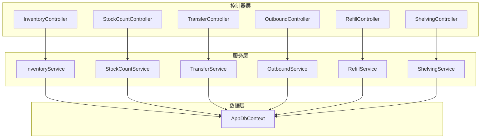
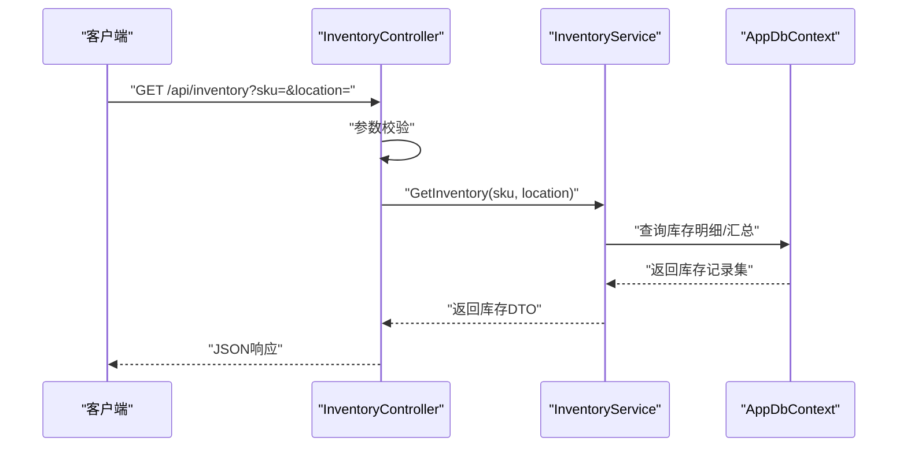
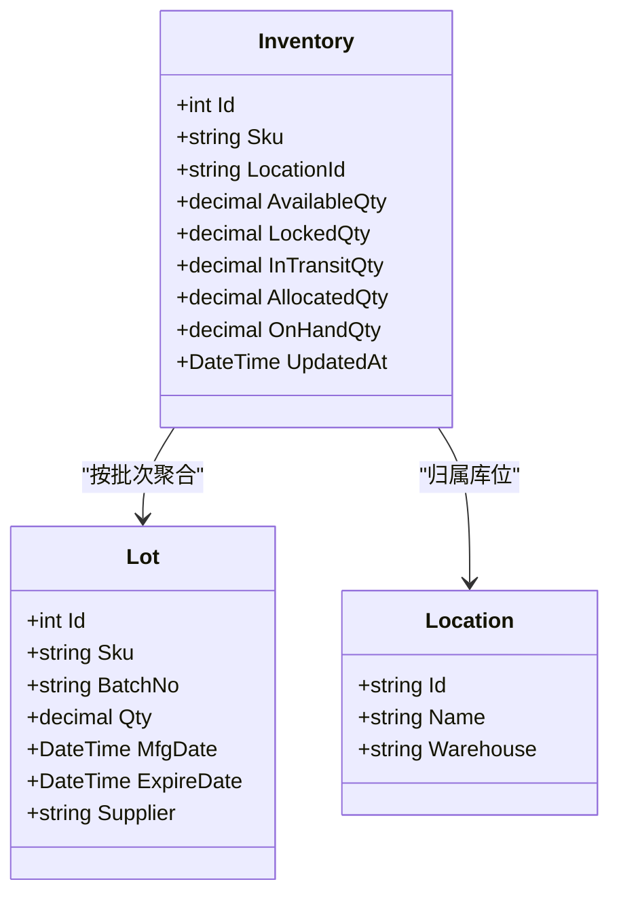
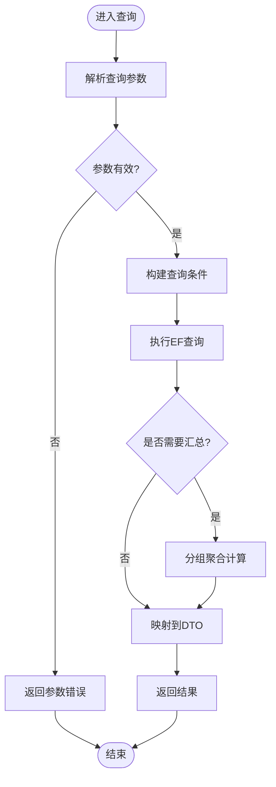
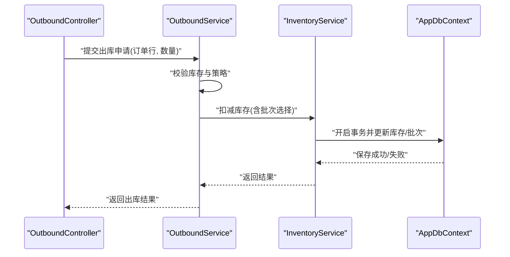
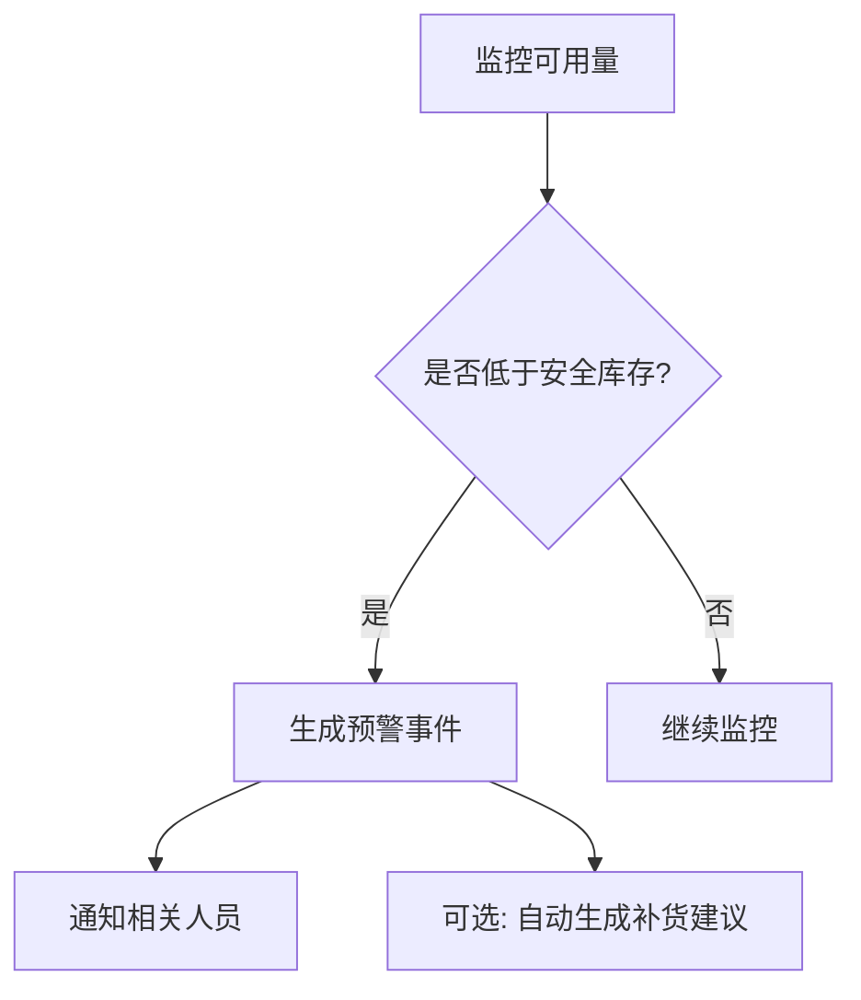
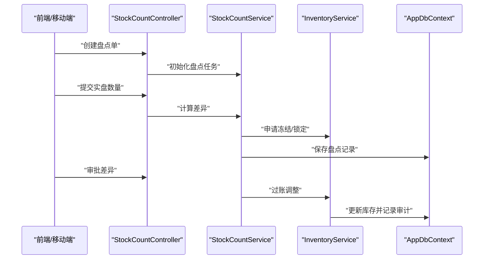
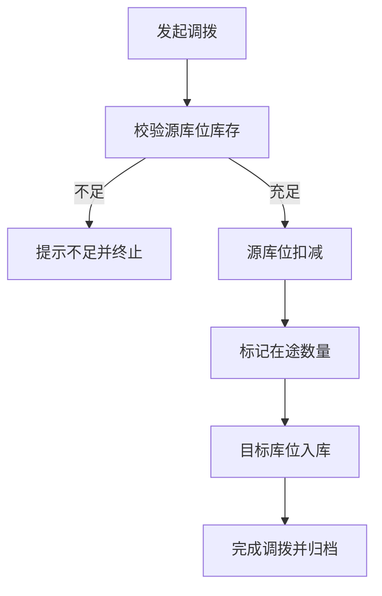
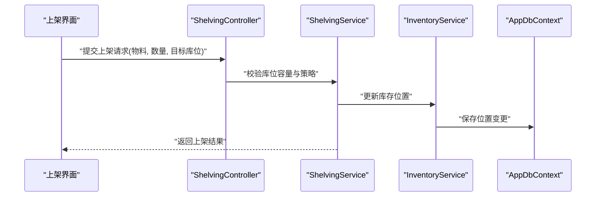
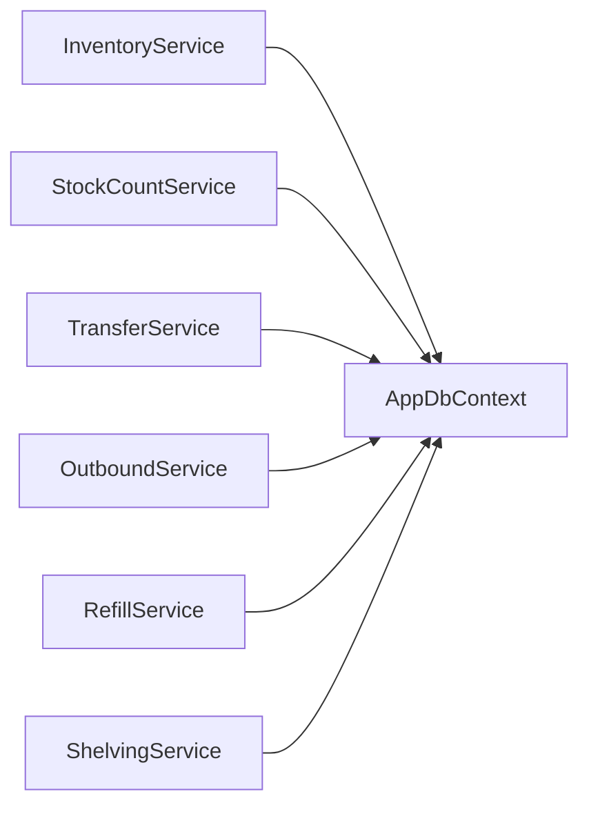

# 库存服务 (InventoryService)

<cite>
**本文档引用的文件**   
- [InventoryController.cs](file://dip-system/api/Controllers/InventoryController.cs)
- [InventoryService.cs](file://dip-system/api/Services/InventoryService.cs)
- [Inventory.cs](file://dip-system/api/Models/Inventory.cs)
- [AppDbContext.cs](file://dip-system/api/Data/AppDbContext.cs)
- [StockCountController.cs](file://dip-system/api/Controllers/StockCountController.cs)
- [StockCountService.cs](file://dip-system/api/Services/StockCountService.cs)
- [StockCount.cs](file://dip-system/api/Models/StockCount.cs)
- [TransferController.cs](file://dip-system/api/Controllers/TransferController.cs)
- [TransferService.cs](file://dip-system/api/Services/TransferService.cs)
- [Transfer.cs](file://dip-system/api/Models/Transfer.cs)
- [OutboundController.cs](file://dip-system/api/Controllers/OutboundController.cs)
- [OutboundService.cs](file://dip-system/api/Services/OutboundService.cs)
- [Outbound.cs](file://dip-system/api/Models/Outbound.cs)
- [RefillController.cs](file://dip-system/api/Controllers/RefillController.cs)
- [RefillService.cs](file://dip-system/api/Services/RefillService.cs)
- [Refill.cs](file://dip-system/api/Models/Refill.cs)
- [ShelvingController.cs](file://dip-system/api/Controllers/ShelvingController.cs)
- [ShelvingService.cs](file://dip-system/api/Services/ShelvingService.cs)
- [Shelving.cs](file://dip-system/api/Models/Shelving.cs)
- [Program.cs](file://dip-system/api/Program.cs)
- [appsettings.json](file://dip-system/api/appsettings.json)
</cite>

## 目录
1. [简介](#简介)
2. [项目结构](#项目结构)
3. [核心组件](#核心组件)
4. [架构总览](#架构总览)
5. [详细组件分析](#详细组件分析)
6. [依赖关系分析](#依赖关系分析)
7. [性能考虑](#性能考虑)
8. [故障排查指南](#故障排查指南)
9. [结论](#结论)
10. [附录](#附录)

## 简介
本文件为DIP系统库存服务的权威技术文档，聚焦于InventoryService的核心能力与实现细节。内容涵盖：
- 库存查询、入库出库操作、库存预警机制
- 库存数据模型设计、库存状态管理、批次追踪逻辑
- 库存计算算法、安全库存策略、库存周转率计算方法
- 库存同步机制、并发控制、事务处理策略
- 盘点、差异分析、调拨等高级功能的使用示例与实现要点

目标读者包括后端开发者、系统集成工程师、运维人员以及产品与业务方。

## 项目结构
库存相关代码主要位于dip-system/api目录下，采用分层架构：
- Controllers：对外API入口（如InventoryController、StockCountController、TransferController、OutboundController、RefillController、ShelvingController）
- Services：业务编排与领域逻辑（如InventoryService、StockCountService、TransferService、OutboundService、RefillService、ShelvingService）
- Models：领域实体（如Inventory、StockCount、Transfer、Outbound、Refill、Shelving）
- Data：数据访问上下文（AppDbContext）
- Program与appsettings.json：应用启动与配置

图表来源
- [InventoryController.cs](file://dip-system/api/Controllers/InventoryController.cs)
- [InventoryService.cs](file://dip-system/api/Services/InventoryService.cs)
- [AppDbContext.cs](file://dip-system/api/Data/AppDbContext.cs)
- [StockCountController.cs](file://dip-system/api/Controllers/StockCountController.cs)
- [StockCountService.cs](file://dip-system/api/Services/StockCountService.cs)
- [TransferController.cs](file://dip-system/api/Controllers/TransferController.cs)
- [TransferService.cs](file://dip-system/api/Services/TransferService.cs)
- [OutboundController.cs](file://dip-system/api/Controllers/OutboundController.cs)
- [OutboundService.cs](file://dip-system/api/Services/OutboundService.cs)
- [RefillController.cs](file://dip-system/api/Controllers/RefillController.cs)
- [RefillService.cs](file://dip-system/api/Services/RefillService.cs)
- [ShelvingController.cs](file://dip-system/api/Controllers/ShelvingController.cs)
- [ShelvingService.cs](file://dip-system/api/Services/ShelvingService.cs)

章节来源
- [Program.cs](file://dip-system/api/Program.cs)
- [appsettings.json](file://dip-system/api/appsettings.json)

## 核心组件
- InventoryService：库存主服务，提供库存查询、出入库扣减/增加、批次追踪、安全库存预警、库存快照与汇总等能力。
- StockCountService：盘点服务，负责盘点单创建、实盘录入、差异分析与调整过账。
- TransferService：调拨服务，支持跨仓库/库位调拨的出库与入库联动。
- OutboundService：出库服务，对接生产领料、销售出库等业务场景。
- RefillService：补货服务，结合安全库存策略触发补货建议与执行。
- ShelvingService：上架服务，将到货或退料按策略分配到库位并更新库存。

章节来源
- [InventoryService.cs](file://dip-system/api/Services/InventoryService.cs)
- [StockCountService.cs](file://dip-system/api/Services/StockCountService.cs)
- [TransferService.cs](file://dip-system/api/Services/TransferService.cs)
- [OutboundService.cs](file://dip-system/api/Services/OutboundService.cs)
- [RefillService.cs](file://dip-system/api/Services/RefillService.cs)
- [ShelvingService.cs](file://dip-system/api/Services/ShelvingService.cs)

## 架构总览
库存子系统采用“控制器-服务-仓储”三层架构，通过Entity Framework Core进行数据持久化。关键交互如下：
- 控制器接收HTTP请求，参数校验后调用对应服务方法
- 服务层封装业务规则（如批次FIFO、安全库存阈值、盘点差异过账）
- 数据层通过DbContext进行CRUD与事务边界控制

图表来源
- [InventoryController.cs](file://dip-system/api/Controllers/InventoryController.cs)
- [InventoryService.cs](file://dip-system/api/Services/InventoryService.cs)
- [AppDbContext.cs](file://dip-system/api/Data/AppDbContext.cs)

## 详细组件分析

### 库存数据模型与状态管理
- 库存主表（Inventory）：以SKU+库位维度聚合可用数量，包含锁定数、在途数、已分配数等字段，用于快速查询与展示。
- 批次跟踪（Lot/Batch）：记录每笔入库的批次号、生产日期、有效期、供应商等信息，出库时按策略（如FIFO/FEFO）选择批次。
- 库存状态：可用、锁定、在途、冻结、报废等状态由业务事件驱动变更，确保一致性。
- 关联实体：与位置（Location）、物料（Part/Material）、单据（订单、出库单、入库单）建立外键关系，支撑追溯。

图表来源
- [Inventory.cs](file://dip-system/api/Models/Inventory.cs)

章节来源
- [Inventory.cs](file://dip-system/api/Models/Inventory.cs)

### 库存查询与汇总
- 多维度查询：支持按SKU、库位、批次、供应商、日期范围过滤。
- 实时与快照：查询接口优先读取最新数据库值；对报表类需求可引入快照表提升性能。
- 汇总统计：按仓库、库区、SKU族别进行数量与金额汇总，支持分页与排序。

图表来源
- [InventoryService.cs](file://dip-system/api/Services/InventoryService.cs)
- [AppDbContext.cs](file://dip-system/api/Data/AppDbContext.cs)

章节来源
- [InventoryService.cs](file://dip-system/api/Services/InventoryService.cs)

### 入库与出库流程
- 入库（Refill/收货）：生成批次记录，增加可用数量；若存在锁定或预留，需协调释放或重新评估可用性。
- 出库（Outbound/领料）：根据策略选择批次（FIFO/FEFO），扣减可用数量，必要时减少锁定或预留。
- 事务边界：每次出入库操作在一个数据库事务内完成，保证原子性；失败则回滚。

图表来源
- [OutboundController.cs](file://dip-system/api/Controllers/OutboundController.cs)
- [OutboundService.cs](file://dip-system/api/Services/OutboundService.cs)
- [InventoryService.cs](file://dip-system/api/Services/InventoryService.cs)
- [AppDbContext.cs](file://dip-system/api/Data/AppDbContext.cs)

章节来源
- [OutboundService.cs](file://dip-system/api/Services/OutboundService.cs)
- [InventoryService.cs](file://dip-system/api/Services/InventoryService.cs)

### 库存预警与安全库存策略
- 安全库存：基于历史消耗、提前期、服务水平目标计算动态安全库存阈值。
- 预警规则：当可用量低于安全库存或再订货点时触发预警，支持邮件/站内消息通知。
- 补货建议：结合最小/最大库存、批量策略生成补货建议单。

图表来源
- [InventoryService.cs](file://dip-system/api/Services/InventoryService.cs)
- [RefillService.cs](file://dip-system/api/Services/RefillService.cs)

章节来源
- [InventoryService.cs](file://dip-system/api/Services/InventoryService.cs)
- [RefillService.cs](file://dip-system/api/Services/RefillService.cs)

### 库存盘点与差异分析
- 盘点单：创建盘点任务，冻结相关库位或SKU的变动，确保盘点期间数据一致。
- 实盘录入：移动端或PC端录入实盘数量，系统自动比对账面数量。
- 差异过账：差异经审批后生成调整单，更新库存并记录审计轨迹。

图表来源
- [StockCountController.cs](file://dip-system/api/Controllers/StockCountController.cs)
- [StockCountService.cs](file://dip-system/api/Services/StockCountService.cs)
- [InventoryService.cs](file://dip-system/api/Services/InventoryService.cs)
- [AppDbContext.cs](file://dip-system/api/Data/AppDbContext.cs)

章节来源
- [StockCountService.cs](file://dip-system/api/Services/StockCountService.cs)
- [StockCount.cs](file://dip-system/api/Models/StockCount.cs)

### 库存调拨
- 调拨流程：发起调拨单，源库位扣减，目标库位入库，支持跨仓库调拨。
- 批次继承：调拨保留原批次信息，便于追溯。
- 在途库存：调拨过程中可维护在途数量，避免重复采购或超发。

图表来源
- [TransferController.cs](file://dip-system/api/Controllers/TransferController.cs)
- [TransferService.cs](file://dip-system/api/Services/TransferService.cs)
- [InventoryService.cs](file://dip-system/api/Services/InventoryService.cs)

章节来源
- [TransferService.cs](file://dip-system/api/Services/TransferService.cs)
- [Transfer.cs](file://dip-system/api/Models/Transfer.cs)

### 上架与库位管理
- 上架策略：按库位容量、ABC分类、先进先出等策略推荐库位。
- 上架确认：扫描条码确认后更新库存位置，保持账物一致。
- 库位占用：支持库位级锁定，防止并发冲突。

图表来源
- [ShelvingController.cs](file://dip-system/api/Controllers/ShelvingController.cs)
- [ShelvingService.cs](file://dip-system/api/Services/ShelvingService.cs)
- [InventoryService.cs](file://dip-system/api/Services/InventoryService.cs)
- [AppDbContext.cs](file://dip-system/api/Data/AppDbContext.cs)

章节来源
- [ShelvingService.cs](file://dip-system/api/Services/ShelvingService.cs)
- [Shelving.cs](file://dip-system/api/Models/Shelving.cs)

### 库存计算算法与周转率
- 可用库存 = 在库数量 - 锁定数量 - 预留数量 + 在途数量（视策略而定）
- 批次选择：FIFO（最早入库先出）或 FEFO（最早过期先出）
- 安全库存：基于服务水平、需求波动、提前期标准差计算
- 库存周转率 = 期间出库成本 / 平均库存价值（可按月/季/年统计）

章节来源
- [InventoryService.cs](file://dip-system/api/Services/InventoryService.cs)
- [RefillService.cs](file://dip-system/api/Services/RefillService.cs)

### 并发控制与事务处理
- 并发控制：使用数据库行级锁或乐观锁版本号防止超卖；热点SKU可引入分布式锁。
- 事务边界：每个业务操作（出入库、盘点过账、调拨）在一个事务中完成，失败回滚。
- 幂等性：对重复提交请求进行去重处理，避免重复过账。

章节来源
- [InventoryService.cs](file://dip-system/api/Services/InventoryService.cs)
- [AppDbContext.cs](file://dip-system/api/Data/AppDbContext.cs)

### 库存同步机制
- 实时同步：所有写操作直接落库，读操作走数据库，保证强一致。
- 缓存策略：对只读热点数据可使用内存缓存（如IMemoryCache）降低DB压力。
- 异步事件：对非关键路径（如报表、通知）采用消息队列异步处理。

章节来源
- [Program.cs](file://dip-system/api/Program.cs)
- [appsettings.json](file://dip-system/api/appsettings.json)

## 依赖关系分析
库存服务依赖以下模块：
- 数据访问：AppDbContext（EF Core）
- 外部集成：认证、消息通知、报表导出（按需）
- 配置中心：appsettings.json中的连接串、缓存、日志级别等

图表来源
- [InventoryService.cs](file://dip-system/api/Services/InventoryService.cs)
- [StockCountService.cs](file://dip-system/api/Services/StockCountService.cs)
- [TransferService.cs](file://dip-system/api/Services/TransferService.cs)
- [OutboundService.cs](file://dip-system/api/Services/OutboundService.cs)
- [RefillService.cs](file://dip-system/api/Services/RefillService.cs)
- [ShelvingService.cs](file://dip-system/api/Services/ShelvingService.cs)
- [AppDbContext.cs](file://dip-system/api/Data/AppDbContext.cs)

章节来源
- [AppDbContext.cs](file://dip-system/api/Data/AppDbContext.cs)

## 性能考虑
- 查询优化：为常用过滤字段建立索引（SKU、库位、批次、时间戳）。
- 分页与投影：仅返回必要字段，避免大对象传输。
- 缓存与快照：报表类接口使用快照表或缓存，减轻DB负载。
- 批处理：大批量出入库采用批量更新，减少往返次数。
- 连接池：合理配置EF连接池大小，避免连接耗尽。

[本节为通用指导，不直接分析具体文件]

## 故障排查指南
- 常见错误
  - 库存不足：检查可用数量、锁定与预留、在途数量；核对批次策略。
  - 并发冲突：查看版本号或锁等待；重试或降级策略。
  - 事务失败：检查异常堆栈与回滚点；确认约束与唯一性。
- 诊断步骤
  - 启用详细日志，定位问题链路
  - 使用慢查询分析工具定位瓶颈
  - 核对盘点差异与审计轨迹
- 恢复措施
  - 回滚未提交事务
  - 修正数据后重新过账
  - 清理僵尸锁与临时记录

章节来源
- [InventoryService.cs](file://dip-system/api/Services/InventoryService.cs)
- [StockCountService.cs](file://dip-system/api/Services/StockCountService.cs)
- [AppDbContext.cs](file://dip-system/api/Data/AppDbContext.cs)

## 结论
InventoryService作为DIP系统的库存中枢，提供了完整的库存查询、出入库、批次追踪、安全库存预警、盘点与调拨能力。通过清晰的分层架构、严格的事务与并发控制、以及可扩展的策略机制，系统能够稳定支撑复杂的生产与供应链场景。建议在生产环境持续优化查询与缓存策略，完善监控与告警，保障高可用与高性能。

[本节为总结性内容，不直接分析具体文件]

## 附录
- 使用示例
  - 库存查询：调用InventoryController的查询接口，传入SKU与库位参数，获取可用与锁定数量。
  - 出库操作：通过OutboundController提交出库申请，服务层自动选择批次并扣减库存。
  - 盘点流程：创建盘点单，录入实盘数量，审批差异后自动过账调整。
  - 调拨操作：发起调拨单，源库位扣减，目标库位入库，支持在途跟踪。
  - 补货建议：基于安全库存与消耗预测，生成补货建议单并推送通知。

章节来源
- [InventoryController.cs](file://dip-system/api/Controllers/InventoryController.cs)
- [OutboundController.cs](file://dip-system/api/Controllers/OutboundController.cs)
- [StockCountController.cs](file://dip-system/api/Controllers/StockCountController.cs)
- [TransferController.cs](file://dip-system/api/Controllers/TransferController.cs)
- [RefillController.cs](file://dip-system/api/Controllers/RefillController.cs)