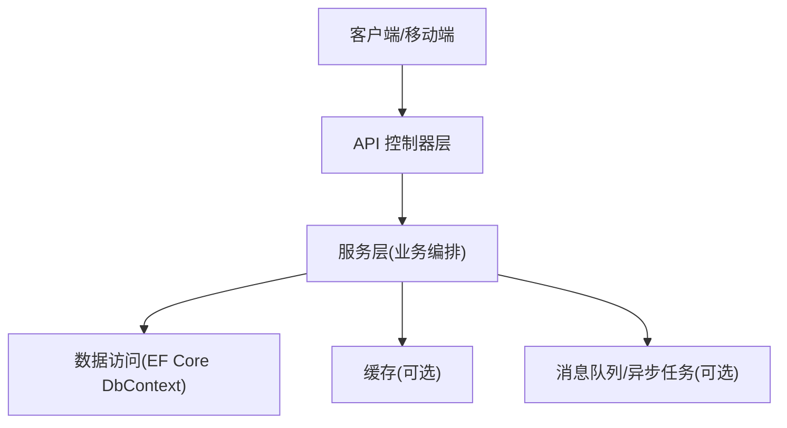
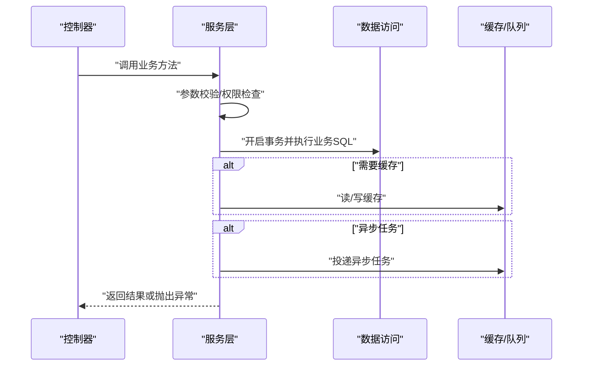
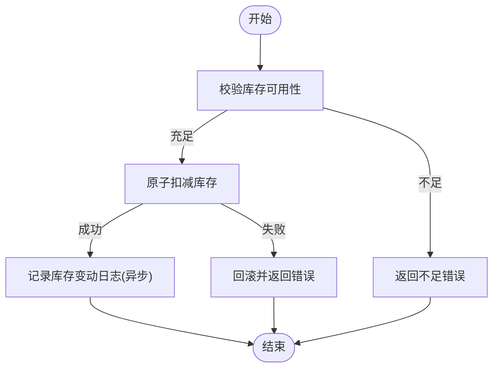
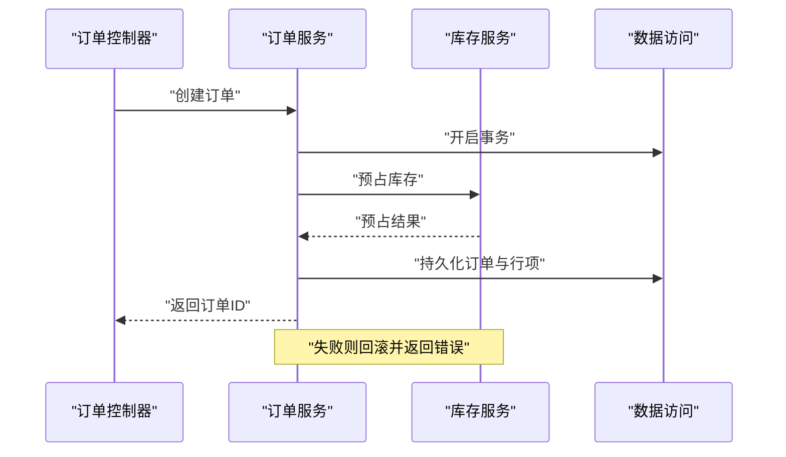
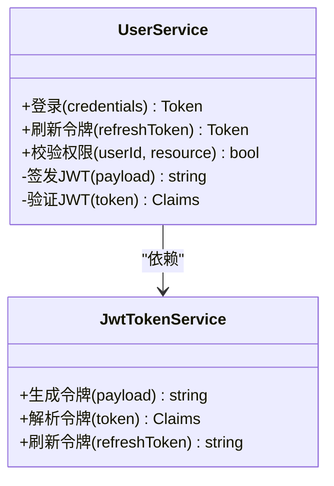
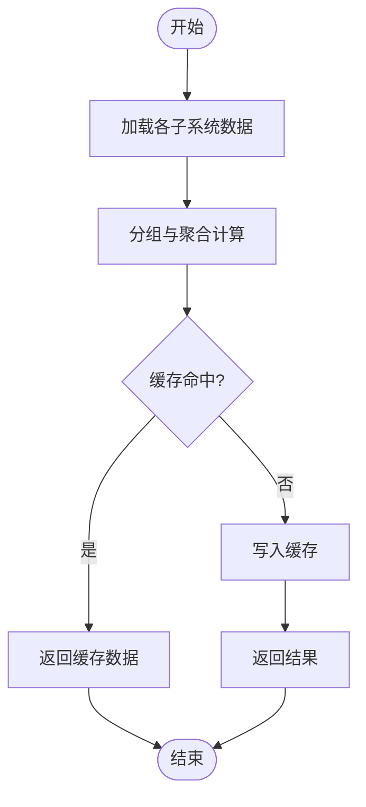
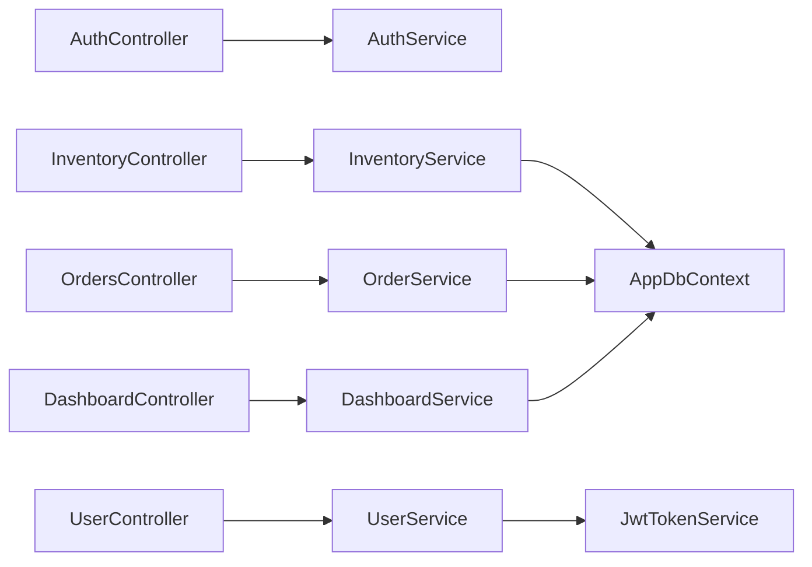

# 服务层

<cite>
**本文引用的文件**   
- [InventoryService.cs](file://dip-system/api/Services/InventoryService.cs)
- [OrderService.cs](file://dip-system/api/Services/OrderService.cs)
- [UserService.cs](file://dip-system/api/Services/UserService.cs)
- [DashboardService.cs](file://dip-system/api/Services/DashboardService.cs)
- [AppDbContext.cs](file://dip-system/api/Data/AppDbContext.cs)
- [Inventory.cs](file://dip-system/api/Models/Inventory.cs)
- [Order.cs](file://dip-system/api/Models/Order.cs)
- [BaseEntity.cs](file://dip-system/api/Models/BaseEntity.cs)
- [AuthController.cs](file://dip-system/api/Controllers/AuthController.cs)
- [InventoryController.cs](file://dip-system/api/Controllers/InventoryController.cs)
- [OrdersController.cs](file://dip-system/api/Controllers/OrdersController.cs)
- [UserController.cs](file://dip-system/api/Controllers/UserController.cs)
- [DashboardController.cs](file://dip-system/api/Controllers/DashboardController.cs)
- [JwtTokenService.cs](file://dip-system/api/Services/JwtTokenService.cs)
- [AppException.cs](file://dip-system/api/Services/AppException.cs)
- [Program.cs](file://dip-system/api/Program.cs)
</cite>

## 目录
1. [简介](#简介)
2. [项目结构](#项目结构)
3. [核心组件](#核心组件)
4. [架构总览](#架构总览)
5. [详细组件分析](#详细组件分析)
6. [依赖关系分析](#依赖关系分析)
7. [性能考虑](#性能考虑)
8. [故障排查指南](#故障排查指南)
9. [结论](#结论)
10. [附录](#附录) 

## 简介
本文件面向DIP系统服务层，聚焦职责边界、业务逻辑封装与事务管理策略，围绕库存、订单、用户与数据聚合四大核心服务展开。文档同时覆盖服务间调用模式、缓存策略、异步处理、错误重试机制，并结合领域驱动设计（DDD）思想对业务建模与单元测试实践进行说明，最后给出性能调优、内存管理与并发控制的实践经验建议。

## 项目结构
DIP系统采用典型的分层架构：控制器负责HTTP请求与响应映射，服务层承载业务编排与事务边界，数据访问通过EF Core上下文完成。关键目录与角色如下：
- Controllers：对外暴露REST接口，薄封装参数校验与结果转换
- Services：业务编排、跨实体一致性、缓存与异步任务协调
- Data：EF Core DbContext与数据库连接配置
- Models：领域模型与基础实体定义
- Program：应用启动、依赖注入与服务注册

[本图为概念性结构图，不直接映射具体源码文件]

## 核心组件
本节概述四大核心服务的职责与协作方式：
- InventoryService：库存查询、扣减、回滚、批次与库位联动、并发安全
- OrderService：订单创建、状态流转、与库存/出库/补料等子流程编排
- UserService：用户认证授权、权限校验、会话与令牌管理
- DashboardService：多源数据聚合、统计指标计算、报表数据组装

**章节来源**
- [InventoryService.cs](file://dip-system/api/Services/InventoryService.cs)
- [OrderService.cs](file://dip-system/api/Services/OrderService.cs)
- [UserService.cs](file://dip-system/api/Services/UserService.cs)
- [DashboardService.cs](file://dip-system/api/Services/DashboardService.cs)

## 架构总览
服务层在系统中承担“业务编排者”的角色，向上对接控制器，向下协调数据访问与外部资源。典型交互包括：
- 控制器接收请求并委托服务方法
- 服务内使用事务保证一致性
- 必要时读取或写入缓存
- 将耗时操作放入异步队列执行
- 统一异常与错误码返回

[本图为概念性流程图，不直接映射具体源码文件]

## 详细组件分析

### InventoryService（库存服务）
职责边界
- 库存查询与汇总：按物料、库位、批次维度查询可用量、锁定量、在途量
- 库存扣减与回滚：下单扣减、出库确认、异常回滚
- 并发控制：基于行级锁或版本号避免超卖
- 与出库/补料/盘点等业务协同：确保库存变动可追溯

核心算法要点
- 扣减顺序：先校验可用量，再原子扣减，失败即回滚
- 批号追踪：记录批次、库位、时间戳，支持正向与逆向追溯
- 防重幂等：基于唯一键或分布式锁防止重复扣减

事务策略
- 以一次HTTP请求为边界，所有相关表更新在同一事务中提交或回滚
- 长事务拆分：将非关键路径的日志、通知移出事务

缓存策略
- 热点库存查询可短期缓存，设置合理TTL与失效策略
- 写后失效：库存变更后主动清除相关缓存

异步处理
- 库存审计日志、下游通知等异步化，降低主链路延迟

错误与重试
- 区分可重试与不可重试异常
- 指数退避重试，限制最大重试次数与超时

**图表来源**
- [InventoryService.cs](file://dip-system/api/Services/InventoryService.cs)
- [Inventory.cs](file://dip-system/api/Models/Inventory.cs)
- [AppDbContext.cs](file://dip-system/api/Data/AppDbContext.cs)

**章节来源**
- [InventoryService.cs](file://dip-system/api/Services/InventoryService.cs)
- [Inventory.cs](file://dip-system/api/Models/Inventory.cs)
- [AppDbContext.cs](file://dip-system/api/Data/AppDbContext.cs)

### OrderService（订单服务）
职责边界
- 订单生命周期：创建、审核、发货、完成、取消
- 与库存、出库、补料、替代料等子域协作
- 订单状态机：严格的状态迁移规则与前置条件校验

核心算法要点
- 订单行项校验：物料、数量、替代关系、交期
- 库存预占与释放：下单预占、出库释放、取消释放
- 并发安全：同一订单行项串行化处理

事务策略
- 订单创建与库存预占同事务
- 出库确认与库存扣减同事务
- 跨服务调用尽量本地化，减少分布式事务复杂度

缓存策略
- 订单模板、字典类数据可缓存
- 订单详情一般不缓存，保证强一致

异步处理
- 订单状态变更通知、报表写入、审计日志异步化

错误与重试
- 订单状态冲突时采用幂等键与重试
- 外部依赖失败时降级与告警

**图表来源**
- [OrderService.cs](file://dip-system/api/Services/OrderService.cs)
- [Order.cs](file://dip-system/api/Models/Order.cs)
- [InventoryService.cs](file://dip-system/api/Services/InventoryService.cs)
- [AppDbContext.cs](file://dip-system/api/Data/AppDbContext.cs)

**章节来源**
- [OrderService.cs](file://dip-system/api/Services/OrderService.cs)
- [Order.cs](file://dip-system/api/Models/Order.cs)

### UserService（用户服务）
职责边界
- 用户认证：登录、令牌签发与刷新
- 权限校验：基于角色/资源的访问控制
- 用户信息管理：增删改查、状态管理

核心算法要点
- JWT签发与验证：签名、过期、黑名单
- 密码安全：哈希存储、加盐
- 会话管理：在线用户状态、强制下线

事务策略
- 用户信息变更与审计日志同事务
- 认证流程无写操作，无需事务

缓存策略
- 用户角色与权限可短期缓存
- 令牌黑名单需快速查找（内存或Redis）

异步处理
- 登录审计日志、风控事件异步上报

错误与重试
- 认证失败不重试，避免暴力破解
- 令牌刷新失败提示重新登录

**图表来源**
- [UserService.cs](file://dip-system/api/Services/UserService.cs)
- [JwtTokenService.cs](file://dip-system/api/Services/JwtTokenService.cs)

**章节来源**
- [UserService.cs](file://dip-system/api/Services/UserService.cs)
- [JwtTokenService.cs](file://dip-system/api/Services/JwtTokenService.cs)

### DashboardService（数据聚合服务）
职责边界
- 聚合多源数据：库存、订单、出库、生产准备等
- 计算关键指标：周转率、缺货率、完成率、在制量
- 提供报表数据接口

核心算法要点
- 批量查询与分组聚合：减少往返次数
- 增量计算：仅计算变化部分
- 分页与投影：只返回必要字段

事务策略
- 纯读操作，通常无需事务
- 复杂聚合可在只读副本上执行

缓存策略
- 仪表盘数据适合缓存，TTL按刷新频率设定
- 缓存穿透防护：空值缓存与布隆过滤器

异步处理
- 定时任务刷新缓存
- 大数据量聚合后台执行

错误与重试
- 数据源不可用时的降级与默认值
- 重试策略限流与熔断

**图表来源**
- [DashboardService.cs](file://dip-system/api/Services/DashboardService.cs)
- [AppDbContext.cs](file://dip-system/api/Data/AppDbContext.cs)

**章节来源**
- [DashboardService.cs](file://dip-system/api/Services/DashboardService.cs)

## 依赖关系分析
服务层依赖关系清晰，控制器到服务单向依赖，服务通过接口或实例访问数据访问层与其他服务。关键依赖如下：
- 控制器依赖对应服务
- 服务依赖DbContext与共享服务（如JWT、缓存、队列）
- 服务之间通过依赖注入解耦

**图表来源**
- [AuthController.cs](file://dip-system/api/Controllers/AuthController.cs)
- [InventoryController.cs](file://dip-system/api/Controllers/InventoryController.cs)
- [OrdersController.cs](file://dip-system/api/Controllers/OrdersController.cs)
- [UserController.cs](file://dip-system/api/Controllers/UserController.cs)
- [DashboardController.cs](file://dip-system/api/Controllers/DashboardController.cs)
- [InventoryService.cs](file://dip-system/api/Services/InventoryService.cs)
- [OrderService.cs](file://dip-system/api/Services/OrderService.cs)
- [UserService.cs](file://dip-system/api/Services/UserService.cs)
- [DashboardService.cs](file://dip-system/api/Services/DashboardService.cs)
- [AppDbContext.cs](file://dip-system/api/Data/AppDbContext.cs)
- [JwtTokenService.cs](file://dip-system/api/Services/JwtTokenService.cs)

**章节来源**
- [Program.cs](file://dip-system/api/Program.cs)
- [InventoryService.cs](file://dip-system/api/Services/InventoryService.cs)
- [OrderService.cs](file://dip-system/api/Services/OrderService.cs)
- [UserService.cs](file://dip-system/api/Services/UserService.cs)
- [DashboardService.cs](file://dip-system/api/Services/DashboardService.cs)
- [AppDbContext.cs](file://dip-system/api/Data/AppDbContext.cs)
- [JwtTokenService.cs](file://dip-system/api/Services/JwtTokenService.cs)

## 性能考虑
- 查询优化：按需投影、分页、索引设计、避免N+1查询
- 事务最小化：缩短事务范围，避免长事务持有锁
- 缓存策略：热点数据缓存、写后失效、合理TTL
- 异步化：I/O密集型操作异步执行，提升吞吐
- 并发控制：行级锁、版本号、分布式锁避免竞态
- 内存管理：避免大对象分配、及时释放引用、使用流式处理
- 连接池：合理配置数据库连接池大小与超时
- 监控与度量：关键指标埋点、慢查询告警

[本节为通用指导，不直接分析具体文件]

## 故障排查指南
- 常见错误分类：参数校验失败、权限不足、库存不足、并发冲突、数据不一致
- 异常处理：统一异常捕获、错误码规范、日志记录
- 调试技巧：启用详细日志、跟踪事务边界、检查缓存命中
- 恢复策略：补偿事务、重试与降级、人工干预入口

**章节来源**
- [AppException.cs](file://dip-system/api/Services/AppException.cs)

## 结论
DIP系统服务层以清晰的职责边界与严谨的事务策略为核心，结合缓存、异步与并发控制，实现了高内聚、低耦合的业务编排。通过DDD思想指导建模与测试，配合完善的错误处理与性能优化，系统具备良好的可维护性与扩展性。

[本节为总结性内容，不直接分析具体文件]

## 附录
- 单元测试建议：针对服务方法编写用例，覆盖正常路径、边界条件与异常场景
- 接口抽象：服务接口定义稳定契约，便于替换实现与Mock
- 领域事件：通过事件解耦副作用，提升可测试性
- 持续集成：自动化测试与代码质量检查

[本节为补充说明，不直接分析具体文件]