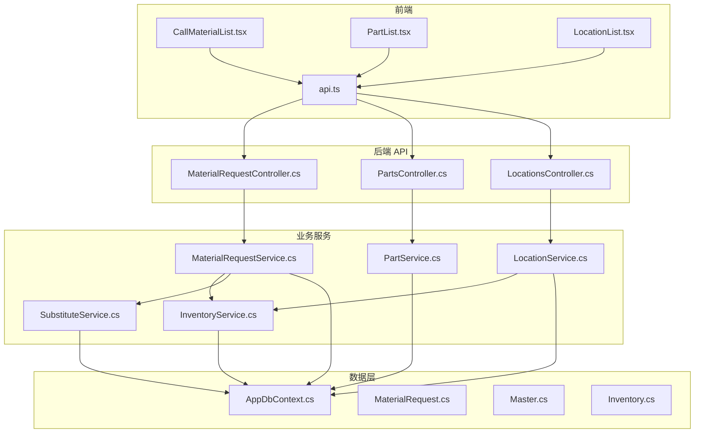
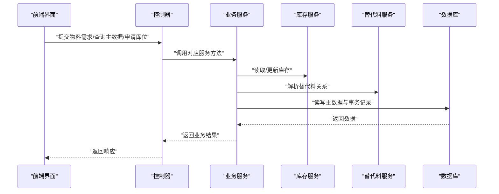
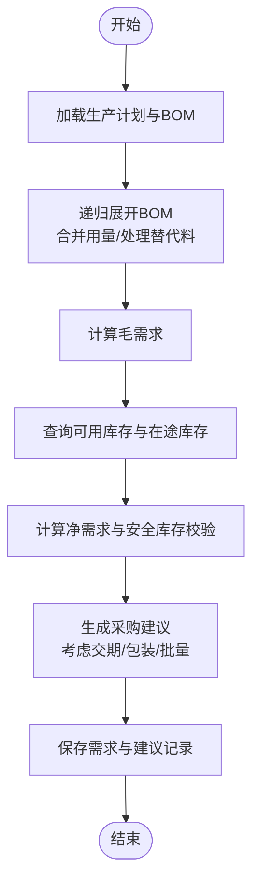
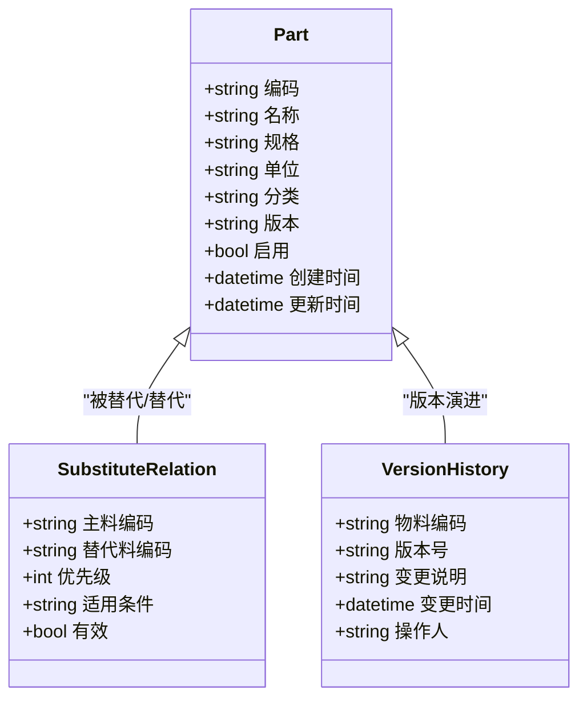
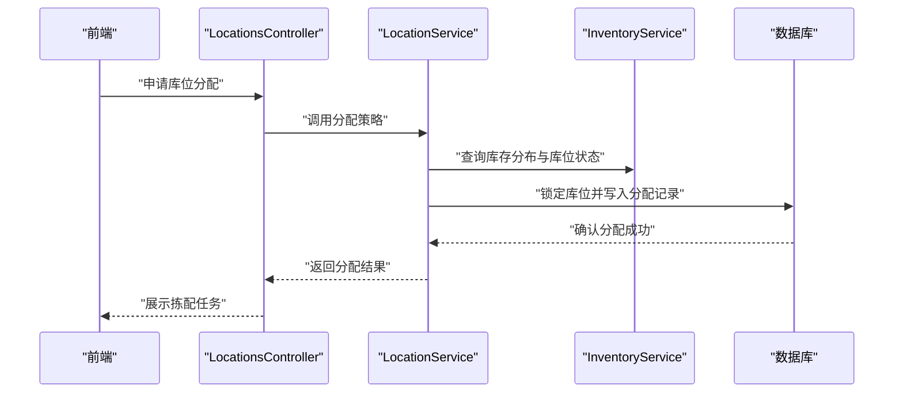
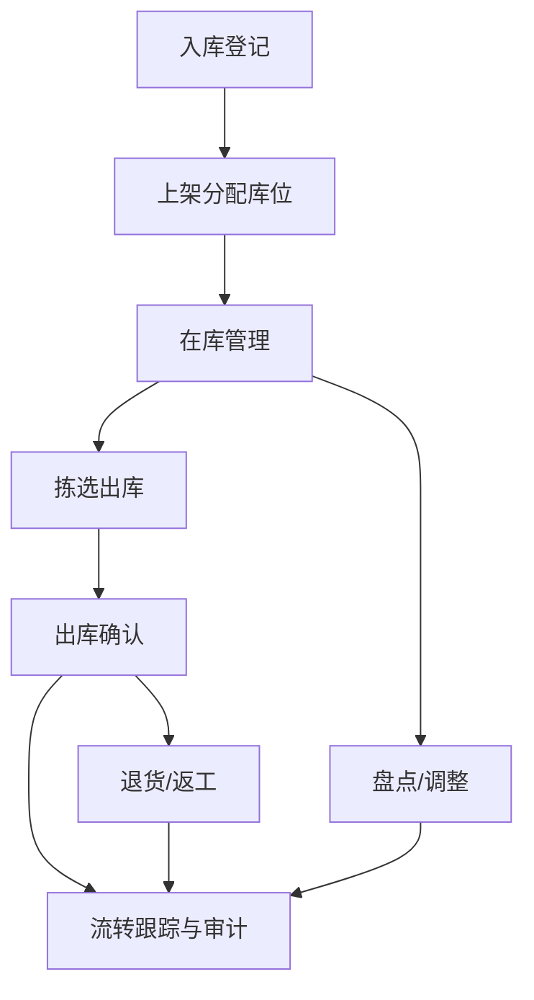
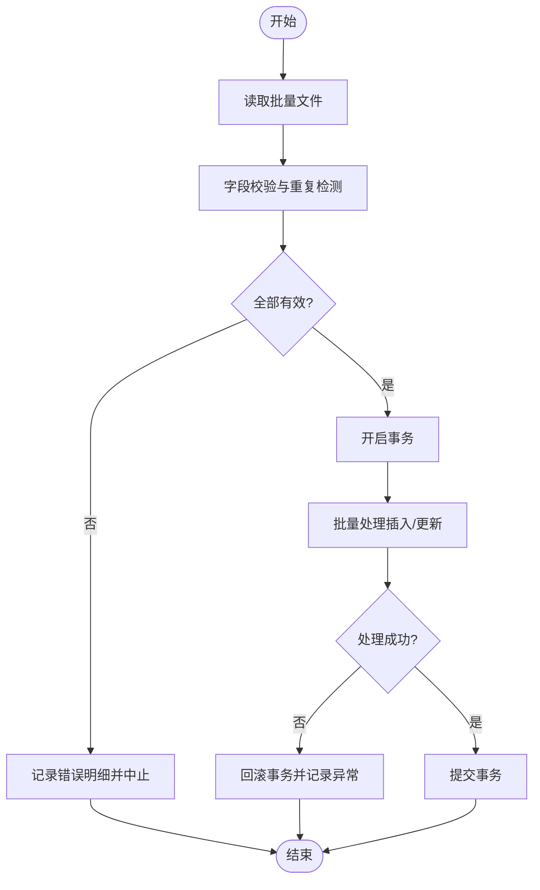
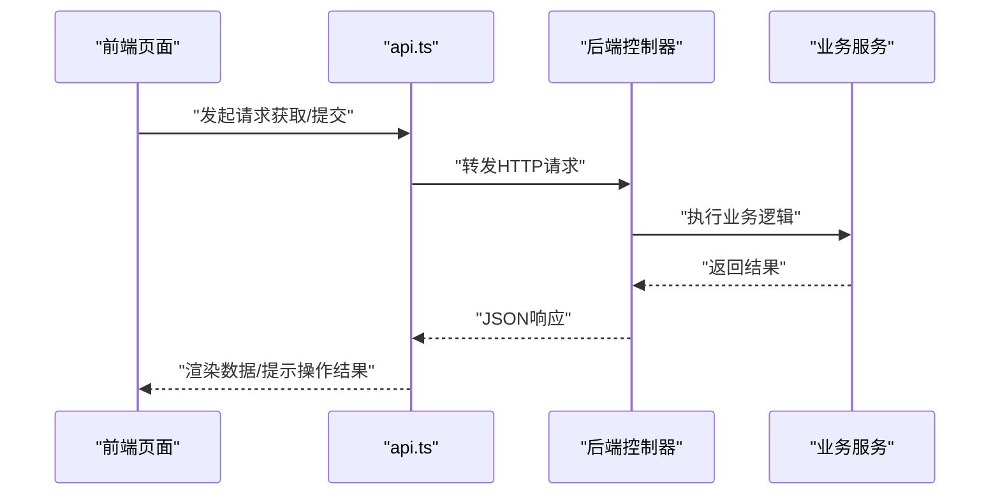
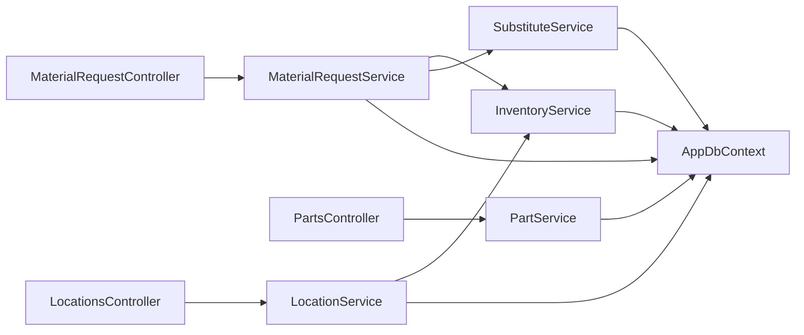

# 物料管理服务群

<cite>
**本文引用的文件**   
- [MaterialRequestService.cs](file://dip-system/api/Services/MaterialRequestService.cs)
- [PartService.cs](file://dip-system/api/Services/PartService.cs)
- [LocationService.cs](file://dip-system/api/Services/LocationService.cs)
- [MaterialRequestController.cs](file://dip-system/api/Controllers/MaterialRequestController.cs)
- [PartsController.cs](file://dip-system/api/Controllers/PartsController.cs)
- [LocationsController.cs](file://dip-system/api/Controllers/LocationsController.cs)
- [InventoryService.cs](file://dip-system/api/Services/InventoryService.cs)
- [SubstituteService.cs](file://dip-system/api/Services/SubstituteService.cs)
- [MaterialRequest.cs](file://dip-system/api/Models/MaterialRequest.cs)
- [Master.cs](file://dip-system/api/Models/Master.cs)
- [Inventory.cs](file://dip-system/api/Models/Inventory.cs)
- [AppDbContext.cs](file://dip-system/api/Data/AppDbContext.cs)
- [Program.cs](file://dip-system/api/Program.cs)
- [api.ts](file://dip-system/frontend-web/src/lib/api.ts)
- [CallMaterialList.tsx](file://dip-system/frontend-web/src/pages/CallMaterialList.tsx)
- [PartList.tsx](file://dip-system/frontend-web/src/pages/PartList.tsx)
- [LocationList.tsx](file://dip-system/frontend-web/src/pages/LocationList.tsx)
</cite>

## 目录
1. [简介](#简介)
2. [项目结构](#项目结构)
3. [核心组件](#核心组件)
4. [架构总览](#架构总览)
5. [详细组件分析](#详细组件分析)
6. [依赖关系分析](#依赖关系分析)
7. [性能考虑](#性能考虑)
8. [故障排查指南](#故障排查指南)
9. [结论](#结论)
10. [附录](#附录)

## 简介
本文件面向DIP系统物料管理服务群，围绕三大核心服务展开：
- MaterialRequestService（物料需求计划）：负责需求预测、BOM展开、缺料计算与采购建议生成。
- PartService（零件主数据管理）：负责物料编码规则、版本控制、替代料关系管理与主数据维护。
- LocationService（库位管理）：负责库位建模、分配策略、拣配路径优化与库存联动。

文档同时覆盖物料流转跟踪、库存联动、批量数据处理、异常处理与前端集成示例，帮助读者快速理解并落地使用。

## 项目结构
后端采用ASP.NET Core分层架构：Controllers提供HTTP接口，Services实现业务逻辑，Models定义数据模型，Data层通过EF Core访问数据库。前端为React+Vite应用，通过API模块调用后端接口。

**图表来源** 
- [MaterialRequestController.cs](file://dip-system/api/Controllers/MaterialRequestController.cs)
- [PartsController.cs](file://dip-system/api/Controllers/PartsController.cs)
- [LocationsController.cs](file://dip-system/api/Controllers/LocationsController.cs)
- [MaterialRequestService.cs](file://dip-system/api/Services/MaterialRequestService.cs)
- [PartService.cs](file://dip-system/api/Services/PartService.cs)
- [LocationService.cs](file://dip-system/api/Services/LocationService.cs)
- [InventoryService.cs](file://dip-system/api/Services/InventoryService.cs)
- [SubstituteService.cs](file://dip-system/api/Services/SubstituteService.cs)
- [AppDbContext.cs](file://dip-system/api/Data/AppDbContext.cs)
- [MaterialRequest.cs](file://dip-system/api/Models/MaterialRequest.cs)
- [Master.cs](file://dip-system/api/Models/Master.cs)
- [Inventory.cs](file://dip-system/api/Models/Inventory.cs)
- [api.ts](file://dip-system/frontend-web/src/lib/api.ts)
- [CallMaterialList.tsx](file://dip-system/frontend-web/src/pages/CallMaterialList.tsx)
- [PartList.tsx](file://dip-system/frontend-web/src/pages/PartList.tsx)
- [LocationList.tsx](file://dip-system/frontend-web/src/pages/LocationList.tsx)

**章节来源**
- [Program.cs](file://dip-system/api/Program.cs)
- [AppDbContext.cs](file://dip-system/api/Data/AppDbContext.cs)

## 核心组件
- 物料需求计划（MaterialRequestService）
  - 功能要点：需求预测、BOM展开、净需求计算、安全库存校验、采购建议生成、批次与版本控制。
  - 关键输入：生产计划、BOM、在途库存、可用库存、替代料关系。
  - 关键输出：物料需求清单、采购建议、缺料预警。
- 零件主数据（PartService）
  - 功能要点：物料编码规则、版本管理、替代料关系、属性与状态控制。
  - 关键输入：主数据变更、替代关系配置。
  - 关键输出：主数据快照、版本链、替代矩阵。
- 库位管理（LocationService）
  - 功能要点：库位建模、分配策略（FIFO/FEFO/就近原则）、拣配路径优化、库存联动扣减与回滚。
  - 关键输入：出库指令、库位容量与状态、库存分布。
  - 关键输出：库位分配结果、拣配任务、库存变动记录。

**章节来源**
- [MaterialRequestService.cs](file://dip-system/api/Services/MaterialRequestService.cs)
- [PartService.cs](file://dip-system/api/Services/PartService.cs)
- [LocationService.cs](file://dip-system/api/Services/LocationService.cs)

## 架构总览
整体采用“控制器-服务-仓储”的分层模式，结合领域服务（库存、替代料）进行能力解耦。数据持久化由EF Core驱动，前后端通过RESTful API交互。

**图表来源** 
- [MaterialRequestController.cs](file://dip-system/api/Controllers/MaterialRequestController.cs)
- [PartsController.cs](file://dip-system/api/Controllers/PartsController.cs)
- [LocationsController.cs](file://dip-system/api/Controllers/LocationsController.cs)
- [MaterialRequestService.cs](file://dip-system/api/Services/MaterialRequestService.cs)
- [PartService.cs](file://dip-system/api/Services/PartService.cs)
- [LocationService.cs](file://dip-system/api/Services/LocationService.cs)
- [InventoryService.cs](file://dip-system/api/Services/InventoryService.cs)
- [SubstituteService.cs](file://dip-system/api/Services/SubstituteService.cs)
- [AppDbContext.cs](file://dip-system/api/Data/AppDbContext.cs)

## 详细组件分析

### 物料需求计划（MaterialRequestService）
- 需求预测算法
  - 基于历史消耗与生产计划的加权预测，考虑季节性与订单波动。
  - 安全库存阈值校验，触发补货或紧急采购建议。
- BOM展开逻辑
  - 递归展开多层BOM，合并同层级物料用量，支持替代料替换优先级。
  - 对替代料进行可替代性校验与用量折算。
- 净需求计算
  - 净需求 = 毛需求 - 可用库存 - 在途库存 + 安全库存。
  - 按批次/版本聚合，生成采购建议与到货时间预估。
- 采购建议生成机制
  - 依据供应商交期、最小包装量、经济批量等约束生成建议单。
  - 支持分批采购与合并建议。

**图表来源** 
- [MaterialRequestService.cs](file://dip-system/api/Services/MaterialRequestService.cs)
- [InventoryService.cs](file://dip-system/api/Services/InventoryService.cs)
- [SubstituteService.cs](file://dip-system/api/Services/SubstituteService.cs)
- [MaterialRequest.cs](file://dip-system/api/Models/MaterialRequest.cs)

**章节来源**
- [MaterialRequestService.cs](file://dip-system/api/Services/MaterialRequestService.cs)
- [MaterialRequest.cs](file://dip-system/api/Models/MaterialRequest.cs)

### 零件主数据（PartService）
- 物料编码规则
  - 统一编码规范，包含类别码、序列号、校验位等，确保唯一性与可读性。
- 版本控制
  - 支持多版本并存，变更时生成新版本并保留历史链；影响范围评估（替代料、BOM引用）。
- 替代料关系管理
  - 建立替代矩阵，支持一对一/一对多替代，定义优先级与适用条件。
- 主数据维护
  - 新增、修改、停用、归档等操作，配合审计日志与权限控制。

**图表来源** 
- [PartService.cs](file://dip-system/api/Services/PartService.cs)
- [Master.cs](file://dip-system/api/Models/Master.cs)

**章节来源**
- [PartService.cs](file://dip-system/api/Services/PartService.cs)
- [Master.cs](file://dip-system/api/Models/Master.cs)

### 库位管理（LocationService）
- 库位建模
  - 库区-货架-层-格四级结构，支持容量、温湿区、禁放限制等属性。
- 分配策略
  - FIFO/FEFO优先，结合就近原则与拣配路径优化，减少搬运距离。
  - 支持整箱/拆箱策略与混放规则。
- 库存联动
  - 出库扣减、入库上架、移库调整，保证账实一致。
  - 异常回滚与事务边界控制。

**图表来源** 
- [LocationsController.cs](file://dip-system/api/Controllers/LocationsController.cs)
- [LocationService.cs](file://dip-system/api/Services/LocationService.cs)
- [InventoryService.cs](file://dip-system/api/Services/InventoryService.cs)
- [AppDbContext.cs](file://dip-system/api/Data/AppDbContext.cs)

**章节来源**
- [LocationService.cs](file://dip-system/api/Services/LocationService.cs)
- [Inventory.cs](file://dip-system/api/Models/Inventory.cs)

### 物料流转跟踪与库存联动
- 流转节点：入库→上架→在库→拣选→出库→退货/报废。
- 库存联动：每次流转触发库存数量与库位状态更新，记录流水与审计信息。
- 异常处理：冲突检测、锁机制、补偿事务与重试策略。

**图表来源** 
- [InventoryService.cs](file://dip-system/api/Services/InventoryService.cs)
- [LocationService.cs](file://dip-system/api/Services/LocationService.cs)
- [MaterialRequestService.cs](file://dip-system/api/Services/MaterialRequestService.cs)

**章节来源**
- [InventoryService.cs](file://dip-system/api/Services/InventoryService.cs)
- [LocationService.cs](file://dip-system/api/Services/LocationService.cs)

### 批量数据处理与异常处理
- 批量导入：支持Excel/CSV批量导入主数据与需求计划，进行格式校验与重复检测。
- 事务边界：批量操作以事务包裹，失败回滚并记录错误明细。
- 异常处理：统一异常过滤器捕获异常，返回标准化错误响应。

**图表来源** 
- [MaterialRequestService.cs](file://dip-system/api/Services/MaterialRequestService.cs)
- [PartService.cs](file://dip-system/api/Services/PartService.cs)
- [AppExceptionFilter.cs](file://dip-system/api/Controllers/AppExceptionFilter.cs)

**章节来源**
- [MaterialRequestService.cs](file://dip-system/api/Services/MaterialRequestService.cs)
- [PartService.cs](file://dip-system/api/Services/PartService.cs)
- [AppExceptionFilter.cs](file://dip-system/api/Controllers/AppExceptionFilter.cs)

### 物料管理界面集成
- 前端页面：
  - CallMaterialList.tsx：物料需求列表与操作入口。
  - PartList.tsx：零件主数据维护界面。
  - LocationList.tsx：库位管理与分配界面。
- API封装：
  - api.ts：统一的HTTP请求封装与错误处理。

**图表来源** 
- [api.ts](file://dip-system/frontend-web/src/lib/api.ts)
- [CallMaterialList.tsx](file://dip-system/frontend-web/src/pages/CallMaterialList.tsx)
- [PartList.tsx](file://dip-system/frontend-web/src/pages/PartList.tsx)
- [LocationList.tsx](file://dip-system/frontend-web/src/pages/LocationList.tsx)
- [MaterialRequestController.cs](file://dip-system/api/Controllers/MaterialRequestController.cs)
- [PartsController.cs](file://dip-system/api/Controllers/PartsController.cs)
- [LocationsController.cs](file://dip-system/api/Controllers/LocationsController.cs)

**章节来源**
- [api.ts](file://dip-system/frontend-web/src/lib/api.ts)
- [CallMaterialList.tsx](file://dip-system/frontend-web/src/pages/CallMaterialList.tsx)
- [PartList.tsx](file://dip-system/frontend-web/src/pages/PartList.tsx)
- [LocationList.tsx](file://dip-system/frontend-web/src/pages/LocationList.tsx)

## 依赖关系分析
- 控制器与服务之间松耦合，服务间通过接口或依赖注入协作。
- 库存与替代料作为领域服务被需求计划与库位服务复用。
- EF Core上下文集中管理实体映射与事务。

**图表来源** 
- [MaterialRequestController.cs](file://dip-system/api/Controllers/MaterialRequestController.cs)
- [PartsController.cs](file://dip-system/api/Controllers/PartsController.cs)
- [LocationsController.cs](file://dip-system/api/Controllers/LocationsController.cs)
- [MaterialRequestService.cs](file://dip-system/api/Services/MaterialRequestService.cs)
- [PartService.cs](file://dip-system/api/Services/PartService.cs)
- [LocationService.cs](file://dip-system/api/Services/LocationService.cs)
- [InventoryService.cs](file://dip-system/api/Services/InventoryService.cs)
- [SubstituteService.cs](file://dip-system/api/Services/SubstituteService.cs)
- [AppDbContext.cs](file://dip-system/api/Data/AppDbContext.cs)

**章节来源**
- [Program.cs](file://dip-system/api/Program.cs)
- [AppDbContext.cs](file://dip-system/api/Data/AppDbContext.cs)

## 性能考虑
- 数据库层面：合理索引（编码、版本、库位ID），分页查询与只读缓存。
- 服务层面：BOM展开避免重复计算，使用记忆化或增量更新。
- 并发控制：库位分配加锁，防止超卖与冲突。
- 批量处理：分批次提交，降低事务大小与内存占用。

[本节为通用指导，不直接分析具体文件]

## 故障排查指南
- 常见问题
  - 需求预测偏差：检查历史数据完整性与权重参数。
  - BOM展开异常：核对替代料关系与层级深度。
  - 库位分配失败：确认库位状态与容量限制。
- 定位手段
  - 查看异常过滤器返回的错误详情。
  - 检查事务日志与审计记录。
  - 使用调试工具追踪服务调用链。

**章节来源**
- [AppExceptionFilter.cs](file://dip-system/api/Controllers/AppExceptionFilter.cs)
- [MaterialRequestService.cs](file://dip-system/api/Services/MaterialRequestService.cs)
- [PartService.cs](file://dip-system/api/Services/PartService.cs)
- [LocationService.cs](file://dip-system/api/Services/LocationService.cs)

## 结论
本物料管理服务群以清晰的分层架构与领域服务解耦为核心，实现了从需求预测、BOM展开到库位分配的完整闭环。通过严格的版本控制与替代料管理，保障主数据一致性；借助库存联动与事务控制，确保账实一致与高可靠性。建议在后续迭代中持续优化预测算法与分配策略，并加强监控与告警能力。

[本节为总结性内容，不直接分析具体文件]

## 附录
- 术语表
  - 毛需求：根据生产计划与BOM计算的原始需求量。
  - 净需求：扣除可用库存与在途库存后的实际需求。
  - 替代料：可替代主料的物料，具有优先级与适用条件。
  - 库位：仓库中的物理存储位置，具备容量与状态属性。
- 最佳实践
  - 主数据变更需评估影响范围并生成新版本。
  - 批量操作务必使用事务与错误回滚。
  - 库位分配遵循策略并记录决策依据。

[本节为补充信息，不直接分析具体文件]