# 生产运营服务群

<cite>
**本文档引用的文件**   
- [PrepService.cs](file://dip-system/api/Services/PrepService.cs)
- [ShelvingService.cs](file://dip-system/api/Services/ShelvingService.cs)
- [OutboundService.cs](file://dip-system/api/Services/OutboundService.cs)
- [RefillService.cs](file://dip-system/api/Services/RefillService.cs)
- [ReturnService.cs](file://dip-system/api/Services/ReturnService.cs)
- [PrepController.cs](file://dip-system/api/Controllers/PrepController.cs)
- [ShelvingController.cs](file://dip-system/api/Controllers/ShelvingController.cs)
- [OutboundController.cs](file://dip-system/api/Controllers/OutboundController.cs)
- [RefillController.cs](file://dip-system/api/Controllers/RefillController.cs)
- [ReturnController.cs](file://dip-system/api/Controllers/ReturnController.cs)
- [Prep.cs](file://dip-system/api/Models/Prep.cs)
- [Shelving.cs](file://dip-system/api/Models/Shelving.cs)
- [Outbound.cs](file://dip-system/api/Models/Outbound.cs)
- [Refill.cs](file://dip-system/api/Models/Refill.cs)
- [Return.cs](file://dip-system/api/Models/Return.cs)
- [Order.cs](file://dip-system/api/Models/Order.cs)
- [Inventory.cs](file://dip-system/api/Models/Inventory.cs)
- [MaterialRequest.cs](file://dip-system/api/Models/MaterialRequest.cs)
- [AppDbContext.cs](file://dip-system/api/Data/AppDbContext.cs)
- [AppExceptionFilter.cs](file://dip-system/api/Controllers/AppExceptionFilter.cs)
- [ApiService.kt](file://mobile-android/app/src/main/java/com/dip/material/data/network/ApiService.kt)
- [RetrofitClient.kt](file://mobile-android/app/src/main/java/com/dip/material/data/network/RetrofitClient.kt)
- [AuthInterceptor.kt](file://mobile-android/app/src/main/java/com/dip/material/data/network/AuthInterceptor.kt)
- [CallMaterialScreen.kt](file://mobile-android/app/src/main/java/com/dip/material/ui/callmaterial/CallMaterialScreen.kt)
- [OutboundScreen.kt](file://mobile-android/app/src/main/java/com/dip/material/ui/outbound/OutboundScreen.kt)
- [PrepScreen.kt](file://mobile-android/app/src/main/java/com/dip/material/ui/prep/PrepScreen.kt)
- [RefillScreen.kt](file://mobile-android/app/src/main/java/com/dip/material/ui/refill/RefillScreen.kt)
- [ReturnScreen.kt](file://mobile-android/app/src/main/java/com/dip/material/ui/return_/ReturnScreen.kt)
- [ShelvingScreen.kt](file://mobile-android/app/src/main/java/com/dip/material/ui/shelving/ShelvingScreen.kt)
- [BarcodeAnalyzer.kt](file://mobile-android/app/src/main/java/com/dip/material/ui/components/BarcodeAnalyzer.kt)
- [QrCodeScanner.kt](file://mobile-android/app/src/main/java/com/dip/material/ui/components/QrCodeScanner.kt)
- [ScanBus.kt](file://mobile-android/app/src/main/java/com/dip/material/utils/ScanBus.kt)
- [ScanConfig.kt](file://mobile-android/app/src/main/java/com/dip/material/utils/ScanConfig.kt)
- [AppRepository.kt](file://mobile-android/app/src/main/java/com/dip/material/data/repository/AppRepository.kt)
</cite>

## 目录
1. [简介](#简介)
2. [项目结构](#项目结构)
3. [核心组件](#核心组件)
4. [架构总览](#架构总览)
5. [详细组件分析](#详细组件分析)
6. [依赖关系分析](#依赖关系分析)
7. [性能考量](#性能考量)
8. [故障排查指南](#故障排查指南)
9. [结论](#结论)
10. [附录](#附录)

## 简介
本文件面向DIP系统“生产运营服务群”，围绕备料、上架、出库、补料、退料五大核心服务，系统化阐述业务流程、与生产工单的关联、物料配送逻辑、库位优化策略、作业指导书管理、扫码操作支持、异常处理机制，以及生产节拍分析、效率统计与质量追溯能力。同时给出移动端（Android/PDA）集成方案与离线操作实现建议，帮助实施与运维团队快速落地与排障。

## 项目结构
后端采用C# Web API分层架构：控制器负责HTTP接口，服务层封装业务逻辑，模型定义数据实体，数据访问通过Entity Framework上下文统一。前端Web提供管理界面；移动端Android应用通过Retrofit调用API，并内置扫码与PDA适配能力。

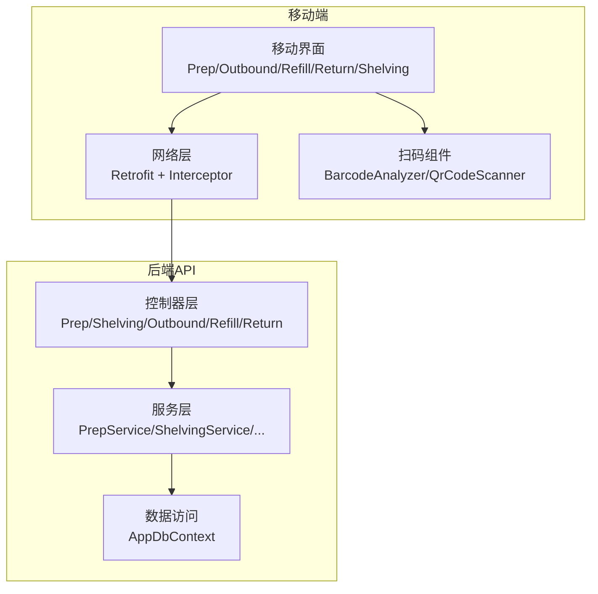

**图示来源** 
- [PrepController.cs](file://dip-system/api/Controllers/PrepController.cs)
- [ShelvingController.cs](file://dip-system/api/Controllers/ShelvingController.cs)
- [OutboundController.cs](file://dip-system/api/Controllers/OutboundController.cs)
- [RefillController.cs](file://dip-system/api/Controllers/RefillController.cs)
- [ReturnController.cs](file://dip-system/api/Controllers/ReturnController.cs)
- [PrepService.cs](file://dip-system/api/Services/PrepService.cs)
- [ShelvingService.cs](file://dip-system/api/Services/ShelvingService.cs)
- [OutboundService.cs](file://dip-system/api/Services/OutboundService.cs)
- [RefillService.cs](file://dip-system/api/Services/RefillService.cs)
- [ReturnService.cs](file://dip-system/api/Services/ReturnService.cs)
- [AppDbContext.cs](file://dip-system/api/Data/AppDbContext.cs)
- [ApiService.kt](file://mobile-android/app/src/main/java/com/dip/material/data/network/ApiService.kt)
- [RetrofitClient.kt](file://mobile-android/app/src/main/java/com/dip/material/data/network/RetrofitClient.kt)
- [AuthInterceptor.kt](file://mobile-android/app/src/main/java/com/dip/material/data/network/AuthInterceptor.kt)
- [BarcodeAnalyzer.kt](file://mobile-android/app/src/main/java/com/dip/material/ui/components/BarcodeAnalyzer.kt)
- [QrCodeScanner.kt](file://mobile-android/app/src/main/java/com/dip/material/ui/components/QrCodeScanner.kt)

**章节来源**
- [AppDbContext.cs](file://dip-system/api/Data/AppDbContext.cs)
- [ApiService.kt](file://mobile-android/app/src/main/java/com/dip/material/data/network/ApiService.kt)
- [RetrofitClient.kt](file://mobile-android/app/src/main/java/com/dip/material/data/network/RetrofitClient.kt)
- [AuthInterceptor.kt](file://mobile-android/app/src/main/java/com/dip/material/data/network/AuthInterceptor.kt)

## 核心组件
- 备料服务（PrepService）：基于生产工单生成备料任务，校验BOM齐套性，驱动仓库拣配与配送至线边。
- 上架服务（ShelvingService）：入库与库位分配，执行条码校验与批次/效期管理，优化库位策略。
- 出库服务（OutboundService）：按工单或领料单扣减库存，生成出库记录，支持分批出库与异常回滚。
- 补料服务（RefillService）：线边低水位触发补料，计算补料量与安全库存，联动上游备料与出库。
- 退料服务（ReturnService）：工单结束或变更时退回剩余物料，更新库存与工单消耗。

上述服务均通过对应控制器暴露REST接口，使用统一的异常过滤器与响应包装。

**章节来源**
- [PrepService.cs](file://dip-system/api/Services/PrepService.cs)
- [ShelvingService.cs](file://dip-system/api/Services/ShelvingService.cs)
- [OutboundService.cs](file://dip-system/api/Services/OutboundService.cs)
- [RefillService.cs](file://dip-system/api/Services/RefillService.cs)
- [ReturnService.cs](file://dip-system/api/Services/ReturnService.cs)
- [PrepController.cs](file://dip-system/api/Controllers/PrepController.cs)
- [ShelvingController.cs](file://dip-system/api/Controllers/ShelvingController.cs)
- [OutboundController.cs](file://dip-system/api/Controllers/OutboundController.cs)
- [RefillController.cs](file://dip-system/api/Controllers/RefillController.cs)
- [ReturnController.cs](file://dip-system/api/Controllers/ReturnController.cs)

## 架构总览
系统采用“移动端—API—服务层—数据层”的分层架构。移动端负责扫码采集与交互，API层进行参数校验与权限控制，服务层编排业务流与事务边界，数据层通过EF Core持久化。全局异常过滤器统一错误码与日志。

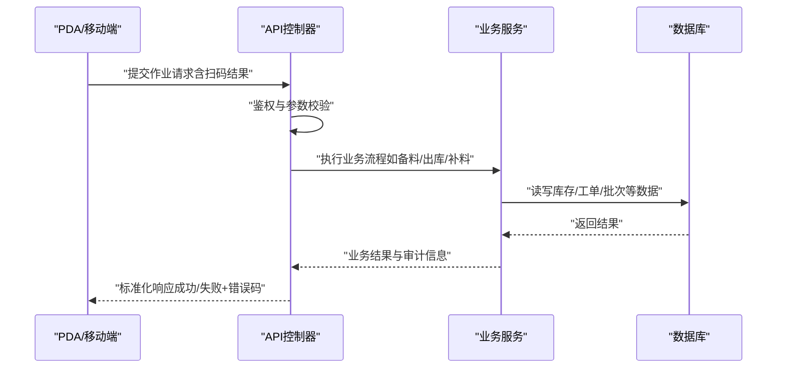

**图示来源** 
- [PrepController.cs](file://dip-system/api/Controllers/PrepController.cs)
- [PrepService.cs](file://dip-system/api/Services/PrepService.cs)
- [AppDbContext.cs](file://dip-system/api/Data/AppDbContext.cs)
- [ApiService.kt](file://mobile-android/app/src/main/java/com/dip/material/data/network/ApiService.kt)
- [AuthInterceptor.kt](file://mobile-android/app/src/main/java/com/dip/material/data/network/AuthInterceptor.kt)

## 详细组件分析

### 备料服务（PrepService）
- 目标：根据生产工单生成备料清单，校验物料齐套，协调拣配与配送。
- 关键流程：
  - 解析工单BOM，计算需求数量与可用库存。
  - 生成备料任务，标记优先级与配送路线。
  - 与出库服务协作完成拣货与发运。
- 异常处理：缺料、超期、批次不匹配等场景返回明确错误码，支持重试与人工干预。
- 移动端集成：PrepScreen调用API，结合扫码确认物料与库位。

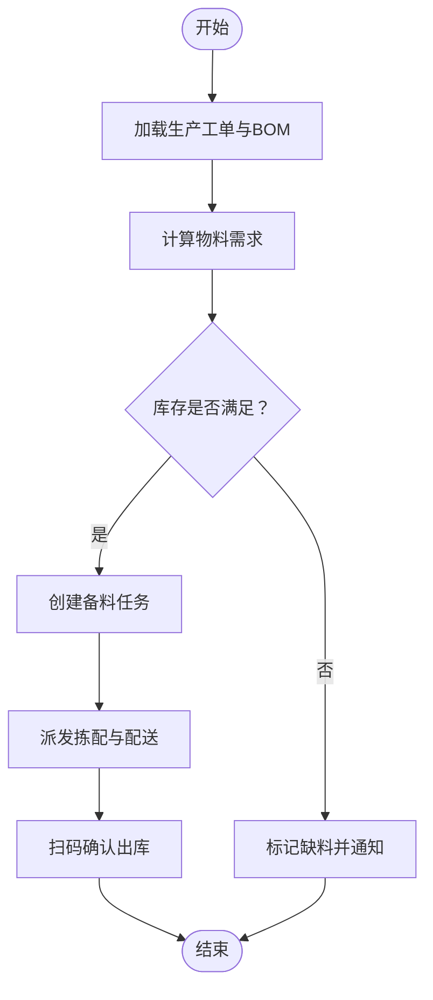

**图示来源** 
- [PrepService.cs](file://dip-system/api/Services/PrepService.cs)
- [PrepController.cs](file://dip-system/api/Controllers/PrepController.cs)
- [PrepScreen.kt](file://mobile-android/app/src/main/java/com/dip/material/ui/prep/PrepScreen.kt)

**章节来源**
- [PrepService.cs](file://dip-system/api/Services/PrepService.cs)
- [PrepController.cs](file://dip-system/api/Controllers/PrepController.cs)
- [Prep.cs](file://dip-system/api/Models/Prep.cs)
- [Order.cs](file://dip-system/api/Models/Order.cs)
- [Inventory.cs](file://dip-system/api/Models/Inventory.cs)
- [PrepScreen.kt](file://mobile-android/app/src/main/java/com/dip/material/ui/prep/PrepScreen.kt)

### 上架服务（ShelvingService）
- 目标：将到货物料入库并分配到合适库位，确保可追溯与先进先出。
- 关键流程：
  - 扫描物料条码，校验批次、效期与供应商信息。
  - 依据库位策略（就近、同族、温区等）选择库位。
  - 写入库存与库位映射，生成上架记录。
- 库位优化：考虑周转率、体积重量、拣选路径最短化。
- 移动端集成：ShelvingScreen引导扫码与库位确认。

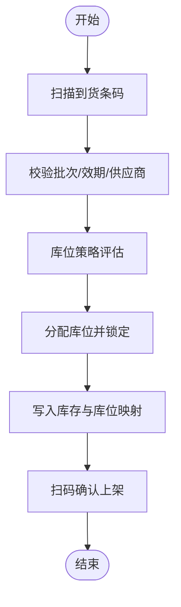

**图示来源** 
- [ShelvingService.cs](file://dip-system/api/Services/ShelvingService.cs)
- [ShelvingController.cs](file://dip-system/api/Controllers/ShelvingController.cs)
- [ShelvingScreen.kt](file://mobile-android/app/src/main/java/com/dip/material/ui/shelving/ShelvingScreen.kt)

**章节来源**
- [ShelvingService.cs](file://dip-system/api/Services/ShelvingService.cs)
- [ShelvingController.cs](file://dip-system/api/Controllers/ShelvingController.cs)
- [Shelving.cs](file://dip-system/api/Models/Shelving.cs)
- [Inventory.cs](file://dip-system/api/Models/Inventory.cs)
- [ShelvingScreen.kt](file://mobile-android/app/src/main/java/com/dip/material/ui/shelving/ShelvingScreen.kt)

### 出库服务（OutboundService）
- 目标：按工单或领料单扣减库存，生成出库记录，支持分批与异常回滚。
- 关键流程：
  - 校验出库单与工单关联关系。
  - 计算可出库数量与批次（FIFO/FEFO）。
  - 扣减库存并记录批次流向，支持部分出库。
- 异常处理：库存不足、批次冲突、超限额等，提供补偿与重试。
- 移动端集成：OutboundScreen扫码确认出库与差异登记。

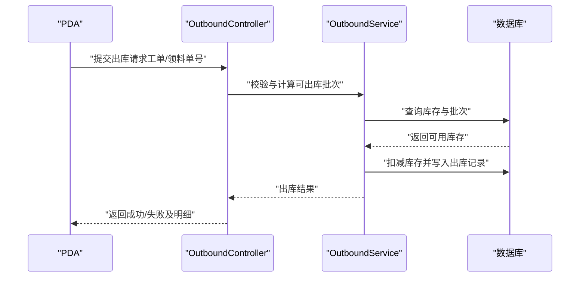

**图示来源** 
- [OutboundService.cs](file://dip-system/api/Services/OutboundService.cs)
- [OutboundController.cs](file://dip-system/api/Controllers/OutboundController.cs)
- [OutboundScreen.kt](file://mobile-android/app/src/main/java/com/dip/material/ui/outbound/OutboundScreen.kt)

**章节来源**
- [OutboundService.cs](file://dip-system/api/Services/OutboundService.cs)
- [OutboundController.cs](file://dip-system/api/Controllers/OutboundController.cs)
- [Outbound.cs](file://dip-system/api/Models/Outbound.cs)
- [Inventory.cs](file://dip-system/api/Models/Inventory.cs)
- [OutboundScreen.kt](file://mobile-android/app/src/main/java/com/dip/material/ui/outbound/OutboundScreen.kt)

### 补料服务（RefillService）
- 目标：线边低水位自动触发补料，保障连续生产。
- 关键流程：
  - 监控线边库存与消耗速率，计算安全库存与补料点。
  - 生成补料任务，联动备料与出库服务。
  - 记录补料原因与批次，支持追溯。
- 异常处理：频繁波动、异常消耗、供应延迟等，提供阈值调整与告警。
- 移动端集成：RefillScreen展示补料任务与扫码确认。

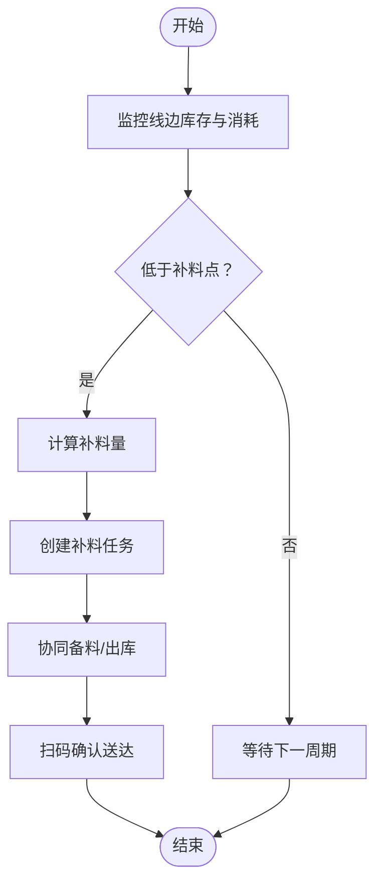

**图示来源** 
- [RefillService.cs](file://dip-system/api/Services/RefillService.cs)
- [RefillController.cs](file://dip-system/api/Controllers/RefillController.cs)
- [RefillScreen.kt](file://mobile-android/app/src/main/java/com/dip/material/ui/refill/RefillScreen.kt)

**章节来源**
- [RefillService.cs](file://dip-system/api/Services/RefillService.cs)
- [RefillController.cs](file://dip-system/api/Controllers/RefillController.cs)
- [Refill.cs](file://dip-system/api/Models/Refill.cs)
- [Inventory.cs](file://dip-system/api/Models/Inventory.cs)
- [RefillScreen.kt](file://mobile-android/app/src/main/java/com/dip/material/ui/refill/RefillScreen.kt)

### 退料服务（ReturnService）
- 目标：工单结束或变更时退回剩余物料，更新库存与工单消耗。
- 关键流程：
  - 校验工单状态与退料范围。
  - 扫描退料条码，核对批次与数量。
  - 更新库存与工单消耗记录，生成退料凭证。
- 异常处理：超退、批次不符、工单关闭等，提供拦截与修正流程。
- 移动端集成：ReturnScreen引导扫码与退料确认。

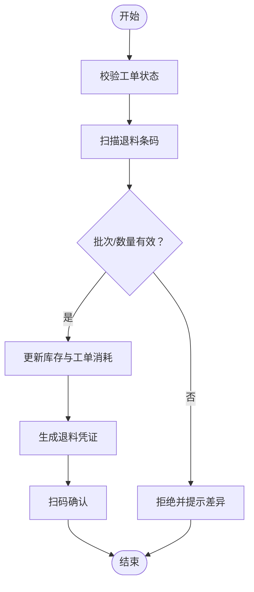

**图示来源** 
- [ReturnService.cs](file://dip-system/api/Services/ReturnService.cs)
- [ReturnController.cs](file://dip-system/api/Controllers/ReturnController.cs)
- [ReturnScreen.kt](file://mobile-android/app/src/main/java/com/dip/material/ui/return_/ReturnScreen.kt)

**章节来源**
- [ReturnService.cs](file://dip-system/api/Services/ReturnService.cs)
- [ReturnController.cs](file://dip-system/api/Controllers/ReturnController.cs)
- [Return.cs](file://dip-system/api/Models/Return.cs)
- [Inventory.cs](file://dip-system/api/Models/Inventory.cs)
- [ReturnScreen.kt](file://mobile-android/app/src/main/java/com/dip/material/ui/return_/ReturnScreen.kt)

### 生产工单关联与物料配送逻辑
- 工单驱动：所有服务以工单为轴心，建立备料—出库—上线—补料—退料的闭环。
- 配送逻辑：基于工单优先级、物料齐套性与库位距离，生成最优配送计划。
- 追溯链路：从工单到物料批次的全链路记录，支持正向与反向追溯。

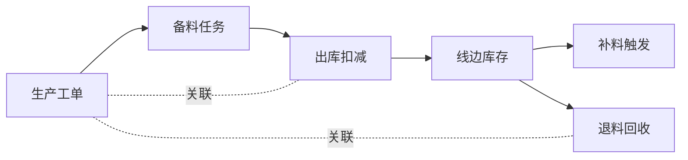

**图示来源** 
- [Order.cs](file://dip-system/api/Models/Order.cs)
- [Prep.cs](file://dip-system/api/Models/Prep.cs)
- [Outbound.cs](file://dip-system/api/Models/Outbound.cs)
- [Refill.cs](file://dip-system/api/Models/Refill.cs)
- [Return.cs](file://dip-system/api/Models/Return.cs)

**章节来源**
- [Order.cs](file://dip-system/api/Models/Order.cs)
- [PrepService.cs](file://dip-system/api/Services/PrepService.cs)
- [OutboundService.cs](file://dip-system/api/Services/OutboundService.cs)
- [RefillService.cs](file://dip-system/api/Services/RefillService.cs)
- [ReturnService.cs](file://dip-system/api/Services/ReturnService.cs)

### 库位优化算法
- 策略维度：周转率、体积重量、拣选路径、温区/防爆要求、批次有效期。
- 算法要点：
  - 候选库位评分排序，优先选择最近且符合约束的库位。
  - 动态调整热点库位，减少搬运距离。
  - 批量上架合并，提升装载效率。
- 效果指标：平均拣选时间、库位利用率、搬运次数。

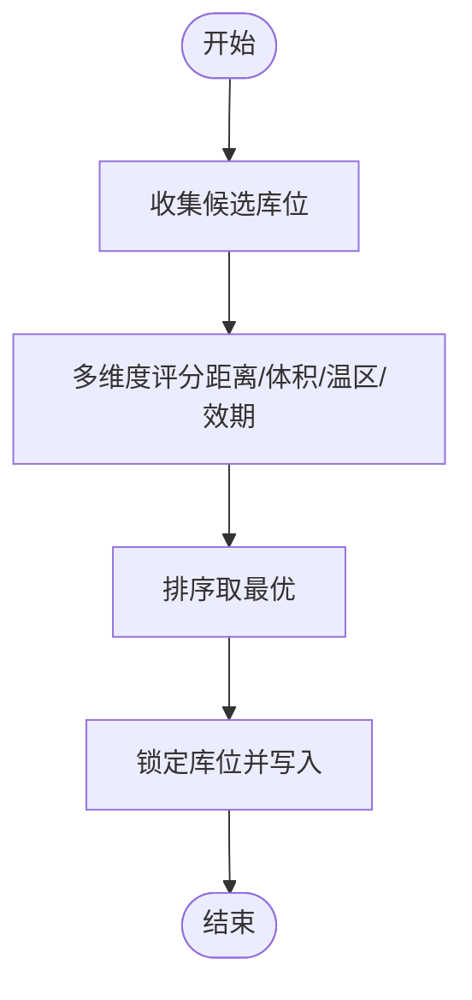

**图示来源** 
- [ShelvingService.cs](file://dip-system/api/Services/ShelvingService.cs)
- [Inventory.cs](file://dip-system/api/Models/Inventory.cs)

**章节来源**
- [ShelvingService.cs](file://dip-system/api/Services/ShelvingService.cs)
- [Inventory.cs](file://dip-system/api/Models/Inventory.cs)

### 作业指导书管理与扫码操作支持
- 作业指导书：在关键节点（如备料、上架、出库、补料、退料）展示标准操作步骤与注意事项。
- 扫码支持：移动端集成条码/二维码扫描，自动填充关键信息，降低录入错误。
- 离线能力：本地缓存扫码结果与待提交队列，网络恢复后自动同步。

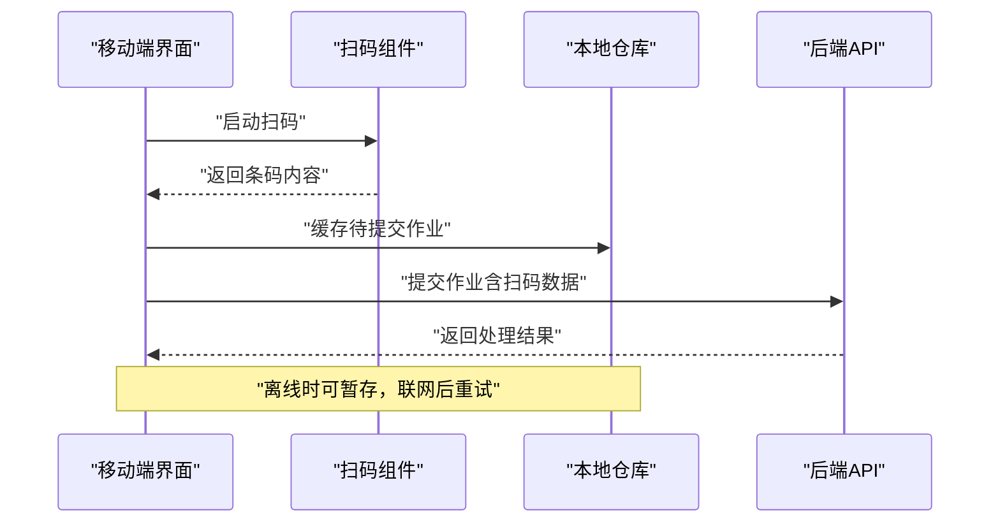

**图示来源** 
- [BarcodeAnalyzer.kt](file://mobile-android/app/src/main/java/com/dip/material/ui/components/BarcodeAnalyzer.kt)
- [QrCodeScanner.kt](file://mobile-android/app/src/main/java/com/dip/material/ui/components/QrCodeScanner.kt)
- [ApiService.kt](file://mobile-android/app/src/main/java/com/dip/material/data/network/ApiService.kt)
- [AppRepository.kt](file://mobile-android/app/src/main/java/com/dip/material/data/repository/AppRepository.kt)

**章节来源**
- [BarcodeAnalyzer.kt](file://mobile-android/app/src/main/java/com/dip/material/ui/components/BarcodeAnalyzer.kt)
- [QrCodeScanner.kt](file://mobile-android/app/src/main/java/com/dip/material/ui/components/QrCodeScanner.kt)
- [ApiService.kt](file://mobile-android/app/src/main/java/com/dip/material/data/network/ApiService.kt)
- [AppRepository.kt](file://mobile-android/app/src/main/java/com/dip/material/data/repository/AppRepository.kt)

### 异常处理机制
- 全局异常过滤器：统一捕获未处理异常，转换为标准错误响应。
- 业务异常：缺料、批次不匹配、库存不足等，返回错误码与修复建议。
- 重试与补偿：对幂等操作支持重试，对非幂等操作提供补偿事务。

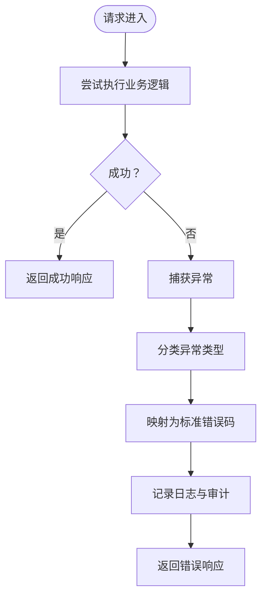

**图示来源** 
- [AppExceptionFilter.cs](file://dip-system/api/Controllers/AppExceptionFilter.cs)

**章节来源**
- [AppExceptionFilter.cs](file://dip-system/api/Controllers/AppExceptionFilter.cs)

### 生产节拍分析、效率统计与质量追溯
- 生产节拍：基于工单完成时间与物料消耗速率，计算节拍与瓶颈工序。
- 效率统计：备料及时率、出库准确率、补料响应时间、退料成功率。
- 质量追溯：从工单到物料批次的正反向追溯，支持问题定位与召回。

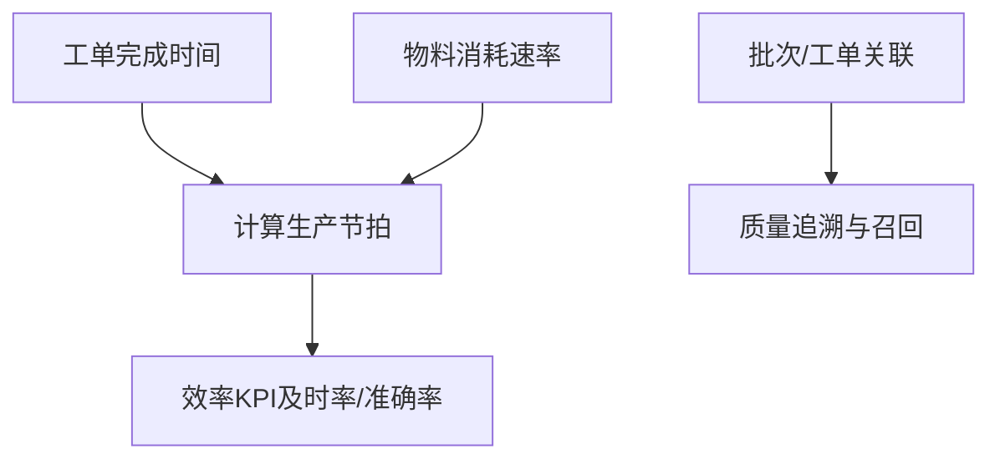

[本节为概念性说明，无需代码来源]

## 依赖关系分析
- 控制器与服务：每个控制器依赖对应的服务类，职责清晰、耦合度低。
- 服务与数据：服务通过DbContext访问数据库，避免直接SQL拼接，提高可维护性。
- 移动端与后端：通过Retrofit与拦截器统一鉴权与错误处理。

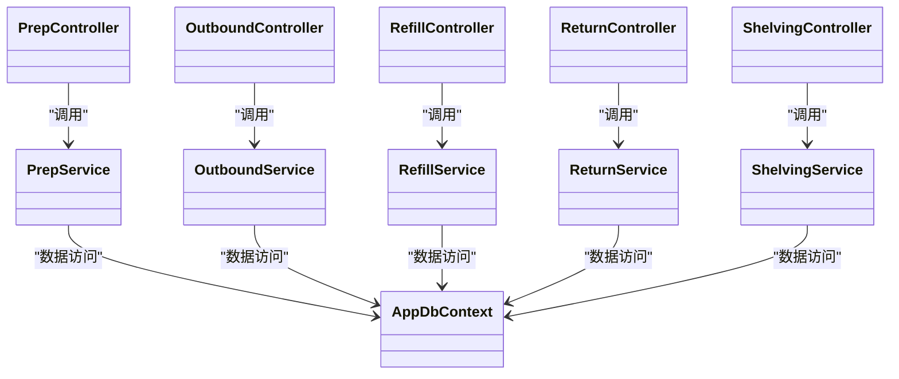

**图示来源** 
- [PrepController.cs](file://dip-system/api/Controllers/PrepController.cs)
- [PrepService.cs](file://dip-system/api/Services/PrepService.cs)
- [OutboundController.cs](file://dip-system/api/Controllers/OutboundController.cs)
- [OutboundService.cs](file://dip-system/api/Services/OutboundService.cs)
- [RefillController.cs](file://dip-system/api/Controllers/RefillController.cs)
- [RefillService.cs](file://dip-system/api/Services/RefillService.cs)
- [ReturnController.cs](file://dip-system/api/Controllers/ReturnController.cs)
- [ReturnService.cs](file://dip-system/api/Services/ReturnService.cs)
- [ShelvingController.cs](file://dip-system/api/Controllers/ShelvingController.cs)
- [ShelvingService.cs](file://dip-system/api/Services/ShelvingService.cs)
- [AppDbContext.cs](file://dip-system/api/Data/AppDbContext.cs)

**章节来源**
- [PrepController.cs](file://dip-system/api/Controllers/PrepController.cs)
- [PrepService.cs](file://dip-system/api/Services/PrepService.cs)
- [OutboundController.cs](file://dip-system/api/Controllers/OutboundController.cs)
- [OutboundService.cs](file://dip-system/api/Services/OutboundService.cs)
- [RefillController.cs](file://dip-system/api/Controllers/RefillController.cs)
- [RefillService.cs](file://dip-system/api/Services/RefillService.cs)
- [ReturnController.cs](file://dip-system/api/Controllers/ReturnController.cs)
- [ReturnService.cs](file://dip-system/api/Services/ReturnService.cs)
- [ShelvingController.cs](file://dip-system/api/Controllers/ShelvingController.cs)
- [ShelvingService.cs](file://dip-system/api/Services/ShelvingService.cs)
- [AppDbContext.cs](file://dip-system/api/Data/AppDbContext.cs)

## 性能考量
- 数据库层面：合理使用索引（工单号、物料编码、批次号），分页查询与只读缓存。
- 服务层面：批量操作减少往返，异步处理耗时任务（如报表生成）。
- 移动端：扫码结果本地缓存，网络失败重试与退避策略，减少无效请求。
- 库位优化：热点库位预分配，减少锁竞争与并发冲突。

[本节为通用性能建议，无需代码来源]

## 故障排查指南
- 常见问题：
  - 扫码无法识别：检查摄像头权限、光照条件、条码格式。
  - 出库失败：核对工单状态、库存充足性、批次有效性。
  - 补料不触发：检查阈值配置与消耗速率计算。
  - 退料被拒：确认工单未关闭、退料数量不超过余量。
- 定位方法：查看全局异常日志、服务层错误码、移动端网络响应。
- 恢复措施：修正数据后重试，必要时执行补偿事务。

**章节来源**
- [AppExceptionFilter.cs](file://dip-system/api/Controllers/AppExceptionFilter.cs)
- [ApiService.kt](file://mobile-android/app/src/main/java/com/dip/material/data/network/ApiService.kt)
- [AuthInterceptor.kt](file://mobile-android/app/src/main/java/com/dip/material/data/network/AuthInterceptor.kt)

## 结论
本生产运营服务群以工单为核心，串联备料、上架、出库、补料、退料全流程，结合扫码与移动端能力，实现高效、可追溯的生产物料管理。通过库位优化、异常处理与性能调优，保障稳定运行与持续改进。建议在生产环境逐步引入离线能力与更精细的节拍分析，进一步提升整体效率与质量。

[本节为总结性内容，无需代码来源]

## 附录
- 移动端集成要点：
  - 使用Retrofit统一网络请求，拦截器注入Token与签名。
  - 扫码组件支持条码与二维码，提供回调与错误处理。
  - 本地缓存待提交作业，网络恢复后自动同步。
- 配置项建议：
  - 补料阈值、安全库存、库位策略权重。
  - 超时与重试次数、错误码映射表。

[本节为补充信息，无需代码来源]