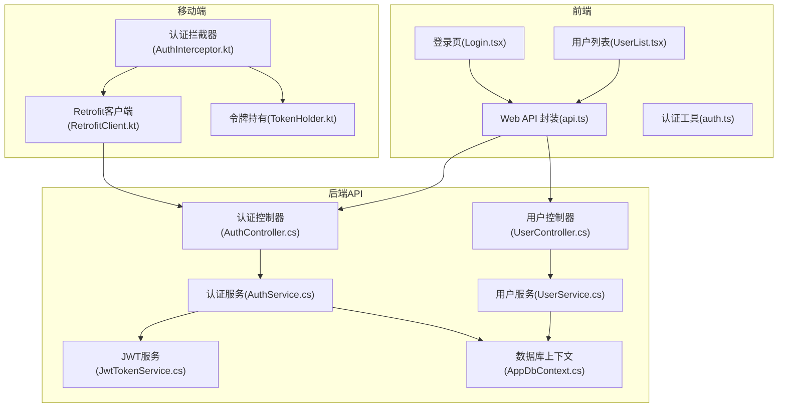
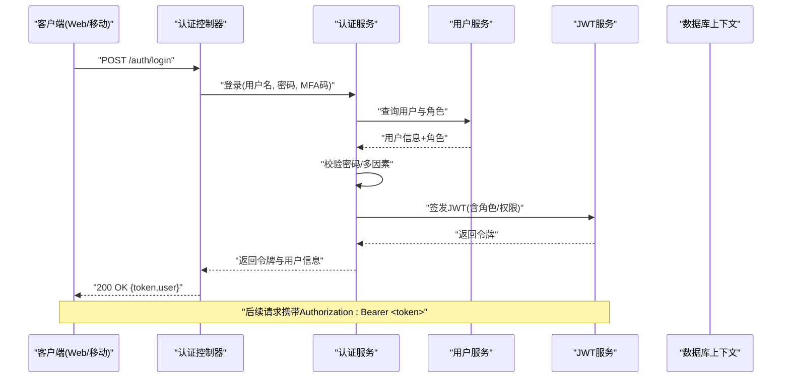
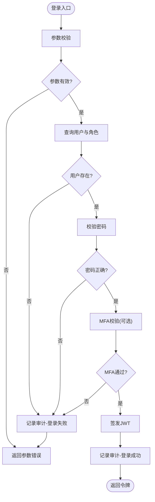
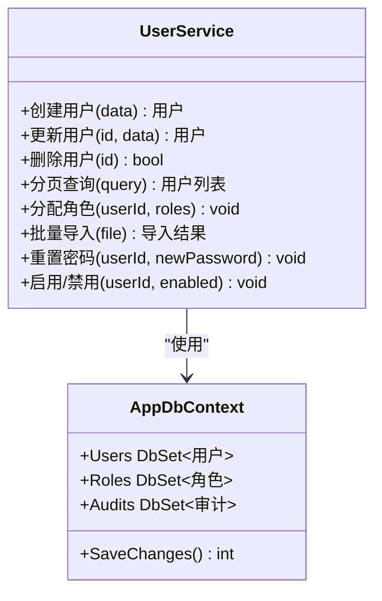
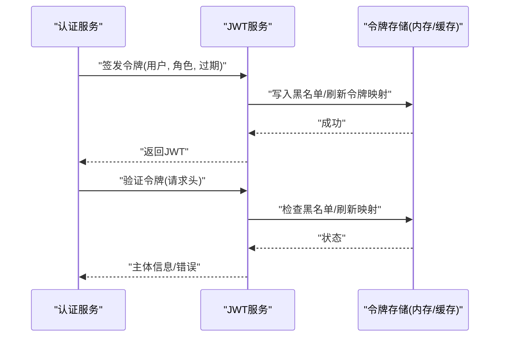
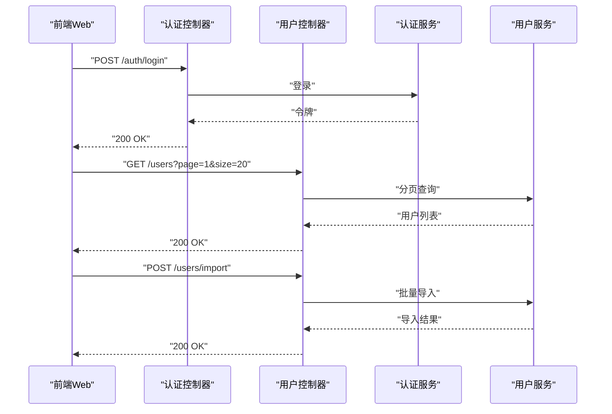
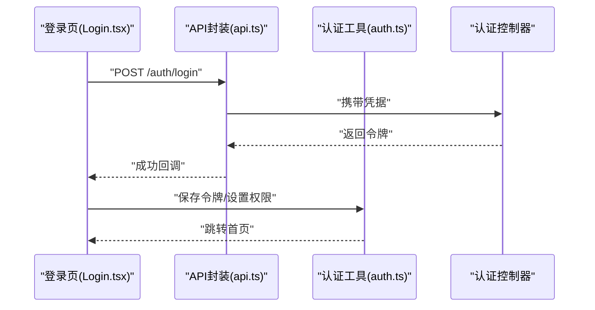
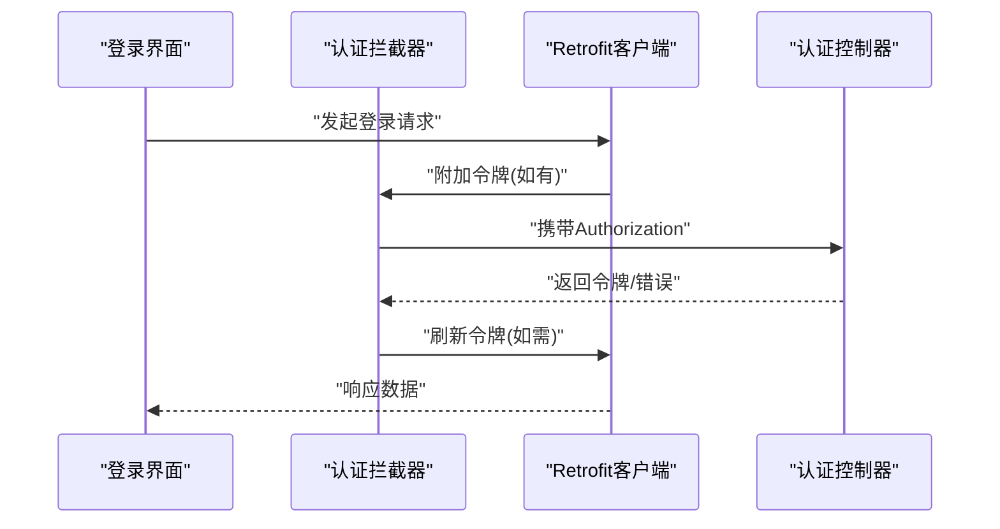
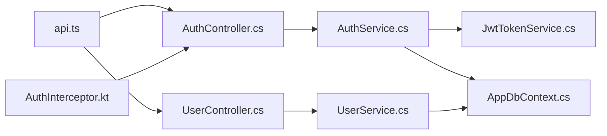

# 用户认证服务 (UserService & AuthService)

<cite>
**本文档引用的文件**   
- [AuthService.cs](file://dip-system/api/Services/AuthService.cs)
- [UserService.cs](file://dip-system/api/Services/UserService.cs)
- [JwtTokenService.cs](file://dip-system/api/Services/JwtTokenService.cs)
- [AuthController.cs](file://dip-system/api/Controllers/AuthController.cs)
- [UserController.cs](file://dip-system/api/Controllers/UserController.cs)
- [Auth.cs](file://dip-system/api/Models/Auth.cs)
- [Audit.cs](file://dip-system/api/Models/Audit.cs)
- [AppDbContext.cs](file://dip-system/api/Data/AppDbContext.cs)
- [Program.cs](file://dip-system/api/Program.cs)
- [api.ts](file://dip-system/frontend-web/src/lib/api.ts)
- [auth.ts](file://dip-system/frontend-web/src/lib/auth.ts)
- [Login.tsx](file://dip-system/frontend-web/src/pages/Login.tsx)
- [UserList.tsx](file://dip-system/frontend-web/src/pages/UserList.tsx)
- [AuthInterceptor.kt](file://mobile-android/app/src/main/java/com/dip/material/data/network/AuthInterceptor.kt)
- [RetrofitClient.kt](file://mobile-android/app/src/main/java/com/dip/material/data/network/RetrofitClient.kt)
- [TokenHolder.kt](file://mobile-android/app/src/main/java/com/dip/material/data/network/TokenHolder.kt)
</cite>

## 目录
1. [简介](#简介)
2. [项目结构](#项目结构)
3. [核心组件](#核心组件)
4. [架构总览](#架构总览)
5. [详细组件分析](#详细组件分析)
6. [依赖关系分析](#依赖关系分析)
7. [性能考虑](#性能考虑)
8. [故障排查指南](#故障排查指南)
9. [结论](#结论)
10. [附录](#附录)

## 简介
本文件面向DIP系统的用户认证与授权子系统，聚焦于UserService的用户管理能力与AuthService的认证授权机制。内容涵盖JWT令牌生成与验证、角色权限控制、会话管理、用户注册登录流程、密码加密存储、多因素认证支持、权限矩阵设计、API访问控制与安全审计日志记录，并提供用户管理界面集成、批量用户操作与权限变更审批流程的实现示例。文档以代码级分析为基础，辅以可视化图示，帮助开发者快速理解并扩展系统能力。

## 项目结构
认证相关代码主要位于后端API层与服务层：
- API控制器：处理HTTP请求与响应，负责参数校验与调用服务层方法
- 服务层：实现业务逻辑（认证、授权、用户管理、JWT等）
- 数据模型：定义用户、审计日志、认证相关实体
- 前端Web：封装认证API调用、拦截器、页面交互
- 移动端Android：网络拦截器、令牌持有与刷新策略

图表来源
- [AuthController.cs](file://dip-system/api/Controllers/AuthController.cs)
- [UserController.cs](file://dip-system/api/Controllers/UserController.cs)
- [AuthService.cs](file://dip-system/api/Services/AuthService.cs)
- [UserService.cs](file://dip-system/api/Services/UserService.cs)
- [JwtTokenService.cs](file://dip-system/api/Services/JwtTokenService.cs)
- [AppDbContext.cs](file://dip-system/api/Data/AppDbContext.cs)
- [api.ts](file://dip-system/frontend-web/src/lib/api.ts)
- [auth.ts](file://dip-system/frontend-web/src/lib/auth.ts)
- [Login.tsx](file://dip-system/frontend-web/src/pages/Login.tsx)
- [UserList.tsx](file://dip-system/frontend-web/src/pages/UserList.tsx)
- [AuthInterceptor.kt](file://mobile-android/app/src/main/java/com/dip/material/data/network/AuthInterceptor.kt)
- [RetrofitClient.kt](file://mobile-android/app/src/main/java/com/dip/material/data/network/RetrofitClient.kt)
- [TokenHolder.kt](file://mobile-android/app/src/main/java/com/dip/material/data/network/TokenHolder.kt)

章节来源
- [Program.cs](file://dip-system/api/Program.cs)

## 核心组件
- 认证服务(AuthService)：负责用户登录、登出、密码重置、验证码校验、多因素认证流程编排、权限校验、审计日志记录。
- 用户服务(UserService)：负责用户CRUD、角色分配、批量导入/导出、状态管理、密码重置、审计日志。
- JWT服务(JwtTokenService)：负责JWT令牌签发、解析、刷新、黑名单与过期策略。
- 控制器(AuthController, UserController)：对外暴露REST接口，承载参数校验与错误处理。
- 数据模型(Auth, Audit)：定义用户认证、权限、审计事件等数据结构。
- 数据库上下文(AppDbContext)：提供EF Core数据访问能力。

章节来源
- [AuthService.cs](file://dip-system/api/Services/AuthService.cs)
- [UserService.cs](file://dip-system/api/Services/UserService.cs)
- [JwtTokenService.cs](file://dip-system/api/Services/JwtTokenService.cs)
- [AuthController.cs](file://dip-system/api/Controllers/AuthController.cs)
- [UserController.cs](file://dip-system/api/Controllers/UserController.cs)
- [Auth.cs](file://dip-system/api/Models/Auth.cs)
- [Audit.cs](file://dip-system/api/Models/Audit.cs)
- [AppDbContext.cs](file://dip-system/api/Data/AppDbContext.cs)

## 架构总览
认证授权采用“控制器→服务→数据”的分层架构，结合JWT无状态鉴权与可选的会话管理。前端通过统一的API封装与拦截器完成令牌注入与刷新；移动端通过拦截器自动附加令牌并处理失效场景。

图表来源
- [AuthController.cs](file://dip-system/api/Controllers/AuthController.cs)
- [AuthService.cs](file://dip-system/api/Services/AuthService.cs)
- [UserService.cs](file://dip-system/api/Services/UserService.cs)
- [JwtTokenService.cs](file://dip-system/api/Services/JwtTokenService.cs)
- [AppDbContext.cs](file://dip-system/api/Data/AppDbContext.cs)

## 详细组件分析

### 认证服务(AuthService)
- 功能要点
  - 登录：校验用户名/密码，支持MFA二次验证，成功后签发JWT
  - 登出：支持令牌黑名单或短期失效策略
  - 密码重置：发送重置链接/验证码，校验后更新密码
  - 权限校验：基于角色的访问控制(RBAC)，可结合资源级权限
  - 审计日志：记录登录成功/失败、权限拒绝、密码重置等关键事件
- 关键流程
  - 登录流程：参数校验→用户查询→密码校验→MFA校验→签发JWT→记录审计
  - 权限校验：从JWT提取角色/权限→匹配资源访问规则→放行或拒绝
- 错误处理
  - 统一异常包装，区分认证失败、权限不足、系统错误
  - 敏感信息脱敏输出，避免泄露

图表来源
- [AuthService.cs](file://dip-system/api/Services/AuthService.cs)
- [UserService.cs](file://dip-system/api/Services/UserService.cs)
- [JwtTokenService.cs](file://dip-system/api/Services/JwtTokenService.cs)
- [Audit.cs](file://dip-system/api/Models/Audit.cs)

章节来源
- [AuthService.cs](file://dip-system/api/Services/AuthService.cs)
- [Audit.cs](file://dip-system/api/Models/Audit.cs)

### 用户服务(UserService)
- 功能要点
  - 用户CRUD：创建、更新、删除、分页查询
  - 角色管理：分配/移除角色，支持批量操作
  - 状态管理：启用/禁用、锁定/解锁
  - 密码管理：强制复杂度、历史密码检查、重置
  - 审计日志：记录用户变更事件
- 关键流程
  - 用户创建：参数校验→唯一性检查→密码加密→保存→记录审计
  - 批量导入：CSV/Excel解析→逐条校验→事务提交→结果反馈
- 错误处理
  - 输入校验失败、重复键冲突、权限不足等异常分类处理

图表来源
- [UserService.cs](file://dip-system/api/Services/UserService.cs)
- [AppDbContext.cs](file://dip-system/api/Data/AppDbContext.cs)

章节来源
- [UserService.cs](file://dip-system/api/Services/UserService.cs)

### JWT服务(JwtTokenService)
- 功能要点
  - 令牌签发：包含用户ID、角色、权限、过期时间、签名
  - 令牌解析：验签、过期检查、黑名单校验
  - 令牌刷新：支持短期Refresh Token与滑动过期
  - 安全策略：密钥轮换、最小化载荷、防重放
- 关键流程
  - 签发：收集主体信息→构建Claims→签名→返回
  - 验证：解析Header/Payload→验签→检查过期/黑名单→返回主体

图表来源
- [JwtTokenService.cs](file://dip-system/api/Services/JwtTokenService.cs)

章节来源
- [JwtTokenService.cs](file://dip-system/api/Services/JwtTokenService.cs)

### 控制器层(AuthController, UserController)
- 认证控制器
  - 登录/登出、密码重置、MFA校验、令牌刷新
  - 统一异常处理与审计日志记录
- 用户控制器
  - 用户CRUD、角色分配、批量导入/导出、状态管理
  - 权限校验：仅管理员可执行敏感操作

图表来源
- [AuthController.cs](file://dip-system/api/Controllers/AuthController.cs)
- [UserController.cs](file://dip-system/api/Controllers/UserController.cs)
- [AuthService.cs](file://dip-system/api/Services/AuthService.cs)
- [UserService.cs](file://dip-system/api/Services/UserService.cs)

章节来源
- [AuthController.cs](file://dip-system/api/Controllers/AuthController.cs)
- [UserController.cs](file://dip-system/api/Controllers/UserController.cs)

### 前端集成(Web)
- API封装(api.ts)：统一请求配置、错误处理、重试策略
- 认证工具(auth.ts)：令牌存储、刷新、权限判断
- 登录页(Login.tsx)：表单校验、提交登录、跳转
- 用户列表(UserList.tsx)：分页、搜索、批量操作、权限按钮控制

图表来源
- [Login.tsx](file://dip-system/frontend-web/src/pages/Login.tsx)
- [api.ts](file://dip-system/frontend-web/src/lib/api.ts)
- [auth.ts](file://dip-system/frontend-web/src/lib/auth.ts)
- [AuthController.cs](file://dip-system/api/Controllers/AuthController.cs)

章节来源
- [api.ts](file://dip-system/frontend-web/src/lib/api.ts)
- [auth.ts](file://dip-system/frontend-web/src/lib/auth.ts)
- [Login.tsx](file://dip-system/frontend-web/src/pages/Login.tsx)
- [UserList.tsx](file://dip-system/frontend-web/src/pages/UserList.tsx)

### 移动端集成(Android)
- 认证拦截器(AuthInterceptor.kt)：自动附加Authorization头、处理401刷新
- Retrofit客户端(RetrofitClient.kt)：全局配置、超时、重试
- 令牌持有(TokenHolder.kt)：本地持久化、生命周期管理

图表来源
- [AuthInterceptor.kt](file://mobile-android/app/src/main/java/com/dip/material/data/network/AuthInterceptor.kt)
- [RetrofitClient.kt](file://mobile-android/app/src/main/java/com/dip/material/data/network/RetrofitClient.kt)
- [TokenHolder.kt](file://mobile-android/app/src/main/java/com/dip/material/data/network/TokenHolder.kt)
- [AuthController.cs](file://dip-system/api/Controllers/AuthController.cs)

章节来源
- [AuthInterceptor.kt](file://mobile-android/app/src/main/java/com/dip/material/data/network/AuthInterceptor.kt)
- [RetrofitClient.kt](file://mobile-android/app/src/main/java/com/dip/material/data/network/RetrofitClient.kt)
- [TokenHolder.kt](file://mobile-android/app/src/main/java/com/dip/material/data/network/TokenHolder.kt)

## 依赖关系分析
- 控制器依赖服务：AuthController→AuthService，UserController→UserService
- 服务依赖数据访问：AuthService/UserService→AppDbContext
- JWT服务独立：JwtTokenService被认证服务调用
- 前端依赖后端API：api.ts封装所有认证与用户管理接口
- 移动端依赖后端API：AuthInterceptor统一处理令牌

图表来源
- [AuthController.cs](file://dip-system/api/Controllers/AuthController.cs)
- [UserController.cs](file://dip-system/api/Controllers/UserController.cs)
- [AuthService.cs](file://dip-system/api/Services/AuthService.cs)
- [UserService.cs](file://dip-system/api/Services/UserService.cs)
- [JwtTokenService.cs](file://dip-system/api/Services/JwtTokenService.cs)
- [AppDbContext.cs](file://dip-system/api/Data/AppDbContext.cs)
- [api.ts](file://dip-system/frontend-web/src/lib/api.ts)
- [AuthInterceptor.kt](file://mobile-android/app/src/main/java/com/dip/material/data/network/AuthInterceptor.kt)

章节来源
- [Program.cs](file://dip-system/api/Program.cs)

## 性能考虑
- JWT无状态鉴权减少服务器会话开销，适合水平扩展
- 数据库查询优化：分页、索引、只读字段投影
- 批量操作使用事务与分批提交，避免长事务锁表
- 令牌刷新策略：短过期Access Token+Refresh Token降低风险
- 缓存热点数据：用户角色、权限映射可使用内存缓存

[本节为通用指导，不直接分析具体文件]

## 故障排查指南
- 登录失败
  - 检查用户名/密码是否正确，MFA是否启用且输入正确
  - 查看审计日志中的失败原因（如密码错误、账户锁定）
- 权限不足
  - 确认用户角色与资源权限矩阵匹配
  - 检查JWT中Claims是否完整
- 令牌失效
  - 检查过期时间与刷新流程
  - 确认客户端是否正确附加Authorization头
- 批量导入失败
  - 检查文件格式与字段映射
  - 查看事务回滚原因与错误明细

章节来源
- [AuthService.cs](file://dip-system/api/Services/AuthService.cs)
- [Audit.cs](file://dip-system/api/Models/Audit.cs)

## 结论
DIP系统的用户认证与授权模块采用清晰的分层架构与JWT无状态鉴权，结合RBAC权限模型与审计日志，满足企业级安全需求。UserService提供完整的用户管理能力，AuthService编排认证流程并集成MFA与权限校验。前后端与移动端均实现了令牌管理与刷新策略，确保一致的用户体验与安全性。建议在生产环境启用密钥轮换、细粒度权限控制与完善的监控告警机制。

[本节为总结性内容，不直接分析具体文件]

## 附录

### 权限矩阵设计
- 角色定义：管理员、普通用户、访客
- 资源维度：用户管理、订单管理、库存管理等
- 权限粒度：菜单可见、按钮可用、API访问、数据行级过滤

[本节为概念说明，不直接分析具体文件]

### API访问控制
- 登录接口：公开
- 用户管理接口：需管理员角色
- 资源接口：按角色与权限动态控制

[本节为概念说明，不直接分析具体文件]

### 安全审计日志记录
- 事件类型：登录成功/失败、权限拒绝、密码重置、用户变更
- 记录字段：用户ID、IP、操作、结果、时间戳
- 存储策略：集中式日志库，支持检索与导出

[本节为概念说明，不直接分析具体文件]

### 用户管理界面集成
- 登录页：表单校验、错误提示、记住我
- 用户列表：分页、搜索、批量操作、权限按钮
- 用户详情：编辑、角色分配、状态切换

[本节为概念说明，不直接分析具体文件]

### 批量用户操作
- 导入模板：CSV/Excel格式规范
- 校验规则：必填字段、唯一性、格式校验
- 事务处理：部分失败回滚，结果反馈

[本节为概念说明，不直接分析具体文件]

### 权限变更审批流程
- 申请：用户/管理员提交权限变更申请
- 审批：上级或安全管理员审核
- 执行：通过后自动更新角色与权限，记录审计

[本节为概念说明，不直接分析具体文件]