# 系统支撑服务群

<cite>
**本文引用的文件**   
- [Program.cs](file://dip-system/api/Program.cs)
- [appsettings.json](file://dip-system/api/appsettings.json)
- [SystemController.cs](file://dip-system/api/Controllers/SystemController.cs)
- [OnlineController.cs](file://dip-system/api/Controllers/OnlineController.cs)
- [ReportController.cs](file://dip-system/api/Controllers/ReportController.cs)
- [AbnormalController.cs](file://dip-system/api/Controllers/AbnormalController.cs)
- [TransferController.cs](file://dip-system/api/Controllers/TransferController.cs)
- [StockCountController.cs](file://dip-system/api/Controllers/StockCountController.cs)
- [ChangeoverController.cs](file://dip-system/api/Controllers/ChangeoverController.cs)
- [SubstituteController.cs](file://dip-system/api/Controllers/SubstituteController.cs)
- [AppExceptionFilter.cs](file://dip-system/api/Controllers/AppExceptionFilter.cs)
- [RequireManagerFilter.cs](file://dip-system/api/Controllers/RequireManagerFilter.cs)
- [OnlineService.cs](file://dip-system/api/Services/OnlineService.cs)
- [ReportService.cs](file://dip-system/api/Services/ReportService.cs)
- [AbnormalService.cs](file://dip-system/api/Services/AbnormalService.cs)
- [TransferService.cs](file://dip-system/api/Services/TransferService.cs)
- [StockCountService.cs](file://dip-system/api/Services/StockCountService.cs)
- [ChangeoverService.cs](file://dip-system/api/Services/ChangeoverService.cs)
- [SubstituteService.cs](file://dip-system/api/Services/SubstituteService.cs)
- [Online.cs](file://dip-system/api/Models/Online.cs)
- [Abnormal.cs](file://dip-system/api/Models/Abnormal.cs)
- [Transfer.cs](file://dip-system/api/Models/Transfer.cs)
- [StockCount.cs](file://dip-system/api/Models/StockCount.cs)
- [Changeover.cs](file://dip-system/api/Models/Changeover.cs)
- [SubstituteOrder.cs](file://dip-system/api/Models/SubstituteOrder.cs)
- [SubstituteRecord.cs](file://dip-system/api/Models/SubstituteRecord.cs)
- [ApiResponse.cs](file://dip-system/api/Models/ApiResponse.cs)
- [BaseEntity.cs](file://dip-system/api/Models/BaseEntity.cs)
- [DIP.Api.csproj](file://dip-system/api/DIP.Api.csproj)
- [ApiService.kt](file://mobile-android/app/src/main/java/com/dip/material/data/network/ApiService.kt)
- [RetrofitClient.kt](file://mobile-android/app/src/main/java/com/dip/material/data/network/RetrofitClient.kt)
- [AuthInterceptor.kt](file://mobile-android/app/src/main/java/com/dip/material/data/network/AuthInterceptor.kt)
- [TokenHolder.kt](file://mobile-android/app/src/main/java/com/dip/material/data/network/TokenHolder.kt)
- [OnlineScreen.kt](file://mobile-android/app/src/main/java/com/dip/material/ui/online/OnlineScreen.kt)
- [Dashboard.tsx](file://dip-system/frontend-web/src/pages/Dashboard.tsx)
- [api.ts](file://dip-system/frontend-web/src/lib/api.ts)
</cite>

## 目录
1. [简介](#简介)
2. [项目结构](#项目结构)
3. [核心组件](#核心组件)
4. [架构总览](#架构总览)
5. [详细组件分析](#详细组件分析)
6. [依赖关系分析](#依赖关系分析)
7. [性能考虑](#性能考虑)
8. [故障排查指南](#故障排查指南)
9. [结论](#结论)
10. [附录](#附录)

## 简介
本文件面向DIP系统的“系统支撑服务群”，聚焦以下八大核心能力：系统配置（SystemController）、在线监控（OnlineService）、报表生成（ReportService）、异常管理（AbnormalService）、调拨管理（TransferService）、盘点管理（StockCountService）、换线管理（ChangeoverService）、替代料管理（SubstituteService）。文档将系统化阐述健康检查、实时监控告警、多维度报表分析，并深入说明异常分类处理、调拨流程审批、盘点差异分析、换线计划优化、替代料匹配算法与系统性能监控。同时提供系统管理界面集成、自动化运维与故障恢复的实现示例与最佳实践。

## 项目结构
后端采用ASP.NET Core Web API，按控制器与服务分层组织；前端包含Web端（React/Vite）与移动端（Android/Kotlin），通过REST API统一接入。关键入口与配置如下：
- 应用启动与中间件注册：Program.cs
- 全局异常处理与权限校验：AppExceptionFilter.cs、RequireManagerFilter.cs
- 各业务控制器：对应System、Online、Report、Abnormal、Transfer、StockCount、Changeover、Substitute等
- 业务服务层：上述控制器的Service实现
- 数据模型：各业务实体定义
- 前端API封装与页面：frontend-web的api.ts与各页面
- 移动端网络层：ApiService.kt、RetrofitClient.kt、AuthInterceptor.kt、TokenHolder.kt

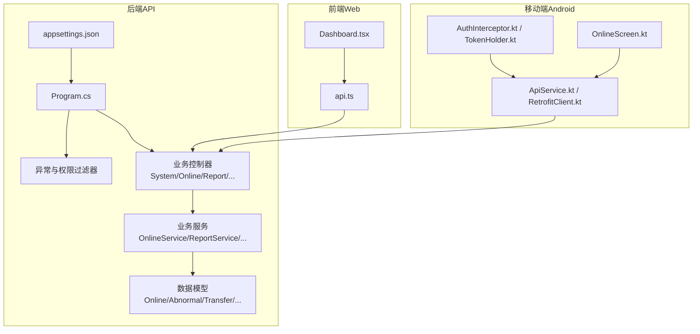

图表来源
- [Program.cs](file://dip-system/api/Program.cs)
- [AppExceptionFilter.cs](file://dip-system/api/Controllers/AppExceptionFilter.cs)
- [RequireManagerFilter.cs](file://dip-system/api/Controllers/RequireManagerFilter.cs)
- [SystemController.cs](file://dip-system/api/Controllers/SystemController.cs)
- [OnlineController.cs](file://dip-system/api/Controllers/OnlineController.cs)
- [ReportController.cs](file://dip-system/api/Controllers/ReportController.cs)
- [AbnormalController.cs](file://dip-system/api/Controllers/AbnormalController.cs)
- [TransferController.cs](file://dip-system/api/Controllers/TransferController.cs)
- [StockCountController.cs](file://dip-system/api/Controllers/StockCountController.cs)
- [ChangeoverController.cs](file://dip-system/api/Controllers/ChangeoverController.cs)
- [SubstituteController.cs](file://dip-system/api/Controllers/SubstituteController.cs)
- [OnlineService.cs](file://dip-system/api/Services/OnlineService.cs)
- [ReportService.cs](file://dip-system/api/Services/ReportService.cs)
- [AbnormalService.cs](file://dip-system/api/Services/AbnormalService.cs)
- [TransferService.cs](file://dip-system/api/Services/TransferService.cs)
- [StockCountService.cs](file://dip-system/api/Services/StockCountService.cs)
- [ChangeoverService.cs](file://dip-system/api/Services/ChangeoverService.cs)
- [SubstituteService.cs](file://dip-system/api/Services/SubstituteService.cs)
- [Online.cs](file://dip-system/api/Models/Online.cs)
- [Abnormal.cs](file://dip-system/api/Models/Abnormal.cs)
- [Transfer.cs](file://dip-system/api/Models/Transfer.cs)
- [StockCount.cs](file://dip-system/api/Models/StockCount.cs)
- [Changeover.cs](file://dip-system/api/Models/Changeover.cs)
- [SubstituteOrder.cs](file://dip-system/api/Models/SubstituteOrder.cs)
- [SubstituteRecord.cs](file://dip-system/api/Models/SubstituteRecord.cs)
- [api.ts](file://dip-system/frontend-web/src/lib/api.ts)
- [ApiService.kt](file://mobile-android/app/src/main/java/com/dip/material/data/network/ApiService.kt)
- [RetrofitClient.kt](file://mobile-android/app/src/main/java/com/dip/material/data/network/RetrofitClient.kt)
- [AuthInterceptor.kt](file://mobile-android/app/src/main/java/com/dip/material/data/network/AuthInterceptor.kt)
- [TokenHolder.kt](file://mobile-android/app/src/main/java/com/dip/material/data/network/TokenHolder.kt)
- [OnlineScreen.kt](file://mobile-android/app/src/main/java/com/dip/material/ui/online/OnlineScreen.kt)

章节来源
- [Program.cs](file://dip-system/api/Program.cs)
- [DIP.Api.csproj](file://dip-system/api/DIP.Api.csproj)
- [appsettings.json](file://dip-system/api/appsettings.json)

## 核心组件
本节概述八大支撑服务的职责边界与协作方式：
- SystemController：系统配置与健康检查，暴露系统状态、版本、运行参数等元信息接口。
- OnlineService：在线设备/产线监控，采集心跳、状态、指标，支持阈值告警与实时推送。
- ReportService：多维度报表生成，聚合生产、库存、异常、调拨、换线、替代等数据，支持导出。
- AbnormalService：异常分类、分级、流转与闭环处理，记录根因与处置措施。
- TransferService：调拨申请、审批、执行与对账，支持多仓/多库区调拨策略。
- StockCountService：盘点计划、差异分析与复盘，支持盲盘/明盘与批次追溯。
- ChangeoverService：换线计划排程与优化，评估切换成本与产能影响。
- SubstituteService：替代料匹配与审批，保障质量与可追溯性。

章节来源
- [SystemController.cs](file://dip-system/api/Controllers/SystemController.cs)
- [OnlineService.cs](file://dip-system/api/Services/OnlineService.cs)
- [ReportService.cs](file://dip-system/api/Services/ReportService.cs)
- [AbnormalService.cs](file://dip-system/api/Services/AbnormalService.cs)
- [TransferService.cs](file://dip-system/api/Services/TransferService.cs)
- [StockCountService.cs](file://dip-system/api/Services/StockCountService.cs)
- [ChangeoverService.cs](file://dip-system/api/Services/ChangeoverService.cs)
- [SubstituteService.cs](file://dip-system/api/Services/SubstituteService.cs)

## 架构总览
系统采用前后端分离与分层架构：
- 表现层：Web前端与移动端通过REST调用后端API。
- 控制器层：路由与请求校验，转发至服务层。
- 服务层：业务编排、规则计算、事务与审计。
- 数据层：ORM访问数据库，持久化实体。
- 横切关注点：全局异常处理、鉴权与授权、日志与监控。

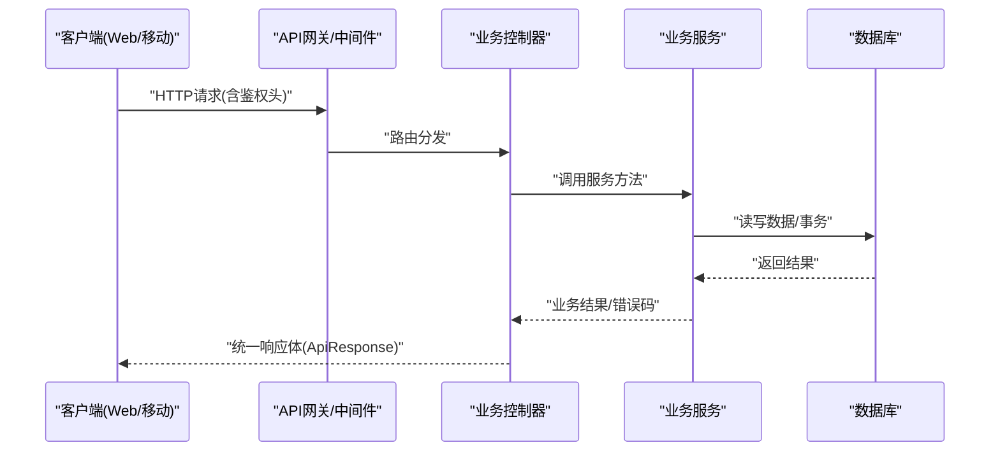

图表来源
- [Program.cs](file://dip-system/api/Program.cs)
- [AppExceptionFilter.cs](file://dip-system/api/Controllers/AppExceptionFilter.cs)
- [RequireManagerFilter.cs](file://dip-system/api/Controllers/RequireManagerFilter.cs)
- [ApiResponse.cs](file://dip-system/api/Models/ApiResponse.cs)

## 详细组件分析

### SystemController 系统配置与健康检查
- 功能要点
  - 系统健康检查：存活探针、依赖检查（如数据库可用性）、资源使用概览。
  - 配置查询：读取运行时配置项（如开关、阈值、限流参数）。
  - 版本与元信息：构建版本、部署时间、环境标识。
- 设计模式
  - 健康检查采用组合式检查器，便于扩展新的依赖检查。
  - 配置读取通过IConfiguration注入，支持热更新。
- 性能与安全
  - 健康检查接口轻量，避免重IO；敏感配置需鉴权。
- 前端集成
  - Dashboard展示系统状态卡片，轮询健康接口。

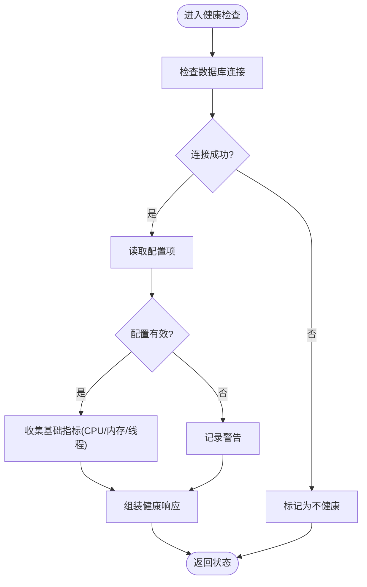

图表来源
- [SystemController.cs](file://dip-system/api/Controllers/SystemController.cs)
- [ApiResponse.cs](file://dip-system/api/Models/ApiResponse.cs)

章节来源
- [SystemController.cs](file://dip-system/api/Controllers/SystemController.cs)
- [ApiResponse.cs](file://dip-system/api/Models/ApiResponse.cs)

### OnlineService 在线监控与实时告警
- 功能要点
  - 设备/产线心跳上报、状态同步、指标采集（温度、速度、良率等）。
  - 阈值告警：基于规则引擎或滑动窗口统计触发告警。
  - 实时推送：WebSocket或长轮询向前端推送告警与状态变更。
- 数据结构
  - Online实体承载设备ID、状态、指标快照、最后心跳时间等。
- 性能优化
  - 指标写入采用批量入库与异步队列；热点指标缓存。
- 前端集成
  - OnlineList页面展示在线列表与告警面板；移动端OnlineScreen用于现场查看。

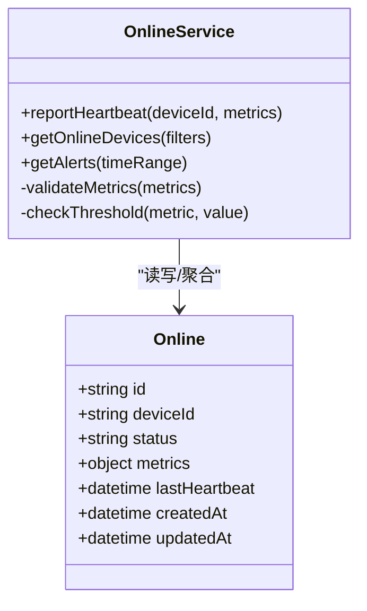

图表来源
- [Online.cs](file://dip-system/api/Models/Online.cs)
- [OnlineService.cs](file://dip-system/api/Services/OnlineService.cs)

章节来源
- [OnlineService.cs](file://dip-system/api/Services/OnlineService.cs)
- [Online.cs](file://dip-system/api/Models/Online.cs)
- [OnlineController.cs](file://dip-system/api/Controllers/OnlineController.cs)
- [OnlineScreen.kt](file://mobile-android/app/src/main/java/com/dip/material/ui/online/OnlineScreen.kt)

### ReportService 多维度报表生成
- 功能要点
  - 维度：产品、产线、班次、仓库、供应商、异常类型、调拨单、换线工单、替代料订单。
  - 指标：产量、良率、OEE、缺料次数、调拨时效、盘点差异率、换线时长、替代成功率。
  - 输出：表格、图表、PDF/Excel导出。
- 数据处理
  - 聚合查询、物化视图、分页与排序；大数据量时启用异步任务。
- 性能建议
  - 预聚合与索引优化；冷热数据分离；导出分片。

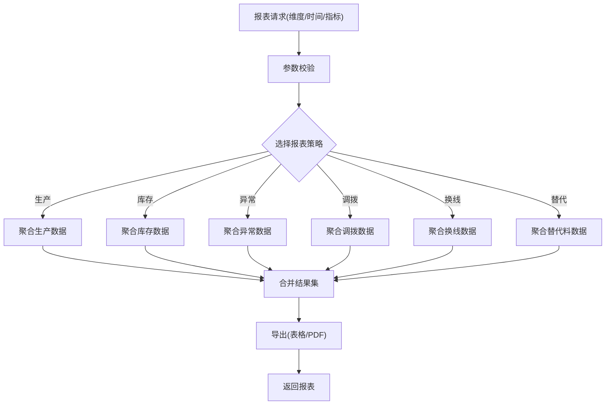

图表来源
- [ReportService.cs](file://dip-system/api/Services/ReportService.cs)
- [ReportController.cs](file://dip-system/api/Controllers/ReportController.cs)

章节来源
- [ReportService.cs](file://dip-system/api/Services/ReportService.cs)
- [ReportController.cs](file://dip-system/api/Controllers/ReportController.cs)

### AbnormalService 异常分类与闭环处理
- 功能要点
  - 异常分类：按类型、等级、区域、设备、物料等维度打标。
  - 流转：创建→指派→处理→验证→关闭；支持升级与回滚。
  - 根因分析：关联事件、操作日志、工艺参数。
- 数据结构
  - Abnormal实体承载异常描述、等级、状态、处理人、时间戳等。
- 告警联动
  - 与OnlineService联动，超阈自动创建异常工单。

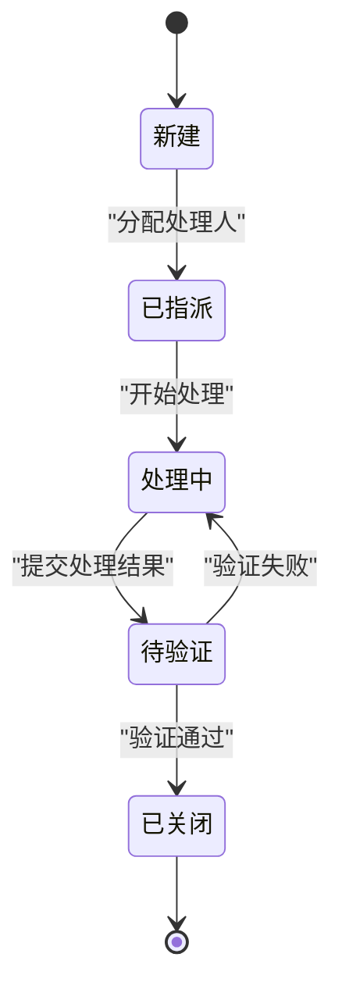

图表来源
- [Abnormal.cs](file://dip-system/api/Models/Abnormal.cs)
- [AbnormalService.cs](file://dip-system/api/Services/AbnormalService.cs)

章节来源
- [AbnormalService.cs](file://dip-system/api/Services/AbnormalService.cs)
- [Abnormal.cs](file://dip-system/api/Models/Abnormal.cs)
- [AbnormalController.cs](file://dip-system/api/Controllers/AbnormalController.cs)

### TransferService 调拨管理与审批
- 功能要点
  - 调拨申请：源仓/目标仓、物料、数量、优先级、期望到达时间。
  - 审批流：多级审批、条件分支（金额/风险等级）。
  - 执行与对账：出库、在途、入库、差异处理。
- 数据结构
  - Transfer实体承载调拨单号、状态机、参与方、时间戳等。
- 流程优化
  - 智能路径选择、库存预测、紧急插单策略。

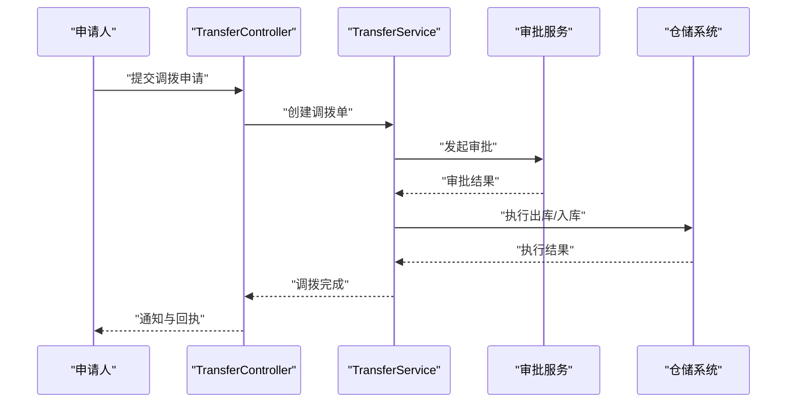

图表来源
- [Transfer.cs](file://dip-system/api/Models/Transfer.cs)
- [TransferService.cs](file://dip-system/api/Services/TransferService.cs)
- [TransferController.cs](file://dip-system/api/Controllers/TransferController.cs)

章节来源
- [TransferService.cs](file://dip-system/api/Services/TransferService.cs)
- [Transfer.cs](file://dip-system/api/Models/Transfer.cs)
- [TransferController.cs](file://dip-system/api/Controllers/TransferController.cs)

### StockCountService 盘点管理与差异分析
- 功能要点
  - 盘点计划：周期/随机/专项盘点，覆盖范围与抽样策略。
  - 数据采集：扫码/手工录入，防错校验。
  - 差异分析：批次/效期/库位差异，自动生成调整建议。
- 数据结构
  - StockCount实体承载盘点单、明细、差异、审核状态等。
- 质量保障
  - 盲盘模式、二次复核、差异阈值告警。

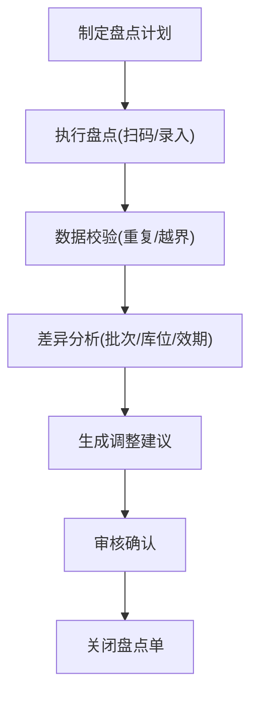

图表来源
- [StockCount.cs](file://dip-system/api/Models/StockCount.cs)
- [StockCountService.cs](file://dip-system/api/Services/StockCountService.cs)

章节来源
- [StockCountService.cs](file://dip-system/api/Services/StockCountService.cs)
- [StockCount.cs](file://dip-system/api/Models/StockCount.cs)
- [StockCountController.cs](file://dip-system/api/Controllers/StockCountController.cs)

### ChangeoverService 换线管理与计划优化
- 功能要点
  - 换线计划：产品序列、工装夹具、程序版本、准备清单。
  - 优化目标：最小化切换成本、最大化产能利用率、减少等待。
  - 约束：设备可用、物料齐套、人员资质、安全规范。
- 数据结构
  - Changeover实体承载换线工单、计划时间、资源占用、状态等。
- 算法思路
  - 启发式排程（最早截止时间优先、最短加工时间优先）+ 局部搜索改进。

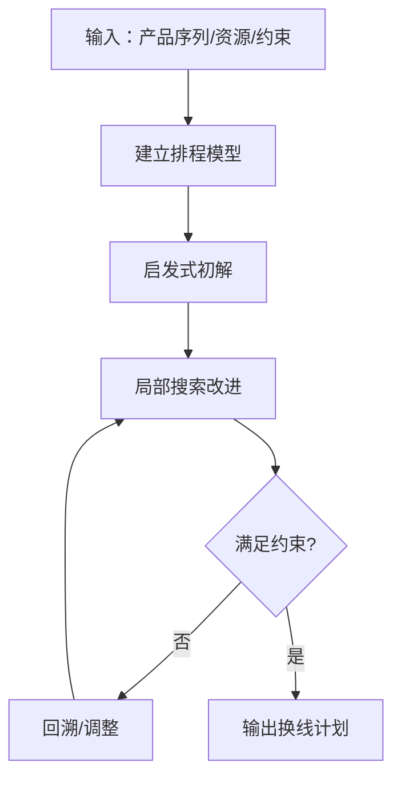

图表来源
- [Changeover.cs](file://dip-system/api/Models/Changeover.cs)
- [ChangeoverService.cs](file://dip-system/api/Services/ChangeoverService.cs)

章节来源
- [ChangeoverService.cs](file://dip-system/api/Services/ChangeoverService.cs)
- [Changeover.cs](file://dip-system/api/Models/Changeover.cs)
- [ChangeoverController.cs](file://dip-system/api/Controllers/ChangeoverController.cs)

### SubstituteService 替代料匹配与审批
- 功能要点
  - 匹配规则：规格、材质、认证、供应商资质、历史合格率。
  - 审批流程：工程/质量/采购联合评审，留痕与追溯。
  - 风险控制：替代上限、批次隔离、失效回退。
- 数据结构
  - SubstituteOrder与SubstituteRecord承载订单、记录、审批意见、生效时间等。
- 算法思路
  - 评分加权（质量权重最高）+ 约束过滤（认证/有效期）+ 候选排序。

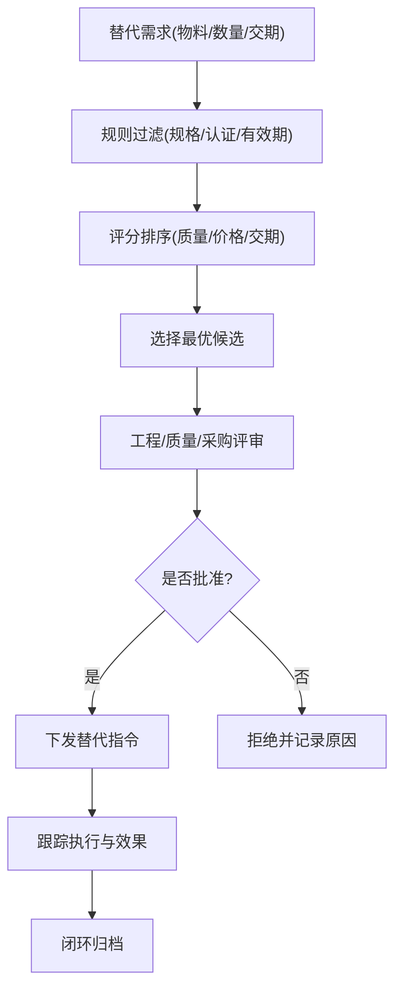

图表来源
- [SubstituteOrder.cs](file://dip-system/api/Models/SubstituteOrder.cs)
- [SubstituteRecord.cs](file://dip-system/api/Models/SubstituteRecord.cs)
- [SubstituteService.cs](file://dip-system/api/Services/SubstituteService.cs)

章节来源
- [SubstituteService.cs](file://dip-system/api/Services/SubstituteService.cs)
- [SubstituteOrder.cs](file://dip-system/api/Models/SubstituteOrder.cs)
- [SubstituteRecord.cs](file://dip-system/api/Models/SubstituteRecord.cs)
- [SubstituteController.cs](file://dip-system/api/Controllers/SubstituteController.cs)

### 概念总览
以下为跨模块协同的概念流程图，展示从监控到报表、异常、调拨、换线与替代的整体联动：

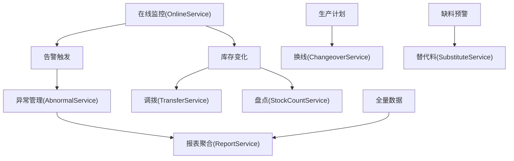

[本图为概念性流程，不直接映射具体源码文件]

## 依赖关系分析
- 控制器与服务耦合度低，遵循单一职责；服务间通过领域事件或消息总线解耦（可扩展）。
- 数据模型以实体为中心，BaseEntity提供通用字段（如创建/更新时间）。
- 前端与移动端通过统一的API封装与鉴权拦截器访问后端。

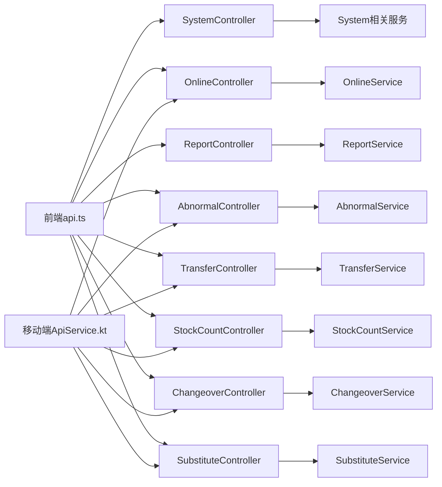

图表来源
- [api.ts](file://dip-system/frontend-web/src/lib/api.ts)
- [ApiService.kt](file://mobile-android/app/src/main/java/com/dip/material/data/network/ApiService.kt)
- [RetrofitClient.kt](file://mobile-android/app/src/main/java/com/dip/material/data/network/RetrofitClient.kt)
- [AuthInterceptor.kt](file://mobile-android/app/src/main/java/com/dip/material/data/network/AuthInterceptor.kt)
- [TokenHolder.kt](file://mobile-android/app/src/main/java/com/dip/material/data/network/TokenHolder.kt)

章节来源
- [DIP.Api.csproj](file://dip-system/api/DIP.Api.csproj)
- [BaseEntity.cs](file://dip-system/api/Models/BaseEntity.cs)

## 性能考虑
- 监控与告警
  - 心跳与指标批量写入，避免高频小事务；热点指标内存缓存。
  - 告警规则增量计算，降低全量扫描开销。
- 报表生成
  - 预聚合与物化视图；分页游标与延迟加载；导出任务异步化。
- 异常与调拨
  - 状态机幂等设计；并发锁保证单据一致性；热点表索引优化。
- 换线与替代
  - 排程算法近似求解，限制迭代次数；替代匹配缓存候选集。
- 前端与移动端
  - 请求去抖与重试；离线缓存与增量同步；图片与静态资源CDN。

[本节为通用性能指导，不直接分析具体文件]

## 故障排查指南
- 全局异常处理
  - AppExceptionFilter统一捕获未处理异常，返回标准化错误响应。
  - RequireManagerFilter进行权限校验，未授权返回明确错误码。
- 常见问题定位
  - 健康检查失败：检查数据库连接、配置项有效性、资源使用。
  - 监控无数据：核对心跳上报频率、网络连通性、鉴权令牌。
  - 报表超时：检查聚合SQL、索引、数据量；启用异步导出。
  - 调拨卡单：核查审批流状态、仓储接口响应、库存锁定。
  - 盘点差异大：复核采集流程、批次/库位映射、效期规则。
  - 换线冲突：检查资源占用、前置任务完成、物料齐套。
  - 替代失败：审查匹配规则、认证有效期、质量门槛。
- 日志与追踪
  - 关键链路打点（请求ID、用户ID、设备ID）；集中日志采集与检索。

章节来源
- [AppExceptionFilter.cs](file://dip-system/api/Controllers/AppExceptionFilter.cs)
- [RequireManagerFilter.cs](file://dip-system/api/Controllers/RequireManagerFilter.cs)
- [ApiResponse.cs](file://dip-system/api/Models/ApiResponse.cs)

## 结论
系统支撑服务群围绕“监控—异常—调拨—盘点—换线—替代—报表”形成闭环管理能力。通过分层架构、统一异常与鉴权、标准化响应体，以及前后端一致的API契约，实现了高内聚、低耦合与易扩展。建议在后续迭代中引入事件驱动与消息队列，进一步提升实时性与吞吐；完善指标体系与A/B测试，持续优化排程与匹配算法；加强自动化运维与自愈能力，提升系统稳定性与可观测性。

[本节为总结性内容，不直接分析具体文件]

## 附录
- 系统管理界面集成
  - Web端Dashboard集成健康卡片与关键KPI；OnlineList展示在线与告警。
  - 移动端OnlineScreen用于现场快速查看与上报。
- 自动化运维
  - 健康检查探针（Liveness/Readiness）；配置中心动态刷新；灰度发布与回滚。
- 故障恢复示例
  - 心跳丢失自动降级；报表任务失败重试与补偿；调拨单幂等重放；替代方案回退。

章节来源
- [Dashboard.tsx](file://dip-system/frontend-web/src/pages/Dashboard.tsx)
- [OnlineScreen.kt](file://mobile-android/app/src/main/java/com/dip/material/ui/online/OnlineScreen.kt)
- [Program.cs](file://dip-system/api/Program.cs)
- [AppExceptionFilter.cs](file://dip-system/api/Controllers/AppExceptionFilter.cs)
- [RequireManagerFilter.cs](file://dip-system/api/Controllers/RequireManagerFilter.cs)