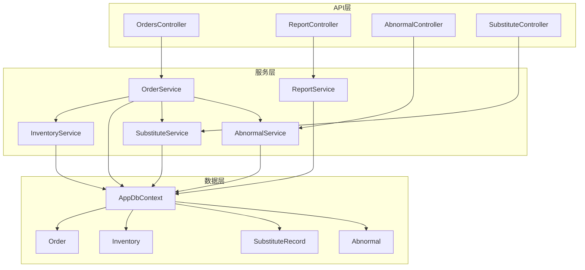
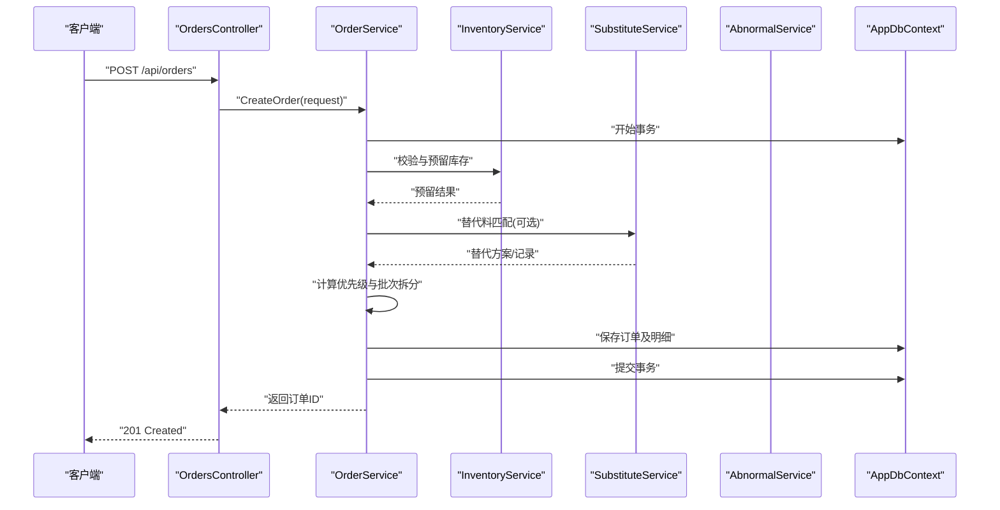
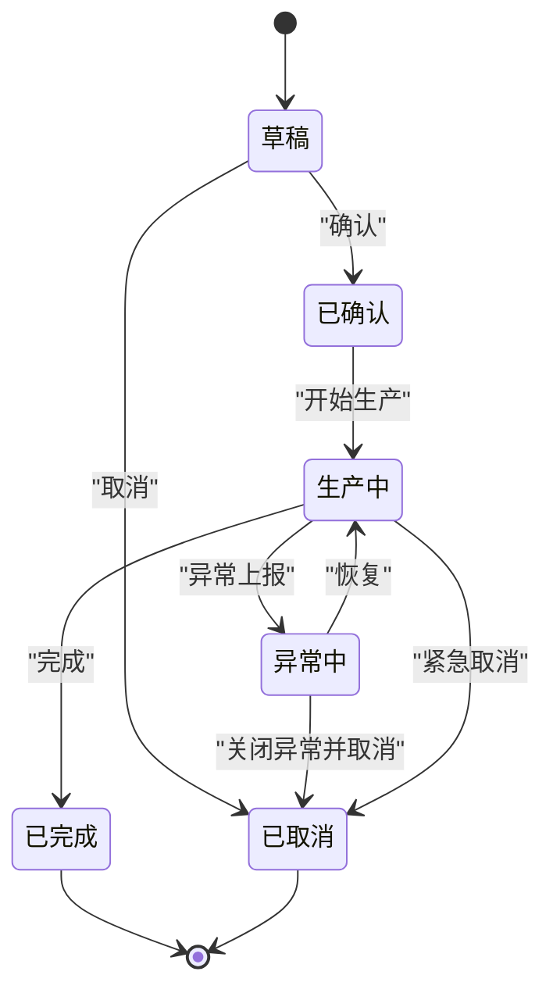
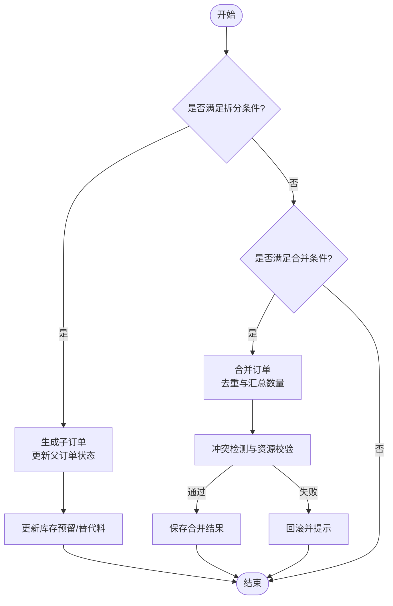
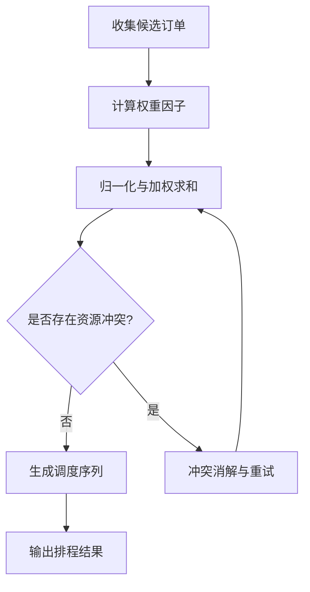
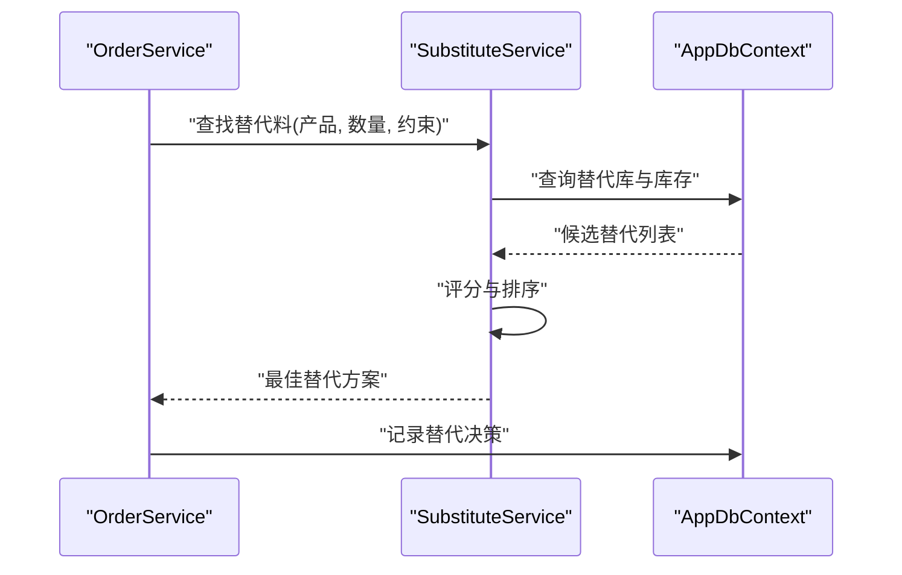
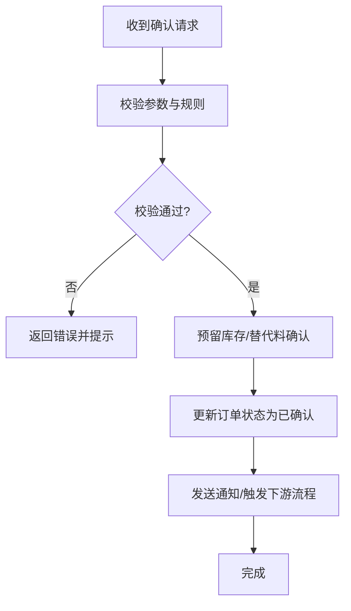
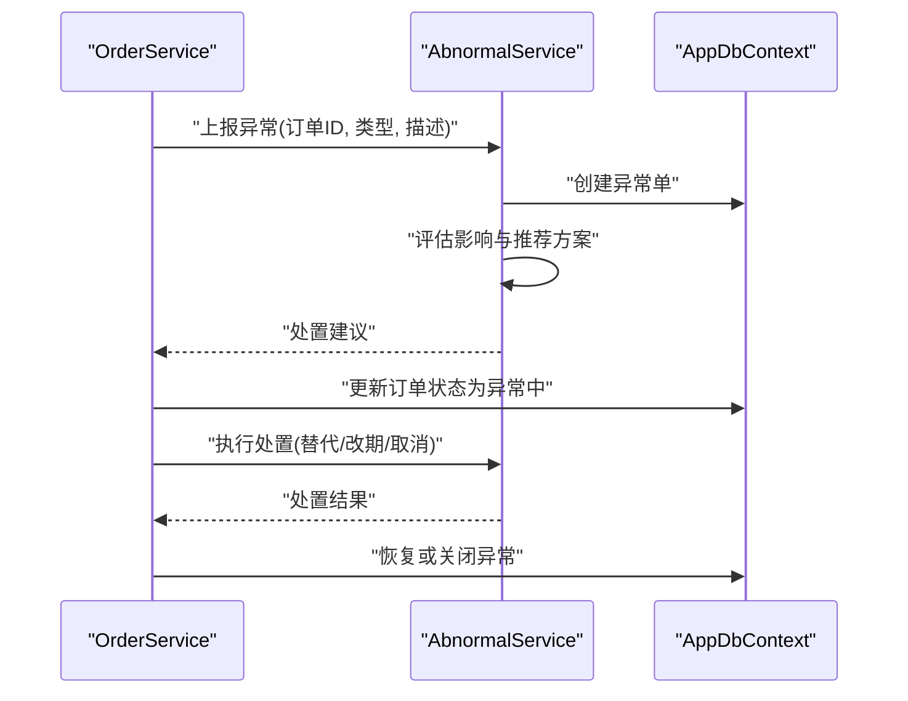
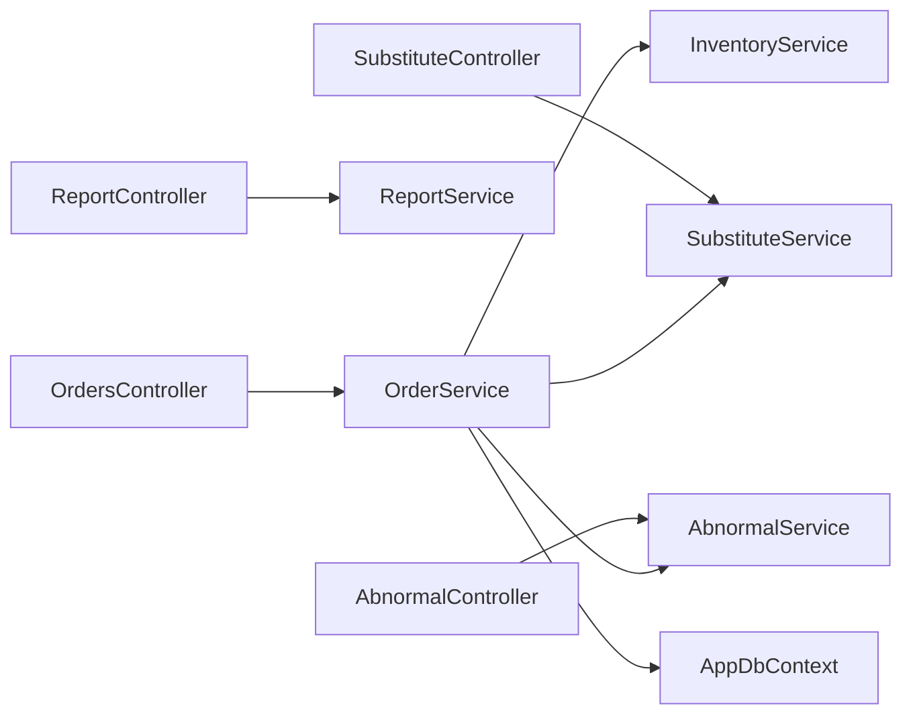

# 订单服务 (OrderService)

<cite>
**本文引用的文件**   
- [OrderService.cs](file://dip-system/Services/OrderService.cs)
- [OrdersController.cs](file://dip-system/api/Controllers/OrdersController.cs)
- [Order.cs](file://dip-system/Models/Order.cs)
- [InventoryService.cs](file://dip-system/Services/InventoryService.cs)
- [ReportService.cs](file://dip-system/Services/ReportService.cs)
- [SubstituteService.cs](file://dip-system/Services/SubstituteService.cs)
- [AbnormalService.cs](file://dip-system/Services/AbnormalService.cs)
- [AppDbContext.cs](file://dip-system/api/Data/AppDbContext.cs)
- [Program.cs](file://dip-system/Program.cs)
- [2026-07-17-multi-product-order-plan.md](file://dip-system/docs/superpowers/plans/2026-07-17-multi-product-order-plan.md)
- [2026-07-17-multi-product-order-design.md](file://dip-system/docs/superpowers/specs/2026-07-17-multi-product-order-design.md)
</cite>

## 目录
1. [简介](#简介)
2. [项目结构](#项目结构)
3. [核心组件](#核心组件)
4. [架构总览](#架构总览)
5. [详细组件分析](#详细组件分析)
6. [依赖关系分析](#依赖关系分析)
7. [性能考虑](#性能考虑)
8. [故障排查指南](#故障排查指南)
9. [结论](#结论)
10. [附录](#附录)

## 简介
本文件面向DIP系统的订单服务（OrderService），系统性阐述订单生命周期管理、多产品订单支持、替代料处理、订单优先级调度算法、与库存的联动机制、订单确认流程、异常订单处理策略，以及订单历史追溯、批量操作优化、性能调优方案与报表统计分析的实现要点。文档以代码级分析与可视化图示为主，兼顾非技术读者的理解需求。

## 项目结构
DIP系统采用分层架构：API层（Controllers）暴露REST接口；业务逻辑层（Services）实现核心流程；数据模型（Models）定义实体；数据访问通过Entity Framework上下文（AppDbContext）完成；前端Web与移动端分别调用API。



图表来源
- [OrdersController.cs](file://dip-system/api/Controllers/OrdersController.cs)
- [OrderService.cs](file://dip-system/Services/OrderService.cs)
- [InventoryService.cs](file://dip-system/Services/InventoryService.cs)
- [ReportService.cs](file://dip-system/Services/ReportService.cs)
- [SubstituteService.cs](file://dip-system/Services/SubstituteService.cs)
- [AbnormalService.cs](file://dip-system/Services/AbnormalService.cs)
- [AppDbContext.cs](file://dip-system/api/Data/AppDbContext.cs)
- [Order.cs](file://dip-system/Models/Order.cs)

章节来源
- [Program.cs](file://dip-system/Program.cs)
- [AppDbContext.cs](file://dip-system/api/Data/AppDbContext.cs)

## 核心组件
- OrderService：订单全生命周期编排，包括创建、拆分/合并、状态流转、优先级调度、确认与出库联动、异常处理、历史记录与审计。
- InventoryService：库存查询、预留、扣减与回滚，保障订单与库存一致性。
- SubstituteService：替代料匹配、审批与记录，支持替代策略与可追溯性。
- AbnormalService：异常订单登记、跟踪、处置与闭环。
- ReportService：订单统计、报表生成与分析。
- OrdersController：对外REST接口，接收请求并委托OrderService执行。

章节来源
- [OrderService.cs](file://dip-system/Services/OrderService.cs)
- [InventoryService.cs](file://dip-system/Services/InventoryService.cs)
- [SubstituteService.cs](file://dip-system/Services/SubstituteService.cs)
- [AbnormalService.cs](file://dip-system/Services/AbnormalService.cs)
- [ReportService.cs](file://dip-system/Services/ReportService.cs)
- [OrdersController.cs](file://dip-system/api/Controllers/OrdersController.cs)

## 架构总览
订单服务在API层与服务层之间承担核心编排职责，通过仓储上下文持久化数据，并与库存、替代料、异常等子系统协作，形成高内聚、低耦合的业务能力集合。



图表来源
- [OrdersController.cs](file://dip-system/api/Controllers/OrdersController.cs)
- [OrderService.cs](file://dip-system/Services/OrderService.cs)
- [InventoryService.cs](file://dip-system/Services/InventoryService.cs)
- [SubstituteService.cs](file://dip-system/Services/SubstituteService.cs)
- [AbnormalService.cs](file://dip-system/Services/AbnormalService.cs)
- [AppDbContext.cs](file://dip-system/api/Data/AppDbContext.cs)

## 详细组件分析

### 订单生命周期与状态机
- 关键状态：草稿、已确认、生产中、已完成、已取消、异常中、待处理。
- 触发事件：创建、确认、开始生产、完成、取消、异常上报、恢复。
- 约束规则：
  - 仅“草稿”可编辑，“已确认”后进入不可变阶段（除异常分支）。
  - “异常中”需经处置流程方可恢复或关闭。
  - “生产中”与库存扣减、物料齐套检查强关联。
- 状态流转图如下：



章节来源
- [OrderService.cs](file://dip-system/Services/OrderService.cs)
- [Order.cs](file://dip-system/Models/Order.cs)

### 订单创建与多产品订单支持
- 输入：包含多个产品明细的订单请求，支持数量、交期、优先级、备注等字段。
- 处理：
  - 校验必填项与业务规则（如最小起订量、交期合理性）。
  - 按产品维度进行库存预占与替代料匹配。
  - 生成订单号与明细行，写入数据库。
- 多产品特性：
  - 支持同一订单内不同产品的独立优先级与批次拆分。
  - 支持跨产品共享资源（如设备、人员）的冲突检测。
- 设计参考：
  - 多产品订单计划与设计规范见相关文档。

章节来源
- [OrderService.cs](file://dip-system/Services/OrderService.cs)
- [Order.cs](file://dip-system/Models/Order.cs)
- [2026-07-17-multi-product-order-plan.md](file://dip-system/docs/superpowers/plans/2026-07-17-multi-product-order-plan.md)
- [2026-07-17-multi-product-order-design.md](file://dip-system/docs/superpowers/specs/2026-07-17-multi-product-order-design.md)

### 订单拆分与合并逻辑
- 拆分触发条件：
  - 库存不足导致部分满足。
  - 工艺/设备产能限制需要分批。
  - 客户交期差异要求分批发货。
- 合并触发条件：
  - 相同产品、相同交期、相同产线可合并以提升效率。
  - 合并前进行冲突检测与资源可用性验证。
- 处理流程：
  - 生成子订单或合并为父订单，维护父子关系与版本控制。
  - 更新库存预留与替代料记录，保持可追溯。



图表来源
- [OrderService.cs](file://dip-system/Services/OrderService.cs)

### 订单优先级调度算法
- 目标：最大化交付准时率与资源利用率，最小化换线与等待时间。
- 权重因素：
  - 客户等级、交期紧迫度、订单金额、产品复杂度、替代料可用度、库存预留强度。
- 算法步骤：
  - 计算各订单综合得分。
  - 按得分降序排序，结合产线/设备能力进行排程。
  - 动态调整：新增订单或变更时重新评估。
- 输出：调度序列与预计开始/完成时间。



图表来源
- [OrderService.cs](file://dip-system/Services/OrderService.cs)

### 替代料处理
- 匹配策略：基于BOM与替代库，优先选择成本更低、库存更充足、质量等级更高的替代料。
- 审批流程：必要时走审批流，记录替代原因与责任人。
- 记录与追溯：每次替代生成替代记录，关联原订单与明细。



图表来源
- [OrderService.cs](file://dip-system/Services/OrderService.cs)
- [SubstituteService.cs](file://dip-system/Services/SubstituteService.cs)
- [AppDbContext.cs](file://dip-system/api/Data/AppDbContext.cs)

章节来源
- [SubstituteService.cs](file://dip-system/Services/SubstituteService.cs)

### 订单与库存联动机制
- 预留：订单确认后对所需物料进行预留，防止超卖。
- 扣减：生产领料或发货时扣减实际库存。
- 回滚：取消或异常关闭时释放预留。
- 一致性：通过事务保证订单与库存操作的原子性。

```mermaid
sequenceDiagram
participant OS as "OrderService"
participant IS as "InventoryService"
participant DB as "AppDbContext"
OS->>IS : "预留库存(订单ID, 物料清单)"
IS->>DB : "检查可用量并写入预留表"
DB-->>IS : "预留成功/失败"
IS-->>OS : "预留结果"
OS->>DB : "提交订单事务"
Note over OS,IS : "生产/发货时扣减; 取消/异常时释放"
```

图表来源
- [OrderService.cs](file://dip-system/Services/OrderService.cs)
- [InventoryService.cs](file://dip-system/Services/InventoryService.cs)
- [AppDbContext.cs](file://dip-system/api/Data/AppDbContext.cs)

章节来源
- [InventoryService.cs](file://dip-system/Services/InventoryService.cs)

### 订单确认流程
- 前置校验：必填字段、价格、交期、库存预留、替代料方案。
- 确认动作：状态由“草稿”转为“已确认”，锁定后续修改。
- 通知：触发下游准备（备料、排产）与上游反馈。



图表来源
- [OrderService.cs](file://dip-system/Services/OrderService.cs)

### 异常订单处理策略
- 异常类型：库存不足、替代料不满足、工艺异常、设备故障、质量不合格等。
- 处理流程：上报异常、评估影响、制定处置方案（切换替代料、调整交期、降级或取消）、闭环归档。
- 记录：异常单与订单关联，支持追踪与复盘。



图表来源
- [OrderService.cs](file://dip-system/Services/OrderService.cs)
- [AbnormalService.cs](file://dip-system/Services/AbnormalService.cs)
- [AppDbContext.cs](file://dip-system/api/Data/AppDbContext.cs)

章节来源
- [AbnormalService.cs](file://dip-system/Services/AbnormalService.cs)

### 订单历史追溯与审计
- 审计点：创建、确认、拆分/合并、状态变更、替代料决策、异常处置。
- 存储：审计日志与主数据分离，支持按订单ID检索与导出。
- 展示：提供时间线视图与变更对比。

章节来源
- [OrderService.cs](file://dip-system/Services/OrderService.cs)
- [AppDbContext.cs](file://dip-system/api/Data/AppDbContext.cs)

### 批量操作优化
- 批量创建/确认：支持一次性处理多条订单，减少网络往返与事务开销。
- 批处理策略：分页读取、并行校验、批量写入、失败回滚与重试。
- 监控：记录批处理进度与错误明细，便于定位问题。

章节来源
- [OrderService.cs](file://dip-system/Services/OrderService.cs)

### 报表生成与统计分析
- 指标：订单总量、完成率、准时率、异常率、替代率、库存占用、产能利用率。
- 维度：时间（日/周/月）、产品、客户、产线、仓库。
- 输出：表格、图表、导出（CSV/PDF）。

章节来源
- [ReportService.cs](file://dip-system/Services/ReportService.cs)

## 依赖关系分析
- OrderService依赖：
  - InventoryService：库存预留、扣减、回滚。
  - SubstituteService：替代料匹配与记录。
  - AbnormalService：异常上报与处置。
  - AppDbContext：数据持久化与事务管理。
- 控制器依赖：
  - OrdersController：对外接口，委托OrderService。
  - ReportController：报表查询，委托ReportService。
  - AbnormalController：异常管理，委托AbnormalService。
  - SubstituteController：替代料管理，委托SubstituteService。



图表来源
- [OrdersController.cs](file://dip-system/api/Controllers/OrdersController.cs)
- [OrderService.cs](file://dip-system/Services/OrderService.cs)
- [InventoryService.cs](file://dip-system/Services/InventoryService.cs)
- [SubstituteService.cs](file://dip-system/Services/SubstituteService.cs)
- [AbnormalService.cs](file://dip-system/Services/AbnormalService.cs)
- [ReportService.cs](file://dip-system/Services/ReportService.cs)
- [AppDbContext.cs](file://dip-system/api/Data/AppDbContext.cs)

章节来源
- [AppDbContext.cs](file://dip-system/api/Data/AppDbContext.cs)

## 性能考虑
- 数据库层面：
  - 合理索引：订单号、状态、创建时间、产品ID、客户ID等高频查询字段。
  - 读写分离：报表查询走只读副本，减轻主库压力。
  - 分页与投影：避免全量加载大对象。
- 服务层面：
  - 缓存热点数据：替代料映射、字典表、常用配置。
  - 异步处理：耗时任务（报表生成、通知）使用队列异步执行。
  - 批处理优化：批量写入与批量更新，减少事务边界。
- 并发与一致性：
  - 乐观锁/版本号：避免覆盖更新。
  - 分布式锁：针对库存预留与订单合并的关键路径加锁。
- 监控与告警：
  - 关键指标：响应时间、错误率、队列积压、数据库慢查询。
  - 链路追踪：跨服务调用链路与瓶颈定位。

[本节为通用性能指导，不直接分析具体文件]

## 故障排查指南
- 常见问题：
  - 库存预留失败：检查可用量、预留有效期、并发竞争。
  - 替代料不满足：核对替代库、质量等级、审批状态。
  - 订单状态卡住：查看异常单、事务状态、外部依赖健康。
- 排查步骤：
  - 从控制器入口打印请求与响应。
  - 在服务层记录关键节点日志（校验、预留、替代、状态变更）。
  - 在数据层检查事务提交与回滚情况。
  - 使用报表与审计日志回溯变更轨迹。
- 工具与建议：
  - 启用结构化日志与TraceId。
  - 建立健康检查与自愈脚本。
  - 定期演练异常场景与恢复流程。

章节来源
- [OrderService.cs](file://dip-system/Services/OrderService.cs)
- [AbnormalService.cs](file://dip-system/Services/AbnormalService.cs)
- [InventoryService.cs](file://dip-system/Services/InventoryService.cs)

## 结论
OrderService作为DIP系统订单服务的核心，实现了完整的订单生命周期管理与多产品订单支持，并通过与库存、替代料、异常等子系统的紧密协作，保障了订单处理的准确性与时效性。通过合理的优先级调度、拆分合并策略、批量优化与性能调优，系统在复杂生产环境下具备高可用与可扩展能力。报表与统计分析为运营决策提供了数据支撑。

[本节为总结性内容，不直接分析具体文件]

## 附录
- 术语表：订单、明细、预留、替代料、异常单、调度、批处理、审计。
- 参考文档：
  - 多产品订单计划与设计规范。
  - 库存与替代料管理策略。
  - 异常处理与闭环流程。

[本节为补充信息，不直接分析具体文件]