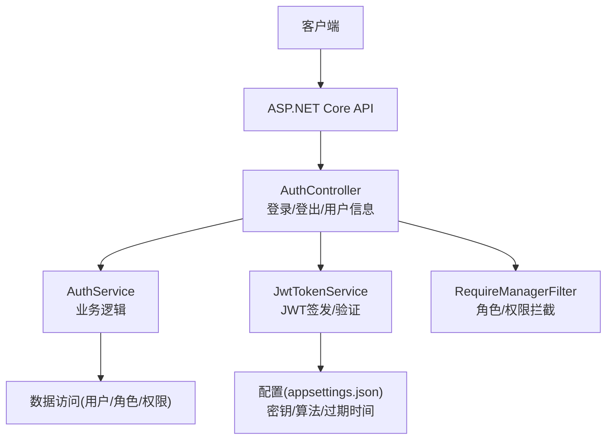
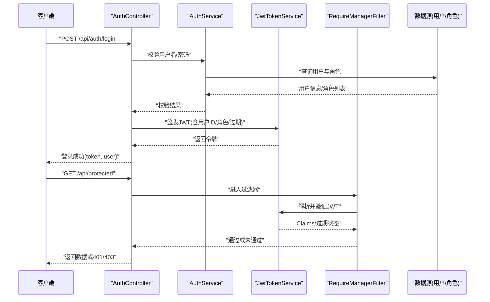
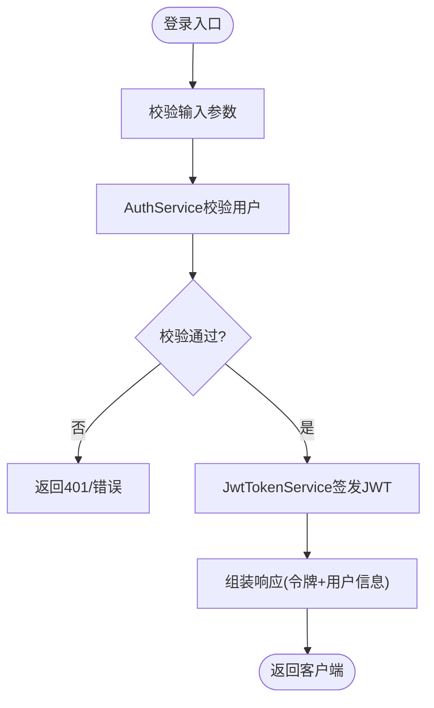
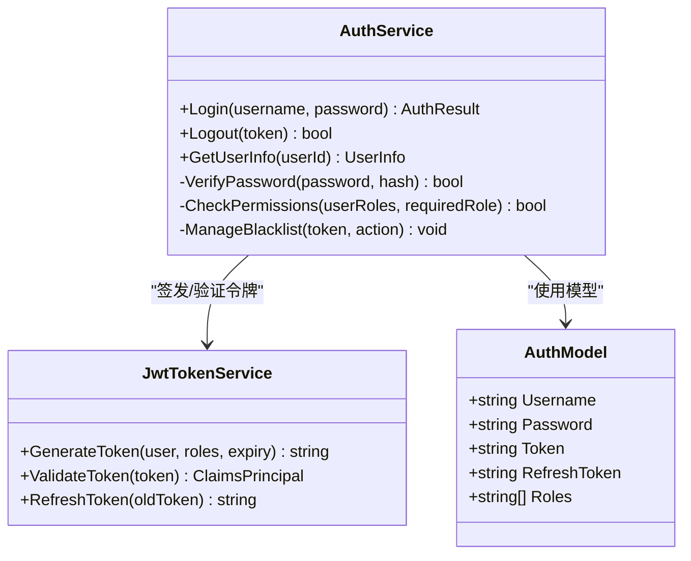
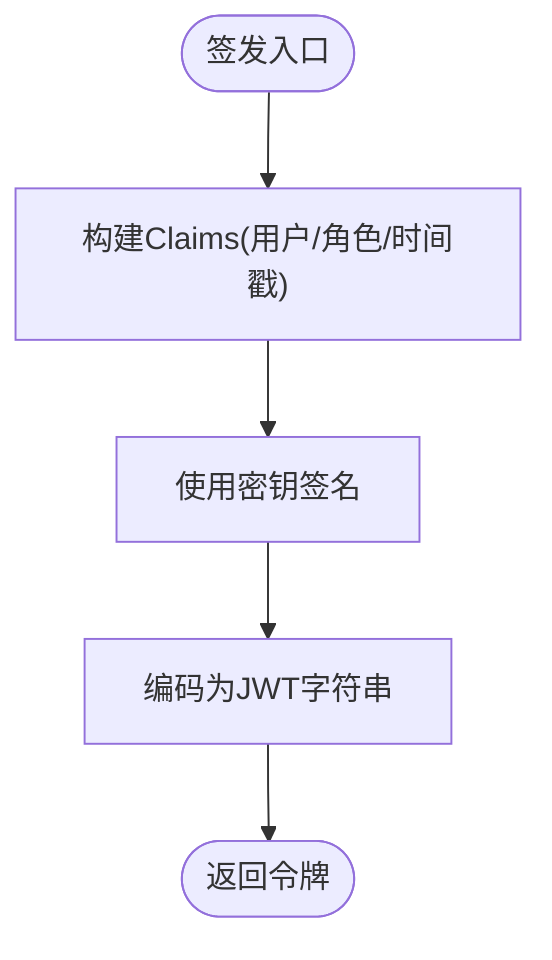
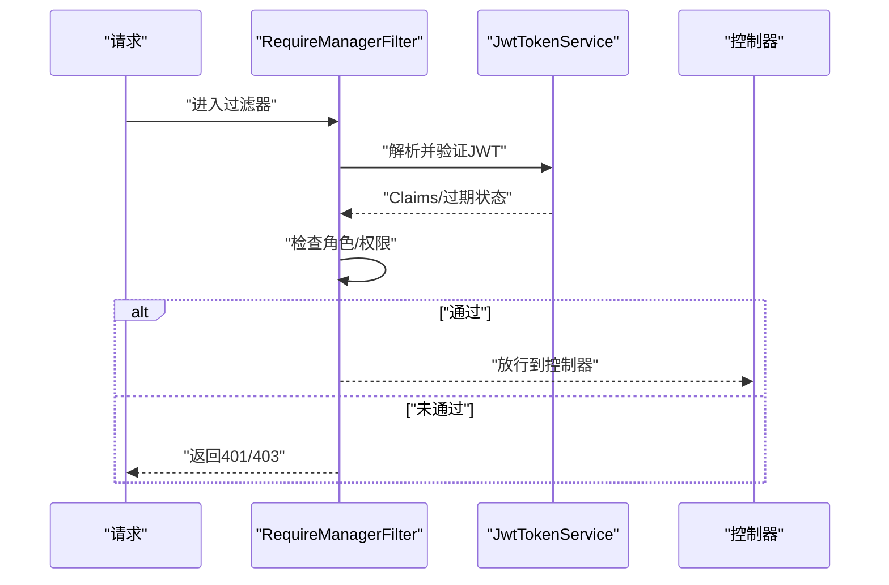
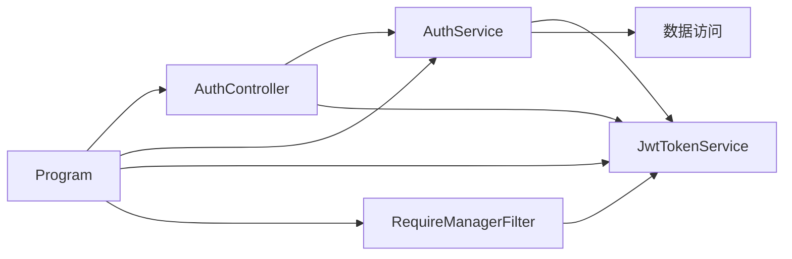

# 认证与授权

<cite>
**本文引用的文件**   
- [AuthController.cs](file://dip-system/api/Controllers/AuthController.cs)
- [AuthService.cs](file://dip-system/api/Services/AuthService.cs)
- [JwtTokenService.cs](file://dip-system/api/Services/JwtTokenService.cs)
- [RequireManagerFilter.cs](file://dip-system/api/Controllers/RequireManagerFilter.cs)
- [Auth.cs](file://dip-system/api/Models/Auth.cs)
- [Program.cs](file://dip-system/api/Program.cs)
- [appsettings.json](file://dip-system/api/appsettings.json)
</cite>

## 目录
1. [简介](#简介)
2. [项目结构](#项目结构)
3. [核心组件](#核心组件)
4. [架构总览](#架构总览)
5. [详细组件分析](#详细组件分析)
6. [依赖关系分析](#依赖关系分析)
7. [性能考量](#性能考量)
8. [故障排查指南](#故障排查指南)
9. [结论](#结论)
10. [附录](#附录)

## 简介
本章节面向DIP系统的认证与授权模块，聚焦JWT令牌生成、验证与刷新机制，以及登录、登出、获取用户信息等接口的实现。文档同时覆盖密码加密存储、角色权限控制、自定义过滤器 RequireManagerFilter 的鉴权流程，并给出安全最佳实践、令牌过期处理、并发登录管理等高级特性说明，以及扩展认证与自定义授权规则的实现指南。

## 项目结构
认证与授权相关代码主要位于后端API项目中：
- 控制器层：AuthController 暴露认证相关HTTP接口
- 服务层：AuthService 负责业务逻辑（校验、会话管理、权限判断），JwtTokenService 负责JWT签发与解析
- 模型层：Auth 定义认证请求/响应数据结构
- 过滤器：RequireManagerFilter 作为自定义中间件进行角色/权限拦截
- 配置与启动：Program 注册服务与管道，appsettings.json 提供密钥与策略配置

**图示来源** 
- [AuthController.cs](file://dip-system/api/Controllers/AuthController.cs)
- [AuthService.cs](file://dip-system/api/Services/AuthService.cs)
- [JwtTokenService.cs](file://dip-system/api/Services/JwtTokenService.cs)
- [RequireManagerFilter.cs](file://dip-system/api/Controllers/RequireManagerFilter.cs)
- [Auth.cs](file://dip-system/api/Models/Auth.cs)
- [Program.cs](file://dip-system/api/Program.cs)
- [appsettings.json](file://dip-system/api/appsettings.json)

**章节来源**
- [AuthController.cs](file://dip-system/api/Controllers/AuthController.cs)
- [AuthService.cs](file://dip-system/api/Services/AuthService.cs)
- [JwtTokenService.cs](file://dip-system/api/Services/JwtTokenService.cs)
- [RequireManagerFilter.cs](file://dip-system/api/Controllers/RequireManagerFilter.cs)
- [Auth.cs](file://dip-system/api/Models/Auth.cs)
- [Program.cs](file://dip-system/api/Program.cs)
- [appsettings.json](file://dip-system/api/appsettings.json)

## 核心组件
- AuthController：对外暴露登录、登出、获取当前用户信息等接口，协调AuthService与JwtTokenService完成认证流程。
- AuthService：封装认证业务逻辑，包括用户名/密码校验、用户信息查询、权限/角色判定、会话与黑名单管理（如需要）。
- JwtTokenService：负责JWT令牌的生成、解析、刷新与过期策略；支持对称或非对称签名算法。
- RequireManagerFilter：自定义过滤器，在请求进入控制器前进行角色/权限校验，未通过则拒绝访问。
- Auth模型：定义登录请求、响应、用户信息、令牌等数据结构。
- Program与appsettings.json：注册认证服务、配置JWT密钥、算法、过期时间、刷新策略等。

**章节来源**
- [AuthController.cs](file://dip-system/api/Controllers/AuthController.cs)
- [AuthService.cs](file://dip-system/api/Services/AuthService.cs)
- [JwtTokenService.cs](file://dip-system/api/Services/JwtTokenService.cs)
- [RequireManagerFilter.cs](file://dip-system/api/Controllers/RequireManagerFilter.cs)
- [Auth.cs](file://dip-system/api/Models/Auth.cs)
- [Program.cs](file://dip-system/api/Program.cs)
- [appsettings.json](file://dip-system/api/appsettings.json)

## 架构总览
下图展示认证授权的端到端流程：客户端发起登录请求，AuthController调用AuthService进行身份校验，成功后由JwtTokenService签发JWT；后续受保护接口通过RequireManagerFilter进行角色/权限校验，未通过则返回401/403。

**图示来源** 
- [AuthController.cs](file://dip-system/api/Controllers/AuthController.cs)
- [AuthService.cs](file://dip-system/api/Services/AuthService.cs)
- [JwtTokenService.cs](file://dip-system/api/Services/JwtTokenService.cs)
- [RequireManagerFilter.cs](file://dip-system/api/Controllers/RequireManagerFilter.cs)

## 详细组件分析

### AuthController：登录、登出、用户信息
- 登录接口
  - 接收用户名/密码，调用AuthService进行校验
  - 校验通过后调用JwtTokenService签发JWT
  - 返回令牌与必要用户信息
- 登出接口
  - 可选：将当前令牌加入黑名单或清除服务端会话
  - 清理前端缓存（由客户端负责）
- 用户信息接口
  - 从请求上下文提取Claims（用户ID、角色等）
  - 返回当前用户详细信息

**图示来源** 
- [AuthController.cs](file://dip-system/api/Controllers/AuthController.cs)
- [AuthService.cs](file://dip-system/api/Services/AuthService.cs)
- [JwtTokenService.cs](file://dip-system/api/Services/JwtTokenService.cs)

**章节来源**
- [AuthController.cs](file://dip-system/api/Controllers/AuthController.cs)
- [AuthService.cs](file://dip-system/api/Services/AuthService.cs)
- [JwtTokenService.cs](file://dip-system/api/Services/JwtTokenService.cs)

### AuthService：业务逻辑、密码加密、权限验证
- 密码加密存储
  - 使用强哈希算法（如BCrypt/Argon2）对密码进行单向加密
  - 每次登录时比对明文与密文
- 用户权限验证
  - 根据用户角色/权限集合判断是否具备访问资源的资格
  - 支持细粒度权限（资源+动作）或粗粒度角色（管理员/普通用户）
- 会话与黑名单
  - 可选：维护令牌黑名单以支持强制登出
  - 支持并发登录限制（同一用户多设备/同设备策略）

**图示来源** 
- [AuthService.cs](file://dip-system/api/Services/AuthService.cs)
- [JwtTokenService.cs](file://dip-system/api/Services/JwtTokenService.cs)
- [Auth.cs](file://dip-system/api/Models/Auth.cs)

**章节来源**
- [AuthService.cs](file://dip-system/api/Services/AuthService.cs)
- [Auth.cs](file://dip-system/api/Models/Auth.cs)

### JwtTokenService：JWT签发、验证、刷新
- 签发
  - 基于用户ID、角色、过期时间生成JWT
  - 支持对称密钥（HMAC）或非对称密钥（RSA/ECDSA）
- 验证
  - 解析令牌并验证签名、过期时间、受众/发行者等声明
- 刷新
  - 支持刷新令牌机制，延长访问有效期
  - 可结合黑名单或版本化令牌防止重放攻击

**图示来源** 
- [JwtTokenService.cs](file://dip-system/api/Services/JwtTokenService.cs)
- [appsettings.json](file://dip-system/api/appsettings.json)

**章节来源**
- [JwtTokenService.cs](file://dip-system/api/Services/JwtTokenService.cs)
- [appsettings.json](file://dip-system/api/appsettings.json)

### RequireManagerFilter：自定义过滤器与角色权限控制
- 作用点
  - 在控制器方法执行前进行鉴权
- 鉴权流程
  - 从请求头或上下文提取JWT
  - 解析Claims并校验角色/权限
  - 未通过则返回401/403
- 配置
  - 可在Program中全局注册或在控制器/方法上按需启用

**图示来源** 
- [RequireManagerFilter.cs](file://dip-system/api/Controllers/RequireManagerFilter.cs)
- [JwtTokenService.cs](file://dip-system/api/Services/JwtTokenService.cs)
- [Program.cs](file://dip-system/api/Program.cs)

**章节来源**
- [RequireManagerFilter.cs](file://dip-system/api/Controllers/RequireManagerFilter.cs)
- [Program.cs](file://dip-system/api/Program.cs)

### 配置与启动：Program与appsettings.json
- Program
  - 注册AuthService、JwtTokenService
  - 添加RequireManagerFilter到中间件管道
  - 配置JWT验证参数（密钥、算法、过期时间）
- appsettings.json
  - 存储JWT密钥、算法、过期时间、刷新策略等敏感配置
  - 建议通过环境变量或密钥管理服务注入

**章节来源**
- [Program.cs](file://dip-system/api/Program.cs)
- [appsettings.json](file://dip-system/api/appsettings.json)

## 依赖关系分析
- AuthController依赖AuthService与JwtTokenService
- AuthService依赖数据库访问（用户/角色/权限）与JwtTokenService
- RequireManagerFilter依赖JwtTokenService进行令牌解析与验证
- Program负责装配所有服务与过滤器

**图示来源** 
- [AuthController.cs](file://dip-system/api/Controllers/AuthController.cs)
- [AuthService.cs](file://dip-system/api/Services/AuthService.cs)
- [JwtTokenService.cs](file://dip-system/api/Services/JwtTokenService.cs)
- [RequireManagerFilter.cs](file://dip-system/api/Controllers/RequireManagerFilter.cs)
- [Program.cs](file://dip-system/api/Program.cs)

**章节来源**
- [AuthController.cs](file://dip-system/api/Controllers/AuthController.cs)
- [AuthService.cs](file://dip-system/api/Services/AuthService.cs)
- [JwtTokenService.cs](file://dip-system/api/Services/JwtTokenService.cs)
- [RequireManagerFilter.cs](file://dip-system/api/Controllers/RequireManagerFilter.cs)
- [Program.cs](file://dip-system/api/Program.cs)

## 性能考量
- JWT无状态验证减少服务器负载，避免频繁查库
- 合理设置令牌过期时间，平衡安全性与用户体验
- 刷新令牌机制降低频繁重新登录开销
- 使用内存缓存加速角色/权限查询（如适用）
- 避免在JWT中存储过大Payload，保持轻量

[本节为通用指导，无需特定文件引用]

## 故障排查指南
- 登录失败
  - 检查用户名/密码是否正确
  - 确认密码哈希算法一致
  - 查看AuthService日志与数据库记录
- 令牌无效/过期
  - 检查JWT密钥配置是否一致
  - 确认客户端携带正确的Authorization头
  - 使用刷新令牌续期
- 权限不足
  - 确认用户角色/权限配置正确
  - 检查RequireManagerFilter的权限规则
- 并发登录问题
  - 检查黑名单或会话策略
  - 调整并发登录限制策略

**章节来源**
- [AuthService.cs](file://dip-system/api/Services/AuthService.cs)
- [JwtTokenService.cs](file://dip-system/api/Services/JwtTokenService.cs)
- [RequireManagerFilter.cs](file://dip-system/api/Controllers/RequireManagerFilter.cs)

## 结论
DIP系统认证与授权模块采用JWT无状态令牌与自定义过滤器相结合的设计，实现了安全的登录、登出与权限控制。通过AuthService集中业务逻辑、JwtTokenService统一令牌管理、RequireManagerFilter集中鉴权，整体架构清晰、可扩展性强。建议在生产环境严格管理密钥、启用HTTPS、实施刷新令牌与黑名单机制，并根据业务需求扩展角色/权限模型。

[本节为总结性内容，无需特定文件引用]

## 附录
- 安全最佳实践
  - 使用强哈希算法存储密码
  - 最小化JWT Payload，避免敏感信息
  - 启用HTTPS与严格的CORS策略
  - 定期轮换密钥与令牌
- 令牌过期处理
  - 前端检测401响应自动刷新令牌
  - 刷新失败引导重新登录
- 并发登录管理
  - 支持单设备或多设备策略
  - 黑名单强制登出
- 扩展认证与自定义授权
  - 扩展AuthService增加第三方认证（OAuth2/SAML）
  - 在RequireManagerFilter中实现细粒度权限规则
  - 使用策略模式替换硬编码权限判断

[本节为通用指导，无需特定文件引用]