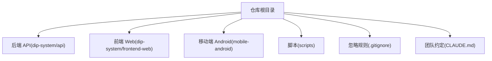
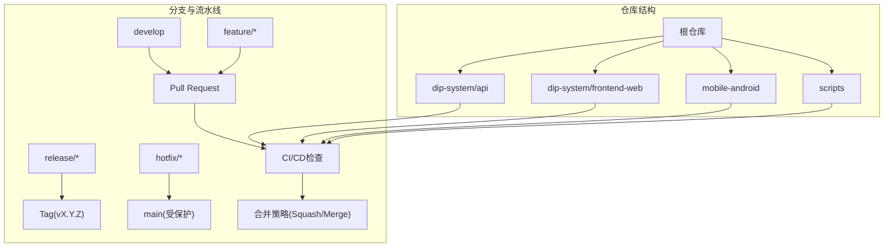
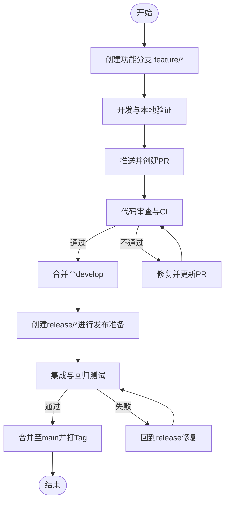
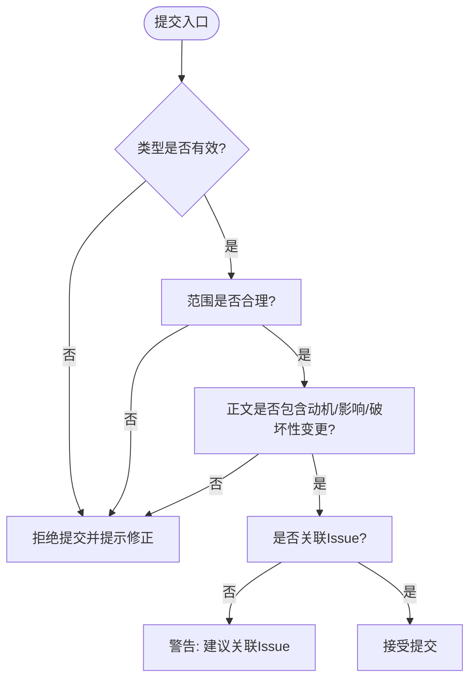
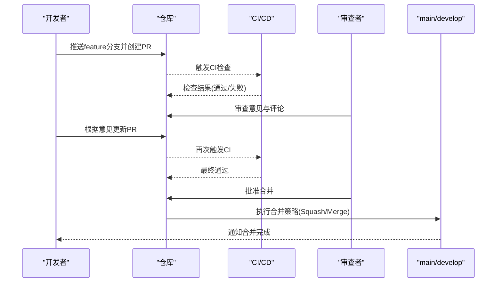
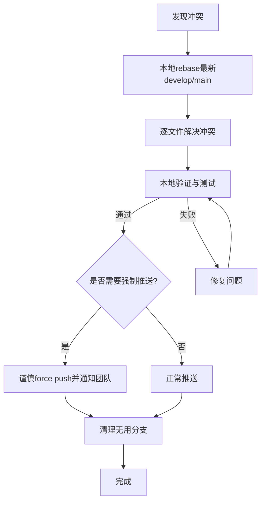
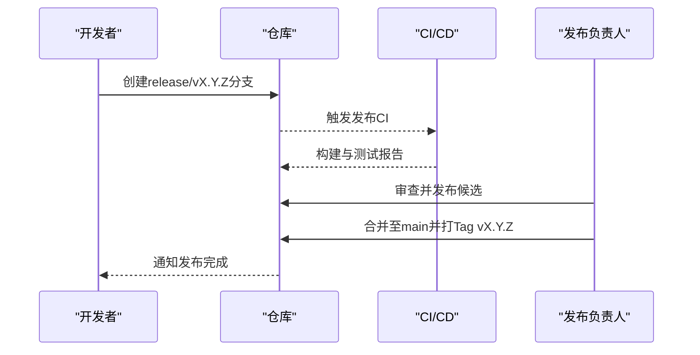
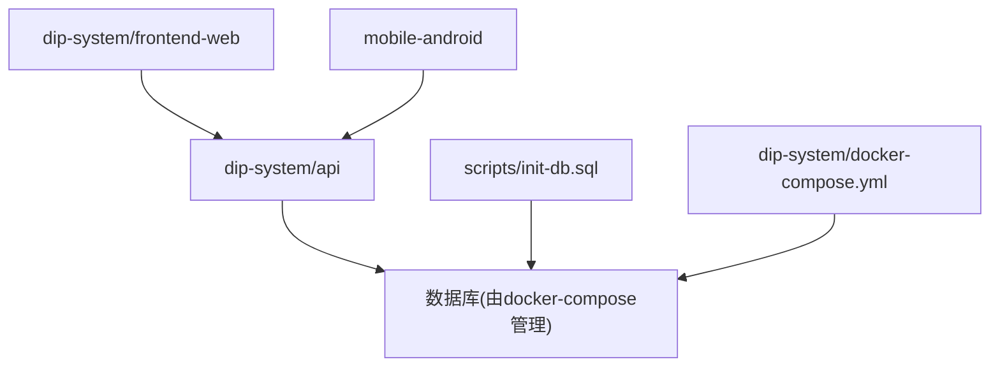

# Git工作流与协作

<cite>
**本文引用的文件**   
- [.gitignore](file://.gitignore)
- [CLAUDE.md](file://CLAUDE.md)
- [dip-system/CLAUDE.md](file://dip-system/CLAUDE.md)
- [mobile-android/CLAUDE.md](file://mobile-android/CLAUDE.md)
- [dip-system/docker-compose.yml](file://dip-system/docker-compose.yml)
- [scripts/init-db.sql](file://scripts/init-db.sql)
</cite>

## 目录
1. [简介](#简介)
2. [项目结构](#项目结构)
3. [核心组件](#核心组件)
4. [架构总览](#架构总览)
5. [详细组件分析](#详细组件分析)
6. [依赖分析](#依赖分析)
7. [性能考虑](#性能考虑)
8. [故障排查指南](#故障排查指南)
9. [结论](#结论)
10. [附录](#附录)

## 简介
本规范面向DIP系统的团队协作，目标是建立统一、可追溯、低风险的Git工作流。内容覆盖分支策略、提交信息规范、代码审查流程、冲突解决与历史清理、标签与发布管理、协作工具配置以及常见问题处理。通过标准化流程提升交付质量与团队效率，降低合并风险与回归概率。

## 项目结构
仓库采用多语言、多端聚合的单体仓库（Monorepo）组织方式：
- 后端API服务：dip-system/api
- 前端Web应用：dip-system/frontend-web
- 移动端Android应用：mobile-android
- 数据库初始化脚本：scripts
- 根级忽略规则与文档：.gitignore、CLAUDE.md等

**图表来源** 
- [.gitignore](file://.gitignore)
- [CLAUDE.md](file://CLAUDE.md)

**章节来源**
- [.gitignore](file://.gitignore)
- [CLAUDE.md](file://CLAUDE.md)

## 核心组件
本节定义Git工作流的核心要素与约束，确保全仓一致性与可维护性。

- 分支模型
  - main：受保护的生产基线，仅允许通过PR合并，禁止直接推送
  - develop：集成开发分支，日常功能汇聚地
  - feature/*：功能分支，按“feature/模块-描述”命名
  - release/*：预发布分支，用于版本冻结与回归测试
  - hotfix/*：热修复分支，从main拉取，修复后回合并至develop与main
  - docs/*：文档类变更专用分支
  - 临时实验分支：以“exp/*”或“tmp/*”命名，生命周期短，不长期保留

- 分支保护与权限
  - main与release/*启用强制PR、至少1名Reviewer、CI全部通过
  - 禁止force push；历史重写需经Release负责人审批
  - 敏感路径（如密钥、证书）禁止进入仓库

- 提交信息规范
  - 格式：类型(范围): 简述
  - 类型：feat、fix、docs、style、refactor、perf、test、build、ci、chore、revert
  - 范围：模块或子包，如api、frontend-web、mobile-android、scripts
  - 要求：一行摘要≤72字符；正文说明动机、影响面、破坏性变更；关联Issue用“Closes #123”或“Refs #123”

- 代码审查与合并策略
  - 所有变更必须通过PR；最小审查人数≥1
  - 审查检查清单：需求对齐、设计合理性、边界与异常、测试覆盖、性能与安全、兼容性、文档更新
  - 合并策略：feature→develop使用Squash Merge；release/hotfix→main使用Merge Commit并打Tag

- 冲突解决与历史清理
  - 频繁rebase保持线性历史；避免在共享分支上commit
  - 合并前本地先rebase再push；冲突优先在功能分支解决
  - 清理无用分支；定期归档过期release/*与hotfix/*

- 标签与发布管理
  - 语义化版本：v主.次.修订（如v1.2.3）
  - 发布流程：develop→release/vX.Y.Z→测试→合并到main并打Tag→删除release分支
  - 热修复：hotfix/*→main打Tag→合并回develop

- 协作工具配置
  - IDE插件：VS Code GitLens、IntelliJ内置Git、Android Studio Git
  - 命令行：git、gh（GitHub CLI）、hub（可选）
  - 可视化客户端：GitHub Desktop、SourceTree、Fork
  - 建议开启Commit签名、自动格式化、Pre-commit钩子

- 常见问题处理
  - 大文件：使用.gitattributes + git-lfs；禁止二进制大文件直传
  - 换行符：.gitattributes统一LF；Windows用户设置core.autocrlf=input
  - 跨平台差异：构建产物不入仓；环境变量与密钥不进仓库

**章节来源**
- [.gitignore](file://.gitignore)
- [CLAUDE.md](file://CLAUDE.md)

## 架构总览
下图展示DIP系统各端与仓库结构的协作关系，以及Git工作流在各端的落地点。

[此图为概念性架构图，未直接映射具体源码文件]

## 详细组件分析

### 分支管理与发布流程
- 功能开发
  - 从develop拉取feature/*分支
  - 小步提交，遵循提交规范
  - 完成特性后创建PR至develop，触发CI与审查
- 发布准备
  - 从develop创建release/*分支
  - 冻结代码，集中修复问题，补充测试与文档
  - 合并至main并打Tag，删除release分支
- 热修复
  - 从main拉取hotfix/*分支
  - 修复后PR至main，通过后立即合并并打Tag
  - 将修复同步回develop

**章节来源**
- [.gitignore](file://.gitignore)
- [CLAUDE.md](file://CLAUDE.md)

### 提交信息与变更追踪
- 提交类型与范围
  - feat：新功能
  - fix：缺陷修复
  - docs：文档更新
  - style：样式与格式调整
  - refactor：重构
  - perf：性能优化
  - test：测试相关
  - build：构建系统与依赖
  - ci：持续集成
  - chore：杂项
  - revert：回滚
- 关联Issue
  - 使用“Closes #123”自动关闭Issue
  - 使用“Refs #123”引用但不关闭
- 变更描述
  - 明确动机与影响范围
  - 列出破坏性变更与迁移步骤
  - 必要时提供截图或日志片段链接

**章节来源**
- [.gitignore](file://.gitignore)
- [CLAUDE.md](file://CLAUDE.md)

### 代码审查流程与合并策略
- PR模板要点
  - 背景与目标
  - 变更概述
  - 影响范围与风险评估
  - 测试计划与结果
  - 依赖与兼容性
  - 文档更新情况
- 审查检查清单
  - 需求与设计一致性
  - 边界条件与异常处理
  - 安全与性能考量
  - 测试覆盖率与用例有效性
  - 代码风格与可读性
  - 文档与注释完整性
- 合并策略
  - feature→develop：Squash Merge，保持develop整洁
  - release/hotfix→main：Merge Commit，保留完整上下文
  - 禁止force push到受保护分支

**章节来源**
- [.gitignore](file://.gitignore)
- [CLAUDE.md](file://CLAUDE.md)

### 冲突解决与历史清理
- 冲突预防
  - 频繁rebase，保持本地与远程同步
  - 拆分大提交为小粒度提交
  - 避免多人同时修改同一文件热点区域
- 冲突解决
  - 在功能分支内解决，避免污染共享分支
  - 使用IDE或命令行工具对比差异，确认正确版本
  - 解决后重新运行CI与本地验证
- 历史清理
  - 合并后删除已合入的feature/release/hotfix分支
  - 定期归档过期分支与Tag
  - 对敏感信息进行历史清理时，使用BFG或git filter-repo，并通知团队

**章节来源**
- [.gitignore](file://.gitignore)
- [CLAUDE.md](file://CLAUDE.md)

### 标签与发布管理
- 版本规范
  - 语义化版本：主版本号(不兼容变更)、次版本号(新增功能)、修订号(缺陷修复)
  - Tag命名：v主.次.修订（如v1.2.3）
- 发布流程
  - 从develop创建release/*分支
  - 冻结代码，集中修复问题，补充测试与文档
  - 合并至main并打Tag，删除release分支
- 热修复流程
  - 从main拉取hotfix/*分支
  - 修复后PR至main，通过后立即合并并打Tag
  - 将修复同步回develop

**章节来源**
- [.gitignore](file://.gitignore)
- [CLAUDE.md](file://CLAUDE.md)

### 协作工具配置
- IDE插件
  - VS Code：GitLens、Git History、Prettier、ESLint
  - IntelliJ/Android Studio：内置Git、Kotlin插件、Gradle工具
- 命令行工具
  - git基础命令、gh（GitHub CLI）用于PR与Issue管理
  - pre-commit钩子用于自动化检查
- 可视化客户端
  - GitHub Desktop、SourceTree、Fork适合非命令行用户
- 建议配置
  - 开启Commit签名与GPG验证
  - 统一换行符与编码设置
  - 配置SSH密钥与访问令牌

**章节来源**
- [.gitignore](file://.gitignore)
- [CLAUDE.md](file://CLAUDE.md)

### 常见问题处理
- 大文件与二进制文件
  - 使用.gitattributes声明LFS跟踪的文件类型
  - 禁止将构建产物、日志、密钥等入仓
  - 定期扫描仓库大小，清理历史中的大文件
- 跨平台换行符
  - .gitattributes统一LF
  - Windows用户设置core.autocrlf=input
  - 避免混用不同编辑器导致的换行差异
- 依赖与环境
  - 锁定依赖版本（package-lock.json、gradle.lockfile）
  - 环境变量与密钥通过CI/CD注入，不入仓库

**章节来源**
- [.gitignore](file://.gitignore)
- [CLAUDE.md](file://CLAUDE.md)

## 依赖分析
- 仓库内依赖
  - 后端API与前端Web通过REST接口交互
  - 移动端Android通过Retrofit调用后端API
  - 数据库初始化脚本由scripts目录管理
- 外部依赖
  - Docker Compose用于本地环境编排
  - CI/CD平台（如GitHub Actions）用于自动化检查与构建

**图表来源** 
- [dip-system/docker-compose.yml](file://dip-system/docker-compose.yml)
- [scripts/init-db.sql](file://scripts/init-db.sql)

**章节来源**
- [dip-system/docker-compose.yml](file://dip-system/docker-compose.yml)
- [scripts/init-db.sql](file://scripts/init-db.sql)

## 性能考虑
- 提交粒度
  - 小步提交便于回溯与审查，减少合并冲突
- 分支长度
  - 缩短feature分支生命周期，降低集成成本
- 构建与测试
  - 并行化CI任务，缓存依赖与构建产物
  - 增量测试，仅运行受影响模块的测试用例
- 仓库规模
  - 定期清理历史与大文件，保持仓库轻量

[本节为通用指导，无需特定文件来源]

## 故障排查指南
- 常见错误
  - 权限不足：检查分支保护与权限配置
  - CI失败：查看日志定位失败阶段，修复后重新触发
  - 冲突频发：加强rebase与沟通，拆分大提交
  - 大文件导致克隆慢：使用LFS与.gitignore排除
- 调试技巧
  - 使用git log --oneline --graph查看历史
  - 使用git diff与git stash辅助临时切换
  - 使用gh pr checks查看PR状态

**章节来源**
- [.gitignore](file://.gitignore)
- [CLAUDE.md](file://CLAUDE.md)

## 结论
通过统一的Git工作流与协作规范，DIP系统能够显著提升交付质量与团队效率。建议结合CI/CD与IDE插件实现自动化检查与提示，持续优化流程与工具链，确保项目在快速迭代中保持稳定与可追溯。

[本节为总结性内容，无需特定文件来源]

## 附录
- 术语表
  - PR：Pull Request，拉取请求
  - CI/CD：持续集成/持续交付
  - LFS：Large File Storage，大文件存储
  - Tag：标签，用于标记版本
- 参考资源
  - Git官方文档
  - GitHub最佳实践
  - 团队内部Wiki与示例仓库

[本节为参考资料，无需特定文件来源]