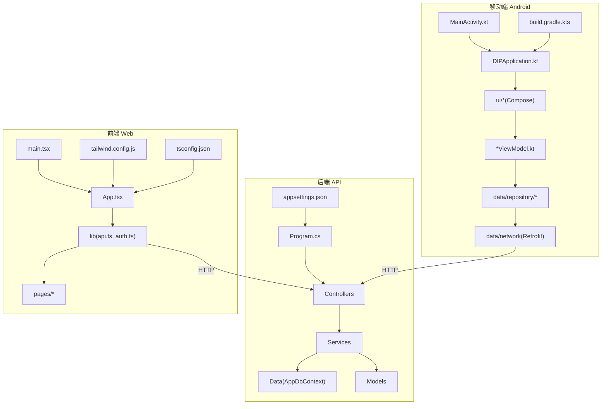
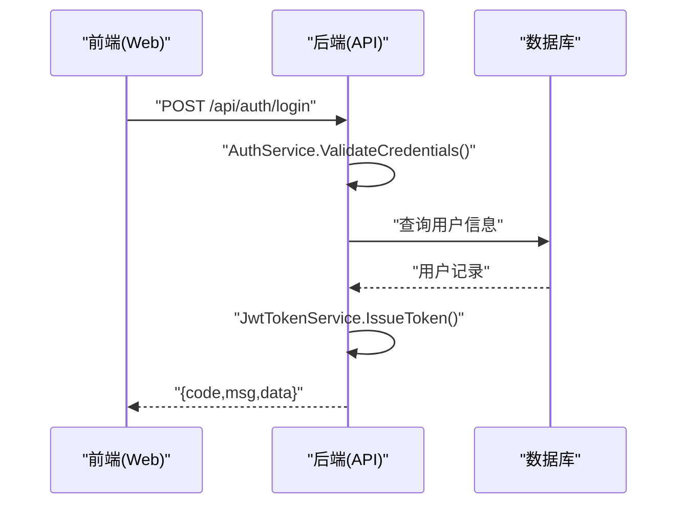
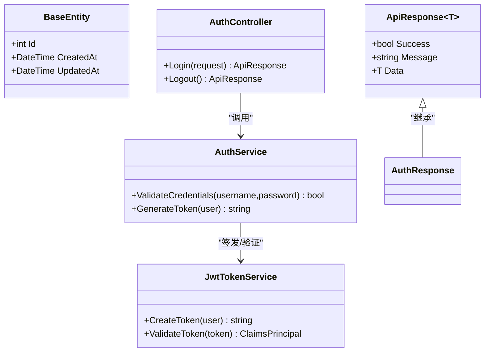
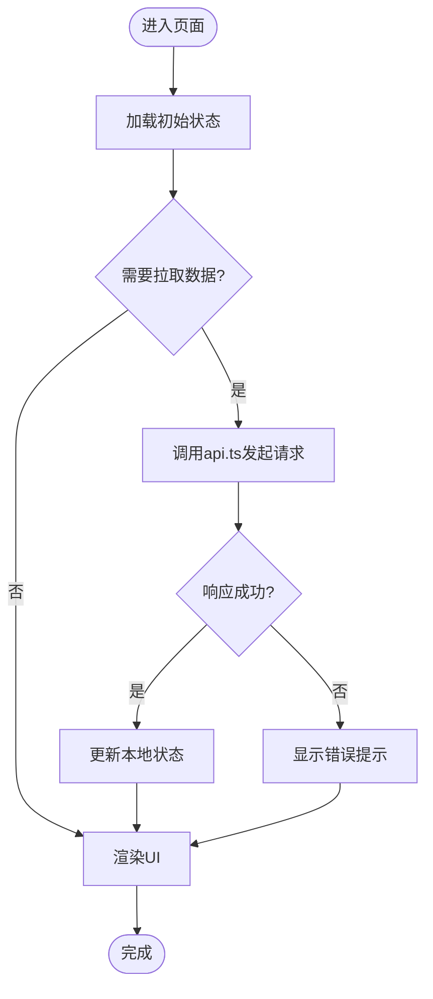
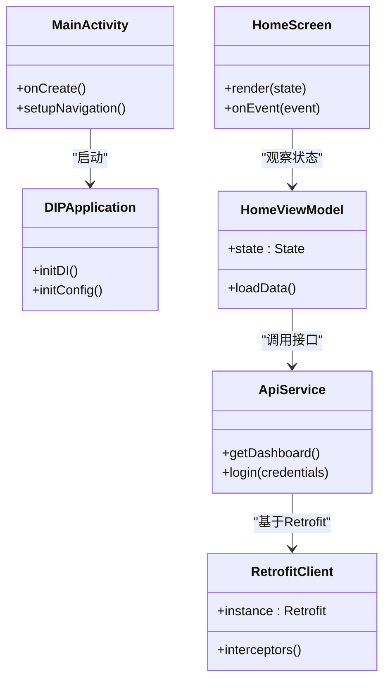
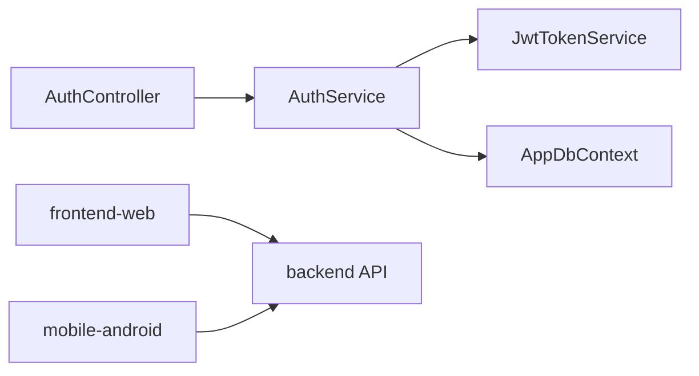

# 代码规范与约定

<cite>
**本文引用的文件**   
- [Program.cs](file://dip-system/api/Program.cs)
- [AppDbContext.cs](file://dip-system/api/Data/AppDbContext.cs)
- [AuthController.cs](file://dip-system/api/Controllers/AuthController.cs)
- [AuthService.cs](file://dip-system/api/Services/AuthService.cs)
- [JwtTokenService.cs](file://dip-system/api/Services/JwtTokenService.cs)
- [ApiResponse.cs](file://dip-system/api/Models/ApiResponse.cs)
- [BaseEntity.cs](file://dip-system/api/Models/BaseEntity.cs)
- [appsettings.json](file://dip-system/api/appsettings.json)
- [main.tsx](file://dip-system/frontend-web/src/main.tsx)
- [App.tsx](file://dip-system/frontend-web/src/App.tsx)
- [api.ts](file://dip-system/frontend-web/src/lib/api.ts)
- [auth.ts](file://dip-system/frontend-web/src/lib/auth.ts)
- [tsconfig.json](file://dip-system/frontend-web/tsconfig.json)
- [tailwind.config.js](file://dip-system/frontend-web/tailwind.config.js)
- [postcss.config.js](file://dip-system/frontend-web/postcss.config.js)
- [MainActivity.kt](file://mobile-android/app/src/main/java/com/dip/material/MainActivity.kt)
- [DIPApplication.kt](file://mobile-android/app/src/main/java/com/dip/material/DIPApplication.kt)
- [ApiService.kt](file://mobile-android/app/src/main/java/com/dip/material/data/network/ApiService.kt)
- [RetrofitClient.kt](file://mobile-android/app/src/main/java/com/dip/material/data/network/RetrofitClient.kt)
- [AuthInterceptor.kt](file://mobile-android/app/src/main/java/com/dip/material/data/network/AuthInterceptor.kt)
- [HomeScreen.kt](file://mobile-android/app/src/main/java/com/dip/material/ui/home/HomeScreen.kt)
- [HomeViewModel.kt](file://mobile-android/app/src/main/java/com/dip/material/ui/home/HomeViewModel.kt)
- [LoginScreen.kt](file://mobile-android/app/src/main/java/com/dip/material/ui/login/LoginScreen.kt)
- [LoginViewModel.kt](file://mobile-android/app/src/main/java/com/dip/material/ui/login/LoginViewModel.kt)
- [Build.gradle.kts](file://mobile-android/app/build.gradle.kts)
- [build.gradle.kts](file://mobile-android/build.gradle.kts)
- [gradle.properties](file://mobile-android/gradle.properties)
</cite>

## 目录
1. [引言](#引言)
2. [项目结构](#项目结构)
3. [核心组件](#核心组件)
4. [架构总览](#架构总览)
5. [详细组件分析](#详细组件分析)
6. [依赖关系分析](#依赖关系分析)
7. [性能考量](#性能考量)
8. [故障排查指南](#故障排查指南)
9. [结论](#结论)
10. [附录](#附录)

## 引言
本规范面向DIP系统的C#后端、React+TypeScript前端与Android Kotlin客户端，统一命名约定、文件组织、注释风格、提交与分支策略、代码审查清单以及IDE与自动化配置建议。目标是提升可读性、可维护性与协作效率，降低回归风险。

## 项目结构
- 后端（ASP.NET Core）：按功能域划分控制器、服务与模型；数据访问通过EF Core上下文；统一响应封装与异常处理。
- 前端（React + TypeScript + Vite + Tailwind）：页面级组件与通用库分离；API与鉴权逻辑集中管理；样式采用Tailwind原子类。
- Android（Kotlin + Jetpack Compose + Retrofit）：分层清晰（UI/ViewModel/Repository/Network），资源与主题集中管理。

图表来源
- [Program.cs:1-100](file://dip-system/api/Program.cs#L1-L100)
- [AppDbContext.cs:1-100](file://dip-system/api/Data/AppDbContext.cs#L1-L100)
- [main.tsx:1-100](file://dip-system/frontend-web/src/main.tsx#L1-L100)
- [App.tsx:1-100](file://dip-system/frontend-web/src/App.tsx#L1-L100)
- [ApiService.kt:1-100](file://mobile-android/app/src/main/java/com/dip/material/data/network/ApiService.kt#L1-L100)
- [RetrofitClient.kt:1-100](file://mobile-android/app/src/main/java/com/dip/material/data/network/RetrofitClient.kt#L1-L100)

章节来源
- [Program.cs:1-100](file://dip-system/api/Program.cs#L1-L100)
- [main.tsx:1-100](file://dip-system/frontend-web/src/main.tsx#L1-L100)
- [MainActivity.kt:1-100](file://mobile-android/app/src/main/java/com/dip/material/MainActivity.kt#L1-L100)

## 核心组件
- 后端
  - 控制器层：RESTful接口定义，参数校验与错误包装。
  - 服务层：业务编排、事务边界与领域规则。
  - 数据层：EF Core DbContext与实体映射。
  - 统一响应与异常：标准化返回结构与全局异常处理。
- 前端
  - 应用入口与路由：页面挂载与导航。
  - 网络与鉴权：请求拦截、Token刷新与状态持久化。
  - 页面组件：按业务域拆分，状态与副作用在Hook或Store中管理。
- Android
  - UI层：Compose屏幕与共享组件。
  - ViewModel：状态管理与业务事件处理。
  - 数据层：Repository抽象与Retrofit网络实现。
  - 应用初始化：依赖注入与全局配置。

章节来源
- [AuthController.cs:1-100](file://dip-system/api/Controllers/AuthController.cs#L1-L100)
- [AuthService.cs:1-100](file://dip-system/api/Services/AuthService.cs#L1-L100)
- [JwtTokenService.cs:1-100](file://dip-system/api/Services/JwtTokenService.cs#L1-L100)
- [ApiResponse.cs:1-100](file://dip-system/api/Models/ApiResponse.cs#L1-L100)
- [BaseEntity.cs:1-100](file://dip-system/api/Models/BaseEntity.cs#L1-L100)
- [api.ts:1-100](file://dip-system/frontend-web/src/lib/api.ts#L1-L100)
- [auth.ts:1-100](file://dip-system/frontend-web/src/lib/auth.ts#L1-L100)
- [ApiService.kt:1-100](file://mobile-android/app/src/main/java/com/dip/material/data/network/ApiService.kt#L1-L100)
- [RetrofitClient.kt:1-100](file://mobile-android/app/src/main/java/com/dip/material/data/network/RetrofitClient.kt#L1-L100)

## 架构总览
- 后端采用分层架构（Controller → Service → Data），统一响应体与异常过滤器保障一致性。
- 前端以Vite为构建工具，Tailwind进行样式管理，API调用与鉴权集中在lib模块。
- Android遵循MVVM+Clean Architecture思想，UI与状态解耦，网络通过Retrofit统一管理。

图表来源
- [AuthController.cs:1-100](file://dip-system/api/Controllers/AuthController.cs#L1-L100)
- [AuthService.cs:1-100](file://dip-system/api/Services/AuthService.cs#L1-L100)
- [JwtTokenService.cs:1-100](file://dip-system/api/Services/JwtTokenService.cs#L1-L100)
- [ApiResponse.cs:1-100](file://dip-system/api/Models/ApiResponse.cs#L1-L100)

## 详细组件分析

### C# 后端代码规范
- 类命名
  - 控制器：{业务}Controller（如 AuthController）。
  - 服务：{业务}Service（如 AuthService）。
  - 模型：实体使用名词复数或单数一致（如 Order、Inventory）。
  - 基础类型：BaseEntity、ApiResponse等作为公共基类。
- 方法命名
  - 动词+名词：GetById、CreateOrder、UpdateStock。
  - 异步方法以Async结尾，返回Task或ValueTask。
- 变量命名
  - 局部变量与方法参数使用camelCase；常量使用UPPER_SNAKE_CASE。
  - 布尔字段以Is/Has前缀表达语义（如 IsActive）。
- 文件组织结构
  - Controllers、Services、Models、Data、Converters、Properties等按职责分目录。
  - 每个控制器对应一个服务；服务内聚合领域逻辑。
- 注释规范
  - 公共API使用XML文档注释；复杂逻辑添加行内注释说明意图而非复述代码。
- 统一响应与异常
  - ApiResponse提供标准返回结构；全局异常过滤器捕获未处理异常并返回统一格式。
- 配置与环境
  - appsettings.json管理连接串、JWT密钥、日志级别等；敏感信息通过环境变量或机密管理器注入。

图表来源
- [BaseEntity.cs:1-100](file://dip-system/api/Models/BaseEntity.cs#L1-L100)
- [ApiResponse.cs:1-100](file://dip-system/api/Models/ApiResponse.cs#L1-L100)
- [AuthController.cs:1-100](file://dip-system/api/Controllers/AuthController.cs#L1-L100)
- [AuthService.cs:1-100](file://dip-system/api/Services/AuthService.cs#L1-L100)
- [JwtTokenService.cs:1-100](file://dip-system/api/Services/JwtTokenService.cs#L1-L100)

章节来源
- [Program.cs:1-100](file://dip-system/api/Program.cs#L1-L100)
- [AppDbContext.cs:1-100](file://dip-system/api/Data/AppDbContext.cs#L1-L100)
- [appsettings.json:1-100](file://dip-system/api/appsettings.json#L1-L100)

### React + TypeScript 前端代码规范
- 组件命名
  - 组件文件名与组件名一致，使用PascalCase（如 Login.tsx、HomeScreen.tsx）。
  - 自定义Hook以use开头（如 useDebounce）。
- 函数命名
  - 事件处理以handle或on开头（如 handleSubmit、onSubmit）。
  - 数据获取以fetch或load开头（如 fetchOrders）。
- 状态管理
  - 页面级状态使用useState/useReducer；跨组件状态使用Context或轻量状态库。
  - 副作用使用useEffect，避免过度依赖外部状态。
- 样式组织
  - 优先使用Tailwind原子类；复杂样式抽取到独立CSS模块或styled-components。
  - 主题色与尺寸在tailwind.config.js中集中管理。
- 导入导出
  - 相对路径导入；默认导出用于主组件，具名导出用于工具函数与常量。
  - 循环依赖禁止；按需引入第三方库。
- API与鉴权
  - api.ts封装请求拦截、错误处理与重试；auth.ts管理登录态与Token存储。
  - 所有对外接口需定义TS类型，保证前后端契约一致。

图表来源
- [api.ts:1-100](file://dip-system/frontend-web/src/lib/api.ts#L1-L100)
- [auth.ts:1-100](file://dip-system/frontend-web/src/lib/auth.ts#L1-L100)
- [App.tsx:1-100](file://dip-system/frontend-web/src/App.tsx#L1-L100)

章节来源
- [main.tsx:1-100](file://dip-system/frontend-web/src/main.tsx#L1-L100)
- [App.tsx:1-100](file://dip-system/frontend-web/src/App.tsx#L1-L100)
- [api.ts:1-100](file://dip-system/frontend-web/src/lib/api.ts#L1-L100)
- [auth.ts:1-100](file://dip-system/frontend-web/src/lib/auth.ts#L1-L100)
- [tsconfig.json:1-100](file://dip-system/frontend-web/tsconfig.json#L1-L100)
- [tailwind.config.js:1-100](file://dip-system/frontend-web/tailwind.config.js#L1-L100)
- [postcss.config.js:1-100](file://dip-system/frontend-web/postcss.config.js#L1-L100)

### Android Kotlin 代码规范
- 类结构
  - Activity/Fragment仅负责生命周期与UI展示；业务逻辑下沉至ViewModel与Repository。
  - 数据模型与DTO分离，避免将网络对象直接暴露给UI。
- 函数定义
  - 使用val/var声明不可变优先；扩展函数封装常用操作。
  - 协程用于异步任务，避免阻塞主线程。
- UI组件
  - 使用Jetpack Compose声明式UI；组件按功能分包（如 ui/home、ui/login）。
  - 主题与颜色在theme包中集中管理。
- 资源文件组织
  - drawable、values、mipmap等按系统规范组织；字符串与颜色抽取到resources。
- 网络与鉴权
  - ApiService定义接口；RetrofitClient统一配置；AuthInterceptor注入Token。
  - Token过期自动刷新，失败统一提示。

图表来源
- [MainActivity.kt:1-100](file://mobile-android/app/src/main/java/com/dip/material/MainActivity.kt#L1-L100)
- [DIPApplication.kt:1-100](file://mobile-android/app/src/main/java/com/dip/material/DIPApplication.kt#L1-L100)
- [HomeScreen.kt:1-100](file://mobile-android/app/src/main/java/com/dip/material/ui/home/HomeScreen.kt#L1-L100)
- [HomeViewModel.kt:1-100](file://mobile-android/app/src/main/java/com/dip/material/ui/home/HomeViewModel.kt#L1-L100)
- [ApiService.kt:1-100](file://mobile-android/app/src/main/java/com/dip/material/data/network/ApiService.kt#L1-L100)
- [RetrofitClient.kt:1-100](file://mobile-android/app/src/main/java/com/dip/material/data/network/RetrofitClient.kt#L1-L100)

章节来源
- [LoginScreen.kt:1-100](file://mobile-android/app/src/main/java/com/dip/material/ui/login/LoginScreen.kt#L1-L100)
- [LoginViewModel.kt:1-100](file://mobile-android/app/src/main/java/com/dip/material/ui/login/LoginViewModel.kt#L1-L100)
- [AuthInterceptor.kt:1-100](file://mobile-android/app/src/main/java/com/dip/material/data/network/AuthInterceptor.kt#L1-L100)
- [Build.gradle.kts:1-100](file://mobile-android/app/build.gradle.kts#L1-L100)
- [build.gradle.kts:1-100](file://mobile-android/build.gradle.kts#L1-L100)
- [gradle.properties:1-100](file://mobile-android/gradle.properties#L1-L100)

## 依赖关系分析
- 后端
  - Controller依赖Service，Service依赖DbContext与外部服务（如JWT）。
  - 配置通过appsettings.json注入，避免硬编码。
- 前端
  - App入口依赖路由与全局样式；页面组件依赖lib中的api与auth。
  - 构建配置由tsconfig与tailwind/postcss控制。
- Android
  - UI层依赖ViewModel；ViewModel依赖Repository；Repository依赖Retrofit。
  - 应用初始化在DIPApplication中进行依赖注入与全局设置。

图表来源
- [AuthController.cs:1-100](file://dip-system/api/Controllers/AuthController.cs#L1-L100)
- [AuthService.cs:1-100](file://dip-system/api/Services/AuthService.cs#L1-L100)
- [JwtTokenService.cs:1-100](file://dip-system/api/Services/JwtTokenService.cs#L1-L100)
- [AppDbContext.cs:1-100](file://dip-system/api/Data/AppDbContext.cs#L1-L100)

章节来源
- [Program.cs:1-100](file://dip-system/api/Program.cs#L1-L100)
- [main.tsx:1-100](file://dip-system/frontend-web/src/main.tsx#L1-L100)
- [MainActivity.kt:1-100](file://mobile-android/app/src/main/java/com/dip/material/MainActivity.kt#L1-L100)

## 性能考量
- 后端
  - 数据库查询避免N+1，合理使用Include与投影。
  - 缓存热点数据（如字典、配置）以减少重复IO。
  - 异步I/O与分页限制返回量。
- 前端
  - 组件懒加载与路由懒加载；图片与静态资源CDN加速。
  - 防抖与节流优化高频输入与滚动。
- Android
  - 列表使用LazyColumn与分页；图片加载使用Glide/Coil。
  - 后台任务使用协程与WorkManager，避免ANR。

## 故障排查指南
- 后端
  - 启用开发环境详细日志；统一异常过滤器输出堆栈与请求上下文。
  - 检查JWT密钥与过期时间配置；确认数据库连接串有效。
- 前端
  - 浏览器开发者工具查看网络请求与错误；统一toast提示定位问题。
  - 检查环境变量与代理配置是否正确。
- Android
  - 使用Logcat过滤关键标签；网络请求使用OkHttp日志拦截器。
  - 权限申请与运行时异常需捕获并友好提示。

章节来源
- [ApiResponse.cs:1-100](file://dip-system/api/Models/ApiResponse.cs#L1-L100)
- [api.ts:1-100](file://dip-system/frontend-web/src/lib/api.ts#L1-L100)
- [AuthInterceptor.kt:1-100](file://mobile-android/app/src/main/java/com/dip/material/data/network/AuthInterceptor.kt#L1-L100)

## 结论
本规范覆盖C#后端、React+TypeScript前端与Android Kotlin的命名、结构、注释、提交与审查、IDE与自动化配置建议。落地执行将显著提升团队协同效率与代码质量，建议在CI中集成静态分析与格式化检查，确保规范持续生效。

## 附录
- Git提交信息规范
  - 格式：<type>(<scope>): <subject>
  - type：feat、fix、docs、style、refactor、test、chore
  - scope：模块或子系统名称
  - subject：简洁描述变更内容，不超过50字符
- 分支命名约定
  - feature/<功能名>、bugfix/<问题编号>-<简述>、hotfix/<紧急修复>、release/<版本号>
- 代码审查检查清单
  - 是否遵循命名与文件组织规范
  - 是否存在未处理的异常与空引用风险
  - 是否有足够的单元测试与集成测试
  - 是否更新了相关文档与注释
  - 性能与安全性是否经过评估
- IDE配置建议
  - C#：启用EditorConfig与Roslyn分析器；保存时自动格式化与清理using
  - 前端：ESLint + Prettier；VS Code推荐插件集；提交前lint-staged检查
  - Android：Android Studio内置格式化与Lint；启用Ktlint与Detekt
- 自动化流程
  - CI流水线：构建、测试、静态分析、打包与部署
  - 预提交钩子：格式化、lint、单元测试
  - 发布流水线：版本标记、制品归档与回滚策略