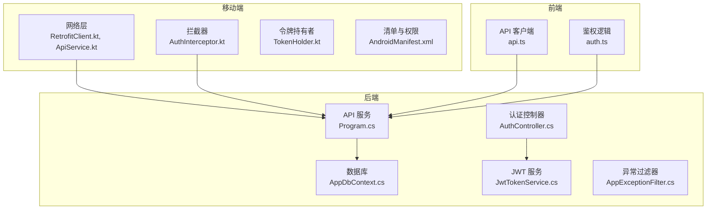
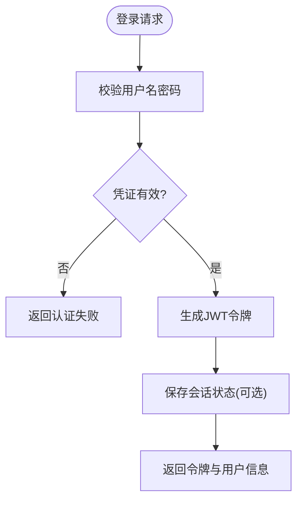
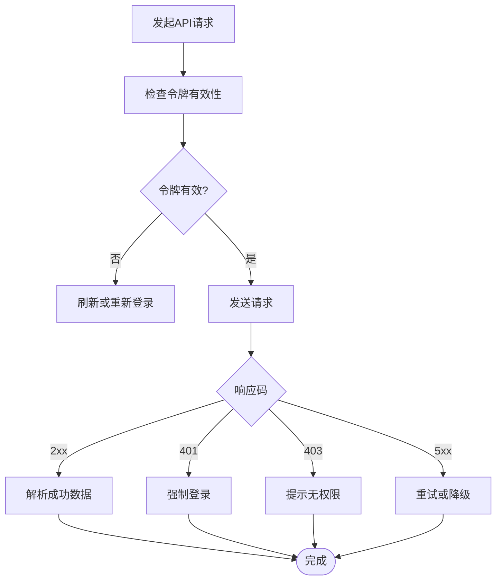
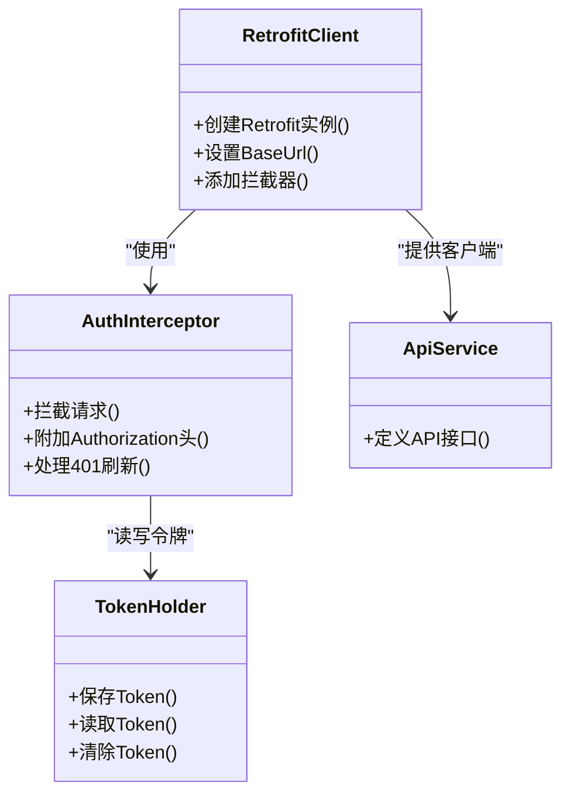
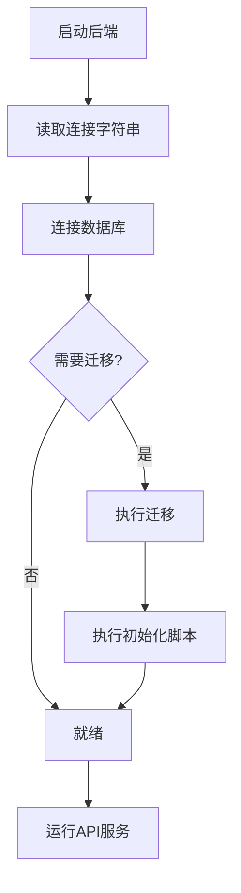
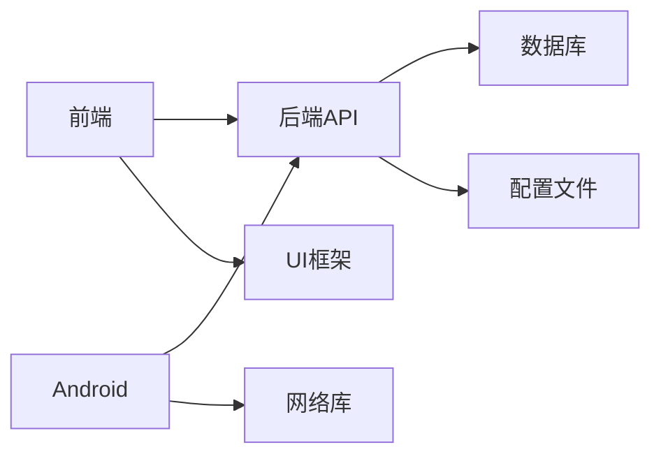

# 常见问题与故障排除

<cite>
**本文档引用的文件**   
- [Program.cs](file://dip-system/api/Program.cs)
- [appsettings.json](file://dip-system/api/appsettings.json)
- [AppDbContext.cs](file://dip-system/api/Data/AppDbContext.cs)
- [JwtTokenService.cs](file://dip-system/api/Services/JwtTokenService.cs)
- [AuthController.cs](file://dip-system/api/Controllers/AuthController.cs)
- [AppExceptionFilter.cs](file://dip-system/api/Controllers/AppExceptionFilter.cs)
- [ApiResponse.cs](file://dip-system/api/Models/ApiResponse.cs)
- [api.ts](file://dip-system/frontend-web/src/lib/api.ts)
- [auth.ts](file://dip-system/frontend-web/src/lib/auth.ts)
- [RetrofitClient.kt](file://mobile-android/app/src/main/java/com/dip/material/data/network/RetrofitClient.kt)
- [AuthInterceptor.kt](file://mobile-android/app/src/main/java/com/dip/material/data/network/AuthInterceptor.kt)
- [TokenHolder.kt](file://mobile-android/app/src/main/java/com/dip/material/data/network/TokenHolder.kt)
- [ApiService.kt](file://mobile-android/app/src/main/java/com/dip/material/data/network/ApiService.kt)
- [AndroidManifest.xml](file://mobile-android/app/src/main/AndroidManifest.xml)
- [build.gradle.kts](file://mobile-android/app/build.gradle.kts)
- [docker-compose.yml](file://dip-system/docker-compose.yml)
- [init-db.sql](file://scripts/init-db.sql)
</cite>

## 目录
1. [简介](#简介)
2. [项目结构](#项目结构)
3. [核心组件](#核心组件)
4. [架构总览](#架构总览)
5. [详细组件分析](#详细组件分析)
6. [依赖关系分析](#依赖关系分析)
7. [性能注意事项](#性能注意事项)
8. [故障排除指南](#故障排除指南)
9. [结论](#结论)
10. [附录](#附录)

## 简介
本指南面向DIP系统的开发与运维人员，聚焦于在本地开发、联调与部署过程中常见问题的快速定位与解决。内容覆盖：
- 环境问题：依赖安装失败、端口冲突、权限问题
- 后端问题：数据库连接错误、API调用失败、缓存配置、JWT认证异常
- 前端问题：模块加载失败、样式冲突、路由配置错误、跨域问题
- Android端问题：编译错误、模拟器连接、签名配置、设备兼容性
- 性能诊断：内存泄漏检测、CPU使用率分析、网络请求优化
- 日志分析与调试工具、错误监控配置
- 问题上报模板与社区支持渠道

## 项目结构
DIP系统由三大部分组成：
- 后端（ASP.NET Core）：提供REST API、JWT鉴权、数据访问与业务服务
- 前端（Web）：基于React/Vite/Tailwind的SPA，负责用户交互与API调用
- 移动端（Android/Kotlin）：基于Jetpack Compose与Retrofit，实现扫码、物料管理等现场作业



**图示来源** 
- [Program.cs](file://dip-system/api/Program.cs)
- [AppDbContext.cs](file://dip-system/api/Data/AppDbContext.cs)
- [JwtTokenService.cs](file://dip-system/api/Services/JwtTokenService.cs)
- [AuthController.cs](file://dip-system/api/Controllers/AuthController.cs)
- [AppExceptionFilter.cs](file://dip-system/api/Controllers/AppExceptionFilter.cs)
- [api.ts](file://dip-system/frontend-web/src/lib/api.ts)
- [auth.ts](file://dip-system/frontend-web/src/lib/auth.ts)
- [RetrofitClient.kt](file://mobile-android/app/src/main/java/com/dip/material/data/network/RetrofitClient.kt)
- [AuthInterceptor.kt](file://mobile-android/app/src/main/java/com/dip/material/data/network/AuthInterceptor.kt)
- [TokenHolder.kt](file://mobile-android/app/src/main/java/com/dip/material/data/network/TokenHolder.kt)
- [ApiService.kt](file://mobile-android/app/src/main/java/com/dip/material/data/network/ApiService.kt)
- [AndroidManifest.xml](file://mobile-android/app/src/main/AndroidManifest.xml)

**章节来源**
- [Program.cs](file://dip-system/api/Program.cs)
- [appsettings.json](file://dip-system/api/appsettings.json)
- [docker-compose.yml](file://dip-system/docker-compose.yml)

## 核心组件
- 后端服务启动与中间件注册：入口程序负责配置Kestrel、中间件管道、依赖注入、Swagger等
- 数据访问：Entity Framework上下文管理数据库连接与迁移
- 认证授权：JWT令牌签发与校验、控制器级鉴权
- 异常处理：全局异常过滤器统一错误响应格式
- 前端API封装：统一的HTTP客户端、错误处理、鉴权头注入
- 移动端网络栈：Retrofit客户端、认证拦截器、令牌持久化
- 容器编排：docker-compose统一管理数据库与后端服务

**章节来源**
- [Program.cs](file://dip-system/api/Program.cs)
- [AppDbContext.cs](file://dip-system/api/Data/AppDbContext.cs)
- [JwtTokenService.cs](file://dip-system/api/Services/JwtTokenService.cs)
- [AuthController.cs](file://dip-system/api/Controllers/AuthController.cs)
- [AppExceptionFilter.cs](file://dip-system/api/Controllers/AppExceptionFilter.cs)
- [ApiResponse.cs](file://dip-system/api/Models/ApiResponse.cs)
- [api.ts](file://dip-system/frontend-web/src/lib/api.ts)
- [auth.ts](file://dip-system/frontend-web/src/lib/auth.ts)
- [RetrofitClient.kt](file://mobile-android/app/src/main/java/com/dip/material/data/network/RetrofitClient.kt)
- [AuthInterceptor.kt](file://mobile-android/app/src/main/java/com/dip/material/data/network/AuthInterceptor.kt)
- [TokenHolder.kt](file://mobile-android/app/src/main/java/com/dip/material/data/network/TokenHolder.kt)
- [ApiService.kt](file://mobile-android/app/src/main/java/com/dip/material/data/network/ApiService.kt)
- [AndroidManifest.xml](file://mobile-android/app/src/main/AndroidManifest.xml)
- [docker-compose.yml](file://dip-system/docker-compose.yml)

## 架构总览
下图展示从前端/移动端到后端的数据流与鉴权流程，以及数据库访问路径。

```mermaid
sequenceDiagram
participant FE as "前端应用"
participant AND as "Android应用"
participant API as "后端API"
participant AUTH as "认证控制器"
participant JWT as "JWT服务"
participant DB as "数据库"
FE->>API : "发起受保护资源请求"
AND->>API : "发起受保护资源请求"
API->>AUTH : "验证JWT令牌"
AUTH->>JWT : "解析并校验令牌"
JWT-->>AUTH : "返回用户信息或错误"
AUTH-->>API : "鉴权结果"
API->>DB : "执行数据操作"
DB-->>API : "返回数据"
API-->>FE : "统一响应体"
API-->>AND : "统一响应体"
```

**图示来源** 
- [AuthController.cs](file://dip-system/api/Controllers/AuthController.cs)
- [JwtTokenService.cs](file://dip-system/api/Services/JwtTokenService.cs)
- [AppDbContext.cs](file://dip-system/api/Data/AppDbContext.cs)
- [api.ts](file://dip-system/frontend-web/src/lib/api.ts)
- [RetrofitClient.kt](file://mobile-android/app/src/main/java/com/dip/material/data/network/RetrofitClient.kt)

## 详细组件分析

### 后端认证与授权
- 登录接口生成JWT令牌，后续请求需携带Authorization头
- 全局异常过滤器将未捕获异常转换为统一响应格式
- 数据库连接字符串与密钥通过配置文件注入



**图示来源** 
- [AuthController.cs](file://dip-system/api/Controllers/AuthController.cs)
- [JwtTokenService.cs](file://dip-system/api/Services/JwtTokenService.cs)
- [ApiResponse.cs](file://dip-system/api/Models/ApiResponse.cs)

**章节来源**
- [AuthController.cs](file://dip-system/api/Controllers/AuthController.cs)
- [JwtTokenService.cs](file://dip-system/api/Services/JwtTokenService.cs)
- [AppExceptionFilter.cs](file://dip-system/api/Controllers/AppExceptionFilter.cs)
- [ApiResponse.cs](file://dip-system/api/Models/ApiResponse.cs)

### 前端API与鉴权
- 统一封装HTTP请求，自动附加Authorization头
- 处理401/403跳转登录或刷新令牌
- 错误提示与重试策略



**图示来源** 
- [api.ts](file://dip-system/frontend-web/src/lib/api.ts)
- [auth.ts](file://dip-system/frontend-web/src/lib/auth.ts)

**章节来源**
- [api.ts](file://dip-system/frontend-web/src/lib/api.ts)
- [auth.ts](file://dip-system/frontend-web/src/lib/auth.ts)

### 移动端网络与令牌管理
- Retrofit客户端集中配置基础URL、超时、序列化
- 认证拦截器自动附加令牌，处理过期刷新
- 令牌持久化与生命周期管理



**图示来源** 
- [RetrofitClient.kt](file://mobile-android/app/src/main/java/com/dip/material/data/network/RetrofitClient.kt)
- [AuthInterceptor.kt](file://mobile-android/app/src/main/java/com/dip/material/data/network/AuthInterceptor.kt)
- [TokenHolder.kt](file://mobile-android/app/src/main/java/com/dip/material/data/network/TokenHolder.kt)
- [ApiService.kt](file://mobile-android/app/src/main/java/com/dip/material/data/network/ApiService.kt)

**章节来源**
- [RetrofitClient.kt](file://mobile-android/app/src/main/java/com/dip/material/data/network/RetrofitClient.kt)
- [AuthInterceptor.kt](file://mobile-android/app/src/main/java/com/dip/material/data/network/AuthInterceptor.kt)
- [TokenHolder.kt](file://mobile-android/app/src/main/java/com/dip/material/data/network/TokenHolder.kt)
- [ApiService.kt](file://mobile-android/app/src/main/java/com/dip/material/data/network/ApiService.kt)

### 数据库与初始化
- EF上下文管理连接字符串与迁移
- docker-compose编排数据库服务
- 初始化脚本用于首次建库与种子数据



**图示来源** 
- [AppDbContext.cs](file://dip-system/api/Data/AppDbContext.cs)
- [docker-compose.yml](file://dip-system/docker-compose.yml)
- [init-db.sql](file://scripts/init-db.sql)

**章节来源**
- [AppDbContext.cs](file://dip-system/api/Data/AppDbContext.cs)
- [docker-compose.yml](file://dip-system/docker-compose.yml)
- [init-db.sql](file://scripts/init-db.sql)

## 依赖关系分析
- 后端依赖：EF Core、JWT、中间件（CORS、认证、异常处理）、配置系统
- 前端依赖：Vite、Tailwind、React生态、HTTP客户端
- 移动端依赖：Kotlin、Compose、Retrofit、OkHttp、权限管理
- 外部依赖：数据库服务（容器化）、可能的缓存与消息队列



**图示来源** 
- [Program.cs](file://dip-system/api/Program.cs)
- [appsettings.json](file://dip-system/api/appsettings.json)
- [android build.gradle.kts](file://mobile-android/app/build.gradle.kts)

**章节来源**
- [Program.cs](file://dip-system/api/Program.cs)
- [appsettings.json](file://dip-system/api/appsettings.json)
- [build.gradle.kts](file://mobile-android/app/build.gradle.kts)

## 性能注意事项
- 后端
  - 启用响应缓存与查询优化，避免N+1查询
  - 合理设置线程池与连接池大小
  - 使用异步I/O减少阻塞
- 前端
  - 代码分割与懒加载，减少首屏体积
  - 防抖与节流优化高频操作
  - 合理使用浏览器缓存与HTTP缓存头
- 移动端
  - 图片压缩与缓存策略
  - 网络请求批处理与重试退避
  - 后台任务调度与电池优化

[本节为通用指导，不直接分析具体文件]

## 故障排除指南

### 环境问题排查
- 依赖安装失败
  - 检查Node.js/Gradle/.NET SDK版本与仓库镜像
  - 清理缓存后重新安装依赖
  - 查看构建日志中的包管理器输出
- 端口冲突
  - 确认后端默认端口未被占用
  - 修改监听端口或停止冲突进程
  - 检查容器端口映射是否重复
- 权限问题
  - 确保对配置文件与数据目录有读写权限
  - 以管理员身份运行必要命令
  - 检查SELinux/防火墙规则

**章节来源**
- [docker-compose.yml](file://dip-system/docker-compose.yml)
- [build.gradle.kts](file://mobile-android/app/build.gradle.kts)

### 后端常见问题
- 数据库连接错误
  - 核对连接字符串、主机名、端口、凭据
  - 检查数据库服务是否启动且可访问
  - 确认EF迁移已执行且表结构一致
- API调用失败
  - 检查请求方法与路径是否正确
  - 查看统一响应体中的错误信息
  - 确认CORS与中间件顺序
- 缓存配置问题
  - 检查缓存服务连接与键空间隔离
  - 验证序列化策略与过期时间
  - 监控缓存命中率与内存占用
- JWT认证异常
  - 确认令牌签发算法与密钥一致
  - 检查过期时间与刷新机制
  - 验证Authorization头格式与大小写

**章节来源**
- [AppDbContext.cs](file://dip-system/api/Data/AppDbContext.cs)
- [ApiResponse.cs](file://dip-system/api/Models/ApiResponse.cs)
- [JwtTokenService.cs](file://dip-system/api/Services/JwtTokenService.cs)
- [AuthController.cs](file://dip-system/api/Controllers/AuthController.cs)
- [AppExceptionFilter.cs](file://dip-system/api/Controllers/AppExceptionFilter.cs)

### 前端常见问题
- 模块加载失败
  - 检查Vite构建产物与路径
  - 确认静态资源CDN或相对路径正确
  - 查看控制台网络请求与报错
- 样式冲突
  - 排查Tailwind与第三方库样式优先级
  - 使用开发者工具检查CSS选择器作用域
  - 避免全局样式污染
- 路由配置错误
  - 核对路由定义与页面组件映射
  - 检查动态路由参数与守卫逻辑
  - 确认历史模式与服务器重定向
- API跨域问题
  - 后端开启CORS并允许前端域名与头
  - 预检请求OPTIONS响应正确
  - 检查Cookie与凭证传递策略

**章节来源**
- [api.ts](file://dip-system/frontend-web/src/lib/api.ts)
- [auth.ts](file://dip-system/frontend-web/src/lib/auth.ts)

### Android端常见问题
- 编译错误
  - 检查Kotlin与AGP版本兼容
  - 清理构建缓存并重建
  - 查看Gradle日志中的依赖冲突
- 模拟器连接问题
  - 确认ADB服务与模拟器状态
  - 重启ADB与模拟器
  - 检查USB调试与网络调试配置
- 签名配置错误
  - 核对keystore路径、别名与密码
  - 区分debug与release签名
  - 验证签名校验与混淆规则
- 设备兼容性
  - 检查最小SDK与目标SDK
  - 适配不同屏幕密度与分辨率
  - 测试权限申请与运行时行为

**章节来源**
- [AndroidManifest.xml](file://mobile-android/app/src/main/AndroidManifest.xml)
- [build.gradle.kts](file://mobile-android/app/build.gradle.kts)
- [RetrofitClient.kt](file://mobile-android/app/src/main/java/com/dip/material/data/network/RetrofitClient.kt)
- [AuthInterceptor.kt](file://mobile-android/app/src/main/java/com/dip/material/data/network/AuthInterceptor.kt)
- [TokenHolder.kt](file://mobile-android/app/src/main/java/com/dip/material/data/network/TokenHolder.kt)

### 性能问题诊断方法
- 内存泄漏检测
  - 后端：使用内存快照与GC分析
  - 前端：Chrome DevTools Memory面板
  - 移动端：Android Profiler与LeakCanary
- CPU使用率分析
  - 后端：性能计数器与Profiling
  - 前端：Performance与Coverage面板
  - 移动端：CPU Profiler与热点函数定位
- 网络请求优化
  - 合并请求与批量提交
  - 启用GZIP/HTTP缓存
  - 合理超时与重试策略

[本节为通用指导，不直接分析具体文件]

### 日志分析方法与调试工具
- 后端日志
  - 启用结构化日志与分级输出
  - 聚合到日志平台进行检索与分析
  - 关键路径打点与耗时统计
- 前端调试
  - 使用Network与Console面板
  - 断点调试与变量监视
  - 错误上报与堆栈还原
- 移动端调试
  - Logcat过滤与标签分类
  - 网络抓包与请求回放
  - 崩溃堆栈与ANR分析

**章节来源**
- [AppExceptionFilter.cs](file://dip-system/api/Controllers/AppExceptionFilter.cs)
- [api.ts](file://dip-system/frontend-web/src/lib/api.ts)
- [AuthInterceptor.kt](file://mobile-android/app/src/main/java/com/dip/material/data/network/AuthInterceptor.kt)

### 错误监控配置
- 后端
  - 集成错误监控SDK，采集异常与上下文
  - 设置告警阈值与通知渠道
  - 追踪分布式请求链路
- 前端
  - 接入错误上报，捕获未处理异常
  - 记录用户行为与页面状态
  - 可视化错误分布与趋势
- 移动端
  - 集成崩溃收集与热修复方案
  - 上报设备信息与复现步骤
  - 监控性能指标与用户体验

**章节来源**
- [ApiResponse.cs](file://dip-system/api/Models/ApiResponse.cs)
- [api.ts](file://dip-system/frontend-web/src/lib/api.ts)
- [TokenHolder.kt](file://mobile-android/app/src/main/java/com/dip/material/data/network/TokenHolder.kt)

### 问题上报模板与社区支持
- 问题上报模板
  - 环境信息：操作系统、运行时版本、依赖版本
  - 复现步骤：清晰描述触发条件与预期结果
  - 日志与截图：包含关键日志片段与界面截图
  - 期望与影响：说明期望行为与业务影响
- 社区支持渠道
  - 内部知识库与FAQ
  - 技术支持工单与即时通讯群组
  - 贡献指南与Issue模板

[本节为通用指导，不直接分析具体文件]

## 结论
通过系统化梳理环境与前后端常见问题、建立标准化的排查流程与监控体系，可显著提升DIP系统的稳定性与可维护性。建议团队在日常开发中遵循本指南的最佳实践，持续完善日志与错误监控，形成闭环的问题治理机制。

[本节为总结性内容，不直接分析具体文件]

## 附录
- 常用命令与脚本
  - 后端启动与迁移命令
  - 前端构建与预览命令
  - 移动端构建与调试命令
- 参考文档链接
  - 官方文档与最佳实践
  - 第三方库使用说明
  - 安全与合规要求

[本节为补充信息，不直接分析具体文件]