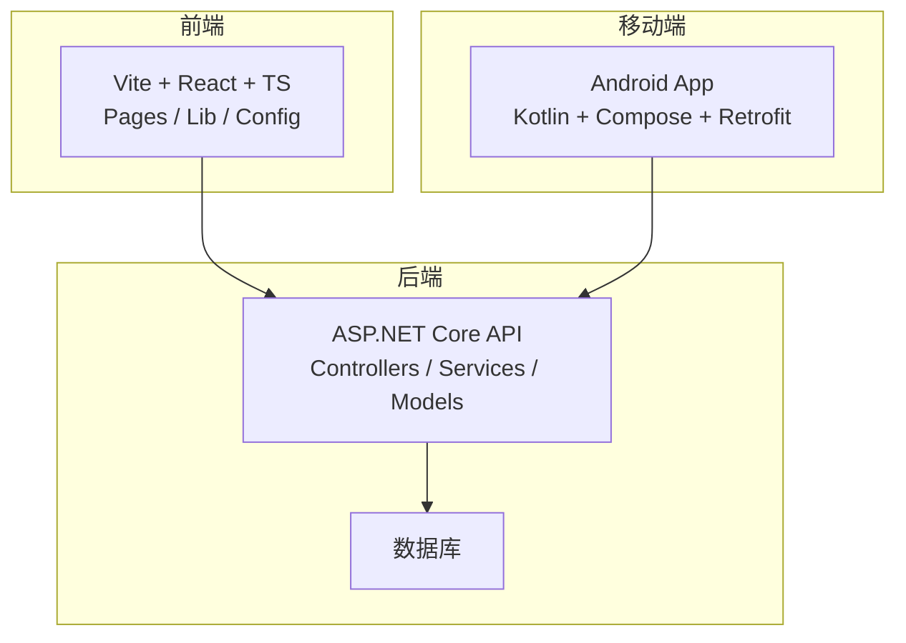
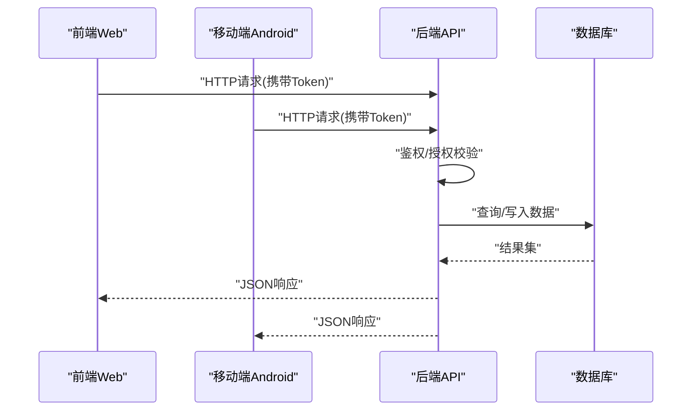
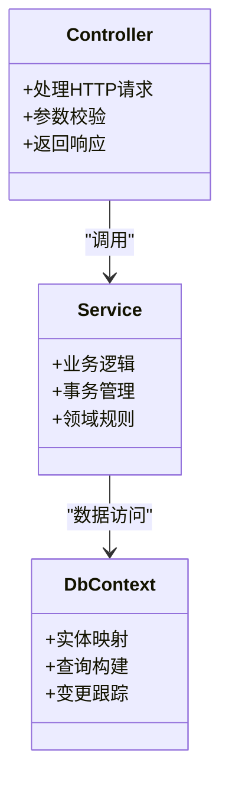
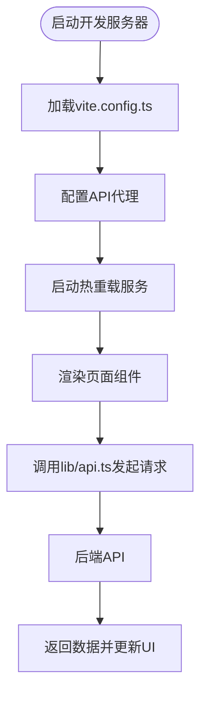
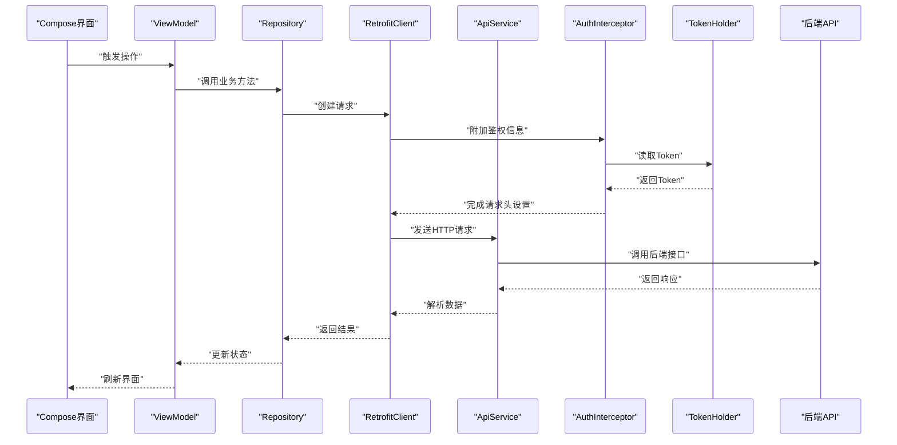
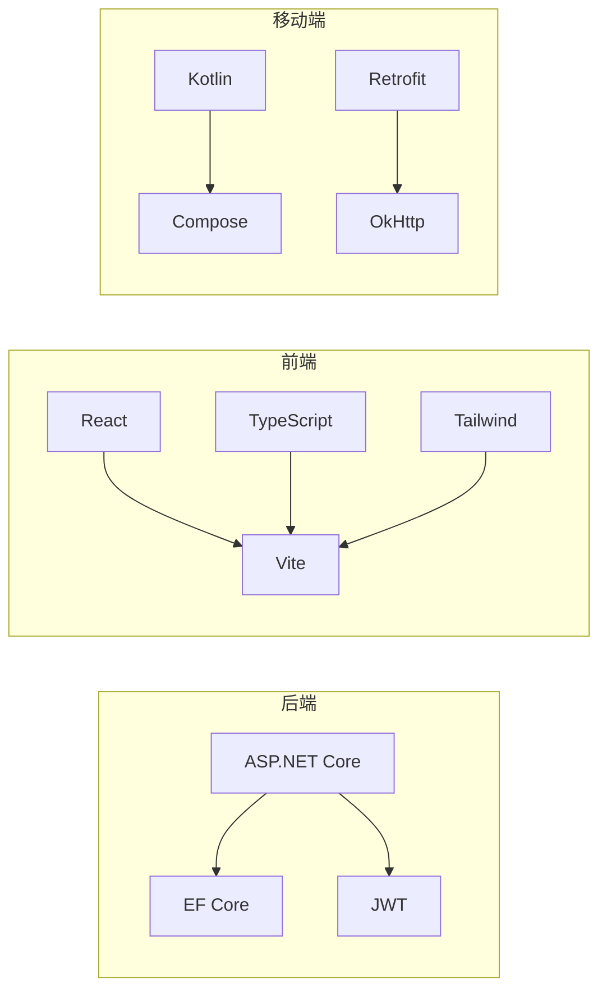

# 开发指南

<cite>
**本文引用的文件**   
- [Program.cs](file://dip-system/api/Program.cs)
- [appsettings.json](file://dip-system/api/appsettings.json)
- [AppDbContext.cs](file://dip-system/api/Data/AppDbContext.cs)
- [DIP.Api.csproj](file://dip-system/api/DIP.Api.csproj)
- [package.json](file://dip-system/frontend-web/package.json)
- [vite.config.ts](file://dip-system/frontend-web/vite.config.ts)
- [tsconfig.json](file://dip-system/frontend-web/tsconfig.json)
- [tailwind.config.js](file://dip-system/frontend-web/tailwind.config.js)
- [postcss.config.js](file://dip-system/frontend-web/postcss.config.js)
- [docker-compose.yml](file://dip-system/docker-compose.yml)
- [init-db.sql](file://scripts/init-db.sql)
- [ApiService.kt](file://mobile-android/app/src/main/java/com/dip/material/data/network/ApiService.kt)
- [RetrofitClient.kt](file://mobile-android/app/src/main/java/com/dip/material/data/network/RetrofitClient.kt)
- [AuthInterceptor.kt](file://mobile-android/app/src/main/java/com/dip/material/data/network/AuthInterceptor.kt)
- [TokenHolder.kt](file://mobile-android/app/src/main/java/com/dip/material/data/network/TokenHolder.kt)
- [build.gradle.kts](file://mobile-android/app/build.gradle.kts)
- [gradle.properties](file://mobile-android/gradle.properties)
- [local.properties](file://mobile-android/local.properties)
</cite>

## 目录
1. [简介](#简介)
2. [项目结构](#项目结构)
3. [核心组件](#核心组件)
4. [架构总览](#架构总览)
5. [详细组件分析](#详细组件分析)
6. [依赖分析](#依赖分析)
7. [性能考虑](#性能考虑)
8. [故障排查指南](#故障排查指南)
9. [结论](#结论)
10. [附录](#附录)

## 简介
本指南面向DIP系统的开发者，覆盖从环境搭建、代码规范、构建与调试，到Git工作流、测试策略、性能分析与质量检查的完整流程。系统包含：
- 后端API（ASP.NET Core）
- 前端Web（Vite + React + TypeScript + Tailwind）
- 移动端Android（Kotlin + Jetpack Compose + Retrofit）
- 数据库初始化脚本与容器编排

目标是帮助团队快速上手、稳定协作、持续交付高质量产品。

## 项目结构
仓库采用多模块组织，前后端分离，移动端独立工程，统一通过API交互。关键目录说明：
- dip-system/api：后端API服务，控制器、服务层、数据模型、上下文与配置
- dip-system/frontend-web：前端Web应用，页面、路由、API封装、样式与构建配置
- mobile-android：Android移动应用，网络层、UI界面、扫描与工具类
- scripts：数据库初始化脚本
- docker-compose.yml：本地容器编排（如数据库等）

**图表来源** 
- [Program.cs](file://dip-system/api/Program.cs)
- [appsettings.json](file://dip-system/api/appsettings.json)
- [package.json](file://dip-system/frontend-web/package.json)
- [vite.config.ts](file://dip-system/frontend-web/vite.config.ts)
- [ApiService.kt](file://mobile-android/app/src/main/java/com/dip/material/data/network/ApiService.kt)
- [RetrofitClient.kt](file://mobile-android/app/src/main/java/com/dip/material/data/network/RetrofitClient.kt)

**章节来源**
- [Program.cs](file://dip-system/api/Program.cs)
- [appsettings.json](file://dip-system/api/appsettings.json)
- [package.json](file://dip-system/frontend-web/package.json)
- [vite.config.ts](file://dip-system/frontend-web/vite.config.ts)
- [ApiService.kt](file://mobile-android/app/src/main/java/com/dip/material/data/network/ApiService.kt)
- [RetrofitClient.kt](file://mobile-android/app/src/main/java/com/dip/material/data/network/RetrofitClient.kt)

## 核心组件
- 后端API
  - Program.cs：应用启动、中间件注册、依赖注入、端口与CORS配置
  - appsettings.json：连接字符串、日志级别、JWT密钥等运行配置
  - AppDbContext.cs：EF Core上下文，实体映射与迁移管理
  - Controllers/Services/Models：分层架构，业务逻辑与数据模型清晰分离
- 前端Web
  - package.json：依赖与脚本定义（构建、开发、打包）
  - vite.config.ts：开发服务器、代理、构建优化
  - tsconfig.json：TypeScript编译选项
  - tailwind.config.js / postcss.config.js：样式与CSS处理
- 移动端Android
  - ApiService.kt：Retrofit接口定义
  - RetrofitClient.kt：客户端初始化、超时、拦截器链
  - AuthInterceptor.kt：鉴权拦截器（附加Token）
  - TokenHolder.kt：Token存储与获取
  - build.gradle.kts：模块依赖与构建配置
  - gradle.properties / local.properties：Gradle与SDK路径配置

**章节来源**
- [Program.cs](file://dip-system/api/Program.cs)
- [appsettings.json](file://dip-system/api/appsettings.json)
- [AppDbContext.cs](file://dip-system/api/Data/AppDbContext.cs)
- [DIP.Api.csproj](file://dip-system/api/DIP.Api.csproj)
- [package.json](file://dip-system/frontend-web/package.json)
- [vite.config.ts](file://dip-system/frontend-web/vite.config.ts)
- [tsconfig.json](file://dip-system/frontend-web/tsconfig.json)
- [tailwind.config.js](file://dip-system/frontend-web/tailwind.config.js)
- [postcss.config.js](file://dip-system/frontend-web/postcss.config.js)
- [ApiService.kt](file://mobile-android/app/src/main/java/com/dip/material/data/network/ApiService.kt)
- [RetrofitClient.kt](file://mobile-android/app/src/main/java/com/dip/material/data/network/RetrofitClient.kt)
- [AuthInterceptor.kt](file://mobile-android/app/src/main/java/com/dip/material/data/network/AuthInterceptor.kt)
- [TokenHolder.kt](file://mobile-android/app/src/main/java/com/dip/material/data/network/TokenHolder.kt)
- [build.gradle.kts](file://mobile-android/app/build.gradle.kts)
- [gradle.properties](file://mobile-android/gradle.properties)
- [local.properties](file://mobile-android/local.properties)

## 架构总览
系统采用前后端分离与移动端并行的架构，统一通过REST API进行通信。后端使用ASP.NET Core提供业务接口，前端与移动端分别调用同一套API。数据库由EF Core管理，支持迁移与初始化脚本。

**图表来源** 
- [Program.cs](file://dip-system/api/Program.cs)
- [appsettings.json](file://dip-system/api/appsettings.json)
- [ApiService.kt](file://mobile-android/app/src/main/java/com/dip/material/data/network/ApiService.kt)
- [RetrofitClient.kt](file://mobile-android/app/src/main/java/com/dip/material/data/network/RetrofitClient.kt)
- [AuthInterceptor.kt](file://mobile-android/app/src/main/java/com/dip/material/data/network/AuthInterceptor.kt)
- [TokenHolder.kt](file://mobile-android/app/src/main/java/com/dip/material/data/network/TokenHolder.kt)

## 详细组件分析

### 后端API组件分析
- 启动与中间件
  - Program.cs负责应用生命周期、中间件注册（认证、异常处理、静态资源）、依赖注入与端口绑定
- 配置管理
  - appsettings.json集中管理连接字符串、日志、JWT等；可通过环境变量或配置文件覆盖
- 数据访问
  - AppDbContext.cs定义实体关系与查询能力；配合EF Core迁移进行数据库版本管理
- 分层设计
  - Controllers仅处理HTTP请求与响应；Services承载业务逻辑；Models定义数据结构与约束

**图表来源** 
- [Program.cs](file://dip-system/api/Program.cs)
- [AppDbContext.cs](file://dip-system/api/Data/AppDbContext.cs)

**章节来源**
- [Program.cs](file://dip-system/api/Program.cs)
- [appsettings.json](file://dip-system/api/appsettings.json)
- [AppDbContext.cs](file://dip-system/api/Data/AppDbContext.cs)
- [DIP.Api.csproj](file://dip-system/api/DIP.Api.csproj)

### 前端Web组件分析
- 构建与开发
  - package.json定义脚本命令（开发、构建、预览）
  - vite.config.ts配置开发服务器、代理转发、构建优化（分包、压缩）
- 类型与样式
  - tsconfig.json控制TS编译行为
  - tailwind.config.js与postcss.config.js管理样式生成与插件
- 页面与API封装
  - pages目录按功能划分页面组件
  - lib/api.ts封装HTTP请求、错误处理与Token注入

**图表来源** 
- [package.json](file://dip-system/frontend-web/package.json)
- [vite.config.ts](file://dip-system/frontend-web/vite.config.ts)
- [tsconfig.json](file://dip-system/frontend-web/tsconfig.json)
- [tailwind.config.js](file://dip-system/frontend-web/tailwind.config.js)
- [postcss.config.js](file://dip-system/frontend-web/postcss.config.js)

**章节来源**
- [package.json](file://dip-system/frontend-web/package.json)
- [vite.config.ts](file://dip-system/frontend-web/vite.config.ts)
- [tsconfig.json](file://dip-system/frontend-web/tsconfig.json)
- [tailwind.config.js](file://dip-system/frontend-web/tailwind.config.js)
- [postcss.config.js](file://dip-system/frontend-web/postcss.config.js)

### 移动端Android组件分析
- 网络层
  - ApiService.kt定义API接口方法
  - RetrofitClient.kt初始化Retrofit实例、设置超时与基础URL
  - AuthInterceptor.kt在请求头中附加Token
  - TokenHolder.kt管理Token的存取
- 构建与配置
  - build.gradle.kts声明依赖与构建任务
  - gradle.properties与local.properties配置Gradle与Android SDK路径

**图表来源** 
- [ApiService.kt](file://mobile-android/app/src/main/java/com/dip/material/data/network/ApiService.kt)
- [RetrofitClient.kt](file://mobile-android/app/src/main/java/com/dip/material/data/network/RetrofitClient.kt)
- [AuthInterceptor.kt](file://mobile-android/app/src/main/java/com/dip/material/data/network/AuthInterceptor.kt)
- [TokenHolder.kt](file://mobile-android/app/src/main/java/com/dip/material/data/network/TokenHolder.kt)

**章节来源**
- [ApiService.kt](file://mobile-android/app/src/main/java/com/dip/material/data/network/ApiService.kt)
- [RetrofitClient.kt](file://mobile-android/app/src/main/java/com/dip/material/data/network/RetrofitClient.kt)
- [AuthInterceptor.kt](file://mobile-android/app/src/main/java/com/dip/material/data/network/AuthInterceptor.kt)
- [TokenHolder.kt](file://mobile-android/app/src/main/java/com/dip/material/data/network/TokenHolder.kt)
- [build.gradle.kts](file://mobile-android/app/build.gradle.kts)
- [gradle.properties](file://mobile-android/gradle.properties)
- [local.properties](file://mobile-android/local.properties)

## 依赖分析
- 后端依赖
  - ASP.NET Core运行时与框架包
  - EF Core与数据库驱动
  - JWT鉴权库
- 前端依赖
  - React、TypeScript、Vite、Tailwind CSS、PostCSS
- 移动端依赖
  - Kotlin、Jetpack Compose、Retrofit、OkHttp、Coroutines

**图表来源** 
- [DIP.Api.csproj](file://dip-system/api/DIP.Api.csproj)
- [package.json](file://dip-system/frontend-web/package.json)
- [build.gradle.kts](file://mobile-android/app/build.gradle.kts)

**章节来源**
- [DIP.Api.csproj](file://dip-system/api/DIP.Api.csproj)
- [package.json](file://dip-system/frontend-web/package.json)
- [build.gradle.kts](file://mobile-android/app/build.gradle.kts)

## 性能考虑
- 后端
  - 启用响应缓存与异步I/O
  - 合理分页与投影查询，避免N+1问题
  - 使用内存缓存（IMemoryCache）减少重复计算
- 前端
  - 代码分割与懒加载
  - 图片与静态资源压缩
  - 防抖与节流优化频繁请求
- 移动端
  - OkHttp连接池与超时调优
  - 协程并发控制与取消机制
  - 图片加载与缓存策略

[本节为通用指导，不直接分析具体文件]

## 故障排查指南
- 后端
  - 检查appsettings.json中的连接字符串与日志级别
  - 查看Program.cs中间件顺序与异常处理
  - 使用EF Core迁移命令验证数据库状态
- 前端
  - 确认vite.config.ts代理配置正确指向后端
  - 检查浏览器控制台网络请求与跨域问题
  - 清理node_modules后重新安装依赖
- 移动端
  - 核对RetrofitClient的基础URL与超时设置
  - 检查AuthInterceptor是否正确附加Token
  - 查看local.properties中SDK路径是否有效

**章节来源**
- [appsettings.json](file://dip-system/api/appsettings.json)
- [Program.cs](file://dip-system/api/Program.cs)
- [vite.config.ts](file://dip-system/frontend-web/vite.config.ts)
- [RetrofitClient.kt](file://mobile-android/app/src/main/java/com/dip/material/data/network/RetrofitClient.kt)
- [AuthInterceptor.kt](file://mobile-android/app/src/main/java/com/dip/material/data/network/AuthInterceptor.kt)
- [local.properties](file://mobile-android/local.properties)

## 结论
本指南提供了DIP系统从环境搭建到团队协作的全流程说明。遵循本文档的规范与实践，可显著提升开发效率与代码质量。建议团队结合CI/CD流水线自动化构建、测试与部署，确保一致性与稳定性。

[本节为总结性内容，不直接分析具体文件]

## 附录

### 开发环境搭建
- 后端
  - 安装.NET SDK与IDE（Visual Studio或VS Code）
  - 克隆仓库，恢复NuGet包
  - 配置appsettings.json中的数据库连接
  - 执行EF Core迁移以初始化数据库
- 前端
  - 安装Node.js与包管理器（npm/yarn）
  - 进入frontend-web目录，安装依赖
  - 启动开发服务器，配置代理至后端
- 移动端
  - 安装Android Studio与JDK
  - 配置local.properties中的SDK路径
  - 同步Gradle并运行应用

**章节来源**
- [appsettings.json](file://dip-system/api/appsettings.json)
- [package.json](file://dip-system/frontend-web/package.json)
- [vite.config.ts](file://dip-system/frontend-web/vite.config.ts)
- [local.properties](file://mobile-android/local.properties)

### 代码规范与命名约定
- 后端
  - 控制器与方法采用PascalCase，动词开头
  - 模型属性使用CamelCase序列化
  - 错误码与消息统一在ApiResponse中返回
- 前端
  - 组件与文件使用PascalCase，函数与变量使用camelCase
  - 常量使用UPPER_SNAKE_CASE
  - 样式类名遵循Tailwind命名规范
- 移动端
  - Kotlin类与对象使用PascalCase，函数与属性使用camelCase
  - 常量使用const val并大写
  - 资源文件使用小写下划线命名

[本节为通用规范，不直接分析具体文件]

### 构建流程与热重载
- 后端
  - dotnet run启动开发模式，支持热重载
  - dotnet build进行编译检查
- 前端
  - npm run dev启动Vite开发服务器，支持热更新
  - npm run build生成生产包
- 移动端
  - ./gradlew assembleDebug构建调试包
  - ./gradlew assembleRelease构建发布包

**章节来源**
- [package.json](file://dip-system/frontend-web/package.json)
- [vite.config.ts](file://dip-system/frontend-web/vite.config.ts)
- [build.gradle.kts](file://mobile-android/app/build.gradle.kts)

### Git工作流与分支管理
- 主分支保护
  - main/master为稳定分支，禁止直接推送
- 分支策略
  - feature/*用于新功能开发
  - fix/*用于缺陷修复
  - release/*用于发布准备
- 提交规范
  - 使用语义化提交信息（feat、fix、docs等）
- 代码审查
  - 所有变更需通过Pull Request
  - 至少一名Reviewer批准后方可合并

[本节为通用流程，不直接分析具体文件]

### 测试策略
- 单元测试
  - 后端使用xUnit/NUnit编写服务层测试
  - 前端使用Jest/Vitest测试组件与工具函数
  - 移动端使用JUnit/Jupiter进行Kotlin测试
- 集成测试
  - 使用Testcontainers或内存数据库模拟后端依赖
  - 前端Mock API响应进行端到端测试
- 测试数据
  - 使用工厂方法与种子数据初始化测试环境

[本节为通用策略，不直接分析具体文件]

### 性能分析与代码质量
- 性能分析
  - 后端使用dotnet-trace与Application Insights
  - 前端使用Chrome DevTools与Lighthouse
  - 移动端使用Android Profiler与Perfetto
- 代码质量
  - 后端启用Roslyn Analyzers与SonarQube
  - 前端使用ESLint与Prettier
  - 移动端使用Detekt与Ktlint

[本节为通用工具，不直接分析具体文件]

### 常见问题解决方案
- 数据库连接失败
  - 检查连接字符串格式与权限
  - 确认防火墙与网络可达
- 前端代理无效
  - 验证vite.config.ts中的代理目标地址
  - 检查后端服务是否正常运行
- 移动端Token过期
  - 实现自动刷新Token机制
  - 处理401未授权响应并重试

**章节来源**
- [appsettings.json](file://dip-system/api/appsettings.json)
- [vite.config.ts](file://dip-system/frontend-web/vite.config.ts)
- [AuthInterceptor.kt](file://mobile-android/app/src/main/java/com/dip/material/data/network/AuthInterceptor.kt)
- [TokenHolder.kt](file://mobile-android/app/src/main/java/com/dip/material/data/network/TokenHolder.kt)

### 团队协作最佳实践
- 文档先行
  - 需求与设计文档在编码前完成评审
- 持续集成
  - 自动化构建、测试与代码质量检查
- 知识共享
  - 定期技术分享与代码走查
- 版本管理
  - 使用语义化版本控制（SemVer）

[本节为通用实践，不直接分析具体文件]