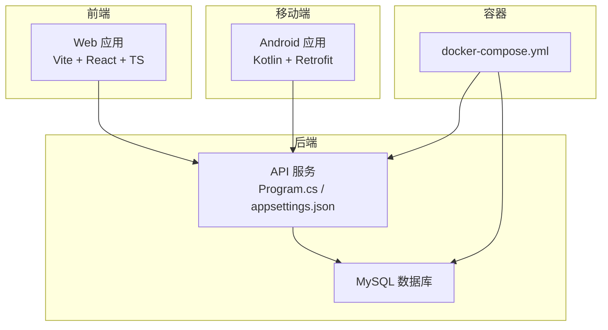
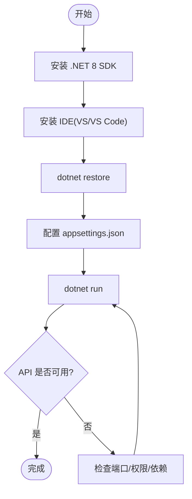
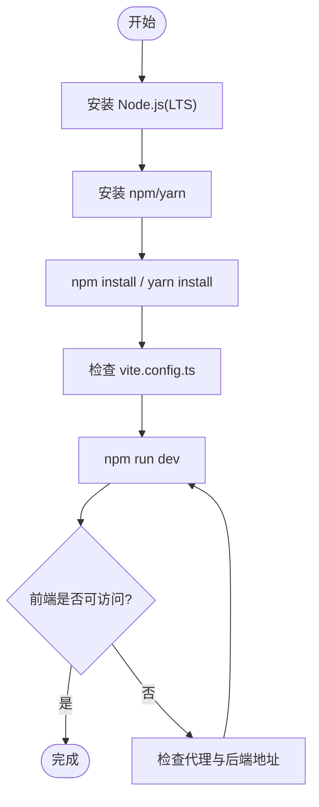
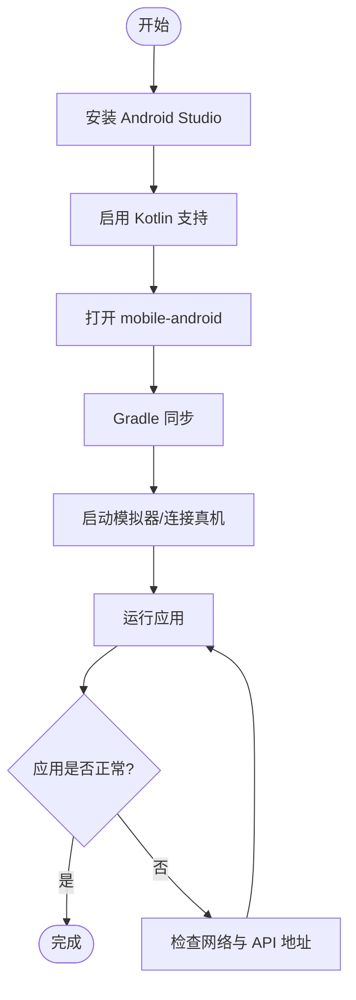
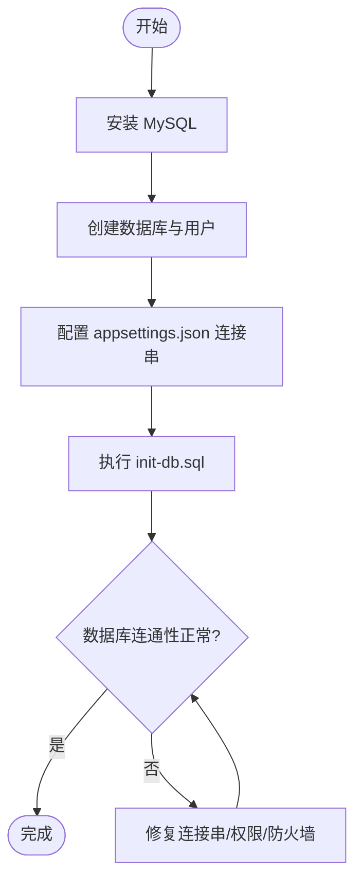
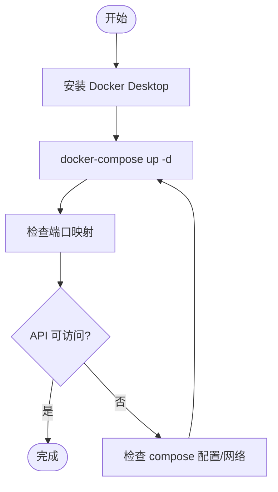
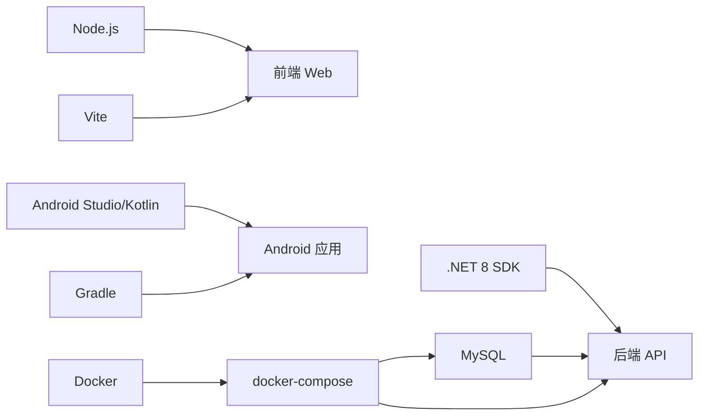

# 开发环境搭建

<cite>
**本文引用的文件**   
- [Program.cs](file://dip-system/api/Program.cs)
- [appsettings.json](file://dip-system/api/appsettings.json)
- [DIP.Api.csproj](file://dip-system/api/DIP.Api.csproj)
- [docker-compose.yml](file://dip-system/docker-compose.yml)
- [package.json](file://dip-system/frontend-web/package.json)
- [vite.config.ts](file://dip-system/frontend-web/vite.config.ts)
- [tsconfig.json](file://dip-system/frontend-web/tsconfig.json)
- [build.gradle.kts](file://mobile-android/build.gradle.kts)
- [gradle.properties](file://mobile-android/gradle.properties)
- [local.properties](file://mobile-android/local.properties)
- [init-db.sql](file://scripts/init-db.sql)
</cite>

## 目录
1. [简介](#简介)
2. [项目结构](#项目结构)
3. [核心组件](#核心组件)
4. [架构总览](#架构总览)
5. [详细组件分析](#详细组件分析)
6. [依赖关系分析](#依赖关系分析)
7. [性能考虑](#性能考虑)
8. [故障排除指南](#故障排除指南)
9. [结论](#结论)
10. [附录](#附录)

## 简介
本指南面向首次接入 DIP 系统的开发者，提供从零到可运行的完整环境搭建说明。内容覆盖：
- .NET 8 后端（ASP.NET Core）安装与配置、IDE 设置、SDK 版本要求、NuGet 包管理
- 前端 React + TypeScript + Vite 环境搭建，Node.js 版本、npm/yarn 配置、构建工具设置
- Android 开发环境（Android Studio、Kotlin、Gradle、模拟器）
- 数据库准备（MySQL 安装、连接配置、初始数据导入）
- Docker 容器化开发环境一键启动
- 常见问题排查与解决方案

## 项目结构
DIP 系统采用前后端分离与移动端并行的多仓库式结构：
- 后端 API：位于 dip-system/api，基于 ASP.NET Core 8，使用 Entity Framework 与 MySQL
- 前端 Web：位于 dip-system/frontend-web，基于 React + TypeScript + Vite
- 移动端 Android：位于 mobile-android，基于 Kotlin + Jetpack Compose + Retrofit
- 脚本与初始化：scripts/init-db.sql 用于数据库初始化
- 容器编排：dip-system/docker-compose.yml 统一编排后端、数据库等



**图表来源** 
- [Program.cs](file://dip-system/api/Program.cs)
- [appsettings.json](file://dip-system/api/appsettings.json)
- [docker-compose.yml](file://dip-system/docker-compose.yml)

**章节来源**
- [Program.cs](file://dip-system/api/Program.cs)
- [appsettings.json](file://dip-system/api/appsettings.json)
- [docker-compose.yml](file://dip-system/docker-compose.yml)

## 核心组件
- 后端 API：ASP.NET Core 8 应用，通过 Program.cs 启动，读取 appsettings.json 配置，使用 EF Core 访问 MySQL
- 前端 Web：React + TypeScript + Vite，package.json 定义依赖与脚本，vite.config.ts 配置代理与构建
- 移动端 Android：Kotlin 工程，Gradle 构建，Retrofit 调用后端 API
- 数据库：MySQL，使用 init-db.sql 初始化基础数据
- 容器化：docker-compose.yml 统一管理后端与数据库

**章节来源**
- [DIP.Api.csproj](file://dip-system/api/DIP.Api.csproj)
- [package.json](file://dip-system/frontend-web/package.json)
- [vite.config.ts](file://dip-system/frontend-web/vite.config.ts)
- [build.gradle.kts](file://mobile-android/build.gradle.kts)
- [init-db.sql](file://scripts/init-db.sql)

## 架构总览
下图展示本地开发时各组件的交互关系：前端与移动端通过 HTTP 调用后端 API，后端通过 EF Core 访问 MySQL；所有服务可通过 docker-compose 一键启动。

```mermaid
sequenceDiagram
participant Dev as "开发者"
participant FE as "前端 Web"
participant AND as "Android 应用"
participant API as "后端 API"
participant DB as "MySQL"
Dev->>FE : 启动开发服务器
Dev->>AND : 运行模拟器或真机调试
Dev->>API : 启动 API 服务
Dev->>DB : 启动数据库(可选)
FE->>API : HTTP 请求(REST API)
AND->>API : HTTP 请求(Retrofit)
API->>DB : EF Core 查询/写入
DB-->>API : 返回数据
API-->>FE : JSON 响应
API-->>AND : JSON 响应
```

**图表来源** 
- [Program.cs](file://dip-system/api/Program.cs)
- [appsettings.json](file://dip-system/api/appsettings.json)
- [vite.config.ts](file://dip-system/frontend-web/vite.config.ts)
- [build.gradle.kts](file://mobile-android/build.gradle.kts)

## 详细组件分析

### .NET 8 后端环境搭建
- 安装 .NET 8 SDK（建议 LTS 版本），确保 dotnet --version 输出符合预期
- IDE 推荐 Visual Studio 2022 或 VS Code + C# Dev Kit 扩展
- 进入 dip-system/api 目录，执行 dotnet restore 恢复 NuGet 包
- 检查 DIP.Api.csproj 中的 TargetFramework 是否为 net8.0
- 在 appsettings.json 中配置数据库连接字符串（MySQL）
- 运行 dotnet run 启动 API，默认监听端口可在 launchSettings.json 或环境变量中调整



**图表来源** 
- [DIP.Api.csproj](file://dip-system/api/DIP.Api.csproj)
- [appsettings.json](file://dip-system/api/appsettings.json)
- [Program.cs](file://dip-system/api/Program.cs)

**章节来源**
- [DIP.Api.csproj](file://dip-system/api/DIP.Api.csproj)
- [appsettings.json](file://dip-system/api/appsettings.json)
- [Program.cs](file://dip-system/api/Program.cs)

### 前端 React + TypeScript + Vite 环境搭建
- 安装 Node.js（建议使用 18.x 或 20.x LTS），确认 node -v 与 npm -v
- 进入 dip-system/frontend-web，执行 npm install 或 yarn install
- package.json 定义了依赖与脚本（如 dev/build）
- vite.config.ts 配置了开发服务器与反向代理（指向后端 API）
- tsconfig.json 配置 TypeScript 编译选项
- 运行 npm run dev 启动前端开发服务器



**图表来源** 
- [package.json](file://dip-system/frontend-web/package.json)
- [vite.config.ts](file://dip-system/frontend-web/vite.config.ts)
- [tsconfig.json](file://dip-system/frontend-web/tsconfig.json)

**章节来源**
- [package.json](file://dip-system/frontend-web/package.json)
- [vite.config.ts](file://dip-system/frontend-web/vite.config.ts)
- [tsconfig.json](file://dip-system/frontend-web/tsconfig.json)

### Android 开发环境搭建
- 安装 Android Studio（最新稳定版），启用 Kotlin 支持
- 打开 mobile-android 工程，等待 Gradle 同步
- gradle.properties 与 local.properties 配置 JDK 路径与 SDK 路径
- build.gradle.kts 定义构建脚本与依赖
- 创建并启动一个 Android 模拟器或使用真机调试
- 在模拟器中运行应用，确保网络能访问后端 API（本机调试需配置正确的 IP/端口）



**图表来源** 
- [build.gradle.kts](file://mobile-android/build.gradle.kts)
- [gradle.properties](file://mobile-android/gradle.properties)
- [local.properties](file://mobile-android/local.properties)

**章节来源**
- [build.gradle.kts](file://mobile-android/build.gradle.kts)
- [gradle.properties](file://mobile-android/gradle.properties)
- [local.properties](file://mobile-android/local.properties)

### 数据库环境准备（MySQL）
- 安装 MySQL Server（建议 8.0+），创建数据库与用户，授权访问
- 在 appsettings.json 中配置连接字符串（主机、端口、数据库名、用户名、密码）
- 使用 scripts/init-db.sql 初始化基础数据（可在 MySQL 客户端或命令行执行）
- 验证 EF Core 迁移与数据表结构是否正确生成



**图表来源** 
- [appsettings.json](file://dip-system/api/appsettings.json)
- [init-db.sql](file://scripts/init-db.sql)

**章节来源**
- [appsettings.json](file://dip-system/api/appsettings.json)
- [init-db.sql](file://scripts/init-db.sql)

### Docker 容器化开发环境
- 安装 Docker Desktop，确保镜像拉取与容器网络正常
- 在 dip-system 根目录执行 docker-compose up -d 启动后端与数据库
- 根据 docker-compose.yml 配置端口映射与环境变量
- 本地访问 http://localhost:<端口> 验证 API 可用性
- 如需修改镜像或依赖，更新相关配置文件后重新构建



**图表来源** 
- [docker-compose.yml](file://dip-system/docker-compose.yml)

**章节来源**
- [docker-compose.yml](file://dip-system/docker-compose.yml)

## 依赖关系分析
- 后端依赖 .NET 8 SDK、EF Core、MySQL 驱动
- 前端依赖 Node.js、Vite、React、TypeScript
- 移动端依赖 Android Studio、Kotlin、Gradle、Retrofit
- 容器化依赖 Docker 与 docker-compose



**图表来源** 
- [DIP.Api.csproj](file://dip-system/api/DIP.Api.csproj)
- [package.json](file://dip-system/frontend-web/package.json)
- [build.gradle.kts](file://mobile-android/build.gradle.kts)
- [docker-compose.yml](file://dip-system/docker-compose.yml)

**章节来源**
- [DIP.Api.csproj](file://dip-system/api/DIP.Api.csproj)
- [package.json](file://dip-system/frontend-web/package.json)
- [build.gradle.kts](file://mobile-android/build.gradle.kts)
- [docker-compose.yml](file://dip-system/docker-compose.yml)

## 性能考虑
- 后端：合理配置连接池与缓存策略，避免频繁重建上下文；生产环境启用 HTTPS 与压缩
- 前端：按需加载路由与组件，减少首屏体积；合理使用浏览器缓存与 CDN
- 移动端：网络请求去重与重试机制，图片与资源本地缓存
- 数据库：索引优化、慢查询分析、连接超时与事务边界控制

[本节为通用指导，不直接分析具体文件]

## 故障排除指南
- .NET 无法启动
  - 检查 dotnet --version 与目标框架是否匹配
  - 确认端口未被占用，查看 Program.cs 与 launchSettings.json 配置
  - 清理 bin/obj 后重新 dotnet restore
- 前端无法访问后端
  - 检查 vite.config.ts 的代理配置是否与后端端口一致
  - 确认 CORS 允许跨域（开发环境通常由代理处理）
  - 浏览器控制台查看网络请求状态码与错误信息
- Android 无法连接后端
  - 模拟器访问本机 API 需使用 10.0.2.2（Android 模拟器）或局域网 IP
  - 检查防火墙与路由器设置，确保端口开放
  - 日志打印网络异常堆栈定位问题
- 数据库连接失败
  - 校验 appsettings.json 的连接字符串（主机、端口、库名、账号、密码）
  - 确认 MySQL 服务已启动且允许远程访问
  - 执行 init-db.sql 前确保数据库存在且有足够权限
- Docker 启动失败
  - 检查 docker-compose.yml 的端口冲突与环境变量
  - 查看容器日志 docker logs <容器名>
  - 清理无用镜像与容器后重试

**章节来源**
- [Program.cs](file://dip-system/api/Program.cs)
- [appsettings.json](file://dip-system/api/appsettings.json)
- [vite.config.ts](file://dip-system/frontend-web/vite.config.ts)
- [build.gradle.kts](file://mobile-android/build.gradle.kts)
- [docker-compose.yml](file://dip-system/docker-compose.yml)

## 结论
按照本指南完成 .NET 8 后端、前端 React+TS+Vite、Android 开发环境与 MySQL 数据库的准备后，即可通过本地或 Docker 方式快速启动 DIP 系统。建议在团队内统一 SDK/Node/Gradle 版本，并使用 docker-compose 保持环境一致性，减少“在我机器上可以”的问题。

[本节为总结性内容，不直接分析具体文件]

## 附录
- 常用命令参考
  - 后端：dotnet restore、dotnet run、dotnet build
  - 前端：npm install、npm run dev、npm run build
  - Android：./gradlew assembleDebug、./gradlew installDebug
  - 数据库：mysql -u root -p < scripts/init-db.sql
  - Docker：docker-compose up -d、docker-compose down、docker logs <容器名>

[本节为补充信息，不直接分析具体文件]