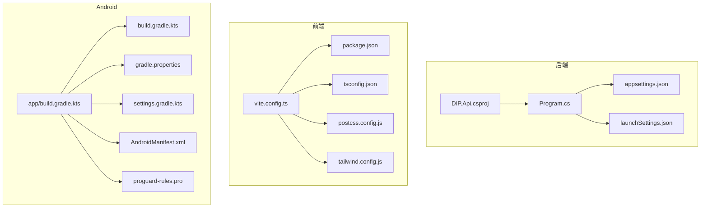
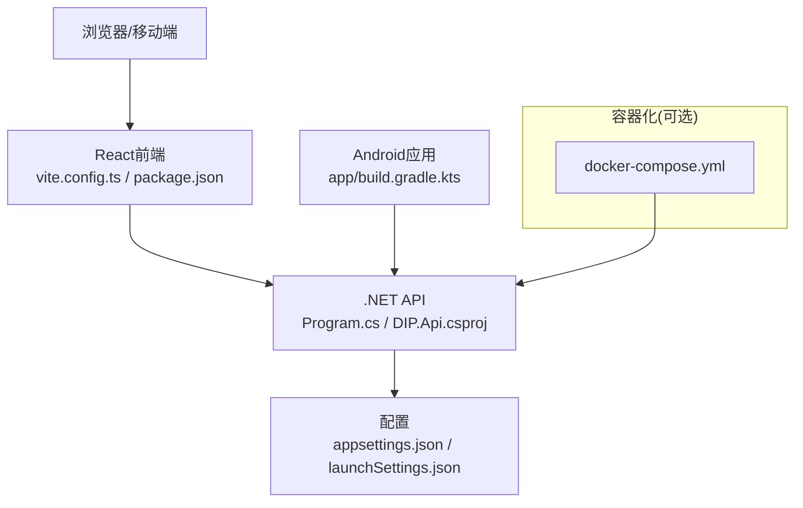
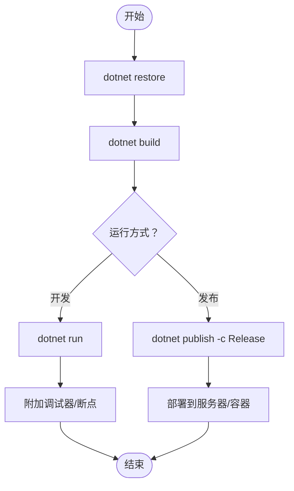
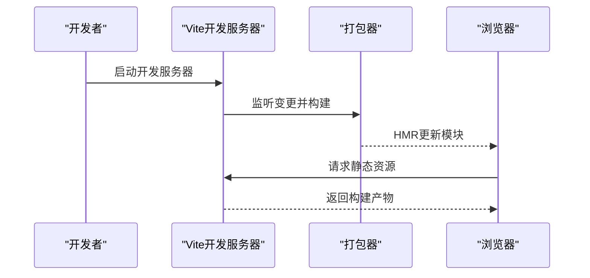
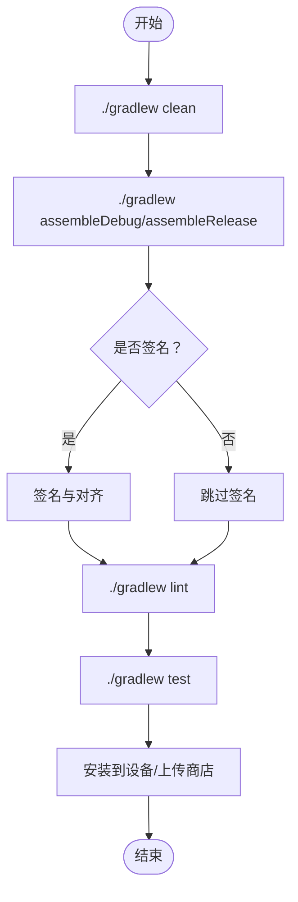
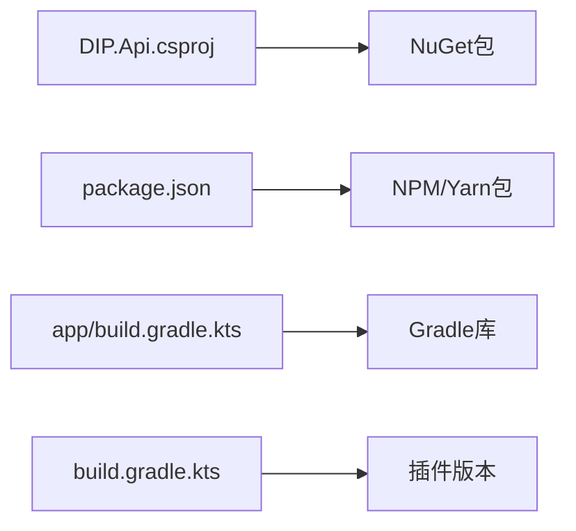

# 构建与调试

<cite>
**本文引用的文件**   
- [Program.cs](file://dip-system/api/Program.cs)
- [DIP.Api.csproj](file://dip-system/api/DIP.Api.csproj)
- [appsettings.json](file://dip-system/api/appsettings.json)
- [launchSettings.json](file://dip-system/api/Properties/launchSettings.json)
- [vite.config.ts](file://dip-system/frontend-web/vite.config.ts)
- [package.json](file://dip-system/frontend-web/package.json)
- [tsconfig.json](file://dip-system/frontend-web/tsconfig.json)
- [postcss.config.js](file://dip-system/frontend-web/postcss.config.js)
- [tailwind.config.js](file://dip-system/frontend-web/tailwind.config.js)
- [build.gradle.kts（应用）](file://mobile-android/app/build.gradle.kts)
- [build.gradle.kts（根）](file://mobile-android/build.gradle.kts)
- [gradle.properties](file://mobile-android/gradle.properties)
- [settings.gradle.kts](file://mobile-android/settings.gradle.kts)
- [AndroidManifest.xml](file://mobile-android/app/src/main/AndroidManifest.xml)
- [proguard-rules.pro](file://mobile-android/app/proguard-rules.pro)
- [docker-compose.yml](file://dip-system/docker-compose.yml)
</cite>

## 目录
1. [简介](#简介)
2. [项目结构](#项目结构)
3. [核心组件](#核心组件)
4. [架构总览](#架构总览)
5. [详细组件分析](#详细组件分析)
6. [依赖分析](#依赖分析)
7. [性能考虑](#性能考虑)
8. [故障排查指南](#故障排查指南)
9. [结论](#结论)
10. [附录](#附录)

## 简介
本指南面向DIP系统的后端.NET、前端React与Android三端，提供从本地开发到CI/CD的完整构建与调试说明。内容覆盖：
- .NET后端：dotnet命令、发布配置、依赖管理、性能优化
- React前端：Vite开发服务器、生产构建优化、代码分割、资源压缩
- Android应用：Gradle任务、签名配置、多渠道打包、混淆设置
- 各平台调试技巧：断点、日志、性能分析、内存泄漏检测
- 开发效率：热重载、增量编译、并行构建
- CI/CD流水线：构建配置与自动化测试集成

## 项目结构
DIP系统由三个主要子系统构成：
- 后端API：基于.NET的Web API服务
- 前端Web：基于React+Vite的单页应用
- 移动端Android：基于Kotlin/Compose的工程

**图表来源** 
- [DIP.Api.csproj](file://dip-system/api/DIP.Api.csproj)
- [Program.cs](file://dip-system/api/Program.cs)
- [appsettings.json](file://dip-system/api/appsettings.json)
- [launchSettings.json](file://dip-system/api/Properties/launchSettings.json)
- [vite.config.ts](file://dip-system/frontend-web/vite.config.ts)
- [package.json](file://dip-system/frontend-web/package.json)
- [tsconfig.json](file://dip-system/frontend-web/tsconfig.json)
- [postcss.config.js](file://dip-system/frontend-web/postcss.config.js)
- [tailwind.config.js](file://dip-system/frontend-web/tailwind.config.js)
- [build.gradle.kts（应用）](file://mobile-android/app/build.gradle.kts)
- [build.gradle.kts（根）](file://mobile-android/build.gradle.kts)
- [gradle.properties](file://mobile-android/gradle.properties)
- [settings.gradle.kts](file://mobile-android/settings.gradle.kts)
- [AndroidManifest.xml](file://mobile-android/app/src/main/AndroidManifest.xml)
- [proguard-rules.pro](file://mobile-android/app/proguard-rules.pro)

**章节来源**
- [Program.cs](file://dip-system/api/Program.cs)
- [DIP.Api.csproj](file://dip-system/api/DIP.Api.csproj)
- [appsettings.json](file://dip-system/api/appsettings.json)
- [launchSettings.json](file://dip-system/api/Properties/launchSettings.json)
- [vite.config.ts](file://dip-system/frontend-web/vite.config.ts)
- [package.json](file://dip-system/frontend-web/package.json)
- [tsconfig.json](file://dip-system/frontend-web/tsconfig.json)
- [postcss.config.js](file://dip-system/frontend-web/postcss.config.js)
- [tailwind.config.js](file://dip-system/frontend-web/tailwind.config.js)
- [build.gradle.kts（应用）](file://mobile-android/app/build.gradle.kts)
- [build.gradle.kts（根）](file://mobile-android/build.gradle.kts)
- [gradle.properties](file://mobile-android/gradle.properties)
- [settings.gradle.kts](file://mobile-android/settings.gradle.kts)
- [AndroidManifest.xml](file://mobile-android/app/src/main/AndroidManifest.xml)
- [proguard-rules.pro](file://mobile-android/app/proguard-rules.pro)

## 核心组件
- .NET后端：通过Program.cs启动Web主机，使用DIP.Api.csproj定义项目与依赖，appsettings.json承载运行时配置，launchSettings.json用于本地调试环境。
- React前端：通过vite.config.ts配置开发服务器与生产构建，package.json管理脚本与依赖，tsconfig.json控制TypeScript编译，postcss与tailwind负责样式处理。
- Android应用：通过app/build.gradle.kts定义应用构建规则，根build.gradle.kts统一插件版本，gradle.properties配置全局参数，settings.gradle.kts声明模块，AndroidManifest.xml声明权限与入口，proguard-rules.pro启用混淆。

**章节来源**
- [Program.cs](file://dip-system/api/Program.cs)
- [DIP.Api.csproj](file://dip-system/api/DIP.Api.csproj)
- [appsettings.json](file://dip-system/api/appsettings.json)
- [launchSettings.json](file://dip-system/api/Properties/launchSettings.json)
- [vite.config.ts](file://dip-system/frontend-web/vite.config.ts)
- [package.json](file://dip-system/frontend-web/package.json)
- [tsconfig.json](file://dip-system/frontend-web/tsconfig.json)
- [postcss.config.js](file://dip-system/frontend-web/postcss.config.js)
- [tailwind.config.js](file://dip-system/frontend-web/tailwind.config.js)
- [build.gradle.kts（应用）](file://mobile-android/app/build.gradle.kts)
- [build.gradle.kts（根）](file://mobile-android/build.gradle.kts)
- [gradle.properties](file://mobile-android/gradle.properties)
- [settings.gradle.kts](file://mobile-android/settings.gradle.kts)
- [AndroidManifest.xml](file://mobile-android/app/src/main/AndroidManifest.xml)
- [proguard-rules.pro](file://mobile-android/app/proguard-rules.pro)

## 架构总览
下图展示了前后端与移动端的交互关系以及关键配置文件的作用域。

**图表来源** 
- [vite.config.ts](file://dip-system/frontend-web/vite.config.ts)
- [package.json](file://dip-system/frontend-web/package.json)
- [Program.cs](file://dip-system/api/Program.cs)
- [DIP.Api.csproj](file://dip-system/api/DIP.Api.csproj)
- [appsettings.json](file://dip-system/api/appsettings.json)
- [launchSettings.json](file://dip-system/api/Properties/launchSettings.json)
- [build.gradle.kts（应用）](file://mobile-android/app/build.gradle.kts)
- [docker-compose.yml](file://dip-system/docker-compose.yml)

## 详细组件分析

### .NET后端构建与调试
- 构建命令
  - 还原依赖：dotnet restore
  - 编译：dotnet build
  - 运行：dotnet run
  - 发布：dotnet publish -c Release -o <输出目录>
- 发布配置
  - 在DIP.Api.csproj中指定目标框架、包引用与发布属性
  - 使用appsettings.json管理环境变量与连接字符串
  - 使用launchSettings.json配置IIS Express或Kestrel端口与环境变量
- 依赖管理
  - 通过NuGet包管理，确保版本一致性与兼容性
- 性能优化
  - 启用ReadyToRun与单文件发布（按需）
  - 使用ASP.NET Core内置缓存与响应压缩
  - 调整线程池与GC模式（根据负载）
- 调试技巧
  - VS/VS Code附加到dotnet进程
  - 使用dotnet-trace与dotnet-counters进行性能分析
  - 启用结构化日志与请求跟踪

**图表来源** 
- [DIP.Api.csproj](file://dip-system/api/DIP.Api.csproj)
- [Program.cs](file://dip-system/api/Program.cs)
- [appsettings.json](file://dip-system/api/appsettings.json)
- [launchSettings.json](file://dip-system/api/Properties/launchSettings.json)

**章节来源**
- [DIP.Api.csproj](file://dip-system/api/DIP.Api.csproj)
- [Program.cs](file://dip-system/api/Program.cs)
- [appsettings.json](file://dip-system/api/appsettings.json)
- [launchSettings.json](file://dip-system/api/Properties/launchSettings.json)

### React前端构建与调试
- 开发服务器
  - 使用Vite启动本地开发服务器，支持HMR与快速冷启动
  - 配置代理以转发API请求至后端
- 生产构建优化
  - 代码分割与懒加载
  - 资源压缩（JS/CSS/图片）
  - Tree-shaking与死代码消除
- 依赖管理
  - 通过package.json管理脚本与依赖版本
- TypeScript与样式
  - tsconfig.json控制编译选项
  - PostCSS与Tailwind CSS处理样式
- 调试技巧
  - 浏览器开发者工具断点与网络面板
  - 使用Source Map定位问题
  - 性能面板分析渲染与网络耗时

**图表来源** 
- [vite.config.ts](file://dip-system/frontend-web/vite.config.ts)
- [package.json](file://dip-system/frontend-web/package.json)
- [tsconfig.json](file://dip-system/frontend-web/tsconfig.json)
- [postcss.config.js](file://dip-system/frontend-web/postcss.config.js)
- [tailwind.config.js](file://dip-system/frontend-web/tailwind.config.js)

**章节来源**
- [vite.config.ts](file://dip-system/frontend-web/vite.config.ts)
- [package.json](file://dip-system/frontend-web/package.json)
- [tsconfig.json](file://dip-system/frontend-web/tsconfig.json)
- [postcss.config.js](file://dip-system/frontend-web/postcss.config.js)
- [tailwind.config.js](file://dip-system/frontend-web/tailwind.config.js)

### Android应用构建与调试
- Gradle任务
  - assembleDebug/assembleRelease生成APK/AAB
  - lint检查代码质量
  - test执行单元测试与仪器测试
- 签名配置
  - 在app/build.gradle.kts中配置keystore与签名信息
  - 使用gradle.properties存储敏感信息（避免提交到仓库）
- 多渠道打包
  - 通过productFlavors定义不同渠道与变体
- 混淆设置
  - 启用R8/ProGuard，配置proguard-rules.pro保留必要类与方法
- 调试技巧
  - Android Studio断点调试与Logcat查看日志
  - 使用Profiler分析CPU、内存与网络
  - LeakCanary检测内存泄漏

**图表来源** 
- [build.gradle.kts（应用）](file://mobile-android/app/build.gradle.kts)
- [build.gradle.kts（根）](file://mobile-android/build.gradle.kts)
- [gradle.properties](file://mobile-android/gradle.properties)
- [settings.gradle.kts](file://mobile-android/settings.gradle.kts)
- [AndroidManifest.xml](file://mobile-android/app/src/main/AndroidManifest.xml)
- [proguard-rules.pro](file://mobile-android/app/proguard-rules.pro)

**章节来源**
- [build.gradle.kts（应用）](file://mobile-android/app/build.gradle.kts)
- [build.gradle.kts（根）](file://mobile-android/build.gradle.kts)
- [gradle.properties](file://mobile-android/gradle.properties)
- [settings.gradle.kts](file://mobile-android/settings.gradle.kts)
- [AndroidManifest.xml](file://mobile-android/app/src/main/AndroidManifest.xml)
- [proguard-rules.pro](file://mobile-android/app/proguard-rules.pro)

## 依赖分析
- .NET依赖：通过DIP.Api.csproj声明NuGet包，确保与目标框架兼容
- 前端依赖：package.json锁定版本，建议使用npm/yarn pnpm锁文件
- Android依赖：Gradle统一管理插件与库版本，避免冲突

**图表来源** 
- [DIP.Api.csproj](file://dip-system/api/DIP.Api.csproj)
- [package.json](file://dip-system/frontend-web/package.json)
- [build.gradle.kts（应用）](file://mobile-android/app/build.gradle.kts)
- [build.gradle.kts（根）](file://mobile-android/build.gradle.kts)

**章节来源**
- [DIP.Api.csproj](file://dip-system/api/DIP.Api.csproj)
- [package.json](file://dip-system/frontend-web/package.json)
- [build.gradle.kts（应用）](file://mobile-android/app/build.gradle.kts)
- [build.gradle.kts（根）](file://mobile-android/build.gradle.kts)

## 性能考虑
- .NET后端
  - 启用响应压缩与静态文件缓存
  - 使用异步编程模型减少阻塞
  - 合理配置数据库连接池与查询优化
- React前端
  - 使用React.lazy与Suspense实现代码分割
  - 图片与字体资源按需加载与压缩
  - 避免不必要的重渲染与状态更新
- Android应用
  - 启用R8/ProGuard减小包体积
  - 使用Jetpack Compose优化UI渲染
  - 合理使用后台任务与协程

[本节为通用指导，不直接分析具体文件]

## 故障排查指南
- .NET后端
  - 检查appsettings.json与launchSettings.json配置是否正确
  - 使用dotnet logs与Event Viewer查看错误
  - 通过dotnet-trace定位性能瓶颈
- React前端
  - 检查vite.config.ts代理与路径配置
  - 使用浏览器Network面板分析请求失败原因
  - 检查控制台错误与Source Map映射
- Android应用
  - 使用Logcat过滤关键字查找崩溃堆栈
  - 检查AndroidManifest.xml权限声明
  - 使用LeakCanary检测内存泄漏

**章节来源**
- [appsettings.json](file://dip-system/api/appsettings.json)
- [launchSettings.json](file://dip-system/api/Properties/launchSettings.json)
- [vite.config.ts](file://dip-system/frontend-web/vite.config.ts)
- [AndroidManifest.xml](file://mobile-android/app/src/main/AndroidManifest.xml)

## 结论
本指南提供了DIP系统三端的构建与调试全流程说明。通过标准化命令、优化配置与调试技巧，可显著提升开发与交付效率。建议在CI/CD中集成自动化测试与质量门禁，确保代码质量与稳定性。

[本节为总结性内容，不直接分析具体文件]

## 附录
- Docker容器化：使用docker-compose.yml编排后端服务与依赖
- 环境变量管理：区分开发、测试、生产环境配置
- 安全建议：密钥与证书安全管理，避免硬编码

**章节来源**
- [docker-compose.yml](file://dip-system/docker-compose.yml)