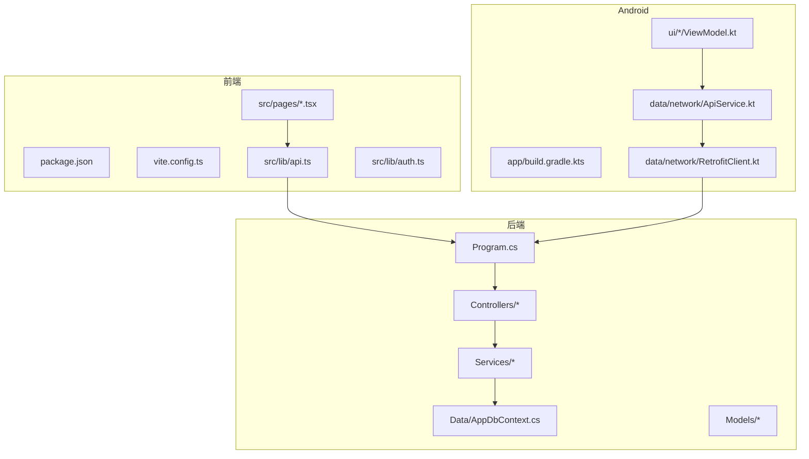
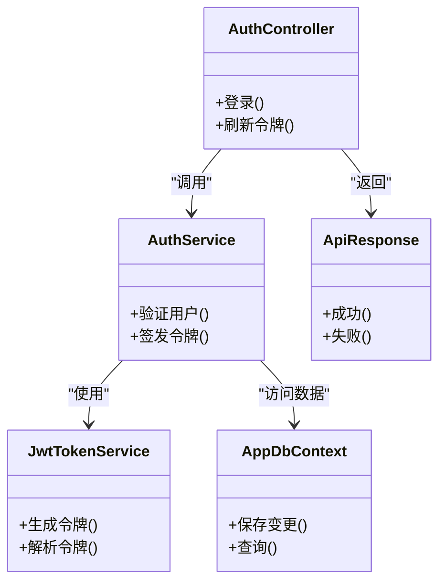
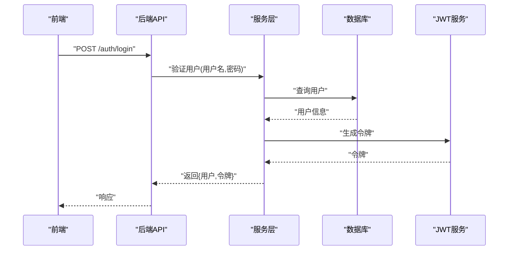
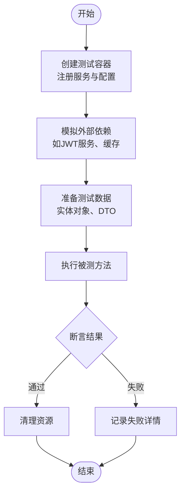
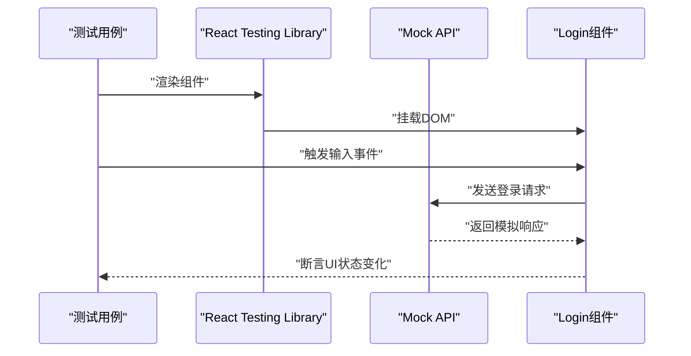
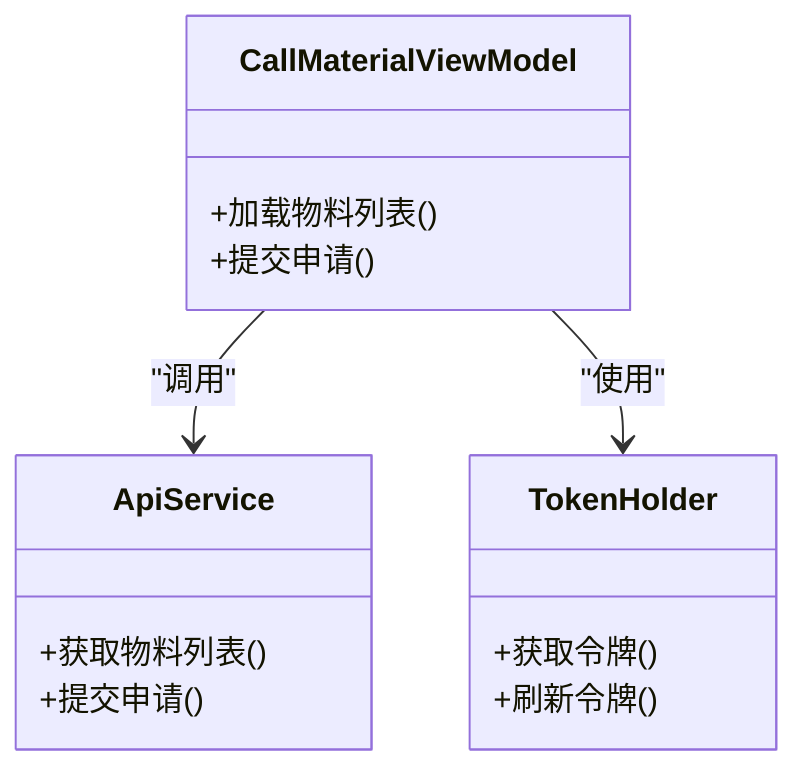
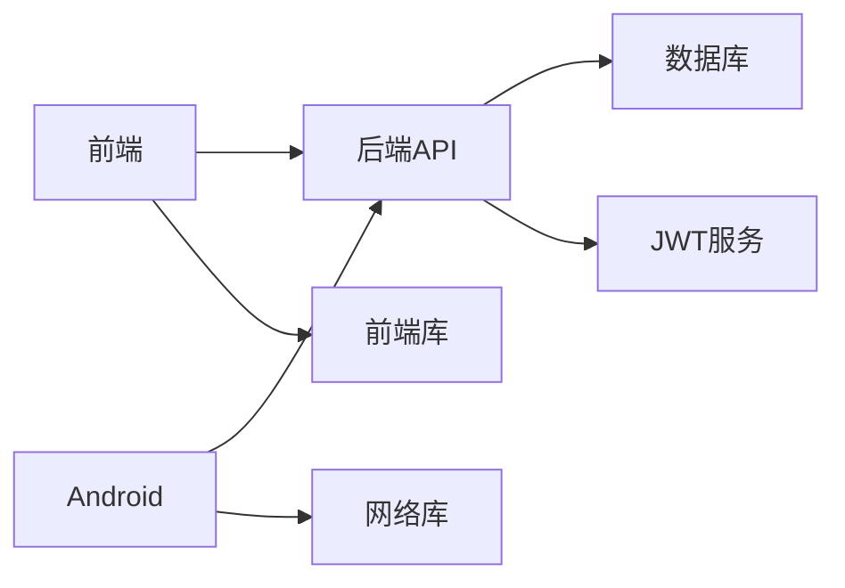

# 测试指南

<cite>
**本文引用的文件**   
- [Program.cs](file://dip-system/api/Program.cs)
- [AppDbContext.cs](file://dip-system/api/Data/AppDbContext.cs)
- [AuthController.cs](file://dip-system/api/Controllers/AuthController.cs)
- [AuthService.cs](file://dip-system/api/Services/AuthService.cs)
- [JwtTokenService.cs](file://dip-system/api/Services/JwtTokenService.cs)
- [ApiResponse.cs](file://dip-system/api/Models/ApiResponse.cs)
- [package.json](file://dip-system/frontend-web/package.json)
- [vite.config.ts](file://dip-system/frontend-web/vite.config.ts)
- [api.ts](file://dip-system/frontend-web/src/lib/api.ts)
- [auth.ts](file://dip-system/frontend-web/src/lib/auth.ts)
- [Login.tsx](file://dip-system/frontend-web/src/pages/Login.tsx)
- [build.gradle.kts](file://mobile-android/app/build.gradle.kts)
- [ApiService.kt](file://mobile-android/app/src/main/java/com/dip/material/data/network/ApiService.kt)
- [RetrofitClient.kt](file://mobile-android/app/src/main/java/com/dip/material/data/network/RetrofitClient.kt)
- [TokenHolder.kt](file://mobile-android/app/src/main/java/com/dip/material/data/network/TokenHolder.kt)
- [CallMaterialViewModel.kt](file://mobile-android/app/src/main/java/com/dip/material/ui/callmaterial/CallMaterialViewModel.kt)
- [HomeViewModel.kt](file://mobile-android/app/src/main/java/com/dip/material/ui/home/HomeViewModel.kt)
- [docker-compose.yml](file://dip-system/docker-compose.yml)
</cite>

## 目录
1. [简介](#简介)
2. [项目结构](#项目结构)
3. [核心组件](#核心组件)
4. [架构总览](#架构总览)
5. [详细组件分析](#详细组件分析)
6. [依赖分析](#依赖分析)
7. [性能考虑](#性能考虑)
8. [故障排查指南](#故障排查指南)
9. [结论](#结论)
10. [附录](#附录)

## 简介
本指南面向DIP系统的后端（ASP.NET Core）、前端（React + Vite）与Android端（Kotlin + Jetpack Compose），提供端到端的测试策略与实践。内容涵盖：
- 后端单元测试（xUnit、Mock对象、EF Core内存数据库、API集成测试）
- 前端测试（Jest、React Testing Library、E2E配置）
- Android测试（JUnit、Espresso、Mockito/Kotest）
- 测试数据准备与环境隔离
- 持续集成中的测试执行
- 性能/负载/安全测试方法
- 覆盖率统计、质量门禁与报告生成
- 常见场景最佳实践与示例路径

## 项目结构
DIP系统由三部分组成：
- 后端：ASP.NET Core Web API，使用Entity Framework Core与SQL Server
- 前端：React + TypeScript + Vite，通过REST API与后端交互
- Android：Kotlin + Retrofit + ViewModel，调用后端API并驱动UI

**图表来源** 
- [Program.cs](file://dip-system/api/Program.cs)
- [AppDbContext.cs](file://dip-system/api/Data/AppDbContext.cs)
- [package.json](file://dip-system/frontend-web/package.json)
- [vite.config.ts](file://dip-system/frontend-web/vite.config.ts)
- [api.ts](file://dip-system/frontend-web/src/lib/api.ts)
- [auth.ts](file://dip-system/frontend-web/src/lib/auth.ts)
- [build.gradle.kts](file://mobile-android/app/build.gradle.kts)
- [ApiService.kt](file://mobile-android/app/src/main/java/com/dip/material/data/network/ApiService.kt)
- [RetrofitClient.kt](file://mobile-android/app/src/main/java/com/dip/material/data/network/RetrofitClient.kt)

**章节来源**
- [Program.cs](file://dip-system/api/Program.cs)
- [AppDbContext.cs](file://dip-system/api/Data/AppDbContext.cs)
- [package.json](file://dip-system/frontend-web/package.json)
- [vite.config.ts](file://dip-system/frontend-web/vite.config.ts)
- [api.ts](file://dip-system/frontend-web/src/lib/api.ts)
- [auth.ts](file://dip-system/frontend-web/src/lib/auth.ts)
- [build.gradle.kts](file://mobile-android/app/build.gradle.kts)
- [ApiService.kt](file://mobile-android/app/src/main/java/com/dip/material/data/network/ApiService.kt)
- [RetrofitClient.kt](file://mobile-android/app/src/main/java/com/dip/material/data/network/RetrofitClient.kt)

## 核心组件
- 后端认证流程：控制器→服务→JWT令牌服务→数据库上下文
- 前端API封装：统一请求封装、鉴权拦截、错误处理
- Android网络层：Retrofit客户端、Token持有者、ViewModel状态管理

**图表来源** 
- [AuthController.cs](file://dip-system/api/Controllers/AuthController.cs)
- [AuthService.cs](file://dip-system/api/Services/AuthService.cs)
- [JwtTokenService.cs](file://dip-system/api/Services/JwtTokenService.cs)
- [AppDbContext.cs](file://dip-system/api/Data/AppDbContext.cs)
- [ApiResponse.cs](file://dip-system/api/Models/ApiResponse.cs)

**章节来源**
- [AuthController.cs](file://dip-system/api/Controllers/AuthController.cs)
- [AuthService.cs](file://dip-system/api/Services/AuthService.cs)
- [JwtTokenService.cs](file://dip-system/api/Services/JwtTokenService.cs)
- [AppDbContext.cs](file://dip-system/api/Data/AppDbContext.cs)
- [ApiResponse.cs](file://dip-system/api/Models/ApiResponse.cs)

## 架构总览
DIP系统采用分层架构：
- 表现层：Web API控制器、前端页面、Android UI
- 业务层：服务类封装领域逻辑
- 数据层：EF Core上下文与数据库
- 横切关注点：鉴权、异常处理、日志、配置

**图表来源** 
- [AuthController.cs](file://dip-system/api/Controllers/AuthController.cs)
- [AuthService.cs](file://dip-system/api/Services/AuthService.cs)
- [JwtTokenService.cs](file://dip-system/api/Services/JwtTokenService.cs)
- [AppDbContext.cs](file://dip-system/api/Data/AppDbContext.cs)

## 详细组件分析

### 后端单元测试（xUnit + EF Core + Moq）
- 框架选择：xUnit作为测试框架，Moq用于模拟依赖，In-Memory数据库用于数据访问测试
- 测试分类：
  - 单元测试：针对服务层方法，模拟外部依赖
  - 集成测试：使用WebApplicationFactory启动API，测试控制器与中间件
  - 数据访问测试：使用内存数据库验证EF Core查询与更新

**章节来源**
- [Program.cs](file://dip-system/api/Program.cs)
- [AppDbContext.cs](file://dip-system/api/Data/AppDbContext.cs)

### 前端测试（Jest + React Testing Library）
- 单元测试：使用Jest运行测试，RTL进行组件渲染与交互测试
- API测试：使用msw或fetch mock模拟后端接口
- E2E测试：建议使用Playwright或Cypress进行端到端验证

**章节来源**
- [package.json](file://dip-system/frontend-web/package.json)
- [vite.config.ts](file://dip-system/frontend-web/vite.config.ts)
- [api.ts](file://dip-system/frontend-web/src/lib/api.ts)
- [auth.ts](file://dip-system/frontend-web/src/lib/auth.ts)
- [Login.tsx](file://dip-system/frontend-web/src/pages/Login.tsx)

### Android测试（JUnit + Espresso + Mockito）
- 单元测试：使用JUnit 5与Mockito验证ViewModel逻辑
- UI测试：Espresso进行界面交互测试
- 网络测试：使用OkHttp MockWebServer模拟API响应

**图表来源** 
- [CallMaterialViewModel.kt](file://mobile-android/app/src/main/java/com/dip/material/ui/callmaterial/CallMaterialViewModel.kt)
- [ApiService.kt](file://mobile-android/app/src/main/java/com/dip/material/data/network/ApiService.kt)
- [TokenHolder.kt](file://mobile-android/app/src/main/java/com/dip/material/data/network/TokenHolder.kt)

**章节来源**
- [build.gradle.kts](file://mobile-android/app/build.gradle.kts)
- [CallMaterialViewModel.kt](file://mobile-android/app/src/main/java/com/dip/material/ui/callmaterial/CallMaterialViewModel.kt)
- [ApiService.kt](file://mobile-android/app/src/main/java/com/dip/material/data/network/ApiService.kt)
- [TokenHolder.kt](file://mobile-android/app/src/main/java/com/dip/material/data/network/TokenHolder.kt)

## 依赖分析
各层之间的依赖关系清晰，便于测试隔离：
- 前端依赖后端API，可通过mock解耦
- Android依赖Retrofit客户端，可替换为Mock实现
- 后端服务依赖EF Core，可使用内存数据库替代

**章节来源**
- [api.ts](file://dip-system/frontend-web/src/lib/api.ts)
- [RetrofitClient.kt](file://mobile-android/app/src/main/java/com/dip/material/data/network/RetrofitClient.kt)
- [Program.cs](file://dip-system/api/Program.cs)

## 性能考虑
- 后端：使用内存数据库进行快速测试，避免真实IO开销
- 前端：组件测试避免重渲染，使用快照测试对比UI变化
- Android：ViewModel测试避免UI线程阻塞，使用协程调度器控制时间

[本节为通用指导，无需特定文件引用]

## 故障排查指南
- 后端测试失败：检查数据库连接字符串、环境变量配置
- 前端测试问题：确认Node版本、依赖安装、端口占用
- Android测试异常：验证模拟器环境、权限配置、网络可达性

**章节来源**
- [docker-compose.yml](file://dip-system/docker-compose.yml)

## 结论
本指南提供了DIP系统全栈测试的完整方案，涵盖单元、集成、E2E测试，以及性能与安全测试。建议团队遵循分层测试策略，确保代码质量与稳定性。

[本节为总结性内容，无需特定文件引用]

## 附录
- 测试覆盖率工具：OpenCover（.NET）、Istanbul（JS）、JaCoCo（Android）
- 质量门禁：PR合并前必须通过所有测试，覆盖率不低于阈值
- 报告生成：Jenkins/GitHub Actions集成测试报告，自动生成HTML文档

[本节为补充信息，无需特定文件引用]