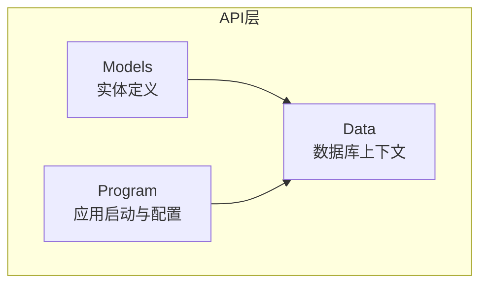
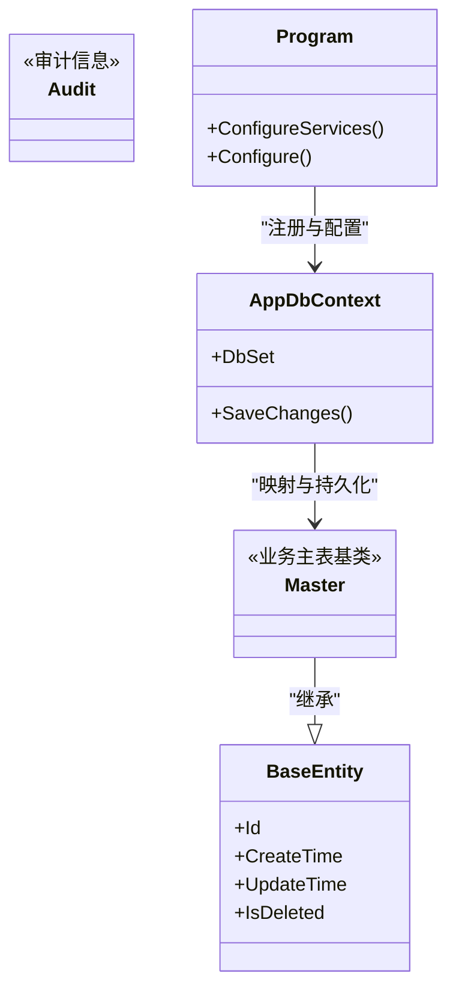
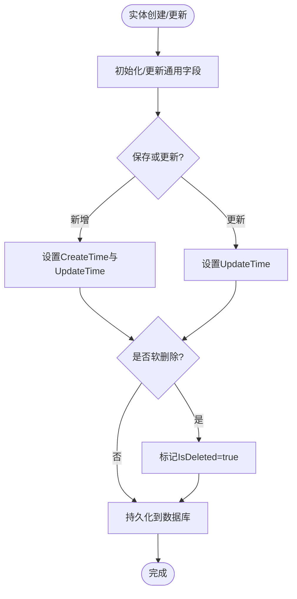
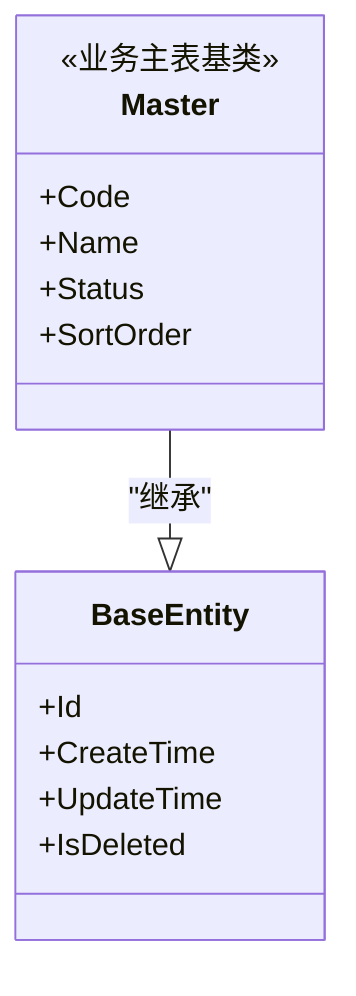
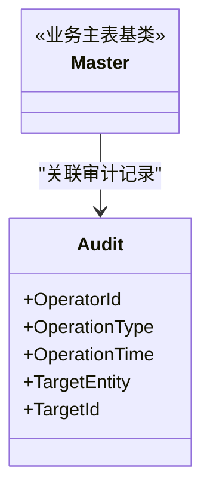
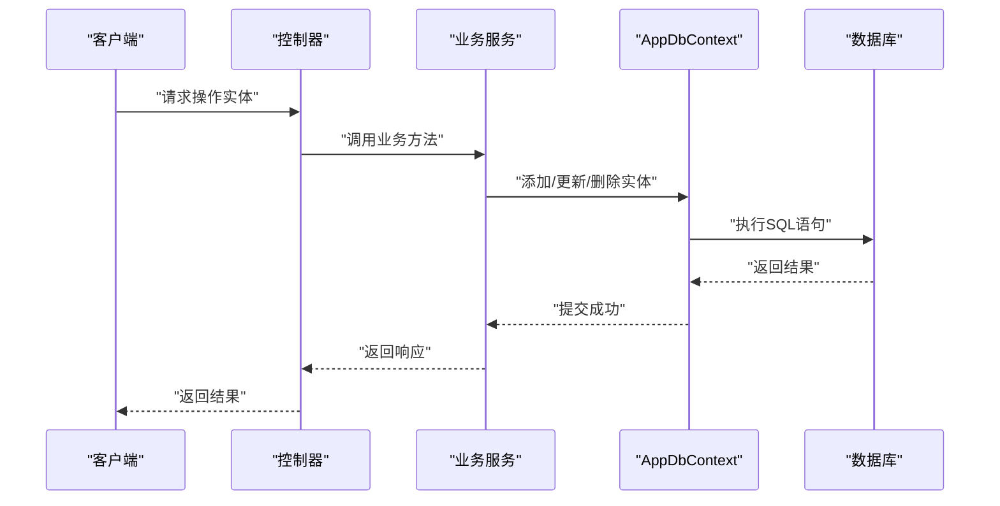
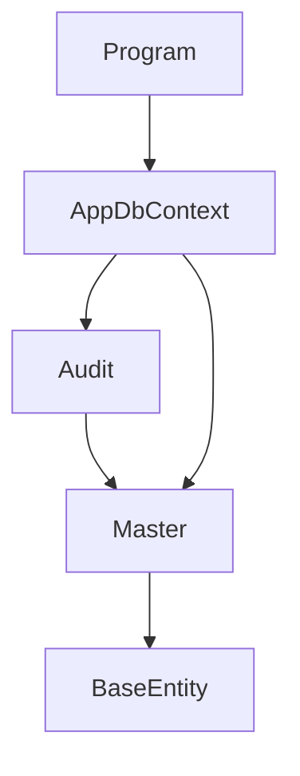

# 基础实体类

<cite>
**本文引用的文件**   
- [BaseEntity.cs](file://dip-system/api/Models/BaseEntity.cs)
- [Master.cs](file://dip-system/api/Models/Master.cs)
- [Audit.cs](file://dip-system/api/Models/Audit.cs)
- [AppDbContext.cs](file://dip-system/api/Data/AppDbContext.cs)
- [Program.cs](file://dip-system/api/Program.cs)
</cite>

## 目录
1. [简介](#简介)
2. [项目结构](#项目结构)
3. [核心组件](#核心组件)
4. [架构总览](#架构总览)
5. [详细组件分析](#详细组件分析)
6. [依赖分析](#依赖分析)
7. [性能考虑](#性能考虑)
8. [故障排查指南](#故障排查指南)
9. [结论](#结论)
10. [附录](#附录)

## 简介
本章节面向DIP系统的基础实体体系，聚焦于BaseEntity基类与Master主表实体的设计。文档涵盖通用字段（如Id、CreateTime、UpdateTime、IsDeleted等）的定义与用途、实体生命周期管理、软删除机制、审计字段使用、实体验证规则、数据注解配置、序列化设置，以及实体继承的最佳实践与扩展指南。目标是帮助开发者快速理解并正确使用基础实体，确保业务模型的一致性与可维护性。

## 项目结构
DIP系统的后端采用.NET技术栈，实体定义位于api/Models目录下，数据库上下文位于api/Data目录下，应用启动与EF Core配置位于api/Program.cs中。基础实体与主表实体通过EF Core进行映射与持久化。

图表来源 
- [BaseEntity.cs](file://dip-system/api/Models/BaseEntity.cs)
- [Master.cs](file://dip-system/api/Models/Master.cs)
- [AppDbContext.cs](file://dip-system/api/Data/AppDbContext.cs)
- [Program.cs](file://dip-system/api/Program.cs)

章节来源
- [BaseEntity.cs](file://dip-system/api/Models/BaseEntity.cs)
- [Master.cs](file://dip-system/api/Models/Master.cs)
- [AppDbContext.cs](file://dip-system/api/Data/AppDbContext.cs)
- [Program.cs](file://dip-system/api/Program.cs)

## 核心组件
- BaseEntity：所有业务实体的基类，提供通用标识、时间戳、软删除等能力。
- Master：作为业务主表的通用基类，通常用于“主数据”或“主表”场景，继承自BaseEntity并补充主表相关特性。
- Audit：审计信息实体，记录操作人、操作时间等审计字段，可与主表实体组合使用。
- AppDbContext：EF Core的数据库上下文，负责实体映射、查询与变更跟踪。
- Program：应用启动入口，注册EF Core、中间件与服务，完成基础配置。

章节来源
- [BaseEntity.cs](file://dip-system/api/Models/BaseEntity.cs)
- [Master.cs](file://dip-system/api/Models/Master.cs)
- [Audit.cs](file://dip-system/api/Models/Audit.cs)
- [AppDbContext.cs](file://dip-system/api/Data/AppDbContext.cs)
- [Program.cs](file://dip-system/api/Program.cs)

## 架构总览
下图展示基础实体在系统中的位置与关系：业务实体继承自Master或BaseEntity，统一由AppDbContext进行持久化；Program负责EF Core的配置与注册。

图表来源 
- [BaseEntity.cs](file://dip-system/api/Models/BaseEntity.cs)
- [Master.cs](file://dip-system/api/Models/Master.cs)
- [Audit.cs](file://dip-system/api/Models/Audit.cs)
- [AppDbContext.cs](file://dip-system/api/Data/AppDbContext.cs)
- [Program.cs](file://dip-system/api/Program.cs)

## 详细组件分析

### BaseEntity基类分析
- 通用字段
  - Id：主键标识，通常为GUID或自增整数，用于唯一标识实体。
  - CreateTime：创建时间，记录实体首次入库的时间点。
  - UpdateTime：更新时间，记录最近一次修改的时间点。
  - IsDeleted：软删除标志，标记实体是否被逻辑删除。
- 设计要点
  - 通过基类统一提供审计与软删除能力，减少重复代码。
  - 与EF Core配合，实现自动时间戳更新与软删除过滤。
- 生命周期管理
  - 新增时初始化CreateTime与UpdateTime。
  - 更新时刷新UpdateTime。
  - 删除时不物理删除，而是将IsDeleted置为true，并在查询中过滤。
- 验证与注解
  - 可使用数据注解对Id、时间戳等进行约束（如必填、格式校验）。
  - 结合EF Core的Fluent API进行更复杂的映射与约束。
- 序列化设置
  - 建议启用忽略空值、日期格式化等选项，保证前后端一致。

图表来源 
- [BaseEntity.cs](file://dip-system/api/Models/BaseEntity.cs)
- [AppDbContext.cs](file://dip-system/api/Data/AppDbContext.cs)

章节来源
- [BaseEntity.cs](file://dip-system/api/Models/BaseEntity.cs)
- [AppDbContext.cs](file://dip-system/api/Data/AppDbContext.cs)

### Master主表实体分析
- 定位与职责
  - 作为业务主表的通用基类，承载主数据的核心字段与行为。
  - 通常包含编码、名称、状态、排序等常见主表字段。
- 继承体系
  - 继承自BaseEntity，复用通用字段与行为。
  - 可扩展更多主表特有属性与方法。
- 最佳实践
  - 保持主表实体的稳定性，避免频繁变更。
  - 使用枚举或字典维护状态与类型，便于扩展与维护。
  - 与Audit实体组合，记录关键操作的审计信息。

图表来源 
- [Master.cs](file://dip-system/api/Models/Master.cs)
- [BaseEntity.cs](file://dip-system/api/Models/BaseEntity.cs)

章节来源
- [Master.cs](file://dip-system/api/Models/Master.cs)
- [BaseEntity.cs](file://dip-system/api/Models/BaseEntity.cs)

### Audit审计实体分析
- 作用与字段
  - 记录操作人、操作时间、操作类型等审计信息。
  - 可与主表实体组合，形成完整的审计链路。
- 使用方式
  - 在业务服务层组装审计信息，写入Audit实体。
  - 支持按实体、操作、时间范围进行查询与分析。

图表来源 
- [Audit.cs](file://dip-system/api/Models/Audit.cs)
- [Master.cs](file://dip-system/api/Models/Master.cs)

章节来源
- [Audit.cs](file://dip-system/api/Models/Audit.cs)
- [Master.cs](file://dip-system/api/Models/Master.cs)

### AppDbContext与Program配置分析
- AppDbContext
  - 定义DbSet集合，映射实体到数据库表。
  - 重写SaveChanges以统一处理审计与软删除逻辑。
- Program
  - 注册EF Core连接字符串与上下文。
  - 配置中间件与服务，确保实体生命周期与事务管理。

图表来源 
- [AppDbContext.cs](file://dip-system/api/Data/AppDbContext.cs)
- [Program.cs](file://dip-system/api/Program.cs)

章节来源
- [AppDbContext.cs](file://dip-system/api/Data/AppDbContext.cs)
- [Program.cs](file://dip-system/api/Program.cs)

## 依赖分析
- 实体间依赖
  - Master继承BaseEntity，共享通用字段与行为。
  - Audit与Master通过外键关联，形成审计链路。
- 框架依赖
  - EF Core用于实体映射与持久化。
  - 数据注解与Fluent API用于验证与配置。
- 外部依赖
  - 数据库驱动（如SQL Server、MySQL等）。
  - JSON序列化库（如System.Text.Json）用于API响应。

图表来源 
- [BaseEntity.cs](file://dip-system/api/Models/BaseEntity.cs)
- [Master.cs](file://dip-system/api/Models/Master.cs)
- [Audit.cs](file://dip-system/api/Models/Audit.cs)
- [AppDbContext.cs](file://dip-system/api/Data/AppDbContext.cs)
- [Program.cs](file://dip-system/api/Program.cs)

章节来源
- [BaseEntity.cs](file://dip-system/api/Models/BaseEntity.cs)
- [Master.cs](file://dip-system/api/Models/Master.cs)
- [Audit.cs](file://dip-system/api/Models/Audit.cs)
- [AppDbContext.cs](file://dip-system/api/Data/AppDbContext.cs)
- [Program.cs](file://dip-system/api/Program.cs)

## 性能考虑
- 索引优化
  - 为常用查询字段（如Id、Code、Status）建立索引。
  - 软删除字段IsDeleted可考虑复合索引以提升过滤性能。
- 查询优化
  - 使用AsNoTracking提升只读查询性能。
  - 分页查询避免一次性加载大量数据。
- 批量操作
  - 使用批量插入与更新减少数据库往返。
- 缓存策略
  - 对热点主数据使用内存缓存（如IMemoryCache）。

[本节为通用指导，无需特定文件引用]

## 故障排查指南
- 常见问题
  - 软删除未生效：检查IsDeleted字段是否正确设置与查询过滤。
  - 时间戳未更新：确认SaveChanges重写逻辑是否覆盖UpdateTime。
  - 审计记录缺失：检查业务服务层是否正确组装Audit实体。
- 调试建议
  - 启用EF Core日志输出，查看生成的SQL语句。
  - 使用断点调试实体生命周期方法。
  - 检查数据库约束与触发器是否影响数据一致性。

章节来源
- [AppDbContext.cs](file://dip-system/api/Data/AppDbContext.cs)
- [Program.cs](file://dip-system/api/Program.cs)

## 结论
BaseEntity与Master构成了DIP系统的基础实体体系，提供了统一的通用字段、生命周期管理与软删除机制。通过Audit实体增强审计能力，结合EF Core与数据注解实现高效的数据持久化与验证。遵循本文的最佳实践与扩展指南，可显著提升系统的可维护性与扩展性。

[本节为总结性内容，无需特定文件引用]

## 附录
- 实体继承最佳实践
  - 保持基类稳定，避免频繁变更。
  - 使用接口抽象公共行为，提高灵活性。
  - 合理划分实体职责，避免过度耦合。
- 扩展指南
  - 新增实体时优先继承Master或BaseEntity。
  - 使用数据注解与Fluent API进行验证与映射。
  - 结合审计实体记录关键操作，便于问题追踪。

[本节为通用指导，无需特定文件引用]