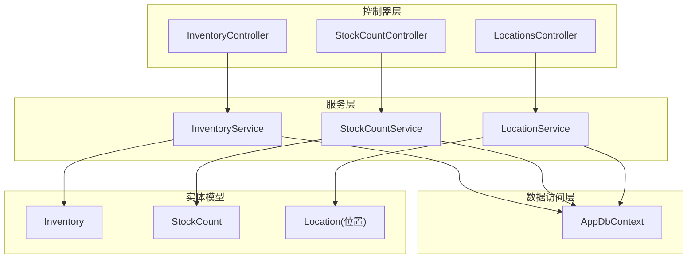
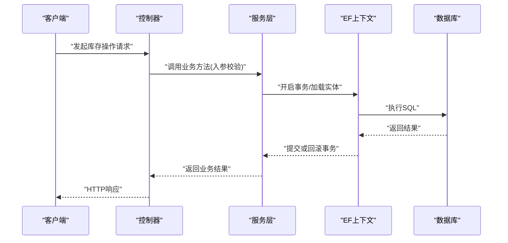
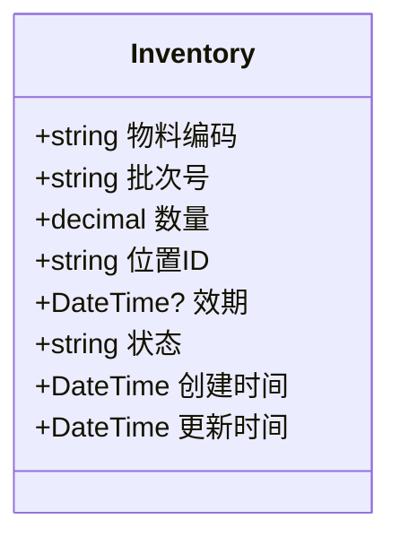
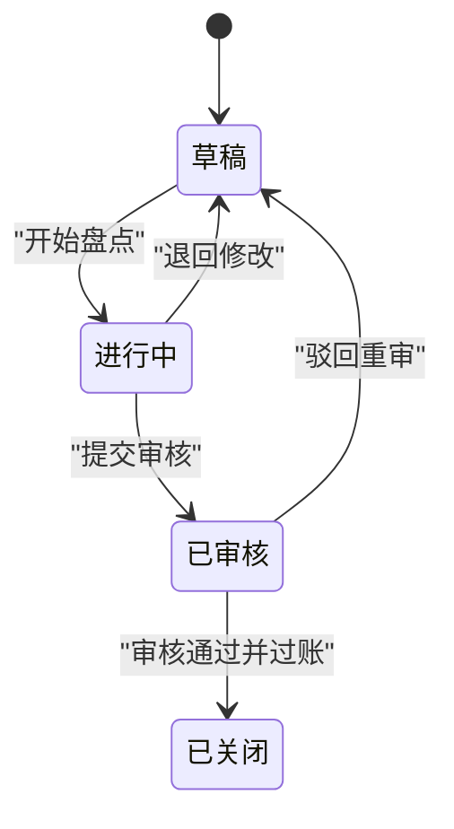
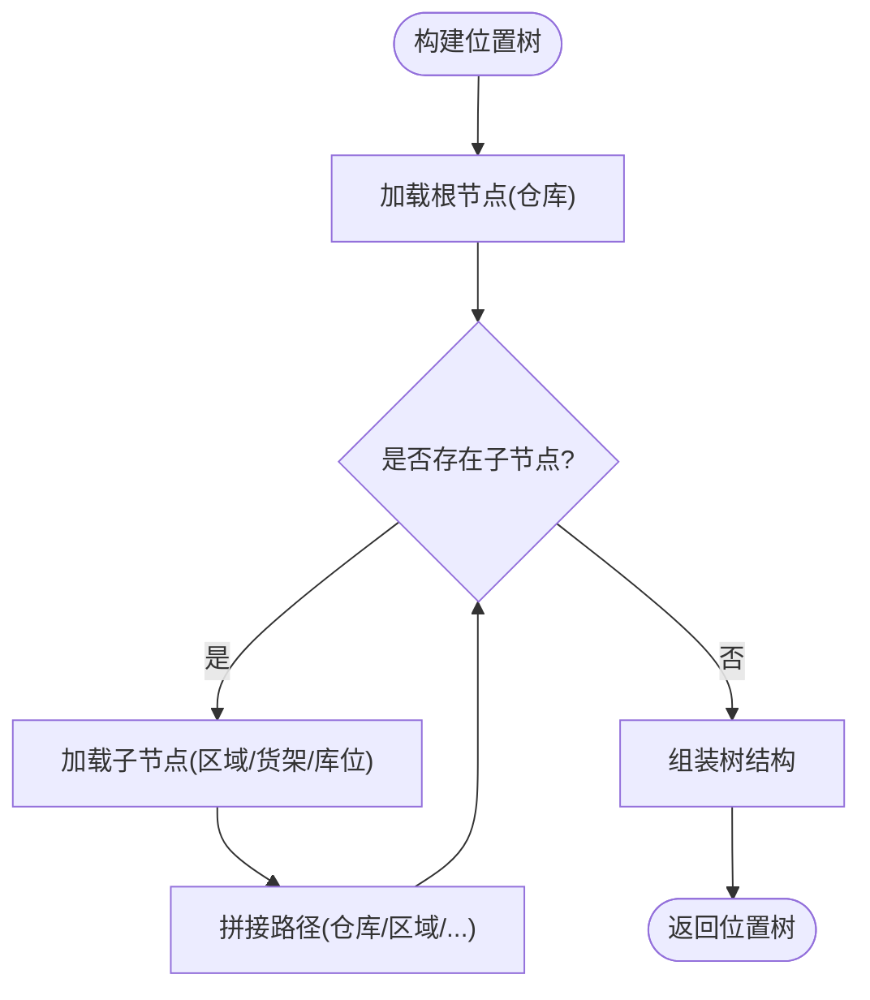
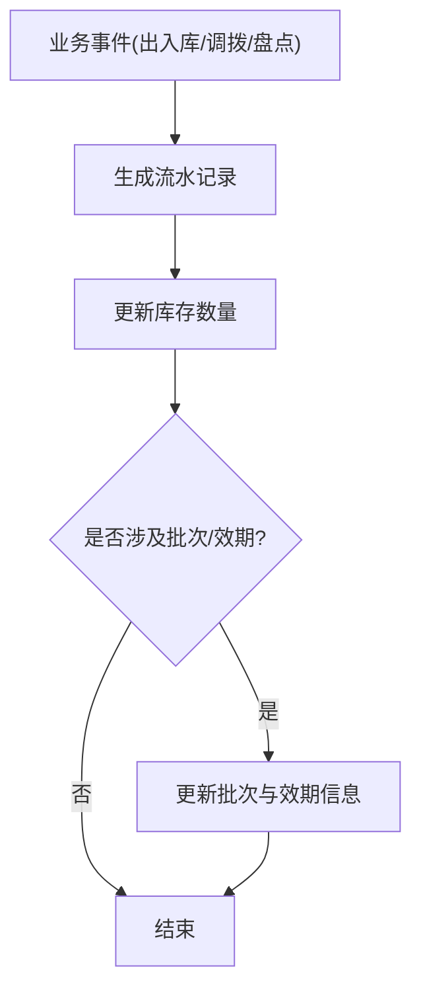
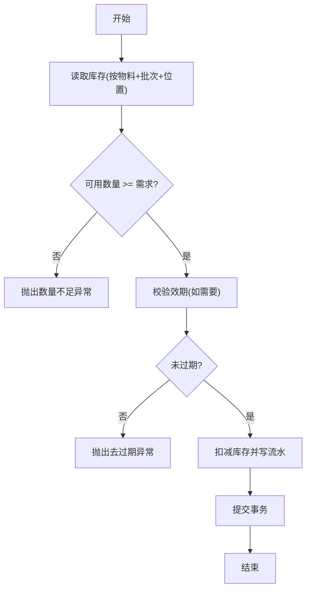
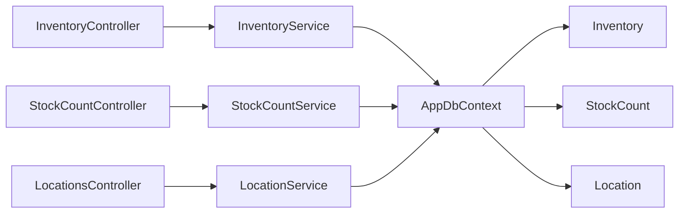

# 库存管理模型

<cite>
**本文引用的文件**   
- [Inventory.cs](file://dip-system/api/Models/Inventory.cs)
- [StockCount.cs](file://dip-system/api/Models/StockCount.cs)
- [LocationService.cs](file://dip-system/api/Services/LocationService.cs)
- [InventoryController.cs](file://dip-system/api/Controllers/InventoryController.cs)
- [StockCountController.cs](file://dip-system/api/Controllers/StockCountController.cs)
- [LocationsController.cs](file://dip-system/api/Controllers/LocationsController.cs)
- [InventoryService.cs](file://dip-system/api/Services/InventoryService.cs)
- [StockCountService.cs](file://dip-system/api/Services/StockCountService.cs)
- [AppDbContext.cs](file://dip-system/api/Data/AppDbContext.cs)
- [Program.cs](file://dip-system/api/Program.cs)
- [init-db.sql](file://scripts/init-db.sql)
</cite>

## 目录
1. [简介](#简介)
2. [项目结构](#项目结构)
3. [核心组件](#核心组件)
4. [架构总览](#架构总览)
5. [详细组件分析](#详细组件分析)
6. [依赖关系分析](#依赖关系分析)
7. [性能考虑](#性能考虑)
8. [故障排查指南](#故障排查指南)
9. [结论](#结论)
10. [附录](#附录)

## 简介
本文件面向DIP系统的库存管理模型，聚焦以下目标：
- 明确Inventory库存实体的字段定义与业务含义（物料编码、批次号、数量、位置等）。
- 说明StockCount盘点实体的数据结构，记录盘点差异与状态变更。
- 文档化Location位置管理的数据模型，支持多级仓库结构。
- 介绍库存流水记录、批次追踪、效期管理的实现思路与落地方式。
- 总结库存计算逻辑、数量校验规则与并发控制策略。
- 提供库存查询优化方案与性能调优建议。

## 项目结构
库存相关能力主要分布在API层的Models、Services、Controllers以及数据访问层：
- Models：实体定义（Inventory、StockCount等）
- Services：业务编排与事务边界（InventoryService、StockCountService、LocationService）
- Controllers：HTTP接口暴露（InventoryController、StockCountController、LocationsController）
- Data：EF上下文配置与数据库映射（AppDbContext）
- Scripts：初始化脚本（init-db.sql）

图表来源
- [InventoryController.cs](file://dip-system/api/Controllers/InventoryController.cs)
- [StockCountController.cs](file://dip-system/api/Controllers/StockCountController.cs)
- [LocationsController.cs](file://dip-system/api/Controllers/LocationsController.cs)
- [InventoryService.cs](file://dip-system/api/Services/InventoryService.cs)
- [StockCountService.cs](file://dip-system/api/Services/StockCountService.cs)
- [LocationService.cs](file://dip-system/api/Services/LocationService.cs)
- [AppDbContext.cs](file://dip-system/api/Data/AppDbContext.cs)
- [Inventory.cs](file://dip-system/api/Models/Inventory.cs)
- [StockCount.cs](file://dip-system/api/Models/StockCount.cs)

章节来源
- [Program.cs:1-200](file://dip-system/api/Program.cs#L1-L200)
- [AppDbContext.cs:1-200](file://dip-system/api/Data/AppDbContext.cs#L1-L200)

## 核心组件
- Inventory（库存）：以“物料+批次+位置”为粒度记录可用数量，支撑出入库、调拨、盘点等业务。
- StockCount（盘点）：记录盘点任务、明细、差异与审批状态，驱动库存调整。
- Location（位置）：支持多级仓库结构（仓库-区域-货架-库位），用于库存定位与路径规划。
- 服务层：InventoryService、StockCountService、LocationService负责业务编排、校验与事务控制。
- 控制器层：对外暴露REST接口，完成参数校验、权限检查与响应封装。

章节来源
- [Inventory.cs:1-200](file://dip-system/api/Models/Inventory.cs#L1-L200)
- [StockCount.cs:1-200](file://dip-system/api/Models/StockCount.cs#L1-L200)
- [LocationService.cs:1-200](file://dip-system/api/Services/LocationService.cs#L1-L200)
- [InventoryService.cs:1-200](file://dip-system/api/Services/InventoryService.cs#L1-L200)
- [StockCountService.cs:1-200](file://dip-system/api/Services/StockCountService.cs#L1-L200)

## 架构总览
库存模块采用典型的分层架构：控制器接收请求并委派给服务；服务进行业务编排、校验与事务处理；通过EF Core上下文访问数据库。

图表来源
- [InventoryController.cs:1-200](file://dip-system/api/Controllers/InventoryController.cs#L1-L200)
- [InventoryService.cs:1-200](file://dip-system/api/Services/InventoryService.cs#L1-L200)
- [AppDbContext.cs:1-200](file://dip-system/api/Data/AppDbContext.cs#L1-L200)

## 详细组件分析

### Inventory（库存）实体
- 关键字段
  - 物料编码：唯一标识物料主数据
  - 批次号：区分同物料不同生产批次的序列号
  - 数量：当前可用数量（可为小数，取决于单位）
  - 位置：库存存放的库位ID（关联Location）
  - 效期：批次有效期（支持过期拦截与先进先出策略）
  - 状态：在库/冻结/待检等
- 设计要点
  - 以“物料+批次+位置”作为库存行维度，避免重复键冲突
  - 数量必须非负，扣减前需做可用性校验
  - 结合批次与效期，支持FEFO（先到期先出）策略
- 典型操作
  - 入库：增加数量，生成流水记录
  - 出库：扣减数量，校验可用量与效期
  - 调拨：源位置扣减，目标位置增加，保持总量一致
  - 冻结/解冻：状态变更，影响可分配数量

图表来源
- [Inventory.cs:1-200](file://dip-system/api/Models/Inventory.cs#L1-L200)

章节来源
- [Inventory.cs:1-200](file://dip-system/api/Models/Inventory.cs#L1-L200)

### StockCount（盘点）实体
- 数据结构
  - 盘点单：编号、仓库/位置范围、状态（草稿/进行中/已审核/已关闭）、负责人、计划时间
  - 盘点明细：物料、批次、位置、账面数量、实盘数量、差异数量、备注
  - 差异处理：自动生成调整单或人工确认
- 状态流转
  - 草稿 → 进行中 → 已审核 → 已关闭
  - 任一阶段允许退回草稿（需权限控制）
- 关键校验
  - 实盘数量≥0
  - 差异数量=实盘-账面，正差入库、负差出库
  - 审核前不允许修改账面，审核后锁定单据

图表来源
- [StockCount.cs:1-200](file://dip-system/api/Models/StockCount.cs#L1-L200)

章节来源
- [StockCount.cs:1-200](file://dip-system/api/Models/StockCount.cs#L1-L200)

### Location（位置）管理
- 模型要点
  - 支持多级结构：仓库→区域→货架→库位
  - 每个节点具备编码、名称、层级、父级ID、是否启用等属性
  - 路径计算：从根到叶拼接完整路径，便于展示与检索
- 业务价值
  - 库存定位与拣货路径优化
  - 容量与周转率统计
  - 盘点按位置范围快速圈定

图表来源
- [LocationService.cs:1-200](file://dip-system/api/Services/LocationService.cs#L1-L200)

章节来源
- [LocationService.cs:1-200](file://dip-system/api/Services/LocationService.cs#L1-L200)

### 库存流水记录、批次追踪、效期管理
- 库存流水
  - 每次出入库、调拨、盘点过账均生成流水记录
  - 流水字段包含：单号、类型、物料、批次、位置、数量、方向、时间、关联单号
  - 支持按物料/批次/位置/时间范围查询，形成审计轨迹
- 批次追踪
  - 以批次号为维度聚合库存与流向
  - 支持批次追溯（上游供应商/工单/下游客户订单）
- 效期管理
  - 入库时登记效期，出库遵循FEFO策略
  - 过期预警与自动冻结，防止超期发货

图表来源
- [InventoryService.cs:1-200](file://dip-system/api/Services/InventoryService.cs#L1-L200)
- [StockCountService.cs:1-200](file://dip-system/api/Services/StockCountService.cs#L1-L200)

章节来源
- [InventoryService.cs:1-200](file://dip-system/api/Services/InventoryService.cs#L1-L200)
- [StockCountService.cs:1-200](file://dip-system/api/Services/StockCountService.cs#L1-L200)

### 库存计算逻辑与数量校验
- 计算逻辑
  - 可用数量 = 在库数量 - 冻结数量 - 预留数量
  - 批次维度独立计算，避免跨批次混用
- 校验规则
  - 出库前校验可用数量≥需求数量
  - 调拨前后总量守恒（源-目标=0）
  - 盘点差异过账后，账面与实物一致
- 异常处理
  - 数量不足抛出业务异常
  - 效期过期拦截出库
  - 并发冲突重试或失败提示

图表来源
- [InventoryService.cs:1-200](file://dip-system/api/Services/InventoryService.cs#L1-L200)

章节来源
- [InventoryService.cs:1-200](file://dip-system/api/Services/InventoryService.cs#L1-L200)

### 并发控制策略
- 乐观锁
  - 使用版本号字段（RowVersion）检测并发更新冲突
  - 冲突时提示用户刷新并重试
- 分布式锁（可选）
  - 对热点物料/批次加锁，保证扣减原子性
  - 适用于高并发场景（如大促）
- 事务隔离级别
  - 默认读已提交，必要时提升为可重复读
  - 长事务拆分为短事务，降低锁竞争

章节来源
- [InventoryService.cs:1-200](file://dip-system/api/Services/InventoryService.cs#L1-L200)
- [StockCountService.cs:1-200](file://dip-system/api/Services/StockCountService.cs#L1-L200)

## 依赖关系分析
- 控制器依赖服务：InventoryController→InventoryService，StockCountController→StockCountService，LocationsController→LocationService
- 服务依赖上下文：所有服务通过AppDbContext访问数据库
- 实体与表映射：由AppDbContext配置，确保字段与约束正确

图表来源
- [InventoryController.cs:1-200](file://dip-system/api/Controllers/InventoryController.cs#L1-L200)
- [StockCountController.cs:1-200](file://dip-system/api/Controllers/StockCountController.cs#L1-L200)
- [LocationsController.cs:1-200](file://dip-system/api/Controllers/LocationsController.cs#L1-L200)
- [InventoryService.cs:1-200](file://dip-system/api/Services/InventoryService.cs#L1-L200)
- [StockCountService.cs:1-200](file://dip-system/api/Services/StockCountService.cs#L1-L200)
- [LocationService.cs:1-200](file://dip-system/api/Services/LocationService.cs#L1-L200)
- [AppDbContext.cs:1-200](file://dip-system/api/Data/AppDbContext.cs#L1-L200)

章节来源
- [AppDbContext.cs:1-200](file://dip-system/api/Data/AppDbContext.cs#L1-L200)

## 性能考虑
- 查询优化
  - 为常用查询建立复合索引（物料编码+批次号+位置ID）
  - 分页与投影：仅返回必要字段，减少网络传输
  - 缓存热点数据：位置树、字典表使用内存缓存
- 写入优化
  - 批量插入流水记录，减少往返次数
  - 拆分大事务，缩短锁持有时间
- 连接池与超时
  - 合理设置连接池大小与命令超时
  - 监控慢查询日志，及时优化SQL

[本节为通用指导，不直接分析具体文件]

## 故障排查指南
- 常见问题
  - 库存不足：检查可用数量计算与预留逻辑
  - 效期拦截：核对批次效期与出库策略
  - 并发冲突：查看版本冲突提示，引导用户重试
- 定位手段
  - 查看库存流水，还原变化轨迹
  - 检查盘点单状态与差异过账记录
  - 使用位置树验证库位有效性
- 日志与监控
  - 关键操作打点（出入库、调拨、盘点过账）
  - 错误码统一，便于前端提示与后端告警

章节来源
- [InventoryService.cs:1-200](file://dip-system/api/Services/InventoryService.cs#L1-L200)
- [StockCountService.cs:1-200](file://dip-system/api/Services/StockCountService.cs#L1-L200)

## 结论
本库存管理模型以Inventory为核心，结合StockCount与Location，构建了完整的库存生命周期管理能力。通过严格的数量校验、批次与效期管理、并发控制与查询优化，系统能够在复杂仓储场景中保持稳定与高效。后续可进一步引入更细粒度的批次追踪与可视化报表，提升运营决策效率。

[本节为总结性内容，不直接分析具体文件]

## 附录
- 数据库初始化脚本参考：init-db.sql
- 接口入口：InventoryController、StockCountController、LocationsController
- 业务编排：InventoryService、StockCountService、LocationService
- 数据访问：AppDbContext

章节来源
- [init-db.sql:1-200](file://scripts/init-db.sql#L1-L200)
- [InventoryController.cs:1-200](file://dip-system/api/Controllers/InventoryController.cs#L1-L200)
- [StockCountController.cs:1-200](file://dip-system/api/Controllers/StockCountController.cs#L1-L200)
- [LocationsController.cs:1-200](file://dip-system/api/Controllers/LocationsController.cs#L1-L200)
- [InventoryService.cs:1-200](file://dip-system/api/Services/InventoryService.cs#L1-L200)
- [StockCountService.cs:1-200](file://dip-system/api/Services/StockCountService.cs#L1-L200)
- [LocationService.cs:1-200](file://dip-system/api/Services/LocationService.cs#L1-L200)
- [AppDbContext.cs:1-200](file://dip-system/api/Data/AppDbContext.cs#L1-L200)