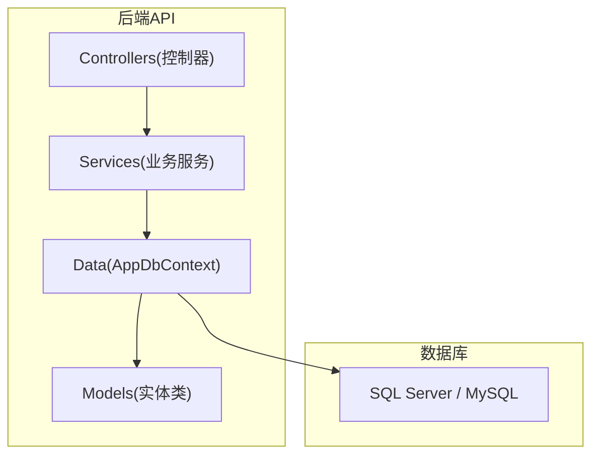
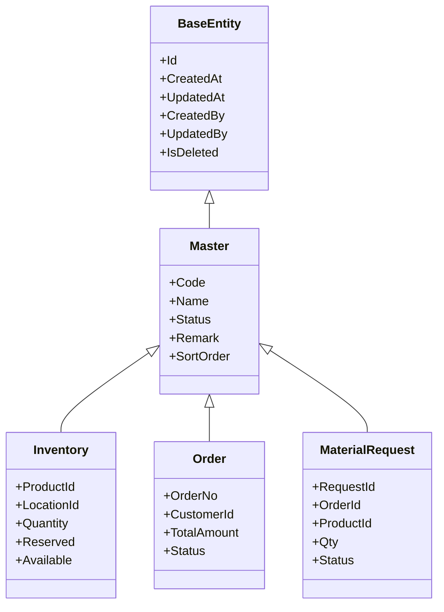
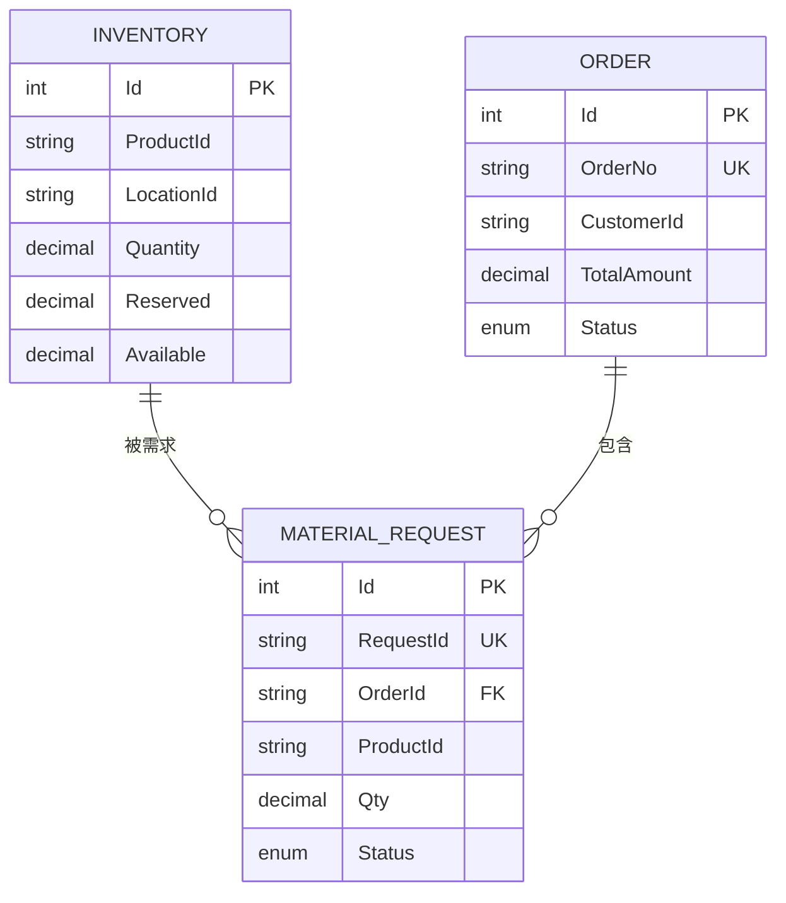
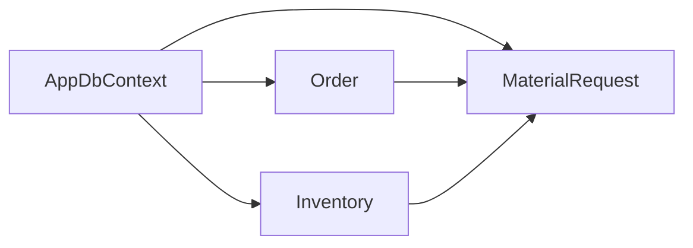

# 数据模型设计

<cite>
**本文引用的文件**   
- [BaseEntity.cs](file://dip-system/api/Models/BaseEntity.cs)
- [Master.cs](file://dip-system/api/Models/Master.cs)
- [AppDbContext.cs](file://dip-system/api/Data/AppDbContext.cs)
- [init-db.sql](file://scripts/init-db.sql)
- [Abnormal.cs](file://dip-system/api/Models/Abnormal.cs)
- [Changeover.cs](file://dip-system/api/Models/Changeover.cs)
- [Inventory.cs](file://dip-system/api/Models/Inventory.cs)
- [MaterialRequest.cs](file://dip-system/api/Models/MaterialRequest.cs)
- [Online.cs](file://dip-system/api/Models/Online.cs)
- [Order.cs](file://dip-system/api/Models/Order.cs)
- [Outbound.cs](file://dip-system/api/Models/Outbound.cs)
- [Prep.cs](file://dip-system/api/Models/Prep.cs)
- [Refill.cs](file://dip-system/api/Models/Refill.cs)
- [Return.cs](file://dip-system/api/Models/Return.cs)
- [Shelving.cs](file://dip-system/api/Models/Shelving.cs)
- [StockCount.cs](file://dip-system/api/Models/StockCount.cs)
- [SubstituteOrder.cs](file://dip-system/api/Models/SubstituteOrder.cs)
- [SubstituteRecord.cs](file://dip-system/api/Models/SubstituteRecord.cs)
- [Transfer.cs](file://dip-system/api/Models/Transfer.cs)
</cite>

## 目录
1. [引言](#引言)
2. [项目结构](#项目结构)
3. [核心组件](#核心组件)
4. [架构总览](#架构总览)
5. [详细组件分析](#详细组件分析)
6. [依赖关系分析](#依赖关系分析)
7. [性能考虑](#性能考虑)
8. [故障排查指南](#故障排查指南)
9. [结论](#结论)
10. [附录](#附录)

## 引言
本文件面向DIP系统的数据模型设计，聚焦实体关系模型（ERM）与领域实体的建模规范。内容涵盖主表、明细表、关联表的设计原则；基础实体类的继承体系（如通用审计字段、主键策略等）；各业务实体的字段定义、数据类型与约束规则；数据库索引策略、查询优化方案与数据迁移管理；数据完整性约束、外键关系与级联操作；以及数据字典、枚举值定义与业务规则验证。文档同时提供数据库Schema图、ER关系图与示例数据说明，帮助读者快速理解并正确扩展系统数据模型。

## 项目结构
DIP系统的后端采用C# ASP.NET Core，数据访问层基于Entity Framework Core。核心数据模型位于api/Models目录，上下文配置在api/Data/AppDbContext.cs，数据库初始化脚本位于scripts/init-db.sql。前端与移动端通过API与后端交互，但本文件仅关注数据模型与持久化设计。

图表来源 
- [AppDbContext.cs](file://dip-system/api/Data/AppDbContext.cs)
- [BaseEntity.cs](file://dip-system/api/Models/BaseEntity.cs)
- [Master.cs](file://dip-system/api/Models/Master.cs)

章节来源
- [AppDbContext.cs](file://dip-system/api/Data/AppDbContext.cs)
- [BaseEntity.cs](file://dip-system/api/Models/BaseEntity.cs)
- [Master.cs](file://dip-system/api/Models/Master.cs)

## 核心组件
本节梳理基础实体与通用字段的继承体系，明确主表、明细表、关联表的建模约定。

- 基础实体 BaseEntity
  - 职责：统一标识、创建/更新审计、软删除等通用字段。
  - 典型字段：主键Id、创建时间、更新时间、创建人、更新人、是否删除标记等。
  - 设计要点：所有持久化实体建议继承该基类，确保审计一致性与查询过滤一致性。

- 主实体 Master
  - 职责：作为“主表”的基类，承载主从关系的“主”侧通用属性。
  - 典型字段：编号、名称、状态、备注、排序等。
  - 设计要点：主实体通常与多个明细实体存在一对多关系，便于分页与汇总统计。

- 明细实体与关联实体
  - 明细实体：继承自基础实体或主实体，用于记录主实体的具体行项。
  - 关联实体：用于多对多或弱关联场景，包含双向外键与必要描述字段。

- 命名与类型约定
  - 主键：统一使用整型或GUID（由上下文配置决定）。
  - 时间戳：使用可空/非空DateTime或DateTimeOffset，遵循时区策略。
  - 字符串长度：根据业务语义设置合理MaxLength，避免过长存储。
  - 布尔字段：用于开关、状态位等二元选择。

章节来源
- [BaseEntity.cs](file://dip-system/api/Models/BaseEntity.cs)
- [Master.cs](file://dip-system/api/Models/Master.cs)

## 架构总览
下图展示数据模型在EF Core中的映射关系与上下文配置位置，体现“实体类—上下文—数据库”的三层映射。

图表来源 
- [BaseEntity.cs](file://dip-system/api/Models/BaseEntity.cs)
- [Master.cs](file://dip-system/api/Models/Master.cs)
- [Inventory.cs](file://dip-system/api/Models/Inventory.cs)
- [Order.cs](file://dip-system/api/Models/Order.cs)
- [MaterialRequest.cs](file://dip-system/api/Models/MaterialRequest.cs)

章节来源
- [AppDbContext.cs](file://dip-system/api/Data/AppDbContext.cs)
- [BaseEntity.cs](file://dip-system/api/Models/BaseEntity.cs)
- [Master.cs](file://dip-system/api/Models/Master.cs)

## 详细组件分析

### 基础实体与主实体继承体系
- BaseEntity
  - 提供统一的审计字段与软删除能力，简化跨实体的筛选与日志追踪。
  - 建议在上下文中为IsDeleted添加全局过滤器，避免重复逻辑。

- Master
  - 作为主表基类，集中编码、名称、状态、备注、排序等常用字段。
  - 与明细表通过外键建立一对多关系，支持分页、汇总与报表。

章节来源
- [BaseEntity.cs](file://dip-system/api/Models/BaseEntity.cs)
- [Master.cs](file://dip-system/api/Models/Master.cs)

### 库存与订单相关实体
- Inventory（库存）
  - 关键字段：产品ID、库位ID、数量、预留量、可用量。
  - 约束：数量不可为负；可用量=数量-预留量；唯一性可按产品+库位组合。
  - 索引：按产品ID、库位ID、可用量建立复合索引以优化查询。

- Order（订单）
  - 关键字段：订单号、客户ID、总金额、状态。
  - 约束：订单号唯一；状态为枚举；金额精度与舍入策略需明确。
  - 索引：订单号唯一索引；客户ID与状态复合索引。

- MaterialRequest（物料需求）
  - 关键字段：需求单号、订单ID、产品ID、数量、状态。
  - 约束：需求数量>0；状态流转受业务规则限制。
  - 索引：订单ID、产品ID、状态复合索引。

章节来源
- [Inventory.cs](file://dip-system/api/Models/Inventory.cs)
- [Order.cs](file://dip-system/api/Models/Order.cs)
- [MaterialRequest.cs](file://dip-system/api/Models/MaterialRequest.cs)

### 异常、换线、上线、备料、补料、退货、上架、盘点、替代、调拨
- Abnormal（异常）
  - 记录生产或仓储过程中的异常事件，包含异常类型、描述、处理状态等。
  - 索引：异常类型、发生时间、处理状态。

- Changeover（换线）
  - 记录产线换线计划与执行信息，包含目标产品、开始/结束时间、状态。
  - 索引：产线ID、时间范围、状态。

- Online（上线）
  - 记录物料上线批次与参数，包含批次号、上线数量、状态。
  - 索引：批次号、上线时间、状态。

- Prep（备料）
  - 记录备料任务与执行情况，包含任务号、产品、数量、状态。
  - 索引：任务号、产品ID、状态。

- Refill（补料）
  - 记录补料申请与执行，包含申请单号、产品、数量、状态。
  - 索引：申请单号、产品ID、状态。

- Return（退货）
  - 记录退货流程，包含退货单号、产品、数量、原因、状态。
  - 索引：退货单号、产品ID、状态。

- Shelving（上架）
  - 记录物料上架操作，包含批次、库位、数量、状态。
  - 索引：批次号、库位ID、状态。

- StockCount（盘点）
  - 记录盘点任务与结果，包含盘点单号、库位、差异、状态。
  - 索引：盘点单号、库位ID、状态。

- SubstituteOrder（替代订单）
  - 记录替代方案与审批流，包含原产品、替代品、数量、状态。
  - 索引：原产品ID、替代品ID、状态。

- SubstituteRecord（替代记录）
  - 记录实际替代执行明细，包含批次、数量、时间、状态。
  - 索引：批次号、时间、状态。

- Transfer（调拨）
  - 记录库间调拨，包含调拨单号、源库位、目标库位、数量、状态。
  - 索引：调拨单号、源库位ID、目标库位ID、状态。

章节来源
- [Abnormal.cs](file://dip-system/api/Models/Abnormal.cs)
- [Changeover.cs](file://dip-system/api/Models/Changeover.cs)
- [Online.cs](file://dip-system/api/Models/Online.cs)
- [Prep.cs](file://dip-system/api/Models/Prep.cs)
- [Refill.cs](file://dip-system/api/Models/Refill.cs)
- [Return.cs](file://dip-system/api/Models/Return.cs)
- [Shelving.cs](file://dip-system/api/Models/Shelving.cs)
- [StockCount.cs](file://dip-system/api/Models/StockCount.cs)
- [SubstituteOrder.cs](file://dip-system/api/Models/SubstituteOrder.cs)
- [SubstituteRecord.cs](file://dip-system/api/Models/SubstituteRecord.cs)
- [Transfer.cs](file://dip-system/api/Models/Transfer.cs)

### ER关系图（概念）
以下ER图展示主表、明细表与关联表之间的关系，强调一对多与多对多的常见模式。

图表来源 
- [Inventory.cs](file://dip-system/api/Models/Inventory.cs)
- [Order.cs](file://dip-system/api/Models/Order.cs)
- [MaterialRequest.cs](file://dip-system/api/Models/MaterialRequest.cs)

### 数据迁移与初始化
- 迁移策略
  - 使用EF Core迁移工具进行版本控制，每次变更生成迁移脚本。
  - 将关键DDL与数据种子放入scripts/init-db.sql，便于环境初始化与回滚。

- 初始化脚本
  - scripts/init-db.sql包含建表语句、默认数据与索引创建，确保新环境可直接运行。

章节来源
- [AppDbContext.cs](file://dip-system/api/Data/AppDbContext.cs)
- [init-db.sql](file://scripts/init-db.sql)

## 依赖关系分析
- 实体到上下文
  - AppDbContext中注册所有实体，配置关系映射、索引与约束。
  - 通过HasOne/WithMany、HasMany/WithOne等方法表达一对多关系。

- 实体间耦合
  - 主实体与明细实体通过外键耦合，避免循环引用。
  - 关联实体用于解耦多对多关系，保持清晰的数据流向。

图表来源 
- [AppDbContext.cs](file://dip-system/api/Data/AppDbContext.cs)
- [Inventory.cs](file://dip-system/api/Models/Inventory.cs)
- [Order.cs](file://dip-system/api/Models/Order.cs)
- [MaterialRequest.cs](file://dip-system/api/Models/MaterialRequest.cs)

章节来源
- [AppDbContext.cs](file://dip-system/api/Data/AppDbContext.cs)

## 性能考虑
- 索引策略
  - 高频查询字段建立索引，如产品ID、库位ID、订单号、状态。
  - 复合索引覆盖常见查询条件，减少回表开销。

- 查询优化
  - 使用投影只取必要字段，避免N+1问题。
  - 分页查询结合排序字段索引，提升大数据集性能。

- 事务与并发
  - 写操作使用短事务，避免长事务锁资源。
  - 并发更新使用乐观锁（版本号）或悲观锁（行级锁）策略。

[本节为通用指导，不直接分析具体文件]

## 故障排查指南
- 常见问题
  - 外键约束失败：检查关联实体是否存在对应主记录。
  - 唯一约束冲突：确认编号、订单号等唯一字段未重复。
  - 软删除导致查询不到：检查全局过滤器是否正确启用。

- 调试建议
  - 启用EF Core日志输出，查看生成的SQL与执行计划。
  - 使用数据库监控工具定位慢查询与锁等待。

章节来源
- [AppDbContext.cs](file://dip-system/api/Data/AppDbContext.cs)
- [init-db.sql](file://scripts/init-db.sql)

## 结论
本文件系统化梳理了DIP系统的数据模型设计，包括基础实体继承体系、主从表建模规范、索引与查询优化策略、数据迁移管理与完整性约束。通过ER关系图与依赖分析，帮助开发者理解实体间的关系与数据流向。建议在扩展新业务实体时，遵循现有命名与约束约定，确保系统的一致性与可维护性。

[本节为总结性内容，不直接分析具体文件]

## 附录
- 数据字典与枚举
  - 状态枚举：如订单状态、需求状态、异常状态等，需在实体与API层保持一致。
  - 业务规则：如数量非负、可用量计算、状态流转顺序等，应在服务层进行校验。

- 示例数据
  - 在scripts/init-db.sql中提供最小可用数据集，便于本地测试与演示。

[本节为补充说明，不直接分析具体文件]