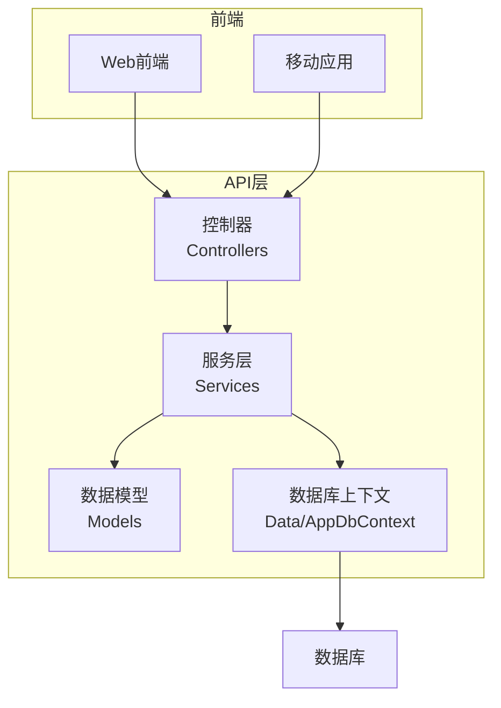
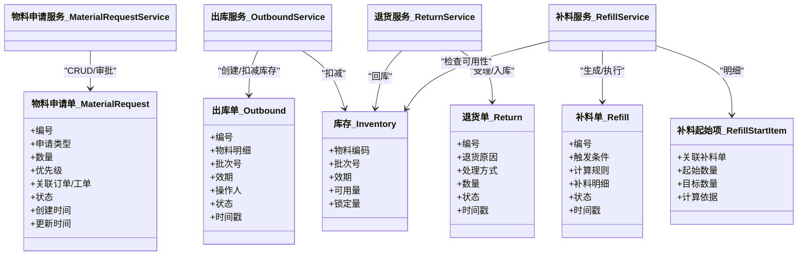
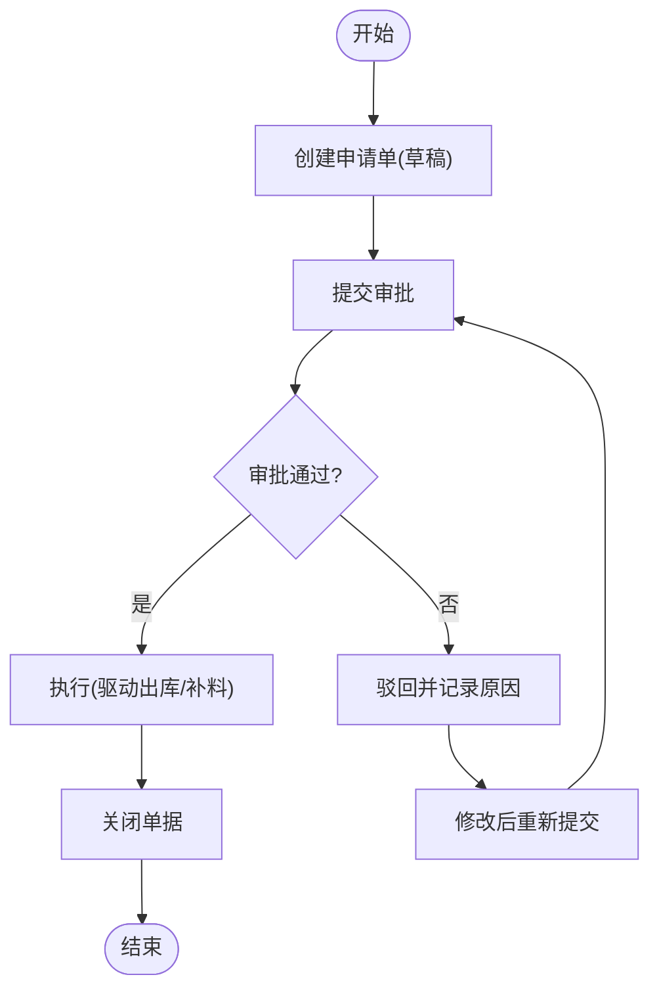
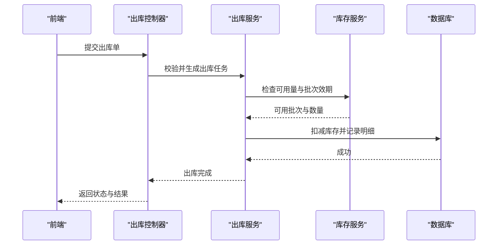
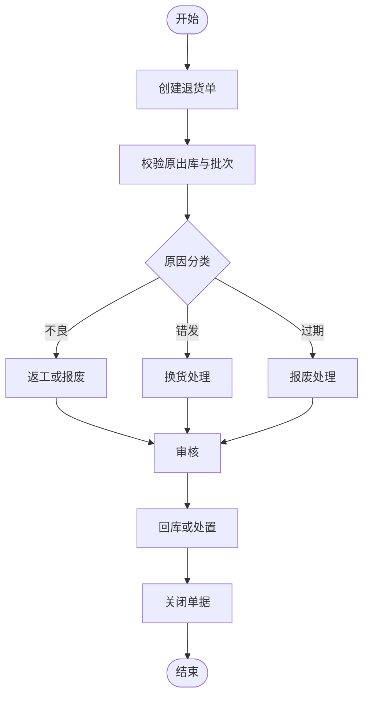
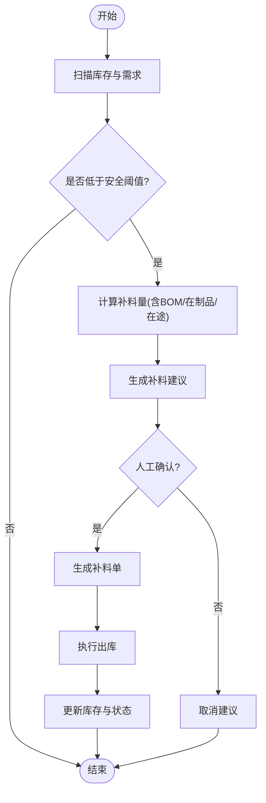
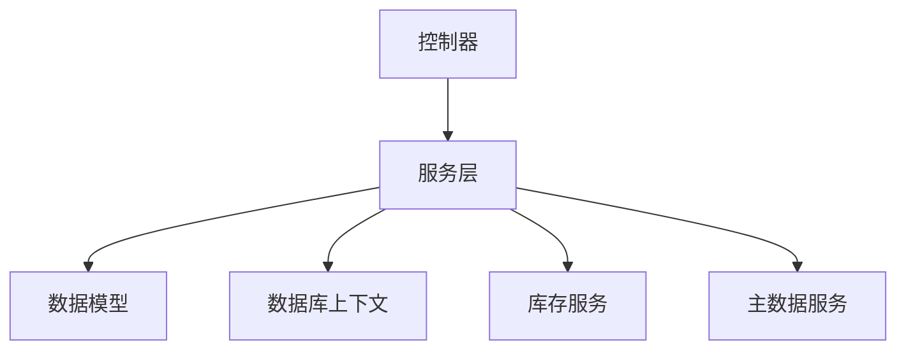

# 物料管理模型

<cite>
**本文引用的文件**   
- [MaterialRequest.cs](file://dip-system/api/Models/MaterialRequest.cs)
- [Outbound.cs](file://dip-system/api/Models/Outbound.cs)
- [Return.cs](file://dip-system/api/Models/Return.cs)
- [Refill.cs](file://dip-system/api/Models/Refill.cs)
- [RefillStartItem.cs](file://dip-system/api/Models/RefillStartItem.cs)
- [Inventory.cs](file://dip-system/api/Models/Inventory.cs)
- [Master.cs](file://dip-system/api/Models/Master.cs)
- [BaseEntity.cs](file://dip-system/api/Models/BaseEntity.cs)
- [MaterialRequestService.cs](file://dip-system/api/Services/MaterialRequestService.cs)
- [OutboundService.cs](file://dip-system/api/Services/OutboundService.cs)
- [ReturnService.cs](file://dip-system/api/Services/ReturnService.cs)
- [RefillService.cs](file://dip-system/api/Services/RefillService.cs)
- [MaterialRequestController.cs](file://dip-system/api/Controllers/MaterialRequestController.cs)
- [OutboundController.cs](file://dip-system/api/Controllers/OutboundController.cs)
- [ReturnController.cs](file://dip-system/api/Controllers/ReturnController.cs)
- [RefillController.cs](file://dip-system/api/Controllers/RefillController.cs)
- [AppDbContext.cs](file://dip-system/api/Data/AppDbContext.cs)
</cite>

## 目录
1. [简介](#简介)
2. [项目结构](#项目结构)
3. [核心组件](#核心组件)
4. [架构总览](#架构总览)
5. [详细组件分析](#详细组件分析)
6. [依赖关系分析](#依赖关系分析)
7. [性能考虑](#性能考虑)
8. [故障排查指南](#故障排查指南)
9. [结论](#结论)
10. [附录](#附录)

## 简介
本文件面向DIP系统的物料管理模型，围绕以下核心单据与能力进行系统化说明：
- 物料申请单（MaterialRequest）：定义申请类型、数量、优先级等关键字段，支撑生产领料与异常补料等场景。
- 出库单（Outbound）：记录物料出库流程与状态流转，确保库存扣减与追溯完整。
- 退货单（Return）：支持多种退货场景的数据设计与处理规则。
- 补料单（Refill）：自动补料触发条件与计算规则，联动库存与生产需求。
- 物料流转追踪、批次管理与效期控制：贯穿出入库与在制品环节的全链路可追溯。
- 业务规则、审批流程与异常处理：覆盖常见边界情况与错误恢复策略。

## 项目结构
DIP系统采用分层架构：API层包含控制器（Controllers）、服务（Services）、数据模型（Models）与数据库上下文（Data）。前端Web与移动端通过REST API与后端交互。

图表来源
- [AppDbContext.cs](file://dip-system/api/Data/AppDbContext.cs)
- [MaterialRequestController.cs](file://dip-system/api/Controllers/MaterialRequestController.cs)
- [OutboundController.cs](file://dip-system/api/Controllers/OutboundController.cs)
- [ReturnController.cs](file://dip-system/api/Controllers/ReturnController.cs)
- [RefillController.cs](file://dip-system/api/Controllers/RefillController.cs)

章节来源
- [AppDbContext.cs](file://dip-system/api/Data/AppDbContext.cs)
- [MaterialRequestController.cs](file://dip-system/api/Controllers/MaterialRequestController.cs)
- [OutboundController.cs](file://dip-system/api/Controllers/OutboundController.cs)
- [ReturnController.cs](file://dip-system/api/Controllers/ReturnController.cs)
- [RefillController.cs](file://dip-system/api/Controllers/RefillController.cs)

## 核心组件
- 数据模型（Models）
  - BaseEntity：所有实体的公共基类，提供通用标识与审计字段。
  - Master：主数据实体基类，用于物料、仓库、供应商等基础信息。
  - Inventory：库存实体，记录批次、效期、可用量等关键属性。
  - MaterialRequest：物料申请单，承载申请类型、数量、优先级、关联订单/工单等信息。
  - Outbound：出库单，记录出库明细、批次、效期、操作人、时间戳及状态。
  - Return：退货单，支持多场景退货（来料不良、错发、过期等），记录原因与处理方式。
  - Refill/RefillStartItem：补料单与补料起始项，描述自动补料触发与计算结果。
- 服务层（Services）
  - MaterialRequestService：申请单的创建、校验、审批与状态流转。
  - OutboundService：出库单的生成、校验、库存扣减与状态变更。
  - ReturnService：退货单的受理、审核、入库与差异处理。
  - RefillService：补料单的自动生成、计算与执行。
- 控制器（Controllers）
  - 对应各业务的REST接口，负责请求解析、参数校验与服务调用。
- 数据访问（Data）
  - AppDbContext：EF Core上下文，映射实体到数据库表，维护关系与约束。

章节来源
- [BaseEntity.cs](file://dip-system/api/Models/BaseEntity.cs)
- [Master.cs](file://dip-system/api/Models/Master.cs)
- [Inventory.cs](file://dip-system/api/Models/Inventory.cs)
- [MaterialRequest.cs](file://dip-system/api/Models/MaterialRequest.cs)
- [Outbound.cs](file://dip-system/api/Models/Outbound.cs)
- [Return.cs](file://dip-system/api/Models/Return.cs)
- [Refill.cs](file://dip-system/api/Models/Refill.cs)
- [RefillStartItem.cs](file://dip-system/api/Models/RefillStartItem.cs)
- [MaterialRequestService.cs](file://dip-system/api/Services/MaterialRequestService.cs)
- [OutboundService.cs](file://dip-system/api/Services/OutboundService.cs)
- [ReturnService.cs](file://dip-system/api/Services/ReturnService.cs)
- [RefillService.cs](file://dip-system/api/Services/RefillService.cs)
- [AppDbContext.cs](file://dip-system/api/Data/AppDbContext.cs)

## 架构总览
下图展示物料管理相关控制器、服务与模型的交互关系，以及数据流向。

图表来源
- [MaterialRequest.cs](file://dip-system/api/Models/MaterialRequest.cs)
- [Outbound.cs](file://dip-system/api/Models/Outbound.cs)
- [Return.cs](file://dip-system/api/Models/Return.cs)
- [Refill.cs](file://dip-system/api/Models/Refill.cs)
- [RefillStartItem.cs](file://dip-system/api/Models/RefillStartItem.cs)
- [Inventory.cs](file://dip-system/api/Models/Inventory.cs)
- [MaterialRequestService.cs](file://dip-system/api/Services/MaterialRequestService.cs)
- [OutboundService.cs](file://dip-system/api/Services/OutboundService.cs)
- [ReturnService.cs](file://dip-system/api/Services/ReturnService.cs)
- [RefillService.cs](file://dip-system/api/Services/RefillService.cs)

## 详细组件分析

### 物料申请单（MaterialRequest）
- 数据结构要点
  - 申请类型：区分生产领料、异常补料、调拨申请等。
  - 数量：申请总量，支持单位换算与精度控制。
  - 优先级：高/中/低，影响审批与调度顺序。
  - 关联信息：订单或工单编号、物料编码、仓库位置。
  - 状态：草稿、待审批、已批准、已拒绝、已执行、已关闭。
  - 审计字段：创建人、创建时间、更新人、更新时间。
- 业务流程
  - 创建申请单并保存草稿。
  - 提交审批，按优先级路由至相应审批人。
  - 批准后进入执行阶段，驱动后续出库或补料。
  - 执行完成后关闭单据。
- 异常处理
  - 数量超限、物料不可用、优先级冲突等校验失败时返回明确错误码。
  - 审批超时或驳回后允许重新编辑与提交。

章节来源
- [MaterialRequest.cs](file://dip-system/api/Models/MaterialRequest.cs)
- [MaterialRequestService.cs](file://dip-system/api/Services/MaterialRequestService.cs)
- [MaterialRequestController.cs](file://dip-system/api/Controllers/MaterialRequestController.cs)

### 出库单（Outbound）
- 数据结构要点
  - 出库明细：物料编码、批次号、数量、效期、库位。
  - 操作信息：操作人、操作时间、备注。
  - 状态：待出库、部分出库、已完成、已取消。
- 出库流程
  - 根据申请单生成出库任务。
  - 校验库存可用性与批次效期。
  - 扣减库存并记录批次与效期。
  - 完成出库后更新状态并归档。
- 批次与效期控制
  - 优先使用先到期先出（FEFO）策略。
  - 批次唯一性校验与追溯链构建。

图表来源
- [Outbound.cs](file://dip-system/api/Models/Outbound.cs)
- [OutboundService.cs](file://dip-system/api/Services/OutboundService.cs)
- [OutboundController.cs](file://dip-system/api/Controllers/OutboundController.cs)
- [Inventory.cs](file://dip-system/api/Models/Inventory.cs)

章节来源
- [Outbound.cs](file://dip-system/api/Models/Outbound.cs)
- [OutboundService.cs](file://dip-system/api/Services/OutboundService.cs)
- [OutboundController.cs](file://dip-system/api/Controllers/OutboundController.cs)

### 退货单（Return）
- 数据结构要点
  - 退货原因：来料不良、错发、过期、客户退回等。
  - 处理方式：报废、返工、回库、换货。
  - 数量与批次：退货明细需精确到批次与效期。
  - 状态：待处理、已审核、已入库、已报废。
- 业务规则
  - 退货前需校验原出库记录与批次一致性。
  - 不同原因对应不同的处理路径与审批要求。
  - 支持部分退货与多次退货。

章节来源
- [Return.cs](file://dip-system/api/Models/Return.cs)
- [ReturnService.cs](file://dip-system/api/Services/ReturnService.cs)
- [ReturnController.cs](file://dip-system/api/Controllers/ReturnController.cs)

### 补料单（Refill）
- 数据结构要点
  - 触发条件：库存低于安全阈值、生产缺料报警、计划需求不足。
  - 计算规则：基于BOM用量、在制品占用、在途库存与安全库存计算补料量。
  - 补料明细：物料编码、批次、数量、目标库位。
  - 状态：待执行、执行中、已完成、已取消。
- 自动补料逻辑
  - 定时任务扫描库存与需求，生成补料建议。
  - 人工确认后生成正式补料单并驱动出库。
  - 执行完成后更新库存与单据状态。

章节来源
- [Refill.cs](file://dip-system/api/Models/Refill.cs)
- [RefillStartItem.cs](file://dip-system/api/Models/RefillStartItem.cs)
- [RefillService.cs](file://dip-system/api/Services/RefillService.cs)
- [RefillController.cs](file://dip-system/api/Controllers/RefillController.cs)

### 物料流转追踪、批次管理与效期控制
- 流转追踪
  - 从申请单到出库、退货、补料的全链路单据关联。
  - 每个节点记录操作人、时间与备注，形成审计轨迹。
- 批次管理
  - 批次号唯一性约束，支持批次拆分与合并。
  - 批次溯源：上游供应商批次、入库批次、出库批次。
- 效期控制
  - 入库登记效期，出库遵循FEFO策略。
  - 过期预警与拦截，防止超期物料流出。

章节来源
- [Inventory.cs](file://dip-system/api/Models/Inventory.cs)
- [Outbound.cs](file://dip-system/api/Models/Outbound.cs)
- [Return.cs](file://dip-system/api/Models/Return.cs)
- [Refill.cs](file://dip-system/api/Models/Refill.cs)

## 依赖关系分析
- 控制器依赖服务层，服务层依赖数据模型与数据库上下文。
- 库存服务被出库、退货、补料服务共同依赖，保证库存一致性。
- 主数据（Master）为物料、仓库、供应商等基础信息源。

图表来源
- [MaterialRequestController.cs](file://dip-system/api/Controllers/MaterialRequestController.cs)
- [OutboundController.cs](file://dip-system/api/Controllers/OutboundController.cs)
- [ReturnController.cs](file://dip-system/api/Controllers/ReturnController.cs)
- [RefillController.cs](file://dip-system/api/Controllers/RefillController.cs)
- [MaterialRequestService.cs](file://dip-system/api/Services/MaterialRequestService.cs)
- [OutboundService.cs](file://dip-system/api/Services/OutboundService.cs)
- [ReturnService.cs](file://dip-system/api/Services/ReturnService.cs)
- [RefillService.cs](file://dip-system/api/Services/RefillService.cs)
- [AppDbContext.cs](file://dip-system/api/Data/AppDbContext.cs)

章节来源
- [AppDbContext.cs](file://dip-system/api/Data/AppDbContext.cs)
- [MaterialRequestService.cs](file://dip-system/api/Services/MaterialRequestService.cs)
- [OutboundService.cs](file://dip-system/api/Services/OutboundService.cs)
- [ReturnService.cs](file://dip-system/api/Services/ReturnService.cs)
- [RefillService.cs](file://dip-system/api/Services/RefillService.cs)

## 性能考虑
- 批量操作：出库与退货的批量扣减与入库应使用事务与批量写入，减少数据库往返。
- 索引优化：对物料编码、批次号、效期、状态等高频查询字段建立索引。
- 缓存策略：主数据与字典信息可使用内存缓存，降低重复查询开销。
- 异步处理：审批通知、报表生成等非实时任务采用异步队列处理。
- 分页与过滤：列表查询默认分页，支持多维度过滤与排序。

[本节为通用指导，不直接分析具体文件]

## 故障排查指南
- 常见问题
  - 库存不足：检查可用量与锁定量，确认是否有未完成的出库或退货。
  - 批次冲突：核对批次号唯一性与效期范围，避免重复或过期批次。
  - 审批失败：查看审批流配置与权限设置，确认审批人有效。
- 日志与审计
  - 启用操作日志与审计轨迹，定位问题发生节点。
  - 关键状态变更需记录前后值对比，便于回溯。
- 恢复策略
  - 支持单据撤销与重做，确保数据一致性。
  - 提供补偿事务，处理部分失败场景。

章节来源
- [MaterialRequestService.cs](file://dip-system/api/Services/MaterialRequestService.cs)
- [OutboundService.cs](file://dip-system/api/Services/OutboundService.cs)
- [ReturnService.cs](file://dip-system/api/Services/ReturnService.cs)
- [RefillService.cs](file://dip-system/api/Services/RefillService.cs)

## 结论
DIP系统物料管理模型以清晰的单据结构与严谨的流程控制为核心，覆盖申请、出库、退货、补料全生命周期。通过批次与效期管理、流转追踪与异常处理机制，保障库存准确性与可追溯性。建议在实施过程中结合业务实际细化审批流与规则配置，并持续优化性能与用户体验。

[本节为总结性内容，不直接分析具体文件]

## 附录
- 术语表
  - FEFO：先到期先出（First Expired First Out）
  - BOM：物料清单（Bill of Materials）
  - 在制品：正在加工中的半成品
- 参考实现
  - 控制器与服务层的接口定义与调用约定
  - 数据模型的字段约束与关系映射

[本节为补充信息，不直接分析具体文件]