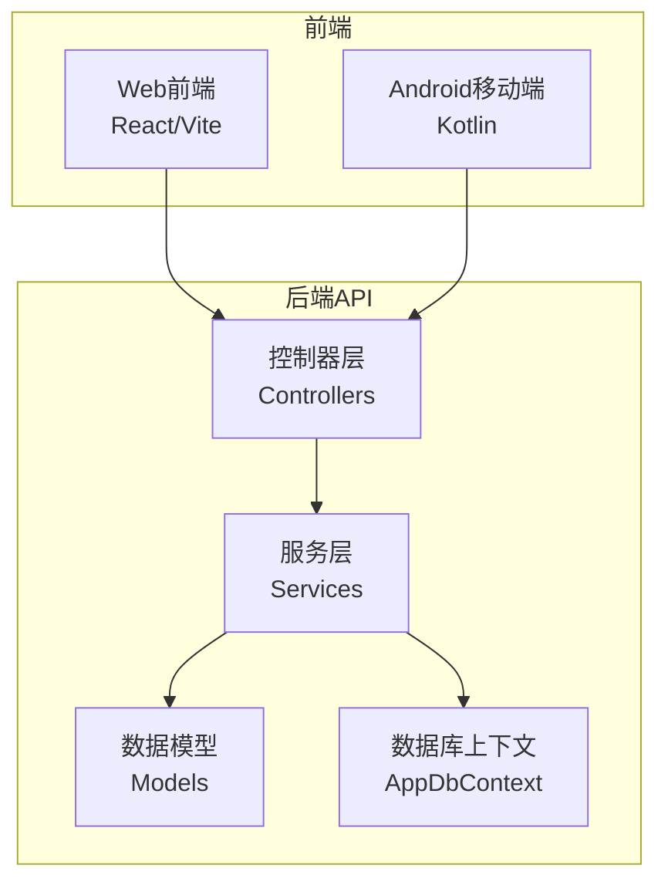
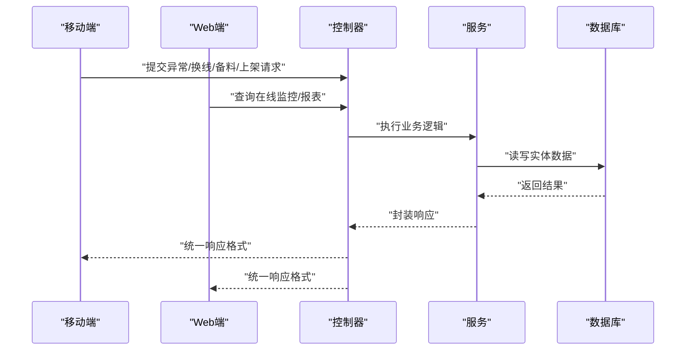
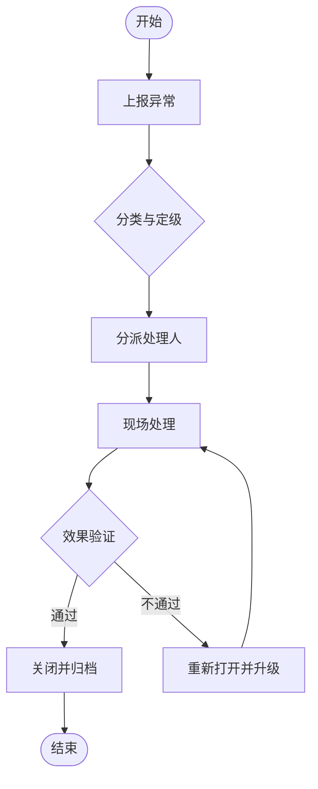
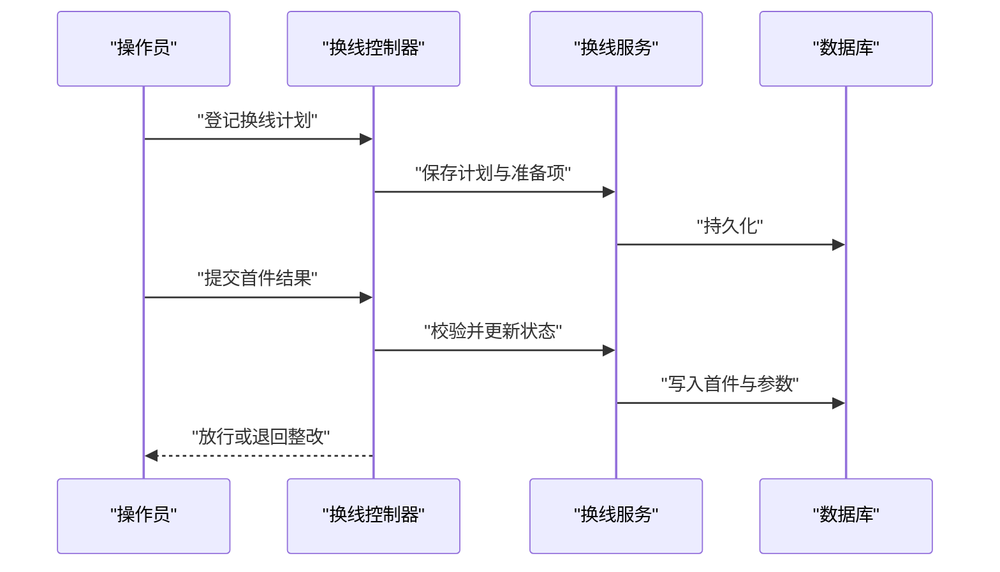
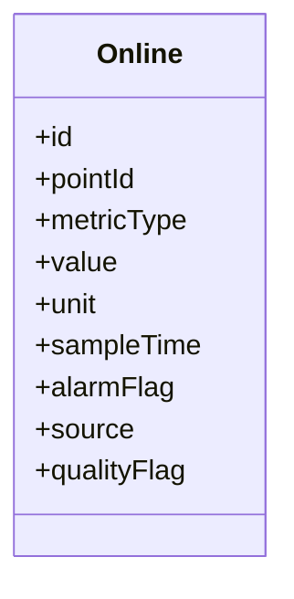
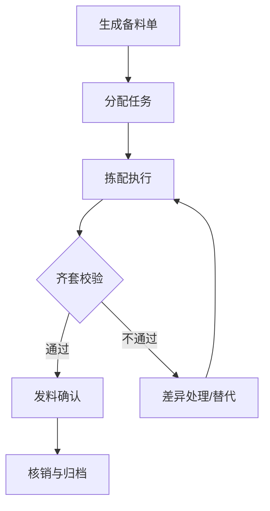
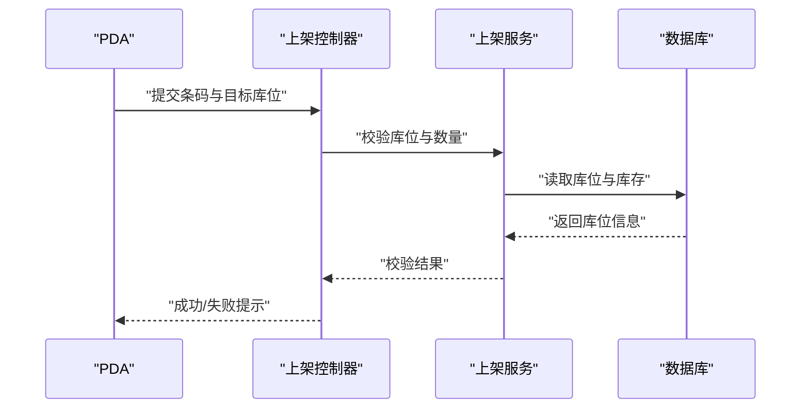
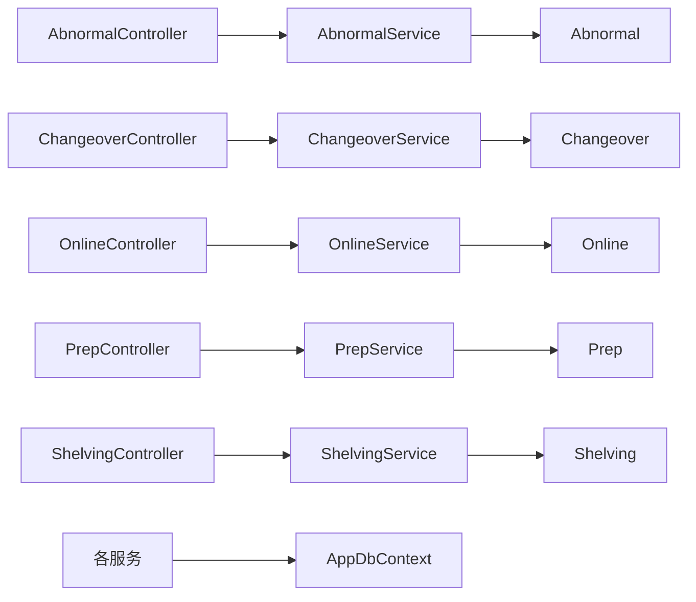

# 生产支持模型

<cite>
**本文引用的文件**   
- [Abnormal.cs](file://dip-system/api/Models/Abnormal.cs)
- [AbnormalController.cs](file://dip-system/api/Controllers/AbnormalController.cs)
- [AbnormalService.cs](file://dip-system/api/Services/AbnormalService.cs)
- [Changeover.cs](file://dip-system/api/Models/Changeover.cs)
- [ChangeoverController.cs](file://dip-system/api/Controllers/ChangeoverController.cs)
- [ChangeoverService.cs](file://dip-system/api/Services/ChangeoverService.cs)
- [Online.cs](file://dip-system/api/Models/Online.cs)
- [OnlineController.cs](file://dip-system/api/Controllers/OnlineController.cs)
- [OnlineService.cs](file://dip-system/api/Services/OnlineService.cs)
- [Prep.cs](file://dip-system/api/Models/Prep.cs)
- [PrepController.cs](file://dip-system/api/Controllers/PrepController.cs)
- [PrepService.cs](file://dip-system/api/Services/PrepService.cs)
- [Shelving.cs](file://dip-system/api/Models/Shelving.cs)
- [ShelvingController.cs](file://dip-system/api/Controllers/ShelvingController.cs)
- [ShelvingService.cs](file://dip-system/api/Services/ShelvingService.cs)
- [AppDbContext.cs](file://dip-system/api/Data/AppDbContext.cs)
- [Program.cs](file://dip-system/api/Program.cs)
- [appsettings.json](file://dip-system/api/appsettings.json)
- [ApiService.kt](file://mobile-android/app/src/main/java/com/dip/material/data/network/ApiService.kt)
- [RetrofitClient.kt](file://mobile-android/app/src/main/java/com/dip/material/data/network/RetrofitClient.kt)
- [CallMaterialScreen.kt](file://mobile-android/app/src/main/java/com/dip/material/ui/callmaterial/CallMaterialScreen.kt)
- [ChangeoverScreen.kt](file://mobile-android/app/src/main/java/com/dip/material/ui/changeover/ChangeoverScreen.kt)
- [OnlineScreen.kt](file://mobile-android/app/src/main/java/com/dip/material/ui/online/OnlineScreen.kt)
- [PrepScreen.kt](file://mobile-android/app/src/main/java/com/dip/material/ui/prep/PrepScreen.kt)
- [ShelvingScreen.kt](file://mobile-android/app/src/main/java/com/dip/material/ui/shelving/ShelvingScreen.kt)
- [BarcodeTextField.tsx](file://dip-system/frontend-web/src/lib/BarcodeTextField.tsx)
- [AbnormalList.tsx](file://dip-system/frontend-web/src/pages/AbnormalList.tsx)
- [ChangeoverList.tsx](file://dip-system/frontend-web/src/pages/ChangeoverList.tsx)
- [OnlineList.tsx](file://dip-system/frontend-web/src/pages/OnlineList.tsx)
- [PrepList.tsx](file://dip-system/frontend-web/src/pages/PrepList.tsx)
- [InventoryList.tsx](file://dip-system/frontend-web/src/pages/InventoryList.tsx)
</cite>

## 目录
1. [引言](#引言)
2. [项目结构](#项目结构)
3. [核心组件](#核心组件)
4. [架构总览](#架构总览)
5. [详细组件分析](#详细组件分析)
6. [依赖关系分析](#依赖关系分析)
7. [性能考虑](#性能考虑)
8. [故障排查指南](#故障排查指南)
9. [结论](#结论)
10. [附录](#附录)

## 引言
本文件面向DIP系统的“生产支持模型”，聚焦异常记录、换线管理、在线监控、备料单与上架作业五大业务域的数据模型、处理流程与前后端集成方式。文档同时给出数据采集、存储与分析方案，并补充质量控制与追溯管理的业务规则建议，帮助开发与运维团队快速理解与落地。

## 项目结构
后端采用ASP.NET Core Web API，按功能划分控制器（Controllers）、服务（Services）与数据模型（Models），通过Entity Framework的DbContext进行数据访问；前端包含Web界面与Android移动端，均通过REST API与后端交互。

图表来源
- [Program.cs](file://dip-system/api/Program.cs)
- [AppDbContext.cs](file://dip-system/api/Data/AppDbContext.cs)

章节来源
- [Program.cs](file://dip-system/api/Program.cs)
- [AppDbContext.cs](file://dip-system/api/Data/AppDbContext.cs)

## 核心组件
围绕生产支持的五个关键领域，系统提供如下核心组件：
- 异常记录（Abnormal）：记录设备、工艺、质量等异常事件，支持分类、等级、处理状态与闭环跟踪。
- 换线管理（Changeover）：记录换线参数、准备时间、效率统计与批次关联，支撑OEE计算与排产优化。
- 在线监控（Online）：采集设备运行、产量、良率、报警等实时指标，提供看板与告警能力。
- 备料单（Prep）：定义备料任务、物料清单、分配执行与完成确认，保障上线齐套性。
- 上架作业（Shelving）：条码扫描驱动的上架流程，支持库位校验、数量核对与差异处理。

章节来源
- [Abnormal.cs](file://dip-system/api/Models/Abnormal.cs)
- [Changeover.cs](file://dip-system/api/Models/Changeover.cs)
- [Online.cs](file://dip-system/api/Models/Online.cs)
- [Prep.cs](file://dip-system/api/Models/Prep.cs)
- [Shelving.cs](file://dip-system/api/Models/Shelving.cs)

## 架构总览
整体采用分层架构：前端通过REST调用控制器，控制器委托服务处理业务逻辑，服务通过EF访问数据库。移动端与Web端共享同一API契约，保证数据一致性。

图表来源
- [AbnormalController.cs](file://dip-system/api/Controllers/AbnormalController.cs)
- [AbnormalService.cs](file://dip-system/api/Services/AbnormalService.cs)
- [ChangeoverController.cs](file://dip-system/api/Controllers/ChangeoverController.cs)
- [ChangeoverService.cs](file://dip-system/api/Services/ChangeoverService.cs)
- [OnlineController.cs](file://dip-system/api/Controllers/OnlineController.cs)
- [OnlineService.cs](file://dip-system/api/Services/OnlineService.cs)
- [PrepController.cs](file://dip-system/api/Controllers/PrepController.cs)
- [PrepService.cs](file://dip-system/api/Services/PrepService.cs)
- [ShelvingController.cs](file://dip-system/api/Controllers/ShelvingController.cs)
- [ShelvingService.cs](file://dip-system/api/Services/ShelvingService.cs)

## 详细组件分析

### 异常记录（Abnormal）
- 数据模型要点
  - 唯一标识、创建时间、更新时间与审计字段
  - 异常类型（设备/工艺/质量/安全等）、等级（严重/一般/提示）
  - 发生位置（产线/工位/设备）、描述与图片附件
  - 处理人、处理步骤、关闭原因与闭环时间
- 处理流程
  - 上报→分派→处理→验证→关闭→归档
  - 支持重复上报合并与升级策略
- 接口与服务
  - 控制器暴露增删改查与状态流转接口
  - 服务实现校验、权限控制、工作流推进与统计聚合

图表来源
- [AbnormalController.cs](file://dip-system/api/Controllers/AbnormalController.cs)
- [AbnormalService.cs](file://dip-system/api/Services/AbnormalService.cs)
- [Abnormal.cs](file://dip-system/api/Models/Abnormal.cs)

章节来源
- [Abnormal.cs](file://dip-system/api/Models/Abnormal.cs)
- [AbnormalController.cs](file://dip-system/api/Controllers/AbnormalController.cs)
- [AbnormalService.cs](file://dip-system/api/Services/AbnormalService.cs)

### 换线管理（Changeover）
- 数据模型要点
  - 换线批次号、计划工单、产品/版本信息
  - 换线前准备（工具/夹具/程序）、实际耗时与停机时长
  - 首件检验结果、参数偏移记录与效率指标（如换线时间目标达成率）
- 管理流程
  - 计划→准备→执行→首件确认→放行→统计
- 接口与服务
  - 控制器提供换线登记、首件录入、放行与查询
  - 服务负责数据校验、工时统计与OEE相关指标计算

图表来源
- [ChangeoverController.cs](file://dip-system/api/Controllers/ChangeoverController.cs)
- [ChangeoverService.cs](file://dip-system/api/Services/ChangeoverService.cs)
- [Changeover.cs](file://dip-system/api/Models/Changeover.cs)

章节来源
- [Changeover.cs](file://dip-system/api/Models/Changeover.cs)
- [ChangeoverController.cs](file://dip-system/api/Controllers/ChangeoverController.cs)
- [ChangeoverService.cs](file://dip-system/api/Services/ChangeoverService.cs)

### 在线监控（Online）
- 数据模型要点
  - 采集点（设备/工位/产线）、指标类型（产量/良率/温度/压力等）
  - 采样时间戳、原始值、阈值与报警状态
  - 数据来源（PLC/传感器/人工录入）、质量标记（有效/无效）
- 采集与展示
  - 高频采集入库，支持窗口聚合与趋势展示
  - 阈值越限触发告警，联动看板高亮与推送
- 接口与服务
  - 控制器提供批量上报、查询与聚合接口
  - 服务实现数据清洗、去重、聚合与缓存

图表来源
- [Online.cs](file://dip-system/api/Models/Online.cs)
- [OnlineController.cs](file://dip-system/api/Controllers/OnlineController.cs)
- [OnlineService.cs](file://dip-system/api/Services/OnlineService.cs)

章节来源
- [Online.cs](file://dip-system/api/Models/Online.cs)
- [OnlineController.cs](file://dip-system/api/Controllers/OnlineController.cs)
- [OnlineService.cs](file://dip-system/api/Services/OnlineService.cs)

### 备料单（Prep）
- 数据模型要点
  - 备料单号、关联工单/产品、BOM明细、需求数量与已备数量
  - 仓库/库位、供应商批次、效期与替代料策略
  - 任务分配（拣货员/区域）、执行状态（待备/部分备/已完成）
- 业务流程
  - 生成→分配→拣配→复核→发料→核销
- 接口与服务
  - 控制器提供备料单CRUD、任务分配与进度查询
  - 服务实现库存扣减、齐套检查与差异处理

图表来源
- [PrepController.cs](file://dip-system/api/Controllers/PrepController.cs)
- [PrepService.cs](file://dip-system/api/Services/PrepService.cs)
- [Prep.cs](file://dip-system/api/Models/Prep.cs)

章节来源
- [Prep.cs](file://dip-system/api/Models/Prep.cs)
- [PrepController.cs](file://dip-system/api/Controllers/PrepController.cs)
- [PrepService.cs](file://dip-system/api/Services/PrepService.cs)

### 上架作业（Shelving）
- 数据模型要点
  - 上架单号、条码（托盘/箱/单品）、目标库位、数量与单位
  - 扫描源（手持PDA/固定扫码器）、操作人与时间
  - 库位校验结果（是否可用/容量/混放限制）
- 操作流程
  - 扫描→校验→确认→打印标签→完成
- 接口与服务
  - 控制器提供扫描接口与状态查询
  - 服务实现库位可用性检查、数量核对与冲突处理

图表来源
- [ShelvingController.cs](file://dip-system/api/Controllers/ShelvingController.cs)
- [ShelvingService.cs](file://dip-system/api/Services/ShelvingService.cs)
- [Shelving.cs](file://dip-system/api/Models/Shelving.cs)

章节来源
- [Shelving.cs](file://dip-system/api/Models/Shelving.cs)
- [ShelvingController.cs](file://dip-system/api/Controllers/ShelvingController.cs)
- [ShelvingService.cs](file://dip-system/api/Services/ShelvingService.cs)

### 数据采集、存储与分析方案
- 采集
  - 设备侧通过HTTP/MQTT上报至Online接口，移动端通过扫码与表单辅助采集
  - 统一时间戳与单位，避免时区与精度问题
- 存储
  - 使用EF映射到关系型数据库，热点指标表分区或归档
  - 配置连接字符串与日志级别
- 分析
  - 基于窗口函数做分钟/小时/日粒度聚合
  - 结合换线与异常事件进行OEE与停机归因分析

章节来源
- [AppDbContext.cs](file://dip-system/api/Data/AppDbContext.cs)
- [appsettings.json](file://dip-system/api/appsettings.json)

## 依赖关系分析
- 控制器依赖服务，服务依赖模型与数据库上下文
- 移动端与Web端通过统一的API契约调用，降低耦合
- 外部依赖包括数据库、JWT鉴权与可能的消息队列（可扩展）

图表来源
- [AbnormalController.cs](file://dip-system/api/Controllers/AbnormalController.cs)
- [AbnormalService.cs](file://dip-system/api/Services/AbnormalService.cs)
- [ChangeoverController.cs](file://dip-system/api/Controllers/ChangeoverController.cs)
- [ChangeoverService.cs](file://dip-system/api/Services/ChangeoverService.cs)
- [OnlineController.cs](file://dip-system/api/Controllers/OnlineController.cs)
- [OnlineService.cs](file://dip-system/api/Services/OnlineService.cs)
- [PrepController.cs](file://dip-system/api/Controllers/PrepController.cs)
- [PrepService.cs](file://dip-system/api/Services/PrepService.cs)
- [ShelvingController.cs](file://dip-system/api/Controllers/ShelvingController.cs)
- [ShelvingService.cs](file://dip-system/api/Services/ShelvingService.cs)
- [AppDbContext.cs](file://dip-system/api/Data/AppDbContext.cs)

章节来源
- [AppDbContext.cs](file://dip-system/api/Data/AppDbContext.cs)

## 性能考虑
- 在线监控高频写入
  - 批量插入与异步落库，减少RTT
  - 热点指标表按时间分区，定期归档历史数据
- 索引与查询优化
  - 为常见过滤字段建立复合索引（如点ID、时间范围、指标类型）
  - 分页与投影查询，避免全量加载
- 缓存与降级
  - 对看板聚合结果短期缓存，设置合理过期策略
  - 非关键路径失败不影响主流程

## 故障排查指南
- 常见问题定位
  - 连接失败：检查数据库连接串、网络与端口
  - 鉴权错误：确认JWT令牌有效期与签名
  - 数据不一致：核对事务边界与并发锁
- 日志与追踪
  - 开启结构化日志，记录请求ID与关键参数
  - 对关键接口增加慢查询与异常埋点
- 回滚与恢复
  - 重要变更采用迁移脚本与备份策略
  - 线上问题优先回滚，再定位根因

章节来源
- [appsettings.json](file://dip-system/api/appsettings.json)

## 结论
本生产支持模型以清晰的分层架构与标准化数据模型，覆盖异常、换线、在线监控、备料与上架五大核心场景。通过统一的API与前后端解耦，系统具备良好的扩展性与可维护性。建议在后续迭代中完善告警策略、指标口径与追溯链路，进一步提升生产效率与质量管控能力。

## 附录
- 移动端集成要点
  - 使用Retrofit封装API调用，统一拦截器处理鉴权与重试
  - 扫码输入组件与键盘事件处理，提升操作效率
- Web端集成要点
  - 表格分页、筛选与导出，提升数据分析体验
  - 条码输入组件与快捷键支持，提高录入效率

章节来源
- [ApiService.kt](file://mobile-android/app/src/main/java/com/dip/material/data/network/ApiService.kt)
- [RetrofitClient.kt](file://mobile-android/app/src/main/java/com/dip/material/data/network/RetrofitClient.kt)
- [CallMaterialScreen.kt](file://mobile-android/app/src/main/java/com/dip/material/ui/callmaterial/CallMaterialScreen.kt)
- [ChangeoverScreen.kt](file://mobile-android/app/src/main/java/com/dip/material/ui/changeover/ChangeoverScreen.kt)
- [OnlineScreen.kt](file://mobile-android/app/src/main/java/com/dip/material/ui/online/OnlineScreen.kt)
- [PrepScreen.kt](file://mobile-android/app/src/main/java/com/dip/material/ui/prep/PrepScreen.kt)
- [ShelvingScreen.kt](file://mobile-android/app/src/main/java/com/dip/material/ui/shelving/ShelvingScreen.kt)
- [BarcodeTextField.tsx](file://dip-system/frontend-web/src/lib/BarcodeTextField.tsx)
- [AbnormalList.tsx](file://dip-system/frontend-web/src/pages/AbnormalList.tsx)
- [ChangeoverList.tsx](file://dip-system/frontend-web/src/pages/ChangeoverList.tsx)
- [OnlineList.tsx](file://dip-system/frontend-web/src/pages/OnlineList.tsx)
- [PrepList.tsx](file://dip-system/frontend-web/src/pages/PrepList.tsx)
- [InventoryList.tsx](file://dip-system/frontend-web/src/pages/InventoryList.tsx)