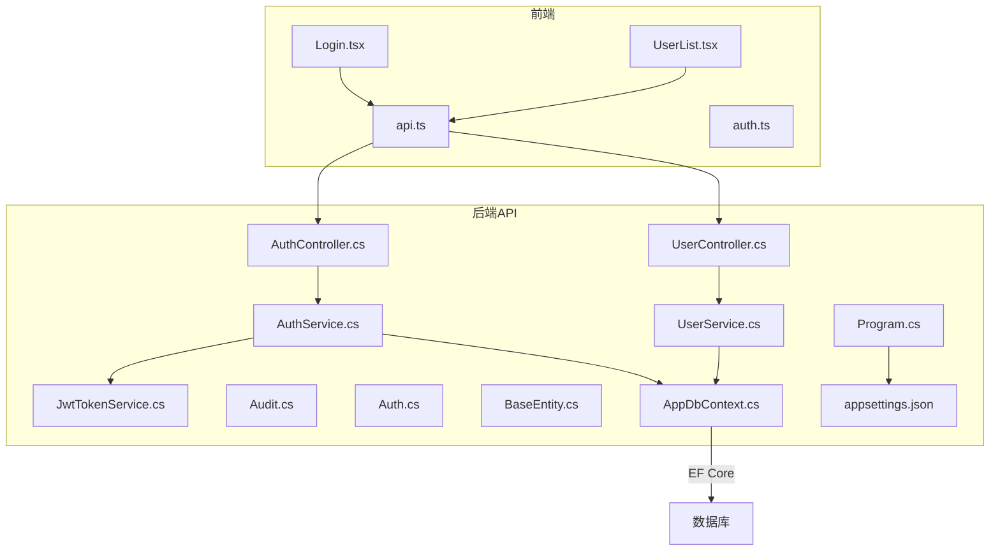
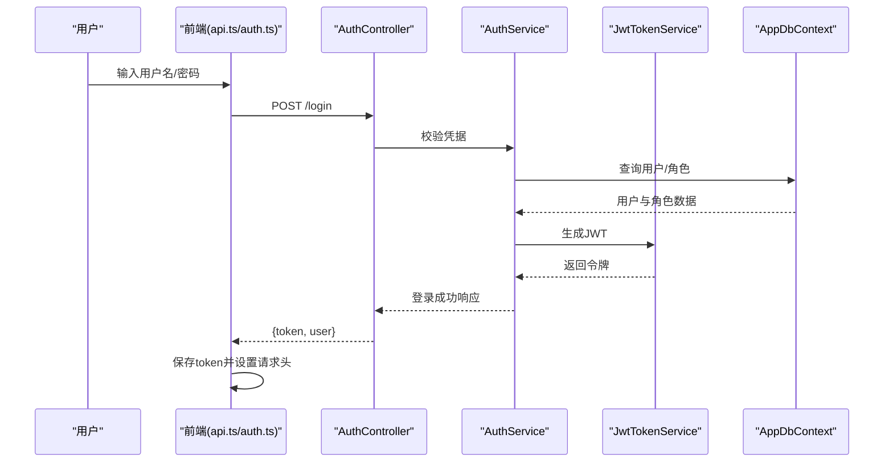
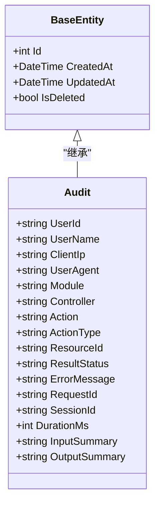
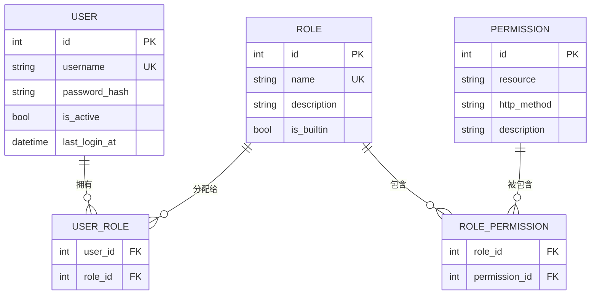
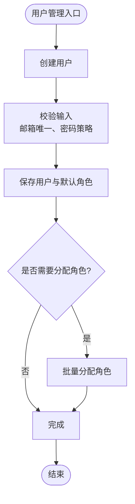
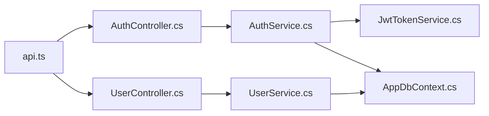

# 系统审计模型

<cite>
**本文引用的文件**   
- [Audit.cs](file://dip-system/api/Models/Audit.cs)
- [Auth.cs](file://dip-system/api/Models/Auth.cs)
- [BaseEntity.cs](file://dip-system/api/Models/BaseEntity.cs)
- [AuthController.cs](file://dip-system/api/Controllers/AuthController.cs)
- [UserController.cs](file://dip-system/api/Controllers/UserController.cs)
- [AuthService.cs](file://dip-system/api/Services/AuthService.cs)
- [JwtTokenService.cs](file://dip-system/api/Services/JwtTokenService.cs)
- [UserService.cs](file://dip-system/api/Services/UserService.cs)
- [AppDbContext.cs](file://dip-system/api/Data/AppDbContext.cs)
- [Program.cs](file://dip-system/api/Program.cs)
- [appsettings.json](file://dip-system/api/appsettings.json)
- [api.ts](file://dip-system/frontend-web/src/lib/api.ts)
- [auth.ts](file://dip-system/frontend-web/src/lib/auth.ts)
- [Login.tsx](file://dip-system/frontend-web/src/pages/Login.tsx)
- [UserList.tsx](file://dip-system/frontend-web/src/pages/UserList.tsx)
- [Init-db.sql](file://scripts/init-db.sql)
</cite>

## 目录
1. [简介](#简介)
2. [项目结构](#项目结构)
3. [核心组件](#核心组件)
4. [架构总览](#架构总览)
5. [详细组件分析](#详细组件分析)
6. [依赖关系分析](#依赖关系分析)
7. [性能考虑](#性能考虑)
8. [故障排查指南](#故障排查指南)
9. [结论](#结论)
10. [附录](#附录)

## 简介
本文件面向DIP系统的“系统审计模型”，聚焦以下目标：
- 审计日志的数据结构与记录范围（用户操作、系统事件、错误信息）
- 认证与授权数据模型（角色权限管理、访问控制）
- 用户管理数据设计（用户信息、角色分配、密码策略）
- 系统配置、字典数据、参数管理的数据结构
- 安全审计、操作追踪、合规性检查的实现要点
- 系统管理的业务规则、权限控制、数据加密方案

## 项目结构
后端采用ASP.NET Core，前后端分离。与审计模型相关的代码主要位于：
- API层：控制器、服务、数据模型、数据库上下文、启动配置
- 前端Web：登录、鉴权拦截、用户管理等页面与API调用封装
- 脚本：数据库初始化脚本

图表来源
- [Program.cs](file://dip-system/api/Program.cs)
- [AppDbContext.cs](file://dip-system/api/Data/AppDbContext.cs)
- [AuthController.cs](file://dip-system/api/Controllers/AuthController.cs)
- [UserController.cs](file://dip-system/api/Controllers/UserController.cs)
- [AuthService.cs](file://dip-system/api/Services/AuthService.cs)
- [JwtTokenService.cs](file://dip-system/api/Services/JwtTokenService.cs)
- [UserService.cs](file://dip-system/api/Services/UserService.cs)
- [Audit.cs](file://dip-system/api/Models/Audit.cs)
- [Auth.cs](file://dip-system/api/Models/Auth.cs)
- [BaseEntity.cs](file://dip-system/api/Models/BaseEntity.cs)
- [appsettings.json](file://dip-system/api/appsettings.json)

章节来源
- [Program.cs](file://dip-system/api/Program.cs)
- [AppDbContext.cs](file://dip-system/api/Data/AppDbContext.cs)
- [appsettings.json](file://dip-system/api/appsettings.json)

## 核心组件
- 审计实体：用于持久化审计日志，包含操作主体、动作、资源、结果、上下文等字段
- 认证授权实体：用户、角色、权限及关联关系，支撑RBAC访问控制
- 基础实体：统一的审计字段（创建时间、更新时间、删除标记等）
- 认证服务：登录、令牌签发、校验、刷新
- JWT服务：签名、验证、过期处理
- 用户服务：用户CRUD、角色分配、密码策略执行
- 数据库上下文：实体映射、迁移、查询优化
- 前端鉴权：Token存储、请求头注入、路由守卫

章节来源
- [Audit.cs](file://dip-system/api/Models/Audit.cs)
- [Auth.cs](file://dip-system/api/Models/Auth.cs)
- [BaseEntity.cs](file://dip-system/api/Models/BaseEntity.cs)
- [AuthService.cs](file://dip-system/api/Services/AuthService.cs)
- [JwtTokenService.cs](file://dip-system/api/Services/JwtTokenService.cs)
- [UserService.cs](file://dip-system/api/Services/UserService.cs)
- [AppDbContext.cs](file://dip-system/api/Data/AppDbContext.cs)
- [api.ts](file://dip-system/frontend-web/src/lib/api.ts)
- [auth.ts](file://dip-system/frontend-web/src/lib/auth.ts)

## 架构总览
系统采用分层架构：前端通过REST API调用后端控制器；控制器委托服务层执行业务逻辑；服务层通过EF Core访问数据库。认证与授权贯穿各层，审计日志在关键操作点写入。

图表来源
- [AuthController.cs](file://dip-system/api/Controllers/AuthController.cs)
- [AuthService.cs](file://dip-system/api/Services/AuthService.cs)
- [JwtTokenService.cs](file://dip-system/api/Services/JwtTokenService.cs)
- [AppDbContext.cs](file://dip-system/api/Data/AppDbContext.cs)
- [api.ts](file://dip-system/frontend-web/src/lib/api.ts)
- [auth.ts](file://dip-system/frontend-web/src/lib/auth.ts)

## 详细组件分析

### 审计日志数据模型（Audit）
- 目的：记录用户操作、系统事件、错误信息，支持事后追溯与合规审计
- 关键字段建议：
  - 标识与版本：主键、行版本
  - 操作主体：用户ID、用户名、客户端IP、UA
  - 动作描述：模块、控制器、方法、动作类型（增删改查）、资源ID
  - 结果状态：成功/失败、HTTP状态码、异常消息、堆栈摘要
  - 上下文：请求ID、会话ID、事务ID、耗时、入参摘要（脱敏）
  - 审计元数据：创建时间、更新人、租户/环境标识
- 索引建议：按用户、时间、模块、结果等维度建立复合索引以支持快速检索
- 写入策略：异步落库或消息队列缓冲，避免阻塞主流程；批量写入提升吞吐

图表来源
- [BaseEntity.cs](file://dip-system/api/Models/BaseEntity.cs)
- [Audit.cs](file://dip-system/api/Models/Audit.cs)

章节来源
- [Audit.cs](file://dip-system/api/Models/Audit.cs)
- [BaseEntity.cs](file://dip-system/api/Models/BaseEntity.cs)

### 认证与授权数据模型（Auth）
- 用户实体：用户基本信息、账号状态、最后登录时间、密码哈希
- 角色实体：角色名称、描述、是否内置
- 权限实体：资源路径、HTTP方法、描述
- 关联关系：用户-角色、角色-权限、用户-权限（可选）
- 访问控制：基于角色的权限校验，结合控制器/方法级注解或中间件实现

图表来源
- [Auth.cs](file://dip-system/api/Models/Auth.cs)

章节来源
- [Auth.cs](file://dip-system/api/Models/Auth.cs)

### 用户管理数据设计（User）
- 用户信息：姓名、邮箱、手机号、部门、岗位、状态
- 角色分配：多对多关系，支持批量分配与撤销
- 密码策略：复杂度要求、历史密码校验、强制过期、锁定策略
- 生命周期：创建、启用/禁用、重置密码、注销

章节来源
- [UserService.cs](file://dip-system/api/Services/UserService.cs)
- [UserController.cs](file://dip-system/api/Controllers/UserController.cs)

### 系统配置、字典数据、参数管理
- 系统配置：连接串、JWT密钥、外部服务地址、功能开关
- 字典数据：枚举值、下拉选项、国际化文案
- 参数管理：运行时可调参数、缓存策略、热更新
- 存储方式：数据库表或配置文件，统一通过配置服务读取

章节来源
- [appsettings.json](file://dip-system/api/appsettings.json)
- [Program.cs](file://dip-system/api/Program.cs)

### 安全审计、操作追踪、合规性检查
- 安全审计：登录失败、越权访问、敏感操作（删除、导出）
- 操作追踪：全链路TraceId、请求/响应摘要、耗时统计
- 合规性检查：数据保留策略、脱敏输出、审计不可篡改（追加写）

章节来源
- [Audit.cs](file://dip-system/api/Models/Audit.cs)
- [AppDbContext.cs](file://dip-system/api/Data/AppDbContext.cs)

### 系统管理业务规则与权限控制
- 业务规则：用户状态变更需审批、角色变更留痕、密码重置需二次确认
- 权限控制：最小权限原则、接口级鉴权、数据级过滤（按租户/部门）
- 数据加密：传输TLS、敏感字段AES加密、密码bcrypt/argon2哈希

章节来源
- [AuthService.cs](file://dip-system/api/Services/AuthService.cs)
- [JwtTokenService.cs](file://dip-system/api/Services/JwtTokenService.cs)
- [UserService.cs](file://dip-system/api/Services/UserService.cs)

## 依赖关系分析
- 控制器依赖服务：AuthController依赖AuthService，UserController依赖UserService
- 服务依赖基础设施：AuthService/JwtTokenService依赖AppDbContext与配置
- 前端依赖后端API：api.ts统一封装请求，auth.ts管理Token与鉴权

图表来源
- [api.ts](file://dip-system/frontend-web/src/lib/api.ts)
- [AuthController.cs](file://dip-system/api/Controllers/AuthController.cs)
- [UserController.cs](file://dip-system/api/Controllers/UserController.cs)
- [AuthService.cs](file://dip-system/api/Services/AuthService.cs)
- [JwtTokenService.cs](file://dip-system/api/Services/JwtTokenService.cs)
- [UserService.cs](file://dip-system/api/Services/UserService.cs)
- [AppDbContext.cs](file://dip-system/api/Data/AppDbContext.cs)

章节来源
- [Program.cs](file://dip-system/api/Program.cs)
- [AppDbContext.cs](file://dip-system/api/Data/AppDbContext.cs)

## 性能考虑
- 审计日志写入：异步批处理、分区表、冷热数据分离
- 认证流程：JWT无状态校验，减少数据库查询；必要时缓存用户角色
- 数据库索引：为高频查询字段建立索引，避免N+1查询
- 前端缓存：按需缓存字典与配置，降低重复请求

[本节为通用指导，不直接分析具体文件]

## 故障排查指南
- 登录失败：检查凭据、账户状态、密码策略、JWT配置
- 权限不足：核对用户角色、角色权限、接口注解
- 审计缺失：检查中间件/过滤器是否注册、异步写入是否成功
- 配置错误：核对appsettings.json与运行环境变量

章节来源
- [AuthService.cs](file://dip-system/api/Services/AuthService.cs)
- [JwtTokenService.cs](file://dip-system/api/Services/JwtTokenService.cs)
- [AppDbContext.cs](file://dip-system/api/Data/AppDbContext.cs)
- [appsettings.json](file://dip-system/api/appsettings.json)

## 结论
本审计模型围绕“可追溯、可审计、可合规”的目标，构建了从用户认证到操作记录的完整闭环。通过清晰的实体设计与分层架构，确保系统在扩展性与安全性之间取得平衡。后续可进一步增强审计的细粒度与实时性，完善权限矩阵与合规报表能力。

[本节为总结，不直接分析具体文件]

## 附录
- 数据库初始化脚本参考：用于建表与初始数据
- 前端鉴权流程：Token存储、请求拦截、路由守卫

章节来源
- [Init-db.sql](file://scripts/init-db.sql)
- [Login.tsx](file://dip-system/frontend-web/src/pages/Login.tsx)
- [UserList.tsx](file://dip-system/frontend-web/src/pages/UserList.tsx)
- [auth.ts](file://dip-system/frontend-web/src/lib/auth.ts)
- [api.ts](file://dip-system/frontend-web/src/lib/api.ts)