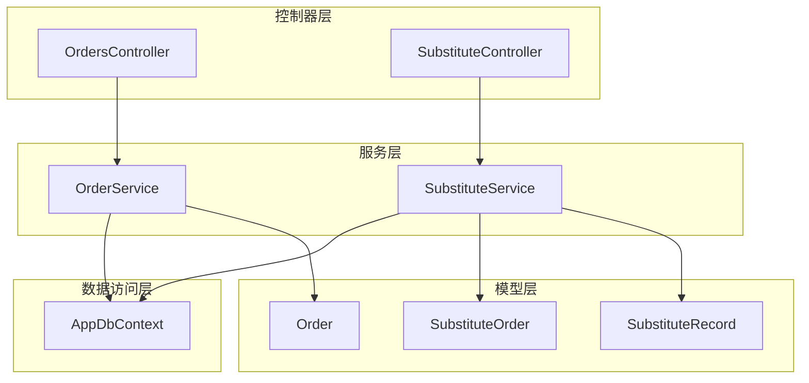
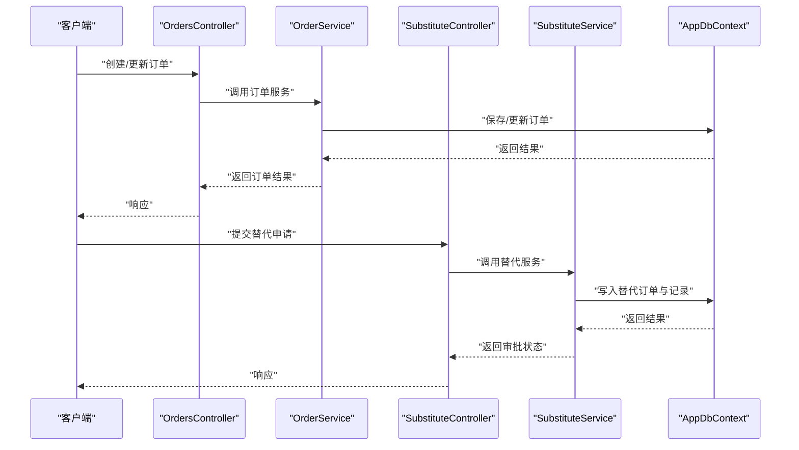
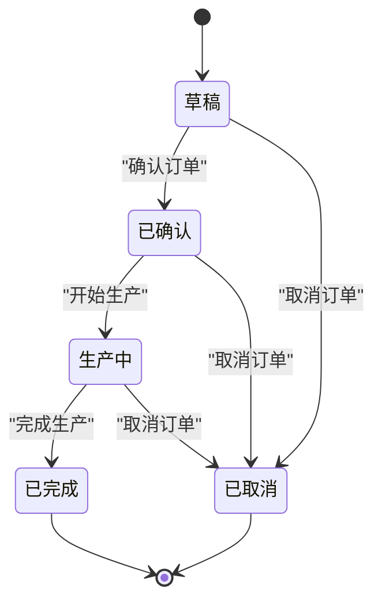
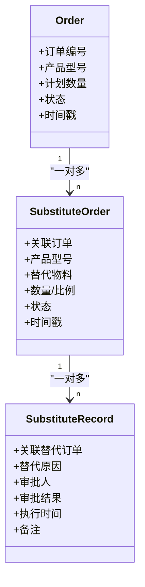
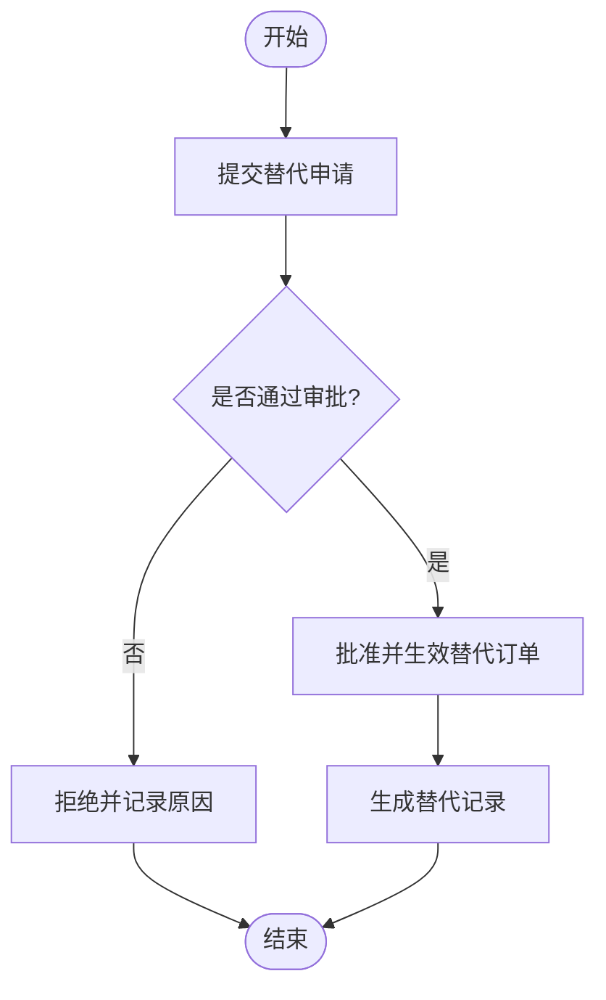
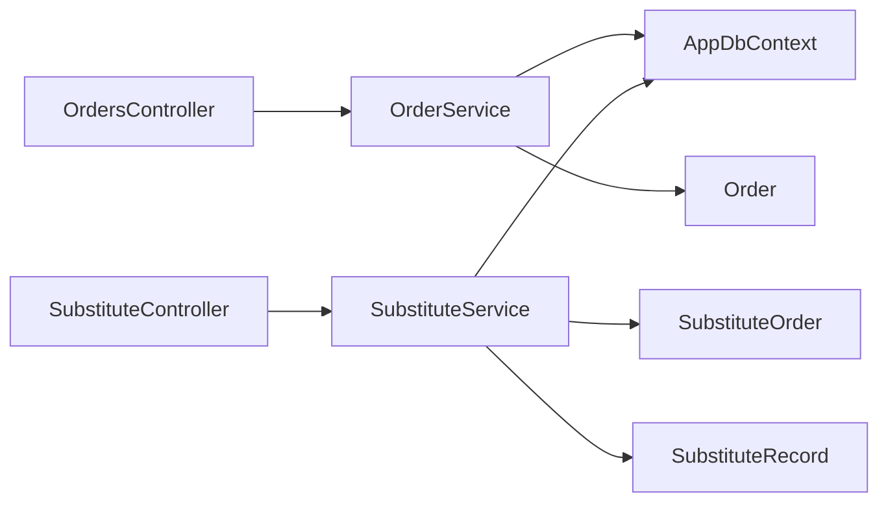

# 订单管理模型

<cite>
**本文引用的文件**   
- [Order.cs](file://dip-system/api/Models/Order.cs)
- [SubstituteOrder.cs](file://dip-system/api/Models/SubstituteOrder.cs)
- [SubstituteRecord.cs](file://dip-system/api/Models/SubstituteRecord.cs)
- [OrdersController.cs](file://dip-system/api/Controllers/OrdersController.cs)
- [SubstituteController.cs](file://dip-system/api/Controllers/SubstituteController.cs)
- [OrderService.cs](file://dip-system/api/Services/OrderService.cs)
- [SubstituteService.cs](file://dip-system/api/Services/SubstituteService.cs)
- [AppDbContext.cs](file://dip-system/api/Data/AppDbContext.cs)
- [2026-07-17-multi-product-order-plan.md](file://dip-system/docs/superpowers/plans/2026-07-17-multi-product-order-plan.md)
- [2026-07-17-multi-product-order-design.md](file://dip-system/docs/superpowers/specs/2026-07-17-multi-product-order-design.md)
- [2026-07-13-substitute-redesign-plan.md](file://dip-system/docs/superpowers/plans/2026-07-13-substitute-redesign-plan.md)
</cite>

## 目录
1. [简介](#简介)
2. [项目结构](#项目结构)
3. [核心组件](#核心组件)
4. [架构总览](#架构总览)
5. [详细组件分析](#详细组件分析)
6. [依赖关系分析](#依赖关系分析)
7. [性能考虑](#性能考虑)
8. [故障排查指南](#故障排查指南)
9. [结论](#结论)
10. [附录](#附录)

## 简介
本文件面向DIP系统的订单管理模型，聚焦以下目标：
- 详细说明订单主表（Order）的数据结构设计，包括订单编号、产品型号、计划数量、状态管理等核心字段与约束。
- 说明替代订单（SubstituteOrder）数据模型，支持多产品订单场景下的替代方案管理与关联。
- 文档化替代记录（SubstituteRecord）的关联关系，覆盖替代原因、审批流程与审计要点。
- 设计并阐述订单状态机、业务流程控制与异常处理机制。
- 提供订单查询优化、批量操作支持与数据一致性保证策略。
- 明确订单相关的业务规则与验证逻辑。

## 项目结构
围绕订单与替代相关能力，后端采用分层架构：
- 控制器层：对外暴露REST接口，负责请求校验、参数绑定与响应封装。
- 服务层：承载核心业务逻辑，包含事务边界、状态流转、并发与一致性控制。
- 数据访问层：通过EF Core上下文进行实体映射、查询与持久化。
- 模型层：定义订单、替代订单、替代记录等实体及其关系。
- 文档层：包含多产品订单与替代重构的设计与计划。

图表来源
- [OrdersController.cs](file://dip-system/api/Controllers/OrdersController.cs)
- [SubstituteController.cs](file://dip-system/api/Controllers/SubstituteController.cs)
- [OrderService.cs](file://dip-system/api/Services/OrderService.cs)
- [SubstituteService.cs](file://dip-system/api/Services/SubstituteService.cs)
- [AppDbContext.cs](file://dip-system/api/Data/AppDbContext.cs)
- [Order.cs](file://dip-system/api/Models/Order.cs)
- [SubstituteOrder.cs](file://dip-system/api/Models/SubstituteOrder.cs)
- [SubstituteRecord.cs](file://dip-system/api/Models/SubstituteRecord.cs)

章节来源
- [OrdersController.cs](file://dip-system/api/Controllers/OrdersController.cs)
- [SubstituteController.cs](file://dip-system/api/Controllers/SubstituteController.cs)
- [OrderService.cs](file://dip-system/api/Services/OrderService.cs)
- [SubstituteService.cs](file://dip-system/api/Services/SubstituteService.cs)
- [AppDbContext.cs](file://dip-system/api/Data/AppDbContext.cs)
- [Order.cs](file://dip-system/api/Models/Order.cs)
- [SubstituteOrder.cs](file://dip-system/api/Models/SubstituteOrder.cs)
- [SubstituteRecord.cs](file://dip-system/api/Models/SubstituteRecord.cs)

## 核心组件
本节概述订单与替代相关的关键实体与职责：
- Order（订单主表）：承载订单主信息，如订单编号、产品型号、计划数量、状态、时间戳等。
- SubstituteOrder（替代订单）：描述针对某订单的替代方案，支持多产品订单场景，维护替代物料、数量、生效范围等。
- SubstituteRecord（替代记录）：记录每次替代操作的明细，包括替代原因、审批人、审批结果、执行时间与备注等。

章节来源
- [Order.cs](file://dip-system/api/Models/Order.cs)
- [SubstituteOrder.cs](file://dip-system/api/Models/SubstituteOrder.cs)
- [SubstituteRecord.cs](file://dip-system/api/Models/SubstituteRecord.cs)

## 架构总览
订单与替代的整体调用链遵循“控制器→服务→数据访问”的分层模式，关键流程如下：
- 订单创建/更新：控制器接收请求，服务层执行业务校验与状态机转换，数据层持久化。
- 替代申请与审批：控制器接收替代请求，服务层校验替代规则与冲突，生成替代订单与记录，进入审批流。
- 查询与统计：控制器提供列表与详情接口，服务层组合查询条件，数据层使用EF Core高效检索。

图表来源
- [OrdersController.cs](file://dip-system/api/Controllers/OrdersController.cs)
- [OrderService.cs](file://dip-system/api/Services/OrderService.cs)
- [SubstituteController.cs](file://dip-system/api/Controllers/SubstituteController.cs)
- [SubstituteService.cs](file://dip-system/api/Services/SubstituteService.cs)
- [AppDbContext.cs](file://dip-system/api/Data/AppDbContext.cs)

## 详细组件分析

### 订单主表（Order）数据结构与状态机
- 关键字段建议与职责
  - 订单编号：唯一标识，用于跨系统追踪与报表聚合。
  - 产品型号：订单对应的主产品型号，便于按型号维度统计与排产。
  - 计划数量：订单计划生产或备料的数量，作为后续出库与消耗的依据。
  - 状态：订单生命周期状态，驱动业务流程推进。
  - 时间戳：创建时间、更新时间等，用于审计与追溯。
- 状态机设计
  - 典型状态包括：草稿、已确认、生产中、已完成、已取消等。
  - 状态转换需满足前置条件（如库存充足、替代审批通过），并在服务层进行强校验。
  - 状态变更应记录审计日志，确保可追溯。

图表来源
- [Order.cs](file://dip-system/api/Models/Order.cs)
- [OrderService.cs](file://dip-system/api/Services/OrderService.cs)

章节来源
- [Order.cs](file://dip-system/api/Models/Order.cs)
- [OrderService.cs](file://dip-system/api/Services/OrderService.cs)

### 替代订单（SubstituteOrder）数据模型与多产品支持
- 设计目标
  - 支持多产品订单场景下的替代方案管理，允许对同一订单的不同产品行分别制定替代策略。
  - 明确替代物料的适用范围、数量与优先级，避免冲突与重复替代。
- 关键字段建议与职责
  - 关联订单：指向订单主表，建立一对多或多对一关系。
  - 产品型号：限定替代适用的产品行，支持多产品订单。
  - 替代物料：替代的目标物料编码或名称。
  - 数量与比例：替代数量或替换比例，确保物料平衡。
  - 状态：替代方案的审核与生效状态。
  - 时间戳：创建与更新时间。
- 多产品订单支持
  - 通过产品型号维度拆分替代方案，确保每个产品行的替代独立可控。
  - 在创建替代订单时，需校验与订单产品行的匹配性与数量一致性。

图表来源
- [Order.cs](file://dip-system/api/Models/Order.cs)
- [SubstituteOrder.cs](file://dip-system/api/Models/SubstituteOrder.cs)
- [SubstituteRecord.cs](file://dip-system/api/Models/SubstituteRecord.cs)

章节来源
- [SubstituteOrder.cs](file://dip-system/api/Models/SubstituteOrder.cs)
- [2026-07-17-multi-product-order-plan.md](file://dip-system/docs/superpowers/plans/2026-07-17-multi-product-order-plan.md)
- [2026-07-17-multi-product-order-design.md](file://dip-system/docs/superpowers/specs/2026-07-17-multi-product-order-design.md)

### 替代记录（SubstituteRecord）关联关系与审批流程
- 关联关系
  - 与替代订单建立一对多关系，记录每次替代操作的明细。
  - 与用户或角色关联，记录审批人与审批结果。
- 审批流程
  - 提交替代申请后，进入待审批状态。
  - 审批通过后，替代订单状态变更为生效；拒绝则回滚或标记失败。
  - 审批过程需记录原因、意见与时间戳，形成完整审计轨迹。

图表来源
- [SubstituteRecord.cs](file://dip-system/api/Models/SubstituteRecord.cs)
- [SubstituteService.cs](file://dip-system/api/Services/SubstituteService.cs)

章节来源
- [SubstituteRecord.cs](file://dip-system/api/Models/SubstituteRecord.cs)
- [SubstituteService.cs](file://dip-system/api/Services/SubstituteService.cs)
- [2026-07-13-substitute-redesign-plan.md](file://dip-system/docs/superpowers/plans/2026-07-13-substitute-redesign-plan.md)

### 业务流程控制与异常处理机制
- 业务流程控制
  - 订单创建与确认：校验必填字段、产品型号与数量合法性，锁定资源防止并发修改。
  - 替代申请与审批：校验替代物料可用性、冲突检测、权限控制与审计记录。
  - 状态转换：在服务层集中实现状态机，确保转换合法且可追溯。
- 异常处理机制
  - 统一异常捕获与错误码映射，返回结构化错误信息。
  - 事务回滚：在关键路径（如订单创建、替代审批）使用事务保证一致性。
  - 重试与降级：对外部依赖（如库存服务）增加重试与降级策略。

章节来源
- [OrderService.cs](file://dip-system/api/Services/OrderService.cs)
- [SubstituteService.cs](file://dip-system/api/Services/SubstituteService.cs)
- [AppException.cs](file://dip-system/api/Services/AppException.cs)

### 订单查询优化与批量操作支持
- 查询优化
  - 使用索引加速常用查询字段（订单编号、产品型号、状态）。
  - 分页与过滤：前端传入分页参数与服务端过滤条件，减少数据传输量。
  - 投影与只读视图：按需选择字段，避免全表扫描。
- 批量操作
  - 批量创建/更新订单：服务端提供批量接口，内部使用事务与并行处理提升吞吐。
  - 批量审批替代申请：支持批量通过/拒绝，记录审计日志。
  - 幂等性：为批量操作提供幂等键，防止重复提交。

章节来源
- [OrdersController.cs](file://dip-system/api/Controllers/OrdersController.cs)
- [SubstituteController.cs](file://dip-system/api/Controllers/SubstituteController.cs)
- [OrderService.cs](file://dip-system/api/Services/OrderService.cs)
- [SubstituteService.cs](file://dip-system/api/Services/SubstituteService.cs)

### 数据一致性保证
- 事务边界
  - 订单创建、更新与删除操作包裹在事务中，确保原子性。
  - 替代审批涉及多实体更新，使用分布式或本地事务保证一致性。
- 并发控制
  - 乐观锁：通过版本号字段防止覆盖写。
  - 悲观锁：对关键资源（如库存）加锁，避免超卖。
- 审计与追溯
  - 所有状态变更与关键操作记录审计日志，包含操作人、时间、前后值。

章节来源
- [AppDbContext.cs](file://dip-system/api/Data/AppDbContext.cs)
- [OrderService.cs](file://dip-system/api/Services/OrderService.cs)
- [SubstituteService.cs](file://dip-system/api/Services/SubstituteService.cs)

## 依赖关系分析
订单与替代模块的依赖关系清晰，控制器依赖服务，服务依赖数据上下文与模型。

图表来源
- [OrdersController.cs](file://dip-system/api/Controllers/OrdersController.cs)
- [SubstituteController.cs](file://dip-system/api/Controllers/SubstituteController.cs)
- [OrderService.cs](file://dip-system/api/Services/OrderService.cs)
- [SubstituteService.cs](file://dip-system/api/Services/SubstituteService.cs)
- [AppDbContext.cs](file://dip-system/api/Data/AppDbContext.cs)
- [Order.cs](file://dip-system/api/Models/Order.cs)
- [SubstituteOrder.cs](file://dip-system/api/Models/SubstituteOrder.cs)
- [SubstituteRecord.cs](file://dip-system/api/Models/SubstituteRecord.cs)

章节来源
- [OrdersController.cs](file://dip-system/api/Controllers/OrdersController.cs)
- [SubstituteController.cs](file://dip-system/api/Controllers/SubstituteController.cs)
- [OrderService.cs](file://dip-system/api/Services/OrderService.cs)
- [SubstituteService.cs](file://dip-system/api/Services/SubstituteService.cs)
- [AppDbContext.cs](file://dip-system/api/Data/AppDbContext.cs)
- [Order.cs](file://dip-system/api/Models/Order.cs)
- [SubstituteOrder.cs](file://dip-system/api/Models/SubstituteOrder.cs)
- [SubstituteRecord.cs](file://dip-system/api/Models/SubstituteRecord.cs)

## 性能考虑
- 数据库层面
  - 为高频查询字段添加索引，如订单编号、产品型号、状态。
  - 使用连接池与读写分离提升吞吐。
- 应用层面
  - 缓存热点数据（如字典、配置）减少数据库压力。
  - 异步处理耗时操作（如邮件通知、报表生成）。
- 前端交互
  - 分页加载与懒渲染提升用户体验。
  - 防抖与节流避免频繁请求。

[本节为通用指导，不直接分析具体文件]

## 故障排查指南
- 常见问题定位
  - 订单状态异常：检查状态机转换逻辑与前置条件校验。
  - 替代审批失败：查看替代记录中的审批原因与权限设置。
  - 数据不一致：检查事务边界与并发控制策略。
- 调试工具
  - 启用EF Core SQL日志，观察生成的SQL语句。
  - 使用统一异常过滤器捕获并记录堆栈信息。
- 恢复策略
  - 提供补偿接口，用于修复部分失败的批量操作。
  - 基于审计日志进行人工干预与数据修正。

章节来源
- [AppExceptionFilter.cs](file://dip-system/api/Controllers/AppExceptionFilter.cs)
- [OrderService.cs](file://dip-system/api/Services/OrderService.cs)
- [SubstituteService.cs](file://dip-system/api/Services/SubstituteService.cs)

## 结论
本文件系统化梳理了DIP系统订单管理模型的核心设计与实现要点，涵盖订单主表、替代订单与替代记录的模型设计、状态机与业务流程、异常处理与一致性保障，以及查询优化与批量操作策略。通过分层架构与清晰的依赖关系，系统具备良好的可扩展性与可维护性，能够有效支撑多产品订单场景下的复杂业务需求。

[本节为总结性内容，不直接分析具体文件]

## 附录
- 多产品订单设计参考
  - [2026-07-17-multi-product-order-plan.md](file://dip-system/docs/superpowers/plans/2026-07-17-multi-product-order-plan.md)
  - [2026-07-17-multi-product-order-design.md](file://dip-system/docs/superpowers/specs/2026-07-17-multi-product-order-design.md)
- 替代重构计划参考
  - [2026-07-13-substitute-redesign-plan.md](file://dip-system/docs/superpowers/plans/2026-07-13-substitute-redesign-plan.md)

[本节为参考资料汇总，不直接分析具体文件]