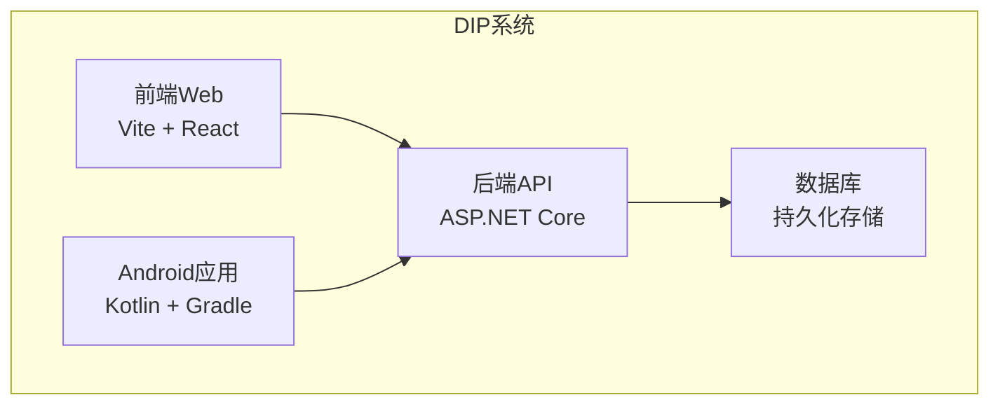
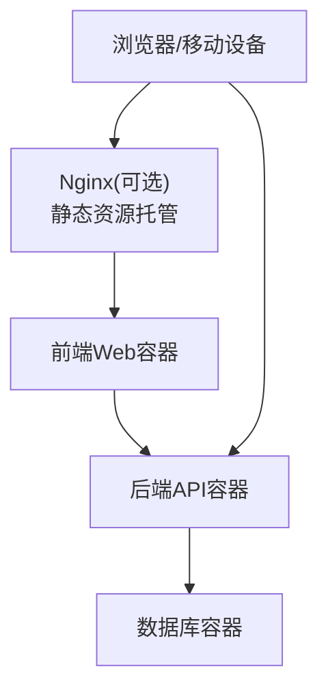
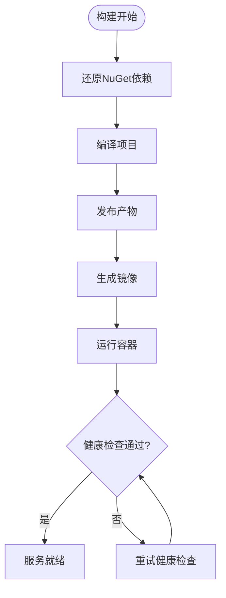
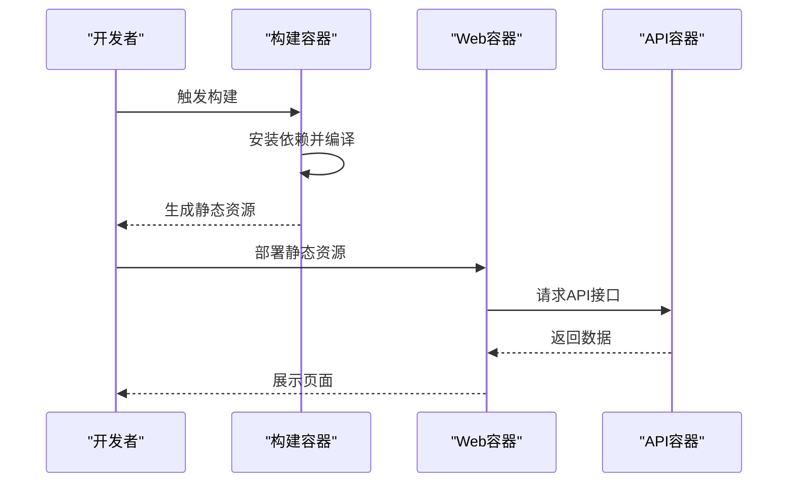
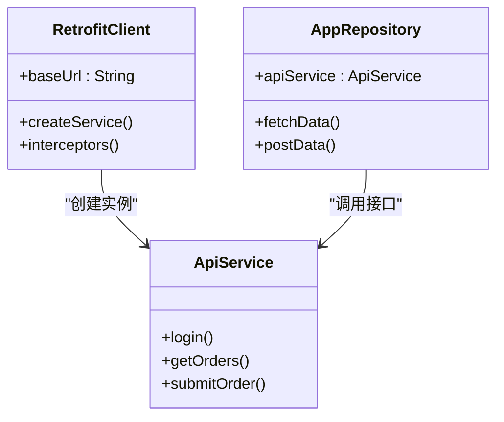
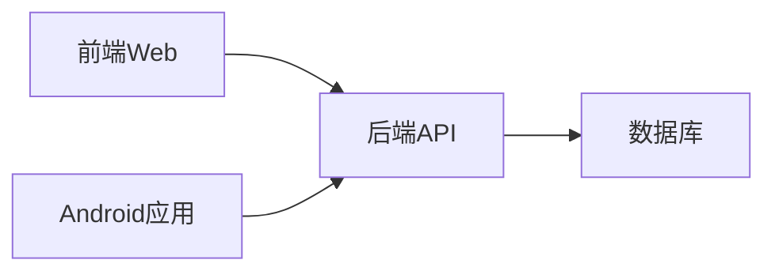

# Docker容器化部署

<cite>
**本文引用的文件**   
- [docker-compose.yml](file://dip-system/docker-compose.yml)
- [Program.cs](file://dip-system/api/Program.cs)
- [appsettings.json](file://dip-system/api/appsettings.json)
- [DIP.Api.csproj](file://dip-system/api/DIP.Api.csproj)
- [package.json](file://dip-system/frontend-web/package.json)
- [vite.config.ts](file://dip-system/frontend-web/vite.config.ts)
- [index.html](file://dip-system/frontend-web/index.html)
- [build.gradle.kts](file://mobile-android/build.gradle.kts)
- [app/build.gradle.kts](file://mobile-android/app/build.gradle.kts)
- [AndroidManifest.xml](file://mobile-android/app/src/main/AndroidManifest.xml)
- [RetrofitClient.kt](file://mobile-android/app/src/main/java/com/dip/material/data/network/RetrofitClient.kt)
- [init-db.sql](file://scripts/init-db.sql)
</cite>

## 目录
1. [简介](#简介)
2. [项目结构](#项目结构)
3. [核心组件](#核心组件)
4. [架构总览](#架构总览)
5. [详细组件分析](#详细组件分析)
6. [依赖关系分析](#依赖关系分析)
7. [性能考虑](#性能考虑)
8. [故障排查指南](#故障排查指南)
9. [结论](#结论)
10. [附录](#附录)

## 简介
本文件面向DIP系统的容器化与编排部署，覆盖后端API服务、前端Web应用以及Android应用的镜像构建与运行策略。文档重点说明：
- docker-compose编排配置与服务间通信
- 多阶段构建优化与依赖管理
- 容器网络、数据卷挂载与环境变量注入
- 健康检查、日志收集与资源限制
- 不同环境的模板与启动脚本
- 服务发现与负载均衡建议
- 常见问题排查与性能调优

## 项目结构
仓库包含三个主要子系统：
- 后端API（C# ASP.NET Core）
- 前端Web（Vite + React/TypeScript）
- Android移动端（Kotlin + Gradle）

此外，提供数据库初始化脚本与docker-compose编排文件。

**图表来源** 
- [docker-compose.yml](file://dip-system/docker-compose.yml)
- [Program.cs](file://dip-system/api/Program.cs)
- [vite.config.ts](file://dip-system/frontend-web/vite.config.ts)
- [RetrofitClient.kt](file://mobile-android/app/src/main/java/com/dip/material/data/network/RetrofitClient.kt)

**章节来源**
- [docker-compose.yml](file://dip-system/docker-compose.yml)
- [Program.cs](file://dip-system/api/Program.cs)
- [package.json](file://dip-system/frontend-web/package.json)
- [build.gradle.kts](file://mobile-android/build.gradle.kts)

## 核心组件
- 后端API服务：基于ASP.NET Core，负责业务逻辑、认证授权、数据访问等。
- 前端Web应用：静态资源由Nginx或内置服务器托管，通过环境变量与后端API通信。
- Android应用：原生客户端，通过HTTP调用后端API进行交互。
- 数据库：用于持久化业务数据，可通过数据卷挂载实现数据保留。

关键要点：
- 使用docker-compose统一编排服务
- 通过环境变量注入配置（如API地址、数据库连接串）
- 使用数据卷保存数据库与日志
- 为各服务设置健康检查与资源限制

**章节来源**
- [Program.cs](file://dip-system/api/Program.cs)
- [appsettings.json](file://dip-system/api/appsettings.json)
- [vite.config.ts](file://dip-system/frontend-web/vite.config.ts)
- [RetrofitClient.kt](file://mobile-android/app/src/main/java/com/dip/material/data/network/RetrofitClient.kt)

## 架构总览
整体架构采用前后端分离与移动端直连API的模式。容器化后，服务通过Docker网络互通，前端与移动端通过环境变量指向API服务地址。

**图表来源** 
- [docker-compose.yml](file://dip-system/docker-compose.yml)
- [Program.cs](file://dip-system/api/Program.cs)
- [vite.config.ts](file://dip-system/frontend-web/vite.config.ts)

## 详细组件分析

### 后端API服务容器化
- 镜像构建：基于官方ASP.NET运行时镜像，采用多阶段构建减少镜像体积。
- 依赖管理：通过NuGet包管理器与csproj文件声明依赖。
- 配置注入：通过环境变量覆盖appsettings中的敏感配置（如数据库连接串、JWT密钥）。
- 健康检查：暴露健康端点供编排器探测。
- 日志输出：标准输出到控制台，便于容器日志收集。

**图表来源** 
- [DIP.Api.csproj](file://dip-system/api/DIP.Api.csproj)
- [Program.cs](file://dip-system/api/Program.cs)
- [appsettings.json](file://dip-system/api/appsettings.json)

**章节来源**
- [DIP.Api.csproj](file://dip-system/api/DIP.Api.csproj)
- [Program.cs](file://dip-system/api/Program.cs)
- [appsettings.json](file://dip-system/api/appsettings.json)

### 前端Web应用容器化
- 构建流程：Node环境安装依赖、编译静态资源、生成可分发文件。
- 运行方式：可使用Nginx或Node静态服务器托管静态文件。
- 环境变量：通过构建时或运行时的环境变量注入API基础地址。
- 缓存策略：合理设置静态资源缓存头以提升加载性能。

**图表来源** 
- [package.json](file://dip-system/frontend-web/package.json)
- [vite.config.ts](file://dip-system/frontend-web/vite.config.ts)
- [index.html](file://dip-system/frontend-web/index.html)

**章节来源**
- [package.json](file://dip-system/frontend-web/package.json)
- [vite.config.ts](file://dip-system/frontend-web/vite.config.ts)
- [index.html](file://dip-system/frontend-web/index.html)

### Android应用容器化方案
- 构建环境：使用Gradle容器进行APK构建，避免本地环境差异。
- 依赖管理：通过Gradle脚本管理依赖版本。
- 网络配置：在运行时通过配置文件或环境变量指定API地址。
- 签名与发布：可在CI/CD流水线中完成签名与打包。

**图表来源** 
- [RetrofitClient.kt](file://mobile-android/app/src/main/java/com/dip/material/data/network/RetrofitClient.kt)
- [app/build.gradle.kts](file://mobile-android/app/build.gradle.kts)
- [AndroidManifest.xml](file://mobile-android/app/src/main/AndroidManifest.xml)

**章节来源**
- [RetrofitClient.kt](file://mobile-android/app/src/main/java/com/dip/material/data/network/RetrofitClient.kt)
- [app/build.gradle.kts](file://mobile-android/app/build.gradle.kts)
- [AndroidManifest.xml](file://mobile-android/app/src/main/AndroidManifest.xml)

### 数据库与数据卷
- 数据持久化：通过数据卷挂载数据库文件目录，确保容器重启后数据不丢失。
- 初始化脚本：在首次启动时执行SQL脚本初始化表结构与基础数据。
- 备份恢复：定期备份数据卷内容以实现灾难恢复。

**章节来源**
- [init-db.sql](file://scripts/init-db.sql)

## 依赖关系分析
服务间依赖关系如下：
- 前端Web依赖后端API提供数据接口
- Android应用直接调用后端API
- 后端API依赖数据库进行数据存取

**图表来源** 
- [docker-compose.yml](file://dip-system/docker-compose.yml)
- [Program.cs](file://dip-system/api/Program.cs)
- [RetrofitClient.kt](file://mobile-android/app/src/main/java/com/dip/material/data/network/RetrofitClient.kt)

**章节来源**
- [docker-compose.yml](file://dip-system/docker-compose.yml)
- [Program.cs](file://dip-system/api/Program.cs)
- [RetrofitClient.kt](file://mobile-android/app/src/main/java/com/dip/material/data/network/RetrofitClient.kt)

## 性能考虑
- 镜像优化：使用多阶段构建减少最终镜像大小，提高拉取与启动速度。
- 资源限制：为各容器设置CPU与内存限制，防止资源争用。
- 连接池：合理配置数据库连接池大小以应对并发请求。
- 缓存策略：启用HTTP缓存与反向代理缓存提升响应速度。
- 水平扩展：通过增加API服务实例数实现负载均衡。

## 故障排查指南
常见故障与解决方法：
- 容器无法启动：检查日志输出与错误信息，确认依赖服务是否可用。
- 网络连接失败：验证容器网络配置与防火墙规则。
- 数据库连接失败：检查连接字符串与权限配置。
- 性能问题：监控资源使用情况，调整容器限制与应用配置。

**章节来源**
- [docker-compose.yml](file://dip-system/docker-compose.yml)
- [Program.cs](file://dip-system/api/Program.cs)

## 结论
通过容器化与编排，DIP系统实现了标准化部署与高效运维。建议在生产环境中结合CI/CD流水线自动化构建与部署，同时建立完善的监控与告警机制以确保系统稳定性。

## 附录

### docker-compose配置要点
- 服务定义：明确各服务的镜像、端口映射、环境变量与数据卷。
- 网络配置：创建自定义网络实现服务间通信。
- 健康检查：为关键服务配置健康检查探针。
- 资源限制：设置CPU与内存上限防止资源耗尽。

### 环境变量注入示例
- API_BASE_URL：前端与移动端访问的后端API地址
- DATABASE_CONNECTION_STRING：数据库连接字符串
- JWT_SECRET_KEY：JWT签名密钥

### 启动脚本建议
- 开发环境：快速启动所有服务用于本地调试
- 生产环境：带资源限制与健康检查的完整部署
- 测试环境：隔离的网络与数据卷用于自动化测试

### 服务发现与负载均衡
- 内网DNS：利用Docker DNS实现服务名解析
- 反向代理：通过Nginx或Traefik实现负载均衡与SSL终止
- 服务网格：在复杂场景下考虑使用Istio等服务网格技术