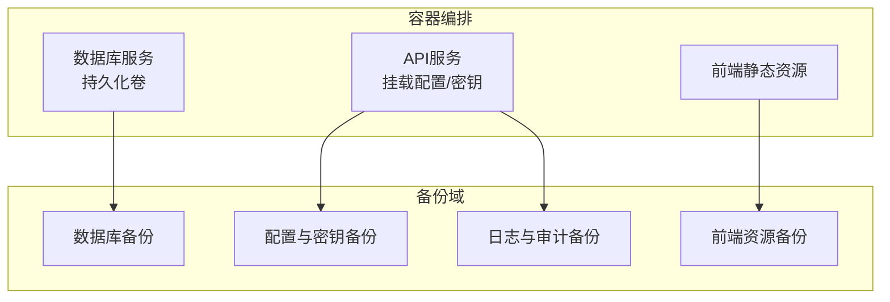
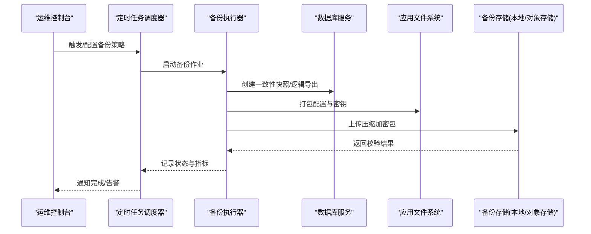
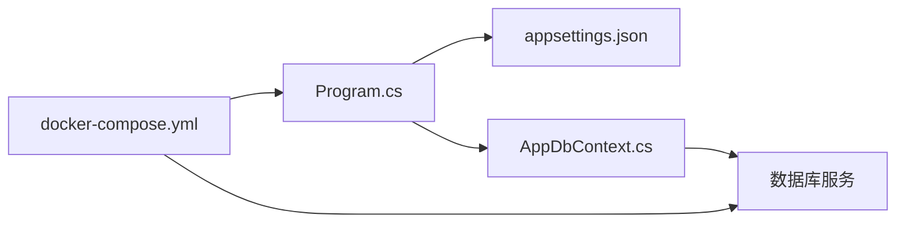

# 备份与恢复

<cite>
**本文引用的文件**   
- [docker-compose.yml](file://dip-system/docker-compose.yml)
- [Program.cs](file://dip-system/api/Program.cs)
- [appsettings.json](file://dip-system/api/appsettings.json)
- [AppDbContext.cs](file://dip-system/api/Data/AppDbContext.cs)
- [init-db.sql](file://scripts/init-db.sql)
</cite>

## 目录
1. [简介](#简介)
2. [项目结构](#项目结构)
3. [核心组件](#核心组件)
4. [架构总览](#架构总览)
5. [详细组件分析](#详细组件分析)
6. [依赖关系分析](#依赖关系分析)
7. [性能考虑](#性能考虑)
8. [故障排查指南](#故障排查指南)
9. [结论](#结论)
10. [附录](#附录)

## 简介
本指南面向DIP系统的运维与开发团队，提供覆盖数据库、应用配置、用户数据与业务文件的完整备份与恢复操作规范。内容涵盖全量与增量备份策略、定时任务配置、自动化脚本编写、存储位置管理、完整性校验、灾难恢复流程、回滚策略、压缩与加密传输、异地容灾、恢复演练计划以及RTO/RPO目标设定与业务连续性保障方案。

## 项目结构
DIP系统采用前后端分离架构：后端为ASP.NET Core API（C#），前端为Web应用（Vite+React）与Android移动端。数据库通过容器编排部署，配置文件由应用运行时加载。备份范围包括：
- 数据库持久化卷
- 应用配置文件与密钥
- 前端静态资源与构建产物（如需要）
- 日志与审计文件（可选）

图表来源
- [docker-compose.yml](file://dip-system/docker-compose.yml)
- [Program.cs](file://dip-system/api/Program.cs)
- [appsettings.json](file://dip-system/api/appsettings.json)

章节来源
- [docker-compose.yml](file://dip-system/docker-compose.yml)
- [Program.cs](file://dip-system/api/Program.cs)
- [appsettings.json](file://dip-system/api/appsettings.json)

## 核心组件
- 数据库层：通过Entity Framework上下文访问，连接字符串由配置注入；建议启用事务一致性快照或物理备份以支持时间点恢复。
- 应用层：ASP.NET Core API，启动时加载配置与密钥，运行期读写数据库与文件系统。
- 前端与移动端：主要产出静态资源与本地缓存，通常不需要高频备份，但需纳入版本管理与发布制品库。

章节来源
- [AppDbContext.cs](file://dip-system/api/Data/AppDbContext.cs)
- [Program.cs](file://dip-system/api/Program.cs)
- [appsettings.json](file://dip-system/api/appsettings.json)

## 架构总览
下图展示备份与恢复在系统中的关键交互点：备份任务从数据库与服务卷导出快照，应用配置与密钥独立备份，恢复时按顺序重建环境并验证一致性。

图表来源
- [docker-compose.yml](file://dip-system/docker-compose.yml)
- [Program.cs](file://dip-system/api/Program.cs)
- [appsettings.json](file://dip-system/api/appsettings.json)

## 详细组件分析

### 数据库备份策略
- 全量备份
  - 适用场景：首次初始化、定期归档、迁移前准备。
  - 方法：使用数据库原生工具进行物理或逻辑备份，确保事务一致性与锁策略合理。
  - 频率：每日或每周一次，结合保留策略清理过期副本。
- 增量备份
  - 适用场景：降低备份窗口与存储占用，缩短RPO。
  - 方法：基于WAL/事务日志或增量快照机制，按时间间隔滚动。
  - 频率：每小时或更短，根据业务写入强度调整。
- 定时备份任务
  - 调度：通过系统级cron或容器内任务管理器配置周期任务。
  - 参数：包含备份类型、目标路径、压缩级别、加密算法、保留天数、失败重试与告警。
  - 监控：输出结构化日志与指标，便于集中采集与告警。

章节来源
- [docker-compose.yml](file://dip-system/docker-compose.yml)
- [AppDbContext.cs](file://dip-system/api/Data/AppDbContext.cs)

### 文件数据与配置备份
- 应用配置与密钥
  - 范围：appsettings.*、环境变量、证书与密钥文件。
  - 策略：只读备份，变更需走审批与版本控制，恢复时严格匹配应用版本。
- 用户与业务文件
  - 范围：用户上传附件、报表导出、临时缓存等。
  - 策略：按命名空间或租户隔离目录备份，保留元数据索引以便快速定位。
- 前端静态资源
  - 范围：构建产物与CDN源站文件。
  - 策略：纳入制品库与版本标签，按需回滚。

章节来源
- [appsettings.json](file://dip-system/api/appsettings.json)
- [Program.cs](file://dip-system/api/Program.cs)

### 自动化备份脚本与存储管理
- 脚本职责
  - 生成唯一备份ID与时间戳，组织目录结构。
  - 调用数据库备份命令，执行压缩与加密。
  - 校验完整性（哈希校验/签名验证）。
  - 上传至目标存储（本地磁盘/NAS/对象存储），设置生命周期与权限。
  - 输出结构化日志与指标，失败时重试与告警。
- 存储位置管理
  - 本地/近线存储：用于快速恢复与短期保留。
  - 远端/对象存储：用于长期归档与异地容灾。
  - 访问控制：最小权限原则，KMS托管密钥，传输TLS加密。

章节来源
- [docker-compose.yml](file://dip-system/docker-compose.yml)

### 备份完整性验证
- 校验手段
  - 哈希校验：SHA-256/MD5比对。
  - 签名验证：数字签名或HMAC。
  - 可恢复性抽样：定期抽取样本进行恢复演练。
- 自动化检查
  - 备份后自动校验，异常立即告警。
  - 周期性健康检查与修复建议。

章节来源
- [docker-compose.yml](file://dip-system/docker-compose.yml)

### 灾难恢复流程与回滚策略
- 恢复步骤
  - 评估影响面与停机窗口，选择恢复目标时间点。
  - 停止写服务，锁定相关资源。
  - 先恢复配置与密钥，再恢复数据库与文件数据。
  - 启动服务并进行冒烟测试与数据一致性校验。
  - 逐步开放流量，观察指标与错误率。
- 回滚策略
  - 版本回滚：回退到上一个稳定版本的应用镜像与配置。
  - 数据回滚：基于最近可用备份与增量日志恢复到指定LSN/时间点。
  - 灰度回滚：小流量验证后再全量切换。

章节来源
- [Program.cs](file://dip-system/api/Program.cs)
- [appsettings.json](file://dip-system/api/appsettings.json)

### 压缩、加密传输与异地容灾
- 压缩
  - 推荐zstd/lz4，平衡速度与体积。
- 加密
  - 传输层TLS，静态数据AES-256，密钥由KMS管理。
- 异地容灾
  - 多地域复制，跨网络同步，延迟与带宽规划。
  - 故障切换演练与自动Failover策略。

章节来源
- [docker-compose.yml](file://dip-system/docker-compose.yml)

### 恢复演练计划与RTO/RPO目标
- 演练计划
  - 季度演练：全量恢复+增量恢复组合。
  - 月度演练：单表/单租户恢复。
  - 周度演练：配置与密钥恢复。
- RTO/RPO目标
  - RTO：核心业务≤30分钟，非核心≤2小时。
  - RPO：核心业务≤5分钟，非核心≤1小时。
- 业务连续性
  - 多活/主备架构，自动故障转移，容量预留与弹性扩容。

章节来源
- [docker-compose.yml](file://dip-system/docker-compose.yml)

## 依赖关系分析
- 应用对配置的依赖：启动阶段读取配置与密钥，决定数据库连接、外部服务地址与功能开关。
- 数据库对持久化的依赖：数据文件与事务日志必须与备份策略一致，避免不一致导致恢复失败。
- 备份任务对环境的依赖：网络连通性、存储权限、密钥可用性、调度器稳定性。

图表来源
- [Program.cs](file://dip-system/api/Program.cs)
- [appsettings.json](file://dip-system/api/appsettings.json)
- [AppDbContext.cs](file://dip-system/api/Data/AppDbContext.cs)
- [docker-compose.yml](file://dip-system/docker-compose.yml)

章节来源
- [Program.cs](file://dip-system/api/Program.cs)
- [appsettings.json](file://dip-system/api/appsettings.json)
- [AppDbContext.cs](file://dip-system/api/Data/AppDbContext.cs)
- [docker-compose.yml](file://dip-system/docker-compose.yml)

## 性能考虑
- 备份窗口优化：并行备份分片、选择性备份（仅变更数据）、低峰时段执行。
- I/O与CPU：压缩级别与线程数调优，避免影响在线业务。
- 存储吞吐：就近存储优先，跨网复制异步化。
- 监控与限流：备份任务限流与背压，避免雪崩。

[本节为通用指导，不直接分析具体文件]

## 故障排查指南
- 常见问题
  - 备份失败：检查数据库连接、权限、磁盘空间、网络连通性。
  - 恢复失败：确认版本兼容、配置一致性、数据完整性校验。
  - 性能退化：监控I/O、CPU、内存，调整并发与缓冲。
- 诊断要点
  - 查看备份任务日志与指标，定位失败阶段。
  - 校验备份包哈希与签名，确认未损坏。
  - 核对应用与数据库版本矩阵，避免不兼容。
- 应急措施
  - 切换到备用备份集，优先恢复核心数据。
  - 降级非关键功能，保障核心链路可用。

章节来源
- [docker-compose.yml](file://dip-system/docker-compose.yml)
- [Program.cs](file://dip-system/api/Program.cs)

## 结论
通过统一的备份策略、自动化脚本与严格的恢复演练，DIP系统可实现高可用的数据保护与快速恢复能力。建议持续完善监控告警、异地容灾与自动化切换，确保RTO/RPO目标达成与业务连续性。

[本节为总结性内容，不直接分析具体文件]

## 附录
- 初始数据库脚本
  - 用途：用于环境初始化与测试数据准备，不应作为生产备份依据。
  - 建议：配合版本化管理与变更评审。

章节来源
- [init-db.sql](file://scripts/init-db.sql)