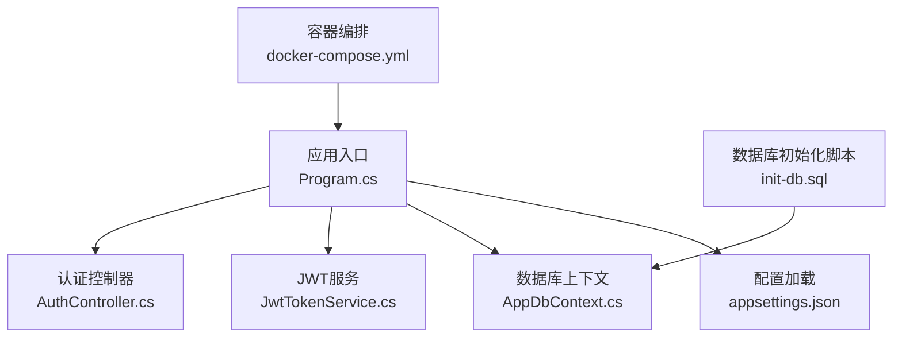
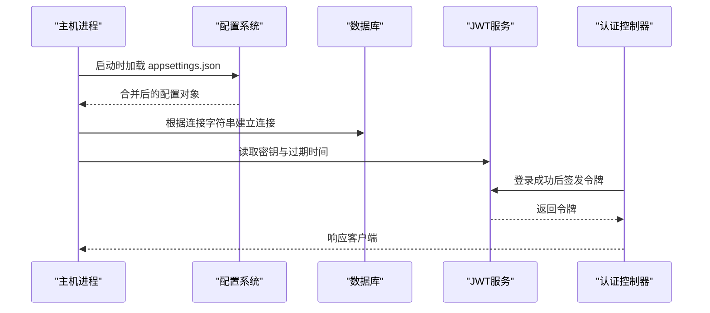
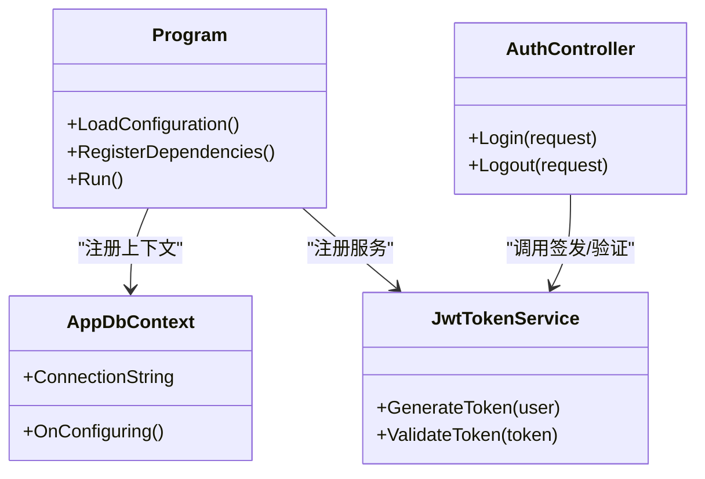

# 环境配置管理

<cite>
**本文引用的文件**   
- [appsettings.json](file://dip-system/api/appsettings.json)
- [Program.cs](file://dip-system/api/Program.cs)
- [AppDbContext.cs](file://dip-system/api/Data/AppDbContext.cs)
- [JwtTokenService.cs](file://dip-system/api/Services/JwtTokenService.cs)
- [AuthController.cs](file://dip-system/api/Controllers/AuthController.cs)
- [init-db.sql](file://scripts/init-db.sql)
- [docker-compose.yml](file://dip-system/docker-compose.yml)
</cite>

## 目录
1. [简介](#简介)
2. [项目结构](#项目结构)
3. [核心组件](#核心组件)
4. [架构总览](#架构总览)
5. [详细组件分析](#详细组件分析)
6. [依赖关系分析](#依赖关系分析)
7. [性能考虑](#性能考虑)
8. [故障排查指南](#故障排查指南)
9. [结论](#结论)
10. [附录](#附录)

## 简介
本文件面向DIP系统的环境配置管理，聚焦于后端API的配置体系与数据库初始化流程。内容涵盖：
- appsettings.json 配置结构与关键项说明（数据库连接、JWT认证、缓存、日志等）
- 不同环境的配置差异与管理策略（开发、测试、生产）
- 敏感信息加密存储与环境变量覆盖机制
- 配置验证、默认值处理与热更新能力
- 数据库初始化脚本的使用方法与执行流程
- 配置模板与最佳实践建议

## 项目结构
DIP系统的后端位于 dip-system/api 目录，核心配置文件为 appsettings.json；数据访问通过 EF Core 的 AppDbContext 进行；认证采用 JWT，相关逻辑在 JwtTokenService 与 AuthController 中实现；数据库初始化脚本位于 scripts/init-db.sql；容器化部署使用 docker-compose.yml。

图表来源
- [Program.cs:1-100](file://dip-system/api/Program.cs#L1-L100)
- [appsettings.json:1-200](file://dip-system/api/appsettings.json#L1-L200)
- [AppDbContext.cs:1-120](file://dip-system/api/Data/AppDbContext.cs#L1-L120)
- [JwtTokenService.cs:1-120](file://dip-system/api/Services/JwtTokenService.cs#L1-L120)
- [AuthController.cs:1-120](file://dip-system/api/Controllers/AuthController.cs#L1-L120)
- [init-db.sql:1-200](file://scripts/init-db.sql#L1-L200)
- [docker-compose.yml:1-120](file://dip-system/docker-compose.yml#L1-L120)

章节来源
- [Program.cs:1-100](file://dip-system/api/Program.cs#L1-L100)
- [appsettings.json:1-200](file://dip-system/api/appsettings.json#L1-L200)

## 核心组件
- 配置中心：appsettings.json 提供基础配置，支持按环境叠加与环境变量覆盖
- 数据访问：AppDbContext 读取数据库连接字符串并建立EF Core上下文
- 认证授权：JwtTokenService 负责令牌生成与校验，AuthController 暴露登录接口
- 初始化脚本：init-db.sql 用于创建数据库对象与初始数据
- 部署编排：docker-compose.yml 定义服务、环境变量与卷挂载

章节来源
- [AppDbContext.cs:1-120](file://dip-system/api/Data/AppDbContext.cs#L1-L120)
- [JwtTokenService.cs:1-120](file://dip-system/api/Services/JwtTokenService.cs#L1-L120)
- [AuthController.cs:1-120](file://dip-system/api/Controllers/AuthController.cs#L1-L120)
- [init-db.sql:1-200](file://scripts/init-db.sql#L1-L200)
- [docker-compose.yml:1-120](file://dip-system/docker-compose.yml#L1-L120)

## 架构总览
下图展示配置加载到运行时各组件的交互关系，包括配置源优先级、环境变量注入、数据库连接与JWT签发流程。

图表来源
- [Program.cs:1-100](file://dip-system/api/Program.cs#L1-L100)
- [appsettings.json:1-200](file://dip-system/api/appsettings.json#L1-L200)
- [AppDbContext.cs:1-120](file://dip-system/api/Data/AppDbContext.cs#L1-L120)
- [JwtTokenService.cs:1-120](file://dip-system/api/Services/JwtTokenService.cs#L1-L120)
- [AuthController.cs:1-120](file://dip-system/api/Controllers/AuthController.cs#L1-L120)

## 详细组件分析

### 配置系统与 appsettings.json
- 作用与范围
  - 提供全局配置键值对，包含数据库连接、JWT参数、缓存、日志级别等
  - 支持多环境叠加（如 appsettings.Development.json、appsettings.Production.json）
  - 支持环境变量覆盖（例如 ConnectionStrings__DefaultConnection、Jwt__SecretKey）
- 关键配置项类别
  - 数据库连接：连接字符串、超时、池大小、安全模式
  - JWT认证：密钥、算法、令牌有效期、刷新策略
  - 缓存：启用开关、过期时间、内存限制
  - 日志：输出目标、级别、滚动策略
- 配置验证与默认值
  - 建议在启动阶段对关键配置进行校验（非空、格式正确）
  - 未提供的配置项应设置合理默认值，避免运行时异常
- 热更新
  - 对于无需重启即可生效的配置（如日志级别、功能开关），可通过配置监听实现热更新
  - 对需要重启的配置（如数据库连接、JWT密钥）应在变更时触发优雅重启或蓝绿发布

章节来源
- [appsettings.json:1-200](file://dip-system/api/appsettings.json#L1-L200)
- [Program.cs:1-100](file://dip-system/api/Program.cs#L1-L100)

### 数据库连接与上下文
- 连接字符串来源
  - 优先从环境变量读取，其次回退到 appsettings.json
  - 建议使用强类型配置绑定，便于校验与扩展
- 连接行为
  - 连接池、重试、超时、事务隔离级别等影响稳定性与性能
- 迁移与初始化
  - 结合EF Core迁移或外部脚本（init-db.sql）完成库表结构初始化
  - 建议在CI/CD流水线中自动执行初始化脚本

章节来源
- [AppDbContext.cs:1-120](file://dip-system/api/Data/AppDbContext.cs#L1-L120)
- [init-db.sql:1-200](file://scripts/init-db.sql#L1-L200)

### JWT认证配置与服务
- 配置项
  - 密钥（SecretKey）、算法（Algorithm）、令牌有效期（AccessTokenLifetime）、刷新令牌有效期（RefreshTokenLifetime）
- 服务职责
  - 生成与验证JWT令牌
  - 将用户身份映射到Claims
  - 支持令牌刷新与撤销策略
- 安全建议
  - 密钥必须来自受管密钥库或环境变量，禁止硬编码
  - 定期轮换密钥，支持双密钥过渡期

章节来源
- [JwtTokenService.cs:1-120](file://dip-system/api/Services/JwtTokenService.cs#L1-L120)
- [AuthController.cs:1-120](file://dip-system/api/Controllers/AuthController.cs#L1-L120)

### 认证控制器与登录流程
- 接口职责
  - 接收用户名/密码，调用认证服务校验
  - 成功则签发JWT，失败返回错误码
- 流程要点
  - 输入校验、防暴力破解、审计日志
  - 统一错误响应格式

章节来源
- [AuthController.cs:1-120](file://dip-system/api/Controllers/AuthController.cs#L1-L120)

### 数据库初始化脚本使用方法
- 适用场景
  - 首次部署、版本升级后结构变更、本地调试环境重建
- 执行步骤
  - 准备数据库实例与凭据
  - 选择目标环境对应的脚本版本
  - 以只读权限账号执行脚本，确认无冲突对象
  - 验证关键表与视图存在，插入必要字典数据
- 注意事项
  - 幂等性设计，避免重复执行导致错误
  - 记录执行时间与结果，纳入部署产物

章节来源
- [init-db.sql:1-200](file://scripts/init-db.sql#L1-L200)

### 多环境配置差异与管理策略
- 环境划分
  - 开发（Development）：宽松校验、详细日志、快速迭代
  - 测试（Staging/Test）：接近生产配置、自动化测试数据
  - 生产（Production）：严格校验、最小权限、高可用与监控
- 管理策略
  - 使用分层配置叠加（基础配置 + 环境覆盖）
  - 敏感配置通过环境变量或密钥管理服务注入
  - 变更需经过代码评审与自动化验证

章节来源
- [docker-compose.yml:1-120](file://dip-system/docker-compose.yml#L1-L120)
- [appsettings.json:1-200](file://dip-system/api/appsettings.json#L1-L200)

### 敏感信息加密存储与环境变量覆盖
- 存储方式
  - 密钥、连接字符串等敏感信息不入库，仅存在于运行环境
  - 推荐使用操作系统级环境变量或平台密钥服务（如Azure Key Vault、AWS Secrets Manager）
- 覆盖机制
  - 环境变量命名遵循约定（如 Section__Key）
  - 启动时按优先级合并配置，确保最高优先级生效

章节来源
- [Program.cs:1-100](file://dip-system/api/Program.cs#L1-L100)
- [appsettings.json:1-200](file://dip-system/api/appsettings.json#L1-L200)

### 配置验证、默认值与热更新
- 验证
  - 启动阶段对必填项进行校验，失败则阻止应用启动
  - 对数值范围、格式进行约束检查
- 默认值
  - 为可选配置提供合理默认值，提升可移植性
- 热更新
  - 对动态配置（如日志级别、功能开关）启用监听器，实时生效
  - 对静态配置（如数据库连接、JWT密钥）变更需触发重启

章节来源
- [Program.cs:1-100](file://dip-system/api/Program.cs#L1-L100)
- [appsettings.json:1-200](file://dip-system/api/appsettings.json#L1-L200)

### 配置模板与最佳实践
- 模板建议
  - 提供 appsettings.json 的基础模板，包含所有键位与注释说明
  - 提供 .env.example 示例文件，列出必需环境变量
- 最佳实践
  - 最小权限原则：数据库账号仅授予必要权限
  - 不可变基础设施：镜像内不包含敏感配置
  - 审计与告警：记录配置变更与异常访问

章节来源
- [appsettings.json:1-200](file://dip-system/api/appsettings.json#L1-L200)
- [docker-compose.yml:1-120](file://dip-system/docker-compose.yml#L1-L120)

## 依赖关系分析
- 组件耦合
  - Program.cs 作为入口，负责配置加载与依赖注册
  - AppDbContext 依赖连接字符串与数据库驱动
  - JwtTokenService 依赖密钥与算法配置
  - AuthController 依赖 JwtTokenService 与用户服务
- 外部依赖
  - 数据库驱动（如SQL Server/MySQL）
  - 日志框架（如Serilog/NLog）
  - 缓存（如IMemoryCache/Redis）

图表来源
- [Program.cs:1-100](file://dip-system/api/Program.cs#L1-L100)
- [AppDbContext.cs:1-120](file://dip-system/api/Data/AppDbContext.cs#L1-L120)
- [JwtTokenService.cs:1-120](file://dip-system/api/Services/JwtTokenService.cs#L1-L120)
- [AuthController.cs:1-120](file://dip-system/api/Controllers/AuthController.cs#L1-L120)

章节来源
- [Program.cs:1-100](file://dip-system/api/Program.cs#L1-L100)
- [AppDbContext.cs:1-120](file://dip-system/api/Data/AppDbContext.cs#L1-L120)
- [JwtTokenService.cs:1-120](file://dip-system/api/Services/JwtTokenService.cs#L1-L120)
- [AuthController.cs:1-120](file://dip-system/api/Controllers/AuthController.cs#L1-L120)

## 性能考虑
- 数据库连接池
  - 合理设置最大连接数与超时，避免连接耗尽
  - 使用异步查询减少阻塞
- 缓存策略
  - 热点数据入缓存，设置合适的过期与淘汰策略
  - 区分读多写少与写多读少的场景
- 日志级别
  - 生产环境降低日志级别，避免I/O瓶颈
  - 使用采样与异步写入

[本节为通用指导，不直接分析具体文件]

## 故障排查指南
- 常见问题
  - 连接字符串错误或网络不通：检查环境变量与防火墙规则
  - JWT签名失败：核对密钥一致性与算法匹配
  - 初始化脚本失败：检查对象是否存在与权限不足
- 诊断手段
  - 查看应用日志与数据库慢查询日志
  - 使用健康检查端点与指标监控
  - 逐步禁用功能定位问题模块

章节来源
- [AppDbContext.cs:1-120](file://dip-system/api/Data/AppDbContext.cs#L1-L120)
- [JwtTokenService.cs:1-120](file://dip-system/api/Services/JwtTokenService.cs#L1-L120)
- [AuthController.cs:1-120](file://dip-system/api/Controllers/AuthController.cs#L1-L120)
- [init-db.sql:1-200](file://scripts/init-db.sql#L1-L200)

## 结论
通过分层配置、环境变量覆盖、严格的验证与默认值策略，DIP系统能够在多环境下稳定运行。结合数据库初始化脚本与容器编排，可实现一致的部署体验。建议持续完善配置模板与最佳实践，提升安全性与可维护性。

[本节为总结性内容，不直接分析具体文件]

## 附录
- 配置模板清单
  - appsettings.json 模板：包含所有键位与注释
  - .env.example：列出必需环境变量
- 部署检查清单
  - 环境变量是否齐全且正确
  - 数据库初始化是否成功
  - 健康检查与监控是否就绪

[本节为补充信息，不直接分析具体文件]