# 生产环境部署

<cite>
**本文引用的文件**   
- [docker-compose.yml](file://dip-system/docker-compose.yml)
- [Program.cs](file://dip-system/api/Program.cs)
- [appsettings.json](file://dip-system/api/appsettings.json)
- [AppDbContext.cs](file://dip-system/api/Data/AppDbContext.cs)
- [init-db.sql](file://scripts/init-db.sql)
- [package.json](file://dip-system/frontend-web/package.json)
- [vite.config.ts](file://dip-system/frontend-web/vite.config.ts)
</cite>

## 目录
1. [简介](#简介)
2. [项目结构](#项目结构)
3. [核心组件](#核心组件)
4. [架构总览](#架构总览)
5. [详细组件分析](#详细组件分析)
6. [依赖关系分析](#依赖关系分析)
7. [性能考虑](#性能考虑)
8. [故障排查指南](#故障排查指南)
9. [结论](#结论)
10. [附录](#附录)

## 简介
本指南面向DIP系统的生产环境部署，覆盖硬件与操作系统选型、依赖软件版本、Nginx反向代理与HTTPS配置、数据库集群与高可用、应用服务器与进程管理、防火墙与安全组策略、性能基准与容量规划、监控告警与日志轮转等关键主题。文档基于仓库中的配置文件与代码结构进行说明，确保可操作性和一致性。

## 项目结构
DIP系统由以下主要部分组成：
- 后端API服务（ASP.NET Core）
- 前端Web应用（Vite + React）
- 数据库初始化脚本
- Docker编排文件用于容器化部署

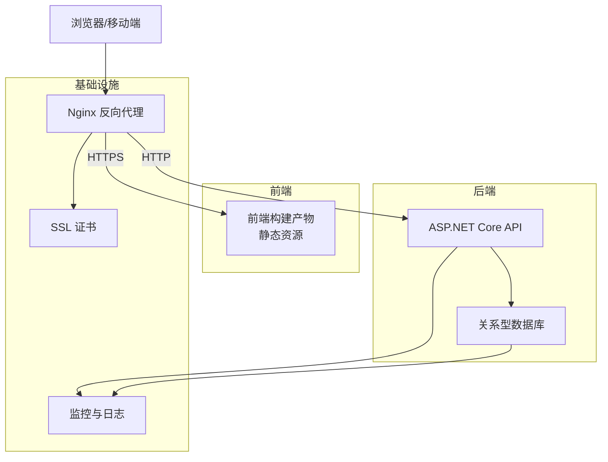

图表来源
- [docker-compose.yml](file://dip-system/docker-compose.yml)
- [Program.cs](file://dip-system/api/Program.cs)
- [appsettings.json](file://dip-system/api/appsettings.json)

章节来源
- [docker-compose.yml](file://dip-system/docker-compose.yml)
- [Program.cs](file://dip-system/api/Program.cs)
- [appsettings.json](file://dip-system/api/appsettings.json)

## 核心组件
- 后端API服务：基于ASP.NET Core，提供REST接口，使用Entity Framework访问数据库。
- 前端Web应用：基于Vite构建的React应用，静态资源通过Nginx发布。
- 数据库：通过连接字符串配置，支持主从或集群模式扩展。
- 反向代理：Nginx负责HTTPS终止、静态资源缓存、请求转发与健康检查。
- 容器编排：docker-compose定义服务拓扑、端口映射、环境变量与数据卷挂载。

章节来源
- [Program.cs](file://dip-system/api/Program.cs)
- [AppDbContext.cs](file://dip-system/api/Data/AppDbContext.cs)
- [appsettings.json](file://dip-system/api/appsettings.json)
- [docker-compose.yml](file://dip-system/docker-compose.yml)

## 架构总览
生产环境推荐分层架构：
- 接入层：Nginx作为统一入口，处理TLS终止、压缩、缓存、限流与路由。
- 应用层：多实例ASP.NET Core API，无状态设计便于水平扩展。
- 数据层：关系型数据库采用主从复制与读写分离，必要时引入缓存与消息队列。
- 运维层：集中式日志、指标采集、告警与自动化备份。

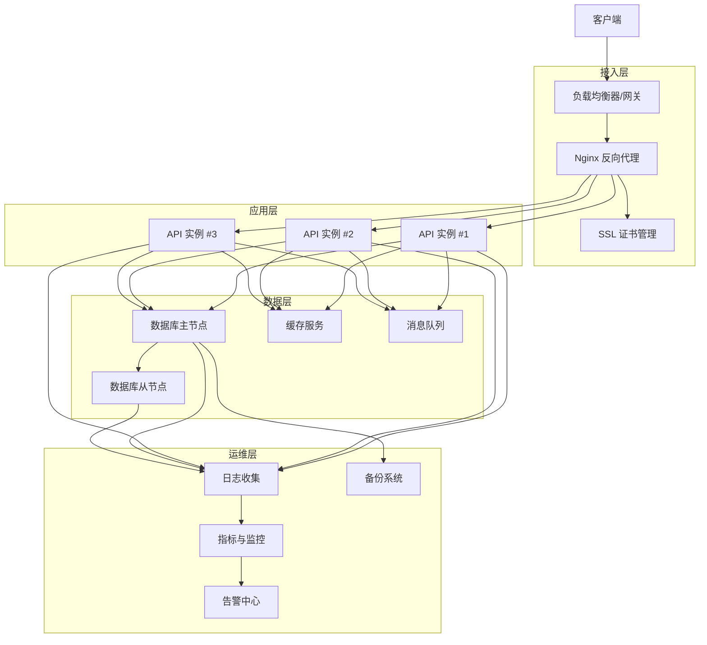

[此图为概念性架构图，不直接映射具体源码文件]

## 详细组件分析

### Nginx反向代理与HTTPS配置
- 目标：为前端静态资源与后端API提供统一的HTTPS入口，启用压缩、缓存、安全头与访问控制。
- 要点：
  - 监听443端口并加载SSL证书；同时监听80端口重定向到HTTPS。
  - 将前端静态资源路径映射到构建产物目录，设置缓存与Gzip。
  - 将API请求转发至后端服务，设置超时、缓冲与重试策略。
  - 启用健康检查端点，配合负载均衡器实现自动摘除。
  - 限制并发与速率，防止滥用与DDoS攻击。

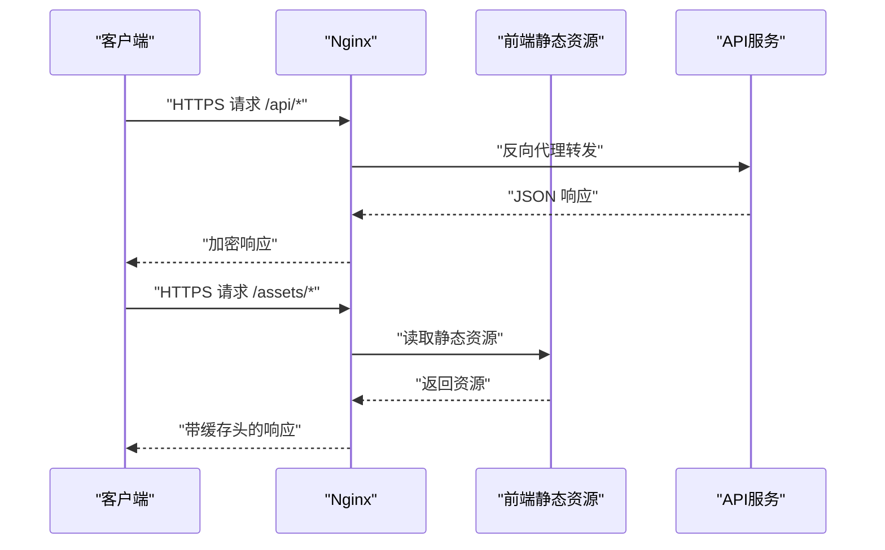

图表来源
- [docker-compose.yml](file://dip-system/docker-compose.yml)
- [vite.config.ts](file://dip-system/frontend-web/vite.config.ts)

章节来源
- [docker-compose.yml](file://dip-system/docker-compose.yml)
- [vite.config.ts](file://dip-system/frontend-web/vite.config.ts)

### SSL证书安装与HTTPS访问设置
- 证书来源：建议使用受信任CA签发的证书，或使用Let's Encrypt自动续期。
- 安装步骤：
  - 将证书与私钥放置于安全目录，限制文件权限。
  - 在Nginx中配置ssl_certificate与ssl_certificate_key。
  - 启用强加密套件与协议版本，禁用不安全选项。
  - 配置HSTS、CSP等安全头。
  - 验证证书链完整性与过期时间。

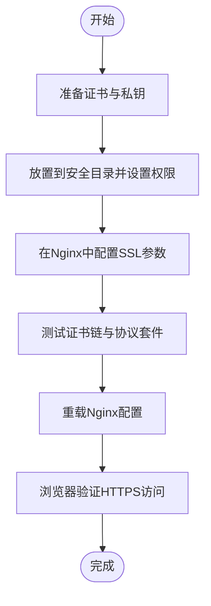

[此流程图展示通用操作步骤，不直接映射具体源码文件]

### 数据库集群部署与高可用
- 模式建议：主从复制+读写分离，必要时引入分片或分布式数据库。
- 关键点：
  - 主节点承担写操作，从节点承担读操作与备份。
  - 配置连接池与超时，避免长事务阻塞。
  - 启用慢查询日志与索引优化。
  - 定期全量与增量备份，异地容灾。
  - 监控主从延迟与同步状态。

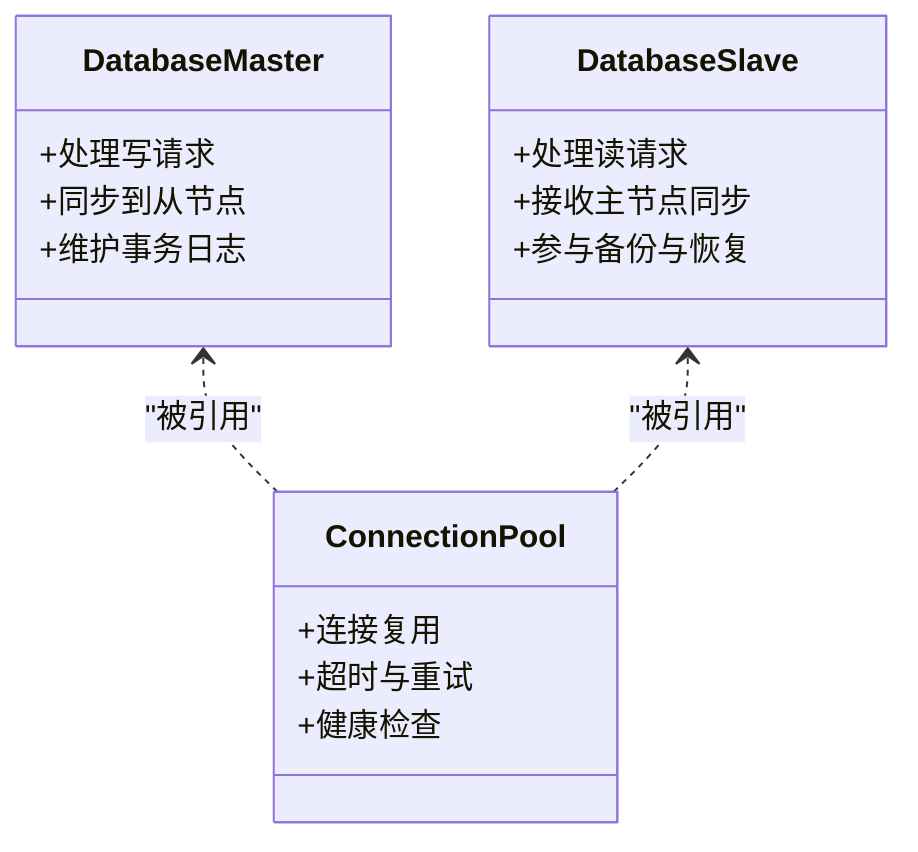

图表来源
- [AppDbContext.cs](file://dip-system/api/Data/AppDbContext.cs)
- [appsettings.json](file://dip-system/api/appsettings.json)

章节来源
- [AppDbContext.cs](file://dip-system/api/Data/AppDbContext.cs)
- [appsettings.json](file://dip-system/api/appsettings.json)

### 备份策略
- 全量备份：每日一次，保留周期按合规要求设定。
- 增量备份：每小时或更频繁，减少RPO。
- 异地存储：跨机房或云对象存储，加密传输与静态加密。
- 恢复演练：定期执行恢复演练，验证备份有效性。
- 自动化：通过定时任务与脚本实现备份与清理。

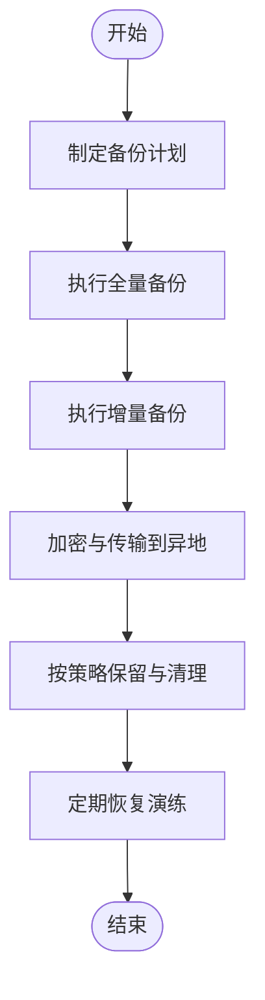

[此流程图展示通用备份流程，不直接映射具体源码文件]

### 应用服务器配置与进程管理
- 运行时：ASP.NET Core，推荐使用容器化部署。
- 进程管理：使用systemd或容器编排平台管理生命周期。
- 自动重启：配置失败重启策略与最大重启次数。
- 资源限制：CPU与内存限制，避免资源争用。
- 健康检查：暴露健康端点，供负载均衡器探测。

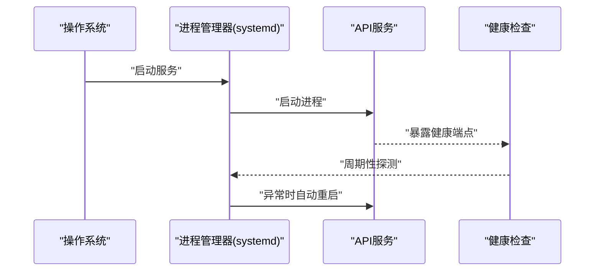

图表来源
- [Program.cs](file://dip-system/api/Program.cs)
- [docker-compose.yml](file://dip-system/docker-compose.yml)

章节来源
- [Program.cs](file://dip-system/api/Program.cs)
- [docker-compose.yml](file://dip-system/docker-compose.yml)

### 防火墙规则与网络安全组
- 最小开放原则：仅开放必要端口（如80、443）。
- 入站规则：限制来源IP段，启用白名单。
- 出站规则：限制对外访问，仅允许必要的域名与端口。
- 内部网络：服务间通信使用内网地址与私有端口。
- 审计与告警：记录异常访问并触发告警。

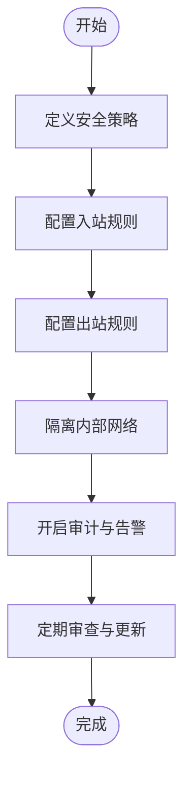

[此流程图展示通用网络安全策略，不直接映射具体源码文件]

### 前端构建与静态资源发布
- 构建工具：Vite，输出静态资源到dist目录。
- 发布方式：Nginx直接托管静态资源，启用缓存与压缩。
- 环境变量：通过构建时注入API地址与功能开关。
- 版本管理：文件名哈希，便于缓存失效与灰度发布。

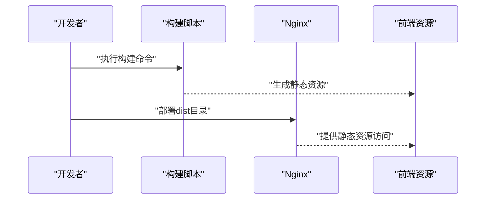

图表来源
- [package.json](file://dip-system/frontend-web/package.json)
- [vite.config.ts](file://dip-system/frontend-web/vite.config.ts)

章节来源
- [package.json](file://dip-system/frontend-web/package.json)
- [vite.config.ts](file://dip-system/frontend-web/vite.config.ts)

### 数据库初始化脚本
- 用途：创建初始表结构与基础数据。
- 执行时机：首次部署或迁移后执行。
- 幂等性：脚本应支持重复执行而不影响数据一致性。
- 回滚策略：提供回滚脚本与验证步骤。

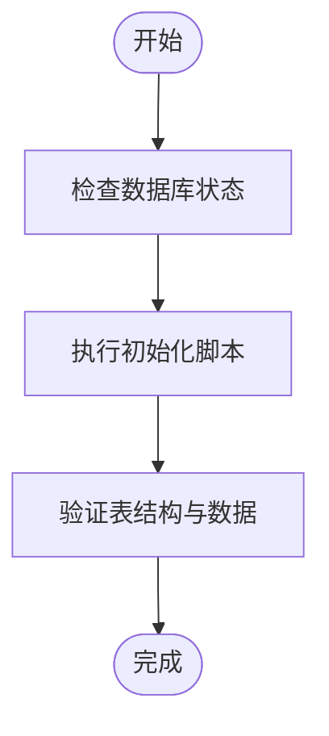

图表来源
- [init-db.sql](file://scripts/init-db.sql)

章节来源
- [init-db.sql](file://scripts/init-db.sql)

## 依赖关系分析
- 后端依赖：ASP.NET Core运行时、Entity Framework、数据库驱动。
- 前端依赖：Node.js与包管理器，构建工具链。
- 基础设施依赖：Nginx、操作系统库、SSL库。
- 容器化依赖：Docker与编排工具。

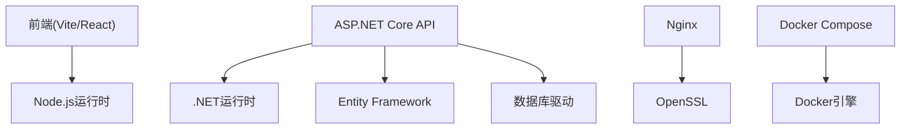

图表来源
- [package.json](file://dip-system/frontend-web/package.json)
- [Program.cs](file://dip-system/api/Program.cs)
- [docker-compose.yml](file://dip-system/docker-compose.yml)

章节来源
- [package.json](file://dip-system/frontend-web/package.json)
- [Program.cs](file://dip-system/api/Program.cs)
- [docker-compose.yml](file://dip-system/docker-compose.yml)

## 性能考虑
- 基准测试：使用压测工具模拟真实负载，评估QPS、延迟与错误率。
- 容量规划：根据峰值流量与增长趋势规划CPU、内存与带宽。
- 缓存策略：热点数据缓存，减少数据库压力。
- 连接池：合理配置数据库与外部服务连接池大小。
- 异步处理：I/O密集型操作使用异步，提升吞吐。
- 监控指标：关注CPU、内存、GC、线程池、数据库连接数与慢查询。

[本节为通用性能指导，不直接分析具体文件]

## 故障排查指南
- 常见问题：
  - HTTPS握手失败：检查证书链、协议套件与时间同步。
  - 数据库连接超时：检查网络连通性、连接池与慢查询。
  - 前端资源404：确认构建产物路径与Nginx映射。
  - API服务崩溃：查看进程日志与系统资源使用情况。
- 诊断工具：
  - 日志查看：集中式日志平台与本地日志轮转。
  - 指标采集：Prometheus与Grafana可视化。
  - 网络诊断：ping、traceroute、curl与tcpdump。
  - 性能剖析：dotnet-counters与APM工具。

章节来源
- [Program.cs](file://dip-system/api/Program.cs)
- [appsettings.json](file://dip-system/api/appsettings.json)
- [docker-compose.yml](file://dip-system/docker-compose.yml)

## 结论
通过合理的架构设计与严格的运维规范，DIP系统可在生产环境中稳定运行。建议持续优化性能与安全性，完善监控与自动化能力，确保业务连续性与用户体验。

[本节为总结性内容，不直接分析具体文件]

## 附录
- 术语表：Nginx、SSL、TLS、HSTS、QPS、RTO、RPO等。
- 参考链接：官方文档与最佳实践指南。
- 变更管理：版本发布与回滚流程。

[本节为补充信息，不直接分析具体文件]