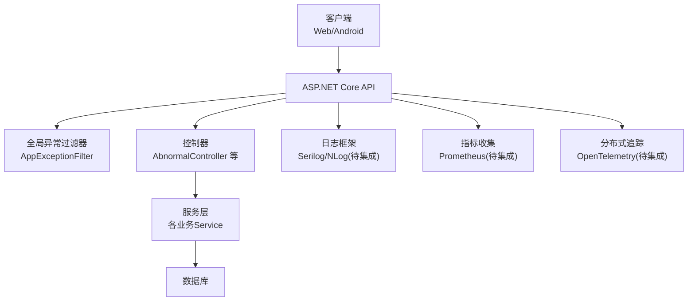
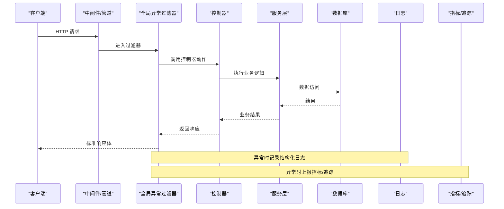
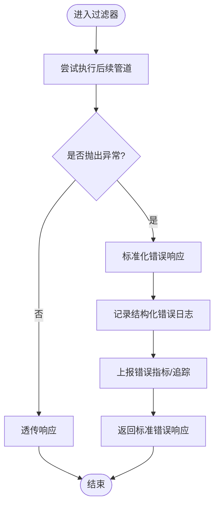
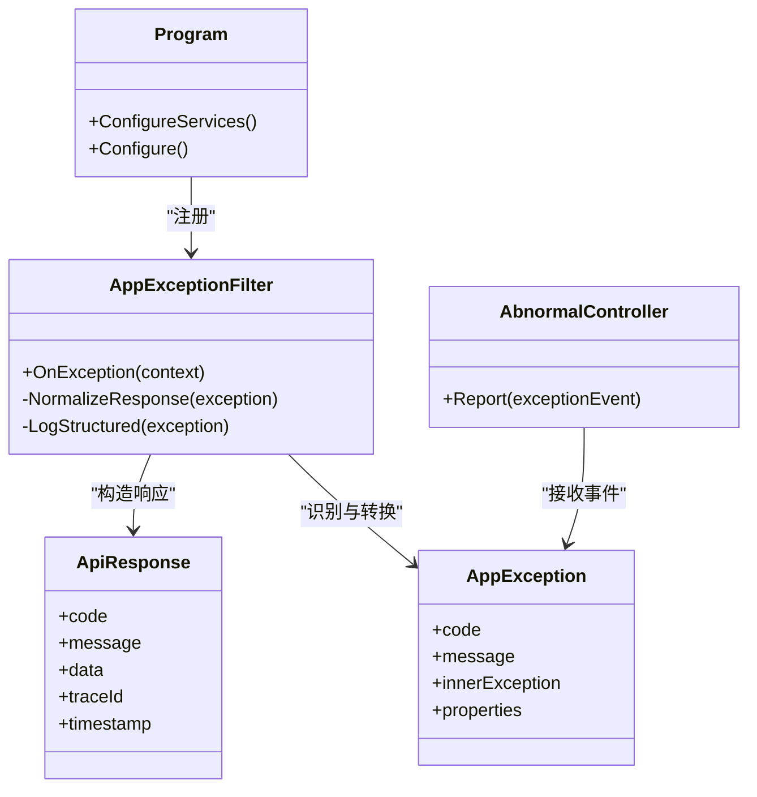

# 监控与日志

<cite>
**本文引用的文件**   
- [Program.cs](file://dip-system/api/Program.cs)
- [AppExceptionFilter.cs](file://dip-system/api/Controllers/AppExceptionFilter.cs)
- [AbnormalController.cs](file://dip-system/api/Controllers/AbnormalController.cs)
- [ApiResponse.cs](file://dip-system/api/Models/ApiResponse.cs)
- [AppException.cs](file://dip-system/api/Services/AppException.cs)
- [appsettings.json](file://dip-system/api/appsettings.json)
- [Docker Compose](file://dip-system/docker-compose.yml)
</cite>

## 目录
1. [简介](#简介)
2. [项目结构](#项目结构)
3. [核心组件](#核心组件)
4. [架构总览](#架构总览)
5. [详细组件分析](#详细组件分析)
6. [依赖关系分析](#依赖关系分析)
7. [性能考虑](#性能考虑)
8. [故障排查指南](#故障排查指南)
9. [结论](#结论)
10. [附录](#附录)

## 简介
本文件为 DIP 系统的“监控与日志”配置文档，面向应用层异常过滤器、全局异常处理、错误信息标准化、请求响应日志记录、结构化日志格式、日志级别、日志轮转策略、性能监控指标、关键业务指标、告警规则、分布式追踪与链路跟踪、慢查询分析、日志聚合与可视化、实时监控面板以及故障排查工具与常见问题诊断方法。内容基于仓库中现有代码与配置进行梳理，并给出可操作的落地建议。

## 项目结构
DIP 系统后端采用 ASP.NET Core API，前端为 Web 与 Android 客户端。监控与日志相关的关键位置包括：
- 应用启动与中间件注册（Program.cs）
- 全局异常过滤器（AppExceptionFilter.cs）
- 统一响应模型（ApiResponse.cs）
- 自定义异常类型（AppException.cs）
- 异常上报控制器（AbnormalController.cs）
- 应用配置（appsettings.json）
- 容器编排（docker-compose.yml）

图表来源
- [Program.cs](file://dip-system/api/Program.cs)
- [AppExceptionFilter.cs](file://dip-system/api/Controllers/AppExceptionFilter.cs)
- [AbnormalController.cs](file://dip-system/api/Controllers/AbnormalController.cs)
- [ApiResponse.cs](file://dip-system/api/Models/ApiResponse.cs)
- [AppException.cs](file://dip-system/api/Services/AppException.cs)

章节来源
- [Program.cs](file://dip-system/api/Program.cs)
- [AppExceptionFilter.cs](file://dip-system/api/Controllers/AppExceptionFilter.cs)
- [AbnormalController.cs](file://dip-system/api/Controllers/AbnormalController.cs)
- [ApiResponse.cs](file://dip-system/api/Models/ApiResponse.cs)
- [AppException.cs](file://dip-system/api/Services/AppException.cs)

## 核心组件
- 全局异常过滤器：用于捕获未处理异常、统一错误码与消息、记录结构化日志、输出标准响应体。
- 统一响应模型：定义成功/失败的标准返回结构，便于前后端一致解析。
- 自定义异常：封装业务异常与错误码，便于上层过滤与分类处理。
- 异常上报控制器：提供异常事件上报接口，供外部或内部模块主动上报异常。
- 应用配置：集中管理日志级别、输出目标、采样率等开关。

章节来源
- [AppExceptionFilter.cs](file://dip-system/api/Controllers/AppExceptionFilter.cs)
- [ApiResponse.cs](file://dip-system/api/Models/ApiResponse.cs)
- [AppException.cs](file://dip-system/api/Services/AppException.cs)
- [AbnormalController.cs](file://dip-system/api/Controllers/AbnormalController.cs)
- [appsettings.json](file://dip-system/api/appsettings.json)

## 架构总览
下图展示从请求进入 API 到异常被捕获、日志与指标输出的整体流程。

图表来源
- [Program.cs](file://dip-system/api/Program.cs)
- [AppExceptionFilter.cs](file://dip-system/api/Controllers/AppExceptionFilter.cs)
- [AbnormalController.cs](file://dip-system/api/Controllers/AbnormalController.cs)

## 详细组件分析

### 全局异常过滤器（AppExceptionFilter）
职责
- 捕获控制器及中间件抛出的未处理异常
- 将异常转换为标准错误响应（状态码、错误码、消息、时间戳、请求ID）
- 记录结构化日志（包含上下文、堆栈摘要、请求元数据）
- 可选：上报指标（如错误计数、延迟）与分布式追踪标签

配置要点
- 在 Program.cs 中注册为全局过滤器
- 支持按环境区分日志级别与是否输出敏感字段
- 支持白名单忽略特定异常类型（如 404、401）

使用方式
- 无需在每个控制器重复 try-catch
- 通过自定义 AppException 携带业务错误码与消息

图表来源
- [AppExceptionFilter.cs](file://dip-system/api/Controllers/AppExceptionFilter.cs)

章节来源
- [AppExceptionFilter.cs](file://dip-system/api/Controllers/AppExceptionFilter.cs)

### 统一响应模型（ApiResponse）
设计原则
- 所有 API 响应遵循统一结构：code、message、data、traceId、timestamp
- 成功与失败路径均使用该结构，便于前端统一处理

使用建议
- 控制器与服务层返回 ApiResponse<T>
- 错误场景由过滤器填充 code/message，成功场景由业务填充 data

章节来源
- [ApiResponse.cs](file://dip-system/api/Models/ApiResponse.cs)

### 自定义异常（AppException）
设计原则
- 封装错误码、错误消息、可选的原始异常与扩展属性
- 便于过滤器识别与分类处理

使用建议
- 业务层抛出 AppException 而非通用 Exception
- 对可恢复错误与不可恢复错误设置不同错误码

章节来源
- [AppException.cs](file://dip-system/api/Services/AppException.cs)

### 异常上报控制器（AbnormalController）
职责
- 提供异常事件上报接口，供外部系统或 SDK 主动上报
- 接收结构化异常事件，写入日志与指标

使用建议
- 上报内容包括：异常类型、消息、堆栈摘要、上下文、时间戳、traceId
- 控制上报频率与采样率，避免风暴

章节来源
- [AbnormalController.cs](file://dip-system/api/Controllers/AbnormalController.cs)

### 应用配置（appsettings.json）
建议配置项
- 日志级别（Debug/Information/Warning/Error/None）
- 输出目标（控制台、文件、远程收集器）
- 采样率（指标与追踪）
- 是否启用敏感字段脱敏
- 健康检查与端口配置

章节来源
- [appsettings.json](file://dip-system/api/appsettings.json)

## 依赖关系分析
- Program.cs 负责注册过滤器、中间件、服务与配置
- AppExceptionFilter 依赖 ApiResponse 与 AppException
- AbnormalController 依赖日志与指标组件（待集成）
- 服务层与数据库访问层产生性能与慢查询问题，需结合追踪与指标定位

图表来源
- [Program.cs](file://dip-system/api/Program.cs)
- [AppExceptionFilter.cs](file://dip-system/api/Controllers/AppExceptionFilter.cs)
- [ApiResponse.cs](file://dip-system/api/Models/ApiResponse.cs)
- [AppException.cs](file://dip-system/api/Services/AppException.cs)
- [AbnormalController.cs](file://dip-system/api/Controllers/AbnormalController.cs)

章节来源
- [Program.cs](file://dip-system/api/Program.cs)
- [AppExceptionFilter.cs](file://dip-system/api/Controllers/AppExceptionFilter.cs)
- [ApiResponse.cs](file://dip-system/api/Models/ApiResponse.cs)
- [AppException.cs](file://dip-system/api/Services/AppException.cs)
- [AbnormalController.cs](file://dip-system/api/Controllers/AbnormalController.cs)

## 性能考虑
- 日志写入异步化，避免阻塞请求路径
- 合理设置日志级别，生产环境默认 Information 及以上
- 对高频接口开启采样，降低日志与指标开销
- 对慢查询添加索引与 SQL 优化，结合慢查询阈值告警
- 使用连接池与缓存减少数据库压力
- 指标采集轻量实现，避免 GC 抖动

[本节为通用指导，不直接分析具体文件]

## 故障排查指南
常见症状与定位步骤
- 5xx 错误增多
  - 查看全局异常过滤器记录的错误日志
  - 检查错误码分布与热点接口
  - 关联分布式追踪 ID 定位调用链
- 响应缓慢
  - 查看接口耗时指标与慢查询日志
  - 检查数据库锁与索引命中
  - 确认上游依赖超时与重试策略
- 异常风暴
  - 检查异常上报控制器是否限流与去重
  - 调整采样率与告警阈值
  - 快速回滚或降级非核心功能

实用工具
- 日志检索：按 traceId、错误码、接口名筛选
- 指标看板：QPS、错误率、P95/P99 延迟、慢查询数
- 告警通知：错误率突增、延迟超阈、资源耗尽

章节来源
- [AppExceptionFilter.cs](file://dip-system/api/Controllers/AppExceptionFilter.cs)
- [AbnormalController.cs](file://dip-system/api/Controllers/AbnormalController.cs)
- [appsettings.json](file://dip-system/api/appsettings.json)

## 结论
通过全局异常过滤器与统一响应模型，DIP 系统实现了标准化的错误处理与日志记录。结合结构化日志、指标与分布式追踪，可有效提升可观测性与排障效率。建议在现有基础上逐步集成日志聚合平台、可视化看板与告警规则，形成完整的监控闭环。

[本节为总结性内容，不直接分析具体文件]

## 附录

### 应用层异常过滤器配置与使用清单
- 注册位置：Program.cs
- 过滤器职责：捕获异常、标准化响应、记录结构化日志、上报指标/追踪
- 错误码规范：参考 AppException 的错误码约定
- 日志字段：traceId、requestId、method、path、statusCode、durationMs、exceptionType、message、stackTraceSummary、userId、tenantId
- 日志级别：开发 Debug，生产 Information 及以上
- 敏感信息：禁止记录密码、Token、身份证号等

章节来源
- [Program.cs](file://dip-system/api/Program.cs)
- [AppExceptionFilter.cs](file://dip-system/api/Controllers/AppExceptionFilter.cs)
- [ApiResponse.cs](file://dip-system/api/Models/ApiResponse.cs)
- [AppException.cs](file://dip-system/api/Services/AppException.cs)

### 结构化日志格式建议
- JSON 单行日志，便于聚合
- 固定字段：time、level、service、env、traceId、spanId、msg、context
- 上下文字段：userId、tenantId、ip、ua、method、path、query、bodyMasked
- 异常字段：exceptionType、message、stackTraceSummary、innerExceptionType

[本节为通用规范，不直接分析具体文件]

### 日志级别与轮转策略
- 级别划分：Trace、Debug、Information、Warning、Error、Critical
- 轮转策略：按大小（如 10MB）与时间（每日）双维度轮转，保留 30 天
- 压缩归档：启用 gzip 压缩，降低存储成本
- 远端收集：对接日志采集 Agent（如 Filebeat/Fluent Bit）

[本节为通用实践，不直接分析具体文件]

### 性能监控指标与告警
- 基础指标：QPS、错误率、P50/P95/P99 延迟、CPU/内存/GC
- 业务指标：订单创建成功率、库存扣减失败率、扫码识别成功率
- 告警规则：错误率 > 1% 持续 5 分钟；P95 > 500ms 持续 10 分钟；慢查询 > 阈值
- 告警渠道：邮件、企业微信、钉钉、短信

[本节为通用实践，不直接分析具体文件]

### 分布式追踪与慢查询分析
- 追踪注入：在入口生成 traceId，贯穿上下游
- 埋点规范：HTTP 入站/出站、数据库访问、缓存读写、消息队列
- 慢查询：SQL 执行时间 > 阈值记录慢查询日志，附带 SQL 与参数摘要
- 链路分析：按 traceId 串联全链路，定位瓶颈节点

[本节为通用实践，不直接分析具体文件]

### 日志聚合与可视化
- 聚合方案：ELK（Elasticsearch、Logstash、Kibana）或 Loki+Grafana
- 可视化面板：系统概览、错误趋势、接口耗时、慢查询 TopN、资源水位
- 实时面板：错误率、延迟、QPS 实时刷新，支持钻取

[本节为通用实践，不直接分析具体文件]

### 容器化部署与运行
- 镜像构建：多阶段构建，最小化运行时
- 环境变量：日志级别、输出目标、采样率、数据库连接串
- 健康检查：/healthz 暴露健康探针
- 编排：docker-compose 管理 API、数据库、日志采集

章节来源
- [Docker Compose](file://dip-system/docker-compose.yml)