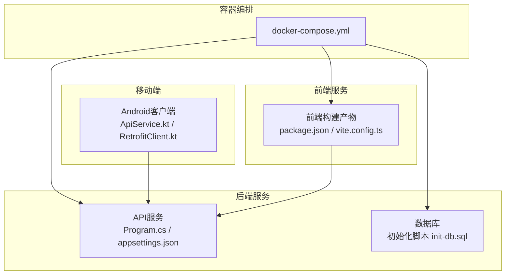
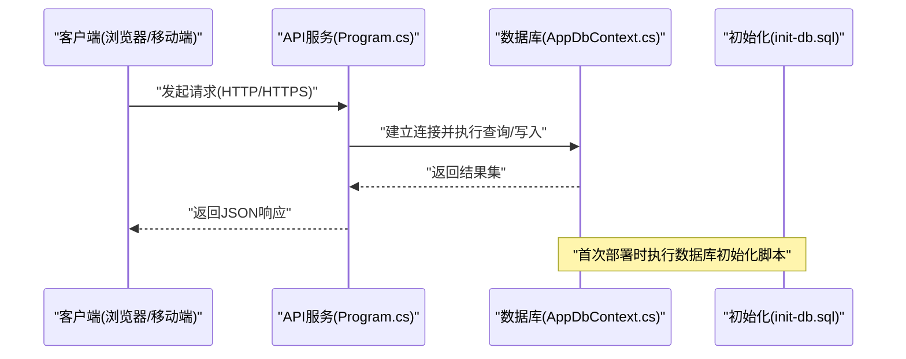
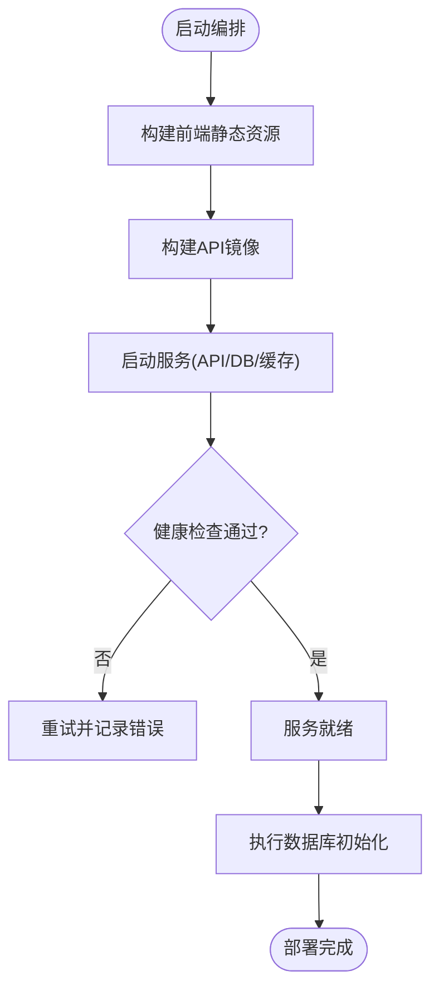
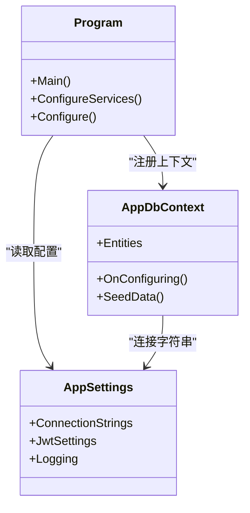
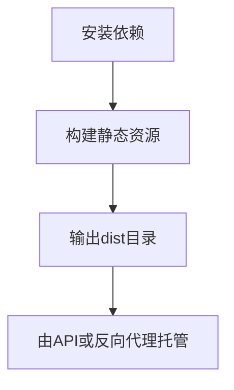
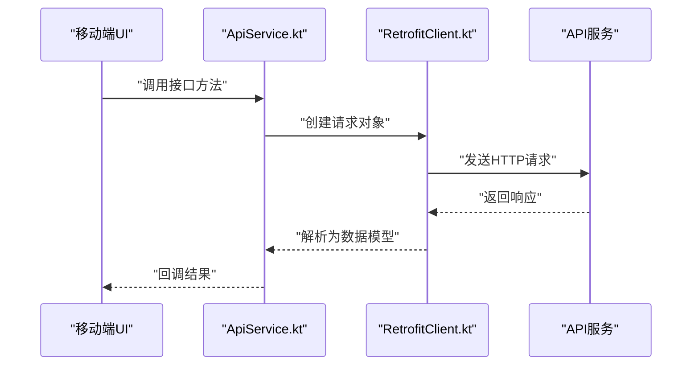
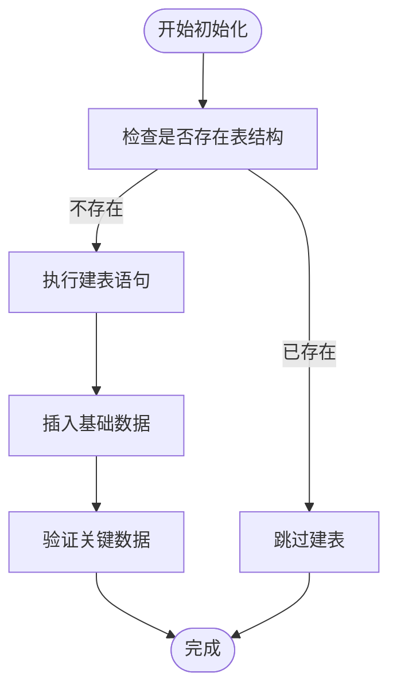
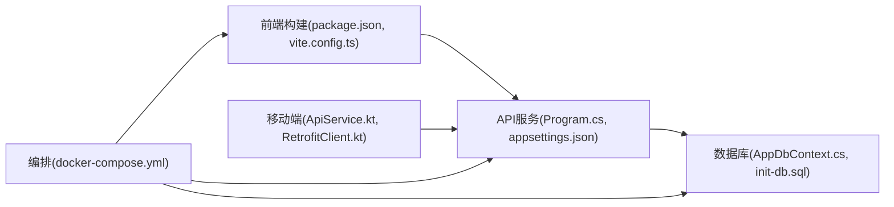

# 部署指南

<cite>
**本文引用的文件**   
- [docker-compose.yml](file://dip-system/docker-compose.yml)
- [Program.cs](file://dip-system/api/Program.cs)
- [appsettings.json](file://dip-system/api/appsettings.json)
- [AppDbContext.cs](file://dip-system/api/Data/AppDbContext.cs)
- [init-db.sql](file://scripts/init-db.sql)
- [package.json](file://dip-system/frontend-web/package.json)
- [vite.config.ts](file://dip-system/frontend-web/vite.config.ts)
- [ApiService.kt](file://mobile-android/app/src/main/java/com/dip/material/data/network/ApiService.kt)
- [RetrofitClient.kt](file://mobile-android/app/src/main/java/com/dip/material/data/network/RetrofitClient.kt)
</cite>

## 目录
1. [简介](#简介)
2. [项目结构](#项目结构)
3. [核心组件](#核心组件)
4. [架构总览](#架构总览)
5. [详细组件分析](#详细组件分析)
6. [依赖关系分析](#依赖关系分析)
7. [性能考虑](#性能考虑)
8. [故障排查指南](#故障排查指南)
9. [结论](#结论)
10. [附录](#附录)

## 简介
本指南面向DIP系统的生产与运维团队，提供端到端的容器化部署方案与最佳实践。内容涵盖：
- Docker镜像构建与docker-compose编排
- 服务依赖管理与初始化流程
- 生产环境配置（数据库、环境变量、SSL）
- CI/CD流水线与自动化发布策略
- 监控告警、日志收集与性能调优
- 故障排查、备份恢复与灾难恢复预案
- 安全加固、访问控制与审计日志
- 多环境配置模板与脚本工具

## 项目结构
DIP系统由后端API、前端Web与移动端三部分组成，采用容器化部署。关键目录与职责如下：
- dip-system/api：ASP.NET Core Web API，包含控制器、服务、数据模型与上下文
- dip-system/frontend-web：基于Vite的前端应用，静态资源由API或反向代理托管
- mobile-android：Android客户端，通过REST调用后端API
- scripts：数据库初始化脚本
- docker-compose.yml：服务编排与依赖管理

图表来源
- [docker-compose.yml](file://dip-system/docker-compose.yml)
- [Program.cs](file://dip-system/api/Program.cs)
- [appsettings.json](file://dip-system/api/appsettings.json)
- [init-db.sql](file://scripts/init-db.sql)
- [package.json](file://dip-system/frontend-web/package.json)
- [vite.config.ts](file://dip-system/frontend-web/vite.config.ts)
- [ApiService.kt](file://mobile-android/app/src/main/java/com/dip/material/data/network/ApiService.kt)
- [RetrofitClient.kt](file://mobile-android/app/src/main/java/com/dip/material/data/network/RetrofitClient.kt)

章节来源
- [docker-compose.yml](file://dip-system/docker-compose.yml)
- [Program.cs](file://dip-system/api/Program.cs)
- [appsettings.json](file://dip-system/api/appsettings.json)
- [init-db.sql](file://scripts/init-db.sql)
- [package.json](file://dip-system/frontend-web/package.json)
- [vite.config.ts](file://dip-system/frontend-web/vite.config.ts)
- [ApiService.kt](file://mobile-android/app/src/main/java/com/dip/material/data/network/ApiService.kt)
- [RetrofitClient.kt](file://mobile-android/app/src/main/java/com/dip/material/data/network/RetrofitClient.kt)

## 核心组件
- 后端API服务：负责业务逻辑、认证授权、数据访问与对外接口
- 前端Web：用户界面与交互，构建后作为静态资源提供服务
- 移动端：现场作业与扫码采集，通过REST调用后端
- 数据库：持久化存储，使用初始化脚本完成表结构与基础数据准备
- 编排与构建：docker-compose统一启动服务；前端通过包管理器与构建工具生成静态资源

章节来源
- [Program.cs](file://dip-system/api/Program.cs)
- [appsettings.json](file://dip-system/api/appsettings.json)
- [AppDbContext.cs](file://dip-system/api/Data/AppDbContext.cs)
- [init-db.sql](file://scripts/init-db.sql)
- [package.json](file://dip-system/frontend-web/package.json)
- [vite.config.ts](file://dip-system/frontend-web/vite.config.ts)

## 架构总览
DIP系统采用前后端分离与移动端并行的架构。API服务为唯一的数据入口，前端与移动端均通过HTTP/HTTPS与其通信。数据库独立部署并通过连接字符串进行配置。

图表来源
- [Program.cs](file://dip-system/api/Program.cs)
- [AppDbContext.cs](file://dip-system/api/Data/AppDbContext.cs)
- [init-db.sql](file://scripts/init-db.sql)

## 详细组件分析

### 容器编排与服务依赖
- 使用docker-compose定义API、前端静态资源与数据库等服务的启动顺序与健康检查
- 通过环境变量注入敏感配置（如数据库连接串、JWT密钥、SSL路径）
- 卷挂载用于持久化数据库文件与日志输出

章节来源
- [docker-compose.yml](file://dip-system/docker-compose.yml)

### 后端API服务
- Program.cs：应用入口，注册中间件、路由、依赖注入与认证授权
- appsettings.json：运行配置（端口、日志级别、外部服务地址、JWT设置等）
- AppDbContext.cs：EF Core数据上下文，映射实体与数据库操作

图表来源
- [Program.cs](file://dip-system/api/Program.cs)
- [appsettings.json](file://dip-system/api/appsettings.json)
- [AppDbContext.cs](file://dip-system/api/Data/AppDbContext.cs)

章节来源
- [Program.cs](file://dip-system/api/Program.cs)
- [appsettings.json](file://dip-system/api/appsettings.json)
- [AppDbContext.cs](file://dip-system/api/Data/AppDbContext.cs)

### 前端Web构建与部署
- package.json：定义依赖与构建脚本
- vite.config.ts：开发服务器、构建输出路径与代理配置

章节来源
- [package.json](file://dip-system/frontend-web/package.json)
- [vite.config.ts](file://dip-system/frontend-web/vite.config.ts)

### 移动端网络配置
- ApiService.kt：声明REST接口
- RetrofitClient.kt：配置BaseURL、拦截器与超时参数

图表来源
- [ApiService.kt](file://mobile-android/app/src/main/java/com/dip/material/data/network/ApiService.kt)
- [RetrofitClient.kt](file://mobile-android/app/src/main/java/com/dip/material/data/network/RetrofitClient.kt)

章节来源
- [ApiService.kt](file://mobile-android/app/src/main/java/com/dip/material/data/network/ApiService.kt)
- [RetrofitClient.kt](file://mobile-android/app/src/main/java/com/dip/material/data/network/RetrofitClient.kt)

### 数据库初始化
- init-db.sql：创建表结构、索引与基础数据
- 在容器启动阶段或CI阶段执行，确保数据一致性

章节来源
- [init-db.sql](file://scripts/init-db.sql)

## 依赖关系分析
- 后端依赖：数据库、缓存（可选）、消息队列（可选）
- 前端依赖：Node.js运行时与包管理器
- 移动端依赖：后端API的BaseURL与认证机制
- 编排依赖：docker-compose版本、网络与卷驱动

图表来源
- [package.json](file://dip-system/frontend-web/package.json)
- [vite.config.ts](file://dip-system/frontend-web/vite.config.ts)
- [Program.cs](file://dip-system/api/Program.cs)
- [appsettings.json](file://dip-system/api/appsettings.json)
- [AppDbContext.cs](file://dip-system/api/Data/AppDbContext.cs)
- [init-db.sql](file://scripts/init-db.sql)
- [ApiService.kt](file://mobile-android/app/src/main/java/com/dip/material/data/network/ApiService.kt)
- [RetrofitClient.kt](file://mobile-android/app/src/main/java/com/dip/material/data/network/RetrofitClient.kt)
- [docker-compose.yml](file://dip-system/docker-compose.yml)

章节来源
- [docker-compose.yml](file://dip-system/docker-compose.yml)
- [Program.cs](file://dip-system/api/Program.cs)
- [appsettings.json](file://dip-system/api/appsettings.json)
- [AppDbContext.cs](file://dip-system/api/Data/AppDbContext.cs)
- [init-db.sql](file://scripts/init-db.sql)
- [package.json](file://dip-system/frontend-web/package.json)
- [vite.config.ts](file://dip-system/frontend-web/vite.config.ts)
- [ApiService.kt](file://mobile-android/app/src/main/java/com/dip/material/data/network/ApiService.kt)
- [RetrofitClient.kt](file://mobile-android/app/src/main/java/com/dip/material/data/network/RetrofitClient.kt)

## 性能考虑
- API层：启用响应压缩、合理设置线程池与连接池大小、避免N+1查询
- 数据库层：优化索引、分页与批量操作、定期维护统计信息
- 前端层：静态资源缓存、按需加载与懒渲染
- 移动端层：合理设置超时与重试策略、减少无效请求
- 容器层：限制CPU与内存、使用只读根文件系统、最小化镜像体积

[本节为通用指导，不直接分析具体文件]

## 故障排查指南
- 服务无法启动：检查环境变量与配置文件、查看容器日志与端口占用
- 数据库连接失败：验证连接串、权限与网络连通性
- 前端无法访问API：确认CORS、BaseURL与代理配置
- 移动端请求失败：检查网络权限、证书与签名配置
- 性能问题：定位慢查询、GC压力与I/O瓶颈

章节来源
- [Program.cs](file://dip-system/api/Program.cs)
- [appsettings.json](file://dip-system/api/appsettings.json)
- [AppDbContext.cs](file://dip-system/api/Data/AppDbContext.cs)
- [ApiService.kt](file://mobile-android/app/src/main/java/com/dip/material/data/network/ApiService.kt)
- [RetrofitClient.kt](file://mobile-android/app/src/main/java/com/dip/material/data/network/RetrofitClient.kt)

## 结论
通过容器化与编排，DIP系统实现了可重复、可观测与可扩展的部署能力。结合严格的配置管理、安全加固与完善的监控告警，可在生产环境中稳定运行并快速迭代。

[本节为总结性内容，不直接分析具体文件]

## 附录

### 生产环境配置要求
- 数据库初始化：首次部署前执行init-db.sql，确保表结构与基础数据完整
- 环境变量：集中管理敏感信息（数据库连接串、JWT密钥、第三方服务凭据）
- SSL证书：配置HTTPS终止于反向代理或API网关，确保证书链有效与自动续期

章节来源
- [init-db.sql](file://scripts/init-db.sql)
- [appsettings.json](file://dip-system/api/appsettings.json)
- [docker-compose.yml](file://dip-system/docker-compose.yml)

### CI/CD流水线与自动化部署
- 构建阶段：前端构建静态资源、后端构建镜像、单元测试与静态扫描
- 测试阶段：集成测试、接口契约校验与安全漏洞扫描
- 发布阶段：灰度发布、蓝绿切换与回滚策略
- 制品管理：镜像仓库与前端静态资源仓库统一管理

[本节为通用指导，不直接分析具体文件]

### 监控告警与日志收集
- 指标采集：API吞吐、延迟、错误率、数据库连接池与慢查询
- 日志聚合：结构化日志、集中存储与检索
- 告警规则：阈值与事件触发，通知渠道（邮件、IM、短信）
- 追踪链路：跨服务请求ID与分布式追踪

[本节为通用指导，不直接分析具体文件]

### 备份恢复与灾难恢复
- 备份策略：全量与增量备份、异地容灾与保留周期
- 恢复演练：定期演练恢复流程，验证数据一致性与可用性
- 灾难预案：故障隔离、降级与熔断、快速切换与重建

[本节为通用指导，不直接分析具体文件]

### 安全加固与访问控制
- 身份认证：JWT令牌、短期会话与刷新机制
- 授权控制：角色与权限模型、最小权限原则
- 网络安全：TLS加密、防火墙与访问白名单
- 审计日志：关键操作留痕与不可篡改存储

[本节为通用指导，不直接分析具体文件]

### 多环境配置模板与脚本工具
- 环境模板：开发、测试、预生产、生产的配置差异与环境变量清单
- 脚本工具：一键部署、滚动更新、健康检查与回滚脚本
- 配置校验：启动前校验必填项与格式正确性

[本节为通用指导，不直接分析具体文件]