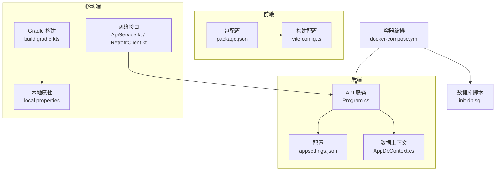
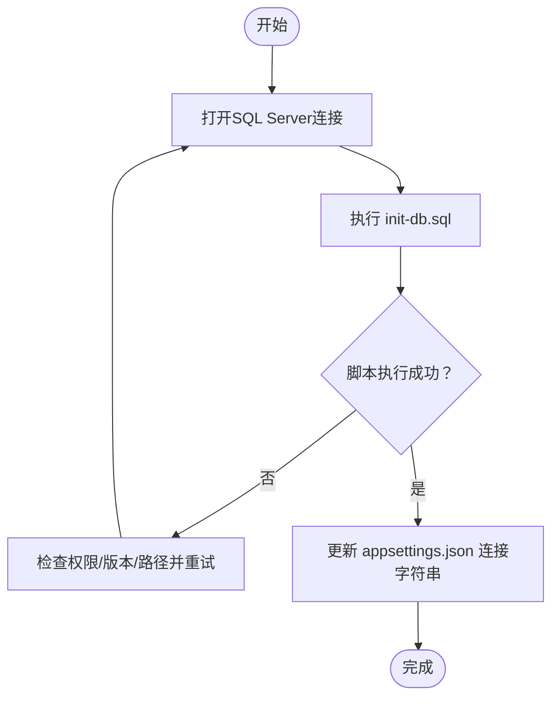
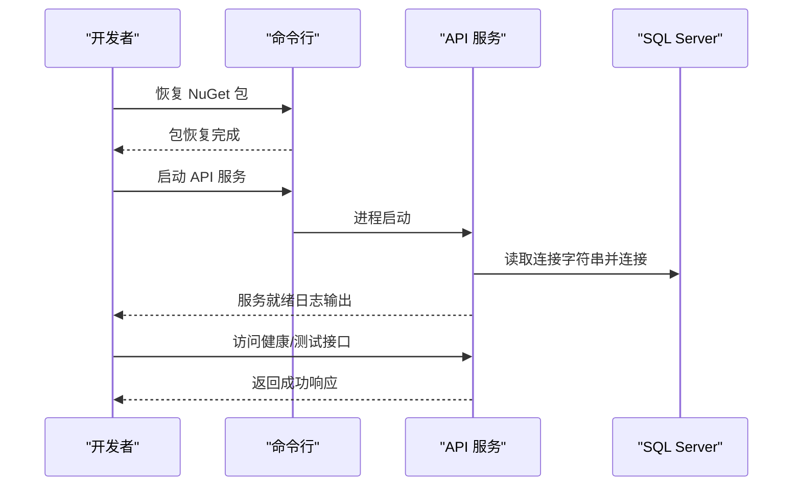
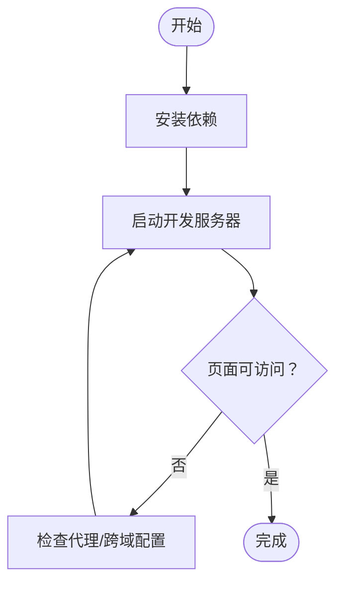
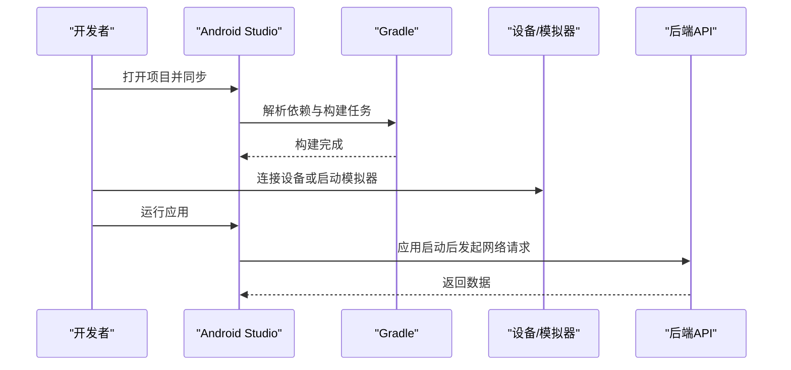
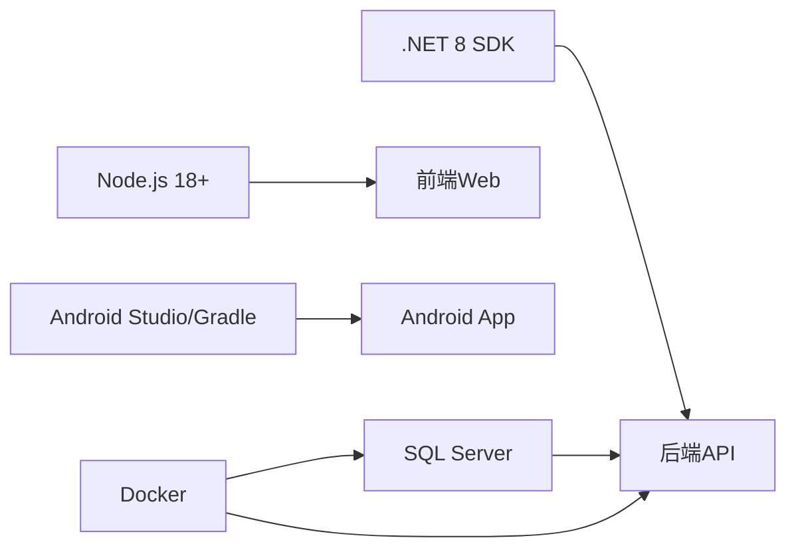

# 快速开始

<cite>
**本文引用的文件**   
- [Program.cs](file://dip-system/api/Program.cs)
- [appsettings.json](file://dip-system/api/appsettings.json)
- [AppDbContext.cs](file://dip-system/api/Data/AppDbContext.cs)
- [init-db.sql](file://scripts/init-db.sql)
- [package.json](file://dip-system/frontend-web/package.json)
- [vite.config.ts](file://dip-system/frontend-web/vite.config.ts)
- [build.gradle.kts](file://mobile-android/build.gradle.kts)
- [local.properties](file://mobile-android/local.properties)
- [ApiService.kt](file://mobile-android/app/src/main/java/com/dip/material/data/network/ApiService.kt)
- [RetrofitClient.kt](file://mobile-android/app/src/main/java/com/dip/material/data/network/RetrofitClient.kt)
- [docker-compose.yml](file://dip-system/docker-compose.yml)
</cite>

## 目录
1. [简介](#简介)
2. [项目结构](#项目结构)
3. [核心组件](#核心组件)
4. [架构总览](#架构总览)
5. [详细组件分析](#详细组件分析)
6. [依赖分析](#依赖分析)
7. [性能考虑](#性能考虑)
8. [故障排除指南](#故障排除指南)
9. [结论](#结论)
10. [附录：命令行操作示例](#附录命令行操作示例)

## 简介
本指南面向首次接触DIP物料管理系统的开发者与实施人员，提供从零到可运行的完整步骤。你将依次完成环境准备、数据库初始化、后端API服务启动、前端Web应用搭建、Android应用配置与运行，并附带常见问题排查与命令参考。

## 项目结构
仓库包含三大子系统：
- 后端API（ASP.NET Core）：位于 dip-system/api
- 前端Web（Vite + React/TypeScript）：位于 dip-system/frontend-web
- Android移动端（Kotlin + Jetpack Compose）：位于 mobile-android
- 数据库脚本：scripts/init-db.sql
- 可选容器编排：dip-system/docker-compose.yml



图表来源
- [Program.cs](file://dip-system/api/Program.cs)
- [appsettings.json](file://dip-system/api/appsettings.json)
- [AppDbContext.cs](file://dip-system/api/Data/AppDbContext.cs)
- [package.json](file://dip-system/frontend-web/package.json)
- [vite.config.ts](file://dip-system/frontend-web/vite.config.ts)
- [build.gradle.kts](file://mobile-android/build.gradle.kts)
- [local.properties](file://mobile-android/local.properties)
- [ApiService.kt](file://mobile-android/app/src/main/java/com/dip/material/data/network/ApiService.kt)
- [RetrofitClient.kt](file://mobile-android/app/src/main/java/com/dip/material/data/network/RetrofitClient.kt)
- [docker-compose.yml](file://dip-system/docker-compose.yml)
- [init-db.sql](file://scripts/init-db.sql)

章节来源
- [Program.cs](file://dip-system/api/Program.cs)
- [appsettings.json](file://dip-system/api/appsettings.json)
- [AppDbContext.cs](file://dip-system/api/Data/AppDbContext.cs)
- [package.json](file://dip-system/frontend-web/package.json)
- [vite.config.ts](file://dip-system/frontend-web/vite.config.ts)
- [build.gradle.kts](file://mobile-android/build.gradle.kts)
- [local.properties](file://mobile-android/local.properties)
- [ApiService.kt](file://mobile-android/app/src/main/java/com/dip/material/data/network/ApiService.kt)
- [RetrofitClient.kt](file://mobile-android/app/src/main/java/com/dip/material/data/network/RetrofitClient.kt)
- [docker-compose.yml](file://dip-system/docker-compose.yml)
- [init-db.sql](file://scripts/init-db.sql)

## 核心组件
- 后端API服务：基于ASP.NET Core，使用Entity Framework连接SQL Server，通过配置文件加载连接字符串与运行时设置。
- 前端Web应用：基于Vite的React/TypeScript工程，开发服务器默认监听本地端口，生产构建输出静态资源。
- Android应用：Kotlin + Compose UI，通过Retrofit调用后端API；本地SDK路径由local.properties指定。
- 数据库初始化：通过init-db.sql脚本创建库表结构与基础数据。

章节来源
- [Program.cs](file://dip-system/api/Program.cs)
- [appsettings.json](file://dip-system/api/appsettings.json)
- [AppDbContext.cs](file://dip-system/api/Data/AppDbContext.cs)
- [package.json](file://dip-system/frontend-web/package.json)
- [vite.config.ts](file://dip-system/frontend-web/vite.config.ts)
- [build.gradle.kts](file://mobile-android/build.gradle.kts)
- [local.properties](file://mobile-android/local.properties)
- [ApiService.kt](file://mobile-android/app/src/main/java/com/dip/material/data/network/ApiService.kt)
- [RetrofitClient.kt](file://mobile-android/app/src/main/java/com/dip/material/data/network/RetrofitClient.kt)
- [init-db.sql](file://scripts/init-db.sql)

## 架构总览
系统采用前后端分离架构，移动端通过HTTP REST与后端交互。数据库为SQL Server，可通过本地安装或Docker容器运行。

```mermaid
sequenceDiagram
participant Dev as "开发者"
participant DB as "SQL Server"
participant API as "后端API"
participant FE as "前端Web"
participant AND as "Android App"
Dev->>DB : 执行 init-db.sql 初始化
Dev->>API : 启动 API 服务
API->>DB : 读取连接字符串并建立连接
Dev->>FE : 安装依赖并启动开发服务器
FE->>API : 请求业务接口
Dev->>AND : 配置SDK路径并运行
AND->>API : 通过 Retrofit 调用接口
```

图表来源
- [init-db.sql](file://scripts/init-db.sql)
- [Program.cs](file://dip-system/api/Program.cs)
- [appsettings.json](file://dip-system/api/appsettings.json)
- [package.json](file://dip-system/frontend-web/package.json)
- [vite.config.ts](file://dip-system/frontend-web/vite.config.ts)
- [build.gradle.kts](file://mobile-android/build.gradle.kts)
- [local.properties](file://mobile-android/local.properties)
- [ApiService.kt](file://mobile-android/app/src/main/java/com/dip/material/data/network/ApiService.kt)
- [RetrofitClient.kt](file://mobile-android/app/src/main/java/com/dip/material/data/network/RetrofitClient.kt)

## 详细组件分析

### 环境准备清单
- .NET 8 SDK：用于编译和运行后端API。
- Node.js 18+：用于前端Web应用的依赖安装与开发服务器。
- Android Studio：用于Android应用开发与调试，需配置好SDK路径。
- SQL Server：用于存储业务数据，支持本地实例或Docker容器。

章节来源
- [Program.cs](file://dip-system/api/Program.cs)
- [appsettings.json](file://dip-system/api/appsettings.json)
- [package.json](file://dip-system/frontend-web/package.json)
- [build.gradle.kts](file://mobile-android/build.gradle.kts)
- [local.properties](file://mobile-android/local.properties)
- [docker-compose.yml](file://dip-system/docker-compose.yml)

### 数据库初始化
- 使用SQL Server客户端工具连接到目标实例。
- 执行 scripts/init-db.sql 脚本以创建数据库、表结构与初始数据。
- 在 appsettings.json 中配置正确的连接字符串（服务器地址、数据库名、认证方式等）。



图表来源
- [init-db.sql](file://scripts/init-db.sql)
- [appsettings.json](file://dip-system/api/appsettings.json)

章节来源
- [init-db.sql](file://scripts/init-db.sql)
- [appsettings.json](file://dip-system/api/appsettings.json)

### 后端服务启动
- 进入后端项目目录，恢复NuGet包。
- 确认 appsettings.json 中的连接字符串正确。
- 启动API服务，验证健康检查或任意业务接口返回正常。



图表来源
- [Program.cs](file://dip-system/api/Program.cs)
- [appsettings.json](file://dip-system/api/appsettings.json)

章节来源
- [Program.cs](file://dip-system/api/Program.cs)
- [appsettings.json](file://dip-system/api/appsettings.json)

### 前端应用搭建
- 进入前端项目目录，安装依赖。
- 启动开发服务器，浏览器访问本地端口。
- 确保前端代理或跨域配置指向后端API地址。



图表来源
- [package.json](file://dip-system/frontend-web/package.json)
- [vite.config.ts](file://dip-system/frontend-web/vite.config.ts)

章节来源
- [package.json](file://dip-system/frontend-web/package.json)
- [vite.config.ts](file://dip-system/frontend-web/vite.config.ts)

### Android应用配置与运行
- 使用Android Studio打开项目，等待Gradle同步。
- 在 local.properties 中设置正确的SDK路径。
- 连接设备或启动模拟器，选择目标设备后运行。
- 确认Retrofit基础URL指向后端API地址。



图表来源
- [build.gradle.kts](file://mobile-android/build.gradle.kts)
- [local.properties](file://mobile-android/local.properties)
- [ApiService.kt](file://mobile-android/app/src/main/java/com/dip/material/data/network/ApiService.kt)
- [RetrofitClient.kt](file://mobile-android/app/src/main/java/com/dip/material/data/network/RetrofitClient.kt)

章节来源
- [build.gradle.kts](file://mobile-android/build.gradle.kts)
- [local.properties](file://mobile-android/local.properties)
- [ApiService.kt](file://mobile-android/app/src/main/java/com/dip/material/data/network/ApiService.kt)
- [RetrofitClient.kt](file://mobile-android/app/src/main/java/com/dip/material/data/network/RetrofitClient.kt)

## 依赖分析
- 后端依赖：.NET 8 SDK、SQL Server驱动、EF Core。
- 前端依赖：Node.js 18+、npm/yarn、Vite生态。
- 移动端依赖：Android Studio、Gradle、Kotlin、Retrofit。
- 可选依赖：Docker（用于快速部署SQL Server与API）。



图表来源
- [Program.cs](file://dip-system/api/Program.cs)
- [package.json](file://dip-system/frontend-web/package.json)
- [build.gradle.kts](file://mobile-android/build.gradle.kts)
- [docker-compose.yml](file://dip-system/docker-compose.yml)

章节来源
- [Program.cs](file://dip-system/api/Program.cs)
- [package.json](file://dip-system/frontend-web/package.json)
- [build.gradle.kts](file://mobile-android/build.gradle.kts)
- [docker-compose.yml](file://dip-system/docker-compose.yml)

## 性能考虑
- 数据库连接池：确保连接字符串参数合理，避免过多空闲连接。
- 前端缓存：合理使用浏览器缓存与CDN，减少重复请求。
- 移动端网络：启用连接复用与超时控制，避免频繁重连。
- 容器化：使用Docker隔离环境，便于横向扩展与弹性伸缩。

[本节为通用指导，不直接分析具体文件]

## 故障排除指南
- 无法连接数据库
  - 检查SQL Server是否运行、端口是否开放、防火墙规则。
  - 核对 appsettings.json 的连接字符串是否正确。
  - 确认 init-db.sql 已执行且用户具备足够权限。
- 前端无法访问后端接口
  - 检查代理配置与跨域设置。
  - 确认后端服务已启动且端口可达。
- Android应用无法联网
  - 检查 local.properties 的SDK路径。
  - 确认Retrofit基础URL与后端一致。
  - 检查设备/模拟器网络与证书配置。
- Docker相关问题
  - 检查镜像拉取与端口映射。
  - 查看容器日志定位错误。

章节来源
- [appsettings.json](file://dip-system/api/appsettings.json)
- [init-db.sql](file://scripts/init-db.sql)
- [vite.config.ts](file://dip-system/frontend-web/vite.config.ts)
- [local.properties](file://mobile-android/local.properties)
- [ApiService.kt](file://mobile-android/app/src/main/java/com/dip/material/data/network/ApiService.kt)
- [RetrofitClient.kt](file://mobile-android/app/src/main/java/com/dip/material/data/network/RetrofitClient.kt)
- [docker-compose.yml](file://dip-system/docker-compose.yml)

## 结论
按照本指南完成环境准备、数据库初始化、后端与前端启动、Android应用配置后，即可在本地完整运行DIP物料管理系统。如遇问题，请参考故障排除部分逐步定位与解决。

[本节为总结性内容，不直接分析具体文件]

## 附录：命令行操作示例
- 初始化数据库
  - 使用SQL Server客户端执行 scripts/init-db.sql。
- 启动后端API
  - 进入后端项目目录，恢复NuGet包并启动服务。
- 启动前端开发服务器
  - 进入前端项目目录，安装依赖并启动开发服务器。
- 运行Android应用
  - 在Android Studio中同步项目，配置local.properties，选择设备后运行。

章节来源
- [init-db.sql](file://scripts/init-db.sql)
- [Program.cs](file://dip-system/api/Program.cs)
- [package.json](file://dip-system/frontend-web/package.json)
- [vite.config.ts](file://dip-system/frontend-web/vite.config.ts)
- [build.gradle.kts](file://mobile-android/build.gradle.kts)
- [local.properties](file://mobile-android/local.properties)