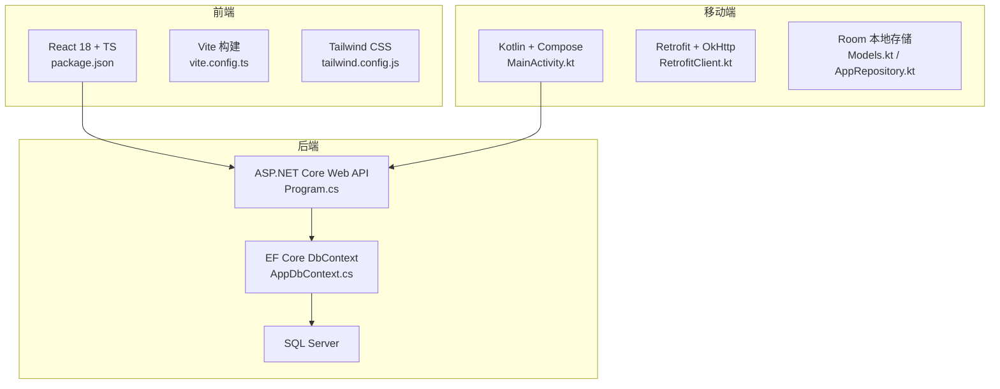
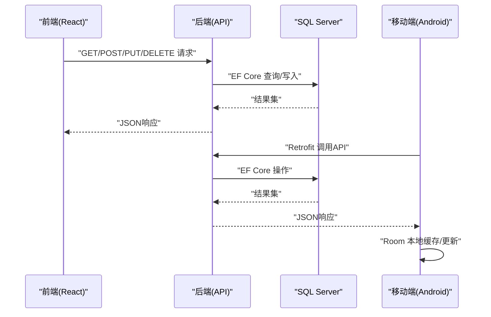
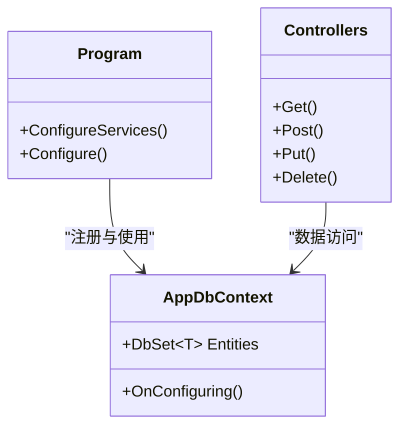
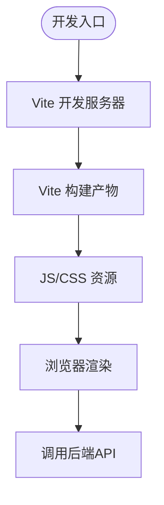
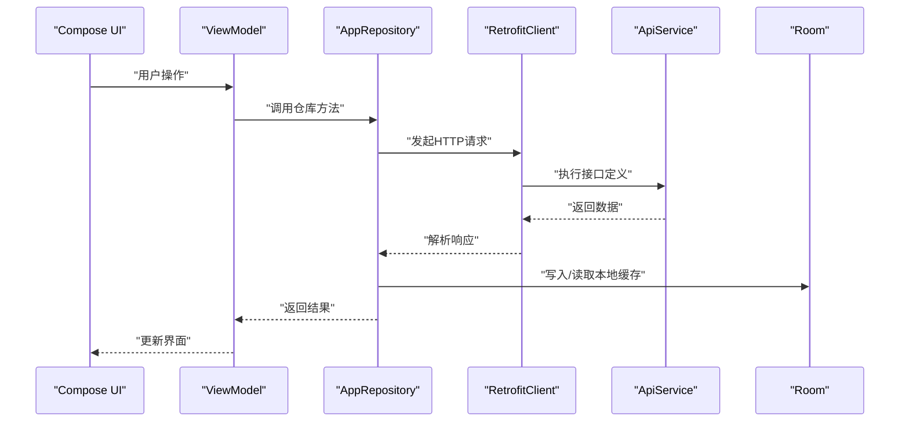
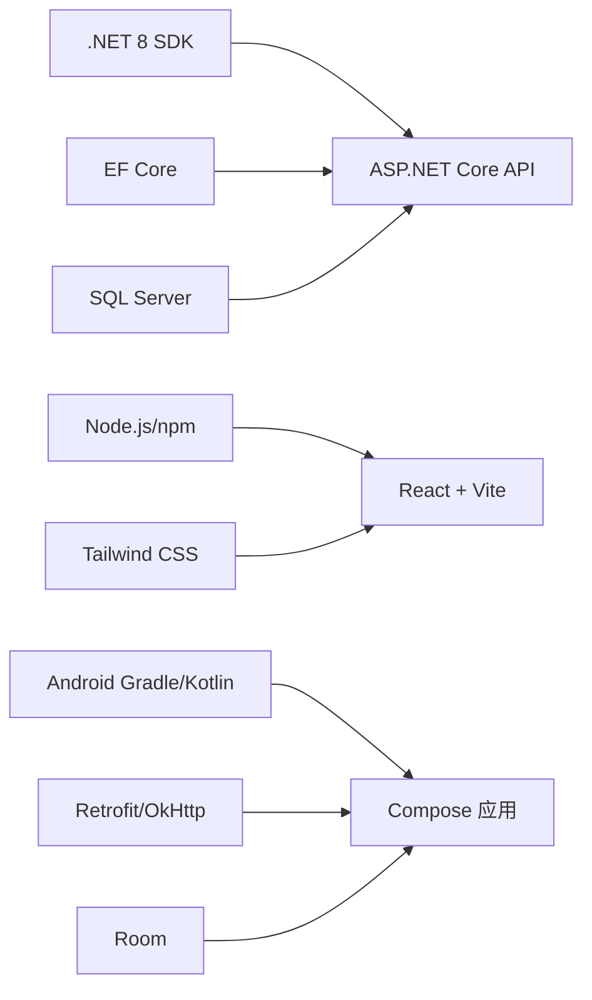

# 技术栈

<cite>
**本文档引用的文件**   
- [Program.cs](file://dip-system/api/Program.cs)
- [DIP.Api.csproj](file://dip-system/api/DIP.Api.csproj)
- [appsettings.json](file://dip-system/api/appsettings.json)
- [AppDbContext.cs](file://dip-system/api/Data/AppDbContext.cs)
- [package.json](file://dip-system/frontend-web/package.json)
- [vite.config.ts](file://dip-system/frontend-web/vite.config.ts)
- [tailwind.config.js](file://dip-system/frontend-web/tailwind.config.js)
- [tsconfig.json](file://dip-system/frontend-web/tsconfig.json)
- [build.gradle.kts](file://mobile-android/build.gradle.kts)
- [app/build.gradle.kts](file://mobile-android/app/build.gradle.kts)
- [gradle.properties](file://mobile-android/gradle.properties)
- [RetrofitClient.kt](file://mobile-android/app/src/main/java/com/dip/material/data/network/RetrofitClient.kt)
- [ApiService.kt](file://mobile-android/app/src/main/java/com/dip/material/data/network/ApiService.kt)
- [AuthInterceptor.kt](file://mobile-android/app/src/main/java/com/dip/material/data/network/AuthInterceptor.kt)
- [TokenHolder.kt](file://mobile-android/app/src/main/java/com/dip/material/data/network/TokenHolder.kt)
- [AppRepository.kt](file://mobile-android/app/src/main/java/com/dip/material/data/repository/AppRepository.kt)
- [Models.kt](file://mobile-android/app/src/main/java/com/dip/material/data/models/Models.kt)
- [MainActivity.kt](file://mobile-android/app/src/main/java/com/dip/material/MainActivity.kt)
- [DIPApplication.kt](file://mobile-android/app/src/main/java/com/dip/material/DIPApplication.kt)
</cite>

## 目录
1. [简介](#简介)
2. [项目结构](#项目结构)
3. [核心组件](#核心组件)
4. [架构总览](#架构总览)
5. [详细组件分析](#详细组件分析)
6. [依赖关系分析](#依赖关系分析)
7. [性能考量](#性能考量)
8. [故障排查指南](#故障排查指南)
9. [结论](#结论)
10. [附录](#附录)

## 简介
本技术栈文档面向DIP物料管理系统，覆盖后端、前端与移动端三大端的技术选型、版本要求、兼容性说明、选型理由与优势，以及开发环境搭建所需软件清单。系统采用：
- 后端：C# .NET 8 + ASP.NET Core Web API + Entity Framework Core + SQL Server
- 前端：React 18 + TypeScript + Vite + Tailwind CSS + Ant Design
- 移动端：Kotlin + Jetpack Compose + Retrofit + Room（本地存储）

该组合兼顾高性能、可维护性与跨平台体验，适合企业级制造场景的物料管理需求。

## 项目结构
仓库包含三个主要子系统：
- 后端API服务：位于 dip-system/api，提供RESTful接口、数据访问与业务逻辑
- 前端Web应用：位于 dip-system/frontend-web，基于React+TS+Vite构建SPA
- 移动端Android应用：位于 mobile-android，使用Kotlin与Jetpack Compose实现原生界面与离线能力

图表来源
- [Program.cs:1-200](file://dip-system/api/Program.cs#L1-L200)
- [AppDbContext.cs:1-200](file://dip-system/api/Data/AppDbContext.cs#L1-L200)
- [package.json:1-200](file://dip-system/frontend-web/package.json#L1-L200)
- [vite.config.ts:1-200](file://dip-system/frontend-web/vite.config.ts#L1-L200)
- [tailwind.config.js:1-200](file://dip-system/frontend-web/tailwind.config.js#L1-L200)
- [MainActivity.kt:1-200](file://mobile-android/app/src/main/java/com/dip/material/MainActivity.kt#L1-L200)
- [RetrofitClient.kt:1-200](file://mobile-android/app/src/main/java/com/dip/material/data/network/RetrofitClient.kt#L1-L200)
- [Models.kt:1-200](file://mobile-android/app/src/main/java/com/dip/material/data/models/Models.kt#L1-L200)
- [AppRepository.kt:1-200](file://mobile-android/app/src/main/java/com/dip/material/data/repository/AppRepository.kt#L1-L200)

章节来源
- [Program.cs:1-200](file://dip-system/api/Program.cs#L1-L200)
- [DIP.Api.csproj:1-200](file://dip-system/api/DIP.Api.csproj#L1-L200)
- [package.json:1-200](file://dip-system/frontend-web/package.json#L1-L200)
- [vite.config.ts:1-200](file://dip-system/frontend-web/vite.config.ts#L1-L200)
- [tailwind.config.js:1-200](file://dip-system/frontend-web/tailwind.config.js#L1-L200)
- [build.gradle.kts:1-200](file://mobile-android/build.gradle.kts#L1-L200)
- [app/build.gradle.kts:1-200](file://mobile-android/app/build.gradle.kts#L1-L200)

## 核心组件
- 后端API服务
  - 入口与中间件注册：Program.cs 中统一配置认证、异常处理、路由、数据库连接等
  - 数据访问：AppDbContext.cs 定义实体映射与数据库上下文
  - 配置：appsettings.json 管理连接字符串、日志级别、JWT密钥等
  - 项目依赖：DIP.Api.csproj 声明 .NET 8、EF Core、SQL Server驱动等包引用
- 前端Web应用
  - 构建与运行：vite.config.ts 配置开发服务器、代理、打包产物
  - 样式体系：tailwind.config.js 启用Tailwind并扩展主题
  - 类型与编译：tsconfig.json 配置TypeScript编译选项
  - 依赖管理：package.json 声明React 18、Ant Design、Axios等库
- 移动端Android应用
  - 网络层：RetrofitClient.kt 初始化Retrofit与OkHttp拦截器
  - API契约：ApiService.kt 定义HTTP接口方法
  - 鉴权：AuthInterceptor.kt 注入Authorization头；TokenHolder.kt 持有Token
  - 数据仓库：AppRepository.kt 聚合网络与本地数据源
  - 模型与持久化：Models.kt 定义数据类与Room实体映射
  - 应用入口：MainActivity.kt、DIPApplication.kt 启动Compose UI与应用初始化

章节来源
- [Program.cs:1-200](file://dip-system/api/Program.cs#L1-L200)
- [AppDbContext.cs:1-200](file://dip-system/api/Data/AppDbContext.cs#L1-L200)
- [appsettings.json:1-200](file://dip-system/api/appsettings.json#L1-L200)
- [DIP.Api.csproj:1-200](file://dip-system/api/DIP.Api.csproj#L1-L200)
- [package.json:1-200](file://dip-system/frontend-web/package.json#L1-L200)
- [vite.config.ts:1-200](file://dip-system/frontend-web/vite.config.ts#L1-L200)
- [tailwind.config.js:1-200](file://dip-system/frontend-web/tailwind.config.js#L1-L200)
- [tsconfig.json:1-200](file://dip-system/frontend-web/tsconfig.json#L1-L200)
- [RetrofitClient.kt:1-200](file://mobile-android/app/src/main/java/com/dip/material/data/network/RetrofitClient.kt#L1-L200)
- [ApiService.kt:1-200](file://mobile-android/app/src/main/java/com/dip/material/data/network/ApiService.kt#L1-L200)
- [AuthInterceptor.kt:1-200](file://mobile-android/app/src/main/java/com/dip/material/data/network/AuthInterceptor.kt#L1-L200)
- [TokenHolder.kt:1-200](file://mobile-android/app/src/main/java/com/dip/material/data/network/TokenHolder.kt#L1-L200)
- [AppRepository.kt:1-200](file://mobile-android/app/src/main/java/com/dip/material/data/repository/AppRepository.kt#L1-L200)
- [Models.kt:1-200](file://mobile-android/app/src/main/java/com/dip/material/data/models/Models.kt#L1-L200)
- [MainActivity.kt:1-200](file://mobile-android/app/src/main/java/com/dip/material/MainActivity.kt#L1-L200)
- [DIPApplication.kt:1-200](file://mobile-android/app/src/main/java/com/dip/material/DIPApplication.kt#L1-L200)

## 架构总览
系统采用前后端分离与多端协同架构：
- 前端通过Vite代理访问后端API，统一鉴权与错误处理
- 移动端通过Retrofit调用同一套API，结合Room进行离线缓存与状态同步
- 后端以ASP.NET Core为核心，EF Core映射到SQL Server，提供标准化JSON接口

图表来源
- [Program.cs:1-200](file://dip-system/api/Program.cs#L1-L200)
- [AppDbContext.cs:1-200](file://dip-system/api/Data/AppDbContext.cs#L1-L200)
- [RetrofitClient.kt:1-200](file://mobile-android/app/src/main/java/com/dip/material/data/network/RetrofitClient.kt#L1-L200)
- [ApiService.kt:1-200](file://mobile-android/app/src/main/java/com/dip/material/data/network/ApiService.kt#L1-L200)
- [AppRepository.kt:1-200](file://mobile-android/app/src/main/java/com/dip/material/data/repository/AppRepository.kt#L1-L200)

## 详细组件分析

### 后端技术栈（C# .NET 8 + ASP.NET Core Web API + EF Core + SQL Server）
- 运行时与框架
  - .NET 8 提供高性能运行时与现代化语言特性
  - ASP.NET Core Web API 作为HTTP服务承载REST接口
- 数据访问
  - Entity Framework Core 用于对象-关系映射与迁移管理
  - SQL Server 作为生产数据库，支持事务、索引与高并发
- 配置与安全
  - appsettings.json 集中管理环境变量与敏感信息
  - JWT鉴权与全局异常过滤器保障安全与一致性

图表来源
- [Program.cs:1-200](file://dip-system/api/Program.cs#L1-L200)
- [AppDbContext.cs:1-200](file://dip-system/api/Data/AppDbContext.cs#L1-L200)

章节来源
- [Program.cs:1-200](file://dip-system/api/Program.cs#L1-L200)
- [DIP.Api.csproj:1-200](file://dip-system/api/DIP.Api.csproj#L1-L200)
- [appsettings.json:1-200](file://dip-system/api/appsettings.json#L1-L200)
- [AppDbContext.cs:1-200](file://dip-system/api/Data/AppDbContext.cs#L1-L200)

### 前端技术栈（React 18 + TypeScript + Vite + Tailwind CSS + Ant Design）
- 构建工具
  - Vite 提供极速开发与热更新，优化打包体积
- 类型与生态
  - TypeScript 提升代码质量与可维护性
  - React 18 带来并发渲染与更好的用户体验
- 样式与组件
  - Tailwind CSS 原子化样式，快速构建一致UI
  - Ant Design 提供企业级组件库，减少重复工作

图表来源
- [vite.config.ts:1-200](file://dip-system/frontend-web/vite.config.ts#L1-L200)
- [package.json:1-200](file://dip-system/frontend-web/package.json#L1-L200)
- [tailwind.config.js:1-200](file://dip-system/frontend-web/tailwind.config.js#L1-L200)
- [tsconfig.json:1-200](file://dip-system/frontend-web/tsconfig.json#L1-L200)

章节来源
- [package.json:1-200](file://dip-system/frontend-web/package.json#L1-L200)
- [vite.config.ts:1-200](file://dip-system/frontend-web/vite.config.ts#L1-L200)
- [tailwind.config.js:1-200](file://dip-system/frontend-web/tailwind.config.js#L1-L200)
- [tsconfig.json:1-200](file://dip-system/frontend-web/tsconfig.json#L1-L200)

### 移动端技术栈（Kotlin + Jetpack Compose + Retrofit + Room）
- 界面与状态
  - Jetpack Compose 声明式UI，简化状态管理与重构
- 网络与鉴权
  - Retrofit 定义清晰API契约，OkHttp拦截器统一注入Token
  - TokenHolder 集中管理访问令牌生命周期
- 本地存储
  - Room 提供SQLite ORM，支持离线缓存与数据同步

图表来源
- [RetrofitClient.kt:1-200](file://mobile-android/app/src/main/java/com/dip/material/data/network/RetrofitClient.kt#L1-L200)
- [ApiService.kt:1-200](file://mobile-android/app/src/main/java/com/dip/material/data/network/ApiService.kt#L1-L200)
- [AuthInterceptor.kt:1-200](file://mobile-android/app/src/main/java/com/dip/material/data/network/AuthInterceptor.kt#L1-L200)
- [TokenHolder.kt:1-200](file://mobile-android/app/src/main/java/com/dip/material/data/network/TokenHolder.kt#L1-L200)
- [AppRepository.kt:1-200](file://mobile-android/app/src/main/java/com/dip/material/data/repository/AppRepository.kt#L1-L200)
- [Models.kt:1-200](file://mobile-android/app/src/main/java/com/dip/material/data/models/Models.kt#L1-L200)

章节来源
- [RetrofitClient.kt:1-200](file://mobile-android/app/src/main/java/com/dip/material/data/network/RetrofitClient.kt#L1-L200)
- [ApiService.kt:1-200](file://mobile-android/app/src/main/java/com/dip/material/data/network/ApiService.kt#L1-L200)
- [AuthInterceptor.kt:1-200](file://mobile-android/app/src/main/java/com/dip/material/data/network/AuthInterceptor.kt#L1-L200)
- [TokenHolder.kt:1-200](file://mobile-android/app/src/main/java/com/dip/material/data/network/TokenHolder.kt#L1-L200)
- [AppRepository.kt:1-200](file://mobile-android/app/src/main/java/com/dip/material/data/repository/AppRepository.kt#L1-L200)
- [Models.kt:1-200](file://mobile-android/app/src/main/java/com/dip/material/data/models/Models.kt#L1-L200)
- [MainActivity.kt:1-200](file://mobile-android/app/src/main/java/com/dip/material/MainActivity.kt#L1-L200)
- [DIPApplication.kt:1-200](file://mobile-android/app/src/main/java/com/dip/material/DIPApplication.kt#L1-L200)

## 依赖关系分析
- 后端依赖
  - .NET 8 SDK 与运行时
  - ASP.NET Core、EF Core、SQL Server驱动
  - 可选：JWT、Swagger、日志框架
- 前端依赖
  - Node.js 与 npm/yarn/pnpm
  - React 18、TypeScript、Vite、Tailwind、Ant Design
- 移动端依赖
  - Android Gradle Plugin 与 Kotlin 插件
  - Retrofit、OkHttp、Room、Compose 相关库

图表来源
- [DIP.Api.csproj:1-200](file://dip-system/api/DIP.Api.csproj#L1-L200)
- [package.json:1-200](file://dip-system/frontend-web/package.json#L1-L200)
- [build.gradle.kts:1-200](file://mobile-android/build.gradle.kts#L1-L200)
- [app/build.gradle.kts:1-200](file://mobile-android/app/build.gradle.kts#L1-L200)

章节来源
- [DIP.Api.csproj:1-200](file://dip-system/api/DIP.Api.csproj#L1-L200)
- [package.json:1-200](file://dip-system/frontend-web/package.json#L1-L200)
- [build.gradle.kts:1-200](file://mobile-android/build.gradle.kts#L1-L200)
- [app/build.gradle.kts:1-200](file://mobile-android/app/build.gradle.kts#L1-L200)

## 性能考量
- 后端
  - 使用异步I/O与最小化阻塞操作
  - 合理设计索引与分页查询，避免N+1问题
  - 启用响应压缩与缓存策略
- 前端
  - Vite按需加载与代码分割，减少首屏体积
  - 图片与静态资源CDN加速
  - 防抖与节流优化高频交互
- 移动端
  - Retrofit连接池与超时控制
  - Room读写分离与批量操作
  - 列表虚拟化与懒加载

[本节为通用指导，不直接分析具体文件]

## 故障排查指南
- 后端
  - 检查appsettings.json中的连接字符串与密钥配置
  - 查看Program.cs中中间件顺序与异常处理
  - 使用EF Core迁移日志定位数据库不一致
- 前端
  - 确认Vite代理配置与后端端口一致
  - 检查TypeScript编译错误与依赖版本冲突
  - 使用浏览器开发者工具调试网络请求
- 移动端
  - 验证RetrofitBase URL与网络权限
  - 检查Token过期与刷新逻辑
  - 查看Room迁移与Schema变更日志

章节来源
- [appsettings.json:1-200](file://dip-system/api/appsettings.json#L1-L200)
- [Program.cs:1-200](file://dip-system/api/Program.cs#L1-L200)
- [vite.config.ts:1-200](file://dip-system/frontend-web/vite.config.ts#L1-L200)
- [RetrofitClient.kt:1-200](file://mobile-android/app/src/main/java/com/dip/material/data/network/RetrofitClient.kt#L1-L200)
- [AuthInterceptor.kt:1-200](file://mobile-android/app/src/main/java/com/dip/material/data/network/AuthInterceptor.kt#L1-L200)

## 结论
本技术栈在性能、可维护性与用户体验方面具备显著优势：
- 后端以.NET 8与EF Core为基础，提供稳定高效的API服务
- 前端采用React 18与Vite，兼顾开发效率与运行性能
- 移动端使用Compose与Retrofit，结合Room实现离线优先体验
整体方案满足企业级制造场景对稳定性、扩展性与跨平台的需求。

[本节为总结性内容，不直接分析具体文件]

## 附录
- 开发环境搭建清单与版本要求
  - 后端
    - .NET 8 SDK（建议最新稳定版）
    - SQL Server（建议2019及以上）
    - IDE：Visual Studio 2022 或 VS Code + C#扩展
  - 前端
    - Node.js 18+（推荐LTS）
    - 包管理器：npm/yarn/pnpm
    - IDE：VS Code + ESLint/Prettier
  - 移动端
    - Android Studio Hedgehog+
    - JDK 17
    - Gradle 8.x（由AGP管理）
- 兼容性说明
  - .NET 8 兼容Windows/Linux/macOS
  - React 18 需现代浏览器（Chrome/Firefox/Safari/Edge）
  - Android Compose 需API 21+，推荐API 30+

[本节为通用指导，不直接分析具体文件]