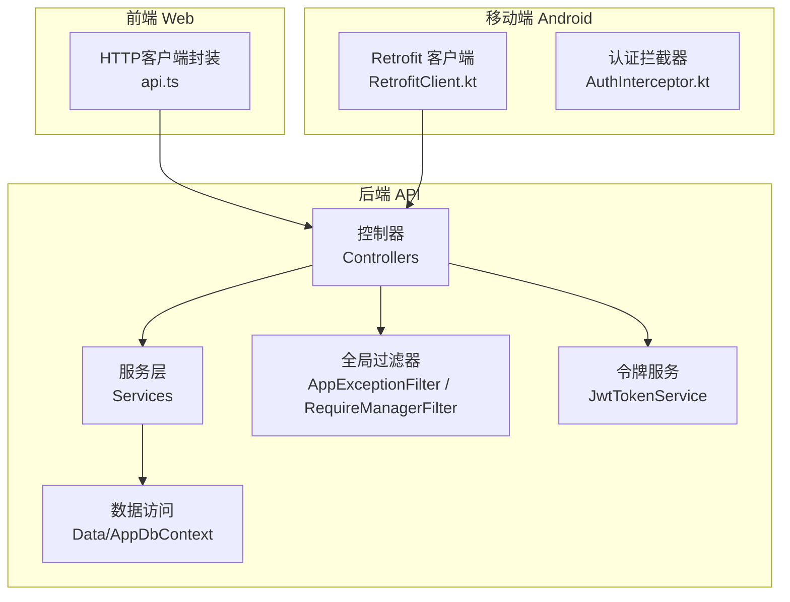
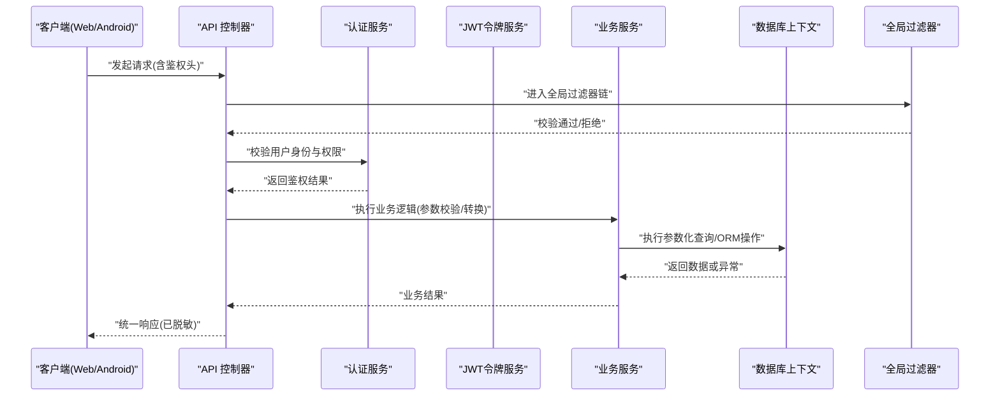
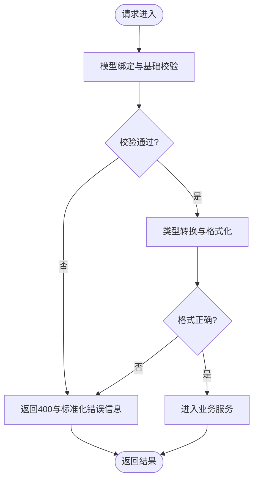
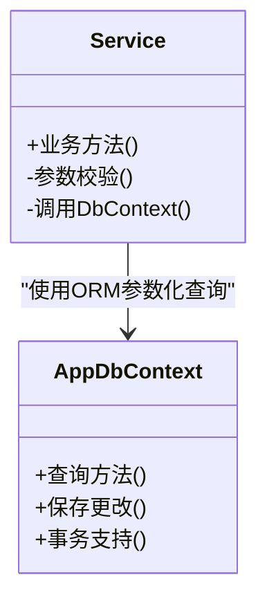
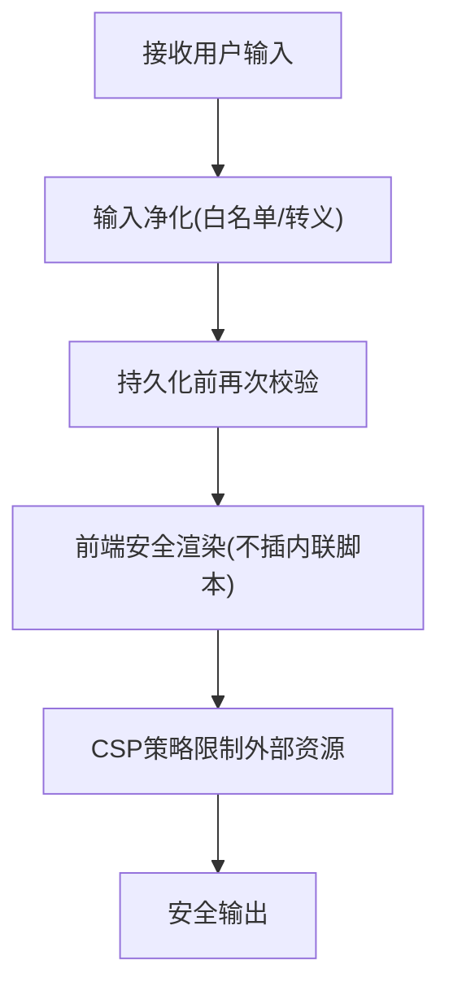
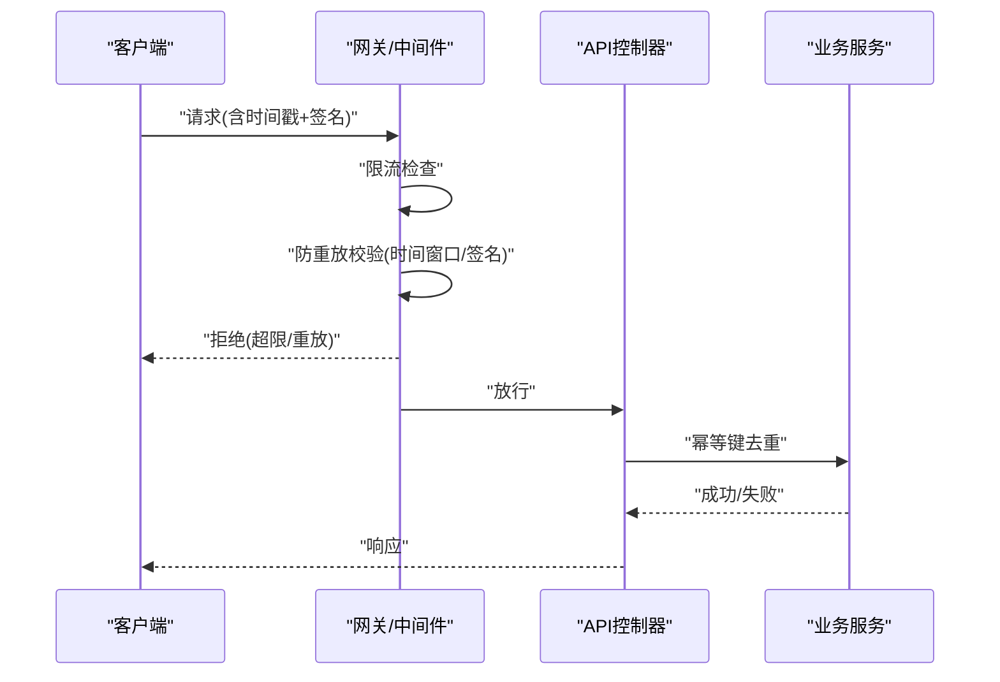
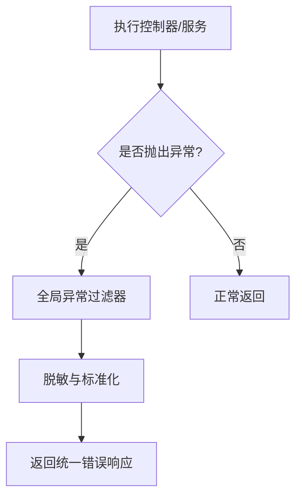
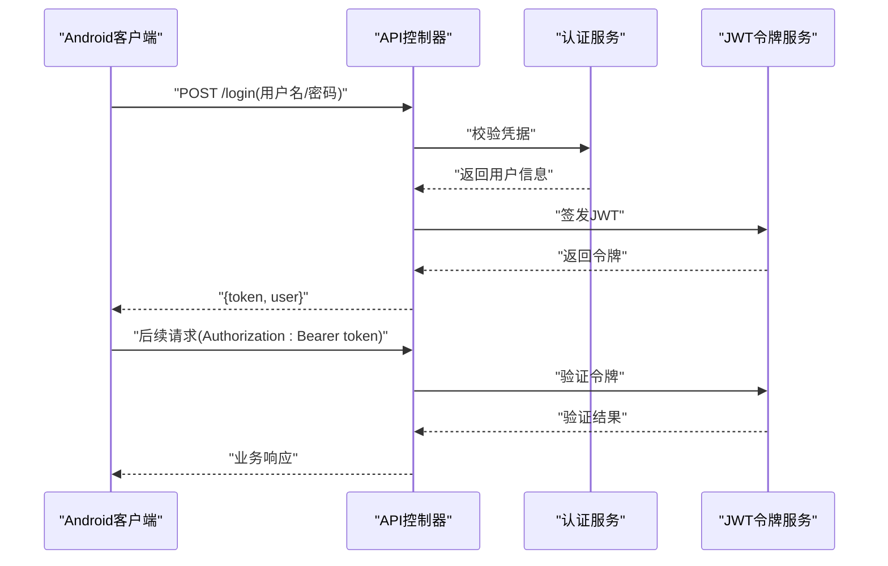
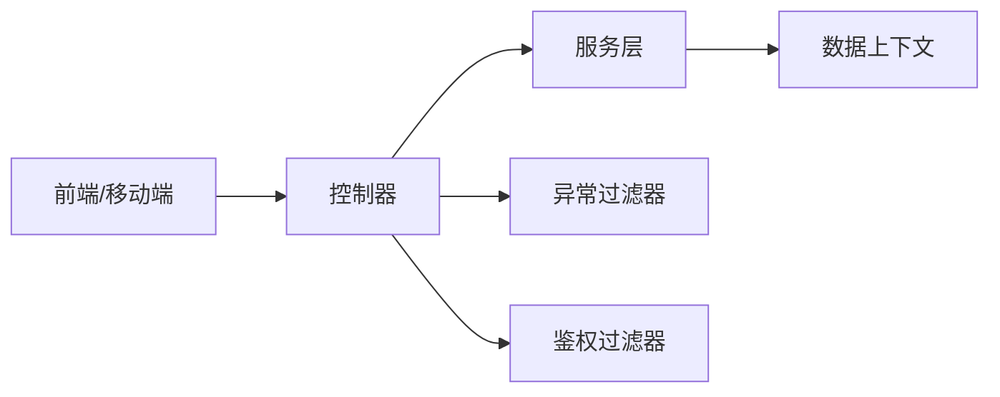

# API安全防护

<cite>
**本文引用的文件**   
- [Program.cs](file://dip-system/api/Program.cs)
- [AppExceptionFilter.cs](file://dip-system/api/Controllers/AppExceptionFilter.cs)
- [RequireManagerFilter.cs](file://dip-system/api/Controllers/RequireManagerFilter.cs)
- [AuthController.cs](file://dip-system/api/Controllers/AuthController.cs)
- [AuthService.cs](file://dip-system/api/Services/AuthService.cs)
- [JwtTokenService.cs](file://dip-system/api/Services/JwtTokenService.cs)
- [AppDbContext.cs](file://dip-system/api/Data/AppDbContext.cs)
- [ApiResponse.cs](file://dip-system/api/Models/ApiResponse.cs)
- [InventoryController.cs](file://dip-system/api/Controllers/InventoryController.cs)
- [MaterialRequestController.cs](file://dip-system/api/Controllers/MaterialRequestController.cs)
- [api.ts](file://dip-system/frontend-web/src/lib/api.ts)
- [RetrofitClient.kt](file://mobile-android/app/src/main/java/com/dip/material/data/network/RetrofitClient.kt)
- [AuthInterceptor.kt](file://mobile-android/app/src/main/java/com/dip/material/data/network/AuthInterceptor.kt)
</cite>

## 目录
1. [简介](#简介)
2. [项目结构](#项目结构)
3. [核心组件](#核心组件)
4. [架构总览](#架构总览)
5. [详细组件分析](#详细组件分析)
6. [依赖关系分析](#依赖关系分析)
7. [性能考虑](#性能考虑)
8. [故障排查指南](#故障排查指南)
9. [结论](#结论)
10. [附录：安全编码规范与常见漏洞防护示例](#附录安全编码规范与常见漏洞防护示例)

## 简介
本文件面向DIP物料管理系统的API安全防护，聚焦以下方面：输入验证机制（参数校验、数据类型转换、格式验证）、SQL注入防护（参数化查询、ORM使用规范、存储过程调用）、XSS防护策略（输出编码、CSP配置、输入净化）、API限流与防重放攻击机制、异常处理与错误信息脱敏，以及安全编码规范与常见漏洞防护示例。文档以代码级事实为依据，结合前后端实现进行说明，并提供可视化图示帮助理解。

## 项目结构
后端采用ASP.NET Core Web API，控制器位于Controllers目录，业务逻辑在Services目录，数据访问通过Entity Framework Core的DbContext完成；前端Web使用TypeScript/React，移动端Android使用Kotlin+Retrofit。安全相关的关键点包括全局异常过滤器、鉴权拦截器、JWT令牌服务、数据库上下文以及网络层拦截器。

图表来源
- [Program.cs:1-200](file://dip-system/api/Program.cs#L1-L200)
- [AppExceptionFilter.cs:1-200](file://dip-system/api/Controllers/AppExceptionFilter.cs#L1-L200)
- [RequireManagerFilter.cs:1-200](file://dip-system/api/Controllers/RequireManagerFilter.cs#L1-L200)
- [AuthController.cs:1-200](file://dip-system/api/Controllers/AuthController.cs#L1-L200)
- [AuthService.cs:1-200](file://dip-system/api/Services/AuthService.cs#L1-L200)
- [JwtTokenService.cs:1-200](file://dip-system/api/Services/JwtTokenService.cs#L1-L200)
- [AppDbContext.cs:1-200](file://dip-system/api/Data/AppDbContext.cs#L1-L200)
- [api.ts:1-200](file://dip-system/frontend-web/src/lib/api.ts#L1-L200)
- [RetrofitClient.kt:1-200](file://mobile-android/app/src/main/java/com/dip/material/data/network/RetrofitClient.kt#L1-L200)
- [AuthInterceptor.kt:1-200](file://mobile-android/app/src/main/java/com/dip/material/data/network/AuthInterceptor.kt#L1-L200)

章节来源
- [Program.cs:1-200](file://dip-system/api/Program.cs#L1-L200)
- [AppExceptionFilter.cs:1-200](file://dip-system/api/Controllers/AppExceptionFilter.cs#L1-L200)
- [RequireManagerFilter.cs:1-200](file://dip-system/api/Controllers/RequireManagerFilter.cs#L1-L200)
- [AuthController.cs:1-200](file://dip-system/api/Controllers/AuthController.cs#L1-L200)
- [AuthService.cs:1-200](file://dip-system/api/Services/AuthService.cs#L1-L200)
- [JwtTokenService.cs:1-200](file://dip-system/api/Services/JwtTokenService.cs#L1-L200)
- [AppDbContext.cs:1-200](file://dip-system/api/Data/AppDbContext.cs#L1-L200)
- [api.ts:1-200](file://dip-system/frontend-web/src/lib/api.ts#L1-L200)
- [RetrofitClient.kt:1-200](file://mobile-android/app/src/main/java/com/dip/material/data/network/RetrofitClient.kt#L1-L200)
- [AuthInterceptor.kt:1-200](file://mobile-android/app/src/main/java/com/dip/material/data/network/AuthInterceptor.kt#L1-L200)

## 核心组件
- 全局异常过滤器：统一捕获未处理异常，返回标准化响应体，避免堆栈和敏感信息泄露。
- 鉴权与授权过滤器：对请求进行身份校验与角色权限检查，限制敏感操作。
- 认证服务与JWT令牌服务：负责登录校验、令牌签发与验证，确保接口访问受控。
- 数据访问上下文：基于EF Core的DbContext，提供参数化查询与实体映射，降低SQL注入风险。
- 统一响应模型：对外暴露一致的JSON结构，便于前端解析与安全展示。
- 前端与移动端网络层：封装HTTP请求，附加认证头、统一错误处理与重试策略。

章节来源
- [AppExceptionFilter.cs:1-200](file://dip-system/api/Controllers/AppExceptionFilter.cs#L1-L200)
- [RequireManagerFilter.cs:1-200](file://dip-system/api/Controllers/RequireManagerFilter.cs#L1-L200)
- [AuthController.cs:1-200](file://dip-system/api/Controllers/AuthController.cs#L1-L200)
- [AuthService.cs:1-200](file://dip-system/api/Services/AuthService.cs#L1-L200)
- [JwtTokenService.cs:1-200](file://dip-system/api/Services/JwtTokenService.cs#L1-L200)
- [AppDbContext.cs:1-200](file://dip-system/api/Data/AppDbContext.cs#L1-L200)
- [ApiResponse.cs:1-200](file://dip-system/api/Models/ApiResponse.cs#L1-L200)
- [api.ts:1-200](file://dip-system/frontend-web/src/lib/api.ts#L1-L200)
- [RetrofitClient.kt:1-200](file://mobile-android/app/src/main/java/com/dip/material/data/network/RetrofitClient.kt#L1-L200)
- [AuthInterceptor.kt:1-200](file://mobile-android/app/src/main/java/com/dip/material/data/network/AuthInterceptor.kt#L1-L200)

## 架构总览
下图展示了从客户端到后端的请求链路，包含认证、授权、输入验证、业务处理、数据访问与异常处理的完整流程。

图表来源
- [Program.cs:1-200](file://dip-system/api/Program.cs#L1-L200)
- [AppExceptionFilter.cs:1-200](file://dip-system/api/Controllers/AppExceptionFilter.cs#L1-L200)
- [RequireManagerFilter.cs:1-200](file://dip-system/api/Controllers/RequireManagerFilter.cs#L1-L200)
- [AuthController.cs:1-200](file://dip-system/api/Controllers/AuthController.cs#L1-L200)
- [AuthService.cs:1-200](file://dip-system/api/Services/AuthService.cs#L1-L200)
- [JwtTokenService.cs:1-200](file://dip-system/api/Services/JwtTokenService.cs#L1-L200)
- [AppDbContext.cs:1-200](file://dip-system/api/Data/AppDbContext.cs#L1-L200)

## 详细组件分析

### 输入验证机制（参数校验、类型转换、格式验证）
- 控制器入参建议采用DTO并启用模型绑定校验，利用特性标注必填、长度、范围等约束，确保非法输入在服务层之前被拒绝。
- 对于日期、数值等类型，应在绑定阶段进行严格转换，失败时返回明确的验证错误。
- 对字符串字段进行长度与字符集限制，防止超长输入与特殊字符注入。
- 针对复杂对象与集合，需逐项校验，避免嵌套脏数据穿透。

图表来源
- [InventoryController.cs:1-200](file://dip-system/api/Controllers/InventoryController.cs#L1-L200)
- [MaterialRequestController.cs:1-200](file://dip-system/api/Controllers/MaterialRequestController.cs#L1-L200)
- [ApiResponse.cs:1-200](file://dip-system/api/Models/ApiResponse.cs#L1-L200)

章节来源
- [InventoryController.cs:1-200](file://dip-system/api/Controllers/InventoryController.cs#L1-L200)
- [MaterialRequestController.cs:1-200](file://dip-system/api/Controllers/MaterialRequestController.cs#L1-L200)
- [ApiResponse.cs:1-200](file://dip-system/api/Models/ApiResponse.cs#L1-L200)

### SQL注入防护措施（参数化查询、ORM使用规范、存储过程调用）
- 优先使用EF Core的LINQ与实体映射，自动生成参数化SQL，避免字符串拼接。
- 如需原生SQL，必须使用参数化命令，禁止直接拼接用户输入。
- 存储过程调用应传入强类型参数，并在服务端进行二次校验。
- 对查询条件进行白名单过滤，限制可排序、分页字段。

图表来源
- [AppDbContext.cs:1-200](file://dip-system/api/Data/AppDbContext.cs#L1-L200)

章节来源
- [AppDbContext.cs:1-200](file://dip-system/api/Data/AppDbContext.cs#L1-L200)

### XSS防护策略（输出编码、CSP配置、输入净化）
- 前端渲染时应避免将未经转义的用户内容直接插入DOM，使用框架提供的安全渲染方式。
- 后端不应直接返回HTML片段给前端，若必须返回富文本，应在服务端进行严格的白名单净化。
- 建议在网关或反向代理中配置Content-Security-Policy，限制脚本加载与执行来源。
- 对上传内容与富文本输入进行净化，禁用危险标签与事件处理器。

[此图为概念性流程图，不直接映射具体源码文件]

### API限流与防重放攻击机制
- 限流：在网关或中间件层按IP、用户或接口维度设置速率限制，防止暴力破解与资源耗尽。
- 防重放：为关键写接口引入时间戳与随机数签名，服务端校验时间窗口与签名有效性，拒绝重复请求。
- 幂等性：对提交类接口设计幂等键（如订单号），服务端去重处理，避免重复扣减库存等副作用。

[此图为概念性序列图，用于说明限流与防重放的通用流程]

### 异常处理与错误信息脱敏
- 全局异常过滤器统一捕获异常，转换为标准响应体，隐藏内部细节与堆栈。
- 区分系统异常与业务异常，业务异常返回可读但安全的错误码与消息。
- 日志记录仅包含必要上下文，避免记录敏感数据（密码、令牌、身份证号等）。

图表来源
- [AppExceptionFilter.cs:1-200](file://dip-system/api/Controllers/AppExceptionFilter.cs#L1-L200)
- [ApiResponse.cs:1-200](file://dip-system/api/Models/ApiResponse.cs#L1-L200)

章节来源
- [AppExceptionFilter.cs:1-200](file://dip-system/api/Controllers/AppExceptionFilter.cs#L1-L200)
- [ApiResponse.cs:1-200](file://dip-system/api/Models/ApiResponse.cs#L1-L200)

### 认证与授权（JWT与拦截器）
- 登录成功后签发JWT，客户端在后续请求中携带Authorization头。
- 后端通过JWT服务验证令牌有效性与过期时间，并结合角色/权限控制敏感接口。
- 移动端通过拦截器自动附加令牌，确保所有请求具备鉴权上下文。

图表来源
- [AuthController.cs:1-200](file://dip-system/api/Controllers/AuthController.cs#L1-L200)
- [AuthService.cs:1-200](file://dip-system/api/Services/AuthService.cs#L1-L200)
- [JwtTokenService.cs:1-200](file://dip-system/api/Services/JwtTokenService.cs#L1-L200)
- [AuthInterceptor.kt:1-200](file://mobile-android/app/src/main/java/com/dip/material/data/network/AuthInterceptor.kt#L1-L200)

章节来源
- [AuthController.cs:1-200](file://dip-system/api/Controllers/AuthController.cs#L1-L200)
- [AuthService.cs:1-200](file://dip-system/api/Services/AuthService.cs#L1-L200)
- [JwtTokenService.cs:1-200](file://dip-system/api/Services/JwtTokenService.cs#L1-L200)
- [AuthInterceptor.kt:1-200](file://mobile-android/app/src/main/java/com/dip/material/data/network/AuthInterceptor.kt#L1-L200)

## 依赖关系分析
- 控制器依赖服务层，服务层依赖数据访问上下文，形成清晰的单向依赖。
- 全局过滤器与认证服务贯穿请求生命周期，确保安全策略前置。
- 前端与移动端网络层依赖统一的API契约，保证错误处理与鉴权一致性。

图表来源
- [Program.cs:1-200](file://dip-system/api/Program.cs#L1-L200)
- [AppExceptionFilter.cs:1-200](file://dip-system/api/Controllers/AppExceptionFilter.cs#L1-L200)
- [RequireManagerFilter.cs:1-200](file://dip-system/api/Controllers/RequireManagerFilter.cs#L1-L200)

章节来源
- [Program.cs:1-200](file://dip-system/api/Program.cs#L1-L200)
- [AppExceptionFilter.cs:1-200](file://dip-system/api/Controllers/AppExceptionFilter.cs#L1-L200)
- [RequireManagerFilter.cs:1-200](file://dip-system/api/Controllers/RequireManagerFilter.cs#L1-L200)

## 性能考虑
- 输入验证与服务层校验相结合，减少无效请求进入业务逻辑。
- 数据库查询尽量使用索引与分页，避免全表扫描与大结果集传输。
- 合理设置超时与重试策略，避免雪崩效应。
- 对高频接口启用缓存（如字典、配置），降低数据库压力。

[本节为通用指导，不直接分析具体文件]

## 故障排查指南
- 统一错误响应：通过标准化响应体快速定位问题类型与错误码。
- 日志脱敏：检查日志是否包含敏感信息，必要时调整记录策略。
- 鉴权失败：确认令牌有效期、签名算法与客户端传递的头是否正确。
- 数据库异常：核对参数化查询与事务边界，避免死锁与连接泄漏。

章节来源
- [ApiResponse.cs:1-200](file://dip-system/api/Models/ApiResponse.cs#L1-L200)
- [AppExceptionFilter.cs:1-200](file://dip-system/api/Controllers/AppExceptionFilter.cs#L1-L200)

## 结论
通过对输入验证、SQL注入防护、XSS防护、限流与防重放、异常处理与鉴权的系统化设计与实现，DIP物料管理系统在API层面具备较为完善的安全基线。建议持续进行安全测试与代码审查，及时修复潜在风险，保持安全策略与业务演进同步。

[本节为总结性内容，不直接分析具体文件]

## 附录：安全编码规范与常见漏洞防护示例
- 输入验证规范
  - 所有外部输入必须经过校验与类型转换，拒绝非法值。
  - 对字符串进行长度与字符集限制，避免缓冲区溢出与注入。
- SQL注入防护
  - 优先使用ORM与参数化查询，禁止字符串拼接SQL。
  - 存储过程调用使用强类型参数，并进行服务端二次校验。
- XSS防护
  - 前端避免内联脚本与不安全渲染，使用框架安全API。
  - 后端对富文本进行白名单净化，输出前进行转义。
- 限流与防重放
  - 网关层实施速率限制与请求签名校验。
  - 写接口引入幂等键，服务端去重处理。
- 异常与错误脱敏
  - 全局异常过滤器统一处理，返回标准化错误码与消息。
  - 日志不包含敏感数据，调试与生产环境分离。
- 鉴权与授权
  - JWT令牌短时效、强签名，服务端定期校验。
  - 敏感接口进行角色与权限校验，最小权限原则。

[本节为通用规范与示例，不直接分析具体文件]