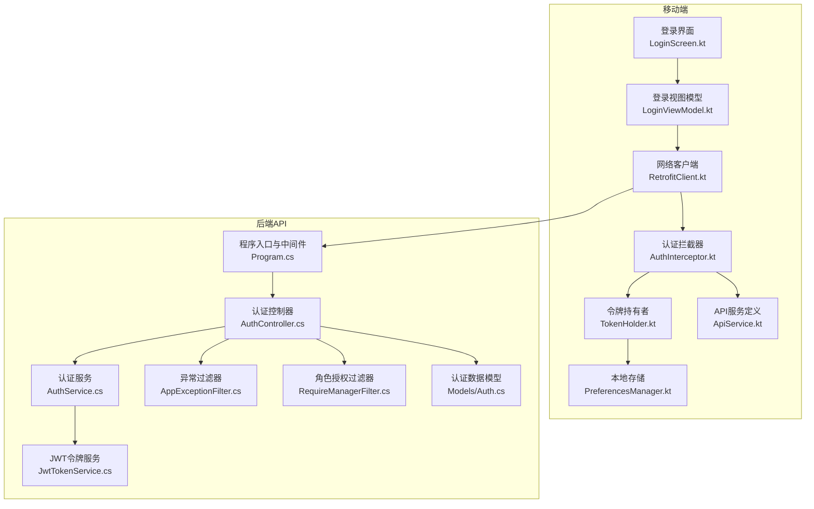
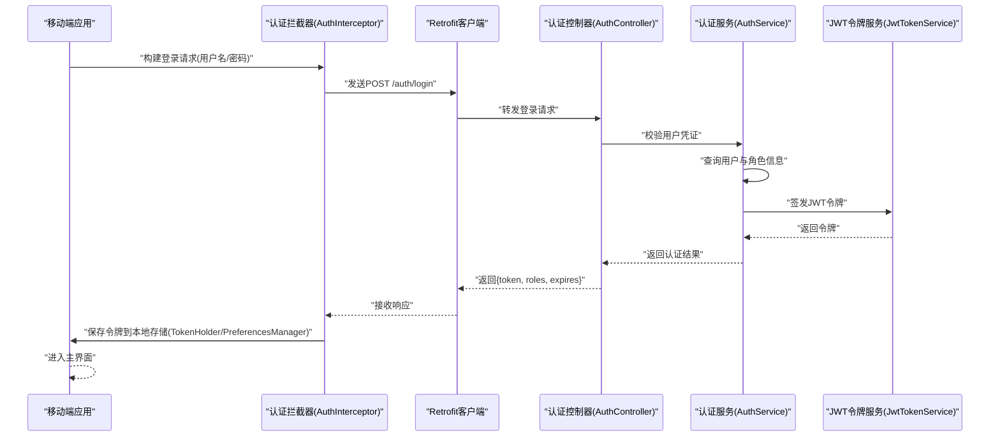
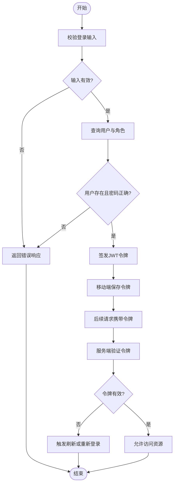
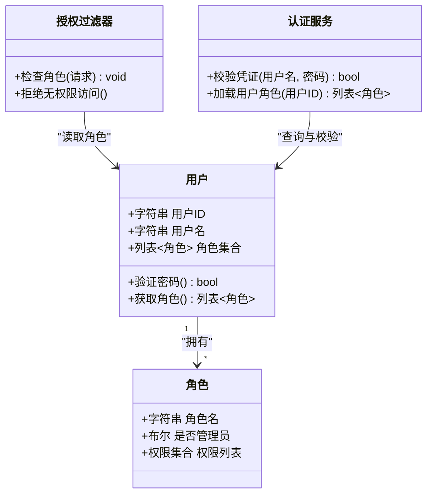
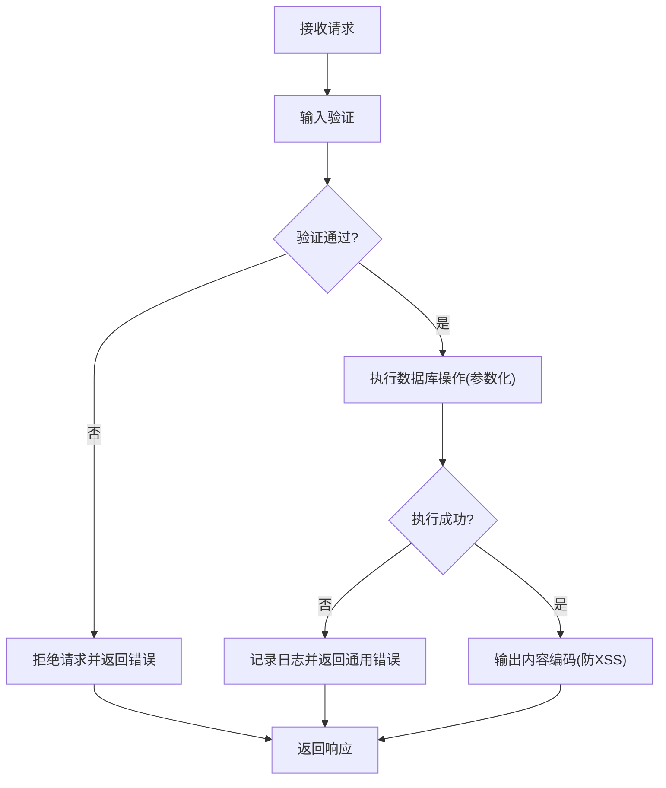
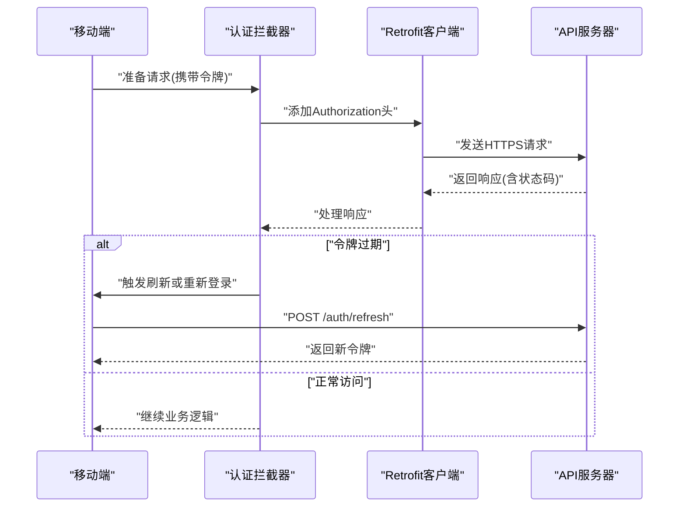
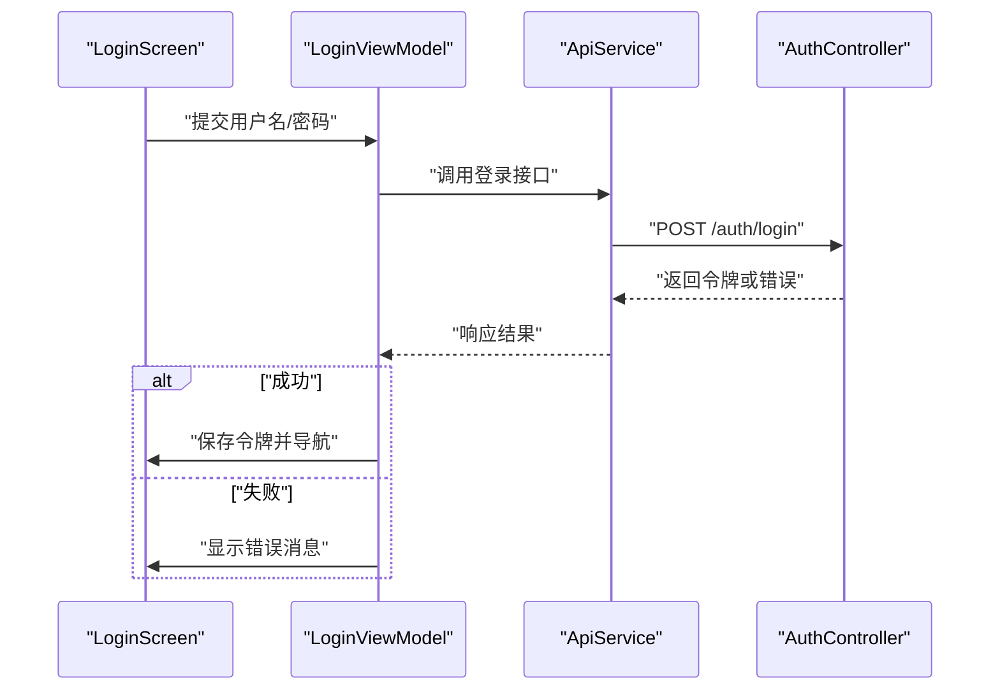
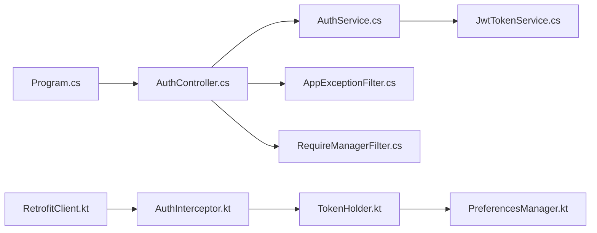

# 安全架构

<cite>
**本文引用的文件**   
- [Program.cs](file://dip-system/api/Program.cs)
- [AuthController.cs](file://dip-system/api/Controllers/AuthController.cs)
- [JwtTokenService.cs](file://dip-system/api/Services/JwtTokenService.cs)
- [AuthService.cs](file://dip-system/api/Services/AuthService.cs)
- [AppExceptionFilter.cs](file://dip-system/api/Controllers/AppExceptionFilter.cs)
- [RequireManagerFilter.cs](file://dip-system/api/Controllers/RequireManagerFilter.cs)
- [Models/Auth.cs](file://dip-system/api/Models/Auth.cs)
- [RetrofitClient.kt](file://mobile-android/app/src/main/java/com/dip/material/data/network/RetrofitClient.kt)
- [AuthInterceptor.kt](file://mobile-android/app/src/main/java/com/dip/material/data/network/AuthInterceptor.kt)
- [TokenHolder.kt](file://mobile-android/app/src/main/java/com/dip/material/data/network/TokenHolder.kt)
- [ApiService.kt](file://mobile-android/app/src/main/java/com/dip/material/data/network/ApiService.kt)
- [PreferencesManager.kt](file://mobile-android/app/src/main/java/com/dip/material/utils/PreferencesManager.kt)
- [LoginScreen.kt](file://mobile-android/app/src/main/java/com/dip/material/ui/login/LoginScreen.kt)
- [LoginViewModel.kt](file://mobile-android/app/src/main/java/com/dip/material/ui/login/LoginViewModel.kt)
</cite>

## 目录
1. [简介](#简介)
2. [项目结构](#项目结构)
3. [核心组件](#核心组件)
4. [架构总览](#架构总览)
5. [详细组件分析](#详细组件分析)
6. [依赖关系分析](#依赖关系分析)
7. [性能考虑](#性能考虑)
8. [故障排查指南](#故障排查指南)
9. [结论](#结论)
10. [附录](#附录)（如有需要）

## 简介
本安全架构文档面向DIP物料管理系统，聚焦以下目标：
- JWT令牌认证机制的实现原理与生命周期管理
- 基于角色的权限控制（RBAC）模型与授权策略
- API接口安全防护：输入验证、SQL注入防护、XSS防护等
- 移动端安全通信：HTTPS、证书绑定、本地存储加密
- 会话管理与令牌刷新机制
- 提供安全架构图与认证流程图
- 安全最佳实践与常见漏洞防护建议

## 项目结构
后端采用ASP.NET Core Web API，前端Web与移动端Android分别通过HTTP API与后端交互。安全相关的关键位置包括：
- 后端启动与中间件注册（Program.cs）
- 认证控制器与服务（AuthController.cs、AuthService.cs、JwtTokenService.cs）
- 异常处理与授权过滤器（AppExceptionFilter.cs、RequireManagerFilter.cs）
- 数据模型（Models/Auth.cs）
- 移动端网络层与安全拦截器（RetrofitClient.kt、AuthInterceptor.kt、TokenHolder.kt、ApiService.kt）
- 移动端登录界面与视图模型（LoginScreen.kt、LoginViewModel.kt）
- 移动端本地存储（PreferencesManager.kt）

**图表来源** 
- [Program.cs](file://dip-system/api/Program.cs)
- [AuthController.cs](file://dip-system/api/Controllers/AuthController.cs)
- [JwtTokenService.cs](file://dip-system/api/Services/JwtTokenService.cs)
- [AuthService.cs](file://dip-system/api/Services/AuthService.cs)
- [AppExceptionFilter.cs](file://dip-system/api/Controllers/AppExceptionFilter.cs)
- [RequireManagerFilter.cs](file://dip-system/api/Controllers/RequireManagerFilter.cs)
- [Models/Auth.cs](file://dip-system/api/Models/Auth.cs)
- [RetrofitClient.kt](file://mobile-android/app/src/main/java/com/dip/material/data/network/RetrofitClient.kt)
- [AuthInterceptor.kt](file://mobile-android/app/src/main/java/com/dip/material/data/network/AuthInterceptor.kt)
- [TokenHolder.kt](file://mobile-android/app/src/main/java/com/dip/material/data/network/TokenHolder.kt)
- [ApiService.kt](file://mobile-android/app/src/main/java/com/dip/material/data/network/ApiService.kt)
- [PreferencesManager.kt](file://mobile-android/app/src/main/java/com/dip/material/utils/PreferencesManager.kt)
- [LoginScreen.kt](file://mobile-android/app/src/main/java/com/dip/material/ui/login/LoginScreen.kt)
- [LoginViewModel.kt](file://mobile-android/app/src/main/java/com/dip/material/ui/login/LoginViewModel.kt)

**章节来源**
- [Program.cs](file://dip-system/api/Program.cs)
- [AuthController.cs](file://dip-system/api/Controllers/AuthController.cs)
- [JwtTokenService.cs](file://dip-system/api/Services/JwtTokenService.cs)
- [AuthService.cs](file://dip-system/api/Services/AuthService.cs)
- [AppExceptionFilter.cs](file://dip-system/api/Controllers/AppExceptionFilter.cs)
- [RequireManagerFilter.cs](file://dip-system/api/Controllers/RequireManagerFilter.cs)
- [Models/Auth.cs](file://dip-system/api/Models/Auth.cs)
- [RetrofitClient.kt](file://mobile-android/app/src/main/java/com/dip/material/data/network/RetrofitClient.kt)
- [AuthInterceptor.kt](file://mobile-android/app/src/main/java/com/dip/material/data/network/AuthInterceptor.kt)
- [TokenHolder.kt](file://mobile-android/app/src/main/java/com/dip/material/data/network/TokenHolder.kt)
- [ApiService.kt](file://mobile-android/app/src/main/java/com/dip/material/data/network/ApiService.kt)
- [PreferencesManager.kt](file://mobile-android/app/src/main/java/com/dip/material/utils/PreferencesManager.kt)
- [LoginScreen.kt](file://mobile-android/app/src/main/java/com/dip/material/ui/login/LoginScreen.kt)
- [LoginViewModel.kt](file://mobile-android/app/src/main/java/com/dip/material/ui/login/LoginViewModel.kt)

## 核心组件
- 认证控制器（AuthController）：负责登录请求校验、调用认证服务生成并返回JWT令牌。
- 认证服务（AuthService）：实现用户凭证校验、角色信息获取、业务侧授权逻辑。
- JWT令牌服务（JwtTokenService）：负责令牌的签发、解析、过期检查与刷新支持。
- 异常过滤器（AppExceptionFilter）：统一捕获并规范化异常响应，避免敏感信息泄露。
- 角色授权过滤器（RequireManagerFilter）：在控制器方法或全局层面实施RBAC访问控制。
- 移动端网络层（RetrofitClient、AuthInterceptor、TokenHolder、ApiService）：负责HTTPS连接、请求头注入、令牌持久化与自动刷新。
- 登录界面与视图模型（LoginScreen、LoginViewModel）：收集用户输入、发起认证请求、处理成功/失败状态。
- 本地存储（PreferencesManager）：安全保存令牌与用户上下文。

**章节来源**
- [AuthController.cs](file://dip-system/api/Controllers/AuthController.cs)
- [AuthService.cs](file://dip-system/api/Services/AuthService.cs)
- [JwtTokenService.cs](file://dip-system/api/Services/JwtTokenService.cs)
- [AppExceptionFilter.cs](file://dip-system/api/Controllers/AppExceptionFilter.cs)
- [RequireManagerFilter.cs](file://dip-system/api/Controllers/RequireManagerFilter.cs)
- [RetrofitClient.kt](file://mobile-android/app/src/main/java/com/dip/material/data/network/RetrofitClient.kt)
- [AuthInterceptor.kt](file://mobile-android/app/src/main/java/com/dip/material/data/network/AuthInterceptor.kt)
- [TokenHolder.kt](file://mobile-android/app/src/main/java/com/dip/material/data/network/TokenHolder.kt)
- [ApiService.kt](file://mobile-android/app/src/main/java/com/dip/material/data/network/ApiService.kt)
- [LoginScreen.kt](file://mobile-android/app/src/main/java/com/dip/material/ui/login/LoginScreen.kt)
- [LoginViewModel.kt](file://mobile-android/app/src/main/java/com/dip/material/ui/login/LoginViewModel.kt)
- [PreferencesManager.kt](file://mobile-android/app/src/main/java/com/dip/material/utils/PreferencesManager.kt)

## 架构总览
系统采用前后端分离架构，移动端通过HTTPS与后端API通信。认证流程由登录控制器触发，服务端签发JWT令牌，移动端在后续请求中携带令牌进行鉴权。授权通过角色过滤器对受保护资源进行访问控制。

**图表来源** 
- [AuthController.cs](file://dip-system/api/Controllers/AuthController.cs)
- [AuthService.cs](file://dip-system/api/Services/AuthService.cs)
- [JwtTokenService.cs](file://dip-system/api/Services/JwtTokenService.cs)
- [AuthInterceptor.kt](file://mobile-android/app/src/main/java/com/dip/material/data/network/AuthInterceptor.kt)
- [RetrofitClient.kt](file://mobile-android/app/src/main/java/com/dip/material/data/network/RetrofitClient.kt)
- [TokenHolder.kt](file://mobile-android/app/src/main/java/com/dip/material/data/network/TokenHolder.kt)
- [PreferencesManager.kt](file://mobile-android/app/src/main/java/com/dip/material/utils/PreferencesManager.kt)

## 详细组件分析

### JWT令牌认证与生命周期管理
- 签发流程：登录成功后，服务端根据用户身份与角色生成JWT，包含必要声明（如用户ID、角色、过期时间）。
- 传输与存储：移动端在登录成功后将令牌保存到本地存储，并在后续请求头中附加Authorization字段。
- 验证流程：后端中间件或过滤器解析令牌，校验签名与有效期；若有效则建立当前用户上下文。
- 刷新机制：当令牌即将过期或已过期时，移动端可尝试使用刷新令牌或重新登录以获取新令牌。

**图表来源** 
- [AuthController.cs](file://dip-system/api/Controllers/AuthController.cs)
- [AuthService.cs](file://dip-system/api/Services/AuthService.cs)
- [JwtTokenService.cs](file://dip-system/api/Services/JwtTokenService.cs)
- [AuthInterceptor.kt](file://mobile-android/app/src/main/java/com/dip/material/data/network/AuthInterceptor.kt)
- [TokenHolder.kt](file://mobile-android/app/src/main/java/com/dip/material/data/network/TokenHolder.kt)
- [PreferencesManager.kt](file://mobile-android/app/src/main/java/com/dip/material/utils/PreferencesManager.kt)

**章节来源**
- [AuthController.cs](file://dip-system/api/Controllers/AuthController.cs)
- [AuthService.cs](file://dip-system/api/Services/AuthService.cs)
- [JwtTokenService.cs](file://dip-system/api/Services/JwtTokenService.cs)
- [AuthInterceptor.kt](file://mobile-android/app/src/main/java/com/dip/material/data/network/AuthInterceptor.kt)
- [TokenHolder.kt](file://mobile-android/app/src/main/java/com/dip/material/data/network/TokenHolder.kt)
- [PreferencesManager.kt](file://mobile-android/app/src/main/java/com/dip/material/utils/PreferencesManager.kt)

### 基于角色的权限控制（RBAC）与授权策略
- 角色模型：用户具备一个或多个角色，服务端在令牌中声明角色信息。
- 授权策略：通过RequireManagerFilter等过滤器对控制器方法进行角色校验，仅允许具备特定角色的用户访问。
- 细粒度控制：可在控制器方法上标注所需角色，或在服务层进行业务级权限判断。

**图表来源** 
- [Models/Auth.cs](file://dip-system/api/Models/Auth.cs)
- [RequireManagerFilter.cs](file://dip-system/api/Controllers/RequireManagerFilter.cs)
- [AuthService.cs](file://dip-system/api/Services/AuthService.cs)

**章节来源**
- [Models/Auth.cs](file://dip-system/api/Models/Auth.cs)
- [RequireManagerFilter.cs](file://dip-system/api/Controllers/RequireManagerFilter.cs)
- [AuthService.cs](file://dip-system/api/Services/AuthService.cs)

### API接口安全防护
- 输入验证：控制器或服务层对用户输入进行严格校验，拒绝非法格式与越界值。
- SQL注入防护：使用参数化查询或ORM框架，避免拼接SQL语句。
- XSS防护：对输出内容进行HTML编码，限制富文本渲染范围。
- 异常处理：通过AppExceptionFilter统一捕获异常，返回标准化错误响应，不暴露堆栈或敏感信息。

**图表来源** 
- [AppExceptionFilter.cs](file://dip-system/api/Controllers/AppExceptionFilter.cs)
- [AuthController.cs](file://dip-system/api/Controllers/AuthController.cs)

**章节来源**
- [AppExceptionFilter.cs](file://dip-system/api/Controllers/AppExceptionFilter.cs)
- [AuthController.cs](file://dip-system/api/Controllers/AuthController.cs)

### 移动端安全通信与会话管理
- HTTPS：所有API请求强制使用HTTPS，确保传输加密。
- 证书绑定：建议在客户端配置证书固定（Certificate Pinning），防止中间人攻击。
- 本地存储加密：令牌与敏感数据应加密存储于SharedPreferences或更安全的安全存储区。
- 会话管理：登录后维护令牌有效期，过期前主动刷新或引导重新登录。

**图表来源** 
- [AuthInterceptor.kt](file://mobile-android/app/src/main/java/com/dip/material/data/network/AuthInterceptor.kt)
- [RetrofitClient.kt](file://mobile-android/app/src/main/java/com/dip/material/data/network/RetrofitClient.kt)
- [TokenHolder.kt](file://mobile-android/app/src/main/java/com/dip/material/data/network/TokenHolder.kt)
- [PreferencesManager.kt](file://mobile-android/app/src/main/java/com/dip/material/utils/PreferencesManager.kt)

**章节来源**
- [AuthInterceptor.kt](file://mobile-android/app/src/main/java/com/dip/material/data/network/AuthInterceptor.kt)
- [RetrofitClient.kt](file://mobile-android/app/src/main/java/com/dip/material/data/network/RetrofitClient.kt)
- [TokenHolder.kt](file://mobile-android/app/src/main/java/com/dip/material/data/network/TokenHolder.kt)
- [PreferencesManager.kt](file://mobile-android/app/src/main/java/com/dip/material/utils/PreferencesManager.kt)

### 登录流程与视图模型
- 登录界面收集用户输入，视图模型发起认证请求并处理响应。
- 成功时保存令牌并跳转主界面；失败时显示错误提示。

**图表来源** 
- [LoginScreen.kt](file://mobile-android/app/src/main/java/com/dip/material/ui/login/LoginScreen.kt)
- [LoginViewModel.kt](file://mobile-android/app/src/main/java/com/dip/material/ui/login/LoginViewModel.kt)
- [ApiService.kt](file://mobile-android/app/src/main/java/com/dip/material/data/network/ApiService.kt)
- [AuthController.cs](file://dip-system/api/Controllers/AuthController.cs)

**章节来源**
- [LoginScreen.kt](file://mobile-android/app/src/main/java/com/dip/material/ui/login/LoginScreen.kt)
- [LoginViewModel.kt](file://mobile-android/app/src/main/java/com/dip/material/ui/login/LoginViewModel.kt)
- [ApiService.kt](file://mobile-android/app/src/main/java/com/dip/material/data/network/ApiService.kt)
- [AuthController.cs](file://dip-system/api/Controllers/AuthController.cs)

## 依赖关系分析
- 后端中间件与控制器依赖认证服务与JWT服务。
- 移动端网络层依赖拦截器与令牌持有者，用于统一注入认证头与处理令牌状态。
- 授权过滤器依赖用户角色信息，通常从令牌或会话中解析。

**图表来源** 
- [Program.cs](file://dip-system/api/Program.cs)
- [AuthController.cs](file://dip-system/api/Controllers/AuthController.cs)
- [AuthService.cs](file://dip-system/api/Services/AuthService.cs)
- [JwtTokenService.cs](file://dip-system/api/Services/JwtTokenService.cs)
- [AppExceptionFilter.cs](file://dip-system/api/Controllers/AppExceptionFilter.cs)
- [RequireManagerFilter.cs](file://dip-system/api/Controllers/RequireManagerFilter.cs)
- [RetrofitClient.kt](file://mobile-android/app/src/main/java/com/dip/material/data/network/RetrofitClient.kt)
- [AuthInterceptor.kt](file://mobile-android/app/src/main/java/com/dip/material/data/network/AuthInterceptor.kt)
- [TokenHolder.kt](file://mobile-android/app/src/main/java/com/dip/material/data/network/TokenHolder.kt)
- [PreferencesManager.kt](file://mobile-android/app/src/main/java/com/dip/material/utils/PreferencesManager.kt)

**章节来源**
- [Program.cs](file://dip-system/api/Program.cs)
- [AuthController.cs](file://dip-system/api/Controllers/AuthController.cs)
- [AuthService.cs](file://dip-system/api/Services/AuthService.cs)
- [JwtTokenService.cs](file://dip-system/api/Services/JwtTokenService.cs)
- [AppExceptionFilter.cs](file://dip-system/api/Controllers/AppExceptionFilter.cs)
- [RequireManagerFilter.cs](file://dip-system/api/Controllers/RequireManagerFilter.cs)
- [RetrofitClient.kt](file://mobile-android/app/src/main/java/com/dip/material/data/network/RetrofitClient.kt)
- [AuthInterceptor.kt](file://mobile-android/app/src/main/java/com/dip/material/data/network/AuthInterceptor.kt)
- [TokenHolder.kt](file://mobile-android/app/src/main/java/com/dip/material/data/network/TokenHolder.kt)
- [PreferencesManager.kt](file://mobile-android/app/src/main/java/com/dip/material/utils/PreferencesManager.kt)

## 性能考虑
- 令牌解析与验证应在中间件或过滤器中缓存，避免重复计算。
- 数据库查询应使用索引与分页，减少认证与授权时的延迟。
- 移动端在网络请求失败时应具备重试与退避策略，避免频繁刷新导致雪崩。
- 合理使用缓存（如用户角色信息）以降低重复查询开销。

[本节为通用指导，无需具体文件引用]

## 故障排查指南
- 登录失败：检查输入验证、用户凭证、角色信息是否正确；查看异常过滤器的错误响应。
- 令牌无效：确认令牌是否过期、签名是否一致；检查移动端是否正确附加Authorization头。
- 权限不足：核对用户角色与控制器方法所需的角色是否匹配；检查授权过滤器的实现。
- 网络问题：确认HTTPS配置、证书绑定与代理设置；查看拦截器的错误处理逻辑。

**章节来源**
- [AppExceptionFilter.cs](file://dip-system/api/Controllers/AppExceptionFilter.cs)
- [AuthInterceptor.kt](file://mobile-android/app/src/main/java/com/dip/material/data/network/AuthInterceptor.kt)
- [RequireManagerFilter.cs](file://dip-system/api/Controllers/RequireManagerFilter.cs)

## 结论
本安全架构围绕JWT认证与RBAC授权构建了端到端的安全体系，结合HTTPS、证书绑定与本地加密存储，保障移动端与后端通信的安全性。通过统一的异常处理与输入验证，提升了系统的健壮性与安全性。建议持续完善令牌刷新机制、加强证书固定与敏感数据加密，并定期进行安全审计与渗透测试。

[本节为总结性内容，无需具体文件引用]

## 附录
- 安全最佳实践清单：
  - 强制HTTPS与证书固定
  - 最小权限原则与细粒度授权
  - 输入验证与输出编码
  - 参数化查询与ORM使用
  - 令牌短期有效与刷新机制
  - 敏感数据加密存储与访问控制
  - 统一异常处理与日志脱敏
  - 定期安全审计与漏洞扫描

[本节为通用指导，无需具体文件引用]