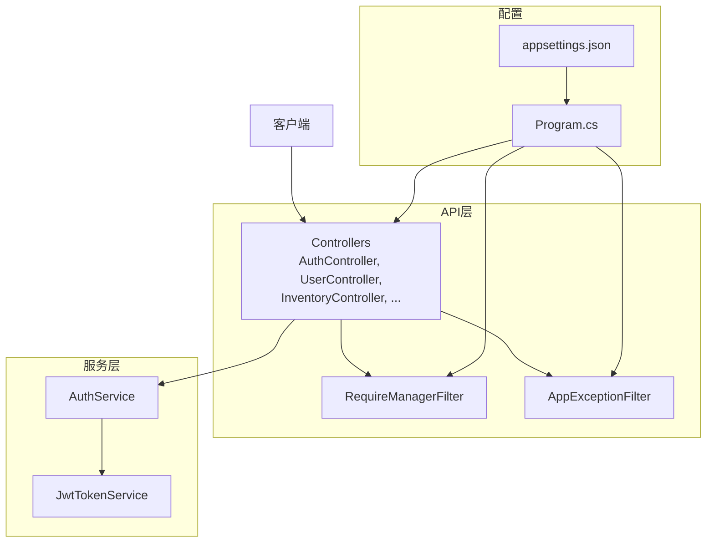
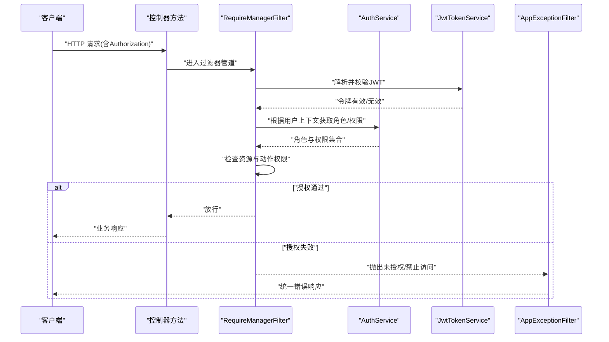
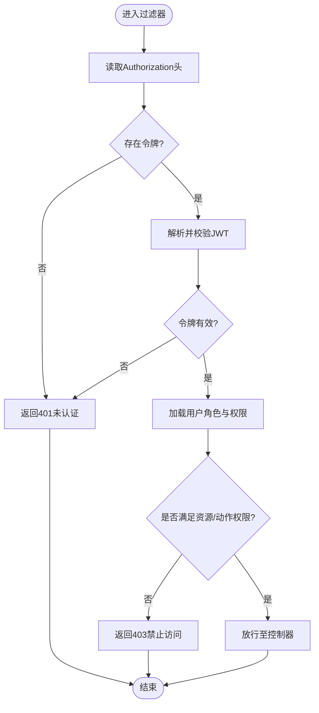
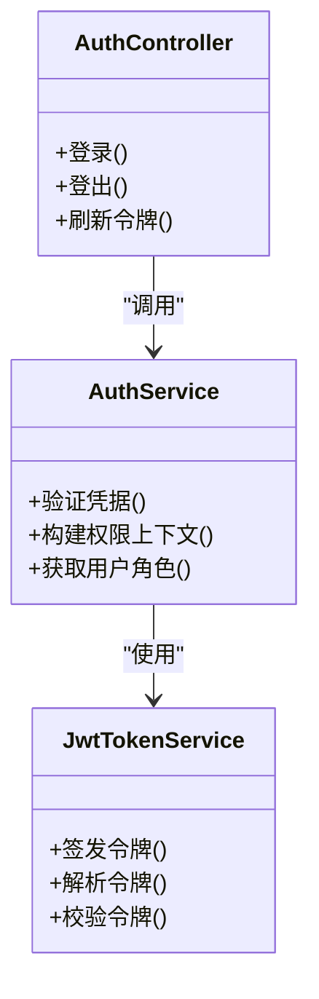
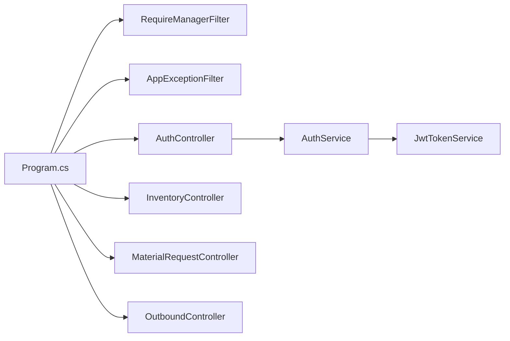

# 授权与RBAC

<cite>
**本文引用的文件**   
- [RequireManagerFilter.cs](file://dip-system/api/Controllers/RequireManagerFilter.cs)
- [AuthController.cs](file://dip-system/api/Controllers/AuthController.cs)
- [AuthService.cs](file://dip-system/api/Services/AuthService.cs)
- [JwtTokenService.cs](file://dip-system/api/Services/JwtTokenService.cs)
- [UserController.cs](file://dip-system/api/Controllers/UserController.cs)
- [AppExceptionFilter.cs](file://dip-system/api/Controllers/AppExceptionFilter.cs)
- [Program.cs](file://dip-system/api/Program.cs)
- [appsettings.json](file://dip-system/api/appsettings.json)
- [InventoryController.cs](file://dip-system/api/Controllers/InventoryController.cs)
- [MaterialRequestController.cs](file://dip-system/api/Controllers/MaterialRequestController.cs)
- [OutboundController.cs](file://dip-system/api/Controllers/OutboundController.cs)
- [AbnormalController.cs](file://dip-system/api/Controllers/AbnormalController.cs)
- [ChangeoverController.cs](file://dip-system/api/Controllers/ChangeoverController.cs)
- [DashboardController.cs](file://dip-system/api/Controllers/DashboardController.cs)
- [LocationsController.cs](file://dip-system/api/Controllers/LocationsController.cs)
- [OnlineController.cs](file://dip-system/api/Controllers/OnlineController.cs)
- [OrdersController.cs](file://dip-system/api/Controllers/OrdersController.cs)
- [PartsController.cs](file://dip-system/api/Controllers/PartsController.cs)
- [PrepController.cs](file://dip-system/api/Controllers/PrepController.cs)
- [RefillController.cs](file://dip-system/api/Controllers/RefillController.cs)
- [ReportController.cs](file://dip-system/api/Controllers/ReportController.cs)
- [ReturnController.cs](file://dip-system/api/Controllers/ReturnController.cs)
- [ShelvingController.cs](file://dip-system/api/Controllers/ShelvingController.cs)
- [StockCountController.cs](file://dip-system/api/Controllers/StockCountController.cs)
- [SubstituteController.cs](file://dip-system/api/Controllers/SubstituteController.cs)
- [SystemController.cs](file://dip-system/api/Controllers/SystemController.cs)
- [TransferController.cs](file://dip-system/api/Controllers/TransferController.cs)
</cite>

## 目录
1. [简介](#简介)
2. [项目结构](#项目结构)
3. [核心组件](#核心组件)
4. [架构总览](#架构总览)
5. [详细组件分析](#详细组件分析)
6. [依赖关系分析](#依赖关系分析)
7. [性能考虑](#性能考虑)
8. [故障排查指南](#故障排查指南)
9. [结论](#结论)
10. [附录](#附录)

## 简介
本文件面向DIP物料管理系统的授权与基于角色的访问控制（RBAC），目标是：
- 明确角色模型（管理员、操作员、查看者等）及其权限边界
- 详解 RequireManagerFilter 过滤器的工作机制（请求拦截、权限验证、角色检查）
- 说明API级权限控制实现（控制器方法级授权、数据级权限过滤）
- 提供权限矩阵与角色权限映射
- 给出自定义权限验证器的开发指南与最佳实践

## 项目结构
后端采用ASP.NET Core，授权相关代码集中在 api/Controllers 与 api/Services 下。关键文件包括：
- 认证与令牌服务：AuthService.cs、JwtTokenService.cs
- 全局异常处理：AppExceptionFilter.cs
- 启动配置：Program.cs、appsettings.json
- 各业务控制器：InventoryController.cs、MaterialRequestController.cs、OutboundController.cs 等
- 用户管理控制器：UserController.cs
- 统一鉴权过滤器：RequireManagerFilter.cs

图表来源
- [Program.cs](file://dip-system/api/Program.cs)
- [RequireManagerFilter.cs](file://dip-system/api/Controllers/RequireManagerFilter.cs)
- [AppExceptionFilter.cs](file://dip-system/api/Controllers/AppExceptionFilter.cs)
- [AuthController.cs](file://dip-system/api/Controllers/AuthController.cs)
- [AuthService.cs](file://dip-system/api/Services/AuthService.cs)
- [JwtTokenService.cs](file://dip-system/api/Services/JwtTokenService.cs)
- [appsettings.json](file://dip-system/api/appsettings.json)

章节来源
- [Program.cs](file://dip-system/api/Program.cs)
- [appsettings.json](file://dip-system/api/appsettings.json)

## 核心组件
- RequireManagerFilter：统一鉴权过滤器，负责在请求进入控制器前进行身份校验与角色检查，并支持按资源或动作细粒度授权。
- AuthController：登录、登出、刷新令牌等认证入口。
- AuthService：认证业务逻辑，如用户名密码校验、会话状态、权限上下文构建。
- JwtTokenService：JWT签发、解析、校验与过期处理。
- AppExceptionFilter：统一异常捕获与错误响应格式化。
- Program.cs：注册中间件、过滤器与服务，加载配置。
- 各业务控制器：通过RequireManagerFilter或方法级特性进行授权保护。

章节来源
- [RequireManagerFilter.cs](file://dip-system/api/Controllers/RequireManagerFilter.cs)
- [AuthController.cs](file://dip-system/api/Controllers/AuthController.cs)
- [AuthService.cs](file://dip-system/api/Services/AuthService.cs)
- [JwtTokenService.cs](file://dip-system/api/Services/JwtTokenService.cs)
- [AppExceptionFilter.cs](file://dip-system/api/Controllers/AppExceptionFilter.cs)
- [Program.cs](file://dip-system/api/Program.cs)

## 架构总览
下图展示一次受保护API请求的完整流程：客户端携带JWT调用接口，RequireManagerFilter拦截并校验令牌与角色，随后交由控制器方法处理；若发生异常，由AppExceptionFilter统一返回。

图表来源
- [RequireManagerFilter.cs](file://dip-system/api/Controllers/RequireManagerFilter.cs)
- [AuthService.cs](file://dip-system/api/Services/AuthService.cs)
- [JwtTokenService.cs](file://dip-system/api/Services/JwtTokenService.cs)
- [AppExceptionFilter.cs](file://dip-system/api/Controllers/AppExceptionFilter.cs)

## 详细组件分析

### RequireManagerFilter 过滤器工作原理
- 请求拦截：在控制器方法执行前拦截，读取Authorization头中的JWT。
- 权限验证：调用JwtTokenService解析令牌，校验签名、有效期与主体信息。
- 角色检查：从AuthService获取当前用户的角色与权限集合，结合请求的资源与动作进行匹配。
- 结果处理：通过则放行；否则抛出未授权或禁止访问异常，由AppExceptionFilter统一返回。

图表来源
- [RequireManagerFilter.cs](file://dip-system/api/Controllers/RequireManagerFilter.cs)
- [JwtTokenService.cs](file://dip-system/api/Services/JwtTokenService.cs)
- [AuthService.cs](file://dip-system/api/Services/AuthService.cs)

章节来源
- [RequireManagerFilter.cs](file://dip-system/api/Controllers/RequireManagerFilter.cs)

### 认证与令牌服务
- AuthController：提供登录、登出、刷新令牌等接口，接收凭据并返回JWT。
- AuthService：封装认证业务，如用户校验、会话建立、权限上下文生成。
- JwtTokenService：负责JWT的创建、解析、校验与过期策略。

图表来源
- [AuthController.cs](file://dip-system/api/Controllers/AuthController.cs)
- [AuthService.cs](file://dip-system/api/Services/AuthService.cs)
- [JwtTokenService.cs](file://dip-system/api/Services/JwtTokenService.cs)

章节来源
- [AuthController.cs](file://dip-system/api/Controllers/AuthController.cs)
- [AuthService.cs](file://dip-system/api/Services/AuthService.cs)
- [JwtTokenService.cs](file://dip-system/api/Services/JwtTokenService.cs)

### 控制器方法级授权与数据级权限过滤
- 方法级授权：在控制器方法上使用RequireManagerFilter或特性声明所需角色/权限，例如“仅管理员可修改库存”。
- 数据级权限：在服务层依据当前用户角色与数据归属（如仓库、产线、部门）进行过滤，确保只返回或操作允许的数据。

示例场景（以库存为例）：
- 查看者：只能查询库存，不能增删改。
- 操作员：可执行出入库、盘点等操作，但仅限其负责的仓库或区域。
- 管理员：拥有全部资源的读写权限，并可管理其他用户与系统配置。

章节来源
- [InventoryController.cs](file://dip-system/api/Controllers/InventoryController.cs)
- [MaterialRequestController.cs](file://dip-system/api/Controllers/MaterialRequestController.cs)
- [OutboundController.cs](file://dip-system/api/Controllers/OutboundController.cs)

### 统一异常处理
- AppExceptionFilter：捕获未认证、未授权、业务异常等，统一格式化为标准响应体，便于前端处理。

章节来源
- [AppExceptionFilter.cs](file://dip-system/api/Controllers/AppExceptionFilter.cs)

## 依赖关系分析
- Program.cs 注册过滤器、服务与中间件，决定授权管道的顺序与生效范围。
- appsettings.json 提供JWT密钥、过期时间、角色策略等配置项。
- 各控制器依赖RequireManagerFilter进行统一鉴权，依赖AuthService/JwtTokenService完成认证与权限判断。

图表来源
- [Program.cs](file://dip-system/api/Program.cs)
- [RequireManagerFilter.cs](file://dip-system/api/Controllers/RequireManagerFilter.cs)
- [AppExceptionFilter.cs](file://dip-system/api/Controllers/AppExceptionFilter.cs)
- [AuthController.cs](file://dip-system/api/Controllers/AuthController.cs)
- [AuthService.cs](file://dip-system/api/Services/AuthService.cs)
- [JwtTokenService.cs](file://dip-system/api/Services/JwtTokenService.cs)
- [InventoryController.cs](file://dip-system/api/Controllers/InventoryController.cs)
- [MaterialRequestController.cs](file://dip-system/api/Controllers/MaterialRequestController.cs)
- [OutboundController.cs](file://dip-system/api/Controllers/OutboundController.cs)

章节来源
- [Program.cs](file://dip-system/api/Program.cs)
- [appsettings.json](file://dip-system/api/appsettings.json)

## 性能考虑
- JWT校验应在过滤器中尽早完成，避免不必要的控制器执行开销。
- 权限上下文缓存：对频繁访问的权限集进行短期缓存，减少重复计算。
- 数据级过滤尽量在数据库层完成，减少内存与网络传输成本。
- 统一异常处理应轻量，避免阻塞主流程。

[本节为通用指导，不直接分析具体文件]

## 故障排查指南
- 401未认证：检查Authorization头是否正确携带JWT，确认JwtTokenService解析与校验逻辑。
- 403禁止访问：核对RequireManagerFilter的角色与权限策略配置，确认用户角色是否具备所需资源/动作权限。
- 业务异常：查看AppExceptionFilter的统一错误响应，定位具体控制器或服务层的异常原因。

章节来源
- [RequireManagerFilter.cs](file://dip-system/api/Controllers/RequireManagerFilter.cs)
- [AppExceptionFilter.cs](file://dip-system/api/Controllers/AppExceptionFilter.cs)
- [JwtTokenService.cs](file://dip-system/api/Services/JwtTokenService.cs)

## 结论
本系统通过RequireManagerFilter集中式鉴权、AuthService/JwtTokenService认证与令牌管理、以及控制器方法级与数据级双重权限控制，构建了完整的RBAC体系。建议在生产环境中持续完善权限矩阵、细化数据级过滤规则，并结合监控与审计提升安全性与可观测性。

[本节为总结，不直接分析具体文件]

## 附录

### 角色模型与权限矩阵
- 管理员：拥有所有资源的读、写、管理与配置权限，可管理用户与系统设置。
- 操作员：具备生产相关资源的读写权限（如出入库、备料、换线、补料、盘点等），受数据域限制。
- 查看者：仅具备只读权限，用于报表与看板展示。

角色权限映射（示例）：
- 管理员：库存（CRUD）、订单（CRUD）、出库（CRUD）、异常（CRUD）、换线（CRUD）、备料（CRUD）、补料（CRUD）、盘点（CRUD）、替代（CRUD）、转移（CRUD）、位置（CRUD）、在线（CRUD）、报告（R）、系统（CRUD）、用户（CRUD）。
- 操作员：库存（R/W受限）、订单（R/W受限）、出库（W受限）、异常（W受限）、换线（W受限）、备料（W受限）、补料（W受限）、盘点（W受限）、替代（W受限）、转移（W受限）、位置（R）、在线（R）、报告（R）、系统（无）、用户（无）。
- 查看者：库存（R）、订单（R）、出库（R）、异常（R）、换线（R）、备料（R）、补料（R）、盘点（R）、替代（R）、转移（R）、位置（R）、在线（R）、报告（R）、系统（无）、用户（无）。

[本节为概念性内容，不直接分析具体文件]

### 自定义权限验证器开发指南与最佳实践
- 设计原则
  - 单一职责：将权限判断逻辑封装为独立验证器，避免污染控制器或服务。
  - 可组合：支持按资源与动作组合策略，便于扩展新权限。
  - 可测试：提供单元测试覆盖常见与边界场景。
- 实现步骤
  - 定义权限策略接口与实现类，包含IsAuthorized方法。
  - 在RequireManagerFilter中集成策略评估，支持按路由或参数动态选择策略。
  - 将策略注册到DI容器，并在过滤器中注入使用。
- 最佳实践
  - 使用最小权限原则，默认拒绝，显式授权。
  - 对敏感操作增加二次确认或审计日志。
  - 对高频权限判断引入缓存，降低延迟。
  - 统一错误码与消息，便于前端提示与排障。

[本节为通用指导，不直接分析具体文件]