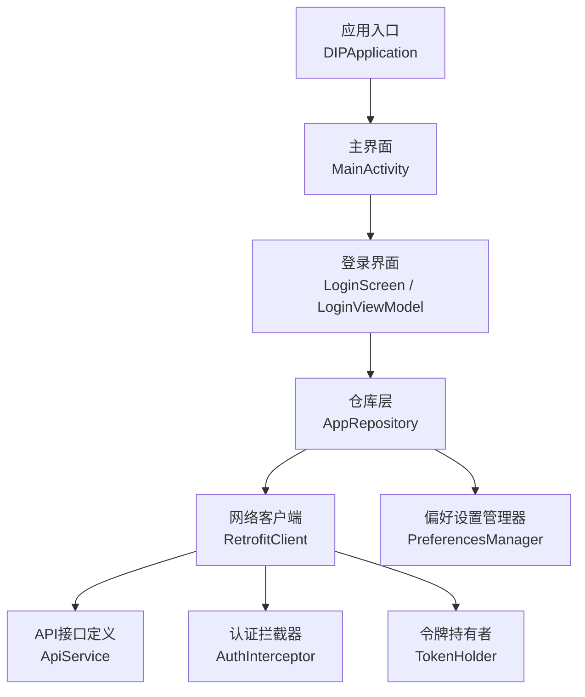
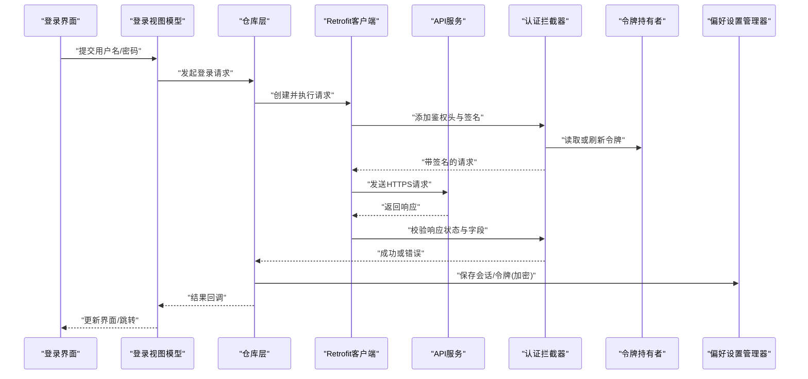
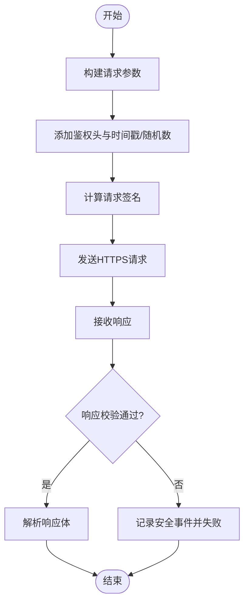
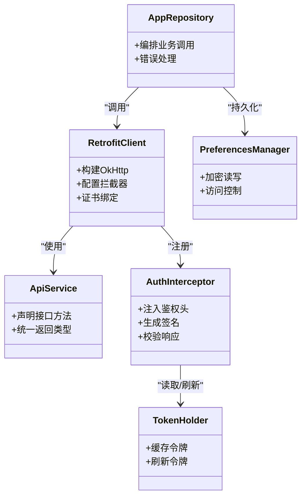

# 移动端安全

<cite>
**本文引用的文件**   
- [AndroidManifest.xml](file://mobile-android/app/src/main/AndroidManifest.xml)
- [build.gradle.kts（应用模块）](file://mobile-android/app/build.gradle.kts)
- [proguard-rules.pro](file://mobile-android/app/proguard-rules.pro)
- [RetrofitClient.kt](file://mobile-android/app/src/main/java/com/dip/material/data/network/RetrofitClient.kt)
- [ApiService.kt](file://mobile-android/app/src/main/java/com/dip/material/data/network/ApiService.kt)
- [AuthInterceptor.kt](file://mobile-android/app/src/main/java/com/dip/material/data/network/AuthInterceptor.kt)
- [TokenHolder.kt](file://mobile-android/app/src/main/java/com/dip/material/data/network/TokenHolder.kt)
- [PreferencesManager.kt](file://mobile-android/app/src/main/java/com/dip/material/utils/PreferencesManager.kt)
- [DIPApplication.kt](file://mobile-android/app/src/main/java/com/dip/material/DIPApplication.kt)
- [MainActivity.kt](file://mobile-android/app/src/main/java/com/dip/material/MainActivity.kt)
- [LoginScreen.kt](file://mobile-android/app/src/main/java/com/dip/material/ui/login/LoginScreen.kt)
- [LoginViewModel.kt](file://mobile-android/app/src/main/java/com/dip/material/ui/login/LoginViewModel.kt)
- [AppRepository.kt](file://mobile-android/app/src/main/java/com/dip/material/data/repository/AppRepository.kt)
</cite>

## 目录
1. [简介](#简介)
2. [项目结构](#项目结构)
3. [核心组件](#核心组件)
4. [架构总览](#架构总览)
5. [详细组件分析](#详细组件分析)
6. [依赖关系分析](#依赖关系分析)
7. [性能与安全权衡](#性能与安全权衡)
8. [故障排查指南](#故障排查指南)
9. [结论](#结论)
10. [附录：配置与示例清单](#附录配置与示例清单)

## 简介
本文件面向DIP物料管理系统移动端的开发者与维护者，聚焦于Android端的安全设计与实现。内容涵盖HTTPS通信与证书绑定、本地数据安全（敏感信息加密存储、SharedPreferences安全使用、内存中的敏感数据处理）、网络请求安全（SSL Pinning、请求签名、响应验证）、应用加固与代码混淆配置，以及移动端安全最佳实践（禁用调试模式、日志脱敏、崩溃报告安全）。文档同时提供可操作的安全配置建议与常见问题解决方案，帮助团队在现有工程基础上快速落地安全能力。

## 项目结构
移动端工程位于 mobile-android 目录，关键安全相关代码集中在 data/network、utils 与应用构建脚本中。整体采用Kotlin + Retrofit进行网络层封装，通过拦截器完成鉴权与签名，使用自定义的PreferencesManager管理持久化数据，应用入口为DIPApplication与MainActivity。

图表来源
- [DIPApplication.kt](file://mobile-android/app/src/main/java/com/dip/material/DIPApplication.kt)
- [MainActivity.kt](file://mobile-android/app/src/main/java/com/dip/material/MainActivity.kt)
- [LoginScreen.kt](file://mobile-android/app/src/main/java/com/dip/material/ui/login/LoginScreen.kt)
- [LoginViewModel.kt](file://mobile-android/app/src/main/java/com/dip/material/ui/login/LoginViewModel.kt)
- [AppRepository.kt](file://mobile-android/app/src/main/java/com/dip/material/data/repository/AppRepository.kt)
- [RetrofitClient.kt](file://mobile-android/app/src/main/java/com/dip/material/data/network/RetrofitClient.kt)
- [ApiService.kt](file://mobile-android/app/src/main/java/com/dip/material/data/network/ApiService.kt)
- [AuthInterceptor.kt](file://mobile-android/app/src/main/java/com/dip/material/data/network/AuthInterceptor.kt)
- [TokenHolder.kt](file://mobile-android/app/src/main/java/com/dip/material/data/network/TokenHolder.kt)
- [PreferencesManager.kt](file://mobile-android/app/src/main/java/com/dip/material/utils/PreferencesManager.kt)

章节来源
- [AndroidManifest.xml](file://mobile-android/app/src/main/AndroidManifest.xml)
- [build.gradle.kts（应用模块）](file://mobile-android/app/build.gradle.kts)
- [proguard-rules.pro](file://mobile-android/app/proguard-rules.pro)

## 核心组件
- 网络客户端与接口
  - RetrofitClient：负责构建OkHttp与Retrofit实例，集中配置超时、拦截器、证书绑定等网络策略。
  - ApiService：声明所有HTTP接口方法，统一返回类型与错误处理约定。
  - AuthInterceptor：在请求前注入鉴权头、时间戳、随机数与签名；在响应后校验状态码与必要字段。
  - TokenHolder：线程安全的令牌缓存与刷新协调，避免并发写入导致的数据竞争。
- 本地数据与权限
  - PreferencesManager：对SharedPreferences进行封装，支持敏感字段的加密读写与访问控制。
  - AndroidManifest：声明网络权限、是否允许明文流量、调试标志等系统级安全开关。
- 应用生命周期与UI
  - DIPApplication：初始化全局安全上下文、日志级别、崩溃上报策略。
  - MainActivity：入口安全检查（如调试模式检测、证书校验）。
  - LoginScreen / LoginViewModel：登录流程、敏感输入处理、失败重试与最小化敏感数据驻留。

章节来源
- [RetrofitClient.kt](file://mobile-android/app/src/main/java/com/dip/material/data/network/RetrofitClient.kt)
- [ApiService.kt](file://mobile-android/app/src/main/java/com/dip/material/data/network/ApiService.kt)
- [AuthInterceptor.kt](file://mobile-android/app/src/main/java/com/dip/material/data/network/AuthInterceptor.kt)
- [TokenHolder.kt](file://mobile-android/app/src/main/java/com/dip/material/data/network/TokenHolder.kt)
- [PreferencesManager.kt](file://mobile-android/app/src/main/java/com/dip/material/utils/PreferencesManager.kt)
- [AndroidManifest.xml](file://mobile-android/app/src/main/AndroidManifest.xml)
- [DIPApplication.kt](file://mobile-android/app/src/main/java/com/dip/material/DIPApplication.kt)
- [MainActivity.kt](file://mobile-android/app/src/main/java/com/dip/material/MainActivity.kt)
- [LoginScreen.kt](file://mobile-android/app/src/main/java/com/dip/material/ui/login/LoginScreen.kt)
- [LoginViewModel.kt](file://mobile-android/app/src/main/java/com/dip/material/ui/login/LoginViewModel.kt)

## 架构总览
下图展示了从登录到业务请求的关键调用链，包括鉴权、签名、响应校验与本地令牌/偏好存储交互。

图表来源
- [LoginScreen.kt](file://mobile-android/app/src/main/java/com/dip/material/ui/login/LoginScreen.kt)
- [LoginViewModel.kt](file://mobile-android/app/src/main/java/com/dip/material/ui/login/LoginViewModel.kt)
- [AppRepository.kt](file://mobile-android/app/src/main/java/com/dip/material/data/repository/AppRepository.kt)
- [RetrofitClient.kt](file://mobile-android/app/src/main/java/com/dip/material/data/network/RetrofitClient.kt)
- [ApiService.kt](file://mobile-android/app/src/main/java/com/dip/material/data/network/ApiService.kt)
- [AuthInterceptor.kt](file://mobile-android/app/src/main/java/com/dip/material/data/network/AuthInterceptor.kt)
- [TokenHolder.kt](file://mobile-android/app/src/main/java/com/dip/material/data/network/TokenHolder.kt)
- [PreferencesManager.kt](file://mobile-android/app/src/main/java/com/dip/material/utils/PreferencesManager.kt)

## 详细组件分析

### HTTPS通信与证书绑定
- 目标
  - 强制HTTPS通信，启用证书绑定（SSL Pinning），防止中间人攻击。
- 实现要点
  - 在RetrofitClient中配置OkHttp，加载内置证书或公钥指纹，拒绝未绑定的证书。
  - 在AndroidManifest中禁止明文HTTP（除非白名单域名），确保生产环境严格TLS。
  - 启动时校验当前证书链与预期指纹一致，不一致则阻断网络或降级提示。
- 建议
  - 使用服务器证书或公钥指纹进行Pin，避免仅依赖CA信任链。
  - 预置多套证书指纹以支持平滑轮换，并提供服务端版本协商机制。
  - 对测试环境使用独立证书与域名，避免污染生产Pin列表。

章节来源
- [RetrofitClient.kt](file://mobile-android/app/src/main/java/com/dip/material/data/network/RetrofitClient.kt)
- [AndroidManifest.xml](file://mobile-android/app/src/main/AndroidManifest.xml)

### 本地数据安全
- 敏感信息加密存储
  - 使用强加密算法（如AES-GCM）对敏感字段（令牌、密钥、用户标识）进行加密后再落盘。
  - 密钥材料应来自可信源（硬件Keystore或受保护的存储区），避免硬编码。
- SharedPreferences安全使用
  - 通过PreferencesManager统一读写，禁止直接暴露原始键名与明文值。
  - 对写入路径增加访问控制与完整性校验（HMAC或签名）。
- 内存中的敏感数据处理
  - 尽量使用不可变对象与一次性变量，使用后及时清空引用。
  - 避免将敏感数据放入日志、崩溃堆栈或剪贴板。
  - 在Activity销毁或后台时主动释放临时缓冲区。

章节来源
- [PreferencesManager.kt](file://mobile-android/app/src/main/java/com/dip/material/utils/PreferencesManager.kt)
- [LoginViewModel.kt](file://mobile-android/app/src/main/java/com/dip/material/ui/login/LoginViewModel.kt)
- [DIPApplication.kt](file://mobile-android/app/src/main/java/com/dip/material/DIPApplication.kt)

### 网络请求安全
- SSL Pinning
  - 在RetrofitClient中配置OkHttp的证书固定策略，拒绝非预期证书。
- 请求签名
  - AuthInterceptor在请求头中注入时间戳、随机数、设备指纹与签名值，防重放与篡改。
  - 签名算法需与服务端一致，建议使用HMAC-SHA256或RSA签名。
- 响应验证
  - 对响应体进行完整性校验（如签名或哈希），校验失败立即中断并上报异常。
  - 对状态码与关键字段进行白名单校验，非法响应视为失败。

图表来源
- [AuthInterceptor.kt](file://mobile-android/app/src/main/java/com/dip/material/data/network/AuthInterceptor.kt)
- [RetrofitClient.kt](file://mobile-android/app/src/main/java/com/dip/material/data/network/RetrofitClient.kt)
- [ApiService.kt](file://mobile-android/app/src/main/java/com/dip/material/data/network/ApiService.kt)

章节来源
- [AuthInterceptor.kt](file://mobile-android/app/src/main/java/com/dip/material/data/network/AuthInterceptor.kt)
- [RetrofitClient.kt](file://mobile-android/app/src/main/java/com/dip/material/data/network/RetrofitClient.kt)
- [ApiService.kt](file://mobile-android/app/src/main/java/com/dip/material/data/network/ApiService.kt)

### 应用加固与代码混淆
- 混淆与压缩
  - 在构建脚本中启用ProGuard/R8，移除无用代码，优化类名与方法名。
  - 配置保留规则，确保反射、序列化、第三方库正常运作。
- 资源保护
  - 对敏感字符串与配置文件进行混淆或外部化，避免硬编码。
- 打包加固
  - 使用厂商加固工具或平台提供的加固方案，增强反编译难度。
  - 开启DEX保护、指令集混淆与运行时完整性校验。

章节来源
- [build.gradle.kts（应用模块）](file://mobile-android/app/build.gradle.kts)
- [proguard-rules.pro](file://mobile-android/app/proguard-rules.pro)

### 移动端安全最佳实践
- 调试模式禁用
  - 在生产构建中关闭调试标志，禁止远程调试与断点注入。
  - 在MainActivity或DIPApplication中进行运行时检查，发现调试环境即退出或限制功能。
- 日志脱敏
  - 统一日志框架，屏蔽敏感字段（令牌、密码、身份证号等）。
  - 仅在开发环境输出详细日志，生产环境仅记录必要告警。
- 崩溃报告安全
  - 上报前对敏感信息进行脱敏与哈希化处理。
  - 限制上报频率与大小，避免泄露用户隐私。
- 权限最小化
  - 按需申请系统权限，避免过度授权。
  - 对危险权限进行运行时检查与解释。

章节来源
- [MainActivity.kt](file://mobile-android/app/src/main/java/com/dip/material/MainActivity.kt)
- [DIPApplication.kt](file://mobile-android/app/src/main/java/com/dip/material/DIPApplication.kt)

## 依赖关系分析
网络层与本地存储之间的依赖如下：

图表来源
- [RetrofitClient.kt](file://mobile-android/app/src/main/java/com/dip/material/data/network/RetrofitClient.kt)
- [ApiService.kt](file://mobile-android/app/src/main/java/com/dip/material/data/network/ApiService.kt)
- [AuthInterceptor.kt](file://mobile-android/app/src/main/java/com/dip/material/data/network/AuthInterceptor.kt)
- [TokenHolder.kt](file://mobile-android/app/src/main/java/com/dip/material/data/network/TokenHolder.kt)
- [PreferencesManager.kt](file://mobile-android/app/src/main/java/com/dip/material/utils/PreferencesManager.kt)
- [AppRepository.kt](file://mobile-android/app/src/main/java/com/dip/material/data/repository/AppRepository.kt)

章节来源
- [AppRepository.kt](file://mobile-android/app/src/main/java/com/dip/material/data/repository/AppRepository.kt)
- [RetrofitClient.kt](file://mobile-android/app/src/main/java/com/dip/material/data/network/RetrofitClient.kt)
- [ApiService.kt](file://mobile-android/app/src/main/java/com/dip/material/data/network/ApiService.kt)
- [AuthInterceptor.kt](file://mobile-android/app/src/main/java/com/dip/material/data/network/AuthInterceptor.kt)
- [TokenHolder.kt](file://mobile-android/app/src/main/java/com/dip/material/data/network/TokenHolder.kt)
- [PreferencesManager.kt](file://mobile-android/app/src/main/java/com/dip/material/utils/PreferencesManager.kt)

## 性能与安全权衡
- 证书校验与签名计算会增加少量CPU开销，建议在热路径外异步执行，避免阻塞UI。
- 频繁的网络校验可能带来延迟，可通过合理的缓存策略与批量校验降低影响。
- 混淆与加固会增大包体积，需平衡安装体验与安全性。
- 日志脱敏与崩溃上报过滤会增加I/O与序列化成本，应限制采样率与上报量。

[本节为通用指导，不直接分析具体文件]

## 故障排查指南
- HTTPS连接失败
  - 检查证书Pin列表是否包含当前服务器证书或公钥指纹。
  - 确认AndroidManifest中未允许明文HTTP导致握手失败。
  - 查看网络层日志（已脱敏）与证书链信息。
- 签名校验失败
  - 核对时间戳与随机数生成逻辑，确保服务端一致性。
  - 检查签名算法与密钥材料是否正确传递。
- 本地数据读取异常
  - 确认PreferencesManager的加密密钥来源与版本兼容。
  - 检查存储空间权限与文件完整性。
- 崩溃上报过多
  - 调整上报阈值与去重策略，避免重复上报。
  - 检查日志脱敏规则是否覆盖所有敏感字段。

章节来源
- [RetrofitClient.kt](file://mobile-android/app/src/main/java/com/dip/material/data/network/RetrofitClient.kt)
- [AuthInterceptor.kt](file://mobile-android/app/src/main/java/com/dip/material/data/network/AuthInterceptor.kt)
- [PreferencesManager.kt](file://mobile-android/app/src/main/java/com/dip/material/utils/PreferencesManager.kt)
- [DIPApplication.kt](file://mobile-android/app/src/main/java/com/dip/material/DIPApplication.kt)

## 结论
通过对HTTPS通信、本地数据安全、网络请求安全、应用加固与混淆的全面设计，DIP物料管理系统移动端可在保证用户体验的同时显著提升安全性。建议持续迭代安全策略，结合威胁建模与渗透测试结果优化实现细节，确保生产环境的稳定与可靠。

[本节为总结性内容，不直接分析具体文件]

## 附录：配置与示例清单
- HTTPS与证书绑定
  - 在RetrofitClient中配置OkHttp与证书Pin，确保只接受预期证书。
  - 在AndroidManifest中禁用明文HTTP，仅允许HTTPS。
- 本地数据存储
  - 使用PreferencesManager进行加密读写，避免明文落盘。
  - 对敏感变量在内存中使用后立即清理。
- 网络请求安全
  - 在AuthInterceptor中添加时间戳、随机数与签名。
  - 对响应体进行完整性校验与状态码白名单检查。
- 应用加固与混淆
  - 在构建脚本中启用ProGuard/R8，配置保留规则。
  - 使用加固工具增强反编译难度。
- 最佳实践
  - 禁用调试模式，限制日志输出与崩溃上报内容。
  - 最小化权限申请，遵循安全原则。

章节来源
- [RetrofitClient.kt](file://mobile-android/app/src/main/java/com/dip/material/data/network/RetrofitClient.kt)
- [AndroidManifest.xml](file://mobile-android/app/src/main/AndroidManifest.xml)
- [PreferencesManager.kt](file://mobile-android/app/src/main/java/com/dip/material/utils/PreferencesManager.kt)
- [AuthInterceptor.kt](file://mobile-android/app/src/main/java/com/dip/material/data/network/AuthInterceptor.kt)
- [build.gradle.kts（应用模块）](file://mobile-android/app/build.gradle.kts)
- [proguard-rules.pro](file://mobile-android/app/proguard-rules.pro)