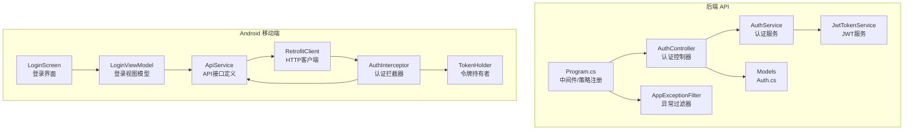
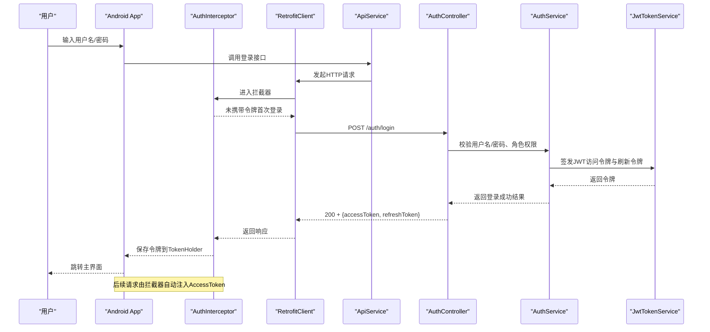
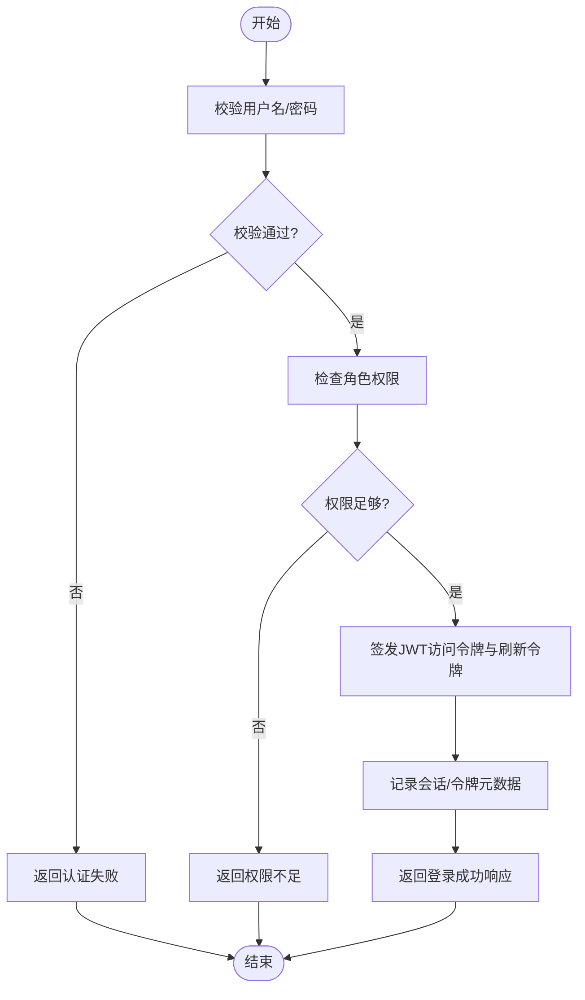
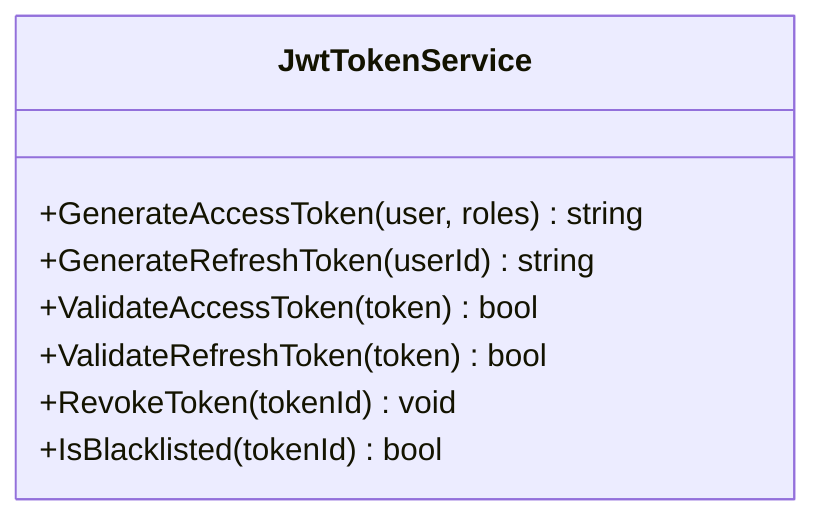
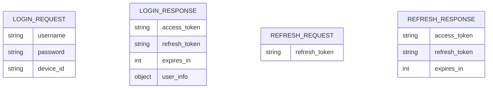
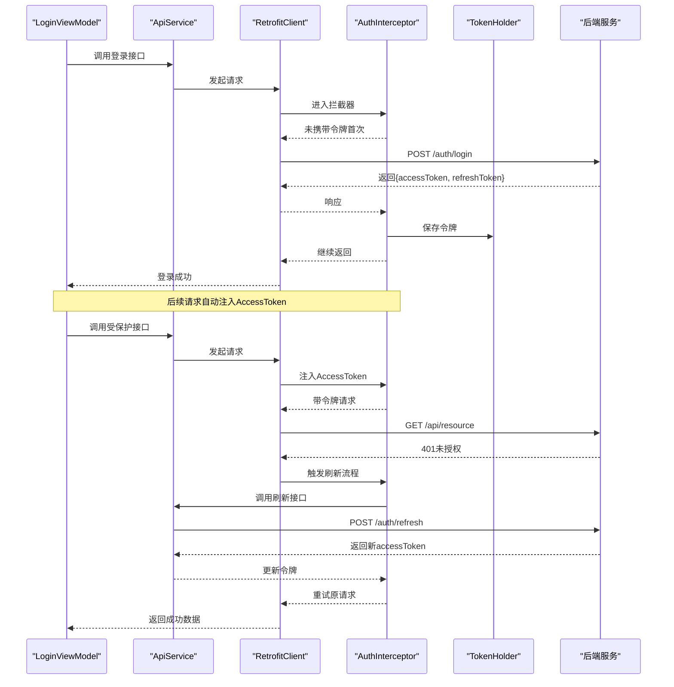
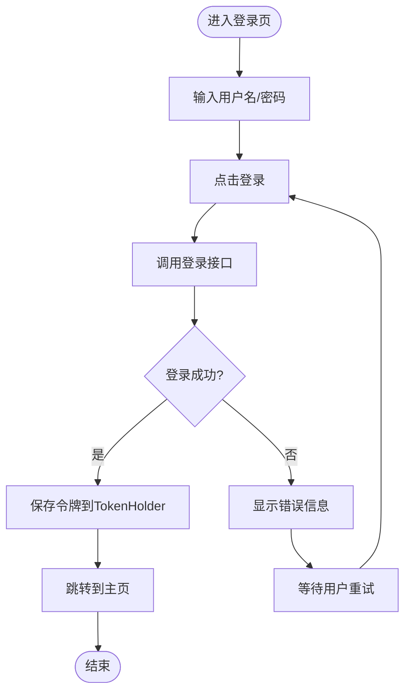
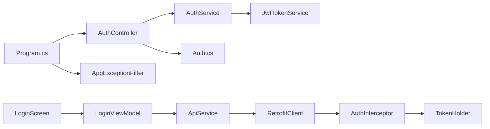

# 认证系统

<cite>
**本文引用的文件**   
- [AuthController.cs](file://dip-system/api/Controllers/AuthController.cs)
- [AuthService.cs](file://dip-system/api/Services/AuthService.cs)
- [JwtTokenService.cs](file://dip-system/api/Services/JwtTokenService.cs)
- [Auth.cs](file://dip-system/api/Models/Auth.cs)
- [Program.cs](file://dip-system/api/Program.cs)
- [AppExceptionFilter.cs](file://dip-system/api/Controllers/AppExceptionFilter.cs)
- [ApiService.kt](file://mobile-android/app/src/main/java/com/dip/material/data/network/ApiService.kt)
- [AuthInterceptor.kt](file://mobile-android/app/src/main/java/com/dip/material/data/network/AuthInterceptor.kt)
- [RetrofitClient.kt](file://mobile-android/app/src/main/java/com/dip/material/data/network/RetrofitClient.kt)
- [TokenHolder.kt](file://mobile-android/app/src/main/java/com/dip/material/data/network/TokenHolder.kt)
- [LoginScreen.kt](file://mobile-android/app/src/main/java/com/dip/material/ui/login/LoginScreen.kt)
- [LoginViewModel.kt](file://mobile-android/app/src/main/java/com/dip/material/ui/login/LoginViewModel.kt)
</cite>

## 目录
1. [简介](#简介)
2. [项目结构](#项目结构)
3. [核心组件](#核心组件)
4. [架构总览](#架构总览)
5. [详细组件分析](#详细组件分析)
6. [依赖关系分析](#依赖关系分析)
7. [性能考虑](#性能考虑)
8. [故障排查指南](#故障排查指南)
9. [结论](#结论)
10. [附录](#附录)

## 简介
本文件为DIP物料管理系统的认证系统技术文档，聚焦JWT令牌认证机制与移动端拦截器实现。内容涵盖：
- JWT令牌的生成、验证、刷新与撤销流程
- 用户登录认证流程（用户名密码校验、角色权限检查、会话管理）
- 移动端AuthInterceptor工作原理（请求拦截、令牌注入、自动刷新）
- 安全最佳实践（密码加密存储、令牌过期处理、并发登录控制等）
- 认证流程图与时序图，便于快速理解与排障

## 项目结构
认证相关代码分布在后端API与Android前端两部分：
- 后端API（ASP.NET Core）
  - 控制器：认证入口与接口定义
  - 服务层：业务逻辑（用户校验、权限、JWT签发）
  - 模型：认证相关的数据传输对象
  - 中间件/过滤器：异常统一处理、授权策略配置
- Android端
  - 网络层：Retrofit客户端、OkHttp拦截器、令牌持有者
  - UI层：登录界面与视图模型

图表来源
- [AuthController.cs](file://dip-system/api/Controllers/AuthController.cs)
- [AuthService.cs](file://dip-system/api/Services/AuthService.cs)
- [JwtTokenService.cs](file://dip-system/api/Services/JwtTokenService.cs)
- [Auth.cs](file://dip-system/api/Models/Auth.cs)
- [Program.cs](file://dip-system/api/Program.cs)
- [AppExceptionFilter.cs](file://dip-system/api/Controllers/AppExceptionFilter.cs)
- [ApiService.kt](file://mobile-android/app/src/main/java/com/dip/material/data/network/ApiService.kt)
- [AuthInterceptor.kt](file://mobile-android/app/src/main/java/com/dip/material/data/network/AuthInterceptor.kt)
- [RetrofitClient.kt](file://mobile-android/app/src/main/java/com/dip/material/data/network/RetrofitClient.kt)
- [TokenHolder.kt](file://mobile-android/app/src/main/java/com/dip/material/data/network/TokenHolder.kt)
- [LoginScreen.kt](file://mobile-android/app/src/main/java/com/dip/material/ui/login/LoginScreen.kt)
- [LoginViewModel.kt](file://mobile-android/app/src/main/java/com/dip/material/ui/login/LoginViewModel.kt)

章节来源
- [AuthController.cs](file://dip-system/api/Controllers/AuthController.cs)
- [AuthService.cs](file://dip-system/api/Services/AuthService.cs)
- [JwtTokenService.cs](file://dip-system/api/Services/JwtTokenService.cs)
- [Auth.cs](file://dip-system/api/Models/Auth.cs)
- [Program.cs](file://dip-system/api/Program.cs)
- [AppExceptionFilter.cs](file://dip-system/api/Controllers/AppExceptionFilter.cs)
- [ApiService.kt](file://mobile-android/app/src/main/java/com/dip/material/data/network/ApiService.kt)
- [AuthInterceptor.kt](file://mobile-android/app/src/main/java/com/dip/material/data/network/AuthInterceptor.kt)
- [RetrofitClient.kt](file://mobile-android/app/src/main/java/com/dip/material/data/network/RetrofitClient.kt)
- [TokenHolder.kt](file://mobile-android/app/src/main/java/com/dip/material/data/network/TokenHolder.kt)
- [LoginScreen.kt](file://mobile-android/app/src/main/java/com/dip/material/ui/login/LoginScreen.kt)
- [LoginViewModel.kt](file://mobile-android/app/src/main/java/com/dip/material/ui/login/LoginViewModel.kt)

## 核心组件
- 认证控制器（AuthController）
  - 提供登录、登出、刷新令牌等REST接口
  - 接收登录凭据，调用认证服务完成校验与签发
- 认证服务（AuthService）
  - 负责用户名密码校验、角色权限检查、会话状态管理
  - 协调JWT服务签发令牌，并维护令牌黑名单（撤销）
- JWT服务（JwtTokenService）
  - 负责JWT的创建、解析、签名、过期时间设置
  - 支持刷新令牌签发与校验
- 认证模型（Auth.cs）
  - 定义登录请求、响应、令牌结构等DTO
- 异常过滤器（AppExceptionFilter）
  - 统一捕获认证异常，返回标准错误格式
- Android网络层
  - ApiService：声明认证相关接口
  - AuthInterceptor：在请求头注入令牌，处理401自动刷新
  - RetrofitClient：构建OkHttp链，注册拦截器
  - TokenHolder：持久化当前访问令牌与刷新令牌

章节来源
- [AuthController.cs](file://dip-system/api/Controllers/AuthController.cs)
- [AuthService.cs](file://dip-system/api/Services/AuthService.cs)
- [JwtTokenService.cs](file://dip-system/api/Services/JwtTokenService.cs)
- [Auth.cs](file://dip-system/api/Models/Auth.cs)
- [AppExceptionFilter.cs](file://dip-system/api/Controllers/AppExceptionFilter.cs)
- [ApiService.kt](file://mobile-android/app/src/main/java/com/dip/material/data/network/ApiService.kt)
- [AuthInterceptor.kt](file://mobile-android/app/src/main/java/com/dip/material/data/network/AuthInterceptor.kt)
- [RetrofitClient.kt](file://mobile-android/app/src/main/java/com/dip/material/data/network/RetrofitClient.kt)
- [TokenHolder.kt](file://mobile-android/app/src/main/java/com/dip/material/data/network/TokenHolder.kt)

## 架构总览
整体采用前后端分离架构，后端通过JWT进行无状态鉴权，移动端通过拦截器透明注入令牌并在必要时自动刷新。

图表来源
- [AuthController.cs](file://dip-system/api/Controllers/AuthController.cs)
- [AuthService.cs](file://dip-system/api/Services/AuthService.cs)
- [JwtTokenService.cs](file://dip-system/api/Services/JwtTokenService.cs)
- [ApiService.kt](file://mobile-android/app/src/main/java/com/dip/material/data/network/ApiService.kt)
- [AuthInterceptor.kt](file://mobile-android/app/src/main/java/com/dip/material/data/network/AuthInterceptor.kt)
- [RetrofitClient.kt](file://mobile-android/app/src/main/java/com/dip/material/data/network/RetrofitClient.kt)

## 详细组件分析

### 后端认证控制器与服务
- 登录流程
  - 接收用户名、密码
  - 校验用户存在性与密码正确性
  - 检查角色权限是否满足访问需求
  - 签发JWT访问令牌与刷新令牌
  - 返回标准化响应体
- 刷新流程
  - 接收刷新令牌
  - 校验刷新令牌有效性（未撤销、未过期）
  - 签发新的访问令牌
  - 可选：轮换刷新令牌以增强安全性
- 登出与撤销
  - 将访问令牌加入黑名单（或使刷新令牌失效）
  - 清理服务端会话状态（如有）
- 异常处理
  - 使用统一异常过滤器返回标准错误码与消息

图表来源
- [AuthController.cs](file://dip-system/api/Controllers/AuthController.cs)
- [AuthService.cs](file://dip-system/api/Services/AuthService.cs)
- [JwtTokenService.cs](file://dip-system/api/Services/JwtTokenService.cs)
- [AppExceptionFilter.cs](file://dip-system/api/Controllers/AppExceptionFilter.cs)

章节来源
- [AuthController.cs](file://dip-system/api/Controllers/AuthController.cs)
- [AuthService.cs](file://dip-system/api/Services/AuthService.cs)
- [JwtTokenService.cs](file://dip-system/api/Services/JwtTokenService.cs)
- [AppExceptionFilter.cs](file://dip-system/api/Controllers/AppExceptionFilter.cs)

### JWT令牌服务
- 令牌生成
  - 基于用户标识、角色、租户等信息构造Claims
  - 设置访问令牌有效期与刷新令牌有效期
  - 使用强密钥进行签名
- 令牌验证
  - 解析Header与Payload，验签、校验过期时间
  - 检查令牌是否在黑名单中（撤销）
- 刷新令牌
  - 校验刷新令牌有效性
  - 签发新访问令牌，可轮换刷新令牌
- 撤销机制
  - 将令牌ID或指纹加入黑名单集合
  - 支持按用户维度批量撤销

图表来源
- [JwtTokenService.cs](file://dip-system/api/Services/JwtTokenService.cs)

章节来源
- [JwtTokenService.cs](file://dip-system/api/Services/JwtTokenService.cs)

### 认证模型
- 登录请求/响应
  - 包含用户名、密码、设备信息等字段
  - 返回访问令牌、刷新令牌、过期时间、用户信息
- 刷新请求/响应
  - 仅需要刷新令牌
  - 返回新的访问令牌（可选轮换刷新令牌）

图表来源
- [Auth.cs](file://dip-system/api/Models/Auth.cs)

章节来源
- [Auth.cs](file://dip-system/api/Models/Auth.cs)

### 移动端认证拦截器与网络层
- AuthInterceptor职责
  - 请求拦截：从TokenHolder读取AccessToken并注入Authorization头
  - 响应处理：当收到401时尝试刷新令牌
  - 自动刷新：使用RefreshToken调用刷新接口，成功后重试原请求
  - 失败处理：刷新失败则清除本地令牌并引导重新登录
- RetrofitClient配置
  - 注册AuthInterceptor到OkHttp
  - 统一基础URL、超时、日志等配置
- TokenHolder持久化
  - 存取AccessToken与RefreshToken
  - 提供线程安全的读写方法

图表来源
- [ApiService.kt](file://mobile-android/app/src/main/java/com/dip/material/data/network/ApiService.kt)
- [AuthInterceptor.kt](file://mobile-android/app/src/main/java/com/dip/material/data/network/AuthInterceptor.kt)
- [RetrofitClient.kt](file://mobile-android/app/src/main/java/com/dip/material/data/network/RetrofitClient.kt)
- [TokenHolder.kt](file://mobile-android/app/src/main/java/com/dip/material/data/network/TokenHolder.kt)

章节来源
- [ApiService.kt](file://mobile-android/app/src/main/java/com/dip/material/data/network/ApiService.kt)
- [AuthInterceptor.kt](file://mobile-android/app/src/main/java/com/dip/material/data/network/AuthInterceptor.kt)
- [RetrofitClient.kt](file://mobile-android/app/src/main/java/com/dip/material/data/network/RetrofitClient.kt)
- [TokenHolder.kt](file://mobile-android/app/src/main/java/com/dip/material/data/network/TokenHolder.kt)

### 登录UI与视图模型
- LoginScreen
  - 展示登录表单，收集用户名与密码
  - 显示加载与错误提示
- LoginViewModel
  - 封装登录逻辑，调用ApiService
  - 处理登录成功后的导航与状态更新
  - 处理错误与异常，提示用户

图表来源
- [LoginScreen.kt](file://mobile-android/app/src/main/java/com/dip/material/ui/login/LoginScreen.kt)
- [LoginViewModel.kt](file://mobile-android/app/src/main/java/com/dip/material/ui/login/LoginViewModel.kt)
- [ApiService.kt](file://mobile-android/app/src/main/java/com/dip/material/data/network/ApiService.kt)

章节来源
- [LoginScreen.kt](file://mobile-android/app/src/main/java/com/dip/material/ui/login/LoginScreen.kt)
- [LoginViewModel.kt](file://mobile-android/app/src/main/java/com/dip/material/ui/login/LoginViewModel.kt)

## 依赖关系分析
- 控制器依赖服务层，服务层依赖JWT服务与数据访问（用户、权限）
- 移动端网络层依赖拦截器与令牌持有者
- 中间件/过滤器用于全局异常与授权策略

图表来源
- [AuthController.cs](file://dip-system/api/Controllers/AuthController.cs)
- [AuthService.cs](file://dip-system/api/Services/AuthService.cs)
- [JwtTokenService.cs](file://dip-system/api/Services/JwtTokenService.cs)
- [Auth.cs](file://dip-system/api/Models/Auth.cs)
- [Program.cs](file://dip-system/api/Program.cs)
- [AppExceptionFilter.cs](file://dip-system/api/Controllers/AppExceptionFilter.cs)
- [LoginScreen.kt](file://mobile-android/app/src/main/java/com/dip/material/ui/login/LoginScreen.kt)
- [LoginViewModel.kt](file://mobile-android/app/src/main/java/com/dip/material/ui/login/LoginViewModel.kt)
- [ApiService.kt](file://mobile-android/app/src/main/java/com/dip/material/data/network/ApiService.kt)
- [RetrofitClient.kt](file://mobile-android/app/src/main/java/com/dip/material/data/network/RetrofitClient.kt)
- [AuthInterceptor.kt](file://mobile-android/app/src/main/java/com/dip/material/data/network/AuthInterceptor.kt)
- [TokenHolder.kt](file://mobile-android/app/src/main/java/com/dip/material/data/network/TokenHolder.kt)

章节来源
- [AuthController.cs](file://dip-system/api/Controllers/AuthController.cs)
- [AuthService.cs](file://dip-system/api/Services/AuthService.cs)
- [JwtTokenService.cs](file://dip-system/api/Services/JwtTokenService.cs)
- [Auth.cs](file://dip-system/api/Models/Auth.cs)
- [Program.cs](file://dip-system/api/Program.cs)
- [AppExceptionFilter.cs](file://dip-system/api/Controllers/AppExceptionFilter.cs)
- [LoginScreen.kt](file://mobile-android/app/src/main/java/com/dip/material/ui/login/LoginScreen.kt)
- [LoginViewModel.kt](file://mobile-android/app/src/main/java/com/dip/material/ui/login/LoginViewModel.kt)
- [ApiService.kt](file://mobile-android/app/src/main/java/com/dip/material/data/network/ApiService.kt)
- [RetrofitClient.kt](file://mobile-android/app/src/main/java/com/dip/material/data/network/RetrofitClient.kt)
- [AuthInterceptor.kt](file://mobile-android/app/src/main/java/com/dip/material/data/network/AuthInterceptor.kt)
- [TokenHolder.kt](file://mobile-android/app/src/main/java/com/dip/material/data/network/TokenHolder.kt)

## 性能考虑
- 令牌长度与负载
  - 避免在JWT中存放过多敏感或大体积数据，减少网络开销
- 刷新令牌轮换
  - 每次刷新后轮换刷新令牌，降低重放攻击风险
- 令牌黑名单查询
  - 使用高性能缓存（如内存缓存或Redis）存储黑名单，提升验证速度
- 并发登录控制
  - 限制同一用户同时在线设备数量，避免资源滥用
- 网络重试与退避
  - 移动端在刷新失败时实施指数退避，避免雪崩

[本节为通用指导，不直接分析具体文件]

## 故障排查指南
- 常见问题
  - 401未授权：检查AccessToken是否过期或被撤销；确认拦截器是否正确注入
  - 403禁止访问：检查用户角色权限是否满足接口要求
  - 刷新失败：确认RefreshToken有效且未被撤销；检查刷新接口路径与参数
- 定位步骤
  - 查看后端异常过滤器返回的错误码与消息
  - 检查移动端TokenHolder中的令牌是否被正确保存
  - 核对拦截器日志，确认请求头是否包含Authorization
- 恢复措施
  - 清除本地令牌并重新登录
  - 服务端撤销黑名单条目（如误封禁）

章节来源
- [AppExceptionFilter.cs](file://dip-system/api/Controllers/AppExceptionFilter.cs)
- [AuthInterceptor.kt](file://mobile-android/app/src/main/java/com/dip/material/data/network/AuthInterceptor.kt)

## 结论
本认证系统通过JWT实现无状态鉴权，结合移动端拦截器实现透明的令牌注入与自动刷新。后端提供完整的登录、刷新、撤销能力，并通过统一异常处理保障一致性。建议在生产环境强化密钥管理、令牌黑名单存储与并发登录控制，以提升安全性与稳定性。

[本节为总结，不直接分析具体文件]

## 附录
- 安全最佳实践
  - 密码加密存储：使用强哈希算法（如bcrypt/argon2），加盐存储
  - 令牌过期处理：短生命周期访问令牌+长生命周期刷新令牌；服务端校验过期与撤销
  - 并发登录控制：限制单用户设备数，支持强制下线
  - 防重放与篡改：严格验签、最小化Claims、HTTPS传输
  - 审计与监控：记录登录、刷新、撤销事件，接入告警

[本节为通用指导，不直接分析具体文件]