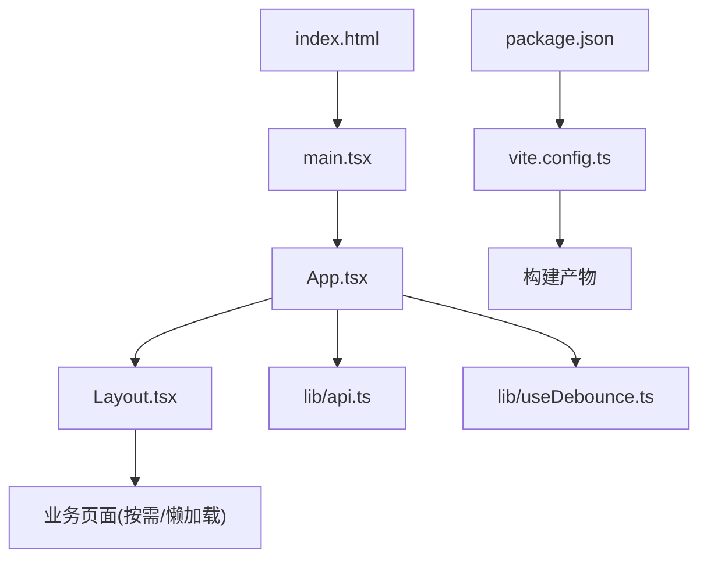
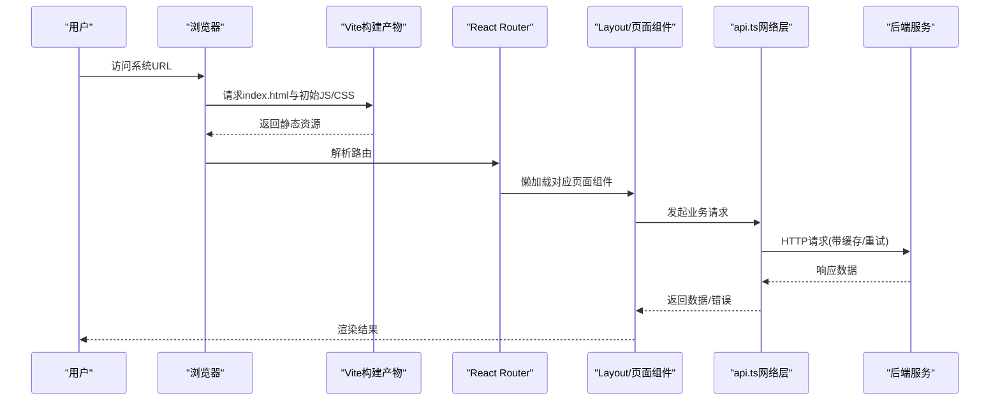
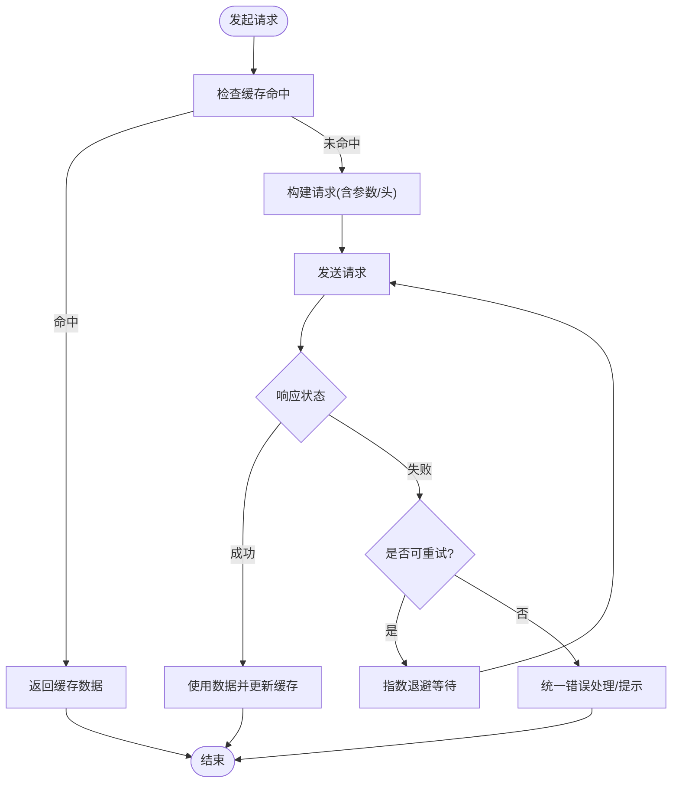
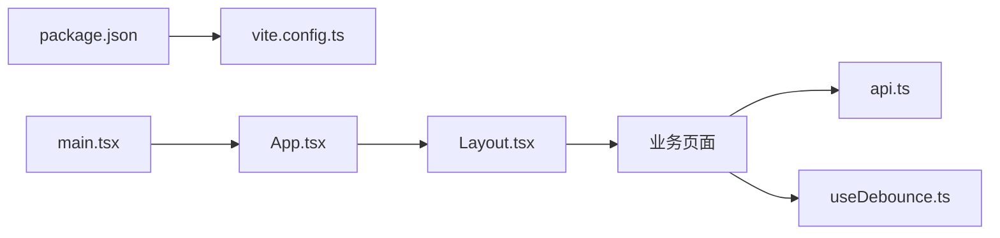

# 前端性能优化

<cite>
**本文引用的文件**   
- [frontend-web/package.json](file://dip-system/frontend-web/package.json)
- [frontend-web/vite.config.ts](file://dip-system/frontend-web/vite.config.ts)
- [frontend-web/src/main.tsx](file://dip-system/frontend-web/src/main.tsx)
- [frontend-web/src/App.tsx](file://dip-system/frontend-web/src/App.tsx)
- [frontend-web/src/pages/Layout.tsx](file://dip-system/frontend-web/src/pages/Layout.tsx)
- [frontend-web/src/lib/api.ts](file://dip-system/frontend-web/src/lib/api.ts)
- [frontend-web/src/lib/useDebounce.ts](file://dip-system/frontend-web/src/lib/useDebounce.ts)
- [frontend-web/index.html](file://dip-system/frontend-web/index.html)
</cite>

## 目录
1. [简介](#简介)
2. [项目结构](#项目结构)
3. [核心组件](#核心组件)
4. [架构总览](#架构总览)
5. [详细组件分析](#详细组件分析)
6. [依赖分析](#依赖分析)
7. [性能考虑](#性能考虑)
8. [故障排查指南](#故障排查指南)
9. [结论](#结论)
10. [附录](#附录)

## 简介
本文件面向DIP物料管理系统Web前端，系统性阐述性能优化策略与落地方案。内容覆盖代码分割（路由懒加载、组件动态导入、第三方库按需加载）、资源优化（图片压缩、字体优化、静态资源缓存）、渲染性能优化（虚拟滚动、防抖节流、React组件优化）、网络请求优化（请求合并、缓存策略、错误重试），以及构建优化配置与性能监控工具使用。目标是帮助团队在现有Vite + React技术栈下，持续提升首屏加载速度、交互流畅性与整体可维护性。

## 项目结构
前端位于dip-system/frontend-web，采用Vite作为构建工具，React为UI框架，Tailwind CSS用于样式。关键入口与配置如下：
- 应用入口与路由挂载：src/main.tsx、src/App.tsx、src/pages/Layout.tsx
- 构建与打包：vite.config.ts、package.json
- 网络层与工具：src/lib/api.ts、src/lib/useDebounce.ts
- 静态资源入口：index.html

图表来源
- [frontend-web/index.html](file://dip-system/frontend-web/index.html)
- [frontend-web/src/main.tsx](file://dip-system/frontend-web/src/main.tsx)
- [frontend-web/src/App.tsx](file://dip-system/frontend-web/src/App.tsx)
- [frontend-web/src/pages/Layout.tsx](file://dip-system/frontend-web/src/pages/Layout.tsx)
- [frontend-web/vite.config.ts](file://dip-system/frontend-web/vite.config.ts)
- [frontend-web/package.json](file://dip-system/frontend-web/package.json)

章节来源
- [frontend-web/package.json](file://dip-system/frontend-web/package.json)
- [frontend-web/vite.config.ts](file://dip-system/frontend-web/vite.config.ts)
- [frontend-web/src/main.tsx](file://dip-system/frontend-web/src/main.tsx)
- [frontend-web/src/App.tsx](file://dip-system/frontend-web/src/App.tsx)
- [frontend-web/src/pages/Layout.tsx](file://dip-system/frontend-web/src/pages/Layout.tsx)
- [frontend-web/index.html](file://dip-system/frontend-web/index.html)

## 核心组件
- 应用入口与路由容器
  - main.tsx负责初始化React应用并挂载到DOM节点
  - App.tsx集中管理路由与全局布局
  - Layout.tsx承载导航、侧边栏、头部等公共区域
- 网络层
  - api.ts封装HTTP请求，统一处理鉴权、错误、重试与缓存
- 通用Hook
  - useDebounce.ts提供防抖能力，减少高频事件导致的重复计算或请求

章节来源
- [frontend-web/src/main.tsx](file://dip-system/frontend-web/src/main.tsx)
- [frontend-web/src/App.tsx](file://dip-system/frontend-web/src/App.tsx)
- [frontend-web/src/pages/Layout.tsx](file://dip-system/frontend-web/src/pages/Layout.tsx)
- [frontend-web/src/lib/api.ts](file://dip-system/frontend-web/src/lib/api.ts)
- [frontend-web/src/lib/useDebounce.ts](file://dip-system/frontend-web/src/lib/useDebounce.ts)

## 架构总览
下图展示从浏览器到后端API的完整链路，标注了性能优化关键点（路由懒加载、网络缓存、错误重试、资源压缩）。

图表来源
- [frontend-web/index.html](file://dip-system/frontend-web/index.html)
- [frontend-web/src/main.tsx](file://dip-system/frontend-web/src/main.tsx)
- [frontend-web/src/App.tsx](file://dip-system/frontend-web/src/App.tsx)
- [frontend-web/src/pages/Layout.tsx](file://dip-system/frontend-web/src/pages/Layout.tsx)
- [frontend-web/src/lib/api.ts](file://dip-system/frontend-web/src/lib/api.ts)

## 详细组件分析

### 路由懒加载与代码分割
- 目标：按路由粒度拆分包体，减少首屏体积与解析时间
- 建议实现
  - 使用React.lazy配合Suspense对页面级组件进行懒加载
  - 将大型第三方库（如图表、富文本）改为按需引入或动态import()
  - 对非关键路径模块（如导出报表、高级筛选）延迟加载
- 注意事项
  - 避免过度拆分导致请求数过多；合理合并小模块
  - 预取热门路由资源，提升二次进入体验
  - 结合Vite的按需加载与分包策略，确保chunk命名稳定利于缓存

章节来源
- [frontend-web/src/App.tsx](file://dip-system/frontend-web/src/App.tsx)
- [frontend-web/src/pages/Layout.tsx](file://dip-system/frontend-web/src/pages/Layout.tsx)

### 组件动态导入与第三方库按需加载
- 目标：降低主包体积，缩短TTI
- 实践要点
  - 大组件使用React.lazy + Suspense包裹
  - 第三方库通过动态import按需加载，避免全量引入
  - 图标库仅引入所需图标集，或使用SVG内联
- 效果评估
  - 观察首屏JS体积与请求数变化
  - 关注内存占用与GC压力是否下降

章节来源
- [frontend-web/src/App.tsx](file://dip-system/frontend-web/src/App.tsx)

### 资源优化：图片、字体与静态资源缓存
- 图片
  - 优先使用现代格式（WebP/AVIF），按需生成多分辨率
  - 大图懒加载，列表图使用占位图+渐进式加载
- 字体
  - 使用font-display: swap，减少阻塞
  - 仅加载必要字重与字符集，避免全量woff2
- 静态资源缓存
  - 利用Vite默认的内容哈希文件名，开启强缓存
  - 对HTML启用短缓存，对JS/CSS启用长缓存
  - CDN缓存策略与版本化发布

章节来源
- [frontend-web/vite.config.ts](file://dip-system/frontend-web/vite.config.ts)
- [frontend-web/index.html](file://dip-system/frontend-web/index.html)

### 渲染性能优化：虚拟滚动、防抖节流与React优化
- 虚拟滚动
  - 大数据表格/列表使用虚拟滚动，仅渲染可视区元素
  - 固定行高或估算高度，减少重排重绘
- 防抖节流
  - 搜索输入、窗口resize、滚动监听等高频事件使用防抖/节流
  - useDebounce封装统一复用
- React组件优化
  - 合理使用useMemo/useCallback避免不必要重渲染
  - 拆分重型子组件，避免在顶层组件中执行昂贵计算
  - 列表渲染使用稳定key，避免不必要的更新

章节来源
- [frontend-web/src/lib/useDebounce.ts](file://dip-system/frontend-web/src/lib/useDebounce.ts)

### 网络请求优化：合并、缓存与重试
- 请求合并
  - 对短时间内相同或相关请求进行合并，减少并发与服务器压力
  - 使用AbortController取消过期请求，避免竞态
- 缓存策略
  - GET请求基于URL与参数做内存缓存，必要时落盘
  - 设置合理的TTL与失效策略，支持手动刷新
- 错误重试
  - 对幂等GET请求实施指数退避重试
  - 区分网络错误与服务端错误，给出差异化提示
- 统一拦截
  - 在api.ts中集中处理鉴权、错误码、超时与重试逻辑

图表来源
- [frontend-web/src/lib/api.ts](file://dip-system/frontend-web/src/lib/api.ts)

章节来源
- [frontend-web/src/lib/api.ts](file://dip-system/frontend-web/src/lib/api.ts)

## 依赖分析
- 构建与运行时依赖
  - package.json定义构建脚本、开发依赖与生产依赖
  - vite.config.ts控制构建行为、插件与输出策略
- 模块耦合关系
  - main.tsx -> App.tsx -> Layout.tsx -> 页面组件
  - 页面组件 -> api.ts（网络层）
  - 页面组件 -> useDebounce.ts（交互优化）

图表来源
- [frontend-web/package.json](file://dip-system/frontend-web/package.json)
- [frontend-web/vite.config.ts](file://dip-system/frontend-web/vite.config.ts)
- [frontend-web/src/main.tsx](file://dip-system/frontend-web/src/main.tsx)
- [frontend-web/src/App.tsx](file://dip-system/frontend-web/src/App.tsx)
- [frontend-web/src/pages/Layout.tsx](file://dip-system/frontend-web/src/pages/Layout.tsx)
- [frontend-web/src/lib/api.ts](file://dip-system/frontend-web/src/lib/api.ts)
- [frontend-web/src/lib/useDebounce.ts](file://dip-system/frontend-web/src/lib/useDebounce.ts)

章节来源
- [frontend-web/package.json](file://dip-system/frontend-web/package.json)
- [frontend-web/vite.config.ts](file://dip-system/frontend-web/vite.config.ts)
- [frontend-web/src/main.tsx](file://dip-system/frontend-web/src/main.tsx)
- [frontend-web/src/App.tsx](file://dip-system/frontend-web/src/App.tsx)
- [frontend-web/src/pages/Layout.tsx](file://dip-system/frontend-web/src/pages/Layout.tsx)
- [frontend-web/src/lib/api.ts](file://dip-system/frontend-web/src/lib/api.ts)
- [frontend-web/src/lib/useDebounce.ts](file://dip-system/frontend-web/src/lib/useDebounce.ts)

## 性能考虑
- 代码分割
  - 路由级懒加载、组件级动态导入、第三方库按需引入
  - 合理划分chunk，避免碎片化过小
- 资源优化
  - 图片/WebP/AVIF、字体subset、静态资源强缓存
  - 使用CDN与版本化发布
- 渲染优化
  - 虚拟滚动、防抖节流、React memo/useMemo/useCallback
  - 避免在渲染路径中进行昂贵计算
- 网络优化
  - 请求合并、缓存策略、指数退避重试、超时控制
  - 接口分页与增量更新
- 构建优化
  - Vite插件与打包策略、Tree Shaking、生产环境压缩
  - 分析包体结构与依赖热点

[本节为通用指导，不直接分析具体文件]

## 故障排查指南
- 首屏慢
  - 检查路由懒加载是否生效，是否存在同步大依赖
  - 查看构建产物大小与请求数，定位超大chunk
- 卡顿与掉帧
  - 排查高频事件是否缺少防抖/节流
  - 列表渲染是否缺少虚拟滚动或key不稳定
- 网络问题
  - 检查缓存命中率与TTL设置
  - 确认重试策略与错误提示是否合理
- 调试建议
  - 使用浏览器Performance面板与Network面板
  - 结合Vite Dev Server与Source Map定位问题

章节来源
- [frontend-web/src/lib/api.ts](file://dip-system/frontend-web/src/lib/api.ts)
- [frontend-web/src/lib/useDebounce.ts](file://dip-system/frontend-web/src/lib/useDebounce.ts)

## 结论
通过在路由与组件层面实施代码分割，在网络层实现缓存与重试，在渲染层应用虚拟滚动与防抖节流，并结合Vite构建优化与资源压缩，可以显著提升DIP物料管理系统Web前端的加载速度与交互流畅性。建议持续监控关键指标（FCP、LCP、TTI、FID、CLS），以数据驱动进一步优化。

[本节为总结性内容，不直接分析具体文件]

## 附录
- 常用性能指标
  - 首屏时间（FCP/LCP）、可交互时间（TTI）、首次输入延迟（FID）、累积布局偏移（CLS）
- 推荐工具
  - Lighthouse、Chrome Performance、Webpack/Vite Bundle Analyzer
- 最佳实践清单
  - 路由懒加载、按需引入、图片懒加载、字体subset、静态资源强缓存
  - 请求合并与缓存、指数退避重试、错误边界与友好提示
  - React组件优化、虚拟滚动、防抖节流

[本节为补充信息，不直接分析具体文件]