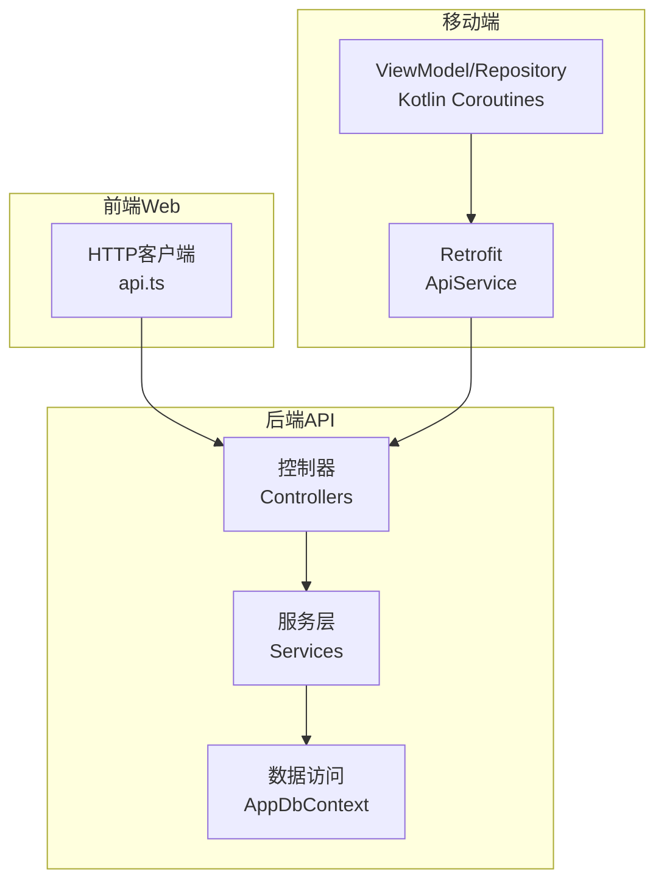
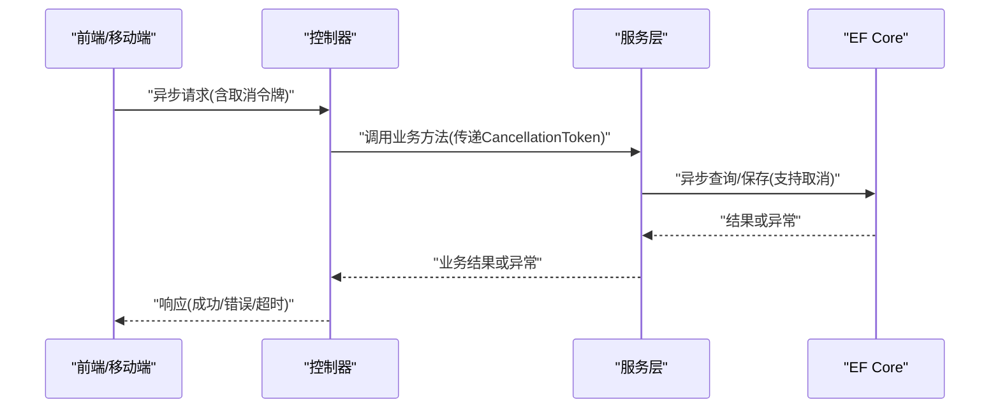
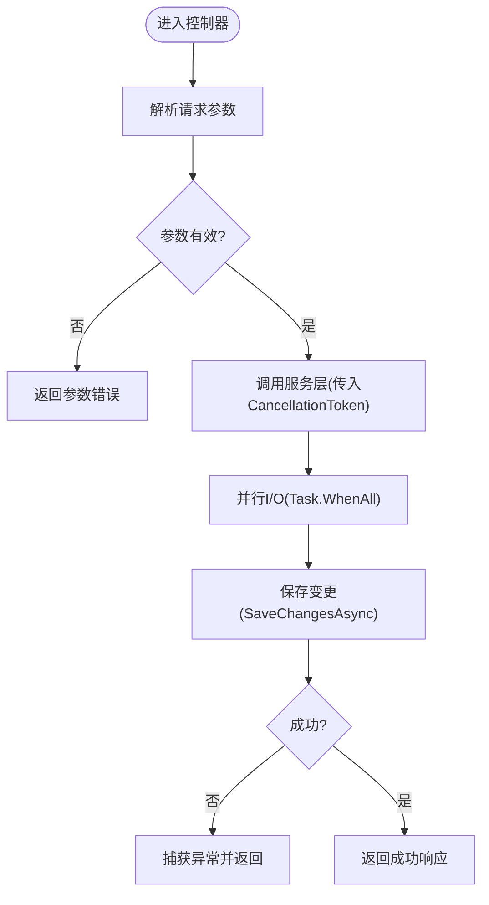
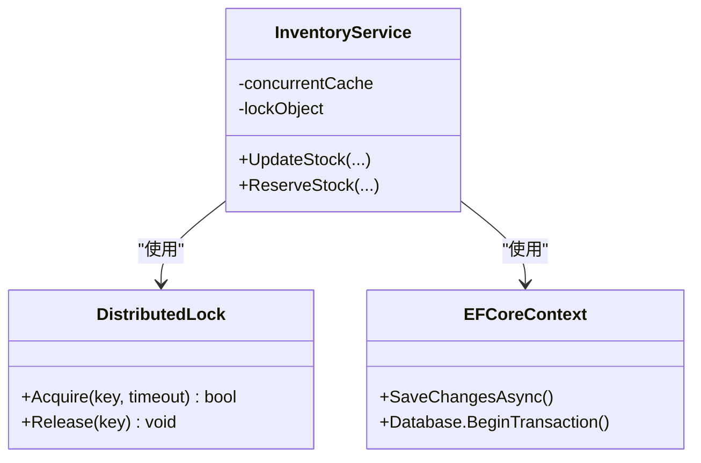
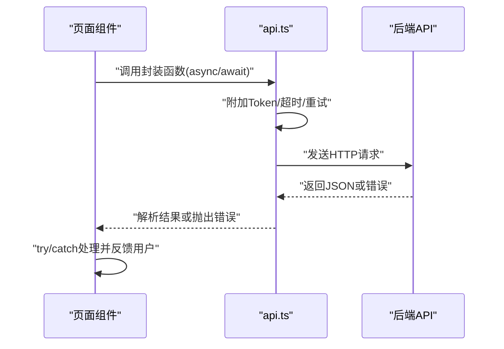
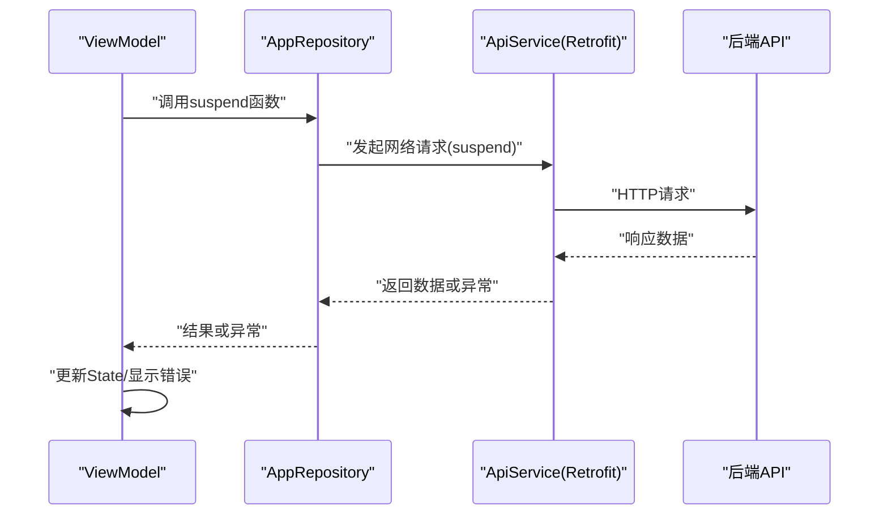
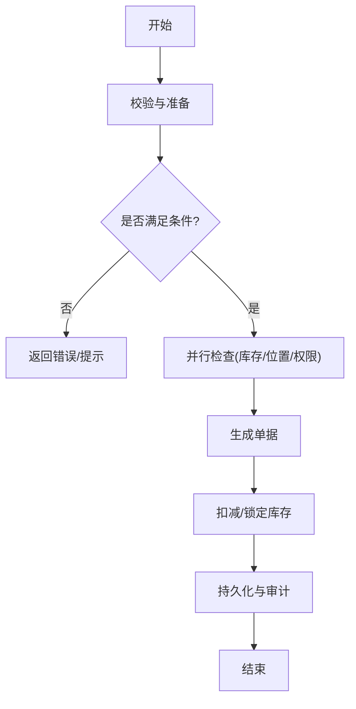
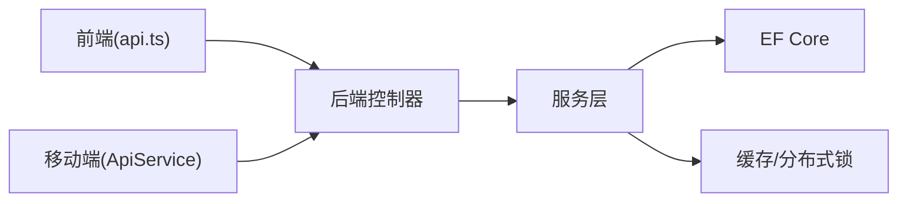

# 异步处理与并发控制

<cite>
**本文引用的文件**   
- [Program.cs](file://dip-system/api/Program.cs)
- [AppDbContext.cs](file://dip-system/api/Data/AppDbContext.cs)
- [InventoryService.cs](file://dip-system/api/Services/InventoryService.cs)
- [MaterialRequestService.cs](file://dip-system/api/Services/MaterialRequestService.cs)
- [OrderService.cs](file://dip-system/api/Services/OrderService.cs)
- [OutboundService.cs](file://dip-system/api/Services/OutboundService.cs)
- [RefillService.cs](file://dip-system/api/Services/RefillService.cs)
- [ShelvingService.cs](file://dip-system/api/Services/ShelvingService.cs)
- [TransferService.cs](file://dip-system/api/Services/TransferService.cs)
- [AbnormalController.cs](file://dip-system/api/Controllers/AbnormalController.cs)
- [AuthController.cs](file://dip-system/api/Controllers/AuthController.cs)
- [DashboardController.cs](file://dip-system/api/Controllers/DashboardController.cs)
- [InventoryController.cs](file://dip-system/api/Controllers/InventoryController.cs)
- [MaterialRequestController.cs](file://dip-system/api/Controllers/MaterialRequestController.cs)
- [OrdersController.cs](file://dip-system/api/Controllers/OrdersController.cs)
- [OutboundController.cs](file://dip-system/api/Controllers/OutboundController.cs)
- [RefillController.cs](file://dip-system/api/Controllers/RefillController.cs)
- [ShelvingController.cs](file://dip-system/api/Controllers/ShelvingController.cs)
- [TransferController.cs](file://dip-system/api/Controllers/TransferController.cs)
- [ApiResponse.cs](file://dip-system/api/Models/ApiResponse.cs)
- [api.ts](file://dip-system/frontend-web/src/lib/api.ts)
- [auth.ts](file://dip-system/frontend-web/src/lib/auth.ts)
- [RetrofitClient.kt](file://mobile-android/app/src/main/java/com/dip/material/data/network/RetrofitClient.kt)
- [ApiService.kt](file://mobile-android/app/src/main/java/com/dip/material/data/network/ApiService.kt)
- [TokenHolder.kt](file://mobile-android/app/src/main/java/com/dip/material/data/network/TokenHolder.kt)
- [AppRepository.kt](file://mobile-android/app/src/main/java/com/dip/material/data/repository/AppRepository.kt)
- [CallMaterialViewModel.kt](file://mobile-android/app/src/main/java/com/dip/material/ui/callmaterial/CallMaterialViewModel.kt)
- [HomeViewModel.kt](file://mobile-android/app/src/main/java/com/dip/material/ui/home/HomeViewModel.kt)
- [LoginViewModel.kt](file://mobile-android/app/src/main/java/com/dip/material/ui/login/LoginViewModel.kt)
- [OutboundViewModel.kt](file://mobile-android/app/src/main/java/com/dip/material/ui/outbound/OutboundViewModel.kt)
- [PrepViewModel.kt](file://mobile-android/app/src/main/java/com/dip/material/ui/prep/PrepViewModel.kt)
- [RefillViewModel.kt](file://mobile-android/app/src/main/java/com/dip/material/ui/refill/RefillViewModel.kt)
- [ReturnViewModel.kt](file://mobile-android/app/src/main/java/com/dip/material/ui/return_/ReturnViewModel.kt)
- [ShelvingViewModel.kt](file://mobile-android/app/src/main/java/com/dip/material/ui/shelving/ShelvingViewModel.kt)
- [SubstituteViewModel.kt](file://mobile-android/app/src/main/java/com/dip/material/ui/substitute/SubstituteViewModel.kt)
</cite>

## 目录
1. [简介](#简介)
2. [项目结构](#项目结构)
3. [核心组件](#核心组件)
4. [架构总览](#架构总览)
5. [详细组件分析](#详细组件分析)
6. [依赖关系分析](#依赖关系分析)
7. [性能考虑](#性能考虑)
8. [故障排查指南](#故障排查指南)
9. [结论](#结论)
10. [附录](#附录)

## 简介
本文件面向DIP物料管理系统的“异步处理与并发控制”，覆盖后端（C#/.NET）的 async/await、Task并行、取消令牌；前端（Web，TypeScript/Vite）的 Promise、async/await 与错误处理策略；移动端（Android/Kotlin）协程使用、后台任务调度与网络请求。同时给出线程安全、锁机制、分布式锁实现建议，以及并发性能调优与死锁预防策略，帮助读者在复杂业务场景下构建高吞吐、低延迟且稳定的系统。

## 项目结构
系统由三部分组成：
- 后端 API（dip-system/api）：基于 .NET 的 Web API，控制器调用服务层，服务层通过 EF Core 访问数据库。
- 前端 Web（dip-system/frontend-web）：基于 TypeScript + Vite 的单页应用，封装 HTTP 客户端与认证流程。
- 移动端（mobile-android）：基于 Kotlin + Retrofit + Coroutines 的 Android 应用，提供扫码、备料、出库等现场作业能力。

**图表来源** 
- [Program.cs:1-200](file://dip-system/api/Program.cs#L1-L200)
- [AppDbContext.cs:1-200](file://dip-system/api/Data/AppDbContext.cs#L1-L200)
- [api.ts:1-200](file://dip-system/frontend-web/src/lib/api.ts#L1-L200)
- [RetrofitClient.kt:1-200](file://mobile-android/app/src/main/java/com/dip/material/data/network/RetrofitClient.kt#L1-L200)
- [ApiService.kt:1-200](file://mobile-android/app/src/main/java/com/dip/material/data/network/ApiService.kt#L1-L200)

**章节来源**
- [Program.cs:1-200](file://dip-system/api/Program.cs#L1-L200)
- [AppDbContext.cs:1-200](file://dip-system/api/Data/AppDbContext.cs#L1-L200)
- [api.ts:1-200](file://dip-system/frontend-web/src/lib/api.ts#L1-L200)
- [RetrofitClient.kt:1-200](file://mobile-android/app/src/main/java/com/dip/material/data/network/RetrofitClient.kt#L1-L200)
- [ApiService.kt:1-200](file://mobile-android/app/src/main/java/com/dip/material/data/network/ApiService.kt#L1-L200)

## 核心组件
- 后端控制器与服务层：以 async/await 暴露 REST API，服务层负责业务编排与并发控制。
- 数据访问层：EF Core DbContext 提供异步查询与保存方法。
- 前端 HTTP 客户端：统一封装 fetch/axios 调用，集中处理鉴权、重试与错误。
- 移动端网络与协程：Retrofit + Kotlin Coroutines 进行异步 IO 与后台任务调度。

**章节来源**
- [InventoryController.cs:1-200](file://dip-system/api/Controllers/InventoryController.cs#L1-L200)
- [InventoryService.cs:1-200](file://dip-system/api/Services/InventoryService.cs#L1-L200)
- [AppDbContext.cs:1-200](file://dip-system/api/Data/AppDbContext.cs#L1-L200)
- [api.ts:1-200](file://dip-system/frontend-web/src/lib/api.ts#L1-L200)
- [ApiService.kt:1-200](file://mobile-android/app/src/main/java/com/dip/material/data/network/ApiService.kt#L1-L200)

## 架构总览
下图展示一次典型的前端/移动端发起、后端处理的异步调用链，强调取消令牌与异常传播路径。

**图表来源** 
- [InventoryController.cs:1-200](file://dip-system/api/Controllers/InventoryController.cs#L1-L200)
- [InventoryService.cs:1-200](file://dip-system/api/Services/InventoryService.cs#L1-L200)
- [AppDbContext.cs:1-200](file://dip-system/api/Data/AppDbContext.cs#L1-L200)
- [api.ts:1-200](file://dip-system/frontend-web/src/lib/api.ts#L1-L200)
- [ApiService.kt:1-200](file://mobile-android/app/src/main/java/com/dip/material/data/network/ApiService.kt#L1-L200)

## 详细组件分析

### 后端异步编程模式（async/await、Task并行、取消令牌）
- 控制器层：所有接口方法采用 async/await 风格，避免阻塞线程；对耗时操作传入 CancellationToken，以便在客户端取消时快速释放资源。
- 服务层：将多个独立 I/O 操作（如库存校验、订单检查、位置锁定）用 Task.WhenAll 并行执行，缩短端到端延迟；对共享状态使用线程安全容器或细粒度锁。
- 数据访问：优先使用 EF Core 的异步方法（ToListAsync、SaveChangesAsync），并合理设置命令超时与连接池参数。
- 取消令牌：从请求上下文获取 CancellationToken，贯穿到数据库命令，确保长时间查询可被及时中断。

**图表来源** 
- [InventoryController.cs:1-200](file://dip-system/api/Controllers/InventoryController.cs#L1-L200)
- [InventoryService.cs:1-200](file://dip-system/api/Services/InventoryService.cs#L1-L200)
- [AppDbContext.cs:1-200](file://dip-system/api/Data/AppDbContext.cs#L1-L200)

**章节来源**
- [InventoryController.cs:1-200](file://dip-system/api/Controllers/InventoryController.cs#L1-L200)
- [InventoryService.cs:1-200](file://dip-system/api/Services/InventoryService.cs#L1-L200)
- [AppDbContext.cs:1-200](file://dip-system/api/Data/AppDbContext.cs#L1-L200)

### 并发控制机制（线程安全、锁机制、分布式锁）
- 进程内并发控制：
  - 使用不可变数据结构或线程安全集合（如 ConcurrentDictionary）缓存热点字典。
  - 对临界区使用互斥锁（如 ReaderWriterLockSlim）保护写操作，读多写少场景提升吞吐。
  - 避免在锁内执行 I/O，防止持有锁时间过长导致线程饥饿。
- 跨进程/跨节点一致性：
  - 引入分布式锁（如 Redis SETNX/Redisson）对关键业务（如出库扣减、补货触发）加锁，保证幂等与串行化。
  - 为分布式锁设置合理的过期时间与续租策略，避免死锁与误释放。
- 事务与隔离级别：
  - 使用数据库事务包裹多步更新，必要时提高隔离级别或采用乐观锁（版本号字段）。

**图表来源** 
- [InventoryService.cs:1-200](file://dip-system/api/Services/InventoryService.cs#L1-L200)
- [AppDbContext.cs:1-200](file://dip-system/api/Data/AppDbContext.cs#L1-L200)

**章节来源**
- [InventoryService.cs:1-200](file://dip-system/api/Services/InventoryService.cs#L1-L200)
- [AppDbContext.cs:1-200](file://dip-system/api/Data/AppDbContext.cs#L1-L200)

### 前端异步请求处理（Promise、async/await、错误处理）
- 统一封装：在 api.ts 中封装请求函数，自动附加 Token、处理超时与重试，统一错误码映射。
- 页面级调用：组件中使用 async/await 调用 API，结合 try/catch 捕获网络与业务异常，展示用户友好提示。
- 取消与竞态：对频繁切换的请求使用 AbortController 取消过时请求，避免状态错乱。
- 错误策略：区分网络错误、服务端错误与业务校验错误，分别采取重试、降级或引导用户修正。

**图表来源** 
- [api.ts:1-200](file://dip-system/frontend-web/src/lib/api.ts#L1-L200)
- [auth.ts:1-200](file://dip-system/frontend-web/src/lib/auth.ts#L1-L200)

**章节来源**
- [api.ts:1-200](file://dip-system/frontend-web/src/lib/api.ts#L1-L200)
- [auth.ts:1-200](file://dip-system/frontend-web/src/lib/auth.ts#L1-L200)

### 移动端异步任务管理（协程、后台任务调度）
- 网络请求：使用 Retrofit + suspend 函数定义接口，配合 OkHttp 拦截器注入 Token 与日志。
- 协程作用域：在 ViewModel 中使用 viewModelScope，确保生命周期安全；后台任务使用 CoroutineDispatcher.IO。
- 错误与重试：对瞬时失败（网络抖动）实施指数退避重试，对业务错误直接上抛给 UI 层。
- 后台调度：对于扫描回调、批量同步等任务，使用 WorkManager 或前台服务，保证可靠性与可观测性。

**图表来源** 
- [ApiService.kt:1-200](file://mobile-android/app/src/main/java/com/dip/material/data/network/ApiService.kt#L1-L200)
- [RetrofitClient.kt:1-200](file://mobile-android/app/src/main/java/com/dip/material/data/network/RetrofitClient.kt#L1-L200)
- [AppRepository.kt:1-200](file://mobile-android/app/src/main/java/com/dip/material/data/repository/AppRepository.kt#L1-L200)

**章节来源**
- [ApiService.kt:1-200](file://mobile-android/app/src/main/java/com/dip/material/data/network/ApiService.kt#L1-L200)
- [RetrofitClient.kt:1-200](file://mobile-android/app/src/main/java/com/dip/material/data/network/RetrofitClient.kt#L1-L200)
- [AppRepository.kt:1-200](file://mobile-android/app/src/main/java/com/dip/material/data/repository/AppRepository.kt#L1-L200)

### 关键业务流程示例（出库/备料/补货）
- 出库流程：校验库存 -> 锁定库位 -> 生成出库单 -> 扣减库存 -> 记录审计。
- 备料流程：读取BOM -> 并行检查物料可用性 -> 合并缺料清单 -> 触发补货。
- 补货流程：计算需求 -> 创建补货单 -> 通知供应商/仓库 -> 跟踪到货。

**图表来源** 
- [OutboundController.cs:1-200](file://dip-system/api/Controllers/OutboundController.cs#L1-L200)
- [OutboundService.cs:1-200](file://dip-system/api/Services/OutboundService.cs#L1-L200)
- [PrepViewModel.kt:1-200](file://mobile-android/app/src/main/java/com/dip/material/ui/prep/PrepViewModel.kt#L1-L200)
- [RefillViewModel.kt:1-200](file://mobile-android/app/src/main/java/com/dip/material/ui/refill/RefillViewModel.kt#L1-L200)

**章节来源**
- [OutboundController.cs:1-200](file://dip-system/api/Controllers/OutboundController.cs#L1-L200)
- [OutboundService.cs:1-200](file://dip-system/api/Services/OutboundService.cs#L1-L200)
- [PrepViewModel.kt:1-200](file://mobile-android/app/src/main/java/com/dip/material/ui/prep/PrepViewModel.kt#L1-L200)
- [RefillViewModel.kt:1-200](file://mobile-android/app/src/main/java/com/dip/material/ui/refill/RefillViewModel.kt#L1-L200)

## 依赖关系分析
- 控制器依赖服务层，服务层依赖数据访问层；前端与移动端通过 HTTP 与后端交互。
- 服务层内部可能依赖缓存、消息队列、分布式锁等外部组件。
- 移动端依赖网络库与本地存储，ViewModel 依赖 Repository，Repository 依赖 ApiService。

**图表来源** 
- [api.ts:1-200](file://dip-system/frontend-web/src/lib/api.ts#L1-L200)
- [ApiService.kt:1-200](file://mobile-android/app/src/main/java/com/dip/material/data/network/ApiService.kt#L1-L200)
- [InventoryController.cs:1-200](file://dip-system/api/Controllers/InventoryController.cs#L1-L200)
- [InventoryService.cs:1-200](file://dip-system/api/Services/InventoryService.cs#L1-L200)
- [AppDbContext.cs:1-200](file://dip-system/api/Data/AppDbContext.cs#L1-L200)

**章节来源**
- [api.ts:1-200](file://dip-system/frontend-web/src/lib/api.ts#L1-L200)
- [ApiService.kt:1-200](file://mobile-android/app/src/main/java/com/dip/material/data/network/ApiService.kt#L1-L200)
- [InventoryController.cs:1-200](file://dip-system/api/Controllers/InventoryController.cs#L1-L200)
- [InventoryService.cs:1-200](file://dip-system/api/Services/InventoryService.cs#L1-L200)
- [AppDbContext.cs:1-200](file://dip-system/api/Data/AppDbContext.cs#L1-L200)

## 性能考虑
- 后端
  - 使用异步 I/O 避免线程阻塞，合理设置线程池大小与连接池参数。
  - 对可并行的 I/O 使用 Task.WhenAll，减少端到端延迟。
  - 限制单次事务中的写操作数量，避免长事务与锁竞争。
  - 使用只读副本或缓存降低热点读压力。
- 前端
  - 对重复请求做去抖与节流，避免频繁刷新。
  - 合理设置超时与重试次数，避免雪崩。
  - 分页与懒加载，减少首屏负载。
- 移动端
  - 使用协程替代线程，减少上下文切换开销。
  - 对大列表使用分页与虚拟滚动，降低内存占用。
  - 后台任务使用 WorkManager，保障可靠执行与电量优化。

[本节为通用指导，不直接分析具体文件]

## 故障排查指南
- 常见错误分类
  - 网络错误：超时、断网、证书问题。
  - 服务端错误：5xx、业务校验失败、权限不足。
  - 并发问题：死锁、竞态条件、数据不一致。
- 定位手段
  - 后端：启用结构化日志，记录请求ID、耗时、异常堆栈；使用分布式追踪。
  - 前端：捕获全局错误，上报错误信息至监控平台。
  - 移动端：使用 Crashlytics/Logcat，记录协程异常与网络错误。
- 恢复策略
  - 重试与退避：对瞬时失败进行有限次重试。
  - 熔断与降级：对不稳定依赖进行熔断，返回兜底数据。
  - 补偿与幂等：对关键操作设计幂等键与补偿任务。

**章节来源**
- [ApiResponse.cs:1-200](file://dip-system/api/Models/ApiResponse.cs#L1-L200)
- [api.ts:1-200](file://dip-system/frontend-web/src/lib/api.ts#L1-L200)
- [RetrofitClient.kt:1-200](file://mobile-android/app/src/main/java/com/dip/material/data/network/RetrofitClient.kt#L1-L200)

## 结论
通过统一的异步编程模式与严格的并发控制，DIP物料管理系统能够在高并发场景下保持稳定与高效。后端以 async/await 与 Task 并行提升吞吐，前端与移动端以协程与 Promise 简化异步逻辑，并通过取消令牌与错误处理增强鲁棒性。配合分布式锁、事务与重试/熔断策略，可有效避免死锁与数据不一致，保障生产环境的可靠性。

[本节为总结性内容，不直接分析具体文件]

## 附录
- 最佳实践清单
  - 始终使用异步 I/O，避免阻塞线程。
  - 为所有长耗时操作传入取消令牌。
  - 对共享状态使用线程安全容器或细粒度锁。
  - 对关键业务使用分布式锁与幂等键。
  - 前端/移动端统一错误处理与重试策略。
  - 监控与告警覆盖关键指标（QPS、延迟、错误率、锁等待）。

[本节为补充说明，不直接分析具体文件]