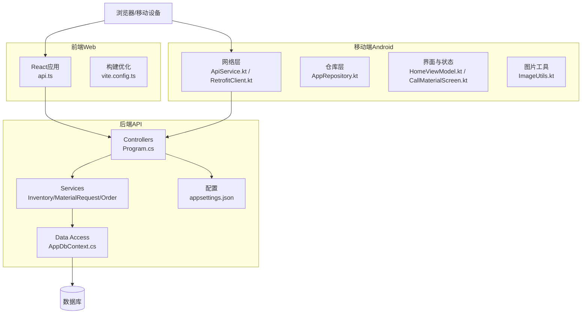
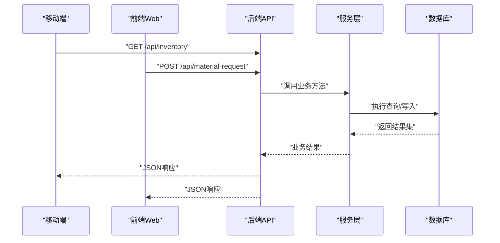
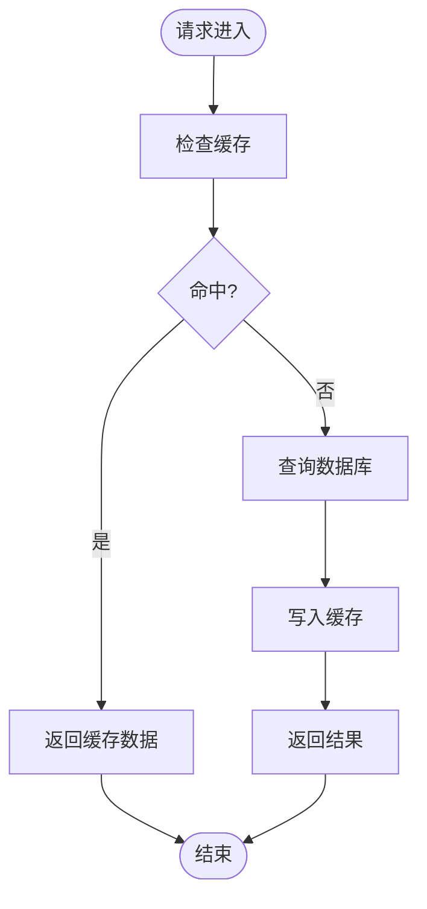
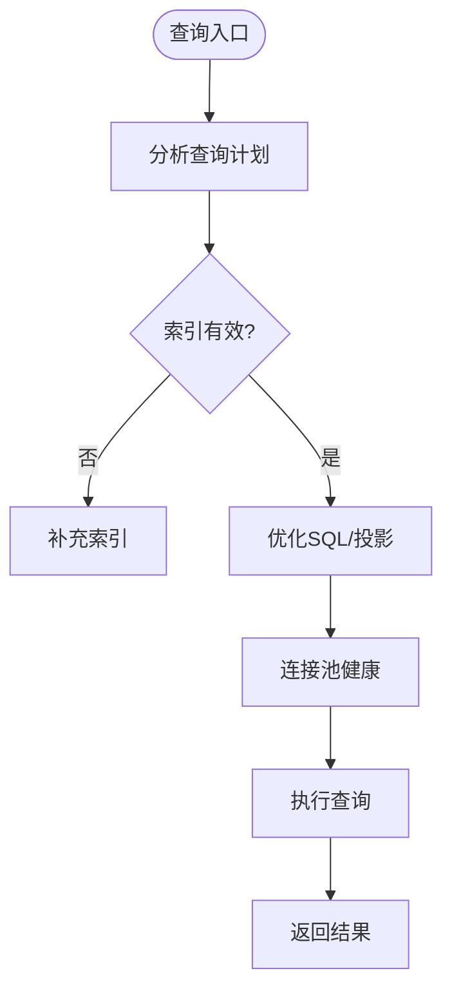
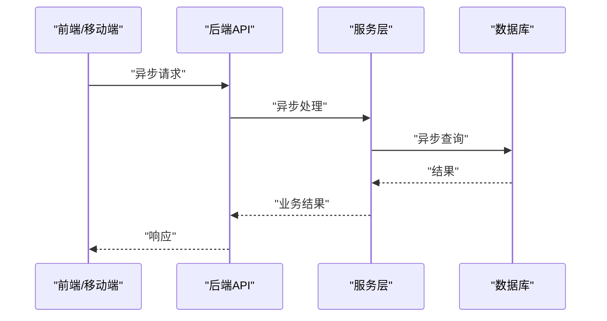
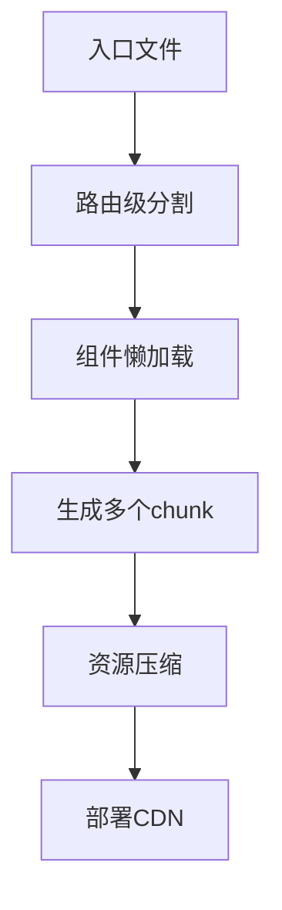
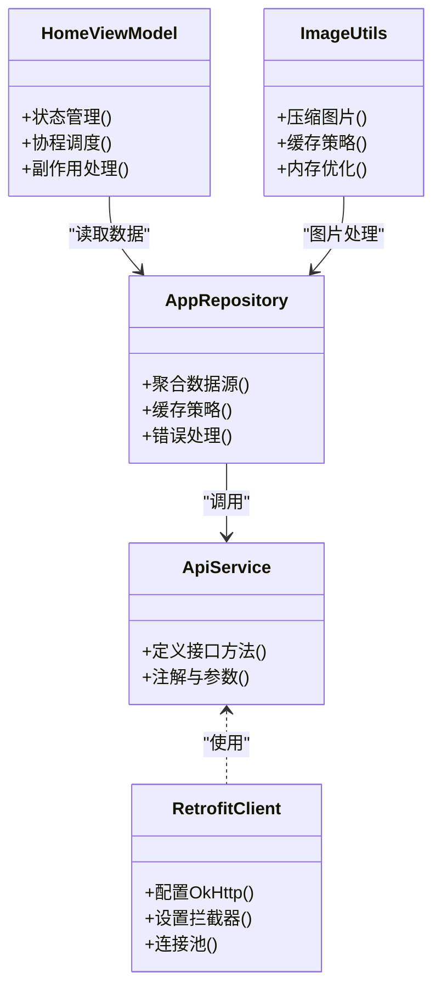
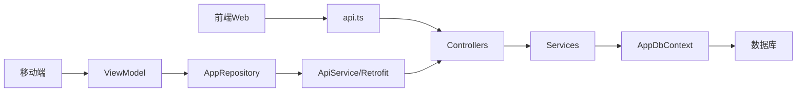

# 性能架构

<cite>
**本文引用的文件**   
- [Program.cs](file://dip-system/api/Program.cs)
- [appsettings.json](file://dip-system/api/appsettings.json)
- [AppDbContext.cs](file://dip-system/api/Data/AppDbContext.cs)
- [InventoryService.cs](file://dip-system/api/Services/InventoryService.cs)
- [MaterialRequestService.cs](file://dip-system/api/Services/MaterialRequestService.cs)
- [OrderService.cs](file://dip-system/api/Services/OrderService.cs)
- [api.ts](file://dip-system/frontend-web/src/lib/api.ts)
- [vite.config.ts](file://dip-system/frontend-web/vite.config.ts)
- [ApiService.kt](file://mobile-android/app/src/main/java/com/dip/material/data/network/ApiService.kt)
- [RetrofitClient.kt](file://mobile-android/app/src/main/java/com/dip/material/data/network/RetrofitClient.kt)
- [AppRepository.kt](file://mobile-android/app/src/main/java/com/dip/material/data/repository/AppRepository.kt)
- [HomeViewModel.kt](file://mobile-android/app/src/main/java/com/dip/material/ui/home/HomeViewModel.kt)
- [CallMaterialScreen.kt](file://mobile-android/app/src/main/java/com/dip/material/ui/callmaterial/CallMaterialScreen.kt)
- [ImageUtils.kt](file://mobile-android/app/src/main/java/com/dip/material/utils/ImageUtils.kt)
- [init-db.sql](file://scripts/init-db.sql)
</cite>

## 目录
1. [简介](#简介)
2. [项目结构](#项目结构)
3. [核心组件](#核心组件)
4. [架构总览](#架构总览)
5. [详细组件分析](#详细组件分析)
6. [依赖关系分析](#依赖关系分析)
7. [性能考量](#性能考量)
8. [故障排查指南](#故障排查指南)
9. [结论](#结论)
10. [附录](#附录)

## 简介
本性能架构文档面向DIP物料管理系统，围绕缓存策略、数据库查询优化、异步与并发控制、前端与移动端性能优化、监控与基准测试以及调优最佳实践进行系统化说明。目标是帮助读者理解系统在高并发、低延迟场景下的设计与实现要点，并提供可操作的优化建议。

## 项目结构
系统由三部分组成：
- 后端API（ASP.NET Core）：提供REST接口、业务服务、数据访问与配置管理。
- 前端Web（React + Vite）：页面路由、状态管理、网络请求与构建优化。
- 移动端Android（Kotlin + Jetpack Compose）：网络层、仓库模式、UI与ViewModel、图片与扫描工具。

**图表来源** 
- [Program.cs:1-200](file://dip-system/api/Program.cs#L1-L200)
- [appsettings.json:1-200](file://dip-system/api/appsettings.json#L1-L200)
- [AppDbContext.cs:1-200](file://dip-system/api/Data/AppDbContext.cs#L1-L200)
- [api.ts:1-200](file://dip-system/frontend-web/src/lib/api.ts#L1-L200)
- [vite.config.ts:1-200](file://dip-system/frontend-web/vite.config.ts#L1-L200)
- [ApiService.kt:1-200](file://mobile-android/app/src/main/java/com/dip/material/data/network/ApiService.kt#L1-L200)
- [RetrofitClient.kt:1-200](file://mobile-android/app/src/main/java/com/dip/material/data/network/RetrofitClient.kt#L1-L200)
- [AppRepository.kt:1-200](file://mobile-android/app/src/main/java/com/dip/material/data/repository/AppRepository.kt#L1-L200)
- [HomeViewModel.kt:1-200](file://mobile-android/app/src/main/java/com/dip/material/ui/home/HomeViewModel.kt#L1-L200)
- [CallMaterialScreen.kt:1-200](file://mobile-android/app/src/main/java/com/dip/material/ui/callmaterial/CallMaterialScreen.kt#L1-L200)
- [ImageUtils.kt:1-200](file://mobile-android/app/src/main/java/com/dip/material/utils/ImageUtils.kt#L1-L200)

**章节来源**
- [Program.cs:1-200](file://dip-system/api/Program.cs#L1-L200)
- [appsettings.json:1-200](file://dip-system/api/appsettings.json#L1-L200)
- [AppDbContext.cs:1-200](file://dip-system/api/Data/AppDbContext.cs#L1-L200)
- [api.ts:1-200](file://dip-system/frontend-web/src/lib/api.ts#L1-L200)
- [vite.config.ts:1-200](file://dip-system/frontend-web/vite.config.ts#L1-L200)
- [ApiService.kt:1-200](file://mobile-android/app/src/main/java/com/dip/material/data/network/ApiService.kt#L1-L200)
- [RetrofitClient.kt:1-200](file://mobile-android/app/src/main/java/com/dip/material/data/network/RetrofitClient.kt#L1-L200)
- [AppRepository.kt:1-200](file://mobile-android/app/src/main/java/com/dip/material/data/repository/AppRepository.kt#L1-L200)
- [HomeViewModel.kt:1-200](file://mobile-android/app/src/main/java/com/dip/material/ui/home/HomeViewModel.kt#L1-L200)
- [CallMaterialScreen.kt:1-200](file://mobile-android/app/src/main/java/com/dip/material/ui/callmaterial/CallMaterialScreen.kt#L1-L200)
- [ImageUtils.kt:1-200](file://mobile-android/app/src/main/java/com/dip/material/utils/ImageUtils.kt#L1-L200)

## 核心组件
- 后端API服务：通过Program.cs注册中间件、控制器与服务；使用AppDbContext进行EF Core数据访问；在Services层封装业务逻辑（库存、物料需求、订单等）。
- 前端Web：通过api.ts统一发起HTTP请求，结合Vite构建优化（代码分割、资源压缩）。
- 移动端Android：通过ApiService.kt定义接口，RetrofitClient.kt配置客户端（连接池、超时、拦截器），AppRepository.kt聚合数据源，ViewModel管理状态并执行异步任务，UI层调用。

**章节来源**
- [Program.cs:1-200](file://dip-system/api/Program.cs#L1-L200)
- [InventoryService.cs:1-200](file://dip-system/api/Services/InventoryService.cs#L1-L200)
- [MaterialRequestService.cs:1-200](file://dip-system/api/Services/MaterialRequestService.cs#L1-L200)
- [OrderService.cs:1-200](file://dip-system/api/Services/OrderService.cs#L1-L200)
- [api.ts:1-200](file://dip-system/frontend-web/src/lib/api.ts#L1-L200)
- [vite.config.ts:1-200](file://dip-system/frontend-web/vite.config.ts#L1-L200)
- [ApiService.kt:1-200](file://mobile-android/app/src/main/java/com/dip/material/data/network/ApiService.kt#L1-L200)
- [RetrofitClient.kt:1-200](file://mobile-android/app/src/main/java/com/dip/material/data/network/RetrofitClient.kt#L1-L200)
- [AppRepository.kt:1-200](file://mobile-android/app/src/main/java/com/dip/material/data/repository/AppRepository.kt#L1-L200)

## 架构总览
整体采用前后端分离架构，移动端与Web均通过HTTP访问后端API。后端以ASP.NET Core为核心，EF Core作为ORM，数据库为SQL Server（或兼容引擎）。关键流程包括：
- 请求进入控制器，交由服务层处理，必要时访问数据库。
- 前端与移动端对热点数据进行本地缓存与去抖，减少重复请求。
- 构建阶段进行代码分割与资源压缩，提升加载速度。

**图表来源** 
- [Program.cs:1-200](file://dip-system/api/Program.cs#L1-L200)
- [InventoryService.cs:1-200](file://dip-system/api/Services/InventoryService.cs#L1-L200)
- [MaterialRequestService.cs:1-200](file://dip-system/api/Services/MaterialRequestService.cs#L1-L200)
- [AppDbContext.cs:1-200](file://dip-system/api/Data/AppDbContext.cs#L1-L200)

## 详细组件分析

### 缓存策略设计（内存缓存与分布式缓存）
- 内存缓存：适用于热点读多写少的数据（如字典、配置、短时效的库存快照）。可在服务层使用IMemoryCache进行键值存储，设置过期时间与淘汰策略。
- 分布式缓存：适用于跨实例共享的热点数据（如全局库存、用户会话、验证码）。可使用Redis等，注意序列化与一致性策略。
- 缓存失效与更新：采用写扩散或懒加载策略，确保数据一致性；对批量更新事件触发缓存失效。
- 配置建议：根据QPS与命中率调整缓存大小与TTL；监控缓存命中与淘汰指标。

**图表来源** 
- [InventoryService.cs:1-200](file://dip-system/api/Services/InventoryService.cs#L1-L200)
- [MaterialRequestService.cs:1-200](file://dip-system/api/Services/MaterialRequestService.cs#L1-L200)

**章节来源**
- [InventoryService.cs:1-200](file://dip-system/api/Services/InventoryService.cs#L1-L200)
- [MaterialRequestService.cs:1-200](file://dip-system/api/Services/MaterialRequestService.cs#L1-L200)

### 数据库查询优化（索引、查询、连接池）
- 索引设计：针对高频过滤与排序字段建立合适索引；避免过度索引导致写入性能下降。
- 查询优化：使用投影只取必要字段；避免N+1查询；合理使用分页与游标。
- 连接池配置：合理设置最大连接数与超时时间，避免连接耗尽；监控慢查询与锁等待。
- EF Core最佳实践：启用AsNoTracking用于只读查询；使用CompiledQuery提升热点查询性能。

**图表来源** 
- [AppDbContext.cs:1-200](file://dip-system/api/Data/AppDbContext.cs#L1-L200)
- [init-db.sql:1-200](file://scripts/init-db.sql#L1-L200)

**章节来源**
- [AppDbContext.cs:1-200](file://dip-system/api/Data/AppDbContext.cs#L1-L200)
- [init-db.sql:1-200](file://scripts/init-db.sql#L1-L200)

### 异步处理与并发控制机制
- 后端：使用异步控制器与方法（async/await）提高吞吐；对CPU密集任务使用线程池或后台作业；对I/O密集任务避免阻塞线程。
- 前端：使用Promise与AbortController取消重复请求；对列表滚动与搜索进行防抖与节流。
- 移动端：使用协程与Flow进行异步数据处理；避免在主线程执行耗时操作；合理设置重试与退避策略。

**图表来源** 
- [api.ts:1-200](file://dip-system/frontend-web/src/lib/api.ts#L1-L200)
- [ApiService.kt:1-200](file://mobile-android/app/src/main/java/com/dip/material/data/network/ApiService.kt#L1-200)
- [RetrofitClient.kt:1-200](file://mobile-android/app/src/main/java/com/dip/material/data/network/RetrofitClient.kt#L1-200)
- [AppRepository.kt:1-200](file://mobile-android/app/src/main/java/com/dip/material/data/repository/AppRepository.kt#L1-200)

**章节来源**
- [api.ts:1-200](file://dip-system/frontend-web/src/lib/api.ts#L1-200)
- [ApiService.kt:1-200](file://mobile-android/app/src/main/java/com/dip/material/data/network/ApiService.kt#L1-200)
- [RetrofitClient.kt:1-200](file://mobile-android/app/src/main/java/com/dip/material/data/network/RetrofitClient.kt#L1-200)
- [AppRepository.kt:1-200](file://mobile-android/app/src/main/java/com/dip/material/data/repository/AppRepository.kt#L1-200)

### 前端性能优化（代码分割、懒加载、资源压缩）
- 代码分割：按路由或功能模块拆分bundle，减少首屏体积。
- 懒加载：按需加载组件与数据，降低初始渲染压力。
- 资源压缩：启用Gzip/Brotli压缩，优化图片与字体资源。
- 构建配置：通过Vite插件与配置项优化打包产物。

**图表来源** 
- [vite.config.ts:1-200](file://dip-system/frontend-web/vite.config.ts#L1-200)
- [api.ts:1-200](file://dip-system/frontend-web/src/lib/api.ts#L1-200)

**章节来源**
- [vite.config.ts:1-200](file://dip-system/frontend-web/vite.config.ts#L1-200)
- [api.ts:1-200](file://dip-system/frontend-web/src/lib/api.ts#L1-200)

### 移动端性能优化（网络、图片、内存）
- 网络请求优化：合理设置超时与重试；使用连接池与HTTP/2；对大列表使用分页与虚拟滚动。
- 图片加载优化：使用缩略图与占位图；按需解码与缓存；避免OOM。
- 内存管理：及时释放Bitmap与流；避免持有长生命周期引用；使用弱引用与清理策略。

**图表来源** 
- [ApiService.kt:1-200](file://mobile-android/app/src/main/java/com/dip/material/data/network/ApiService.kt#L1-200)
- [RetrofitClient.kt:1-200](file://mobile-android/app/src/main/java/com/dip/material/data/network/RetrofitClient.kt#L1-200)
- [AppRepository.kt:1-200](file://mobile-android/app/src/main/java/com/dip/material/data/repository/AppRepository.kt#L1-200)
- [HomeViewModel.kt:1-200](file://mobile-android/app/src/main/java/com/dip/material/ui/home/HomeViewModel.kt#L1-200)
- [ImageUtils.kt:1-200](file://mobile-android/app/src/main/java/com/dip/material/utils/ImageUtils.kt#L1-200)

**章节来源**
- [ApiService.kt:1-200](file://mobile-android/app/src/main/java/com/dip/material/data/network/ApiService.kt#L1-200)
- [RetrofitClient.kt:1-200](file://mobile-android/app/src/main/java/com/dip/material/data/network/RetrofitClient.kt#L1-200)
- [AppRepository.kt:1-200](file://mobile-android/app/src/main/java/com/dip/material/data/repository/AppRepository.kt#L1-200)
- [HomeViewModel.kt:1-200](file://mobile-android/app/src/main/java/com/dip/material/ui/home/HomeViewModel.kt#L1-200)
- [ImageUtils.kt:1-200](file://mobile-android/app/src/main/java/com/dip/material/utils/ImageUtils.kt#L1-200)

## 依赖关系分析
- 后端依赖：控制器依赖服务层，服务层依赖数据上下文与数据库。
- 前端依赖：页面组件依赖api.ts进行网络请求，构建依赖vite.config.ts。
- 移动端依赖：UI层依赖ViewModel，ViewModel依赖Repository，Repository依赖网络层与缓存。

**图表来源** 
- [Program.cs:1-200](file://dip-system/api/Program.cs#L1-200)
- [InventoryService.cs:1-200](file://dip-system/api/Services/InventoryService.cs#L1-200)
- [AppDbContext.cs:1-200](file://dip-system/api/Data/AppDbContext.cs#L1-200)
- [api.ts:1-200](file://dip-system/frontend-web/src/lib/api.ts#L1-200)
- [ApiService.kt:1-200](file://mobile-android/app/src/main/java/com/dip/material/data/network/ApiService.kt#L1-200)
- [RetrofitClient.kt:1-200](file://mobile-android/app/src/main/java/com/dip/material/data/network/RetrofitClient.kt#L1-200)
- [AppRepository.kt:1-200](file://mobile-android/app/src/main/java/com/dip/material/data/repository/AppRepository.kt#L1-200)
- [HomeViewModel.kt:1-200](file://mobile-android/app/src/main/java/com/dip/material/ui/home/HomeViewModel.kt#L1-200)

**章节来源**
- [Program.cs:1-200](file://dip-system/api/Program.cs#L1-200)
- [InventoryService.cs:1-200](file://dip-system/api/Services/InventoryService.cs#L1-200)
- [AppDbContext.cs:1-200](file://dip-system/api/Data/AppDbContext.cs#L1-200)
- [api.ts:1-200](file://dip-system/frontend-web/src/lib/api.ts#L1-200)
- [ApiService.kt:1-200](file://mobile-android/app/src/main/java/com/dip/material/data/network/ApiService.kt#L1-200)
- [RetrofitClient.kt:1-200](file://mobile-android/app/src/main/java/com/dip/material/data/network/RetrofitClient.kt#L1-200)
- [AppRepository.kt:1-200](file://mobile-android/app/src/main/java/com/dip/material/data/repository/AppRepository.kt#L1-200)
- [HomeViewModel.kt:1-200](file://mobile-android/app/src/main/java/com/dip/material/ui/home/HomeViewModel.kt#L1-200)

## 性能考量
- 缓存命中率与淘汰率：监控热点数据的缓存效果，调整TTL与容量。
- 数据库慢查询：定期分析执行计划，优化索引与SQL。
- 连接池与线程池：避免连接泄漏与线程饥饿，合理设置上限与超时。
- 前端包体与加载时间：监控首屏时间、资源体积与缓存命中。
- 移动端内存与卡顿：监控GC频率、ANR与帧率，优化图片与列表渲染。

[本节为通用指导，不直接分析具体文件]

## 故障排查指南
- 后端异常：查看日志与异常过滤器，定位慢查询与超时问题。
- 前端错误：使用网络面板与错误边界捕获，分析请求失败原因。
- 移动端崩溃：使用崩溃报告与内存分析工具，定位OOM与主线程阻塞。

**章节来源**
- [Program.cs:1-200](file://dip-system/api/Program.cs#L1-200)
- [api.ts:1-200](file://dip-system/frontend-web/src/lib/api.ts#L1-200)
- [AppRepository.kt:1-200](file://mobile-android/app/src/main/java/com/dip/material/data/repository/AppRepository.kt#L1-200)

## 结论
通过合理的缓存策略、数据库优化、异步与并发控制、前端与移动端性能优化，以及完善的监控与基准测试，DIP物料管理系统能够在高并发与复杂业务场景下保持稳定与高效。持续监控与迭代优化是保障性能的关键。

[本节为总结性内容，不直接分析具体文件]

## 附录
- 监控指标：QPS、P95/P99延迟、错误率、缓存命中率、数据库慢查询数量。
- 基准测试：使用压测工具模拟峰值流量，评估系统瓶颈与扩容需求。
- 调优清单：索引覆盖、查询投影、连接池上限、缓存TTL、前端分包、图片压缩。

[本节为补充信息，不直接分析具体文件]