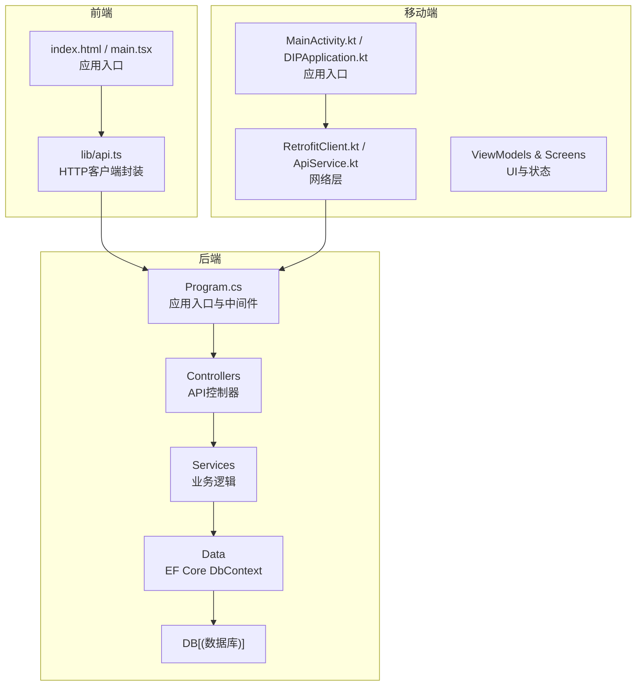
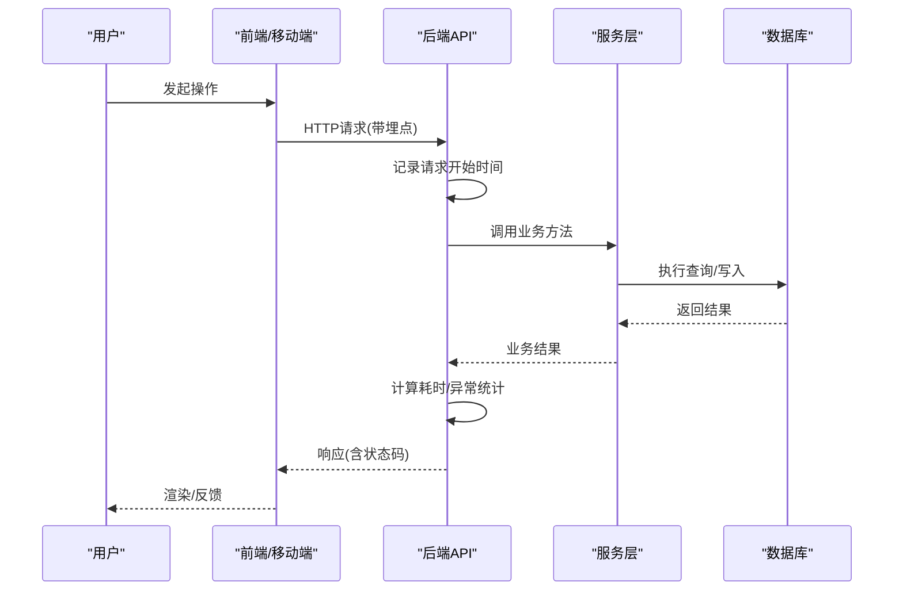
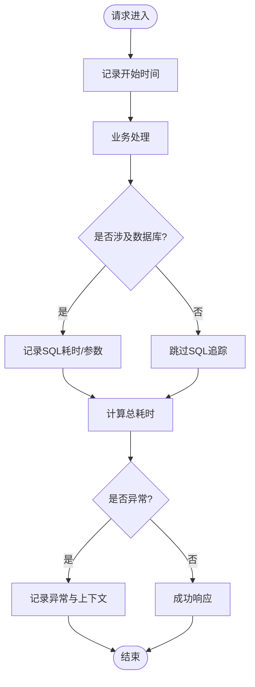
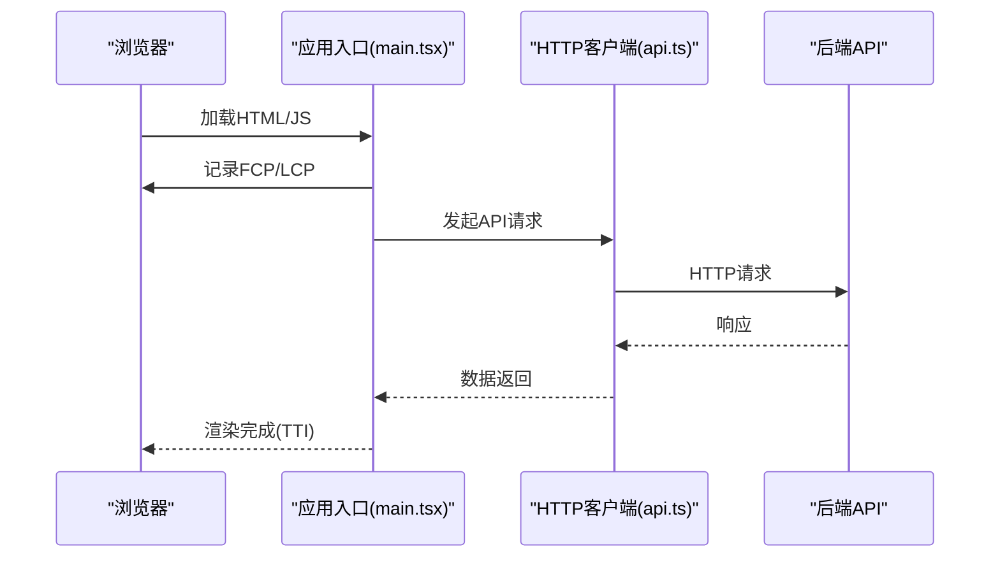
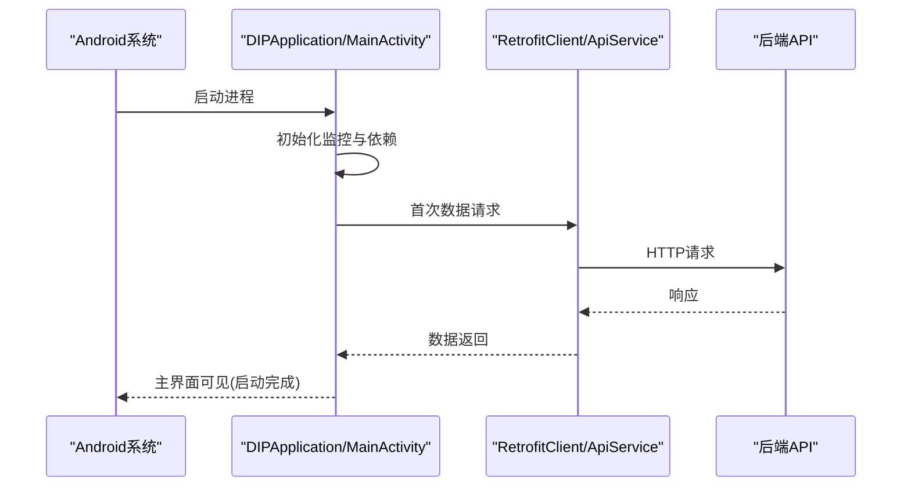
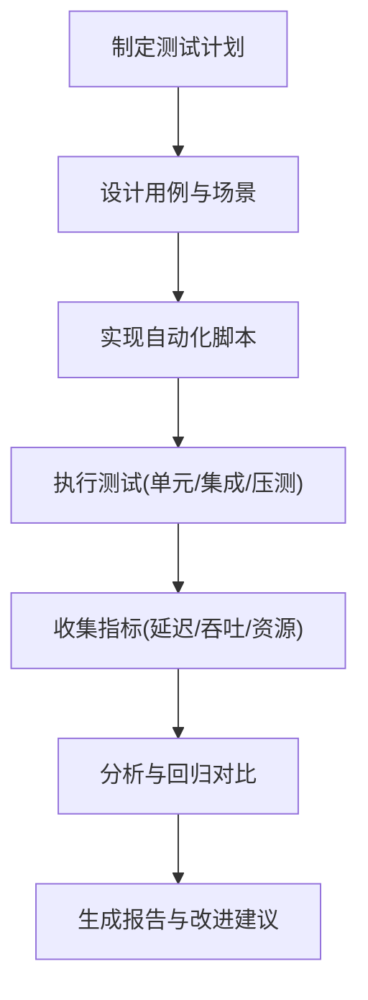
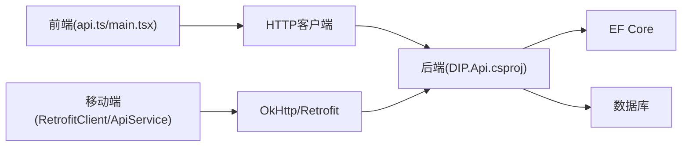

# 性能监控与基准测试

<cite>
**本文引用的文件**   
- [Program.cs](file://dip-system/api/Program.cs)
- [AppExceptionFilter.cs](file://dip-system/api/Controllers/AppExceptionFilter.cs)
- [DIP.Api.csproj](file://dip-system/api/DIP.Api.csproj)
- [appsettings.json](file://dip-system/api/appsettings.json)
- [ApiService.kt](file://mobile-android/app/src/main/java/com/dip/material/data/network/ApiService.kt)
- [RetrofitClient.kt](file://mobile-android/app/src/main/java/com/dip/material/data/network/RetrofitClient.kt)
- [AuthInterceptor.kt](file://mobile-android/app/src/main/java/com/dip/material/data/network/AuthInterceptor.kt)
- [CallMaterialViewModel.kt](file://mobile-android/app/src/main/java/com/dip/material/ui/callmaterial/CallMaterialViewModel.kt)
- [HomeScreen.kt](file://mobile-android/app/src/main/java/com/dip/material/ui/home/HomeScreen.kt)
- [MainActivity.kt](file://mobile-android/app/src/main/java/com/dip/material/MainActivity.kt)
- [DIPApplication.kt](file://mobile-android/app/src/main/java/com/dip/material/DIPApplication.kt)
- [index.html](file://dip-system/frontend-web/index.html)
- [main.tsx](file://dip-system/frontend-web/src/main.tsx)
- [api.ts](file://dip-system/frontend-web/src/lib/api.ts)
</cite>

## 目录
1. [简介](#简介)
2. [项目结构](#项目结构)
3. [核心组件](#核心组件)
4. [架构总览](#架构总览)
5. [详细组件分析](#详细组件分析)
6. [依赖关系分析](#依赖关系分析)
7. [性能考量](#性能考量)
8. [故障排查指南](#故障排查指南)
9. [结论](#结论)
10. [附录](#附录)

## 简介
本文件为DIP物料管理系统的性能监控与基准测试指南，覆盖后端、前端与移动端的性能指标采集、基准测试框架设计与告警策略。目标是帮助团队建立可观测性体系，持续优化API响应时间、数据库查询性能、内存使用与页面/应用启动体验，并通过统一的基准测试保障质量。

## 项目结构
系统由三部分组成：
- 后端（ASP.NET Core）：提供REST API、数据访问与中间件管道。
- 前端（Web SPA）：基于React/Vite构建，调用后端API。
- 移动端（Android/Kotlin）：基于Jetpack Compose与Retrofit访问后端API。

**图表来源** 
- [Program.cs](file://dip-system/api/Program.cs)
- [ApiService.kt](file://mobile-android/app/src/main/java/com/dip/material/data/network/ApiService.kt)
- [RetrofitClient.kt](file://mobile-android/app/src/main/java/com/dip/material/data/network/RetrofitClient.kt)
- [index.html](file://dip-system/frontend-web/index.html)
- [main.tsx](file://dip-system/frontend-web/src/main.tsx)

**章节来源**
- [Program.cs](file://dip-system/api/Program.cs)
- [DIP.Api.csproj](file://dip-system/api/DIP.Api.csproj)
- [index.html](file://dip-system/frontend-web/index.html)
- [main.tsx](file://dip-system/frontend-web/src/main.tsx)
- [ApiService.kt](file://mobile-android/app/src/main/java/com/dip/material/data/network/ApiService.kt)
- [RetrofitClient.kt](file://mobile-android/app/src/main/java/com/dip/material/data/network/RetrofitClient.kt)

## 核心组件
- 后端中间件与异常处理：用于统一请求耗时统计、错误捕获与标准化响应。
- 前端HTTP客户端：封装请求拦截、重试与基础计时埋点。
- 移动端网络层：Retrofit + OkHttp拦截器，支持鉴权、日志与性能埋点。
- 应用入口：前后端与移动端入口负责初始化监控SDK与全局配置。

**章节来源**
- [AppExceptionFilter.cs](file://dip-system/api/Controllers/AppExceptionFilter.cs)
- [api.ts](file://dip-system/frontend-web/src/lib/api.ts)
- [RetrofitClient.kt](file://mobile-android/app/src/main/java/com/dip/material/data/network/RetrofitClient.kt)
- [ApiService.kt](file://mobile-android/app/src/main/java/com/dip/material/data/network/ApiService.kt)
- [Program.cs](file://dip-system/api/Program.cs)

## 架构总览
下图展示从用户到数据库的完整链路，标注了关键性能监控点（请求开始/结束、SQL执行、缓存命中等）。

**图表来源** 
- [Program.cs](file://dip-system/api/Program.cs)
- [ApiService.kt](file://mobile-android/app/src/main/java/com/dip/material/data/network/ApiService.kt)
- [RetrofitClient.kt](file://mobile-android/app/src/main/java/com/dip/material/data/network/RetrofitClient.kt)
- [api.ts](file://dip-system/frontend-web/src/lib/api.ts)

## 详细组件分析

### 后端性能监控
- API响应时间监控
  - 在中间件或过滤器中记录请求开始/结束时间，按路由与方法维度聚合P50/P95/P99。
  - 结合异常过滤器统一捕获异常并记录堆栈与上下文。
- 数据库查询性能分析
  - 启用EF Core诊断事件，收集慢查询、连接池等待与命令执行时长。
  - 对热点查询添加索引与分页，避免N+1问题。
- 内存使用情况监控
  - 采集GC次数、堆大小、对象分配速率；识别大对象与泄漏风险。
  - 针对高并发接口引入合理的缓存与对象池。

**图表来源** 
- [Program.cs](file://dip-system/api/Program.cs)
- [AppExceptionFilter.cs](file://dip-system/api/Controllers/AppExceptionFilter.cs)

**章节来源**
- [Program.cs](file://dip-system/api/Program.cs)
- [AppExceptionFilter.cs](file://dip-system/api/Controllers/AppExceptionFilter.cs)
- [DIP.Api.csproj](file://dip-system/api/DIP.Api.csproj)
- [appsettings.json](file://dip-system/api/appsettings.json)

### 前端性能监控
- 页面加载时间
  - 使用Performance API测量FCP/LCP/TTFB，上报至监控平台。
- 交互响应时间
  - 对按钮点击、表单提交等操作打点，统计首帧延迟与输入到响应时间。
- 资源加载性能
  - 监控JS/CSS/图片资源大小与加载耗时，启用Gzip/Brotli与CDN缓存。

**图表来源** 
- [main.tsx](file://dip-system/frontend-web/src/main.tsx)
- [api.ts](file://dip-system/frontend-web/src/lib/api.ts)

**章节来源**
- [index.html](file://dip-system/frontend-web/index.html)
- [main.tsx](file://dip-system/frontend-web/src/main.tsx)
- [api.ts](file://dip-system/frontend-web/src/lib/api.ts)

### 移动端性能监控
- 应用启动时间
  - 记录从进程创建到主界面可见的时间，区分冷/热启动。
- 内存占用
  - 监控RSS、堆内存与GC行为，避免大图与频繁对象分配。
- CPU使用率
  - 通过系统API采样CPU使用率，定位卡顿与阻塞线程。

**图表来源** 
- [DIPApplication.kt](file://mobile-android/app/src/main/java/com/dip/material/DIPApplication.kt)
- [MainActivity.kt](file://mobile-android/app/src/main/java/com/dip/material/MainActivity.kt)
- [RetrofitClient.kt](file://mobile-android/app/src/main/java/com/dip/material/data/network/RetrofitClient.kt)
- [ApiService.kt](file://mobile-android/app/src/main/java/com/dip/material/data/network/ApiService.kt)

**章节来源**
- [MainActivity.kt](file://mobile-android/app/src/main/java/com/dip/material/MainActivity.kt)
- [DIPApplication.kt](file://mobile-android/app/src/main/java/com/dip/material/DIPApplication.kt)
- [RetrofitClient.kt](file://mobile-android/app/src/main/java/com/dip/material/data/network/RetrofitClient.kt)
- [ApiService.kt](file://mobile-android/app/src/main/java/com/dip/material/data/network/ApiService.kt)

### 基准测试框架
- 单元测试性能测试
  - 对关键算法与服务方法进行微基准测试，关注CPU与内存分配。
- 集成测试
  - 使用内存数据库或测试容器模拟真实环境，验证端到端流程与SLA。
- 压力测试
  - 使用JMeter/k6/Gatling模拟多用户并发，评估吞吐、延迟与资源利用率。

[此图为概念流程图，不直接映射具体代码文件]

## 依赖关系分析
- 后端依赖：ASP.NET Core运行时、EF Core、数据库驱动、监控SDK。
- 前端依赖：React/Vite、HTTP客户端库、性能监控SDK。
- 移动端依赖：Kotlin、Compose、Retrofit/OkHttp、系统监控API。

**图表来源** 
- [DIP.Api.csproj](file://dip-system/api/DIP.Api.csproj)
- [api.ts](file://dip-system/frontend-web/src/lib/api.ts)
- [RetrofitClient.kt](file://mobile-android/app/src/main/java/com/dip/material/data/network/RetrofitClient.kt)
- [ApiService.kt](file://mobile-android/app/src/main/java/com/dip/material/data/network/ApiService.kt)

**章节来源**
- [DIP.Api.csproj](file://dip-system/api/DIP.Api.csproj)
- [api.ts](file://dip-system/frontend-web/src/lib/api.ts)
- [RetrofitClient.kt](file://mobile-android/app/src/main/java/com/dip/material/data/network/RetrofitClient.kt)
- [ApiService.kt](file://mobile-android/app/src/main/java/com/dip/material/data/network/ApiService.kt)

## 性能考量
- 后端
  - 接口级限流与熔断，避免雪崩；热点数据缓存与异步化。
  - 数据库连接池调优、慢查询治理、批量操作与事务边界控制。
  - 内存模型优化：减少临时对象、避免装箱拆箱、合理设置GC模式。
- 前端
  - 代码分割与懒加载，减少首屏体积；静态资源压缩与缓存策略。
  - 防抖/节流与虚拟列表，降低渲染开销。
- 移动端
  - 后台任务调度与协程优化，避免主线程阻塞。
  - 图片与音频资源按需加载，使用合适的编码与尺寸。

[本节为通用指导，不直接分析具体文件]

## 故障排查指南
- 后端
  - 查看异常过滤器记录的错误上下文与堆栈；检查中间件耗时分布。
  - 使用数据库诊断工具定位慢查询与锁竞争；观察GC日志与内存峰值。
- 前端
  - 打开浏览器开发者工具，分析Network与Performance面板；检查资源加载失败与跨域问题。
- 移动端
  - 使用Android Studio Profiler观察CPU/内存/网络；检查ANR与主线程阻塞。

**章节来源**
- [AppExceptionFilter.cs](file://dip-system/api/Controllers/AppExceptionFilter.cs)
- [Program.cs](file://dip-system/api/Program.cs)
- [api.ts](file://dip-system/frontend-web/src/lib/api.ts)
- [RetrofitClient.kt](file://mobile-android/app/src/main/java/com/dip/material/data/network/RetrofitClient.kt)
- [ApiService.kt](file://mobile-android/app/src/main/java/com/dip/material/data/network/ApiService.kt)

## 结论
通过在后端、前端与移动端建立统一的性能监控与基准测试体系，可以持续发现瓶颈、量化改进效果并保障上线质量。建议将监控指标纳入CI/CD流水线，配合告警与回滚机制，形成闭环优化。

[本节为总结性内容，不直接分析具体文件]

## 附录
- 指标定义与阈值建议
  - API P95延迟、错误率、数据库慢查询比例、GC停顿时间、页面LCP/TTI、应用冷启动时间。
- 告警策略
  - 基于阈值与趋势检测，触发通知与自动降级；建立故障演练与复盘流程。
- 基准测试模板
  - 提供标准用例模板与报告格式，便于团队复用与对比。

[本节为补充信息，不直接分析具体文件]