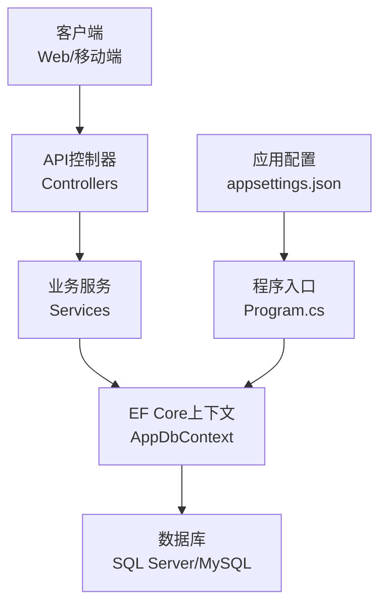
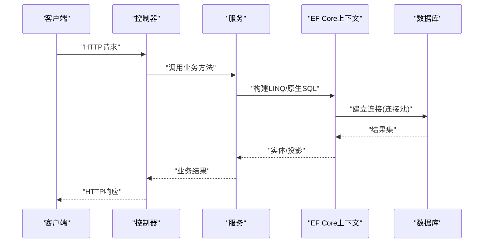
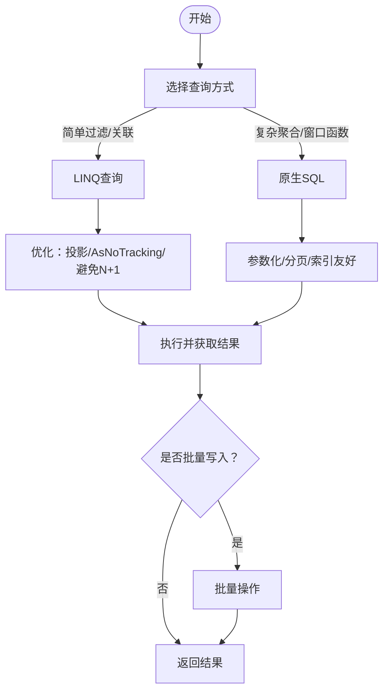
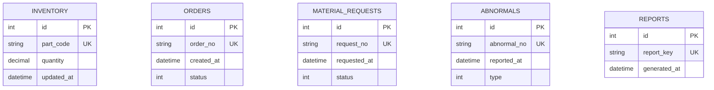
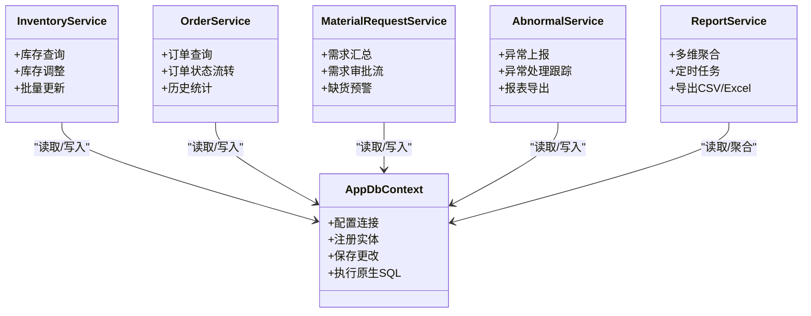

# 数据库优化

<cite>
**本文引用的文件**   
- [Program.cs](file://dip-system/api/Program.cs)
- [AppDbContext.cs](file://dip-system/api/Data/AppDbContext.cs)
- [appsettings.json](file://dip-system/api/appsettings.json)
- [InventoryService.cs](file://dip-system/api/Services/InventoryService.cs)
- [OrderService.cs](file://dip-system/api/Services/OrderService.cs)
- [MaterialRequestService.cs](file://dip-system/api/Services/MaterialRequestService.cs)
- [AbnormalService.cs](file://dip-system/api/Services/AbnormalService.cs)
- [ReportService.cs](file://dip-system/api/Services/ReportService.cs)
- [init-db.sql](file://scripts/init-db.sql)
</cite>

## 目录
1. [简介](#简介)
2. [项目结构](#项目结构)
3. [核心组件](#核心组件)
4. [架构总览](#架构总览)
5. [详细组件分析](#详细组件分析)
6. [依赖关系分析](#依赖关系分析)
7. [性能考虑](#性能考虑)
8. [故障排查指南](#故障排查指南)
9. [结论](#结论)
10. [附录](#附录)

## 简介
本文件面向DIP物料管理系统的数据库优化，聚焦EF Core连接池配置、查询优化技术（LINQ与原生SQL）、批量操作、索引设计策略、慢查询分析与性能监控、以及数据库迁移管理与版本控制。文档基于后端API项目的实际代码与配置进行说明，并提供可操作的实践建议与可视化图示，帮助读者快速定位问题并落地优化措施。

## 项目结构
- API层：Controllers提供HTTP接口，Services封装业务逻辑，Data包含EF Core上下文与模型映射，Models定义实体类。
- 配置文件：appsettings.json用于连接字符串与通用设置；Program.cs负责服务注册与中间件配置。
- 脚本：scripts/init-db.sql用于初始化数据库对象与基础数据。

**图表来源** 
- [Program.cs](file://dip-system/api/Program.cs)
- [AppDbContext.cs](file://dip-system/api/Data/AppDbContext.cs)
- [appsettings.json](file://dip-system/api/appsettings.json)

**章节来源**
- [Program.cs](file://dip-system/api/Program.cs)
- [AppDbContext.cs](file://dip-system/api/Data/AppDbContext.cs)
- [appsettings.json](file://dip-system/api/appsettings.json)

## 核心组件
- EF Core上下文：集中管理连接、事务、变更跟踪与查询执行。
- 服务层：封装领域逻辑，组织查询与写入，协调多个实体的操作。
- 控制器：接收请求、参数校验、调用服务并返回响应。
- 配置：连接字符串、日志级别、超时等关键参数集中管理。

**章节来源**
- [AppDbContext.cs](file://dip-system/api/Data/AppDbContext.cs)
- [InventoryService.cs](file://dip-system/api/Services/InventoryService.cs)
- [OrderService.cs](file://dip-system/api/Services/OrderService.cs)
- [MaterialRequestService.cs](file://dip-system/api/Services/MaterialRequestService.cs)
- [AbnormalService.cs](file://dip-system/api/Services/AbnormalService.cs)
- [ReportService.cs](file://dip-system/api/Services/ReportService.cs)

## 架构总览
下图展示从控制器到服务再到EF Core上下文的典型请求处理流程，强调连接池与查询路径。

**图表来源** 
- [Program.cs](file://dip-system/api/Program.cs)
- [AppDbContext.cs](file://dip-system/api/Data/AppDbContext.cs)

**章节来源**
- [Program.cs](file://dip-system/api/Program.cs)
- [AppDbContext.cs](file://dip-system/api/Data/AppDbContext.cs)

## 详细组件分析

### EF Core连接池配置
- 最大连接数：通过连接字符串的Max Pool Size参数控制，避免连接耗尽导致阻塞。
- 超时设置：Command Timeout与连接超时需合理配置，防止长事务或慢查询占用连接过久。
- 重试机制：在应用层对瞬态错误（如网络抖动、临时锁）实施指数退避重试，提升鲁棒性。
- 最佳实践：
  - 将连接字符串置于安全配置源（环境变量/密钥管理服务）。
  - 使用IHttpClientFactory风格的连接生命周期管理，确保连接复用。
  - 在高并发场景下评估连接池上限与线程池大小的匹配关系。

**章节来源**
- [appsettings.json](file://dip-system/api/appsettings.json)
- [Program.cs](file://dip-system/api/Program.cs)

### 查询优化技术
- LINQ查询优化：
  - 仅选择必要字段，减少数据传输与内存占用。
  - 使用AsNoTracking读取只读数据，降低变更跟踪开销。
  - 避免N+1查询，采用Include或显式Join。
  - 合理使用Where条件顺序，优先过滤高选择性列。
- 原生SQL使用：
  - 复杂聚合、窗口函数、跨库查询时优先使用FromSqlRaw/ExecuteSqlRaw。
  - 参数化查询防注入，避免拼接SQL。
- 批量操作：
  - 插入/更新/删除使用批量扩展（如EFCore.BulkExtensions），减少往返次数。
  - 分批次提交事务，控制单事务大小，避免锁竞争与日志膨胀。

**图表来源** 
- [InventoryService.cs](file://dip-system/api/Services/InventoryService.cs)
- [OrderService.cs](file://dip-system/api/Services/OrderService.cs)
- [MaterialRequestService.cs](file://dip-system/api/Services/MaterialRequestService.cs)
- [AbnormalService.cs](file://dip-system/api/Services/AbnormalService.cs)
- [ReportService.cs](file://dip-system/api/Services/ReportService.cs)

**章节来源**
- [InventoryService.cs](file://dip-system/api/Services/InventoryService.cs)
- [OrderService.cs](file://dip-system/api/Services/OrderService.cs)
- [MaterialRequestService.cs](file://dip-system/api/Services/MaterialRequestService.cs)
- [AbnormalService.cs](file://dip-system/api/Services/AbnormalService.cs)
- [ReportService.cs](file://dip-system/api/Services/ReportService.cs)

### 索引设计策略
- 主键索引：每个表必须定义主键，默认聚簇索引，保证唯一性与高效查找。
- 复合索引：
  - 按查询过滤顺序创建，左前缀原则生效。
  - 覆盖索引：将常用筛选与排序字段纳入索引，避免回表。
- 设计原则：
  - 高频查询优先，低基数列单独建索引收益有限。
  - 避免过多写放大，权衡读写比例。
  - 定期分析缺失索引与重复索引，清理无用索引。

**图表来源** 
- [init-db.sql](file://scripts/init-db.sql)

**章节来源**
- [init-db.sql](file://scripts/init-db.sql)

### 慢查询分析与性能监控
- 分析方法：
  - 启用EF Core日志，记录SQL语句与耗时。
  - 使用数据库端慢查询日志与执行计划分析。
  - 结合APM工具（如Application Insights、OpenTelemetry）追踪端到端延迟。
- 监控指标：
  - 连接池使用率、等待时间、命令超时次数。
  - 查询平均耗时、P95/P99延迟、吞吐。
  - 锁等待、死锁频率、缓冲命中率。
- 优化闭环：
  - 识别热点SQL → 调整索引/改写查询 → 压测验证 → 上线回归。

**章节来源**
- [Program.cs](file://dip-system/api/Program.cs)
- [ReportService.cs](file://dip-system/api/Services/ReportService.cs)

### 数据库迁移管理与版本控制
- 迁移策略：
  - 使用EF Core迁移或数据库原生脚本（如init-db.sql）管理Schema演进。
  - 每次变更生成独立迁移文件，附带回滚脚本。
- 版本控制：
  - 迁移文件纳入Git，配合CI/CD流水线自动应用到目标环境。
  - 生产环境采用灰度发布与回滚预案。
- 最佳实践：
  - 非破坏性变更优先（新增列/索引），破坏性变更分批执行。
  - 数据迁移与结构迁移分离，确保幂等与可重入。

**章节来源**
- [init-db.sql](file://scripts/init-db.sql)
- [Program.cs](file://dip-system/api/Program.cs)

## 依赖关系分析
服务层对EF Core上下文的依赖关系如下，体现查询与写入的职责划分。

**图表来源** 
- [AppDbContext.cs](file://dip-system/api/Data/AppDbContext.cs)
- [InventoryService.cs](file://dip-system/api/Services/InventoryService.cs)
- [OrderService.cs](file://dip-system/api/Services/OrderService.cs)
- [MaterialRequestService.cs](file://dip-system/api/Services/MaterialRequestService.cs)
- [AbnormalService.cs](file://dip-system/api/Services/AbnormalService.cs)
- [ReportService.cs](file://dip-system/api/Services/ReportService.cs)

**章节来源**
- [AppDbContext.cs](file://dip-system/api/Data/AppDbContext.cs)
- [InventoryService.cs](file://dip-system/api/Services/InventoryService.cs)
- [OrderService.cs](file://dip-system/api/Services/OrderService.cs)
- [MaterialRequestService.cs](file://dip-system/api/Services/MaterialRequestService.cs)
- [AbnormalService.cs](file://dip-system/api/Services/AbnormalService.cs)
- [ReportService.cs](file://dip-system/api/Services/ReportService.cs)

## 性能考虑
- 连接池调优：根据并发量与数据库容量设定合适的最大连接数，避免过度连接导致CPU争用。
- 查询优化：投影最小化、避免N+1、合理使用AsNoTracking、分页限制结果集大小。
- 批量写入：合并小事务为大事务，减少锁竞争与日志压力。
- 索引维护：定期重建/重组索引，关注碎片率与统计信息准确性。
- 缓存策略：热点数据使用内存缓存或分布式缓存，减轻数据库压力。
- 监控告警：对慢查询、连接池饱和、超时错误设置阈值告警。

[本节为通用指导，不直接分析具体文件]

## 故障排查指南
- 常见问题：
  - 连接池耗尽：检查最大连接数与未释放连接，确认是否存在长事务或未关闭上下文。
  - 查询超时：定位慢SQL，查看执行计划，补充缺失索引或改写查询。
  - 死锁：分析锁等待链，调整事务边界与访问顺序。
- 诊断步骤：
  - 开启EF Core日志与数据库慢查询日志。
  - 使用执行计划分析热点SQL。
  - 结合APM链路追踪定位瓶颈点。
- 恢复措施：
  - 紧急扩容连接池或限流降级。
  - 回滚有问题的迁移或代码变更。
  - 重启服务释放僵死连接。

**章节来源**
- [Program.cs](file://dip-system/api/Program.cs)
- [ReportService.cs](file://dip-system/api/Services/ReportService.cs)

## 结论
通过对EF Core连接池、查询优化、索引设计与监控迁移的系统化治理，可显著提升DIP物料管理系统的稳定性与性能。建议在生产环境持续采集指标、定期复盘慢查询、完善迁移与回滚流程，形成“发现—优化—验证—发布”的闭环能力。

[本节为总结，不直接分析具体文件]

## 附录
- 术语解释：
  - 连接池：复用数据库连接的机制，减少握手开销。
  - 覆盖索引：查询所需字段全部在索引中，无需回表。
  - N+1查询：一次主查询后多次子查询导致的性能问题。
- 参考资源：
  - EF Core官方文档（连接字符串、日志、批处理）。
  - 数据库厂商慢查询与执行计划工具。
  - APM与可观测性平台集成指南。

[本节为参考资料，不直接分析具体文件]