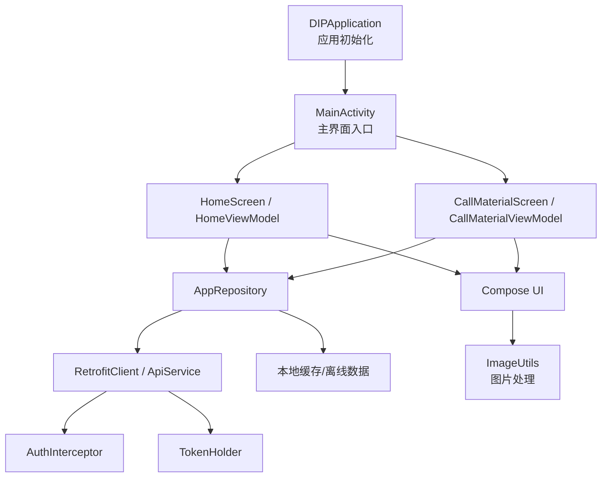
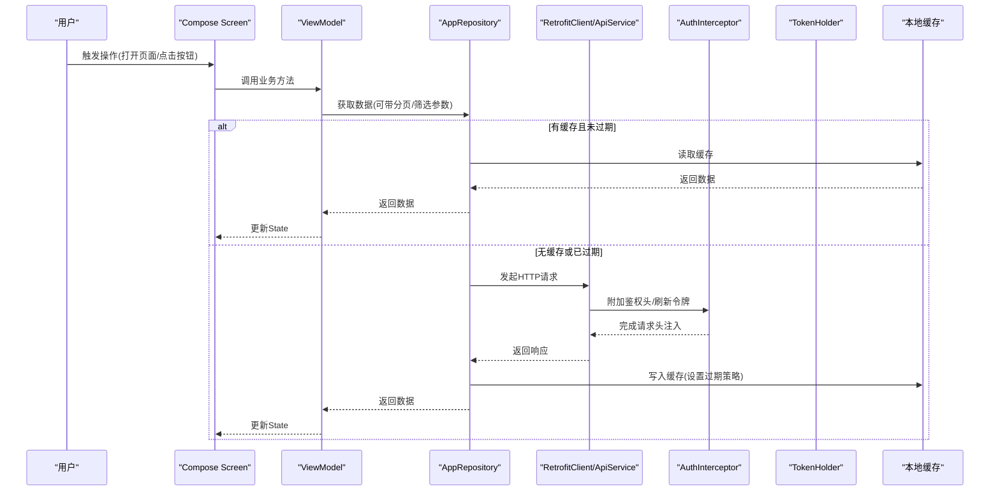
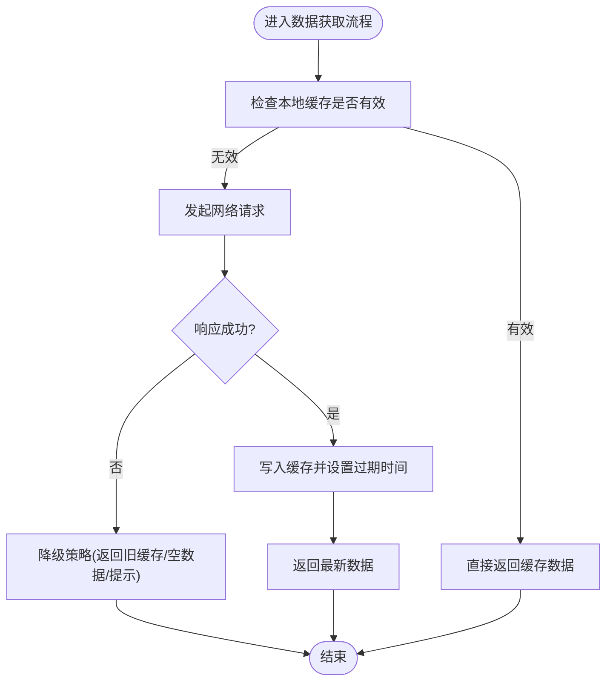
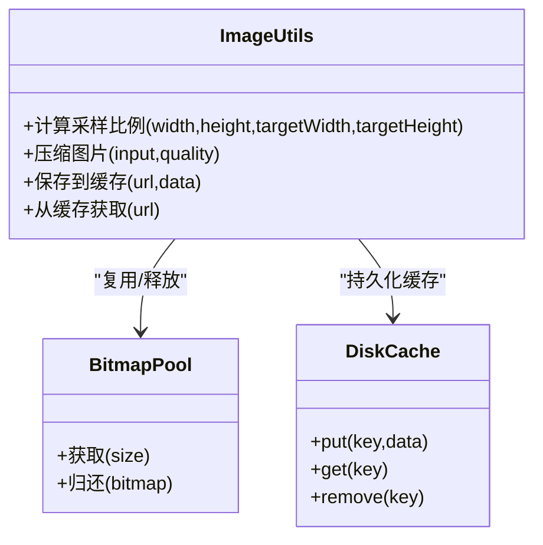
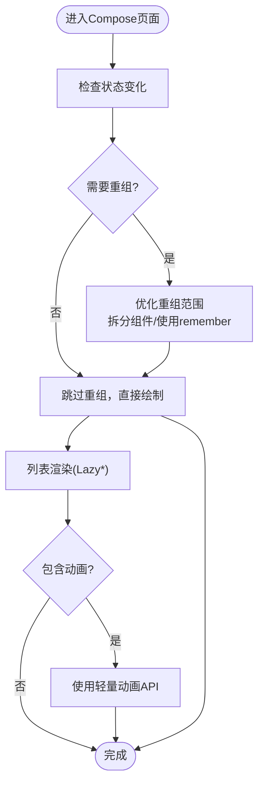
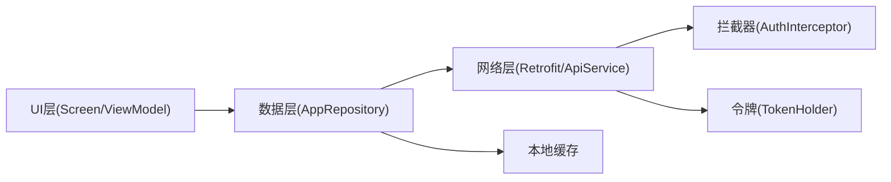

# 移动端性能优化

<cite>
**本文引用的文件**   
- [RetrofitClient.kt](file://mobile-android/app/src/main/java/com/dip/material/data/network/RetrofitClient.kt)
- [ApiService.kt](file://mobile-android/app/src/main/java/com/dip/material/data/network/ApiService.kt)
- [AuthInterceptor.kt](file://mobile-android/app/src/main/java/com/dip/material/data/network/AuthInterceptor.kt)
- [TokenHolder.kt](file://mobile-android/app/src/main/java/com/dip/material/data/network/TokenHolder.kt)
- [AppRepository.kt](file://mobile-android/app/src/main/java/com/dip/material/data/repository/AppRepository.kt)
- [CallMaterialScreen.kt](file://mobile-android/app/src/main/java/com/dip/material/ui/callmaterial/CallMaterialScreen.kt)
- [CallMaterialViewModel.kt](file://mobile-android/app/src/main/java/com/dip/material/ui/callmaterial/CallMaterialViewModel.kt)
- [HomeScreen.kt](file://mobile-android/app/src/main/java/com/dip/material/ui/home/HomeScreen.kt)
- [HomeViewModel.kt](file://mobile-android/app/src/main/java/com/dip/material/ui/home/HomeViewModel.kt)
- [ImageUtils.kt](file://mobile-android/app/src/main/java/com/dip/material/utils/ImageUtils.kt)
- [DIPApplication.kt](file://mobile-android/app/src/main/java/com/dip/material/DIPApplication.kt)
- [MainActivity.kt](file://mobile-android/app/src/main/java/com/dip/material/MainActivity.kt)
- [build.gradle.kts](file://mobile-android/app/build.gradle.kts)
</cite>

## 目录
1. [简介](#简介)
2. [项目结构](#项目结构)
3. [核心组件](#核心组件)
4. [架构总览](#架构总览)
5. [详细组件分析](#详细组件分析)
6. [依赖关系分析](#依赖关系分析)
7. [性能考量](#性能考量)
8. [故障排查指南](#故障排查指南)
9. [结论](#结论)
10. [附录](#附录)

## 简介
本文件面向DIP物料管理系统Android应用的性能优化，覆盖以下关键领域：
- 网络请求优化：Retrofit配置、请求缓存、离线数据处理
- 图片加载优化：图片压缩、内存管理、缓存策略
- UI渲染优化：Jetpack Compose性能、列表优化、动画性能
- 内存管理策略：内存泄漏检测、垃圾回收优化、大对象处理
- 电池优化与应用启动速度提升技巧

目标是在保证功能正确性的前提下，降低时延与功耗、减少卡顿与掉帧、提高冷/热启动速度与整体流畅度。

## 项目结构
Android端采用MVVM + Jetpack Compose架构，网络层基于Retrofit，数据仓库统一封装，UI以Compose页面+ViewModel组织。关键路径包括：
- 应用入口与初始化：DIPApplication、MainActivity
- 网络层：RetrofitClient、ApiService、AuthInterceptor、TokenHolder
- 数据层：AppRepository（聚合网络与本地数据）
- UI层：各功能页的Screen与ViewModel（如CallMaterial、Home等）
- 工具与资源：ImageUtils、构建脚本build.gradle.kts

图表来源
- [DIPApplication.kt](file://mobile-android/app/src/main/java/com/dip/material/DIPApplication.kt)
- [MainActivity.kt](file://mobile-android/app/src/main/java/com/dip/material/MainActivity.kt)
- [HomeScreen.kt](file://mobile-android/app/src/main/java/com/dip/material/ui/home/HomeScreen.kt)
- [HomeViewModel.kt](file://mobile-android/app/src/main/java/com/dip/material/ui/home/HomeViewModel.kt)
- [CallMaterialScreen.kt](file://mobile-android/app/src/main/java/com/dip/material/ui/callmaterial/CallMaterialScreen.kt)
- [CallMaterialViewModel.kt](file://mobile-android/app/src/main/java/com/dip/material/ui/callmaterial/CallMaterialViewModel.kt)
- [AppRepository.kt](file://mobile-android/app/src/main/java/com/dip/material/data/repository/AppRepository.kt)
- [RetrofitClient.kt](file://mobile-android/app/src/main/java/com/dip/material/data/network/RetrofitClient.kt)
- [ApiService.kt](file://mobile-android/app/src/main/java/com/dip/material/data/network/ApiService.kt)
- [AuthInterceptor.kt](file://mobile-android/app/src/main/java/com/dip/material/data/network/AuthInterceptor.kt)
- [TokenHolder.kt](file://mobile-android/app/src/main/java/com/dip/material/data/network/TokenHolder.kt)
- [ImageUtils.kt](file://mobile-android/app/src/main/java/com/dip/material/utils/ImageUtils.kt)

章节来源
- [DIPApplication.kt](file://mobile-android/app/src/main/java/com/dip/material/DIPApplication.kt)
- [MainActivity.kt](file://mobile-android/app/src/main/java/com/dip/material/MainActivity.kt)
- [build.gradle.kts](file://mobile-android/app/build.gradle.kts)

## 核心组件
- 网络层
  - RetrofitClient：集中配置OkHttp、超时、拦截器、序列化、缓存策略
  - ApiService：声明式API接口定义
  - AuthInterceptor：统一附加鉴权头、刷新令牌
  - TokenHolder：令牌生命周期与状态管理
- 数据层
  - AppRepository：协调网络与本地存储，提供统一的业务数据访问
- UI层
  - Screen（Compose）：声明式UI，按需重组
  - ViewModel：持有状态、发起数据请求、暴露StateFlow/State
- 工具
  - ImageUtils：图片尺寸计算、压缩、格式转换

章节来源
- [RetrofitClient.kt](file://mobile-android/app/src/main/java/com/dip/material/data/network/RetrofitClient.kt)
- [ApiService.kt](file://mobile-android/app/src/main/java/com/dip/material/data/network/ApiService.kt)
- [AuthInterceptor.kt](file://mobile-android/app/src/main/java/com/dip/material/data/network/AuthInterceptor.kt)
- [TokenHolder.kt](file://mobile-android/app/src/main/java/com/dip/material/data/network/TokenHolder.kt)
- [AppRepository.kt](file://mobile-android/app/src/main/java/com/dip/material/data/repository/AppRepository.kt)
- [CallMaterialScreen.kt](file://mobile-android/app/src/main/java/com/dip/material/ui/callmaterial/CallMaterialScreen.kt)
- [CallMaterialViewModel.kt](file://mobile-android/app/src/main/java/com/dip/material/ui/callmaterial/CallMaterialViewModel.kt)
- [HomeScreen.kt](file://mobile-android/app/src/main/java/com/dip/material/ui/home/HomeScreen.kt)
- [HomeViewModel.kt](file://mobile-android/app/src/main/java/com/dip/material/ui/home/HomeViewModel.kt)
- [ImageUtils.kt](file://mobile-android/app/src/main/java/com/dip/material/utils/ImageUtils.kt)

## 架构总览
下图展示从UI到网络与缓存的关键调用链，便于定位性能瓶颈与优化点。

图表来源
- [CallMaterialScreen.kt](file://mobile-android/app/src/main/java/com/dip/material/ui/callmaterial/CallMaterialScreen.kt)
- [CallMaterialViewModel.kt](file://mobile-android/app/src/main/java/com/dip/material/ui/callmaterial/CallMaterialViewModel.kt)
- [AppRepository.kt](file://mobile-android/app/src/main/java/com/dip/material/data/repository/AppRepository.kt)
- [RetrofitClient.kt](file://mobile-android/app/src/main/java/com/dip/material/data/network/RetrofitClient.kt)
- [ApiService.kt](file://mobile-android/app/src/main/java/com/dip/material/data/network/ApiService.kt)
- [AuthInterceptor.kt](file://mobile-android/app/src/main/java/com/dip/material/data/network/AuthInterceptor.kt)
- [TokenHolder.kt](file://mobile-android/app/src/main/java/com/dip/material/data/network/TokenHolder.kt)

## 详细组件分析

### 网络请求优化（Retrofit配置、请求缓存、离线数据处理）
- Retrofit与OkHttp配置要点
  - 合理设置连接/读写超时，避免长阻塞；对弱网环境启用重试与退避
  - 使用Gson/Moshi进行高效序列化，关闭不必要的字段输出
  - 通过拦截器统一添加鉴权头、日志、错误码处理
  - 启用HTTP缓存（Cache-Control/ETag）与磁盘缓存，结合版本控制避免脏读
- 请求去重与合并
  - 对相同参数的并发请求进行合并，避免重复网络IO
  - 使用协程调度与限流，限制并发数，保护后端与设备资源
- 离线数据处理
  - Repository层优先读缓存，失败再回源；成功写缓存并设置TTL
  - 区分“强一致”与“最终一致”场景，对非关键数据放宽一致性要求
  - 针对列表类数据实现增量更新与分页，减少首屏数据量

图表来源
- [AppRepository.kt](file://mobile-android/app/src/main/java/com/dip/material/data/repository/AppRepository.kt)
- [RetrofitClient.kt](file://mobile-android/app/src/main/java/com/dip/material/data/network/RetrofitClient.kt)
- [ApiService.kt](file://mobile-android/app/src/main/java/com/dip/material/data/network/ApiService.kt)
- [AuthInterceptor.kt](file://mobile-android/app/src/main/java/com/dip/material/data/network/AuthInterceptor.kt)
- [TokenHolder.kt](file://mobile-android/app/src/main/java/com/dip/material/data/network/TokenHolder.kt)

章节来源
- [RetrofitClient.kt](file://mobile-android/app/src/main/java/com/dip/material/data/network/RetrofitClient.kt)
- [ApiService.kt](file://mobile-android/app/src/main/java/com/dip/material/data/network/ApiService.kt)
- [AuthInterceptor.kt](file://mobile-android/app/src/main/java/com/dip/material/data/network/AuthInterceptor.kt)
- [TokenHolder.kt](file://mobile-android/app/src/main/java/com/dip/material/data/network/TokenHolder.kt)
- [AppRepository.kt](file://mobile-android/app/src/main/java/com/dip/material/data/repository/AppRepository.kt)

### 图片加载优化（压缩、内存管理、缓存策略）
- 压缩与采样
  - 根据显示尺寸计算inSampleSize，避免全分辨率解码
  - 选择合适格式（WebP/JPEG），权衡体积与质量
- 内存管理
  - 使用合适的Bitmap.Config与复用池，及时释放不再使用的位图
  - 在RecyclerView中延迟加载大图，首屏仅加载缩略图
- 缓存策略
  - 使用内存缓存（LruCache）与磁盘缓存（DiskLruCache或Picasso/Glide内置缓存）
  - 按URL哈希命名，避免文件名冲突；设置合理的最大容量与淘汰策略

图表来源
- [ImageUtils.kt](file://mobile-android/app/src/main/java/com/dip/material/utils/ImageUtils.kt)

章节来源
- [ImageUtils.kt](file://mobile-android/app/src/main/java/com/dip/material/utils/ImageUtils.kt)

### UI渲染优化（Jetpack Compose性能、列表优化、动画性能）
- Compose重组优化
  - 使用remember与derivedStateOf减少不必要重组
  - 将稳定对象提升到顶层或使用@Immutable注解
  - 拆分过大的Composable，避免一次性重建大量节点
- 列表优化
  - 使用LazyColumn/LazyRow，开启itemKey与预取
  - 为每个item提供稳定的key，避免错位与重复渲染
  - 分页加载与虚拟滚动，控制首屏项数量
- 动画性能
  - 使用轻量级动画API，避免在主线程执行耗时计算
  - 对复杂动画使用硬件加速与离屏渲染开关（谨慎使用）

图表来源
- [HomeScreen.kt](file://mobile-android/app/src/main/java/com/dip/material/ui/home/HomeScreen.kt)
- [HomeViewModel.kt](file://mobile-android/app/src/main/java/com/dip/material/ui/home/HomeViewModel.kt)
- [CallMaterialScreen.kt](file://mobile-android/app/src/main/java/com/dip/material/ui/callmaterial/CallMaterialScreen.kt)
- [CallMaterialViewModel.kt](file://mobile-android/app/src/main/java/com/dip/material/ui/callmaterial/CallMaterialViewModel.kt)

章节来源
- [HomeScreen.kt](file://mobile-android/app/src/main/java/com/dip/material/ui/home/HomeScreen.kt)
- [HomeViewModel.kt](file://mobile-android/app/src/main/java/com/dip/material/ui/home/HomeViewModel.kt)
- [CallMaterialScreen.kt](file://mobile-android/app/src/main/java/com/dip/material/ui/callmaterial/CallMaterialScreen.kt)
- [CallMaterialViewModel.kt](file://mobile-android/app/src/main/java/com/dip/material/ui/callmaterial/CallMaterialViewModel.kt)

### 内存管理策略（泄漏检测、GC优化、大对象处理）
- 内存泄漏检测
  - 使用LeakCanary在调试版启用，捕获Activity/Fragment/ViewModel引用泄漏
  - 避免在静态变量或单例中持有Context/View引用
- GC优化
  - 减少频繁分配临时对象，复用对象池
  - 避免在热点路径中进行字符串拼接与装箱操作
- 大对象处理
  - 对大图片、大JSON进行分块解析与流式处理
  - 及时释放不再使用的Bitmap与数据库游标

章节来源
- [DIPApplication.kt](file://mobile-android/app/src/main/java/com/dip/material/DIPApplication.kt)
- [MainActivity.kt](file://mobile-android/app/src/main/java/com/dip/material/MainActivity.kt)

### 电池优化与应用启动速度提升
- 电池优化
  - 使用WorkManager批量同步，避免前台频繁唤醒CPU
  - 后台任务尽量合并，减少WakeLock与Alarm使用
  - 合理使用传感器与GPS，仅在必要时开启
- 启动速度提升
  - 延迟非必要初始化至首帧之后（如统计、第三方SDK）
  - 减少主线程I/O，使用协程异步加载
  - 精简依赖与资源，启用R8/ProGuard混淆与裁剪

章节来源
- [DIPApplication.kt](file://mobile-android/app/src/main/java/com/dip/material/DIPApplication.kt)
- [MainActivity.kt](file://mobile-android/app/src/main/java/com/dip/material/MainActivity.kt)
- [build.gradle.kts](file://mobile-android/app/build.gradle.kts)

## 依赖关系分析
- 模块内依赖
  - UI层依赖ViewModel，ViewModel依赖Repository，Repository依赖网络与缓存
  - 网络层通过拦截器与令牌管理器统一处理鉴权与认证
- 外部依赖
  - Retrofit/OkHttp用于HTTP通信
  - Gson/Moshi用于序列化
  - 可选的图片库（如Glide/Picasso）用于缓存与解码

图表来源
- [CallMaterialScreen.kt](file://mobile-android/app/src/main/java/com/dip/material/ui/callmaterial/CallMaterialScreen.kt)
- [CallMaterialViewModel.kt](file://mobile-android/app/src/main/java/com/dip/material/ui/callmaterial/CallMaterialViewModel.kt)
- [HomeScreen.kt](file://mobile-android/app/src/main/java/com/dip/material/ui/home/HomeScreen.kt)
- [HomeViewModel.kt](file://mobile-android/app/src/main/java/com/dip/material/ui/home/HomeViewModel.kt)
- [AppRepository.kt](file://mobile-android/app/src/main/java/com/dip/material/data/repository/AppRepository.kt)
- [RetrofitClient.kt](file://mobile-android/app/src/main/java/com/dip/material/data/network/RetrofitClient.kt)
- [ApiService.kt](file://mobile-android/app/src/main/java/com/dip/material/data/network/ApiService.kt)
- [AuthInterceptor.kt](file://mobile-android/app/src/main/java/com/dip/material/data/network/AuthInterceptor.kt)
- [TokenHolder.kt](file://mobile-android/app/src/main/java/com/dip/material/data/network/TokenHolder.kt)

章节来源
- [AppRepository.kt](file://mobile-android/app/src/main/java/com/dip/material/data/repository/AppRepository.kt)
- [RetrofitClient.kt](file://mobile-android/app/src/main/java/com/dip/material/data/network/RetrofitClient.kt)
- [ApiService.kt](file://mobile-android/app/src/main/java/com/dip/material/data/network/ApiService.kt)
- [AuthInterceptor.kt](file://mobile-android/app/src/main/java/com/dip/material/data/network/AuthInterceptor.kt)
- [TokenHolder.kt](file://mobile-android/app/src/main/java/com/dip/material/data/network/TokenHolder.kt)

## 性能考量
- 网络
  - 合理超时与重试策略，避免雪崩效应
  - 启用HTTP缓存与ETag，降低带宽占用
  - 对大数据接口实施分页与字段裁剪
- 图片
  - 按显示尺寸采样，避免过度解码
  - 使用内存与磁盘双缓存，命中优先
  - 对动态图片使用占位图与懒加载
- UI
  - 控制重组范围，避免全局状态频繁变更
  - 列表使用Lazy*与稳定key，减少重排
  - 动画轻量化，避免主线程阻塞
- 内存
  - 定期扫描泄漏，修复持有引用问题
  - 减少临时对象分配，使用对象池
  - 大对象分块处理，及时释放
- 电池与启动
  - 合并后台任务，减少唤醒次数
  - 延迟初始化，缩短首帧时间
  - 启用代码裁剪与资源优化

[本节为通用指导，不直接分析具体文件]

## 故障排查指南
- 网络异常
  - 检查拦截器是否正确附加鉴权头与令牌
  - 查看缓存策略是否导致脏读或缓存穿透
  - 确认超时与重试策略是否符合业务预期
- 图片问题
  - 检查采样比例是否过大导致模糊或过小导致OOM
  - 确认缓存键是否与URL一致，避免重复下载
  - 监控内存峰值，排查未释放的Bitmap
- UI卡顿
  - 使用Profiler观察重组热点与主线程阻塞
  - 拆分大组件，减少一次性渲染节点数量
  - 检查动画是否在后台线程执行耗时计算
- 内存泄漏
  - 启用LeakCanary，定位泄漏点
  - 检查静态变量、单例、广播接收器中的引用
  - 确保在onDestroy/onCleared中释放资源

章节来源
- [AuthInterceptor.kt](file://mobile-android/app/src/main/java/com/dip/material/data/network/AuthInterceptor.kt)
- [TokenHolder.kt](file://mobile-android/app/src/main/java/com/dip/material/data/network/TokenHolder.kt)
- [ImageUtils.kt](file://mobile-android/app/src/main/java/com/dip/material/utils/ImageUtils.kt)
- [DIPApplication.kt](file://mobile-android/app/src/main/java/com/dip/material/DIPApplication.kt)
- [MainActivity.kt](file://mobile-android/app/src/main/java/com/dip/material/MainActivity.kt)

## 结论
通过对网络、图片、UI、内存与电池/启动的系统性优化，可以显著提升DIP物料管理系统Android应用的性能与用户体验。建议在生产环境中持续监控关键指标（首帧时间、卡顿率、内存峰值、网络命中率），并结合实际业务场景迭代优化策略。

[本节为总结性内容，不直接分析具体文件]

## 附录
- 建议的监控与度量
  - 使用Firebase Performance或自建埋点记录网络耗时、图片加载耗时、重组次数
  - 建立性能回归基线，纳入CI流水线
- 参考实践
  - 使用Kotlin协程与Flow进行异步数据流管理
  - 使用Room或DataStore进行轻量本地存储
  - 使用Navigation Compose进行页面跳转与参数传递

[本节为补充信息，不直接分析具体文件]