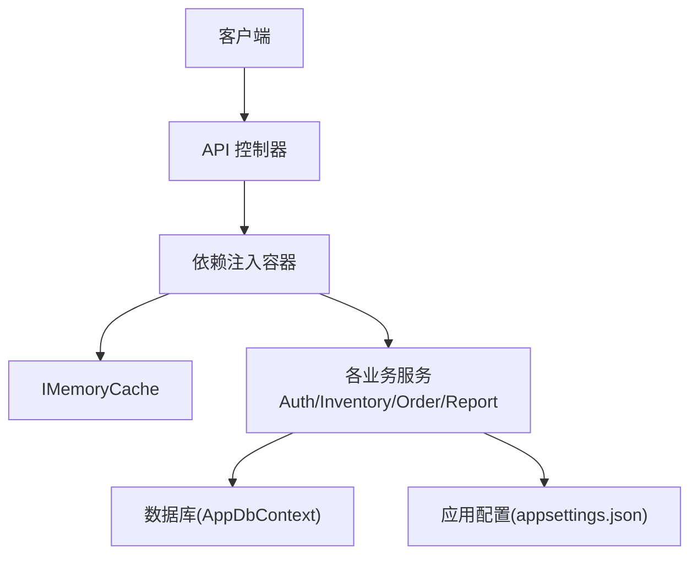
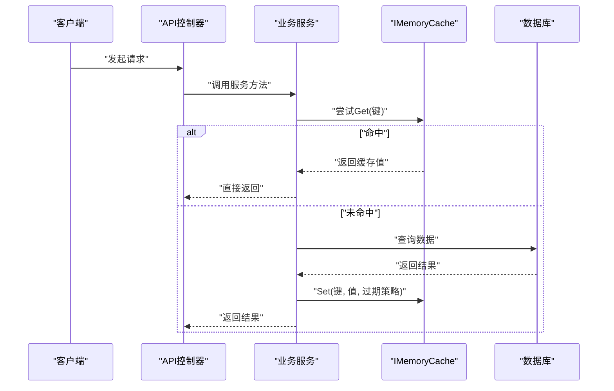
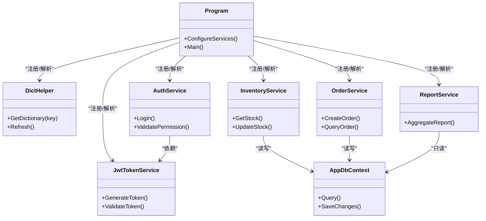

# 缓存策略

<cite>
**本文引用的文件**   
- [Program.cs](file://dip-system/api/Program.cs)
- [appsettings.json](file://dip-system/api/appsettings.json)
- [DictHelper.cs](file://dip-system/api/Services/DictHelper.cs)
- [AuthService.cs](file://dip-system/api/Services/AuthService.cs)
- [JwtTokenService.cs](file://dip-system/api/Services/JwtTokenService.cs)
- [InventoryService.cs](file://dip-system/api/Services/InventoryService.cs)
- [OrderService.cs](file://dip-system/api/Services/OrderService.cs)
- [ReportService.cs](file://dip-system/api/Services/ReportService.cs)
- [AppDbContext.cs](file://dip-system/api/Data/AppDbContext.cs)
- [aspnet-imemorycache-registration.md](file://memory/aspnet-imemorycache-registration.md)
</cite>

## 目录
1. [简介](#简介)
2. [项目结构](#项目结构)
3. [核心组件](#核心组件)
4. [架构总览](#架构总览)
5. [详细组件分析](#详细组件分析)
6. [依赖关系分析](#依赖关系分析)
7. [性能考量](#性能考量)
8. [故障排查指南](#故障排查指南)
9. [结论](#结论)
10. [附录](#附录)

## 简介
本文件为DIP物料管理系统的内存缓存策略提供系统化说明，聚焦IMemoryCache在用户会话、字典数据与配置信息中的使用场景；阐述绝对过期、滑动过期与依赖项过期的配置方法；解释缓存失效、热更新与预加载机制；并提供监控调试方法与最佳实践。目标是帮助开发与运维团队在高并发、低延迟的工业场景中稳定高效地使用内存缓存。

## 项目结构
后端采用ASP.NET Core API，服务层通过依赖注入获取IMemoryCache实例，结合应用配置进行缓存行为控制。关键位置包括：
- 启动与依赖注入配置（Program）
- 应用配置（appsettings.json）
- 字典与静态数据缓存（DictHelper）
- 认证与会话相关服务（AuthService、JwtTokenService）
- 业务服务（InventoryService、OrderService、ReportService等）
- 数据库上下文（AppDbContext）

图表来源
- [Program.cs](file://dip-system/api/Program.cs)
- [appsettings.json](file://dip-system/api/appsettings.json)
- [DictHelper.cs](file://dip-system/api/Services/DictHelper.cs)
- [AppDbContext.cs](file://dip-system/api/Data/AppDbContext.cs)

章节来源
- [Program.cs](file://dip-system/api/Program.cs)
- [appsettings.json](file://dip-system/api/appsettings.json)

## 核心组件
- IMemoryCache注册与生命周期：由框架提供的内存缓存实现，线程安全，进程内共享，适合短生命周期、读多写少的数据。
- 字典数据缓存：通过DictHelper集中管理字典项、枚举映射、系统参数等静态或低频变更数据。
- 认证与会话：JWT令牌校验结果、权限集、短期会话态可考虑缓存以减少重复计算。
- 配置信息：读取appsettings.json中的开关、阈值、超时等，配合IOptionsSnapshot/IOptionsMonitor实现热更新。
- 业务服务：库存、订单、报表等服务可按需对热点查询结果做短时缓存，降低数据库压力。

章节来源
- [DictHelper.cs](file://dip-system/api/Services/DictHelper.cs)
- [AuthService.cs](file://dip-system/api/Services/AuthService.cs)
- [JwtTokenService.cs](file://dip-system/api/Services/JwtTokenService.cs)
- [InventoryService.cs](file://dip-system/api/Services/InventoryService.cs)
- [OrderService.cs](file://dip-system/api/Services/OrderService.cs)
- [ReportService.cs](file://dip-system/api/Services/ReportService.cs)
- [AppDbContext.cs](file://dip-system/api/Data/AppDbContext.cs)

## 架构总览
下图展示请求从API到服务层再到缓存与数据库的整体流程，以及缓存命中与未命中的分支路径。

图表来源
- [Program.cs](file://dip-system/api/Program.cs)
- [DictHelper.cs](file://dip-system/api/Services/DictHelper.cs)
- [InventoryService.cs](file://dip-system/api/Services/InventoryService.cs)
- [OrderService.cs](file://dip-system/api/Services/OrderService.cs)
- [ReportService.cs](file://dip-system/api/Services/ReportService.cs)
- [AppDbContext.cs](file://dip-system/api/Data/AppDbContext.cs)

## 详细组件分析

### 字典数据缓存（DictHelper）
- 职责：集中管理字典项、系统参数、枚举映射等“读多写少”的数据。
- 缓存策略建议：
  - 使用绝对过期或滑动过期，依据数据变更频率设定合理TTL。
  - 对强一致性的字典，提供显式刷新接口并附带版本号或时间戳。
  - 避免大对象频繁序列化/反序列化，尽量保持轻量结构。
- 典型用法：
  - 首次访问时加载并缓存，后续请求直接命中。
  - 后台任务或管理操作触发后主动失效或重建缓存。

章节来源
- [DictHelper.cs](file://dip-system/api/Services/DictHelper.cs)

### 认证与会话缓存（AuthService、JwtTokenService）
- 职责：鉴权、令牌签发与校验、权限集缓存。
- 缓存策略建议：
  - 将用户角色/权限集合按用户ID缓存，设置较短滑动过期，减少RBAC计算开销。
  - JWT本身无状态，服务端仅缓存校验辅助数据（如黑名单、密钥版本）。
  - 登录态不持久化于内存缓存，避免跨进程/重启丢失问题。
- 一致性要求：
  - 权限变更需立即失效对应用户缓存，保证即时生效。

章节来源
- [AuthService.cs](file://dip-system/api/Services/AuthService.cs)
- [JwtTokenService.cs](file://dip-system/api/Services/JwtTokenService.cs)

### 业务服务缓存（InventoryService、OrderService、ReportService）
- 职责：库存查询、订单处理、报表聚合等。
- 缓存策略建议：
  - 高频只读查询（如库存快照、报表汇总）可短时缓存，TTL以秒级为主。
  - 写入路径必须同步失效相关缓存键，避免脏读。
  - 复杂聚合可分层缓存：明细层短TTL，汇总层较长TTL。
- 并发保护：
  - 使用分布式锁或本地互斥避免缓存击穿（大量并发同时穿透至DB）。

章节来源
- [InventoryService.cs](file://dip-system/api/Services/InventoryService.cs)
- [OrderService.cs](file://dip-system/api/Services/OrderService.cs)
- [ReportService.cs](file://dip-system/api/Services/ReportService.cs)

### 配置信息与热更新（appsettings.json、IOptions）
- 职责：读取系统开关、阈值、超时等配置。
- 缓存策略建议：
  - 使用IOptionsSnapshot用于请求级快照，IOptionsMonitor用于监听变化。
  - 将配置值封装为轻量DTO，避免每次解析JSON。
  - 敏感配置不要放入IMemoryCache，应使用受保护的配置源。
- 热更新流程：
  - 配置文件变更后，订阅变更事件，按需重建相关缓存。

章节来源
- [appsettings.json](file://dip-system/api/appsettings.json)

### 数据库访问（AppDbContext）
- 职责：ORM访问、事务、连接池。
- 与缓存协作：
  - 对热点查询增加二级缓存（IMemoryCache），但需确保写路径的一致性。
  - 长事务或高并发写入场景谨慎使用缓存，优先保证正确性。

章节来源
- [AppDbContext.cs](file://dip-system/api/Data/AppDbContext.cs)

## 依赖关系分析
- Program负责注册IMemoryCache与各服务，形成统一的依赖注入图。
- 服务层通过构造函数注入IMemoryCache，避免全局单例耦合。
- 配置通过IOptions注入，与缓存策略解耦，便于测试与替换。

图表来源
- [Program.cs](file://dip-system/api/Program.cs)
- [DictHelper.cs](file://dip-system/api/Services/DictHelper.cs)
- [AuthService.cs](file://dip-system/api/Services/AuthService.cs)
- [JwtTokenService.cs](file://dip-system/api/Services/JwtTokenService.cs)
- [InventoryService.cs](file://dip-system/api/Services/InventoryService.cs)
- [OrderService.cs](file://dip-system/api/Services/OrderService.cs)
- [ReportService.cs](file://dip-system/api/Services/ReportService.cs)
- [AppDbContext.cs](file://dip-system/api/Data/AppDbContext.cs)

章节来源
- [Program.cs](file://dip-system/api/Program.cs)

## 性能考量
- TTL设计原则
  - 绝对过期：适用于固定周期刷新的数据（如每日报表摘要）。
  - 滑动过期：适用于热点数据（如字典、权限集），延长活跃数据的存活时间。
  - 依赖项过期：当底层数据实体变更时自动失效相关缓存键。
- 命中率优化
  - 合理拆分缓存键，避免大对象与热点键竞争。
  - 预热常用字典与配置，缩短冷启动延迟。
- 内存占用
  - 限制缓存容量，避免OOM；对大对象采用压缩或分片存储。
- 并发与一致性
  - 使用“先查缓存，未命中再查库并回填”的模式，必要时加锁防击穿。
  - 写路径务必同步失效关联缓存键，避免脏读。

[本节为通用指导，无需代码引用]

## 故障排查指南
- 常见问题
  - 缓存未命中率高：检查键命名规范、TTL是否过短、是否存在并发穿透。
  - 内存增长异常：定位大对象缓存，评估是否需要分片或淘汰策略。
  - 数据不一致：确认写路径是否失效了相关缓存键，是否存在异步更新竞态。
- 监控与调试
  - 启用日志记录缓存命中/未命中、过期、失效事件。
  - 暴露指标端点统计缓存大小、命中率、平均TTL。
  - 使用诊断工具查看进程内缓存分布与热点键。
- 参考文档
  - ASP.NET Core IMemoryCache注册与使用指南

章节来源
- [aspnet-imemorycache-registration.md](file://memory/aspnet-imemorycache-registration.md)

## 结论
通过合理的IMemoryCache策略，DIP物料管理系统可在保证一致性的前提下显著提升响应速度与吞吐。建议以字典与配置为核心切入点，逐步扩展至热点业务数据；建立完善的监控与告警体系，持续优化TTL与键设计，确保系统在高压下稳定运行。

[本节为总结，无需代码引用]

## 附录
- 缓存键命名规范：模块_实体_标识_维度（例如：dict_user_role_{userId}）
- 过期策略选择矩阵：
  - 字典数据：滑动过期+手动刷新
  - 配置信息：IOptionsMonitor热更新
  - 报表聚合：绝对过期+定时重建
  - 权限集：滑动过期+权限变更即时失效
- 最佳实践清单：
  - 小对象、短TTL、明确失效条件
  - 写路径必失效，读路径可容忍短暂不一致
  - 预热与限流并重，避免雪崩
  - 监控先行，指标驱动优化

[本节为补充信息，无需代码引用]