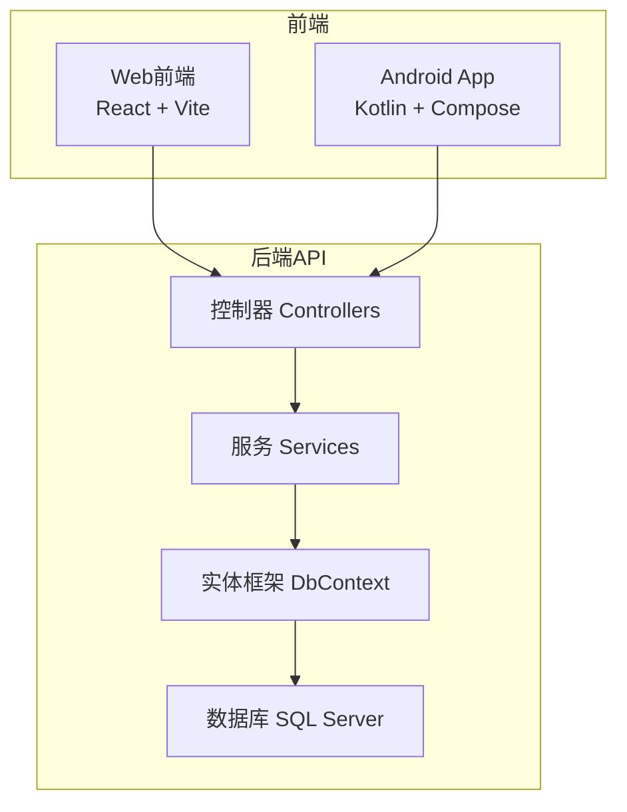
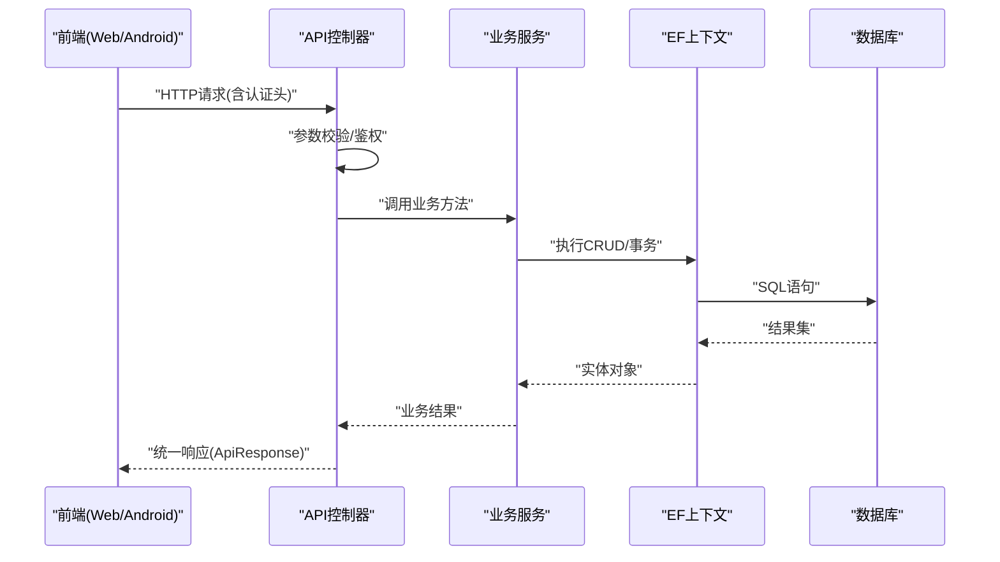
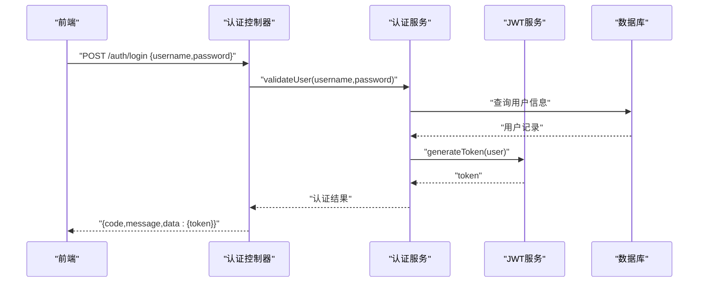
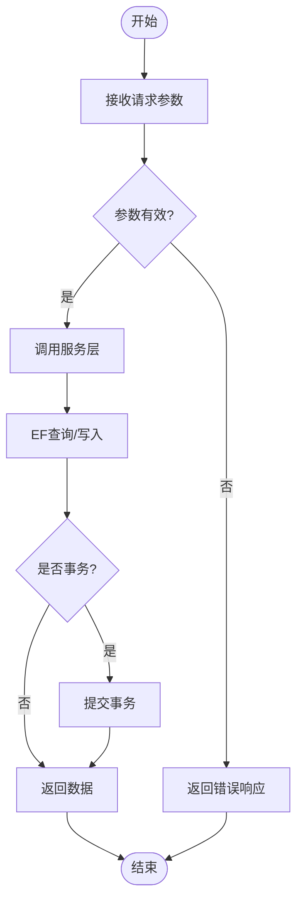
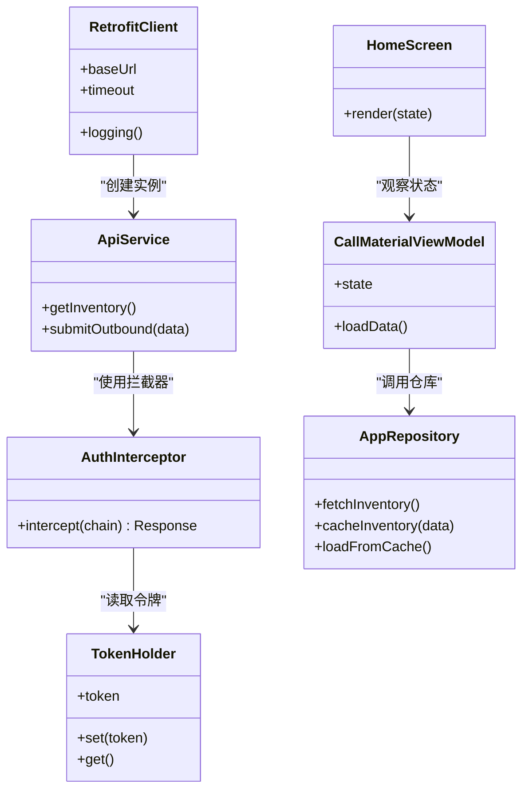
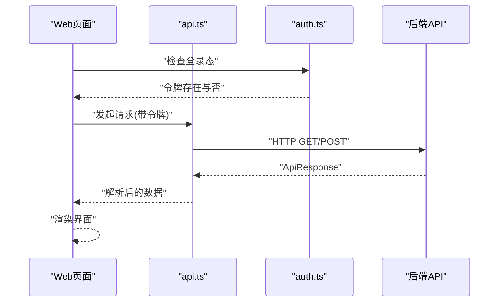
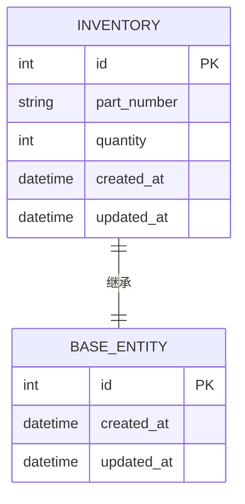
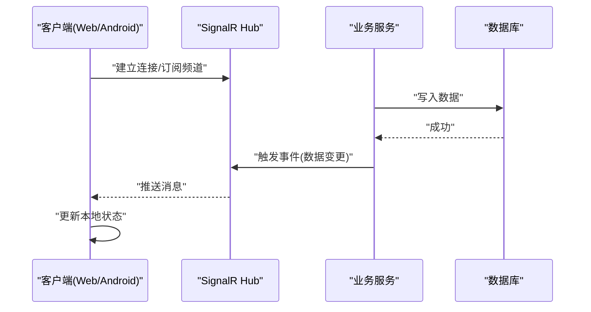
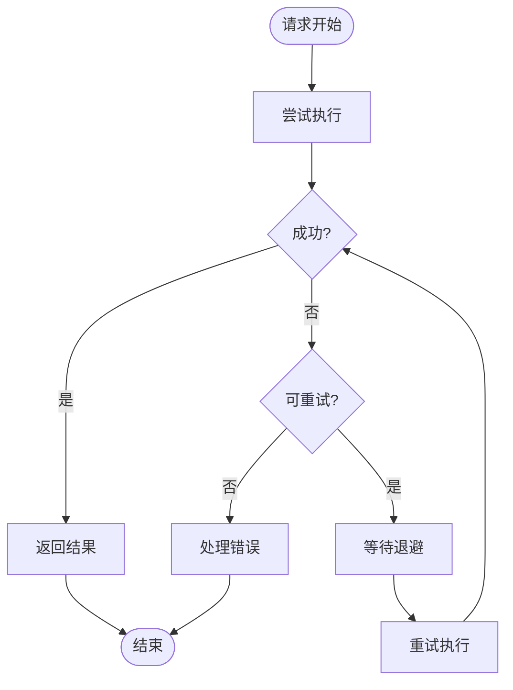
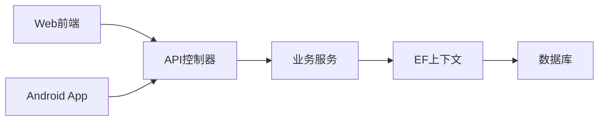

# 数据流设计

<cite>
**本文引用的文件**   
- [Program.cs](file://dip-system/api/Program.cs)
- [AppDbContext.cs](file://dip-system/api/Data/AppDbContext.cs)
- [AuthController.cs](file://dip-system/api/Controllers/AuthController.cs)
- [AuthService.cs](file://dip-system/api/Services/AuthService.cs)
- [JwtTokenService.cs](file://dip-system/api/Services/JwtTokenService.cs)
- [InventoryController.cs](file://dip-system/api/Controllers/InventoryController.cs)
- [InventoryService.cs](file://dip-system/api/Services/InventoryService.cs)
- [ApiResponse.cs](file://dip-system/api/Models/ApiResponse.cs)
- [BaseEntity.cs](file://dip-system/api/Models/BaseEntity.cs)
- [Inventory.cs](file://dip-system/api/Models/Inventory.cs)
- [RetrofitClient.kt](file://mobile-android/app/src/main/java/com/dip/material/data/network/RetrofitClient.kt)
- [ApiService.kt](file://mobile-android/app/src/main/java/com/dip/material/data/network/ApiService.kt)
- [AuthInterceptor.kt](file://mobile-android/app/src/main/java/com/dip/material/data/network/AuthInterceptor.kt)
- [TokenHolder.kt](file://mobile-android/app/src/main/java/com/dip/material/data/network/TokenHolder.kt)
- [AppRepository.kt](file://mobile-android/app/src/main/java/com/dip/material/data/repository/AppRepository.kt)
- [CallMaterialViewModel.kt](file://mobile-android/app/src/main/java/com/dip/material/ui/callmaterial/CallMaterialViewModel.kt)
- [HomeScreen.kt](file://mobile-android/app/src/main/java/com/dip/material/ui/home/HomeScreen.kt)
- [api.ts](file://dip-system/frontend-web/src/lib/api.ts)
- [auth.ts](file://dip-system/frontend-web/src/lib/auth.ts)
- [index.html](file://dip-system/frontend-web/index.html)
- [package.json](file://dip-system/frontend-web/package.json)
- [init-db.sql](file://scripts/init-db.sql)
</cite>

## 目录
1. [简介](#简介)
2. [项目结构](#项目结构)
3. [核心组件](#核心组件)
4. [架构总览](#架构总览)
5. [详细组件分析](#详细组件分析)
6. [依赖关系分析](#依赖关系分析)
7. [性能考量](#性能考量)
8. [故障排查指南](#故障排查指南)
9. [结论](#结论)
10. [附录](#附录)

## 简介
本文件面向DIP物料管理系统的数据流设计，覆盖从前端（Web与Android）到后端API再到数据库的完整数据流转过程。重点说明：
- RESTful API的请求响应流程与数据转换机制
- Entity Framework的数据访问模式与ORM映射
- Android应用的数据缓存策略与本地存储方案
- 实时数据同步机制与WebSocket通信
- 错误处理与重试机制设计
- 数据流图与状态转换图

## 项目结构
系统由三部分组成：
- 后端API（ASP.NET Core）：提供REST接口、业务服务、EF数据访问、统一异常与响应封装
- 前端Web（React/Vite）：调用后端API，管理认证与页面状态
- 移动端Android（Kotlin/Compose）：通过Retrofit调用API，结合仓库层与本地缓存

图表来源
- [Program.cs:1-120](file://dip-system/api/Program.cs#L1-L120)
- [AppDbContext.cs:1-120](file://dip-system/api/Data/AppDbContext.cs#L1-L120)

章节来源
- [Program.cs:1-120](file://dip-system/api/Program.cs#L1-L120)
- [package.json:1-60](file://dip-system/frontend-web/package.json#L1-L60)
- [index.html:1-40](file://dip-system/frontend-web/index.html#L1-L40)

## 核心组件
- 认证与授权
  - 控制器：登录、令牌签发与校验
  - 服务：用户验证、权限判断
  - JWT服务：令牌生成与解析
- 库存与物料
  - 控制器：库存查询、出入库、调拨等
  - 服务：业务规则与事务边界
  - 仓储：EF Core上下文与实体映射
- 统一响应与异常
  - ApiResponse：统一返回结构
  - 全局异常过滤器：标准化错误输出
- 前端网络与认证
  - Web：api.ts封装HTTP请求，auth.ts管理会话
  - Android：RetrofitClient、ApiService、AuthInterceptor、TokenHolder
- 数据持久化
  - AppDbContext：EF上下文配置与实体注册
  - init-db.sql：初始化脚本

章节来源
- [AuthController.cs:1-120](file://dip-system/api/Controllers/AuthController.cs#L1-L120)
- [AuthService.cs:1-120](file://dip-system/api/Services/AuthService.cs#L1-L120)
- [JwtTokenService.cs:1-120](file://dip-system/api/Services/JwtTokenService.cs#L1-L120)
- [InventoryController.cs:1-120](file://dip-system/api/Controllers/InventoryController.cs#L1-L120)
- [InventoryService.cs:1-120](file://dip-system/api/Services/InventoryService.cs#L1-L120)
- [ApiResponse.cs:1-80](file://dip-system/api/Models/ApiResponse.cs#L1-L80)
- [BaseEntity.cs:1-60](file://dip-system/api/Models/BaseEntity.cs#L1-L60)
- [Inventory.cs:1-80](file://dip-system/api/Models/Inventory.cs#L1-L80)
- [RetrofitClient.kt:1-120](file://mobile-android/app/src/main/java/com/dip/material/data/network/RetrofitClient.kt#L1-L120)
- [ApiService.kt:1-120](file://mobile-android/app/src/main/java/com/dip/material/data/network/ApiService.kt#L1-L120)
- [AuthInterceptor.kt:1-120](file://mobile-android/app/src/main/java/com/dip/material/data/network/AuthInterceptor.kt#L1-L120)
- [TokenHolder.kt:1-120](file://mobile-android/app/src/main/java/com/dip/material/data/network/TokenHolder.kt#L1-L120)
- [AppRepository.kt:1-120](file://mobile-android/app/src/main/java/com/dip/material/data/repository/AppRepository.kt#L1-L120)
- [CallMaterialViewModel.kt:1-120](file://mobile-android/app/src/main/java/com/dip/material/ui/callmaterial/CallMaterialViewModel.kt#L1-L120)
- [HomeScreen.kt:1-120](file://mobile-android/app/src/main/java/com/dip/material/ui/home/HomeScreen.kt#L1-L120)
- [api.ts:1-120](file://dip-system/frontend-web/src/lib/api.ts#L1-L120)
- [auth.ts:1-120](file://dip-system/frontend-web/src/lib/auth.ts#L1-L120)
- [AppDbContext.cs:1-120](file://dip-system/api/Data/AppDbContext.cs#L1-L120)
- [init-db.sql:1-120](file://scripts/init-db.sql#L1-L120)

## 架构总览
整体数据流遵循“前端 -> API控制器 -> 服务层 -> EF上下文 -> 数据库”的分层架构。认证采用JWT，前后端通过HTTP交互；Android侧通过拦截器注入令牌并处理过期刷新；Web侧通过封装函数集中处理请求与错误。

图表来源
- [AuthController.cs:1-120](file://dip-system/api/Controllers/AuthController.cs#L1-L120)
- [InventoryController.cs:1-120](file://dip-system/api/Controllers/InventoryController.cs#L1-L120)
- [InventoryService.cs:1-120](file://dip-system/api/Services/InventoryService.cs#L1-L120)
- [AppDbContext.cs:1-120](file://dip-system/api/Data/AppDbContext.cs#L1-L120)

## 详细组件分析

### 认证与令牌流转（登录与鉴权）
- 登录流程
  - 前端提交用户名/密码
  - 控制器校验并调用服务层进行用户验证
  - 服务层调用JWT服务生成令牌
  - 返回统一响应包含令牌
- 鉴权流程
  - 后续请求携带Authorization头
  - 控制器或中间件校验令牌有效性
  - 失败返回未授权错误

图表来源
- [AuthController.cs:1-120](file://dip-system/api/Controllers/AuthController.cs#L1-L120)
- [AuthService.cs:1-120](file://dip-system/api/Services/AuthService.cs#L1-L120)
- [JwtTokenService.cs:1-120](file://dip-system/api/Services/JwtTokenService.cs#L1-L120)

章节来源
- [AuthController.cs:1-120](file://dip-system/api/Controllers/AuthController.cs#L1-L120)
- [AuthService.cs:1-120](file://dip-system/api/Services/AuthService.cs#L1-L120)
- [JwtTokenService.cs:1-120](file://dip-system/api/Services/JwtTokenService.cs#L1-L120)

### 库存数据操作（查询与变更）
- 查询流程
  - 前端发起GET请求
  - 控制器接收参数并调用服务层
  - 服务层通过EF查询数据库
  - 返回分页或列表数据
- 变更流程
  - 前端发起POST/PUT/DELETE
  - 控制器校验并调用服务层
  - 服务层执行事务与更新
  - 返回统一响应

图表来源
- [InventoryController.cs:1-120](file://dip-system/api/Controllers/InventoryController.cs#L1-L120)
- [InventoryService.cs:1-120](file://dip-system/api/Services/InventoryService.cs#L1-L120)
- [AppDbContext.cs:1-120](file://dip-system/api/Data/AppDbContext.cs#L1-L120)

章节来源
- [InventoryController.cs:1-120](file://dip-system/api/Controllers/InventoryController.cs#L1-L120)
- [InventoryService.cs:1-120](file://dip-system/api/Services/InventoryService.cs#L1-L120)
- [Inventory.cs:1-80](file://dip-system/api/Models/Inventory.cs#L1-L80)
- [BaseEntity.cs:1-60](file://dip-system/api/Models/BaseEntity.cs#L1-L60)

### Android数据缓存与本地存储
- 网络层
  - RetrofitClient：基础URL、超时、日志
  - ApiService：定义接口
  - AuthInterceptor：自动附加Authorization头
  - TokenHolder：持有当前令牌
- 仓库层
  - AppRepository：封装网络与本地缓存逻辑
- UI层
  - ViewModel：状态管理与加载控制
  - Screen：展示与交互

图表来源
- [RetrofitClient.kt:1-120](file://mobile-android/app/src/main/java/com/dip/material/data/network/RetrofitClient.kt#L1-L120)
- [ApiService.kt:1-120](file://mobile-android/app/src/main/java/com/dip/material/data/network/ApiService.kt#L1-L120)
- [AuthInterceptor.kt:1-120](file://mobile-android/app/src/main/java/com/dip/material/data/network/AuthInterceptor.kt#L1-L120)
- [TokenHolder.kt:1-120](file://mobile-android/app/src/main/java/com/dip/material/data/network/TokenHolder.kt#L1-L120)
- [AppRepository.kt:1-120](file://mobile-android/app/src/main/java/com/dip/material/data/repository/AppRepository.kt#L1-L120)
- [CallMaterialViewModel.kt:1-120](file://mobile-android/app/src/main/java/com/dip/material/ui/callmaterial/CallMaterialViewModel.kt#L1-L120)
- [HomeScreen.kt:1-120](file://mobile-android/app/src/main/java/com/dip/material/ui/home/HomeScreen.kt#L1-L120)

章节来源
- [RetrofitClient.kt:1-120](file://mobile-android/app/src/main/java/com/dip/material/data/network/RetrofitClient.kt#L1-L120)
- [ApiService.kt:1-120](file://mobile-android/app/src/main/java/com/dip/material/data/network/ApiService.kt#L1-L120)
- [AuthInterceptor.kt:1-120](file://mobile-android/app/src/main/java/com/dip/material/data/network/AuthInterceptor.kt#L1-L120)
- [TokenHolder.kt:1-120](file://mobile-android/app/src/main/java/com/dip/material/data/network/TokenHolder.kt#L1-L120)
- [AppRepository.kt:1-120](file://mobile-android/app/src/main/java/com/dip/material/data/repository/AppRepository.kt#L1-L120)
- [CallMaterialViewModel.kt:1-120](file://mobile-android/app/src/main/java/com/dip/material/ui/callmaterial/CallMaterialViewModel.kt#L1-L120)
- [HomeScreen.kt:1-120](file://mobile-android/app/src/main/java/com/dip/material/ui/home/HomeScreen.kt#L1-L120)

### Web前端数据流与认证
- api.ts：封装HTTP请求、错误处理、统一响应解析
- auth.ts：管理登录态、令牌存储与刷新
- 页面组件：调用api.ts获取数据并渲染

图表来源
- [api.ts:1-120](file://dip-system/frontend-web/src/lib/api.ts#L1-L120)
- [auth.ts:1-120](file://dip-system/frontend-web/src/lib/auth.ts#L1-L120)

章节来源
- [api.ts:1-120](file://dip-system/frontend-web/src/lib/api.ts#L1-L120)
- [auth.ts:1-120](file://dip-system/frontend-web/src/lib/auth.ts#L1-L120)

### Entity Framework数据访问与ORM映射
- AppDbContext：注册实体、配置连接字符串、启用迁移
- 实体类：继承BaseEntity，定义字段与关系
- 初始化脚本：建表与初始数据

图表来源
- [AppDbContext.cs:1-120](file://dip-system/api/Data/AppDbContext.cs#L1-L120)
- [Inventory.cs:1-80](file://dip-system/api/Models/Inventory.cs#L1-L80)
- [BaseEntity.cs:1-60](file://dip-system/api/Models/BaseEntity.cs#L1-L60)
- [init-db.sql:1-120](file://scripts/init-db.sql#L1-L120)

章节来源
- [AppDbContext.cs:1-120](file://dip-system/api/Data/AppDbContext.cs#L1-L120)
- [Inventory.cs:1-80](file://dip-system/api/Models/Inventory.cs#L1-L80)
- [BaseEntity.cs:1-60](file://dip-system/api/Models/BaseEntity.cs#L1-L60)
- [init-db.sql:1-120](file://scripts/init-db.sql#L1-L120)

### 实时数据同步与WebSocket通信
- 建议方案
  - 服务端：SignalR Hub实现广播与订阅
  - 客户端：Web使用SignalR JS，Android使用SignalR客户端库
  - 事件模型：按模块划分事件（如库存变动、工单状态）
- 数据流
  - 服务端推送事件
  - 客户端接收并更新状态
  - 冲突解决：以服务器时间戳为准

图表来源
- [InventoryService.cs:1-120](file://dip-system/api/Services/InventoryService.cs#L1-L120)
- [AppDbContext.cs:1-120](file://dip-system/api/Data/AppDbContext.cs#L1-L120)

章节来源
- [InventoryService.cs:1-120](file://dip-system/api/Services/InventoryService.cs#L1-L120)
- [AppDbContext.cs:1-120](file://dip-system/api/Data/AppDbContext.cs#L1-L120)

### 错误处理与重试机制
- 后端
  - 统一异常过滤器捕获未处理异常
  - 返回标准错误码与消息
  - 关键操作支持重试与补偿
- 前端
  - Web：api.ts统一处理网络错误与业务错误
  - Android：Retrofit错误回调与指数退避重试
- 重试策略
  - 幂等操作可重试（如查询）
  - 非幂等操作需用户确认或避免重复提交

图表来源
- [ApiResponse.cs:1-80](file://dip-system/api/Models/ApiResponse.cs#L1-L80)
- [api.ts:1-120](file://dip-system/frontend-web/src/lib/api.ts#L1-L120)
- [RetrofitClient.kt:1-120](file://mobile-android/app/src/main/java/com/dip/material/data/network/RetrofitClient.kt#L1-L120)

章节来源
- [ApiResponse.cs:1-80](file://dip-system/api/Models/ApiResponse.cs#L1-L80)
- [api.ts:1-120](file://dip-system/frontend-web/src/lib/api.ts#L1-L120)
- [RetrofitClient.kt:1-120](file://mobile-android/app/src/main/java/com/dip/material/data/network/RetrofitClient.kt#L1-L120)

## 依赖关系分析
- 控制器依赖服务层，服务层依赖EF上下文
- 前端依赖网络封装与认证模块
- Android依赖Retrofit、拦截器与仓库层
- 数据库依赖实体映射与迁移脚本

图表来源
- [Program.cs:1-120](file://dip-system/api/Program.cs#L1-L120)
- [InventoryController.cs:1-120](file://dip-system/api/Controllers/InventoryController.cs#L1-L120)
- [InventoryService.cs:1-120](file://dip-system/api/Services/InventoryService.cs#L1-L120)
- [AppDbContext.cs:1-120](file://dip-system/api/Data/AppDbContext.cs#L1-L120)

章节来源
- [Program.cs:1-120](file://dip-system/api/Program.cs#L1-L120)
- [InventoryController.cs:1-120](file://dip-system/api/Controllers/InventoryController.cs#L1-L120)
- [InventoryService.cs:1-120](file://dip-system/api/Services/InventoryService.cs#L1-L120)
- [AppDbContext.cs:1-120](file://dip-system/api/Data/AppDbContext.cs#L1-L120)

## 性能考量
- 数据库
  - 合理使用索引与分页查询
  - 批量操作减少往返次数
- 网络
  - 压缩响应体
  - 缓存热点数据（Redis或本地缓存）
- 前端
  - 防抖与节流优化频繁请求
  - 懒加载与虚拟列表提升渲染性能

## 故障排查指南
- 常见问题
  - 认证失败：检查令牌有效期与签名
  - 数据库连接失败：检查连接字符串与服务状态
  - 网络超时：调整超时时间与重试策略
- 调试技巧
  - 启用详细日志与追踪ID
  - 使用Postman或浏览器开发者工具测试API
  - Android使用Logcat与Network Inspector

## 结论
本数据流设计通过分层架构与统一规范，确保了系统的可维护性与扩展性。认证、数据访问、缓存与实时同步机制共同支撑了DIP物料管理系统的稳定运行。建议在生产环境加强监控与告警，持续优化性能与用户体验。

## 附录
- 技术栈参考
  - 后端：ASP.NET Core, Entity Framework Core, SignalR
  - 前端：React, Vite, TypeScript
  - 移动端：Kotlin, Jetpack Compose, Retrofit, SignalR
- 相关文档
  - 数据库初始化脚本位于scripts/init-db.sql
  - 前端包配置位于frontend-web/package.json